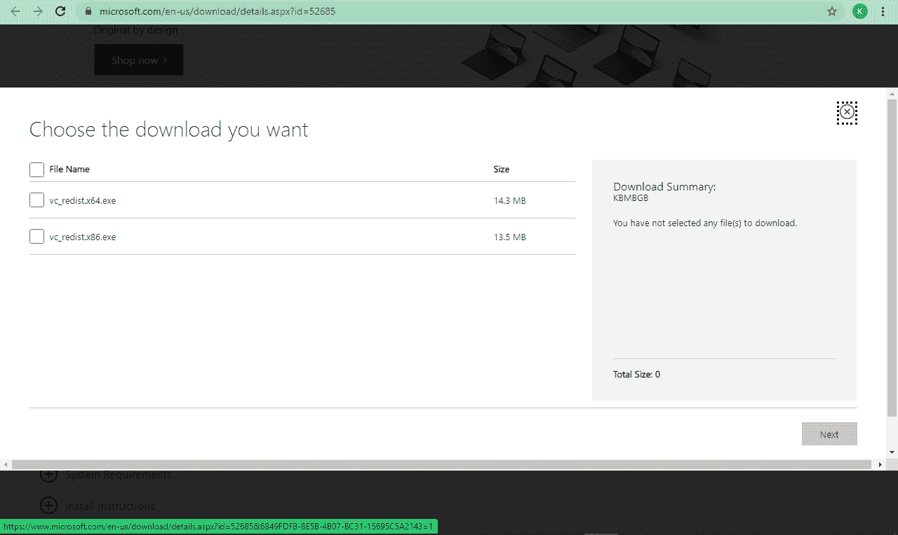
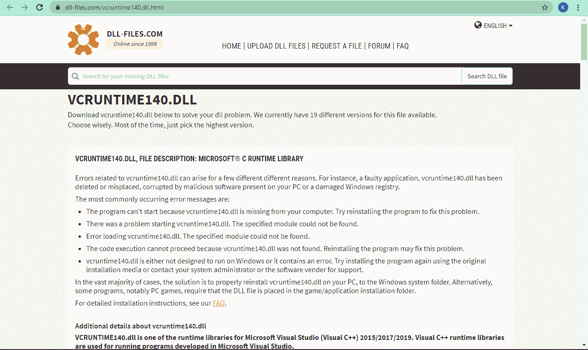
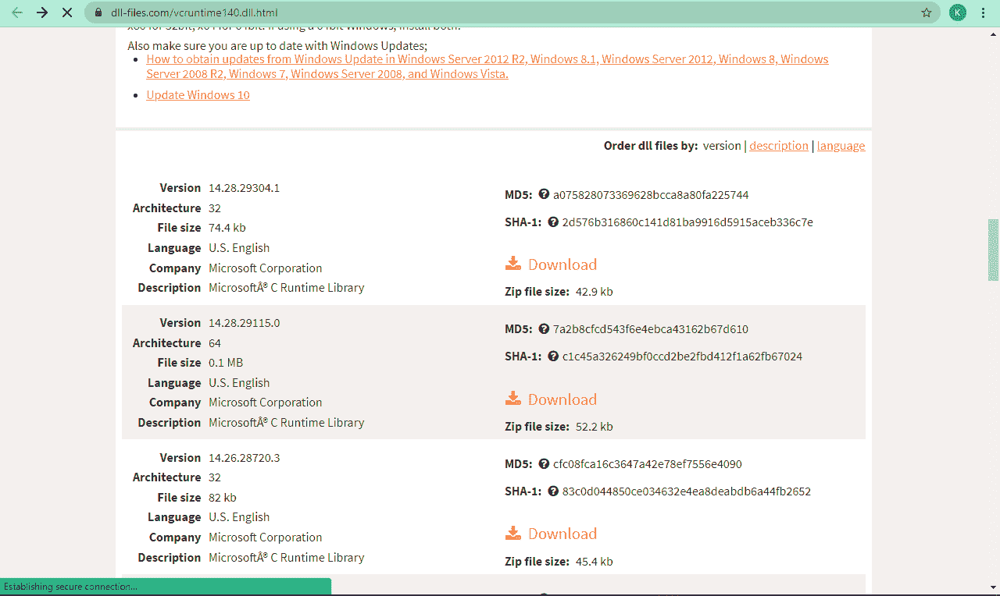

# 找不到 vcruntime140.dll[在 Windows 10 PC 上解决]

> 原文：<https://www.freecodecamp.org/news/vcruntime140-dll-was-not-found-solved-on-windows-10-pc/>

你有没有试过在你的电脑上打开一个应用程序，却看到错误“程序无法启动，因为 vcruntime140.dll 不在你的电脑上。请尝试重新安装以解决此问题。？

这是 Windows 10 的一个常见问题，可能会非常令人沮丧。

但是不要担心——在本指南中，我将解释错误是什么，最重要的是，向您展示两种不同的方法来修复它。

## 什么是“vcruntime140.dll 未找到”错误，是什么原因导致的？

分机，”。dll”与动态链接库(dll)有关，动态链接库是包含程序使用的代码和数据的库。

一旦创建了一个程序，它就与一个 DLL 相关联，该 DLL 仅在该特定程序启动时被触发。

如果所需的 DLL 丢失或损坏，则会显示一条错误消息，提示用户如何修复它。

由于恶意软件、安装不完整以及 Microsoft Visual Studio 2015 可再发行版中的大部分文件丢失，可能会丢失所需的 DLL。

## 如何修复 vcruntime140.dll 没有发现错误

您可以通过安装或修复 Microsoft Visual Studio 2015 包来修复“找不到 vcruntime140.dll”错误。

如果你在尝试使用 WAMP 服务器程序时遇到这个错误——这个程序可以让你在本地制作 WordPress 网站并编写 PHP 代码——这就是你需要做的。

你也可以通过下载 vcruntime140.dll 文件并将其移动到 Windows 10 电脑上的正确文件夹来修复错误。

### 解决方案 1:安装或修复 Microsoft Visual Studio 2015 可再发行版

**步骤 1** :从[官方 Microsoft Visual C++可再发行下载页面](https://www.microsoft.com/en-us/download/details.aspx?id=52685)下载 Visual Studio 2015 可再发行安装包。

单击 download 按钮后，您将立即看到为 32 位操作系统和 64 位操作系统下载文件的选项。

选择与您的 Windows 10 电脑的操作系统相对应的选项。

**第二步**:打开下载的文件，按照安装向导进行安装。

**步骤 3** :勾选复选框，确认您同意许可和条件，然后点击安装。

如果您已经安装了 Microsoft Visual Studio 2015 软件包，但仍然出现此错误，则应该“修复”该软件包。

### 如何修复 Microsoft Visual Studio 2015 可再发行版

**第一步**:点击开始进入控制面板，搜索“控制面板”，点击`ENTER`。

**第二步**:在程序下，选择“卸载程序”。

**第三步**:找到微软 Visual Studio 2015 可再发行程序，右键点击，然后选择“更改”。

**第四步**:点击“修复”。

### 解决方案 2:下载 vcruntime140.dll 文件

**第一步**:从这个[网站](https://www.dll-files.com/vcruntime140.dll.html)下载 vcruntime140.dll 文件。

选择与您的操作系统相对应的选项，将会下载一个 Zip 文件。

**第二步**:用原生的 Windows 10 解压选项或者 WinRAR 之类的 app 解压 Zip 文件。

**第三步**:将 vcruntime140.dll 文件拖放到显示错误信息的 app 的安装目录下。

请确保确认这解决了该问题，否则，请下载并安装 Microsoft Visual Studio 2015 可再发行软件。

## 结论

在本指南中，你学习了如何修复讨厌的 vcruntimed140.dll 未找到错误，这样你就可以在 Windows 10 电脑上无缝地使用应用和玩游戏。

除了本文解释的两种解决方案，你也可以将你的 Windows 10 升级到最新版本，这也可以修复错误。

感谢您的阅读。如果你觉得这篇文章有帮助，可以考虑分享给你的朋友。