# 如何通过五个步骤用 Vert.x、VueJS 和 OAuth2 创建应用程序样板文件

> 原文：<https://www.freecodecamp.org/news/vert-x-vuejs-oauth2-in-5-steps-c04ee78475b7/>

托马斯·赖内克

# 如何通过五个步骤用 Vert.x、VueJS 和 OAuth2 创建应用程序样板文件


VueJS + Vert.x + Keycloak

在本教程中，您将学习如何设置一个基于 Vert.x (Java)作为后端、VueJs 作为前端的应用程序样板，重点是通过 OAuth2 针对 Keycloak 的用户认证。一旦用户登录，[**vertx-vue-key cloak**](https://github.com/vertx-stack/vertx-vue-keycloak)应用程序还演示了如何查询 Vert.x 后端，发送数据(突变)以及如何在 Vert.x 和 VueJS 之间发布/订阅。

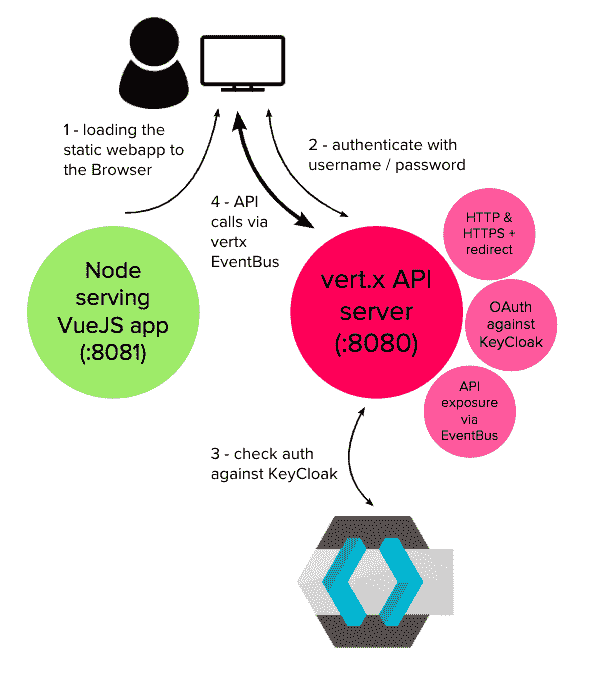

本文的 e2e 代码托管在 GH [here](https://github.com/vertx-stack/vertx-vue-keycloak) 上。

### 步骤 1 —准备工作

#### 安装钥匙锁

在本例中，我们将使用 Keycloak 作为身份验证和授权管理提供者。Keycloak 是 RedHat 提供的一个开源身份和访问管理产品，它提供了 OAuth2 和更多功能。Keycloak 附带了一个 Web 管理控制台来管理服务器。我们可以基于 docker 轻松运行它:

```
docker run -d — name keycloak -p 38080:8080 -e KEYCLOAK_USER=admin -e KEYCLOAK_PASSWORD=admin -e KEYCLOAK_LOGLEVEL=DEBUG jboss/keycloak
```

启动该容器后， **Keycloak** 管理控制台将在 [http://127.0.0.1:38080](http://127.0.0.1:38080) 可用。请注意 Keycloak 的版本——在撰写本文时，它是 **4.5.0.Final** ,所以 UI 看起来可能会与较新或较早的版本有所不同。

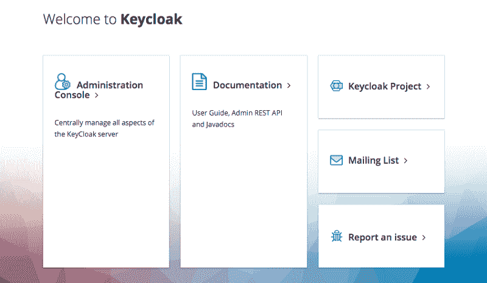

#### 创建 Keycloak 客户端凭据

对于我们将要开发的 Vert.x 应用程序，我们需要在 Keycloak 中注册一个客户端。用给定的突出显示值填写表格:

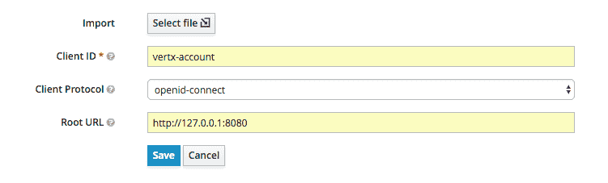

保存它，打开并检查刚刚创建的 **vertx-account** 客户端对象:

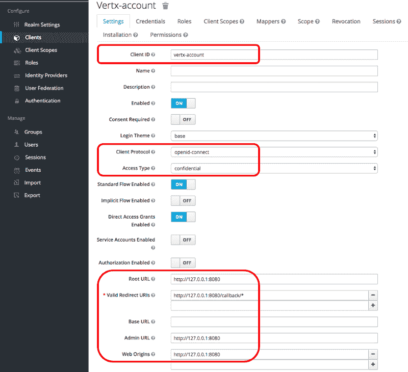

稍后当我们在 vertx 代码中嵌入客户端详细信息时，我们将回到这个页面，特别是关于**凭证**选项卡的信息。

#### 创建角色

在 Keycloak 左侧栏的 Roles 选项卡上，创建两个示例角色**修改-帐户**和**查看-帐户**:

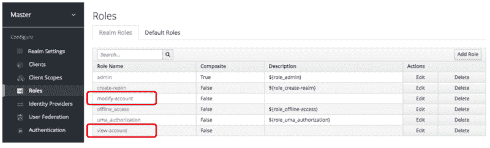

#### 创建用户

在“管理用户”选项卡上，创建一个新用户，给它一个用户名 **testuser** 和一个电子邮件地址【test@tester.com 并保存它:

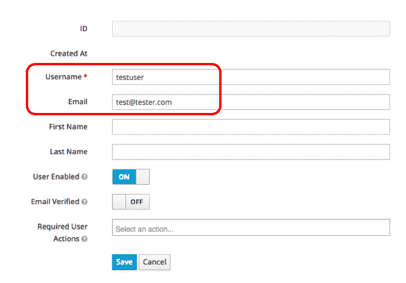

仍然在刚刚创建的用户页面上，切换到 Credentials 选项卡，并将该用户的密码设置为 **test。**同时取消选择**临时**开关，点击**重置密码**按钮。请注意:这个 UI 的行为有点奇怪。当你点击这个按钮时，**临时**标志切换回真，但是忽略它。你给的密码应该设置好。

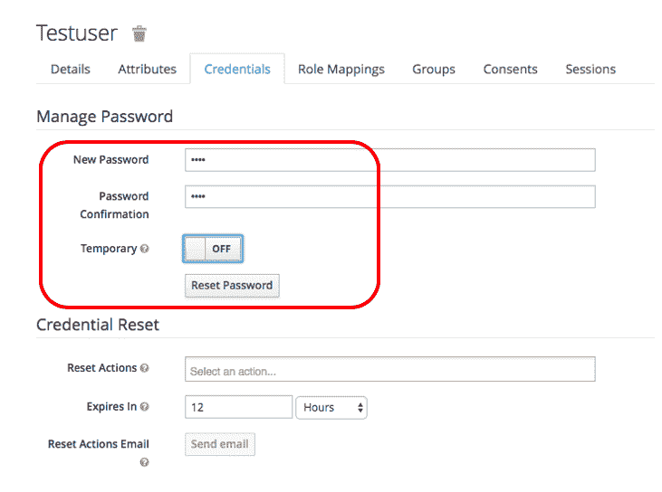

切换到角色映射选项卡，将刚刚创建的角色**修改-账户**和**查看-账户**分配给该用户:

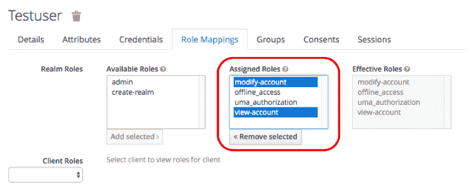

这就完成了 Keycloak 的设置。恭喜你！我们现在准备好工作在我们的 vert.x 后端和 VueJS 前端。

关于设置 Keycloak 并为 Vert.x 配置它的更多细节可以在[这篇伟大的文章](https://piotrminkowski.wordpress.com/2017/09/15/building-secure-apis-with-vert-x-and-oauth2/)中找到，我也将它用作上述说明的来源(感谢 Piotr Minkowski) *。*

### 步骤 2 —创建 Vert.x 后端和 VueJs 前端

我使用 Eclipse 创建了一个简单的 Maven 项目(没有 archtype 选择),并从那里将 vertx 添加到了 *pom.xml* 中的依赖列表中。在撰写本文时，vertx 的版本是 3.5.4。

克隆以下存储库(包括本文的源代码):

[**vertx-stack/vertx-vue-keycloak**](https://github.com/vertx-stack/vertx-vue-keycloak)
[*通过在 GitHub 上创建账号，为 vertx-stack/vertx-vue-key cloak 开发做贡献。*github.com](https://github.com/vertx-stack/vertx-vue-keycloak)

```
git clone https://github.com/vertx-stack/vertx-vue-keycloak.git
```

#### 创建密钥库文件

您可能希望遵循您认为合适的任何过程来创建一个合适的证书链并将其转换成 jks 格式。我在这里给出的例子是基于自签名证书的，它在本地或测试环境中运行良好。您刚刚克隆的 repo 附带了该文件，因此您可以跳过这一部分。对于生产，请获得一个 CA 签名的证书(例如，从 [LetsEncrypt](https://letsencrypt.org/) 获得的免费证书)。

运行下面的 OpenSSL 命令来生成您的私钥和公共证书。使用“ **testpassword** ”作为密码，并将所有值保留为默认值(按 enter 键直到完成):

```
openssl req -x509 -newkey rsa:2048 -keyout key.pem -out cert.pem -days 365
```

查看证书文件:

```
openssl x509 -text -noout -in cert.pem
```

将您的密钥和证书组合成 PKCS#12 (P12)包，并再次使用“ **testpassword** 作为导出密码:

```
openssl pkcs12 -inkey key.pem -in cert.pem -export -out certificate.p12
```

把它转换成 JKS 文件。使用“ **testpassword** ”作为目标密钥库密码:

```
keytool -importkeystore -srckeystore certificate.p12 -srcstoretype pkcs12 -destkeystore test.jks -deststoretype jks
```

我们现在将证书存储在 test.jks 中，准备好供 vert.x 使用，以保护 HTTPS 连接。这个文件还附带了您刚刚克隆的 repo。

#### 了解 vertx-vue-keycloak 应用程序

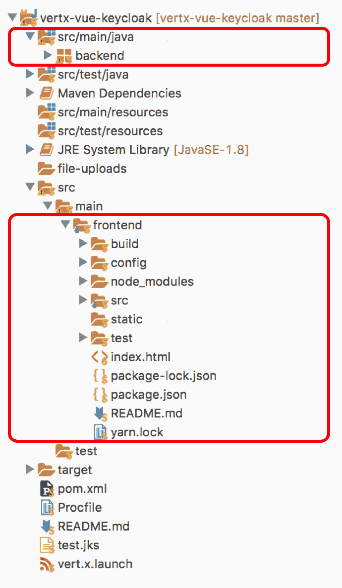

该应用程序包含后端的 vertx 源代码和基于 VueJS 的前端代码。

在**后端** (src/main/java)上，MainVerticle.java 的**是主要入口点。这是一个 Vertx verticle，它创建 HTTP/HTTPS 服务器，配置各种路由，公开与 Keycloak 集成的/login 端点，并最终为我们的前端提供 API 端点。**

前端(位于 src/main/frontend 中)是一个常规的 VueJS 前端，它是用 VueJS CLI 创建的。它包含资产、库和组件。

### 步骤 3 —与 KeyCloak 集成

打开 src/main/Java/back end/main verticle . Java 并检查方法**createHttpServerAndRoutes:**

```
JsonObject keycloakJson = new JsonObject()  .put("realm", "master")   .put("realm-public-key", "MIIBIjANBgkqhkiG9w0BAQEFAAOCAQ8AMIIBCgKCAQEAqZeGGDeEHmmUN4/UXh2gQD0yZEZirprsrdYK7GfcE1+QF9yfYfBrIv5cQUssFQKISVpbbLcoqYolsxcOvDyVFSQedHRsumOzqNZK38RHkidPMPrSNof5C3iMIHuXOCv/6exnLZvVoeYmkq42davYEz1tpSWzkZnlUMbRZFs1CfzLMM2rsAJWsO1/5zbDm0JhFl7EFUsTki72ihac1Q5zUUSFyf1jKUEkL7rrkYINjgAaQKktE8pnubc3Y44F5llY4YyU9/bqUWqMYDx868oiDcnoBpGGd4QrUMlbULZZLRqqUKK6iG1kHxDCJQ9gaCiJoELyAqXjnnO28OODQhxMHQIDAQAB")     .put("auth-server-url", "http://127.0.0.1:38080/auth")  .put("ssl-required", "external")  .put("resource", "vertx-account")  .put("credentials", new JsonObject()    . put("secret", "0c22e587-2ccb-4dd3-b017-5ff6a903891b")); 
```

```
OAuth2Auth oauth2 = KeycloakAuth.create(vertx, OAuth2FlowType.PASSWORD, keycloakJson);
```

从 Keycloak 管理控制台获取**领域**和**真实公钥**。要获得密钥，点击**主**领域的**密钥**选项卡上的“公钥”按钮:

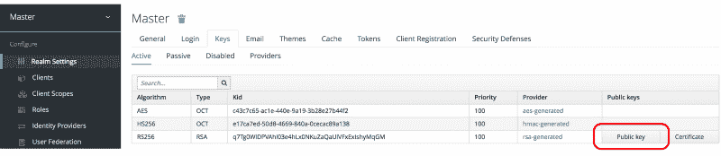

作为一种资源，包括先前创建的 **vertx-account** 客户端。作为其凭证，在客户端菜单>vertx-account>Credentials 选项卡上导航到它，并从那里复制密码:

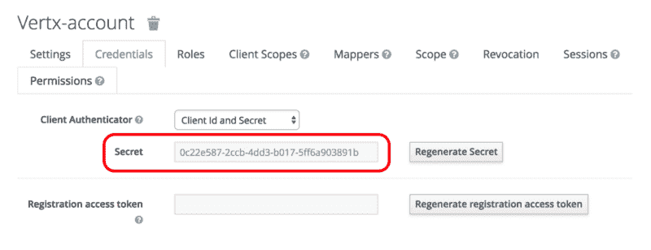

作为 OAuth2FlowType，我们将选择 PASSWORD，代表**密码凭证流**。关于 OAuthFlows 的更多细节可以在[这里](https://vertx.io/docs/vertx-auth-oauth2/java/)找到。

我们现在能够定义 **/login** 路由来处理实际的登录:

我们现在可以通过启动 vert.x 启动器来运行我们的第一个 vertx 后端测试。使用 Postman，我们现在可以通过 POST 针对 **127.0.0.1:8080/login** (我们的 vertx 服务器带有 **/login** 路由)运行第一个用户 auth。在主体上，我们选择原始数据并输入以下 JSON 对象:

```
{  "username":"testuser",   "password":"test",   "scope":"modify-account view-account"}
```

在 Postman 中按下 **Send** 并将其发送到我们的 vertx 服务器:

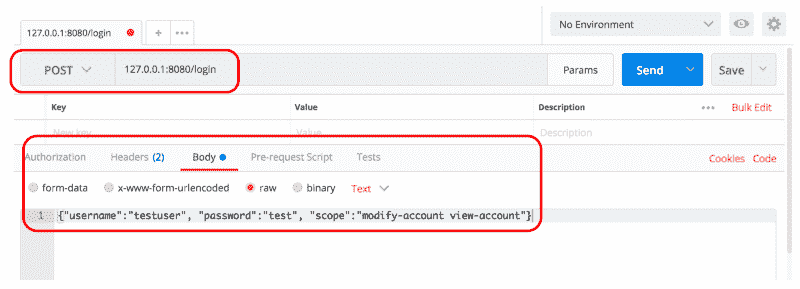

服务器上的结果如下所示，表明我们已经成功地在 Keycloak 上找到了用户“ **testuser** ”。干得好！

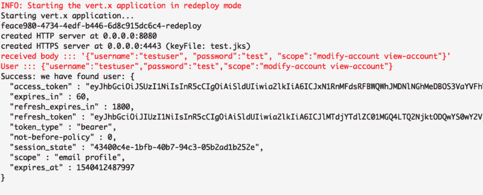

#### 向我们的前端认证

现在，我们已经有了基本的认证工作，并且已经用 Postman 测试过了，是时候让我们的前端应用程序与它集成了。前端来自 **src/main/frontend** 。为了让它运行起来，用 **yarn** 快速安装依赖项，最后用 **yarn dev** 启动它。更多细节[这里](https://github.com/vertx-stack/vertx-vue-keycloak)。

前端现在将在 **localhost:8081** 上启动。它将呈现一个相当简单的登录页面(使用 bootstrap 作为样式):

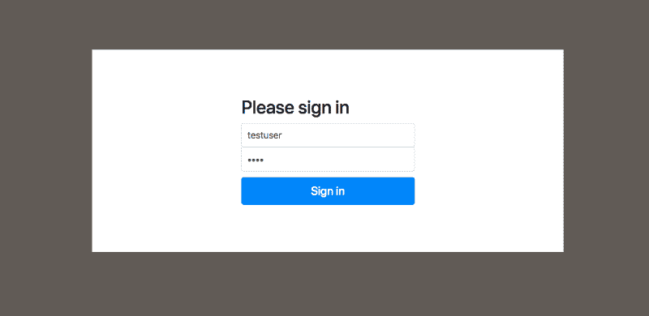

我不会在这里深入这个应用程序的所有细节。关于这是如何创造的更多细节，请查看来自[pawej . Wal](https://www.freecodecamp.org/news/vert-x-vuejs-oauth2-in-5-steps-c04ee78475b7/undefined)的[这篇伟大的文章](https://paweljw.github.io/2017/09/vue.js-front-end-app-part-3-authentication/)。

我们需要更改的唯一附加内容是在 Vert.x 后端配置 CORS，以确保前端可以与之对话。

现在，您可以从 VueJS 前端应用程序向 Vert.x 后端验证用户了。使用您的 **testuser:test** 登录，进入应用程序的受保护空间:

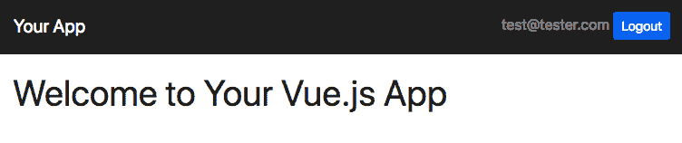

恭喜你，你现在有了一个非常灵活的方法来登录 VueJS 应用程序，运行在一个 Vert.x API 和与 Keycloak 集成的认证服务器上。

### 步骤 4 —集成查询和数据更新逻辑

我们将在此实现一个非常简单的消息管理系统作为示例，大致如下所示:


本例中 eventbus 集成的前端和部分受到了 GitHub 上 Mateusz Parzonka 的 T2 vertx-examples 项目 T5 的启发——谢谢！

本例中提出的过程是利用 Vertx EventBus 上的标准消息端点、生产者和消费者来实现完全复杂的客户机/服务器通信模式，包括查询、数据突变和发布/订阅。这个想法很简单:

*   在后端，我们公开了许多消息消费者，它们充当 get、create 和 delete 方法。
*   在前端，我们订阅特定的数据通道，允许我们从后端向前端发送任何内容，这也极大地有助于通过后端实现客户端到客户端的通信。

在前端，我们将创建一个使用[**vertx 3-event bus-client**](https://www.npmjs.com/package/vertx3-eventbus-client)的 vertx eventbus 服务。这里的基本方法是 **callApi** 和 **subscribe** (关于 pubsub 的更多细节，请参见步骤 5):

要获取、删除和创建新消息，请检查 Home.vue 组件，特别是来自 utils/eventbus 的 **eventbus** 服务的使用情况:

因此，您现在可以使用这个 UI 从后端接收一系列已知消息，创建新消息，并删除它们。到目前为止一切顺利，但是请等一下:与我并行使用同一个应用程序的其他客户端实际上发生了什么？最后让我们深入到 PubSub

### 步骤 5 —集成发布和订阅

我们已经看到，无论何时进行更新，后端都会将完整的消息数组发布到 Vertx EventBus 上(这有点过分，但在本例中我们接受这一点)。前端如何最终捕捉到这些更新？

幸运的是，Vertx EventBus(基于 SockJS)允许我们为客户端订阅可以由任何其他客户端(c2c 通信)或服务器提供支持的通道。

我们的 eventBus 服务提供了一个功能，让**为**订阅这样一个频道(参见上面的代码)。Home.vue 组件再次使用它来捕获消息数组和 vertx 服务器以下列方式管理的连接数的变化:

这里，我们捕获来自 **:pubsub/connections** 和 **:pubsub/messages** 通道的消息，并将传入的数据推送到前端。这允许通过 vertx EventBus 保持运行同一应用程序的多个浏览器完美同步。

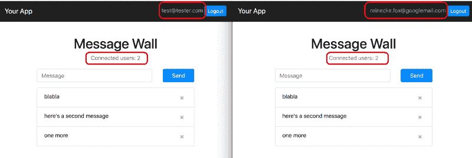

### 限制

这个例子的最大限制之一是 vertx 后端的设置。特别是 vertx Eventbus 上的安全性还没有配置，因为我们不检查调用 API 的用户是否在后端经过了身份验证。因此，不要在没有进行这方面工作的情况下将这些代码用于生产应用程序。

另一个方面是 EventBus 和后端的/login 处理程序仍然通过 HTTP 工作。到 HTTPS 代码的重定向只与静态资源有关，还没有到 EventBus，据我用有限的时间测试。我想既然我们并不真的通过 vertx 提供静态 HTML 内容，那么完全禁用 HTTP 服务器，只使用 HTTPS 是有意义的。

最后，HTTPS 证书是自签名的，当然，您不希望在本地主机之外的重要场合使用它。给自己弄一个 CA 签名的证书(比如从 LetsEncrypt)然后从那里开始。

除此之外:祝你快乐！

如果你需要基于 Google 的 OAuth，而不是 Keycloak，请使用 VueJS 和 Vert.x 来检查 Google OAuth2