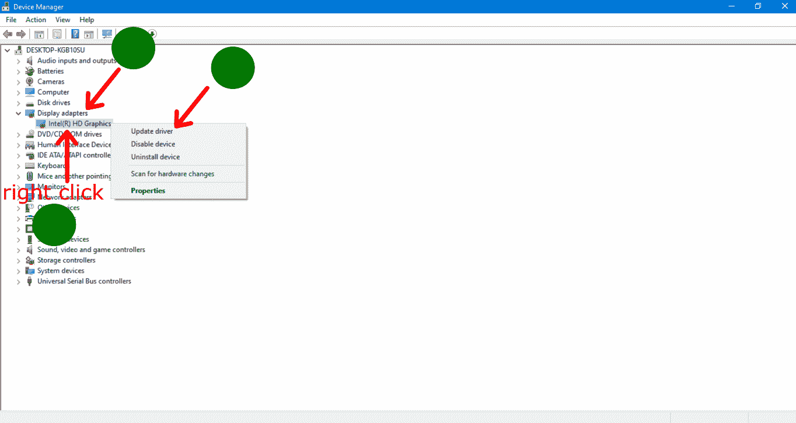
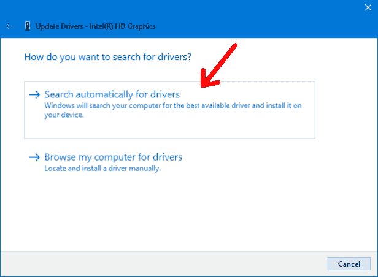

# VGA 无信号–如何修复 Windows 10 PC 上的显示器连接

> 原文：<https://www.freecodecamp.org/news/vga-no-signal-how-to-fix-a-monitor-connection-on-windows-10-pc/>

有时你可能会打开你的电脑，但你的显示器在屏幕上显示“没有信号”。在本文中，我们将研究解决这个问题的各种解决方案。

## 如何通过检查硬件连接来修复显示器连接

*   检查 VGA 连接器是否完全适合其端口。
*   确保您的 VGA 连接器没有损坏。如果可能，更换连接器。

## 如何通过重新启动电脑来修复显示器连接

在此步骤之前，请确保您的电脑没有进入睡眠模式或休眠状态。如果发生这种情况，显示器可能认为电脑已关闭，并将显示“无信号”。

*   拔下电源线和 VGA 连接器。
*   等待几分钟几分钟。
*   插回电源线和 VGA 连接器。
*   重启电脑。

## 如何通过更新驱动程序来修复显示器连接

### ******步骤 1 -打开设备管理器******

*   点击任务栏中的搜索框。
*   键入“设备管理器”。
*   从搜索结果中单击设备管理器。

### ******第二步-更新显示适配器******

*   展开设备管理器中的显示适配器选项。
*   右键单击你的显示适配器，然后点击“更新驱动程序”

*   你会被问到“你想如何搜索驱动程序？”选择“自动搜索驱动程序”选项。

等待驱动程序更新，然后您可以转到您的显示设置，看看是否正在检测第二台显示器。

您可能会得到您的驱动程序已经是最新的响应。您可以验证您的当前版本是否是驱动程序提供商网站上的版本。你可以这样做:

*   右键单击显示适配器，就像我们之前做的那样。
*   点击 ****属性**** 。
*   点击 ****驱动**** 选项卡。
*   复制 ****驱动提供者**** 和 ****驱动版本**** 的值。
*   在谷歌上搜索这两个值。

完成上述步骤后，您应该找到您的驱动程序提供商的网站，如果您的驱动程序不是最新的，您可以在那里安装最新版本的驱动程序。

## 结论

在本文中，我们看到了修复监视器连接以消除“无信号”消息所需的一些有用步骤。

感谢您的阅读！