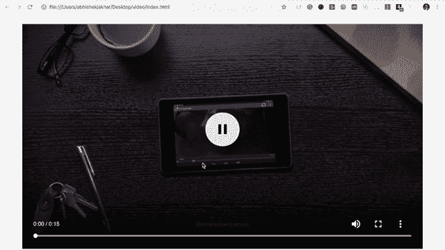
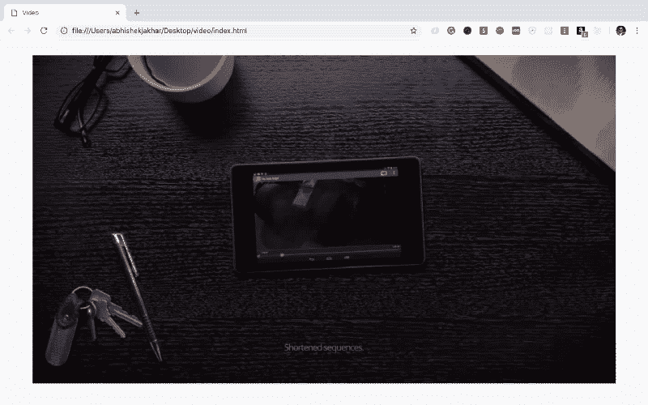
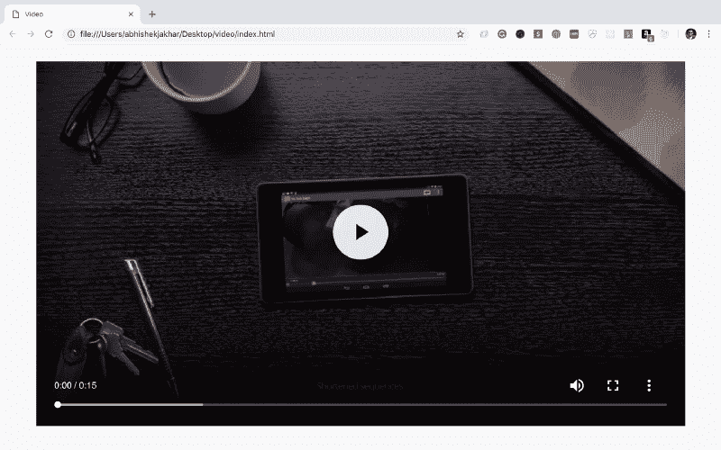
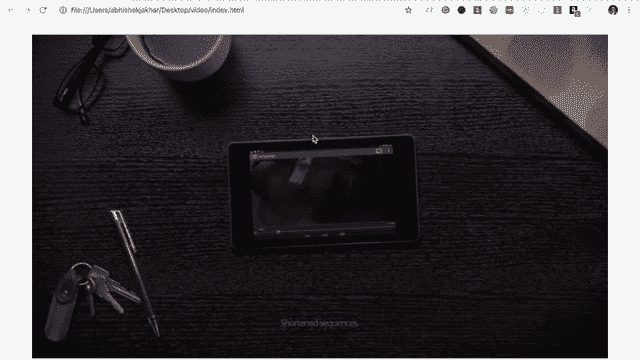
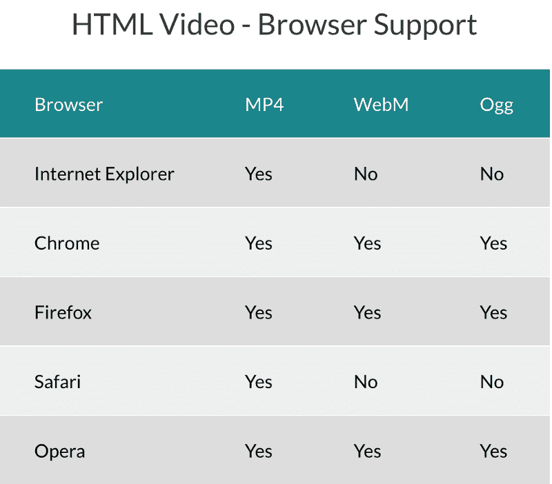
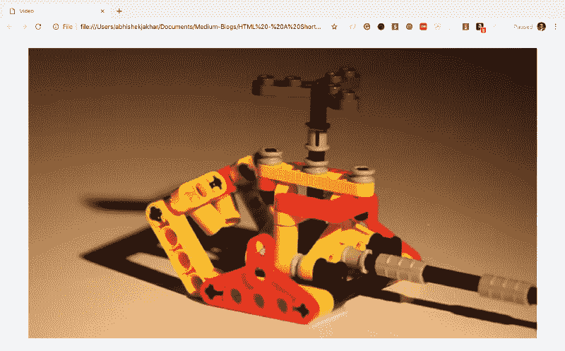
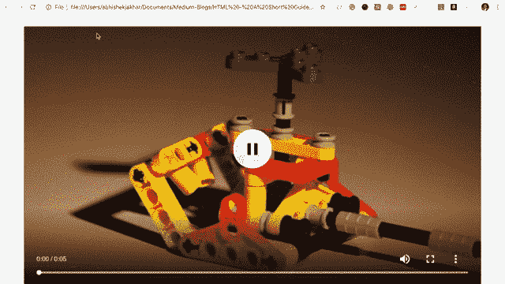
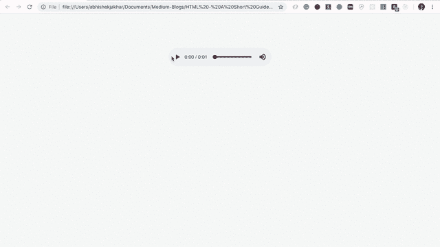

# 如何在 HTML 中嵌入视频和音频

> 原文：<https://www.freecodecamp.org/news/video-audio-in-html-a-short-guide-69f721878b47/>

Abhishek Jakhar

# 如何在 HTML 中嵌入视频和音频



HTML 允许我们创建基于标准的视频和音频播放器，不需要使用任何插件。向网页添加视频和音频几乎与添加图像或格式化一些文本一样简单。

包含视频元素有两种不同的方式。我们将在下面讨论这两个问题。

#### 视频元素

元素允许我们将视频文件嵌入到 HTML 中，非常类似于嵌入图像的方式。

我们可以包括的属性有:

*   `src`这个属性代表 source，非常类似于 image 元素中使用的 src 属性。我们将在 src 属性中添加视频文件的链接。
*   这将是 video/mp4，因为. mp4 是我们正在使用的视频格式。我们也可以使用不同的视频格式，比如。奥格还是。webm，那么 type 属性的值就会分别变成 video/ogg 或者 video/WebM。

> **注:**一些常见的视频格式有 WebM、Ogg、MP4。



<video> in Webpage

我们的网页上现在有这个视频。但是有一个问题。该视频不会自动播放，也没有启动视频的控件。
我们将不得不使用`controls`属性手动添加控件到我们的视频元素中。

这个属性没有任何值，因为它是一个布尔属性。这意味着它要么是真的，要么是假的。

现在，在我们的 video 元素中有了`controls`属性，这意味着它是真的，它将显示回放控件。



<video> + Controls

现在，如果我们移除控件，我们还可以通过使用 autoplay 属性进行视频自动播放。这也是一个布尔属性。



<video> element + autoplay attribute (without controls attribute)

现在，如你所见，视频是自动播放的，没有控制。所以，我们实际上并没有开始录像，但是我们也不能停止录像。

我们也可以一起控制和自动播放。


<video> element with autoplay and controls attribute

您可以根据需要为视频元素提供不同的属性。

我在上面提到有两种不同的方法来添加视频元素。让我们试试另一种方法。

#### 源元素

前面我们使用了一个带有自结束标签的视频元素，但是这里我们将关闭视频元素。所以我们现在有了一个开始和结束标签。

我们还将从视频元素中删除类型和源属性，并将其粘贴到另一个元素中。

```
<video>  <source src="http://commondatastorage.googleapis.com/gtv-videos-bucket/sample/ForBiggerEscapes.mp4" type="video/mp4"></video>
```

我们只是将属性移到了源元素上。

我们为什么要这么做呢？

在大多数情况下，我们会有多个视频源，因为不同的浏览器支持不同的文件类型，所以我们需要根据观看视频的浏览器提供不同的文件类型。



视频看起来完全一样。但是现在我们有了更广泛的浏览器支持。



Video with broader browser support (No Attributes)

现在，如果我们想要添加类似于`controls`、`autoplay`、`loop`等属性，我们将把它添加到`<vid` eo >元素中。



Video with broader browser support and other attributes

#### 音频元素

`<aud` io >元素与 video 元素非常相似。然而，唯一的主要区别是没有视觉效果。

我们可以使用 audio 元素在 web 页面上播放音频文件，比如 mp3 文件。

现在，就像视频标签一样，有两种不同的方法可以做到这一点。

*   使用单个标记表示整个元素。
*   中间有子元素的开始和结束标记。

现在，我们将有一个开始和结束音频标签，然后我们将在它们之间添加源元素。

文件夹结构可能如下所示:

```
|-- project    |-- audio      |-- sample.mp3      |-- sample.ogg    |-- css      |-- main.css      |-- normalize.css    index.html
```

在上面的例子中，没有给`<aud` io >元素赋予 controls 属性，s`o the &`lt；音频>元素不会出现在 HTML 文档中。

现在，您可以看到这里只有几个关键的区别。`type`属性中的值从“视频/mp4”更改为“音频/mp3”。在`src`属性中，我们将扩展名为. mp4 的视频文件更改为扩展名为. mp3 的音频文件。

现在，就像视频元素一样，如果没有任何控制，我们实际上无法停止或启动音频。因此，我们将向音频元素添加`controls`属性。



Audio element(<audio></audio>) with multiple sources for broader browser support

您还可以在`<aud` io >元素中添加其他属性，如自动播放、循环等。

我们已经介绍了 HTML 中音频和视频元素的基本要素。

您可以通过下面的链接了解有关音频和视频的更多信息:

*   [MDN 网络文档—视频](https://developer.mozilla.org/en-US/docs/Web/HTML/Element/video)
*   [MDN 网络文档—音频](https://developer.mozilla.org/en-US/docs/Web/HTML/Element/audio)

我希望这篇文章对你有所帮助。我希望听到您的反馈！

感谢您的阅读！