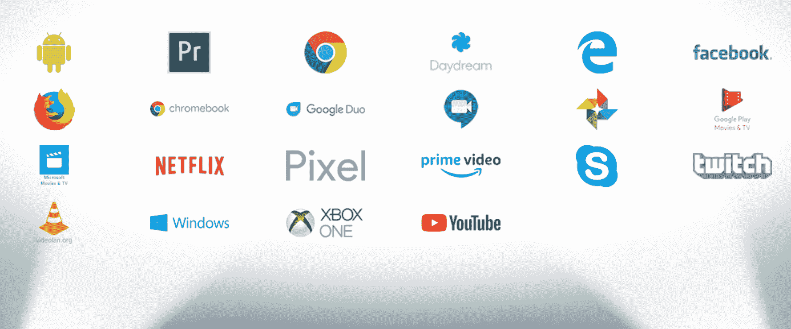

# 网络视频格式，帮助您选择的简短指南

> 原文：<https://www.freecodecamp.org/news/video-formats-for-the-web/>

网络视频将会持续增长。虽然嵌入 Instagram 和 Youtube 视频很简单，但像许多电子商务用例一样，越来越多的情况需要定制视频交付方法。

在设置视频处理和交付管道时，首先要决定的是要提供的视频格式。像 UX、支持(浏览器和系统)、压缩效率或编码速度等方面都可能与这个选择相关。

基于我在网络业务媒体优化方面的经验，我在这里强调一下要考虑的主要方面。如果你正在寻找一个简单的使用 ffmpeg 的转码和优化选项，你也可以查看[这篇文章](https://medium.com/abraia/video-transcoding-and-optimization-for-web-with-ffmpeg-made-easy-511635214df0)。

## 容器和编解码器

与通常的[图像格式](https://www.freecodecamp.org/news/best-image-format-for-web-in-2019-jpeg-webp-heic-avif-41ba0c1b2789/)相比，了解容器和编码标准之间的差异非常重要。文件扩展名告诉我们使用的是哪个容器，而不是哪个编解码器。并且对剪辑进行编码所遵循的标准将确定它是否被浏览器或系统所支持。

例如，虽然普遍支持的 web 视频格式使用 mp4 容器和 H264 标准进行编码，但并不是每个 mp4 文件都被普遍支持，因为它可能是在不同的标准下编码的，如 H265。

自适应比特率(ABR)甚至变得更加复杂，它带来了响应用户网络和设备能力的最佳方式。

让我们看看容器、编码和交付标准的主要组合，以及它们在支持、压缩效率、编码速度和用户体验方面的差异。

## 渐进视频

### H264/AVC

视频的国王格式具有 H264/AVC 编码的 mp4 容器。有时你会在一个 m4v 容器(手制动中的默认格式)中找到它，这是苹果为 H264 视频开发的带有 DRM 保护的 mp4 衍生品。

所有浏览器和系统——包括 iOS 和 Android 中的本地应用程序——都支持这种格式。这是避免兼容性问题的安全选择。

此外，从桌面到移动的几乎任何设备都支持 H264 的硬件加速。编解码速度很快。

总之，编码和交付这种格式非常容易。像图片一样，你可以使用 HTML5 简单地插入视频链接，它可以在任何浏览器上运行。

问题可能出现在分辨率超过 VGA、视觉质量良好(比特率约为 2000 kbps 或更高)以及持续时间超过几秒钟的情况下。当通过移动网络观看时——在许多地区，在高峰时段也是在家庭连接中——它可能会遭遇停顿和重新报价。降低质量的替代方案将产生模糊、蚊式或块状等伪像。

### h265/HEV

使用相同的容器和 H265/HEVC 编码，我们发现了一种强大的视频格式，它产生了更高的压缩效率([约 50%的亮度](https://www.bbc.co.uk/rd/blog/2016-01-h-dot-265-slash-hevc-vs-h-dot-264-slash-avc-50-percent-bit-rate-savings-verified))和更低的除模糊以外的伪像风险。这种格式的问题是，支持仅限于苹果设备，这些设备的价格中包含了巨额版税。几乎只有 Safari 和 iOS 应用程序能够使用它。如果您有许多 iPhone 或 Mac 用户，您可以通过回退到 H264 来包含它。他们的体验会更好。

即使有硬件加速——几乎只有苹果设备才有——这种格式的复杂性更高，意味着编码速度明显更慢，因此生产交付的变体需要更多的计算和更多的时间。

### VP9

这是来自谷歌的开源免版税回复。代替 mp4，它使用 webm 容器，基本上是一个 mkv 容器，但是将编码标准设置为 VP8 或 VP9。在[中为 H265](https://medium.com/netflix-techblog/a-large-scale-comparison-of-x264-x265-and-libvpx-a-sneak-peek-2e81e88f8b0f) 带来了类似的好处，可能效率稍低，但与 H264 相比仍然高得多。同样，它允许减少重量，同时减少除模糊以外的伪影风险。编码速度和 H265 差不多，比较慢。编码速度可能是需要记住的，特别是在内部代码转换管道中。

请注意，虽然以前的版本(VP8)也有同样的支持，但我们并不推荐它，因为它对已经得到普遍支持的 H264 没有任何好处。webm 的使用仅适用于 VP9 编码。

当然，对 webm 的支持仅限于 Google world。这意味着 Chrome 和 Android。同样，我们需要回退到 H264。

### AV1

该标准的第一个稳定版本于 2018 年 3 月发布，提供了 MP4 和 MKV 容器的映射。与 H265 相比，它在压缩效率方面提供了类似或略高的增益，同时无需许可。与 H265 相比，[的最新实现也提高了解码速度，使 AV1 视频成为网络交付的一个引人注目的选择。](https://www.bbc.co.uk/rd/blog/2019-05-av1-codec-streaming-processing-hevc-vvc)

参与创建这种格式的开放媒体联盟的合作伙伴们为这种格式在不久的将来获得广泛支持提供了理由。它有望横扫所有其他格式。

Partners of the Alliance for Open Media behind AV1

然而，目前可用的实现应该仍然被认为是实验性的，其瓶颈仍然是编码速度。这种操作缺乏硬件加速显然是一个问题，第一个解决方案预计将于今年年底推出。

### VVC

负责 H264 AVC 和 H265 HEVC 的委员会已经快速跟踪了新标准，预计将于 2020 年发布。与 H265 和 AV1 相比，对目前考虑的方法的初步测试显示了显著的收益。我在这里把它作为一个未来的通知，只是为了表明视频编码竞赛似乎还远远没有结束。

## 自适应比特率

这是一个非常有趣的替代任何渐进的格式。它建立在基于 HTTP 的媒体流通信协议之上。在这种方法中，视频作为主播放列表交付。播放列表提供了一种表示或阶梯，具有不同的分辨率和比特率选项，以满足不同的视口大小、网络带宽和设备功能。

此外，视频被分割成小块或大块，这样客户可以从一个质量等级跳到另一个。它能够适应用户的条件，即适应网络速度，但也适应视口大小，如切换到全屏。

ABR 为移动设备优化 UX 带来了巨大的优势，避免了移动网络下的停顿或重新缓冲事件。如果你寻求一个真正的响应行为，这显然是一个可以采取的方法。主要有两个标准，HLS 和 MPEG-DASH。

尽管人们普遍认为 ABR 只对很长的视频有意义，但根据我的经验，很多短片很短的情况也可以从这种方法中受益。

### HLS

由苹果公司开发的这种 ABR 协议依赖于以 mp4 格式分割成块的不同再现。原来用 H264，现在也支持 H265。然而，作为一种折衷，我们建议坚持使用 HLS 的 H264 编码，因为它带来了跨各种客户端情况的更好的兼容性。

该标准的一大亮点是在最近的苹果设备中的支持。对于 Safari 或原生 iOS 应用程序以外的客户端，您需要一个浏览器。但是这并不是一个大问题，因为像 videojs 这样的好的开源选项已经存在。当然，你将需要一些努力来定制它，并把它在你的前端工作。也有很棒的转码和交付服务为你做所有这些工作。

由于每个重现都应该以恒定的比特率进行编码，我建议将 HLS 与每标题编码相结合。也就是说，根据视频内容选择重现比特率。

### MPEG-DASH

这是一个用于 ABR 的与编解码器无关的协议，因此除了 H264 和 H265 之外，它还能够使用 VP9 编码，甚至像 AV1 这样的新替代方案。缺点是它相对年轻，这意味着享受的支持比 HLS 少得多。这就是为什么我们还不建议大多数网络企业使用它，即使是大型电子商务商店。

## 摘要

在 H264 AVC 压缩占主导地位多年后，新的方法正在激活场景。显示器尺寸和分辨率的竞赛正在推动新格式的发展，新格式能够在相同的带宽内提供更大的内容。

webm 中的 VP9 大幅提高了压缩效率(大约 30%)，是免费的，并且受 Google solutions (Chrome，Android)支持。更进一步，H265/HEVC 以一半的比特率获得了与 H264 相当或更好的主观质量。由于它们都没有通用的支持，H264 仍然是需要的，至少作为一个后备。

自适应比特率是一种极具吸引力的替代方案，可提供无与伦比的用户体验。在这方面，HLS 在开源查看器的帮助下享有广泛的支持。这可能是中型网站的最佳选择。观看者的需求所增加的复杂性通过开源倡议(如用于内部解决方案的 videojs)以及以有竞争力的价格完成这项工作的第三方服务的可用性得到了很好的缓解。如果你走最后一条路，一定要问一下[每个标题的编码](https://abraia.me/docs/video-optimization/#per-title-encoding)。