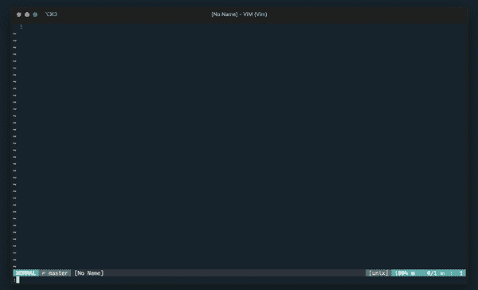
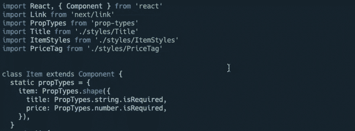
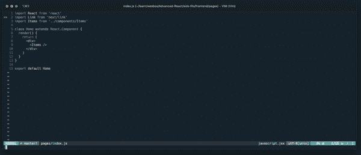

# 为使用 Visual Studio 代码的人介绍 Vim

> 原文：<https://www.freecodecamp.org/news/vim-for-people-who-use-visual-studio-code/>

将 Visual Studio 代码的魅力引入 Vim 的热门技巧。

### 前沿问题

我想先说，这不是一篇让编辑感到羞耻的文章。你可以使用任何你想要的文本编辑器。真的没关系。我写这些只是因为我在 Vim 中发现了我以前使用的任何编辑器(Sublime Text、Atom 或 VSCode)都没有的生产力水平。

如果您听说过 Vim，并想尝试一下，我希望这篇文章能让您熟悉一下 VSCode。

[https://giphy.com/embed/5b26kbDYzsqGartaXz](https://giphy.com/embed/5b26kbDYzsqGartaXz)

### 为什么是 Vim？

使用 Vim 的理由有很多，下面是我的一些理由。

#### 把你的手放在 10 和 2 的位置

[https://giphy.com/embed/11Qm8y698eYC8U](https://giphy.com/embed/11Qm8y698eYC8U)

当你单独使用键盘时，仅仅是因为不需要移动你的手，就会有一种内在的速度提升。嘿，也许你是鼠标运动的黑带，你可以用肉眼看不见的速度来回移动。对于我们这些普通人来说，这需要时间。

让我们做一些快速的数学运算。

[https://giphy.com/embed/Fh28yu3oxWRlm](https://giphy.com/embed/Fh28yu3oxWRlm)

我的手从“home 键”移到鼠标上需要 600 毫秒。为了便于讨论，平均来说，我在编写代码的时候，每分钟都会这么做一次。无论是滚动，导航到一个新的文件，或类似的事情。

600(以毫秒为单位的浪费时间)x 60(每小时次数)x 5(我实际编码的小时数)= 180，000 毫秒浪费时间=

> 3.分钟。每一个。日。

是的，好吧，也许这听起来没那么糟糕，但是，这 3 分钟可以用来写一个函数，或者[重构代码](http://www.java67.com/2016/02/5-books-to-improve-coding-skills-of.html)，而不是像哈利波特一样挥舞着你的手！

#### 速度

[https://giphy.com/embed/4wEFKQgMGLlqU](https://giphy.com/embed/4wEFKQgMGLlqU)

Okay, so maybe 65 isn’t really that fast anymore, but hey, this was 1994!

我最喜欢的一句话描述了用 VIM 编码的感觉:

> “以思维的速度编码”

Vim 是围绕这样一个理念构建的，即您可以直接与您的计算机进行通信。你告诉它你想要什么，它就会为你做。最让我大开眼界的是这个小花絮:

要删除两个对象之间的所有内容(括号、引号等)，很简单:

`di'`

Computer: Delete, inside, single-quotes.

这只是你可以用 Vim 做的惊人的速记事情的表面。

#### 我是真正的程序员！

[https://giphy.com/embed/v5OtzSjwSu3w4](https://giphy.com/embed/v5OtzSjwSu3w4)

学习 VIM 的旅程的一部分是向您展示 UNIX 是如何工作的。我的印象是，你接触 bash 这样的东西越多，你就会成为越好的程序员。

机会是，你有一个非常可爱的命令行设置。如果您的代码编辑器和命令行能够协同工作，那不是很好吗？

#### 如何退出 Vim？

很有可能你曾经在 Linux 服务器上编辑过一个文件，却不知道如何退出这个文件。比方说，在数字海洋上更改一个 SSH 密钥。如果你了解 VIM…你就不用担心这个了！

#### 我转用 Vim 的真正原因

诚实时间。想要切换到 Vim 的真正催化剂是在一次演示中看到 Kyle Mathews(Gatsby . js 的创建者)使用它。

[https://giphy.com/embed/UUypRspZCaF94uKasd](https://giphy.com/embed/UUypRspZCaF94uKasd)

Ya caught me.

### VS 代码特性及其等价物

深信不疑？酷，这里有一些工具！

#### 插件系统

Vim 本身非常简单。为了添加插件，我们必须有一个机制来管理它们。输入插头:

[**June Gunn/vim-plug**](https://github.com/junegunn/vim-plug)

> 注意:有一些插件管理器。我没有什么特别的理由就上了插头。我喜欢它，我没有任何问题。仅供参考，Vundle 已弃用。

#### 文件搜索

这些年来已经有了一堆文件搜索的解决方案，论坛上的众多回答表明了这一点。我尝试了几种不同的方式，但最终选择了这个组合:

[模糊查找器(ff)](https://github.com/junegunn/fzf)+[开膛手](https://github.com/BurntSushi/ripgrep) p

Fuzzy search for "theme"

Fzf 是一个非常好构建/维护的模糊搜索，在命令行和 vim 中都有效。

> 注意:你可能会在很多文章中看到 Ag(白银搜索者)，但是 Ag 相关的 vim 插件已经不再维护，所以建议使用 RipGrep。

#### 智能感知

VSCode 中的自动完成系统(Intellisense)可以说是它最好的特性。幸运的是，它已经被移植到 Vim 了！

[**neo clide/COC . nvim**](https://github.com/neoclide/coc.nvim)

autocompletion for importing a function written in another file in React

CoC 有自己的扩展系统，它反映了 VSCodes 的扩展系统。它易于使用并且有据可查(最重要的部分)。

> 注意:你可能会看到一些谈论 YouCompleteMe 的旧文章，但据我所知，这种情况已经不复存在了。

#### 文件系统浏览器

与大多数现代文本编辑器一样，VSCode 附带了一个文件浏览器。Vim 的原生`netrw`还行，我也看到不少文章说不需要别的，比如这里的。然而，我发现 NERDTree 太有用了，不能不使用。

#### **Git 集成**

**老实说，我大部分的 git 工作都是在 Iterm 中完成的。然而，VSCode 有一个非常好的 Git Diff 分屏。要获得这种级别的 git 集成，请查看这个插件:**

**[**tpope/vim-逃犯**](https://github.com/tpope/vim-fugitive)**

****

### **您可能需要的附加插件**

**这是我在 Visual Studio 代码中使用的一些东西，我想把它们引入 Vim。**

#### **自动完成括号**

**这个漂亮的小包装会自动关闭那些讨厌的括号。**

**[**江淼/自动配对**](https://github.com/jiangmiao/auto-pairs)**

#### **文件图标**

**这将为 NERDTree 之类的东西添加图标。**

**[**ryanoasis/vim-devicons**](https://github.com/ryanoasis/vim-devicons)**

#### **较美丽**

**你可能不知道，但是官方的漂亮团队有一个 vim 插件。多好啊！此外，设置非常简单。**

**[**更漂亮/vim-更漂亮**](https://github.com/prettier/vim-prettier)**

**让它在 autosave 上工作，看看这篇文章。**

#### **片段**

**难道你不知道，使用完成的征服，你可以导入 vs 代码片段！**

**看看这个向你展示如何做到这一点:**

**[**neo clide/COC . nvim**](https://github.com/neoclide/coc.nvim/wiki/Using-snippets)**

**这是我正在使用的 React snippets 包。**

**[**【xabikos/vscode-react】**](https://github.com/xabikos/vscode-react)**

#### **附加材料**

**Vim 插件的家是 Vim Awesome。**

**[**Vim 牛逼**](https://vimawesome.com/)**

**观看人们使用 Vim 的绝佳地点:**

**[**关于文本编辑器 Vim 的免费截屏**](http://vimcasts.org/)**

### **Dotfiles**

**我有一些重新映射的键来使事情变得更容易。看看我的网站文件。**

**[**DarthOstrich/dot files**](https://github.com/DarthOstrich/dotfiles)**

### ****最后的想法****

#### ****我的旅程****

****在花了大约一年时间学习 Vim 之后，我现在只使用它。最初，我只是把它用于我的个人项目，因为我的生产力水平很低。我不得不不停下来看看如何做某事。然而，我在大约 4 个月前完全放弃了 VSCode，并且我不打算回去。****

#### ****这需要纪律****

****学习 Vim 可能会让人望而生畏，坦率地说，确实如此。这需要自我约束。然而，一切不都在发展吗？我所学的任何工具/语言/框架都需要某种程度的[刻意练习](http://www.calnewport.com/blog/2011/12/28/how-i-used-deliberate-practice-to-destroy-my-computer-science-final/)。****

****Vim 是一种生活方式的选择。这需要一段时间来适应，有时会令人沮丧。然而，如果你坚持下去，我保证它会改善你的工作流程。如果您有任何其他提示或问题，请写在下面。一如既往，编码快乐！****

 ****[https://giphy.com/embed/hv4TC2Ide8rDoXy0iK](https://giphy.com/embed/hv4TC2Ide8rDoXy0iK)**** 

## ****额外的学习资源****

****[**快速掌握 Vim—Jovica Ilic**](https://jovicailic.org/mastering-vim-quickly/)****

****[**带你从初学者到专家的 8 个 Vim 技巧**](https://medium.com/swlh/8-vim-tricks-that-will-take-you-from-beginner-to-expert-817ff4870245)****

## ****参考****

****[**切换到 Vim**](http://brendandawes.com/blog/vim)****

******节省我 50%命令行时间的 10 个简单 Linux 技巧******