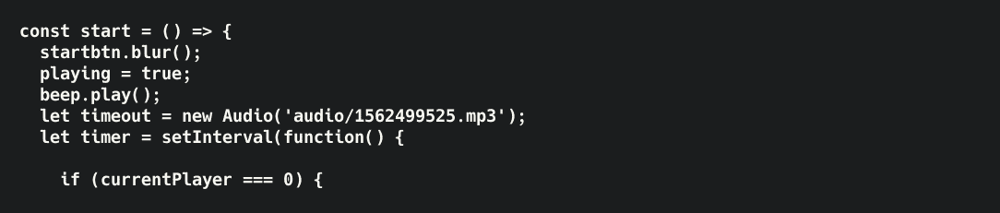
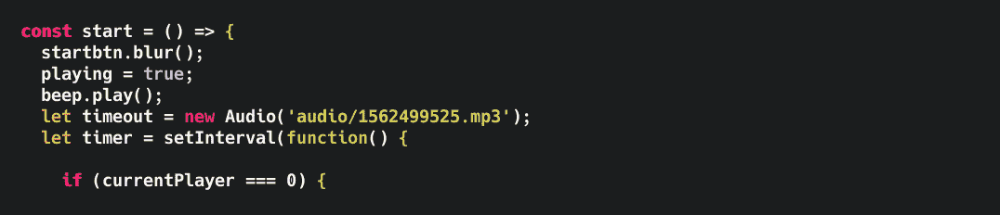
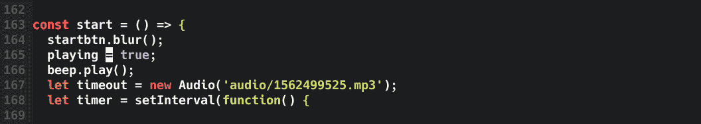
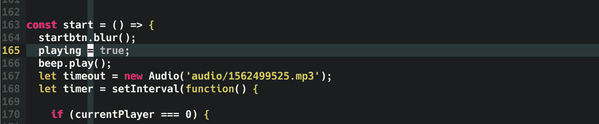
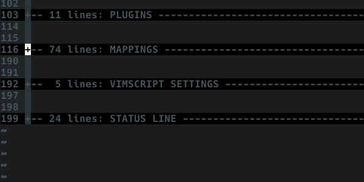
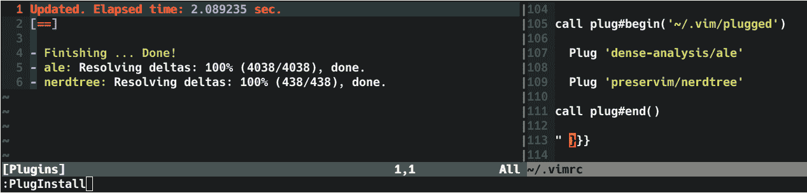
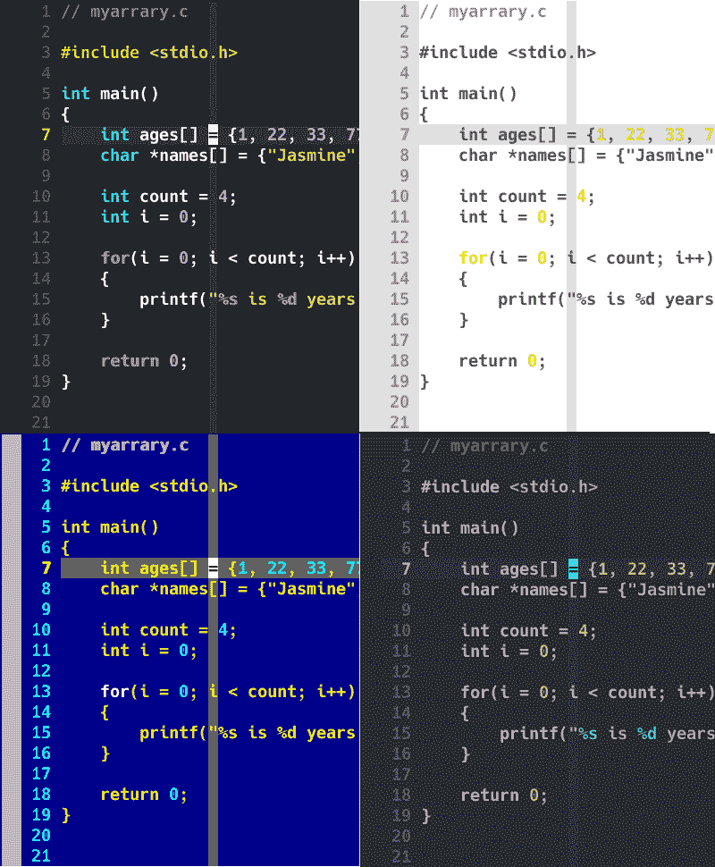
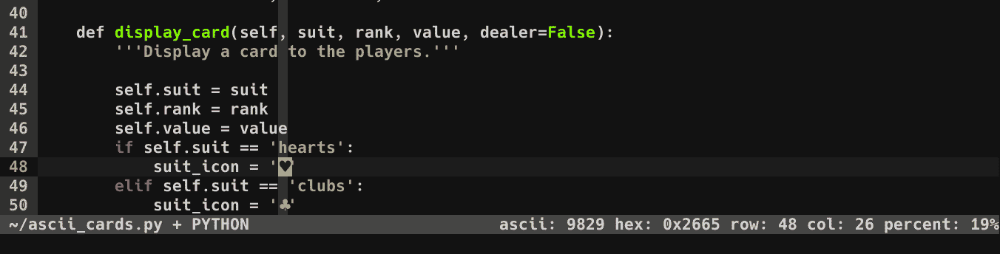

# Vimrc 配置指南——如何使用映射、Vimscript、状态行等定制您的 Vim 代码编辑器

> 原文：<https://www.freecodecamp.org/news/vimrc-configuration-guide-customize-your-vim-editor/>

配置您的。vimrc 文件允许您使用 Vim 的全部功能。定制的。你可以增加你的 Vim 能力十倍。

在这篇文章中，我将向您展示一些方法，您可以自定义您的。vimrc 文件。

我会过去:

*   基本设置
*   插件
*   可折叠的
*   Vimscript
*   状态行

首先在您的主目录中创建以下目录结构。

```
.vim/
 ├── autoload/
 ├── backup/
 ├── colors/
 └── plugged/
```

```
$ mkdir -p ~/.vim ~/.vim/autoload ~/.vim/backup ~/.vim/colors ~/.vim/plugged
```

在主目录中创建一个. vimrc 文件。

```
$ touch ~/.vimrc 
```

# 如何更新 Vim 中的基本设置

首先，让我们添加一些基本设置，这将改善您的编辑体验。我使用双引号字符来注释掉行。

将下列行添加到您的。vimrc 文件:

```
" Disable compatibility with vi which can cause unexpected issues.
set nocompatible

" Enable type file detection. Vim will be able to try to detect the type of file in use.
filetype on

" Enable plugins and load plugin for the detected file type.
filetype plugin on

" Load an indent file for the detected file type.
filetype indent on
```

语法高亮显示非常有用。我们添加的下一行将启用语法突出显示，并使您的代码更容易阅读。

```
" Turn syntax highlighting on.
syntax on 
```

### 这是它之前的样子:



### 之后:



您还可以选择显示行号，以便更容易地浏览文件。

```
" Add numbers to each line on the left-hand side.
set number 
```



您可以通过水平和垂直突出显示光标所在的行来精确定位光标所在的位置。

添加这些行以启用该功能。

```
" Highlight cursor line underneath the cursor horizontally.
set cursorline

" Highlight cursor line underneath the cursor vertically.
set cursorcolumn 
```



以下是一些增强编辑体验的更常见的设置。每一行上面都有一个注释来解释它的作用。

将下列行添加到。vimrc 文件。

```
" Set shift width to 4 spaces.
set shiftwidth=4

" Set tab width to 4 columns.
set tabstop=4

" Use space characters instead of tabs.
set expandtab

" Do not save backup files.
set nobackup

" Do not let cursor scroll below or above N number of lines when scrolling.
set scrolloff=10

" Do not wrap lines. Allow long lines to extend as far as the line goes.
set nowrap

" While searching though a file incrementally highlight matching characters as you type.
set incsearch

" Ignore capital letters during search.
set ignorecase

" Override the ignorecase option if searching for capital letters.
" This will allow you to search specifically for capital letters.
set smartcase

" Show partial command you type in the last line of the screen.
set showcmd

" Show the mode you are on the last line.
set showmode

" Show matching words during a search.
set showmatch

" Use highlighting when doing a search.
set hlsearch

" Set the commands to save in history default number is 20.
set history=1000
```

Bash completion 是一个很棒的特性，它通过自动完成您键入的内容来节省击键次数。Vim 有一个类似的特性，叫做 wildmenu。

添加以下行以启用 wildmenu 功能。您将看到与您正在搜索的文件相匹配的文件列表。您还可以启用 Vim 的自动完成功能。

```
" Enable auto completion menu after pressing TAB.
set wildmenu

" Make wildmenu behave like similar to Bash completion.
set wildmode=list:longest

" There are certain files that we would never want to edit with Vim.
" Wildmenu will ignore files with these extensions.
set wildignore=*.docx,*.jpg,*.png,*.gif,*.pdf,*.pyc,*.exe,*.flv,*.img,*.xlsx 
```


键入`:help <command>`获取关于特定命令的更多信息。

示例:

```
:help nocompatible 
```

# 如何在 Vim 中折叠长文件

的。vimrc 文件可能会变得很长，所以将它组织成几个部分是一个明智的想法。Vim 将允许你折叠长文件来隐藏文本部分。

将下列行添加到。vimrc 将文件组织成几个部分。

```
" PLUGINS ---------------------------------------------------------------- {{{

" Plugin code goes here.

" }}}

" MAPPINGS --------------------------------------------------------------- {{{

" Mappings code goes here.

" }}}

" VIMSCRIPT -------------------------------------------------------------- {{{

" This will enable code folding.
" Use the marker method of folding.
augroup filetype_vim
    autocmd!
    autocmd FileType vim setlocal foldmethod=marker
augroup END

" More Vimscripts code goes here.

" }}}

" STATUS LINE ------------------------------------------------------------ {{{

" Status bar code goes here.

" }}}
```

保存。带有`:w`的 vimrc 文件。像这样的 vimrc 文件`:source ~/.vimrc`使更改生效。现在，一旦您将光标移动到文件夹上，您可以按:

`zo`打开光标下的单个折叠。

`zc`关闭光标下的折叠。

`zR`打开所有褶皱。

`zM`合上所有褶皱。



键入`:help folding`了解更多信息。

# 如何向 Vim 添加插件

您可以向 Vim 添加插件来增加额外的功能。大多数人使用插件管理器来简化插件安装。

我们可以使用各种各样的插件管理器。我将向您展示如何安装和使用 [vim-plug](https://github.com/junegunn/vim-plug) 插件管理器。

要安装 vim-plug 插件，请运行以下命令:

在 Linux 或 Mac OS 上。

```
$ curl -fLo ~/.vim/autoload/plug.vim --create-dirs \
    https://raw.githubusercontent.com/junegunn/vim-plug/master/plug.vim
```

在装有 Powershell 的 Windows 上。

```
$ iwr -useb https://raw.githubusercontent.com/junegunn/vim-plug/master/plug.vim |`
    ni $HOME/vimfiles/autoload/plug.vim -Force 
```

在插件部分添加`call plug#begin('~/.vim/plugged')`和`call plug#end()`行。我们安装的插件将被添加到两个函数调用之间。

```
" PLUGINS ---------------------------------------------------------------- {{{

call plug#begin('~/.vim/plugged')

call plug#end()

" }}} 
```

现在安装插件就像在函数调用之间添加你在 GitHub 上找到的`Plug 'username/plugin-name'`字符串一样简单。

我就是这样安装 [NERDTree](https://github.com/preservim/nerdtree) 和[异步 Lint 引擎(ALE)](https://github.com/dense-analysis/ale) 的。

在两个`call plug#...`行之间添加这两行:

```
" PLUGINS ---------------------------------------------------------------- {{{

call plug#begin('~/.vim/plugged')

  Plug 'dense-analysis/ale'

  Plug 'preservim/nerdtree'

call plug#end()

" }}}
```

保存。使用命令`:w`创建 vimrc 文件，并将。用这个命令`:source ~/.vimrc`来使修改生效。

现在输入`:PlugInstall`下载并安装这两个插件。



# 如何在 Vim 中映射键盘快捷键

在映射部分，我们将添加快捷方式，使输入更长的命令更容易。这将节省你的按键和大量的时间，特别是对于长命令。

键映射语法如下:

`map_mode <what_you_type> <what_is_executed>`

### Vim 中流行的映射模式

这里有一些流行的映射模式，可能是最有用和最重要的。

*   `nnoremap`–允许您在正常模式下映射按键。
*   `inoremap`–允许您在插入模式下映射按键。
*   `vnoremap`–允许您在可视模式下映射按键。

一个常见的映射示例是将“jj”映射到 escape 键。你会经常按下退出键。escape 键在键盘的远角。字母“j”在键盘的中间，所以按“jj”比按退出键更容易。

这就是你将 escape 键映射到`jj`的方式。

`inoremap jj <esc>`

### 如何在 Vim 中使用 Mapleader

Mapleader 将允许您将 Vim 未使用的键设置为`<leader>`键。
leader 键与另一个键配合使用，将允许您创建新的快捷键。

反斜杠键是默认的前导键，但是有些人把它改成了逗号`","`。

`let mapleader = "\"`

将前导键映射到反斜杠后，我可以这样使用它:

按下`\\`关闭搜索高亮显示。


下面是一些人们常用的映射。有关解释，请参见每行上方的注释。

将此代码添加到映射部分:

```
" MAPPINGS --------------------------------------------------------------- {{{

" Set the backslash as the leader key.
let mapleader = "\"

" Press \\ to jump back to the last cursor position.
nnoremap <leader>\ ``

" Press \p to print the current file to the default printer from a Linux operating system.
" View available printers:   lpstat -v
" Set default printer:       lpoptions -d <printer_name>
" <silent> means do not display output.
nnoremap <silent> <leader>p :%w !lp<CR>

" Type jj to exit insert mode quickly.
inoremap jj <Esc>

" Press the space bar to type the : character in command mode.
nnoremap <space> :

" Pressing the letter o will open a new line below the current one.
" Exit insert mode after creating a new line above or below the current line.
nnoremap o o<esc>
nnoremap O O<esc>

" Center the cursor vertically when moving to the next word during a search.
nnoremap n nzz
nnoremap N Nzz

" Yank from cursor to the end of line.
nnoremap Y y$

" Map the F5 key to run a Python script inside Vim.
" I map F5 to a chain of commands here.
" :w saves the file.
" <CR> (carriage return) is like pressing the enter key.
" !clear runs the external clear screen command.
" !python3 % executes the current file with Python.
nnoremap <f5> :w <CR>:!clear <CR>:!python3 % <CR>

" You can split the window in Vim by typing :split or :vsplit.
" Navigate the split view easier by pressing CTRL+j, CTRL+k, CTRL+h, or CTRL+l.
nnoremap <c-j> <c-w>j
nnoremap <c-k> <c-w>k
nnoremap <c-h> <c-w>h
nnoremap <c-l> <c-w>l

" Resize split windows using arrow keys by pressing:
" CTRL+UP, CTRL+DOWN, CTRL+LEFT, or CTRL+RIGHT.
noremap <c-up> <c-w>+
noremap <c-down> <c-w>-
noremap <c-left> <c-w>>
noremap <c-right> <c-w><

" NERDTree specific mappings.
" Map the F3 key to toggle NERDTree open and close.
nnoremap <F3> :NERDTreeToggle<cr>

" Have nerdtree ignore certain files and directories.
let NERDTreeIgnore=['\.git

键入`help: map-modes`了解更多信息。

# 如何添加一些 Vimscripting

Vimscript 是一种脚本语言，允许您使用变量、if else 语句和函数创建脚本。自动命令正在等待事件发生，以便触发命令。

```
" VIMSCRIPT -------------------------------------------------------------- {{{

" Enable the marker method of folding.
augroup filetype_vim
    autocmd!
    autocmd FileType vim setlocal foldmethod=marker
augroup END

" If the current file type is HTML, set indentation to 2 spaces.
autocmd Filetype html setlocal tabstop=2 shiftwidth=2 expandtab

" If Vim version is equal to or greater than 7.3 enable undofile.
" This allows you to undo changes to a file even after saving it.
if version >= 703
    set undodir=~/.vim/backup
    set undofile
    set undoreload=10000
endif

" You can split a window into sections by typing `:split` or `:vsplit`.
" Display cursorline and cursorcolumn ONLY in active window.
augroup cursor_off
    autocmd!
    autocmd WinLeave * set nocursorline nocursorcolumn
    autocmd WinEnter * set cursorline cursorcolumn
augroup END

" If GUI version of Vim is running set these options.
if has('gui_running')

    " Set the background tone.
    set background=dark

    " Set the color scheme.
    colorscheme molokai

    " Set a custom font you have installed on your computer.
    " Syntax: set guifont=<font_name>\ <font_weight>\ <size>
    set guifont=Monospace\ Regular\ 12

    " Display more of the file by default.
    " Hide the toolbar.
    set guioptions-=T

    " Hide the the left-side scroll bar.
    set guioptions-=L

    " Hide the the right-side scroll bar.
    set guioptions-=r

    " Hide the the menu bar.
    set guioptions-=m

    " Hide the the bottom scroll bar.
    set guioptions-=b

    " Map the F4 key to toggle the menu, toolbar, and scroll bar.
    " <Bar> is the pipe character.
    " <CR> is the enter key.
    nnoremap <F4> :if &guioptions=~#'mTr'<Bar>
        \set guioptions-=mTr<Bar>
        \else<Bar>
        \set guioptions+=mTr<Bar>
        \endif<CR>

endif

" }}} 
```

阅读[艰难地学习 Vimscript](https://learnvimscriptthehardway.stevelosh.com/)了解更多关于 vim script 的信息。

键入`:help autocmd`获取更多关于自动命令的信息。

# 如何向 Vim 添加配色方案

您可以轻松地向 Vim 添加配色方案来更改默认颜色。搜索 Vim 配色方案，你会发现很多很多选择。

安装配色方案非常简单，只需在`~/.vim/colors/`目录中添加一个`<colorscheme>.vim`文件。

我将添加流行的配色方案莫洛凯岛:

```
$ cd ~/.vim/colors

$ curl -o molokai.vim https://raw.githubusercontent.com/tomasr/molokai/master/colors/molokai.vim
  % Total    % Received % Xferd  Average Speed   Time    Time     Time  Current
                                 Dload  Upload   Total   Spent    Left  Speed
100  7558  100  7558    0     0   150k      0 --:--:-- --:--:-- --:--:--  150k 
```

要设置配色方案，请键入以下命令:

```
:colorscheme molokai 
```

### 配色方案示例:



color schemes: molokai, base16-tomorrow, blue, one

# 如何在 Vim 中配置状态栏

您可以用有用的信息配置您的 Vim 状态栏。例如，配置文件类型、文件中的总行数、文件路径、列号、行号、文件百分比等等。

将此代码添加到状态行部分:

```
" STATUS LINE ------------------------------------------------------------ {{{

" Clear status line when vimrc is reloaded.
set statusline=

" Status line left side.
set statusline+=\ %F\ %M\ %Y\ %R

" Use a divider to separate the left side from the right side.
set statusline+=%=

" Status line right side.
set statusline+=\ ascii:\ %b\ hex:\ 0x%B\ row:\ %l\ col:\ %c\ percent:\ %p%%

" Show the status on the second to last line.
set laststatus=2

" }}} 
```

`%F`–显示当前文件的完整路径。

`%M`–修改标志显示文件是否未保存。

`%Y`–缓冲区中的文件类型。

`%R`–显示只读标志。

`%b`–在光标下显示 ASCII/Unicode 字符。

`0x%B`–显示光标下的十六进制字符。

`%l`–显示行号。

`%c`–显示列号。

`%p%%`–从文件顶部开始显示光标百分比。



键入`help: statusline`了解更多信息。

这是完整的。vimrc 文件。

```
"""""""""""""""""""""""""""""""""""""""""""""""""""""""""""""""""""""""""""               
"               
"               ██╗   ██╗██╗███╗   ███╗██████╗  ██████╗
"               ██║   ██║██║████╗ ████║██╔══██╗██╔════╝
"               ██║   ██║██║██╔████╔██║██████╔╝██║     
"               ╚██╗ ██╔╝██║██║╚██╔╝██║██╔══██╗██║     
"                ╚████╔╝ ██║██║ ╚═╝ ██║██║  ██║╚██████╗
"                 ╚═══╝  ╚═╝╚═╝     ╚═╝╚═╝  ╚═╝ ╚═════╝
"               
"""""""""""""""""""""""""""""""""""""""""""""""""""""""""""""""""""""""""""               

" Disable compatibility with vi which can cause unexpected issues.
set nocompatible

" Enable type file detection. Vim will be able to try to detect the type of file is use.
filetype on

" Enable plugins and load plugin for the detected file type.
filetype plugin on

" Load an indent file for the detected file type.
filetype indent on

" Turn syntax highlighting on.
syntax on

" Add numbers to the file.
set number

" Highlight cursor line underneath the cursor horizontally.
set cursorline

" Highlight cursor line underneath the cursor vertically.
set cursorcolumn

" Set shift width to 4 spaces.
set shiftwidth=4

" Set tab width to 4 columns.
set tabstop=4

" Use space characters instead of tabs.
set expandtab

" Do not save backup files.
set nobackup

" Do not let cursor scroll below or above N number of lines when scrolling.
set scrolloff=10

" Do not wrap lines. Allow long lines to extend as far as the line goes.
set nowrap

" While searching though a file incrementally highlight matching characters as you type.
set incsearch

" Ignore capital letters during search.
set ignorecase

" Override the ignorecase option if searching for capital letters.
" This will allow you to search specifically for capital letters.
set smartcase

" Show partial command you type in the last line of the screen.
set showcmd

" Show the mode you are on the last line.
set showmode

" Show matching words during a search.
set showmatch

" Use highlighting when doing a search.
set hlsearch

" Set the commands to save in history default number is 20.
set history=1000

" Enable auto completion menu after pressing TAB.
set wildmenu

" Make wildmenu behave like similar to Bash completion.
set wildmode=list:longest

" There are certain files that we would never want to edit with Vim.
" Wildmenu will ignore files with these extensions.
set wildignore=*.docx,*.jpg,*.png,*.gif,*.pdf,*.pyc,*.exe,*.flv,*.img,*.xlsx

" PLUGINS ---------------------------------------------------------------- {{{

call plug#begin('~/.vim/plugged')

  Plug 'dense-analysis/ale'

  Plug 'preservim/nerdtree'

call plug#end()

" }}}

" MAPPINGS --------------------------------------------------------------- {{{

" Set the backslash as the leader key.
let mapleader = "\"

" Press \\ to jump back to the last cursor position.
nnoremap <leader>\ ``

" Press \p to print the current file to the default printer from a Linux operating system.
" View available printers:   lpstat -v
" Set default printer:       lpoptions -d <printer_name>
" <silent> means do not display output.
nnoremap <silent> <leader>p :%w !lp<CR>

" Type jj to exit insert mode quickly.
inoremap jj <Esc>

" Press the space bar to type the : character in command mode.
nnoremap <space> :

" Pressing the letter o will open a new line below the current one.
" Exit insert mode after creating a new line above or below the current line.
nnoremap o o<esc>
nnoremap O O<esc>

" Center the cursor vertically when moving to the next word during a search.
nnoremap n nzz
nnoremap N Nzz

" Yank from cursor to the end of line.
nnoremap Y y$

" Map the F5 key to run a Python script inside Vim.
" We map F5 to a chain of commands here.
" :w saves the file.
" <CR> (carriage return) is like pressing the enter key.
" !clear runs the external clear screen command.
" !python3 % executes the current file with Python.
nnoremap <f5> :w <CR>:!clear <CR>:!python3 % <CR>

" You can split the window in Vim by typing :split or :vsplit.
" Navigate the split view easier by pressing CTRL+j, CTRL+k, CTRL+h, or CTRL+l.
nnoremap <c-j> <c-w>j
nnoremap <c-k> <c-w>k
nnoremap <c-h> <c-w>h
nnoremap <c-l> <c-w>l

" Resize split windows using arrow keys by pressing:
" CTRL+UP, CTRL+DOWN, CTRL+LEFT, or CTRL+RIGHT.
noremap <c-up> <c-w>+
noremap <c-down> <c-w>-
noremap <c-left> <c-w>>
noremap <c-right> <c-w><

" NERDTree specific mappings.
" Map the F3 key to toggle NERDTree open and close.
nnoremap <F3> :NERDTreeToggle<cr>

" Have nerdtree ignore certain files and directories.
let NERDTreeIgnore=['\.git

# 结论

在本文中，我仅仅触及了如何定制 Vim 的皮毛。有成千上万种方法可以根据您的喜好配置和定制. vimrc。
你甚至可以编写自己的插件和配色方案，并与全世界分享。

我希望通过阅读这篇文章，你已经学会了一两个新的技巧。所以如果你使用 Vim，不要没有. vimrc 文件就离开家！

顺便说一下，这篇文章是我用 Vim 写的。

关注我的 [Github](https://github.com/brandon-wallace) | [开发到](https://dev.to/brandonwallace), '\.jpg

键入`help: map-modes`了解更多信息。

# 如何添加一些 Vimscripting

Vimscript 是一种脚本语言，允许您使用变量、if else 语句和函数创建脚本。自动命令正在等待事件发生，以便触发命令。

[PRE16]

阅读[艰难地学习 Vimscript](https://learnvimscriptthehardway.stevelosh.com/)了解更多关于 vim script 的信息。

键入`:help autocmd`获取更多关于自动命令的信息。

# 如何向 Vim 添加配色方案

您可以轻松地向 Vim 添加配色方案来更改默认颜色。搜索 Vim 配色方案，你会发现很多很多选择。

安装配色方案非常简单，只需在`~/.vim/colors/`目录中添加一个`<colorscheme>.vim`文件。

我将添加流行的配色方案莫洛凯岛:

[PRE17]

要设置配色方案，请键入以下命令:

[PRE18]

### 配色方案示例:


color schemes: molokai, base16-tomorrow, blue, one

# 如何在 Vim 中配置状态栏

您可以用有用的信息配置您的 Vim 状态栏。例如，配置文件类型、文件中的总行数、文件路径、列号、行号、文件百分比等等。

将此代码添加到状态行部分:

[PRE19]

`%F`–显示当前文件的完整路径。

`%M`–修改标志显示文件是否未保存。

`%Y`–缓冲区中的文件类型。

`%R`–显示只读标志。

`%b`–在光标下显示 ASCII/Unicode 字符。

`0x%B`–显示光标下的十六进制字符。

`%l`–显示行号。

`%c`–显示列号。

`%p%%`–从文件顶部开始显示光标百分比。


键入`help: statusline`了解更多信息。

这是完整的。vimrc 文件。

[PRE20]

# 结论

在本文中，我仅仅触及了如何定制 Vim 的皮毛。有成千上万种方法可以根据您的喜好配置和定制. vimrc。
你甚至可以编写自己的插件和配色方案，并与全世界分享。

我希望通过阅读这篇文章，你已经学会了一两个新的技巧。所以如果你使用 Vim，不要没有. vimrc 文件就离开家！

顺便说一下，这篇文章是我用 Vim 写的。

关注我的 [Github](https://github.com/brandon-wallace) | [开发到](https://dev.to/brandonwallace), '\.mp4

键入`help: map-modes`了解更多信息。

# 如何添加一些 Vimscripting

Vimscript 是一种脚本语言，允许您使用变量、if else 语句和函数创建脚本。自动命令正在等待事件发生，以便触发命令。

[PRE16]

阅读[艰难地学习 Vimscript](https://learnvimscriptthehardway.stevelosh.com/)了解更多关于 vim script 的信息。

键入`:help autocmd`获取更多关于自动命令的信息。

# 如何向 Vim 添加配色方案

您可以轻松地向 Vim 添加配色方案来更改默认颜色。搜索 Vim 配色方案，你会发现很多很多选择。

安装配色方案非常简单，只需在`~/.vim/colors/`目录中添加一个`<colorscheme>.vim`文件。

我将添加流行的配色方案莫洛凯岛:

[PRE17]

要设置配色方案，请键入以下命令:

[PRE18]

### 配色方案示例:


color schemes: molokai, base16-tomorrow, blue, one

# 如何在 Vim 中配置状态栏

您可以用有用的信息配置您的 Vim 状态栏。例如，配置文件类型、文件中的总行数、文件路径、列号、行号、文件百分比等等。

将此代码添加到状态行部分:

[PRE19]

`%F`–显示当前文件的完整路径。

`%M`–修改标志显示文件是否未保存。

`%Y`–缓冲区中的文件类型。

`%R`–显示只读标志。

`%b`–在光标下显示 ASCII/Unicode 字符。

`0x%B`–显示光标下的十六进制字符。

`%l`–显示行号。

`%c`–显示列号。

`%p%%`–从文件顶部开始显示光标百分比。


键入`help: statusline`了解更多信息。

这是完整的。vimrc 文件。

[PRE20]

# 结论

在本文中，我仅仅触及了如何定制 Vim 的皮毛。有成千上万种方法可以根据您的喜好配置和定制. vimrc。
你甚至可以编写自己的插件和配色方案，并与全世界分享。

我希望通过阅读这篇文章，你已经学会了一两个新的技巧。所以如果你使用 Vim，不要没有. vimrc 文件就离开家！

顺便说一下，这篇文章是我用 Vim 写的。

关注我的 [Github](https://github.com/brandon-wallace) | [开发到](https://dev.to/brandonwallace), '\.ogg

键入`help: map-modes`了解更多信息。

# 如何添加一些 Vimscripting

Vimscript 是一种脚本语言，允许您使用变量、if else 语句和函数创建脚本。自动命令正在等待事件发生，以便触发命令。

[PRE16]

阅读[艰难地学习 Vimscript](https://learnvimscriptthehardway.stevelosh.com/)了解更多关于 vim script 的信息。

键入`:help autocmd`获取更多关于自动命令的信息。

# 如何向 Vim 添加配色方案

您可以轻松地向 Vim 添加配色方案来更改默认颜色。搜索 Vim 配色方案，你会发现很多很多选择。

安装配色方案非常简单，只需在`~/.vim/colors/`目录中添加一个`<colorscheme>.vim`文件。

我将添加流行的配色方案莫洛凯岛:

[PRE17]

要设置配色方案，请键入以下命令:

[PRE18]

### 配色方案示例:


color schemes: molokai, base16-tomorrow, blue, one

# 如何在 Vim 中配置状态栏

您可以用有用的信息配置您的 Vim 状态栏。例如，配置文件类型、文件中的总行数、文件路径、列号、行号、文件百分比等等。

将此代码添加到状态行部分:

[PRE19]

`%F`–显示当前文件的完整路径。

`%M`–修改标志显示文件是否未保存。

`%Y`–缓冲区中的文件类型。

`%R`–显示只读标志。

`%b`–在光标下显示 ASCII/Unicode 字符。

`0x%B`–显示光标下的十六进制字符。

`%l`–显示行号。

`%c`–显示列号。

`%p%%`–从文件顶部开始显示光标百分比。


键入`help: statusline`了解更多信息。

这是完整的。vimrc 文件。

[PRE20]

# 结论

在本文中，我仅仅触及了如何定制 Vim 的皮毛。有成千上万种方法可以根据您的喜好配置和定制. vimrc。
你甚至可以编写自己的插件和配色方案，并与全世界分享。

我希望通过阅读这篇文章，你已经学会了一两个新的技巧。所以如果你使用 Vim，不要没有. vimrc 文件就离开家！

顺便说一下，这篇文章是我用 Vim 写的。

关注我的 [Github](https://github.com/brandon-wallace) | [开发到](https://dev.to/brandonwallace), '\.iso

键入`help: map-modes`了解更多信息。

# 如何添加一些 Vimscripting

Vimscript 是一种脚本语言，允许您使用变量、if else 语句和函数创建脚本。自动命令正在等待事件发生，以便触发命令。

[PRE16]

阅读[艰难地学习 Vimscript](https://learnvimscriptthehardway.stevelosh.com/)了解更多关于 vim script 的信息。

键入`:help autocmd`获取更多关于自动命令的信息。

# 如何向 Vim 添加配色方案

您可以轻松地向 Vim 添加配色方案来更改默认颜色。搜索 Vim 配色方案，你会发现很多很多选择。

安装配色方案非常简单，只需在`~/.vim/colors/`目录中添加一个`<colorscheme>.vim`文件。

我将添加流行的配色方案莫洛凯岛:

[PRE17]

要设置配色方案，请键入以下命令:

[PRE18]

### 配色方案示例:


color schemes: molokai, base16-tomorrow, blue, one

# 如何在 Vim 中配置状态栏

您可以用有用的信息配置您的 Vim 状态栏。例如，配置文件类型、文件中的总行数、文件路径、列号、行号、文件百分比等等。

将此代码添加到状态行部分:

[PRE19]

`%F`–显示当前文件的完整路径。

`%M`–修改标志显示文件是否未保存。

`%Y`–缓冲区中的文件类型。

`%R`–显示只读标志。

`%b`–在光标下显示 ASCII/Unicode 字符。

`0x%B`–显示光标下的十六进制字符。

`%l`–显示行号。

`%c`–显示列号。

`%p%%`–从文件顶部开始显示光标百分比。


键入`help: statusline`了解更多信息。

这是完整的。vimrc 文件。

[PRE20]

# 结论

在本文中，我仅仅触及了如何定制 Vim 的皮毛。有成千上万种方法可以根据您的喜好配置和定制. vimrc。
你甚至可以编写自己的插件和配色方案，并与全世界分享。

我希望通过阅读这篇文章，你已经学会了一两个新的技巧。所以如果你使用 Vim，不要没有. vimrc 文件就离开家！

顺便说一下，这篇文章是我用 Vim 写的。

关注我的 [Github](https://github.com/brandon-wallace) | [开发到](https://dev.to/brandonwallace), '\.pdf

键入`help: map-modes`了解更多信息。

# 如何添加一些 Vimscripting

Vimscript 是一种脚本语言，允许您使用变量、if else 语句和函数创建脚本。自动命令正在等待事件发生，以便触发命令。

[PRE16]

阅读[艰难地学习 Vimscript](https://learnvimscriptthehardway.stevelosh.com/)了解更多关于 vim script 的信息。

键入`:help autocmd`获取更多关于自动命令的信息。

# 如何向 Vim 添加配色方案

您可以轻松地向 Vim 添加配色方案来更改默认颜色。搜索 Vim 配色方案，你会发现很多很多选择。

安装配色方案非常简单，只需在`~/.vim/colors/`目录中添加一个`<colorscheme>.vim`文件。

我将添加流行的配色方案莫洛凯岛:

[PRE17]

要设置配色方案，请键入以下命令:

[PRE18]

### 配色方案示例:


color schemes: molokai, base16-tomorrow, blue, one

# 如何在 Vim 中配置状态栏

您可以用有用的信息配置您的 Vim 状态栏。例如，配置文件类型、文件中的总行数、文件路径、列号、行号、文件百分比等等。

将此代码添加到状态行部分:

[PRE19]

`%F`–显示当前文件的完整路径。

`%M`–修改标志显示文件是否未保存。

`%Y`–缓冲区中的文件类型。

`%R`–显示只读标志。

`%b`–在光标下显示 ASCII/Unicode 字符。

`0x%B`–显示光标下的十六进制字符。

`%l`–显示行号。

`%c`–显示列号。

`%p%%`–从文件顶部开始显示光标百分比。


键入`help: statusline`了解更多信息。

这是完整的。vimrc 文件。

[PRE20]

# 结论

在本文中，我仅仅触及了如何定制 Vim 的皮毛。有成千上万种方法可以根据您的喜好配置和定制. vimrc。
你甚至可以编写自己的插件和配色方案，并与全世界分享。

我希望通过阅读这篇文章，你已经学会了一两个新的技巧。所以如果你使用 Vim，不要没有. vimrc 文件就离开家！

顺便说一下，这篇文章是我用 Vim 写的。

关注我的 [Github](https://github.com/brandon-wallace) | [开发到](https://dev.to/brandonwallace), '\.pyc

键入`help: map-modes`了解更多信息。

# 如何添加一些 Vimscripting

Vimscript 是一种脚本语言，允许您使用变量、if else 语句和函数创建脚本。自动命令正在等待事件发生，以便触发命令。

[PRE16]

阅读[艰难地学习 Vimscript](https://learnvimscriptthehardway.stevelosh.com/)了解更多关于 vim script 的信息。

键入`:help autocmd`获取更多关于自动命令的信息。

# 如何向 Vim 添加配色方案

您可以轻松地向 Vim 添加配色方案来更改默认颜色。搜索 Vim 配色方案，你会发现很多很多选择。

安装配色方案非常简单，只需在`~/.vim/colors/`目录中添加一个`<colorscheme>.vim`文件。

我将添加流行的配色方案莫洛凯岛:

[PRE17]

要设置配色方案，请键入以下命令:

[PRE18]

### 配色方案示例:


color schemes: molokai, base16-tomorrow, blue, one

# 如何在 Vim 中配置状态栏

您可以用有用的信息配置您的 Vim 状态栏。例如，配置文件类型、文件中的总行数、文件路径、列号、行号、文件百分比等等。

将此代码添加到状态行部分:

[PRE19]

`%F`–显示当前文件的完整路径。

`%M`–修改标志显示文件是否未保存。

`%Y`–缓冲区中的文件类型。

`%R`–显示只读标志。

`%b`–在光标下显示 ASCII/Unicode 字符。

`0x%B`–显示光标下的十六进制字符。

`%l`–显示行号。

`%c`–显示列号。

`%p%%`–从文件顶部开始显示光标百分比。


键入`help: statusline`了解更多信息。

这是完整的。vimrc 文件。

[PRE20]

# 结论

在本文中，我仅仅触及了如何定制 Vim 的皮毛。有成千上万种方法可以根据您的喜好配置和定制. vimrc。
你甚至可以编写自己的插件和配色方案，并与全世界分享。

我希望通过阅读这篇文章，你已经学会了一两个新的技巧。所以如果你使用 Vim，不要没有. vimrc 文件就离开家！

顺便说一下，这篇文章是我用 Vim 写的。

关注我的 [Github](https://github.com/brandon-wallace) | [开发到](https://dev.to/brandonwallace), '\.odt

键入`help: map-modes`了解更多信息。

# 如何添加一些 Vimscripting

Vimscript 是一种脚本语言，允许您使用变量、if else 语句和函数创建脚本。自动命令正在等待事件发生，以便触发命令。

[PRE16]

阅读[艰难地学习 Vimscript](https://learnvimscriptthehardway.stevelosh.com/)了解更多关于 vim script 的信息。

键入`:help autocmd`获取更多关于自动命令的信息。

# 如何向 Vim 添加配色方案

您可以轻松地向 Vim 添加配色方案来更改默认颜色。搜索 Vim 配色方案，你会发现很多很多选择。

安装配色方案非常简单，只需在`~/.vim/colors/`目录中添加一个`<colorscheme>.vim`文件。

我将添加流行的配色方案莫洛凯岛:

[PRE17]

要设置配色方案，请键入以下命令:

[PRE18]

### 配色方案示例:


color schemes: molokai, base16-tomorrow, blue, one

# 如何在 Vim 中配置状态栏

您可以用有用的信息配置您的 Vim 状态栏。例如，配置文件类型、文件中的总行数、文件路径、列号、行号、文件百分比等等。

将此代码添加到状态行部分:

[PRE19]

`%F`–显示当前文件的完整路径。

`%M`–修改标志显示文件是否未保存。

`%Y`–缓冲区中的文件类型。

`%R`–显示只读标志。

`%b`–在光标下显示 ASCII/Unicode 字符。

`0x%B`–显示光标下的十六进制字符。

`%l`–显示行号。

`%c`–显示列号。

`%p%%`–从文件顶部开始显示光标百分比。


键入`help: statusline`了解更多信息。

这是完整的。vimrc 文件。

[PRE20]

# 结论

在本文中，我仅仅触及了如何定制 Vim 的皮毛。有成千上万种方法可以根据您的喜好配置和定制. vimrc。
你甚至可以编写自己的插件和配色方案，并与全世界分享。

我希望通过阅读这篇文章，你已经学会了一两个新的技巧。所以如果你使用 Vim，不要没有. vimrc 文件就离开家！

顺便说一下，这篇文章是我用 Vim 写的。

关注我的 [Github](https://github.com/brandon-wallace) | [开发到](https://dev.to/brandonwallace), '\.png

键入`help: map-modes`了解更多信息。

# 如何添加一些 Vimscripting

Vimscript 是一种脚本语言，允许您使用变量、if else 语句和函数创建脚本。自动命令正在等待事件发生，以便触发命令。

[PRE16]

阅读[艰难地学习 Vimscript](https://learnvimscriptthehardway.stevelosh.com/)了解更多关于 vim script 的信息。

键入`:help autocmd`获取更多关于自动命令的信息。

# 如何向 Vim 添加配色方案

您可以轻松地向 Vim 添加配色方案来更改默认颜色。搜索 Vim 配色方案，你会发现很多很多选择。

安装配色方案非常简单，只需在`~/.vim/colors/`目录中添加一个`<colorscheme>.vim`文件。

我将添加流行的配色方案莫洛凯岛:

[PRE17]

要设置配色方案，请键入以下命令:

[PRE18]

### 配色方案示例:


color schemes: molokai, base16-tomorrow, blue, one

# 如何在 Vim 中配置状态栏

您可以用有用的信息配置您的 Vim 状态栏。例如，配置文件类型、文件中的总行数、文件路径、列号、行号、文件百分比等等。

将此代码添加到状态行部分:

[PRE19]

`%F`–显示当前文件的完整路径。

`%M`–修改标志显示文件是否未保存。

`%Y`–缓冲区中的文件类型。

`%R`–显示只读标志。

`%b`–在光标下显示 ASCII/Unicode 字符。

`0x%B`–显示光标下的十六进制字符。

`%l`–显示行号。

`%c`–显示列号。

`%p%%`–从文件顶部开始显示光标百分比。


键入`help: statusline`了解更多信息。

这是完整的。vimrc 文件。

[PRE20]

# 结论

在本文中，我仅仅触及了如何定制 Vim 的皮毛。有成千上万种方法可以根据您的喜好配置和定制. vimrc。
你甚至可以编写自己的插件和配色方案，并与全世界分享。

我希望通过阅读这篇文章，你已经学会了一两个新的技巧。所以如果你使用 Vim，不要没有. vimrc 文件就离开家！

顺便说一下，这篇文章是我用 Vim 写的。

关注我的 [Github](https://github.com/brandon-wallace) | [开发到](https://dev.to/brandonwallace), '\.gif

键入`help: map-modes`了解更多信息。

# 如何添加一些 Vimscripting

Vimscript 是一种脚本语言，允许您使用变量、if else 语句和函数创建脚本。自动命令正在等待事件发生，以便触发命令。

[PRE16]

阅读[艰难地学习 Vimscript](https://learnvimscriptthehardway.stevelosh.com/)了解更多关于 vim script 的信息。

键入`:help autocmd`获取更多关于自动命令的信息。

# 如何向 Vim 添加配色方案

您可以轻松地向 Vim 添加配色方案来更改默认颜色。搜索 Vim 配色方案，你会发现很多很多选择。

安装配色方案非常简单，只需在`~/.vim/colors/`目录中添加一个`<colorscheme>.vim`文件。

我将添加流行的配色方案莫洛凯岛:

[PRE17]

要设置配色方案，请键入以下命令:

[PRE18]

### 配色方案示例:


color schemes: molokai, base16-tomorrow, blue, one

# 如何在 Vim 中配置状态栏

您可以用有用的信息配置您的 Vim 状态栏。例如，配置文件类型、文件中的总行数、文件路径、列号、行号、文件百分比等等。

将此代码添加到状态行部分:

[PRE19]

`%F`–显示当前文件的完整路径。

`%M`–修改标志显示文件是否未保存。

`%Y`–缓冲区中的文件类型。

`%R`–显示只读标志。

`%b`–在光标下显示 ASCII/Unicode 字符。

`0x%B`–显示光标下的十六进制字符。

`%l`–显示行号。

`%c`–显示列号。

`%p%%`–从文件顶部开始显示光标百分比。


键入`help: statusline`了解更多信息。

这是完整的。vimrc 文件。

[PRE20]

# 结论

在本文中，我仅仅触及了如何定制 Vim 的皮毛。有成千上万种方法可以根据您的喜好配置和定制. vimrc。
你甚至可以编写自己的插件和配色方案，并与全世界分享。

我希望通过阅读这篇文章，你已经学会了一两个新的技巧。所以如果你使用 Vim，不要没有. vimrc 文件就离开家！

顺便说一下，这篇文章是我用 Vim 写的。

关注我的 [Github](https://github.com/brandon-wallace) | [开发到](https://dev.to/brandonwallace), '\.db

键入`help: map-modes`了解更多信息。

# 如何添加一些 Vimscripting

Vimscript 是一种脚本语言，允许您使用变量、if else 语句和函数创建脚本。自动命令正在等待事件发生，以便触发命令。

[PRE16]

阅读[艰难地学习 Vimscript](https://learnvimscriptthehardway.stevelosh.com/)了解更多关于 vim script 的信息。

键入`:help autocmd`获取更多关于自动命令的信息。

# 如何向 Vim 添加配色方案

您可以轻松地向 Vim 添加配色方案来更改默认颜色。搜索 Vim 配色方案，你会发现很多很多选择。

安装配色方案非常简单，只需在`~/.vim/colors/`目录中添加一个`<colorscheme>.vim`文件。

我将添加流行的配色方案莫洛凯岛:

[PRE17]

要设置配色方案，请键入以下命令:

[PRE18]

### 配色方案示例:


color schemes: molokai, base16-tomorrow, blue, one

# 如何在 Vim 中配置状态栏

您可以用有用的信息配置您的 Vim 状态栏。例如，配置文件类型、文件中的总行数、文件路径、列号、行号、文件百分比等等。

将此代码添加到状态行部分:

[PRE19]

`%F`–显示当前文件的完整路径。

`%M`–修改标志显示文件是否未保存。

`%Y`–缓冲区中的文件类型。

`%R`–显示只读标志。

`%b`–在光标下显示 ASCII/Unicode 字符。

`0x%B`–显示光标下的十六进制字符。

`%l`–显示行号。

`%c`–显示列号。

`%p%%`–从文件顶部开始显示光标百分比。


键入`help: statusline`了解更多信息。

这是完整的。vimrc 文件。

[PRE20]

# 结论

在本文中，我仅仅触及了如何定制 Vim 的皮毛。有成千上万种方法可以根据您的喜好配置和定制. vimrc。
你甚至可以编写自己的插件和配色方案，并与全世界分享。

我希望通过阅读这篇文章，你已经学会了一两个新的技巧。所以如果你使用 Vim，不要没有. vimrc 文件就离开家！

顺便说一下，这篇文章是我用 Vim 写的。

关注我的 [Github](https://github.com/brandon-wallace) | [开发到](https://dev.to/brandonwallace)]

" }}} 
```

键入`help: map-modes`了解更多信息。

# 如何添加一些 Vimscripting

Vimscript 是一种脚本语言，允许您使用变量、if else 语句和函数创建脚本。自动命令正在等待事件发生，以便触发命令。

[PRE16]

阅读[艰难地学习 Vimscript](https://learnvimscriptthehardway.stevelosh.com/)了解更多关于 vim script 的信息。

键入`:help autocmd`获取更多关于自动命令的信息。

# 如何向 Vim 添加配色方案

您可以轻松地向 Vim 添加配色方案来更改默认颜色。搜索 Vim 配色方案，你会发现很多很多选择。

安装配色方案非常简单，只需在`~/.vim/colors/`目录中添加一个`<colorscheme>.vim`文件。

我将添加流行的配色方案莫洛凯岛:

[PRE17]

要设置配色方案，请键入以下命令:

[PRE18]

### 配色方案示例:


color schemes: molokai, base16-tomorrow, blue, one

# 如何在 Vim 中配置状态栏

您可以用有用的信息配置您的 Vim 状态栏。例如，配置文件类型、文件中的总行数、文件路径、列号、行号、文件百分比等等。

将此代码添加到状态行部分:

[PRE19]

`%F`–显示当前文件的完整路径。

`%M`–修改标志显示文件是否未保存。

`%Y`–缓冲区中的文件类型。

`%R`–显示只读标志。

`%b`–在光标下显示 ASCII/Unicode 字符。

`0x%B`–显示光标下的十六进制字符。

`%l`–显示行号。

`%c`–显示列号。

`%p%%`–从文件顶部开始显示光标百分比。


键入`help: statusline`了解更多信息。

这是完整的。vimrc 文件。

[PRE20]

# 结论

在本文中，我仅仅触及了如何定制 Vim 的皮毛。有成千上万种方法可以根据您的喜好配置和定制. vimrc。
你甚至可以编写自己的插件和配色方案，并与全世界分享。

我希望通过阅读这篇文章，你已经学会了一两个新的技巧。所以如果你使用 Vim，不要没有. vimrc 文件就离开家！

顺便说一下，这篇文章是我用 Vim 写的。

关注我的 [Github](https://github.com/brandon-wallace) | [开发到](https://dev.to/brandonwallace), '\.jpg

# 结论

在本文中，我仅仅触及了如何定制 Vim 的皮毛。有成千上万种方法可以根据您的喜好配置和定制. vimrc。
你甚至可以编写自己的插件和配色方案，并与全世界分享。

我希望通过阅读这篇文章，你已经学会了一两个新的技巧。所以如果你使用 Vim，不要没有. vimrc 文件就离开家！

顺便说一下，这篇文章是我用 Vim 写的。

关注我的 [Github](https://github.com/brandon-wallace) | [开发到](https://dev.to/brandonwallace), '\.jpg

键入`help: map-modes`了解更多信息。

# 如何添加一些 Vimscripting

Vimscript 是一种脚本语言，允许您使用变量、if else 语句和函数创建脚本。自动命令正在等待事件发生，以便触发命令。

[PRE16]

阅读[艰难地学习 Vimscript](https://learnvimscriptthehardway.stevelosh.com/)了解更多关于 vim script 的信息。

键入`:help autocmd`获取更多关于自动命令的信息。

# 如何向 Vim 添加配色方案

您可以轻松地向 Vim 添加配色方案来更改默认颜色。搜索 Vim 配色方案，你会发现很多很多选择。

安装配色方案非常简单，只需在`~/.vim/colors/`目录中添加一个`<colorscheme>.vim`文件。

我将添加流行的配色方案莫洛凯岛:

[PRE17]

要设置配色方案，请键入以下命令:

[PRE18]

### 配色方案示例:


color schemes: molokai, base16-tomorrow, blue, one

# 如何在 Vim 中配置状态栏

您可以用有用的信息配置您的 Vim 状态栏。例如，配置文件类型、文件中的总行数、文件路径、列号、行号、文件百分比等等。

将此代码添加到状态行部分:

[PRE19]

`%F`–显示当前文件的完整路径。

`%M`–修改标志显示文件是否未保存。

`%Y`–缓冲区中的文件类型。

`%R`–显示只读标志。

`%b`–在光标下显示 ASCII/Unicode 字符。

`0x%B`–显示光标下的十六进制字符。

`%l`–显示行号。

`%c`–显示列号。

`%p%%`–从文件顶部开始显示光标百分比。


键入`help: statusline`了解更多信息。

这是完整的。vimrc 文件。

[PRE20]

# 结论

在本文中，我仅仅触及了如何定制 Vim 的皮毛。有成千上万种方法可以根据您的喜好配置和定制. vimrc。
你甚至可以编写自己的插件和配色方案，并与全世界分享。

我希望通过阅读这篇文章，你已经学会了一两个新的技巧。所以如果你使用 Vim，不要没有. vimrc 文件就离开家！

顺便说一下，这篇文章是我用 Vim 写的。

关注我的 [Github](https://github.com/brandon-wallace) | [开发到](https://dev.to/brandonwallace), '\.mp4

键入`help: map-modes`了解更多信息。

# 如何添加一些 Vimscripting

Vimscript 是一种脚本语言，允许您使用变量、if else 语句和函数创建脚本。自动命令正在等待事件发生，以便触发命令。

[PRE16]

阅读[艰难地学习 Vimscript](https://learnvimscriptthehardway.stevelosh.com/)了解更多关于 vim script 的信息。

键入`:help autocmd`获取更多关于自动命令的信息。

# 如何向 Vim 添加配色方案

您可以轻松地向 Vim 添加配色方案来更改默认颜色。搜索 Vim 配色方案，你会发现很多很多选择。

安装配色方案非常简单，只需在`~/.vim/colors/`目录中添加一个`<colorscheme>.vim`文件。

我将添加流行的配色方案莫洛凯岛:

[PRE17]

要设置配色方案，请键入以下命令:

[PRE18]

### 配色方案示例:


color schemes: molokai, base16-tomorrow, blue, one

# 如何在 Vim 中配置状态栏

您可以用有用的信息配置您的 Vim 状态栏。例如，配置文件类型、文件中的总行数、文件路径、列号、行号、文件百分比等等。

将此代码添加到状态行部分:

[PRE19]

`%F`–显示当前文件的完整路径。

`%M`–修改标志显示文件是否未保存。

`%Y`–缓冲区中的文件类型。

`%R`–显示只读标志。

`%b`–在光标下显示 ASCII/Unicode 字符。

`0x%B`–显示光标下的十六进制字符。

`%l`–显示行号。

`%c`–显示列号。

`%p%%`–从文件顶部开始显示光标百分比。


键入`help: statusline`了解更多信息。

这是完整的。vimrc 文件。

[PRE20]

# 结论

在本文中，我仅仅触及了如何定制 Vim 的皮毛。有成千上万种方法可以根据您的喜好配置和定制. vimrc。
你甚至可以编写自己的插件和配色方案，并与全世界分享。

我希望通过阅读这篇文章，你已经学会了一两个新的技巧。所以如果你使用 Vim，不要没有. vimrc 文件就离开家！

顺便说一下，这篇文章是我用 Vim 写的。

关注我的 [Github](https://github.com/brandon-wallace) | [开发到](https://dev.to/brandonwallace), '\.ogg

键入`help: map-modes`了解更多信息。

# 如何添加一些 Vimscripting

Vimscript 是一种脚本语言，允许您使用变量、if else 语句和函数创建脚本。自动命令正在等待事件发生，以便触发命令。

[PRE16]

阅读[艰难地学习 Vimscript](https://learnvimscriptthehardway.stevelosh.com/)了解更多关于 vim script 的信息。

键入`:help autocmd`获取更多关于自动命令的信息。

# 如何向 Vim 添加配色方案

您可以轻松地向 Vim 添加配色方案来更改默认颜色。搜索 Vim 配色方案，你会发现很多很多选择。

安装配色方案非常简单，只需在`~/.vim/colors/`目录中添加一个`<colorscheme>.vim`文件。

我将添加流行的配色方案莫洛凯岛:

[PRE17]

要设置配色方案，请键入以下命令:

[PRE18]

### 配色方案示例:


color schemes: molokai, base16-tomorrow, blue, one

# 如何在 Vim 中配置状态栏

您可以用有用的信息配置您的 Vim 状态栏。例如，配置文件类型、文件中的总行数、文件路径、列号、行号、文件百分比等等。

将此代码添加到状态行部分:

[PRE19]

`%F`–显示当前文件的完整路径。

`%M`–修改标志显示文件是否未保存。

`%Y`–缓冲区中的文件类型。

`%R`–显示只读标志。

`%b`–在光标下显示 ASCII/Unicode 字符。

`0x%B`–显示光标下的十六进制字符。

`%l`–显示行号。

`%c`–显示列号。

`%p%%`–从文件顶部开始显示光标百分比。


键入`help: statusline`了解更多信息。

这是完整的。vimrc 文件。

[PRE20]

# 结论

在本文中，我仅仅触及了如何定制 Vim 的皮毛。有成千上万种方法可以根据您的喜好配置和定制. vimrc。
你甚至可以编写自己的插件和配色方案，并与全世界分享。

我希望通过阅读这篇文章，你已经学会了一两个新的技巧。所以如果你使用 Vim，不要没有. vimrc 文件就离开家！

顺便说一下，这篇文章是我用 Vim 写的。

关注我的 [Github](https://github.com/brandon-wallace) | [开发到](https://dev.to/brandonwallace), '\.iso

键入`help: map-modes`了解更多信息。

# 如何添加一些 Vimscripting

Vimscript 是一种脚本语言，允许您使用变量、if else 语句和函数创建脚本。自动命令正在等待事件发生，以便触发命令。

[PRE16]

阅读[艰难地学习 Vimscript](https://learnvimscriptthehardway.stevelosh.com/)了解更多关于 vim script 的信息。

键入`:help autocmd`获取更多关于自动命令的信息。

# 如何向 Vim 添加配色方案

您可以轻松地向 Vim 添加配色方案来更改默认颜色。搜索 Vim 配色方案，你会发现很多很多选择。

安装配色方案非常简单，只需在`~/.vim/colors/`目录中添加一个`<colorscheme>.vim`文件。

我将添加流行的配色方案莫洛凯岛:

[PRE17]

要设置配色方案，请键入以下命令:

[PRE18]

### 配色方案示例:


color schemes: molokai, base16-tomorrow, blue, one

# 如何在 Vim 中配置状态栏

您可以用有用的信息配置您的 Vim 状态栏。例如，配置文件类型、文件中的总行数、文件路径、列号、行号、文件百分比等等。

将此代码添加到状态行部分:

[PRE19]

`%F`–显示当前文件的完整路径。

`%M`–修改标志显示文件是否未保存。

`%Y`–缓冲区中的文件类型。

`%R`–显示只读标志。

`%b`–在光标下显示 ASCII/Unicode 字符。

`0x%B`–显示光标下的十六进制字符。

`%l`–显示行号。

`%c`–显示列号。

`%p%%`–从文件顶部开始显示光标百分比。


键入`help: statusline`了解更多信息。

这是完整的。vimrc 文件。

[PRE20]

# 结论

在本文中，我仅仅触及了如何定制 Vim 的皮毛。有成千上万种方法可以根据您的喜好配置和定制. vimrc。
你甚至可以编写自己的插件和配色方案，并与全世界分享。

我希望通过阅读这篇文章，你已经学会了一两个新的技巧。所以如果你使用 Vim，不要没有. vimrc 文件就离开家！

顺便说一下，这篇文章是我用 Vim 写的。

关注我的 [Github](https://github.com/brandon-wallace) | [开发到](https://dev.to/brandonwallace), '\.pdf

键入`help: map-modes`了解更多信息。

# 如何添加一些 Vimscripting

Vimscript 是一种脚本语言，允许您使用变量、if else 语句和函数创建脚本。自动命令正在等待事件发生，以便触发命令。

[PRE16]

阅读[艰难地学习 Vimscript](https://learnvimscriptthehardway.stevelosh.com/)了解更多关于 vim script 的信息。

键入`:help autocmd`获取更多关于自动命令的信息。

# 如何向 Vim 添加配色方案

您可以轻松地向 Vim 添加配色方案来更改默认颜色。搜索 Vim 配色方案，你会发现很多很多选择。

安装配色方案非常简单，只需在`~/.vim/colors/`目录中添加一个`<colorscheme>.vim`文件。

我将添加流行的配色方案莫洛凯岛:

[PRE17]

要设置配色方案，请键入以下命令:

[PRE18]

### 配色方案示例:


color schemes: molokai, base16-tomorrow, blue, one

# 如何在 Vim 中配置状态栏

您可以用有用的信息配置您的 Vim 状态栏。例如，配置文件类型、文件中的总行数、文件路径、列号、行号、文件百分比等等。

将此代码添加到状态行部分:

[PRE19]

`%F`–显示当前文件的完整路径。

`%M`–修改标志显示文件是否未保存。

`%Y`–缓冲区中的文件类型。

`%R`–显示只读标志。

`%b`–在光标下显示 ASCII/Unicode 字符。

`0x%B`–显示光标下的十六进制字符。

`%l`–显示行号。

`%c`–显示列号。

`%p%%`–从文件顶部开始显示光标百分比。


键入`help: statusline`了解更多信息。

这是完整的。vimrc 文件。

[PRE20]

# 结论

在本文中，我仅仅触及了如何定制 Vim 的皮毛。有成千上万种方法可以根据您的喜好配置和定制. vimrc。
你甚至可以编写自己的插件和配色方案，并与全世界分享。

我希望通过阅读这篇文章，你已经学会了一两个新的技巧。所以如果你使用 Vim，不要没有. vimrc 文件就离开家！

顺便说一下，这篇文章是我用 Vim 写的。

关注我的 [Github](https://github.com/brandon-wallace) | [开发到](https://dev.to/brandonwallace), '\.pyc

键入`help: map-modes`了解更多信息。

# 如何添加一些 Vimscripting

Vimscript 是一种脚本语言，允许您使用变量、if else 语句和函数创建脚本。自动命令正在等待事件发生，以便触发命令。

[PRE16]

阅读[艰难地学习 Vimscript](https://learnvimscriptthehardway.stevelosh.com/)了解更多关于 vim script 的信息。

键入`:help autocmd`获取更多关于自动命令的信息。

# 如何向 Vim 添加配色方案

您可以轻松地向 Vim 添加配色方案来更改默认颜色。搜索 Vim 配色方案，你会发现很多很多选择。

安装配色方案非常简单，只需在`~/.vim/colors/`目录中添加一个`<colorscheme>.vim`文件。

我将添加流行的配色方案莫洛凯岛:

[PRE17]

要设置配色方案，请键入以下命令:

[PRE18]

### 配色方案示例:


color schemes: molokai, base16-tomorrow, blue, one

# 如何在 Vim 中配置状态栏

您可以用有用的信息配置您的 Vim 状态栏。例如，配置文件类型、文件中的总行数、文件路径、列号、行号、文件百分比等等。

将此代码添加到状态行部分:

[PRE19]

`%F`–显示当前文件的完整路径。

`%M`–修改标志显示文件是否未保存。

`%Y`–缓冲区中的文件类型。

`%R`–显示只读标志。

`%b`–在光标下显示 ASCII/Unicode 字符。

`0x%B`–显示光标下的十六进制字符。

`%l`–显示行号。

`%c`–显示列号。

`%p%%`–从文件顶部开始显示光标百分比。


键入`help: statusline`了解更多信息。

这是完整的。vimrc 文件。

[PRE20]

# 结论

在本文中，我仅仅触及了如何定制 Vim 的皮毛。有成千上万种方法可以根据您的喜好配置和定制. vimrc。
你甚至可以编写自己的插件和配色方案，并与全世界分享。

我希望通过阅读这篇文章，你已经学会了一两个新的技巧。所以如果你使用 Vim，不要没有. vimrc 文件就离开家！

顺便说一下，这篇文章是我用 Vim 写的。

关注我的 [Github](https://github.com/brandon-wallace) | [开发到](https://dev.to/brandonwallace), '\.odt

键入`help: map-modes`了解更多信息。

# 如何添加一些 Vimscripting

Vimscript 是一种脚本语言，允许您使用变量、if else 语句和函数创建脚本。自动命令正在等待事件发生，以便触发命令。

[PRE16]

阅读[艰难地学习 Vimscript](https://learnvimscriptthehardway.stevelosh.com/)了解更多关于 vim script 的信息。

键入`:help autocmd`获取更多关于自动命令的信息。

# 如何向 Vim 添加配色方案

您可以轻松地向 Vim 添加配色方案来更改默认颜色。搜索 Vim 配色方案，你会发现很多很多选择。

安装配色方案非常简单，只需在`~/.vim/colors/`目录中添加一个`<colorscheme>.vim`文件。

我将添加流行的配色方案莫洛凯岛:

[PRE17]

要设置配色方案，请键入以下命令:

[PRE18]

### 配色方案示例:


color schemes: molokai, base16-tomorrow, blue, one

# 如何在 Vim 中配置状态栏

您可以用有用的信息配置您的 Vim 状态栏。例如，配置文件类型、文件中的总行数、文件路径、列号、行号、文件百分比等等。

将此代码添加到状态行部分:

[PRE19]

`%F`–显示当前文件的完整路径。

`%M`–修改标志显示文件是否未保存。

`%Y`–缓冲区中的文件类型。

`%R`–显示只读标志。

`%b`–在光标下显示 ASCII/Unicode 字符。

`0x%B`–显示光标下的十六进制字符。

`%l`–显示行号。

`%c`–显示列号。

`%p%%`–从文件顶部开始显示光标百分比。


键入`help: statusline`了解更多信息。

这是完整的。vimrc 文件。

[PRE20]

# 结论

在本文中，我仅仅触及了如何定制 Vim 的皮毛。有成千上万种方法可以根据您的喜好配置和定制. vimrc。
你甚至可以编写自己的插件和配色方案，并与全世界分享。

我希望通过阅读这篇文章，你已经学会了一两个新的技巧。所以如果你使用 Vim，不要没有. vimrc 文件就离开家！

顺便说一下，这篇文章是我用 Vim 写的。

关注我的 [Github](https://github.com/brandon-wallace) | [开发到](https://dev.to/brandonwallace), '\.png

键入`help: map-modes`了解更多信息。

# 如何添加一些 Vimscripting

Vimscript 是一种脚本语言，允许您使用变量、if else 语句和函数创建脚本。自动命令正在等待事件发生，以便触发命令。

[PRE16]

阅读[艰难地学习 Vimscript](https://learnvimscriptthehardway.stevelosh.com/)了解更多关于 vim script 的信息。

键入`:help autocmd`获取更多关于自动命令的信息。

# 如何向 Vim 添加配色方案

您可以轻松地向 Vim 添加配色方案来更改默认颜色。搜索 Vim 配色方案，你会发现很多很多选择。

安装配色方案非常简单，只需在`~/.vim/colors/`目录中添加一个`<colorscheme>.vim`文件。

我将添加流行的配色方案莫洛凯岛:

[PRE17]

要设置配色方案，请键入以下命令:

[PRE18]

### 配色方案示例:


color schemes: molokai, base16-tomorrow, blue, one

# 如何在 Vim 中配置状态栏

您可以用有用的信息配置您的 Vim 状态栏。例如，配置文件类型、文件中的总行数、文件路径、列号、行号、文件百分比等等。

将此代码添加到状态行部分:

[PRE19]

`%F`–显示当前文件的完整路径。

`%M`–修改标志显示文件是否未保存。

`%Y`–缓冲区中的文件类型。

`%R`–显示只读标志。

`%b`–在光标下显示 ASCII/Unicode 字符。

`0x%B`–显示光标下的十六进制字符。

`%l`–显示行号。

`%c`–显示列号。

`%p%%`–从文件顶部开始显示光标百分比。


键入`help: statusline`了解更多信息。

这是完整的。vimrc 文件。

[PRE20]

# 结论

在本文中，我仅仅触及了如何定制 Vim 的皮毛。有成千上万种方法可以根据您的喜好配置和定制. vimrc。
你甚至可以编写自己的插件和配色方案，并与全世界分享。

我希望通过阅读这篇文章，你已经学会了一两个新的技巧。所以如果你使用 Vim，不要没有. vimrc 文件就离开家！

顺便说一下，这篇文章是我用 Vim 写的。

关注我的 [Github](https://github.com/brandon-wallace) | [开发到](https://dev.to/brandonwallace), '\.gif

键入`help: map-modes`了解更多信息。

# 如何添加一些 Vimscripting

Vimscript 是一种脚本语言，允许您使用变量、if else 语句和函数创建脚本。自动命令正在等待事件发生，以便触发命令。

[PRE16]

阅读[艰难地学习 Vimscript](https://learnvimscriptthehardway.stevelosh.com/)了解更多关于 vim script 的信息。

键入`:help autocmd`获取更多关于自动命令的信息。

# 如何向 Vim 添加配色方案

您可以轻松地向 Vim 添加配色方案来更改默认颜色。搜索 Vim 配色方案，你会发现很多很多选择。

安装配色方案非常简单，只需在`~/.vim/colors/`目录中添加一个`<colorscheme>.vim`文件。

我将添加流行的配色方案莫洛凯岛:

[PRE17]

要设置配色方案，请键入以下命令:

[PRE18]

### 配色方案示例:


color schemes: molokai, base16-tomorrow, blue, one

# 如何在 Vim 中配置状态栏

您可以用有用的信息配置您的 Vim 状态栏。例如，配置文件类型、文件中的总行数、文件路径、列号、行号、文件百分比等等。

将此代码添加到状态行部分:

[PRE19]

`%F`–显示当前文件的完整路径。

`%M`–修改标志显示文件是否未保存。

`%Y`–缓冲区中的文件类型。

`%R`–显示只读标志。

`%b`–在光标下显示 ASCII/Unicode 字符。

`0x%B`–显示光标下的十六进制字符。

`%l`–显示行号。

`%c`–显示列号。

`%p%%`–从文件顶部开始显示光标百分比。


键入`help: statusline`了解更多信息。

这是完整的。vimrc 文件。

[PRE20]

# 结论

在本文中，我仅仅触及了如何定制 Vim 的皮毛。有成千上万种方法可以根据您的喜好配置和定制. vimrc。
你甚至可以编写自己的插件和配色方案，并与全世界分享。

我希望通过阅读这篇文章，你已经学会了一两个新的技巧。所以如果你使用 Vim，不要没有. vimrc 文件就离开家！

顺便说一下，这篇文章是我用 Vim 写的。

关注我的 [Github](https://github.com/brandon-wallace) | [开发到](https://dev.to/brandonwallace), '\.db

键入`help: map-modes`了解更多信息。

# 如何添加一些 Vimscripting

Vimscript 是一种脚本语言，允许您使用变量、if else 语句和函数创建脚本。自动命令正在等待事件发生，以便触发命令。

[PRE16]

阅读[艰难地学习 Vimscript](https://learnvimscriptthehardway.stevelosh.com/)了解更多关于 vim script 的信息。

键入`:help autocmd`获取更多关于自动命令的信息。

# 如何向 Vim 添加配色方案

您可以轻松地向 Vim 添加配色方案来更改默认颜色。搜索 Vim 配色方案，你会发现很多很多选择。

安装配色方案非常简单，只需在`~/.vim/colors/`目录中添加一个`<colorscheme>.vim`文件。

我将添加流行的配色方案莫洛凯岛:

[PRE17]

要设置配色方案，请键入以下命令:

[PRE18]

### 配色方案示例:


color schemes: molokai, base16-tomorrow, blue, one

# 如何在 Vim 中配置状态栏

您可以用有用的信息配置您的 Vim 状态栏。例如，配置文件类型、文件中的总行数、文件路径、列号、行号、文件百分比等等。

将此代码添加到状态行部分:

[PRE19]

`%F`–显示当前文件的完整路径。

`%M`–修改标志显示文件是否未保存。

`%Y`–缓冲区中的文件类型。

`%R`–显示只读标志。

`%b`–在光标下显示 ASCII/Unicode 字符。

`0x%B`–显示光标下的十六进制字符。

`%l`–显示行号。

`%c`–显示列号。

`%p%%`–从文件顶部开始显示光标百分比。


键入`help: statusline`了解更多信息。

这是完整的。vimrc 文件。

[PRE20]

# 结论

在本文中，我仅仅触及了如何定制 Vim 的皮毛。有成千上万种方法可以根据您的喜好配置和定制. vimrc。
你甚至可以编写自己的插件和配色方案，并与全世界分享。

我希望通过阅读这篇文章，你已经学会了一两个新的技巧。所以如果你使用 Vim，不要没有. vimrc 文件就离开家！

顺便说一下，这篇文章是我用 Vim 写的。

关注我的 [Github](https://github.com/brandon-wallace) | [开发到](https://dev.to/brandonwallace)]

" }}} 
```

键入`help: map-modes`了解更多信息。

# 如何添加一些 Vimscripting

Vimscript 是一种脚本语言，允许您使用变量、if else 语句和函数创建脚本。自动命令正在等待事件发生，以便触发命令。

[PRE16]

阅读[艰难地学习 Vimscript](https://learnvimscriptthehardway.stevelosh.com/)了解更多关于 vim script 的信息。

键入`:help autocmd`获取更多关于自动命令的信息。

# 如何向 Vim 添加配色方案

您可以轻松地向 Vim 添加配色方案来更改默认颜色。搜索 Vim 配色方案，你会发现很多很多选择。

安装配色方案非常简单，只需在`~/.vim/colors/`目录中添加一个`<colorscheme>.vim`文件。

我将添加流行的配色方案莫洛凯岛:

[PRE17]

要设置配色方案，请键入以下命令:

[PRE18]

### 配色方案示例:


color schemes: molokai, base16-tomorrow, blue, one

# 如何在 Vim 中配置状态栏

您可以用有用的信息配置您的 Vim 状态栏。例如，配置文件类型、文件中的总行数、文件路径、列号、行号、文件百分比等等。

将此代码添加到状态行部分:

[PRE19]

`%F`–显示当前文件的完整路径。

`%M`–修改标志显示文件是否未保存。

`%Y`–缓冲区中的文件类型。

`%R`–显示只读标志。

`%b`–在光标下显示 ASCII/Unicode 字符。

`0x%B`–显示光标下的十六进制字符。

`%l`–显示行号。

`%c`–显示列号。

`%p%%`–从文件顶部开始显示光标百分比。


键入`help: statusline`了解更多信息。

这是完整的。vimrc 文件。

[PRE20]

# 结论

在本文中，我仅仅触及了如何定制 Vim 的皮毛。有成千上万种方法可以根据您的喜好配置和定制. vimrc。
你甚至可以编写自己的插件和配色方案，并与全世界分享。

我希望通过阅读这篇文章，你已经学会了一两个新的技巧。所以如果你使用 Vim，不要没有. vimrc 文件就离开家！

顺便说一下，这篇文章是我用 Vim 写的。

关注我的 [Github](https://github.com/brandon-wallace) | [开发到](https://dev.to/brandonwallace), '\.mp4

# 结论

在本文中，我仅仅触及了如何定制 Vim 的皮毛。有成千上万种方法可以根据您的喜好配置和定制. vimrc。
你甚至可以编写自己的插件和配色方案，并与全世界分享。

我希望通过阅读这篇文章，你已经学会了一两个新的技巧。所以如果你使用 Vim，不要没有. vimrc 文件就离开家！

顺便说一下，这篇文章是我用 Vim 写的。

关注我的 [Github](https://github.com/brandon-wallace) | [开发到](https://dev.to/brandonwallace), '\.jpg

键入`help: map-modes`了解更多信息。

# 如何添加一些 Vimscripting

Vimscript 是一种脚本语言，允许您使用变量、if else 语句和函数创建脚本。自动命令正在等待事件发生，以便触发命令。

[PRE16]

阅读[艰难地学习 Vimscript](https://learnvimscriptthehardway.stevelosh.com/)了解更多关于 vim script 的信息。

键入`:help autocmd`获取更多关于自动命令的信息。

# 如何向 Vim 添加配色方案

您可以轻松地向 Vim 添加配色方案来更改默认颜色。搜索 Vim 配色方案，你会发现很多很多选择。

安装配色方案非常简单，只需在`~/.vim/colors/`目录中添加一个`<colorscheme>.vim`文件。

我将添加流行的配色方案莫洛凯岛:

[PRE17]

要设置配色方案，请键入以下命令:

[PRE18]

### 配色方案示例:


color schemes: molokai, base16-tomorrow, blue, one

# 如何在 Vim 中配置状态栏

您可以用有用的信息配置您的 Vim 状态栏。例如，配置文件类型、文件中的总行数、文件路径、列号、行号、文件百分比等等。

将此代码添加到状态行部分:

[PRE19]

`%F`–显示当前文件的完整路径。

`%M`–修改标志显示文件是否未保存。

`%Y`–缓冲区中的文件类型。

`%R`–显示只读标志。

`%b`–在光标下显示 ASCII/Unicode 字符。

`0x%B`–显示光标下的十六进制字符。

`%l`–显示行号。

`%c`–显示列号。

`%p%%`–从文件顶部开始显示光标百分比。


键入`help: statusline`了解更多信息。

这是完整的。vimrc 文件。

[PRE20]

# 结论

在本文中，我仅仅触及了如何定制 Vim 的皮毛。有成千上万种方法可以根据您的喜好配置和定制. vimrc。
你甚至可以编写自己的插件和配色方案，并与全世界分享。

我希望通过阅读这篇文章，你已经学会了一两个新的技巧。所以如果你使用 Vim，不要没有. vimrc 文件就离开家！

顺便说一下，这篇文章是我用 Vim 写的。

关注我的 [Github](https://github.com/brandon-wallace) | [开发到](https://dev.to/brandonwallace), '\.mp4

键入`help: map-modes`了解更多信息。

# 如何添加一些 Vimscripting

Vimscript 是一种脚本语言，允许您使用变量、if else 语句和函数创建脚本。自动命令正在等待事件发生，以便触发命令。

[PRE16]

阅读[艰难地学习 Vimscript](https://learnvimscriptthehardway.stevelosh.com/)了解更多关于 vim script 的信息。

键入`:help autocmd`获取更多关于自动命令的信息。

# 如何向 Vim 添加配色方案

您可以轻松地向 Vim 添加配色方案来更改默认颜色。搜索 Vim 配色方案，你会发现很多很多选择。

安装配色方案非常简单，只需在`~/.vim/colors/`目录中添加一个`<colorscheme>.vim`文件。

我将添加流行的配色方案莫洛凯岛:

[PRE17]

要设置配色方案，请键入以下命令:

[PRE18]

### 配色方案示例:


color schemes: molokai, base16-tomorrow, blue, one

# 如何在 Vim 中配置状态栏

您可以用有用的信息配置您的 Vim 状态栏。例如，配置文件类型、文件中的总行数、文件路径、列号、行号、文件百分比等等。

将此代码添加到状态行部分:

[PRE19]

`%F`–显示当前文件的完整路径。

`%M`–修改标志显示文件是否未保存。

`%Y`–缓冲区中的文件类型。

`%R`–显示只读标志。

`%b`–在光标下显示 ASCII/Unicode 字符。

`0x%B`–显示光标下的十六进制字符。

`%l`–显示行号。

`%c`–显示列号。

`%p%%`–从文件顶部开始显示光标百分比。


键入`help: statusline`了解更多信息。

这是完整的。vimrc 文件。

[PRE20]

# 结论

在本文中，我仅仅触及了如何定制 Vim 的皮毛。有成千上万种方法可以根据您的喜好配置和定制. vimrc。
你甚至可以编写自己的插件和配色方案，并与全世界分享。

我希望通过阅读这篇文章，你已经学会了一两个新的技巧。所以如果你使用 Vim，不要没有. vimrc 文件就离开家！

顺便说一下，这篇文章是我用 Vim 写的。

关注我的 [Github](https://github.com/brandon-wallace) | [开发到](https://dev.to/brandonwallace), '\.ogg

键入`help: map-modes`了解更多信息。

# 如何添加一些 Vimscripting

Vimscript 是一种脚本语言，允许您使用变量、if else 语句和函数创建脚本。自动命令正在等待事件发生，以便触发命令。

[PRE16]

阅读[艰难地学习 Vimscript](https://learnvimscriptthehardway.stevelosh.com/)了解更多关于 vim script 的信息。

键入`:help autocmd`获取更多关于自动命令的信息。

# 如何向 Vim 添加配色方案

您可以轻松地向 Vim 添加配色方案来更改默认颜色。搜索 Vim 配色方案，你会发现很多很多选择。

安装配色方案非常简单，只需在`~/.vim/colors/`目录中添加一个`<colorscheme>.vim`文件。

我将添加流行的配色方案莫洛凯岛:

[PRE17]

要设置配色方案，请键入以下命令:

[PRE18]

### 配色方案示例:


color schemes: molokai, base16-tomorrow, blue, one

# 如何在 Vim 中配置状态栏

您可以用有用的信息配置您的 Vim 状态栏。例如，配置文件类型、文件中的总行数、文件路径、列号、行号、文件百分比等等。

将此代码添加到状态行部分:

[PRE19]

`%F`–显示当前文件的完整路径。

`%M`–修改标志显示文件是否未保存。

`%Y`–缓冲区中的文件类型。

`%R`–显示只读标志。

`%b`–在光标下显示 ASCII/Unicode 字符。

`0x%B`–显示光标下的十六进制字符。

`%l`–显示行号。

`%c`–显示列号。

`%p%%`–从文件顶部开始显示光标百分比。


键入`help: statusline`了解更多信息。

这是完整的。vimrc 文件。

[PRE20]

# 结论

在本文中，我仅仅触及了如何定制 Vim 的皮毛。有成千上万种方法可以根据您的喜好配置和定制. vimrc。
你甚至可以编写自己的插件和配色方案，并与全世界分享。

我希望通过阅读这篇文章，你已经学会了一两个新的技巧。所以如果你使用 Vim，不要没有. vimrc 文件就离开家！

顺便说一下，这篇文章是我用 Vim 写的。

关注我的 [Github](https://github.com/brandon-wallace) | [开发到](https://dev.to/brandonwallace), '\.iso

键入`help: map-modes`了解更多信息。

# 如何添加一些 Vimscripting

Vimscript 是一种脚本语言，允许您使用变量、if else 语句和函数创建脚本。自动命令正在等待事件发生，以便触发命令。

[PRE16]

阅读[艰难地学习 Vimscript](https://learnvimscriptthehardway.stevelosh.com/)了解更多关于 vim script 的信息。

键入`:help autocmd`获取更多关于自动命令的信息。

# 如何向 Vim 添加配色方案

您可以轻松地向 Vim 添加配色方案来更改默认颜色。搜索 Vim 配色方案，你会发现很多很多选择。

安装配色方案非常简单，只需在`~/.vim/colors/`目录中添加一个`<colorscheme>.vim`文件。

我将添加流行的配色方案莫洛凯岛:

[PRE17]

要设置配色方案，请键入以下命令:

[PRE18]

### 配色方案示例:


color schemes: molokai, base16-tomorrow, blue, one

# 如何在 Vim 中配置状态栏

您可以用有用的信息配置您的 Vim 状态栏。例如，配置文件类型、文件中的总行数、文件路径、列号、行号、文件百分比等等。

将此代码添加到状态行部分:

[PRE19]

`%F`–显示当前文件的完整路径。

`%M`–修改标志显示文件是否未保存。

`%Y`–缓冲区中的文件类型。

`%R`–显示只读标志。

`%b`–在光标下显示 ASCII/Unicode 字符。

`0x%B`–显示光标下的十六进制字符。

`%l`–显示行号。

`%c`–显示列号。

`%p%%`–从文件顶部开始显示光标百分比。


键入`help: statusline`了解更多信息。

这是完整的。vimrc 文件。

[PRE20]

# 结论

在本文中，我仅仅触及了如何定制 Vim 的皮毛。有成千上万种方法可以根据您的喜好配置和定制. vimrc。
你甚至可以编写自己的插件和配色方案，并与全世界分享。

我希望通过阅读这篇文章，你已经学会了一两个新的技巧。所以如果你使用 Vim，不要没有. vimrc 文件就离开家！

顺便说一下，这篇文章是我用 Vim 写的。

关注我的 [Github](https://github.com/brandon-wallace) | [开发到](https://dev.to/brandonwallace), '\.pdf

键入`help: map-modes`了解更多信息。

# 如何添加一些 Vimscripting

Vimscript 是一种脚本语言，允许您使用变量、if else 语句和函数创建脚本。自动命令正在等待事件发生，以便触发命令。

[PRE16]

阅读[艰难地学习 Vimscript](https://learnvimscriptthehardway.stevelosh.com/)了解更多关于 vim script 的信息。

键入`:help autocmd`获取更多关于自动命令的信息。

# 如何向 Vim 添加配色方案

您可以轻松地向 Vim 添加配色方案来更改默认颜色。搜索 Vim 配色方案，你会发现很多很多选择。

安装配色方案非常简单，只需在`~/.vim/colors/`目录中添加一个`<colorscheme>.vim`文件。

我将添加流行的配色方案莫洛凯岛:

[PRE17]

要设置配色方案，请键入以下命令:

[PRE18]

### 配色方案示例:


color schemes: molokai, base16-tomorrow, blue, one

# 如何在 Vim 中配置状态栏

您可以用有用的信息配置您的 Vim 状态栏。例如，配置文件类型、文件中的总行数、文件路径、列号、行号、文件百分比等等。

将此代码添加到状态行部分:

[PRE19]

`%F`–显示当前文件的完整路径。

`%M`–修改标志显示文件是否未保存。

`%Y`–缓冲区中的文件类型。

`%R`–显示只读标志。

`%b`–在光标下显示 ASCII/Unicode 字符。

`0x%B`–显示光标下的十六进制字符。

`%l`–显示行号。

`%c`–显示列号。

`%p%%`–从文件顶部开始显示光标百分比。


键入`help: statusline`了解更多信息。

这是完整的。vimrc 文件。

[PRE20]

# 结论

在本文中，我仅仅触及了如何定制 Vim 的皮毛。有成千上万种方法可以根据您的喜好配置和定制. vimrc。
你甚至可以编写自己的插件和配色方案，并与全世界分享。

我希望通过阅读这篇文章，你已经学会了一两个新的技巧。所以如果你使用 Vim，不要没有. vimrc 文件就离开家！

顺便说一下，这篇文章是我用 Vim 写的。

关注我的 [Github](https://github.com/brandon-wallace) | [开发到](https://dev.to/brandonwallace), '\.pyc

键入`help: map-modes`了解更多信息。

# 如何添加一些 Vimscripting

Vimscript 是一种脚本语言，允许您使用变量、if else 语句和函数创建脚本。自动命令正在等待事件发生，以便触发命令。

[PRE16]

阅读[艰难地学习 Vimscript](https://learnvimscriptthehardway.stevelosh.com/)了解更多关于 vim script 的信息。

键入`:help autocmd`获取更多关于自动命令的信息。

# 如何向 Vim 添加配色方案

您可以轻松地向 Vim 添加配色方案来更改默认颜色。搜索 Vim 配色方案，你会发现很多很多选择。

安装配色方案非常简单，只需在`~/.vim/colors/`目录中添加一个`<colorscheme>.vim`文件。

我将添加流行的配色方案莫洛凯岛:

[PRE17]

要设置配色方案，请键入以下命令:

[PRE18]

### 配色方案示例:


color schemes: molokai, base16-tomorrow, blue, one

# 如何在 Vim 中配置状态栏

您可以用有用的信息配置您的 Vim 状态栏。例如，配置文件类型、文件中的总行数、文件路径、列号、行号、文件百分比等等。

将此代码添加到状态行部分:

[PRE19]

`%F`–显示当前文件的完整路径。

`%M`–修改标志显示文件是否未保存。

`%Y`–缓冲区中的文件类型。

`%R`–显示只读标志。

`%b`–在光标下显示 ASCII/Unicode 字符。

`0x%B`–显示光标下的十六进制字符。

`%l`–显示行号。

`%c`–显示列号。

`%p%%`–从文件顶部开始显示光标百分比。


键入`help: statusline`了解更多信息。

这是完整的。vimrc 文件。

[PRE20]

# 结论

在本文中，我仅仅触及了如何定制 Vim 的皮毛。有成千上万种方法可以根据您的喜好配置和定制. vimrc。
你甚至可以编写自己的插件和配色方案，并与全世界分享。

我希望通过阅读这篇文章，你已经学会了一两个新的技巧。所以如果你使用 Vim，不要没有. vimrc 文件就离开家！

顺便说一下，这篇文章是我用 Vim 写的。

关注我的 [Github](https://github.com/brandon-wallace) | [开发到](https://dev.to/brandonwallace), '\.odt

键入`help: map-modes`了解更多信息。

# 如何添加一些 Vimscripting

Vimscript 是一种脚本语言，允许您使用变量、if else 语句和函数创建脚本。自动命令正在等待事件发生，以便触发命令。

[PRE16]

阅读[艰难地学习 Vimscript](https://learnvimscriptthehardway.stevelosh.com/)了解更多关于 vim script 的信息。

键入`:help autocmd`获取更多关于自动命令的信息。

# 如何向 Vim 添加配色方案

您可以轻松地向 Vim 添加配色方案来更改默认颜色。搜索 Vim 配色方案，你会发现很多很多选择。

安装配色方案非常简单，只需在`~/.vim/colors/`目录中添加一个`<colorscheme>.vim`文件。

我将添加流行的配色方案莫洛凯岛:

[PRE17]

要设置配色方案，请键入以下命令:

[PRE18]

### 配色方案示例:


color schemes: molokai, base16-tomorrow, blue, one

# 如何在 Vim 中配置状态栏

您可以用有用的信息配置您的 Vim 状态栏。例如，配置文件类型、文件中的总行数、文件路径、列号、行号、文件百分比等等。

将此代码添加到状态行部分:

[PRE19]

`%F`–显示当前文件的完整路径。

`%M`–修改标志显示文件是否未保存。

`%Y`–缓冲区中的文件类型。

`%R`–显示只读标志。

`%b`–在光标下显示 ASCII/Unicode 字符。

`0x%B`–显示光标下的十六进制字符。

`%l`–显示行号。

`%c`–显示列号。

`%p%%`–从文件顶部开始显示光标百分比。


键入`help: statusline`了解更多信息。

这是完整的。vimrc 文件。

[PRE20]

# 结论

在本文中，我仅仅触及了如何定制 Vim 的皮毛。有成千上万种方法可以根据您的喜好配置和定制. vimrc。
你甚至可以编写自己的插件和配色方案，并与全世界分享。

我希望通过阅读这篇文章，你已经学会了一两个新的技巧。所以如果你使用 Vim，不要没有. vimrc 文件就离开家！

顺便说一下，这篇文章是我用 Vim 写的。

关注我的 [Github](https://github.com/brandon-wallace) | [开发到](https://dev.to/brandonwallace), '\.png

键入`help: map-modes`了解更多信息。

# 如何添加一些 Vimscripting

Vimscript 是一种脚本语言，允许您使用变量、if else 语句和函数创建脚本。自动命令正在等待事件发生，以便触发命令。

[PRE16]

阅读[艰难地学习 Vimscript](https://learnvimscriptthehardway.stevelosh.com/)了解更多关于 vim script 的信息。

键入`:help autocmd`获取更多关于自动命令的信息。

# 如何向 Vim 添加配色方案

您可以轻松地向 Vim 添加配色方案来更改默认颜色。搜索 Vim 配色方案，你会发现很多很多选择。

安装配色方案非常简单，只需在`~/.vim/colors/`目录中添加一个`<colorscheme>.vim`文件。

我将添加流行的配色方案莫洛凯岛:

[PRE17]

要设置配色方案，请键入以下命令:

[PRE18]

### 配色方案示例:


color schemes: molokai, base16-tomorrow, blue, one

# 如何在 Vim 中配置状态栏

您可以用有用的信息配置您的 Vim 状态栏。例如，配置文件类型、文件中的总行数、文件路径、列号、行号、文件百分比等等。

将此代码添加到状态行部分:

[PRE19]

`%F`–显示当前文件的完整路径。

`%M`–修改标志显示文件是否未保存。

`%Y`–缓冲区中的文件类型。

`%R`–显示只读标志。

`%b`–在光标下显示 ASCII/Unicode 字符。

`0x%B`–显示光标下的十六进制字符。

`%l`–显示行号。

`%c`–显示列号。

`%p%%`–从文件顶部开始显示光标百分比。


键入`help: statusline`了解更多信息。

这是完整的。vimrc 文件。

[PRE20]

# 结论

在本文中，我仅仅触及了如何定制 Vim 的皮毛。有成千上万种方法可以根据您的喜好配置和定制. vimrc。
你甚至可以编写自己的插件和配色方案，并与全世界分享。

我希望通过阅读这篇文章，你已经学会了一两个新的技巧。所以如果你使用 Vim，不要没有. vimrc 文件就离开家！

顺便说一下，这篇文章是我用 Vim 写的。

关注我的 [Github](https://github.com/brandon-wallace) | [开发到](https://dev.to/brandonwallace), '\.gif

键入`help: map-modes`了解更多信息。

# 如何添加一些 Vimscripting

Vimscript 是一种脚本语言，允许您使用变量、if else 语句和函数创建脚本。自动命令正在等待事件发生，以便触发命令。

[PRE16]

阅读[艰难地学习 Vimscript](https://learnvimscriptthehardway.stevelosh.com/)了解更多关于 vim script 的信息。

键入`:help autocmd`获取更多关于自动命令的信息。

# 如何向 Vim 添加配色方案

您可以轻松地向 Vim 添加配色方案来更改默认颜色。搜索 Vim 配色方案，你会发现很多很多选择。

安装配色方案非常简单，只需在`~/.vim/colors/`目录中添加一个`<colorscheme>.vim`文件。

我将添加流行的配色方案莫洛凯岛:

[PRE17]

要设置配色方案，请键入以下命令:

[PRE18]

### 配色方案示例:


color schemes: molokai, base16-tomorrow, blue, one

# 如何在 Vim 中配置状态栏

您可以用有用的信息配置您的 Vim 状态栏。例如，配置文件类型、文件中的总行数、文件路径、列号、行号、文件百分比等等。

将此代码添加到状态行部分:

[PRE19]

`%F`–显示当前文件的完整路径。

`%M`–修改标志显示文件是否未保存。

`%Y`–缓冲区中的文件类型。

`%R`–显示只读标志。

`%b`–在光标下显示 ASCII/Unicode 字符。

`0x%B`–显示光标下的十六进制字符。

`%l`–显示行号。

`%c`–显示列号。

`%p%%`–从文件顶部开始显示光标百分比。


键入`help: statusline`了解更多信息。

这是完整的。vimrc 文件。

[PRE20]

# 结论

在本文中，我仅仅触及了如何定制 Vim 的皮毛。有成千上万种方法可以根据您的喜好配置和定制. vimrc。
你甚至可以编写自己的插件和配色方案，并与全世界分享。

我希望通过阅读这篇文章，你已经学会了一两个新的技巧。所以如果你使用 Vim，不要没有. vimrc 文件就离开家！

顺便说一下，这篇文章是我用 Vim 写的。

关注我的 [Github](https://github.com/brandon-wallace) | [开发到](https://dev.to/brandonwallace), '\.db

键入`help: map-modes`了解更多信息。

# 如何添加一些 Vimscripting

Vimscript 是一种脚本语言，允许您使用变量、if else 语句和函数创建脚本。自动命令正在等待事件发生，以便触发命令。

[PRE16]

阅读[艰难地学习 Vimscript](https://learnvimscriptthehardway.stevelosh.com/)了解更多关于 vim script 的信息。

键入`:help autocmd`获取更多关于自动命令的信息。

# 如何向 Vim 添加配色方案

您可以轻松地向 Vim 添加配色方案来更改默认颜色。搜索 Vim 配色方案，你会发现很多很多选择。

安装配色方案非常简单，只需在`~/.vim/colors/`目录中添加一个`<colorscheme>.vim`文件。

我将添加流行的配色方案莫洛凯岛:

[PRE17]

要设置配色方案，请键入以下命令:

[PRE18]

### 配色方案示例:


color schemes: molokai, base16-tomorrow, blue, one

# 如何在 Vim 中配置状态栏

您可以用有用的信息配置您的 Vim 状态栏。例如，配置文件类型、文件中的总行数、文件路径、列号、行号、文件百分比等等。

将此代码添加到状态行部分:

[PRE19]

`%F`–显示当前文件的完整路径。

`%M`–修改标志显示文件是否未保存。

`%Y`–缓冲区中的文件类型。

`%R`–显示只读标志。

`%b`–在光标下显示 ASCII/Unicode 字符。

`0x%B`–显示光标下的十六进制字符。

`%l`–显示行号。

`%c`–显示列号。

`%p%%`–从文件顶部开始显示光标百分比。


键入`help: statusline`了解更多信息。

这是完整的。vimrc 文件。

[PRE20]

# 结论

在本文中，我仅仅触及了如何定制 Vim 的皮毛。有成千上万种方法可以根据您的喜好配置和定制. vimrc。
你甚至可以编写自己的插件和配色方案，并与全世界分享。

我希望通过阅读这篇文章，你已经学会了一两个新的技巧。所以如果你使用 Vim，不要没有. vimrc 文件就离开家！

顺便说一下，这篇文章是我用 Vim 写的。

关注我的 [Github](https://github.com/brandon-wallace) | [开发到](https://dev.to/brandonwallace)]

" }}} 
```

键入`help: map-modes`了解更多信息。

# 如何添加一些 Vimscripting

Vimscript 是一种脚本语言，允许您使用变量、if else 语句和函数创建脚本。自动命令正在等待事件发生，以便触发命令。

[PRE16]

阅读[艰难地学习 Vimscript](https://learnvimscriptthehardway.stevelosh.com/)了解更多关于 vim script 的信息。

键入`:help autocmd`获取更多关于自动命令的信息。

# 如何向 Vim 添加配色方案

您可以轻松地向 Vim 添加配色方案来更改默认颜色。搜索 Vim 配色方案，你会发现很多很多选择。

安装配色方案非常简单，只需在`~/.vim/colors/`目录中添加一个`<colorscheme>.vim`文件。

我将添加流行的配色方案莫洛凯岛:

[PRE17]

要设置配色方案，请键入以下命令:

[PRE18]

### 配色方案示例:


color schemes: molokai, base16-tomorrow, blue, one

# 如何在 Vim 中配置状态栏

您可以用有用的信息配置您的 Vim 状态栏。例如，配置文件类型、文件中的总行数、文件路径、列号、行号、文件百分比等等。

将此代码添加到状态行部分:

[PRE19]

`%F`–显示当前文件的完整路径。

`%M`–修改标志显示文件是否未保存。

`%Y`–缓冲区中的文件类型。

`%R`–显示只读标志。

`%b`–在光标下显示 ASCII/Unicode 字符。

`0x%B`–显示光标下的十六进制字符。

`%l`–显示行号。

`%c`–显示列号。

`%p%%`–从文件顶部开始显示光标百分比。


键入`help: statusline`了解更多信息。

这是完整的。vimrc 文件。

[PRE20]

# 结论

在本文中，我仅仅触及了如何定制 Vim 的皮毛。有成千上万种方法可以根据您的喜好配置和定制. vimrc。
你甚至可以编写自己的插件和配色方案，并与全世界分享。

我希望通过阅读这篇文章，你已经学会了一两个新的技巧。所以如果你使用 Vim，不要没有. vimrc 文件就离开家！

顺便说一下，这篇文章是我用 Vim 写的。

关注我的 [Github](https://github.com/brandon-wallace) | [开发到](https://dev.to/brandonwallace), '\.ogg

# 结论

在本文中，我仅仅触及了如何定制 Vim 的皮毛。有成千上万种方法可以根据您的喜好配置和定制. vimrc。
你甚至可以编写自己的插件和配色方案，并与全世界分享。

我希望通过阅读这篇文章，你已经学会了一两个新的技巧。所以如果你使用 Vim，不要没有. vimrc 文件就离开家！

顺便说一下，这篇文章是我用 Vim 写的。

关注我的 [Github](https://github.com/brandon-wallace) | [开发到](https://dev.to/brandonwallace), '\.jpg

键入`help: map-modes`了解更多信息。

# 如何添加一些 Vimscripting

Vimscript 是一种脚本语言，允许您使用变量、if else 语句和函数创建脚本。自动命令正在等待事件发生，以便触发命令。

[PRE16]

阅读[艰难地学习 Vimscript](https://learnvimscriptthehardway.stevelosh.com/)了解更多关于 vim script 的信息。

键入`:help autocmd`获取更多关于自动命令的信息。

# 如何向 Vim 添加配色方案

您可以轻松地向 Vim 添加配色方案来更改默认颜色。搜索 Vim 配色方案，你会发现很多很多选择。

安装配色方案非常简单，只需在`~/.vim/colors/`目录中添加一个`<colorscheme>.vim`文件。

我将添加流行的配色方案莫洛凯岛:

[PRE17]

要设置配色方案，请键入以下命令:

[PRE18]

### 配色方案示例:


color schemes: molokai, base16-tomorrow, blue, one

# 如何在 Vim 中配置状态栏

您可以用有用的信息配置您的 Vim 状态栏。例如，配置文件类型、文件中的总行数、文件路径、列号、行号、文件百分比等等。

将此代码添加到状态行部分:

[PRE19]

`%F`–显示当前文件的完整路径。

`%M`–修改标志显示文件是否未保存。

`%Y`–缓冲区中的文件类型。

`%R`–显示只读标志。

`%b`–在光标下显示 ASCII/Unicode 字符。

`0x%B`–显示光标下的十六进制字符。

`%l`–显示行号。

`%c`–显示列号。

`%p%%`–从文件顶部开始显示光标百分比。


键入`help: statusline`了解更多信息。

这是完整的。vimrc 文件。

[PRE20]

# 结论

在本文中，我仅仅触及了如何定制 Vim 的皮毛。有成千上万种方法可以根据您的喜好配置和定制. vimrc。
你甚至可以编写自己的插件和配色方案，并与全世界分享。

我希望通过阅读这篇文章，你已经学会了一两个新的技巧。所以如果你使用 Vim，不要没有. vimrc 文件就离开家！

顺便说一下，这篇文章是我用 Vim 写的。

关注我的 [Github](https://github.com/brandon-wallace) | [开发到](https://dev.to/brandonwallace), '\.mp4

键入`help: map-modes`了解更多信息。

# 如何添加一些 Vimscripting

Vimscript 是一种脚本语言，允许您使用变量、if else 语句和函数创建脚本。自动命令正在等待事件发生，以便触发命令。

[PRE16]

阅读[艰难地学习 Vimscript](https://learnvimscriptthehardway.stevelosh.com/)了解更多关于 vim script 的信息。

键入`:help autocmd`获取更多关于自动命令的信息。

# 如何向 Vim 添加配色方案

您可以轻松地向 Vim 添加配色方案来更改默认颜色。搜索 Vim 配色方案，你会发现很多很多选择。

安装配色方案非常简单，只需在`~/.vim/colors/`目录中添加一个`<colorscheme>.vim`文件。

我将添加流行的配色方案莫洛凯岛:

[PRE17]

要设置配色方案，请键入以下命令:

[PRE18]

### 配色方案示例:


color schemes: molokai, base16-tomorrow, blue, one

# 如何在 Vim 中配置状态栏

您可以用有用的信息配置您的 Vim 状态栏。例如，配置文件类型、文件中的总行数、文件路径、列号、行号、文件百分比等等。

将此代码添加到状态行部分:

[PRE19]

`%F`–显示当前文件的完整路径。

`%M`–修改标志显示文件是否未保存。

`%Y`–缓冲区中的文件类型。

`%R`–显示只读标志。

`%b`–在光标下显示 ASCII/Unicode 字符。

`0x%B`–显示光标下的十六进制字符。

`%l`–显示行号。

`%c`–显示列号。

`%p%%`–从文件顶部开始显示光标百分比。


键入`help: statusline`了解更多信息。

这是完整的。vimrc 文件。

[PRE20]

# 结论

在本文中，我仅仅触及了如何定制 Vim 的皮毛。有成千上万种方法可以根据您的喜好配置和定制. vimrc。
你甚至可以编写自己的插件和配色方案，并与全世界分享。

我希望通过阅读这篇文章，你已经学会了一两个新的技巧。所以如果你使用 Vim，不要没有. vimrc 文件就离开家！

顺便说一下，这篇文章是我用 Vim 写的。

关注我的 [Github](https://github.com/brandon-wallace) | [开发到](https://dev.to/brandonwallace), '\.ogg

键入`help: map-modes`了解更多信息。

# 如何添加一些 Vimscripting

Vimscript 是一种脚本语言，允许您使用变量、if else 语句和函数创建脚本。自动命令正在等待事件发生，以便触发命令。

[PRE16]

阅读[艰难地学习 Vimscript](https://learnvimscriptthehardway.stevelosh.com/)了解更多关于 vim script 的信息。

键入`:help autocmd`获取更多关于自动命令的信息。

# 如何向 Vim 添加配色方案

您可以轻松地向 Vim 添加配色方案来更改默认颜色。搜索 Vim 配色方案，你会发现很多很多选择。

安装配色方案非常简单，只需在`~/.vim/colors/`目录中添加一个`<colorscheme>.vim`文件。

我将添加流行的配色方案莫洛凯岛:

[PRE17]

要设置配色方案，请键入以下命令:

[PRE18]

### 配色方案示例:


color schemes: molokai, base16-tomorrow, blue, one

# 如何在 Vim 中配置状态栏

您可以用有用的信息配置您的 Vim 状态栏。例如，配置文件类型、文件中的总行数、文件路径、列号、行号、文件百分比等等。

将此代码添加到状态行部分:

[PRE19]

`%F`–显示当前文件的完整路径。

`%M`–修改标志显示文件是否未保存。

`%Y`–缓冲区中的文件类型。

`%R`–显示只读标志。

`%b`–在光标下显示 ASCII/Unicode 字符。

`0x%B`–显示光标下的十六进制字符。

`%l`–显示行号。

`%c`–显示列号。

`%p%%`–从文件顶部开始显示光标百分比。


键入`help: statusline`了解更多信息。

这是完整的。vimrc 文件。

[PRE20]

# 结论

在本文中，我仅仅触及了如何定制 Vim 的皮毛。有成千上万种方法可以根据您的喜好配置和定制. vimrc。
你甚至可以编写自己的插件和配色方案，并与全世界分享。

我希望通过阅读这篇文章，你已经学会了一两个新的技巧。所以如果你使用 Vim，不要没有. vimrc 文件就离开家！

顺便说一下，这篇文章是我用 Vim 写的。

关注我的 [Github](https://github.com/brandon-wallace) | [开发到](https://dev.to/brandonwallace), '\.iso

键入`help: map-modes`了解更多信息。

# 如何添加一些 Vimscripting

Vimscript 是一种脚本语言，允许您使用变量、if else 语句和函数创建脚本。自动命令正在等待事件发生，以便触发命令。

[PRE16]

阅读[艰难地学习 Vimscript](https://learnvimscriptthehardway.stevelosh.com/)了解更多关于 vim script 的信息。

键入`:help autocmd`获取更多关于自动命令的信息。

# 如何向 Vim 添加配色方案

您可以轻松地向 Vim 添加配色方案来更改默认颜色。搜索 Vim 配色方案，你会发现很多很多选择。

安装配色方案非常简单，只需在`~/.vim/colors/`目录中添加一个`<colorscheme>.vim`文件。

我将添加流行的配色方案莫洛凯岛:

[PRE17]

要设置配色方案，请键入以下命令:

[PRE18]

### 配色方案示例:


color schemes: molokai, base16-tomorrow, blue, one

# 如何在 Vim 中配置状态栏

您可以用有用的信息配置您的 Vim 状态栏。例如，配置文件类型、文件中的总行数、文件路径、列号、行号、文件百分比等等。

将此代码添加到状态行部分:

[PRE19]

`%F`–显示当前文件的完整路径。

`%M`–修改标志显示文件是否未保存。

`%Y`–缓冲区中的文件类型。

`%R`–显示只读标志。

`%b`–在光标下显示 ASCII/Unicode 字符。

`0x%B`–显示光标下的十六进制字符。

`%l`–显示行号。

`%c`–显示列号。

`%p%%`–从文件顶部开始显示光标百分比。


键入`help: statusline`了解更多信息。

这是完整的。vimrc 文件。

[PRE20]

# 结论

在本文中，我仅仅触及了如何定制 Vim 的皮毛。有成千上万种方法可以根据您的喜好配置和定制. vimrc。
你甚至可以编写自己的插件和配色方案，并与全世界分享。

我希望通过阅读这篇文章，你已经学会了一两个新的技巧。所以如果你使用 Vim，不要没有. vimrc 文件就离开家！

顺便说一下，这篇文章是我用 Vim 写的。

关注我的 [Github](https://github.com/brandon-wallace) | [开发到](https://dev.to/brandonwallace), '\.pdf

键入`help: map-modes`了解更多信息。

# 如何添加一些 Vimscripting

Vimscript 是一种脚本语言，允许您使用变量、if else 语句和函数创建脚本。自动命令正在等待事件发生，以便触发命令。

[PRE16]

阅读[艰难地学习 Vimscript](https://learnvimscriptthehardway.stevelosh.com/)了解更多关于 vim script 的信息。

键入`:help autocmd`获取更多关于自动命令的信息。

# 如何向 Vim 添加配色方案

您可以轻松地向 Vim 添加配色方案来更改默认颜色。搜索 Vim 配色方案，你会发现很多很多选择。

安装配色方案非常简单，只需在`~/.vim/colors/`目录中添加一个`<colorscheme>.vim`文件。

我将添加流行的配色方案莫洛凯岛:

[PRE17]

要设置配色方案，请键入以下命令:

[PRE18]

### 配色方案示例:


color schemes: molokai, base16-tomorrow, blue, one

# 如何在 Vim 中配置状态栏

您可以用有用的信息配置您的 Vim 状态栏。例如，配置文件类型、文件中的总行数、文件路径、列号、行号、文件百分比等等。

将此代码添加到状态行部分:

[PRE19]

`%F`–显示当前文件的完整路径。

`%M`–修改标志显示文件是否未保存。

`%Y`–缓冲区中的文件类型。

`%R`–显示只读标志。

`%b`–在光标下显示 ASCII/Unicode 字符。

`0x%B`–显示光标下的十六进制字符。

`%l`–显示行号。

`%c`–显示列号。

`%p%%`–从文件顶部开始显示光标百分比。


键入`help: statusline`了解更多信息。

这是完整的。vimrc 文件。

[PRE20]

# 结论

在本文中，我仅仅触及了如何定制 Vim 的皮毛。有成千上万种方法可以根据您的喜好配置和定制. vimrc。
你甚至可以编写自己的插件和配色方案，并与全世界分享。

我希望通过阅读这篇文章，你已经学会了一两个新的技巧。所以如果你使用 Vim，不要没有. vimrc 文件就离开家！

顺便说一下，这篇文章是我用 Vim 写的。

关注我的 [Github](https://github.com/brandon-wallace) | [开发到](https://dev.to/brandonwallace), '\.pyc

键入`help: map-modes`了解更多信息。

# 如何添加一些 Vimscripting

Vimscript 是一种脚本语言，允许您使用变量、if else 语句和函数创建脚本。自动命令正在等待事件发生，以便触发命令。

[PRE16]

阅读[艰难地学习 Vimscript](https://learnvimscriptthehardway.stevelosh.com/)了解更多关于 vim script 的信息。

键入`:help autocmd`获取更多关于自动命令的信息。

# 如何向 Vim 添加配色方案

您可以轻松地向 Vim 添加配色方案来更改默认颜色。搜索 Vim 配色方案，你会发现很多很多选择。

安装配色方案非常简单，只需在`~/.vim/colors/`目录中添加一个`<colorscheme>.vim`文件。

我将添加流行的配色方案莫洛凯岛:

[PRE17]

要设置配色方案，请键入以下命令:

[PRE18]

### 配色方案示例:


color schemes: molokai, base16-tomorrow, blue, one

# 如何在 Vim 中配置状态栏

您可以用有用的信息配置您的 Vim 状态栏。例如，配置文件类型、文件中的总行数、文件路径、列号、行号、文件百分比等等。

将此代码添加到状态行部分:

[PRE19]

`%F`–显示当前文件的完整路径。

`%M`–修改标志显示文件是否未保存。

`%Y`–缓冲区中的文件类型。

`%R`–显示只读标志。

`%b`–在光标下显示 ASCII/Unicode 字符。

`0x%B`–显示光标下的十六进制字符。

`%l`–显示行号。

`%c`–显示列号。

`%p%%`–从文件顶部开始显示光标百分比。


键入`help: statusline`了解更多信息。

这是完整的。vimrc 文件。

[PRE20]

# 结论

在本文中，我仅仅触及了如何定制 Vim 的皮毛。有成千上万种方法可以根据您的喜好配置和定制. vimrc。
你甚至可以编写自己的插件和配色方案，并与全世界分享。

我希望通过阅读这篇文章，你已经学会了一两个新的技巧。所以如果你使用 Vim，不要没有. vimrc 文件就离开家！

顺便说一下，这篇文章是我用 Vim 写的。

关注我的 [Github](https://github.com/brandon-wallace) | [开发到](https://dev.to/brandonwallace), '\.odt

键入`help: map-modes`了解更多信息。

# 如何添加一些 Vimscripting

Vimscript 是一种脚本语言，允许您使用变量、if else 语句和函数创建脚本。自动命令正在等待事件发生，以便触发命令。

[PRE16]

阅读[艰难地学习 Vimscript](https://learnvimscriptthehardway.stevelosh.com/)了解更多关于 vim script 的信息。

键入`:help autocmd`获取更多关于自动命令的信息。

# 如何向 Vim 添加配色方案

您可以轻松地向 Vim 添加配色方案来更改默认颜色。搜索 Vim 配色方案，你会发现很多很多选择。

安装配色方案非常简单，只需在`~/.vim/colors/`目录中添加一个`<colorscheme>.vim`文件。

我将添加流行的配色方案莫洛凯岛:

[PRE17]

要设置配色方案，请键入以下命令:

[PRE18]

### 配色方案示例:


color schemes: molokai, base16-tomorrow, blue, one

# 如何在 Vim 中配置状态栏

您可以用有用的信息配置您的 Vim 状态栏。例如，配置文件类型、文件中的总行数、文件路径、列号、行号、文件百分比等等。

将此代码添加到状态行部分:

[PRE19]

`%F`–显示当前文件的完整路径。

`%M`–修改标志显示文件是否未保存。

`%Y`–缓冲区中的文件类型。

`%R`–显示只读标志。

`%b`–在光标下显示 ASCII/Unicode 字符。

`0x%B`–显示光标下的十六进制字符。

`%l`–显示行号。

`%c`–显示列号。

`%p%%`–从文件顶部开始显示光标百分比。


键入`help: statusline`了解更多信息。

这是完整的。vimrc 文件。

[PRE20]

# 结论

在本文中，我仅仅触及了如何定制 Vim 的皮毛。有成千上万种方法可以根据您的喜好配置和定制. vimrc。
你甚至可以编写自己的插件和配色方案，并与全世界分享。

我希望通过阅读这篇文章，你已经学会了一两个新的技巧。所以如果你使用 Vim，不要没有. vimrc 文件就离开家！

顺便说一下，这篇文章是我用 Vim 写的。

关注我的 [Github](https://github.com/brandon-wallace) | [开发到](https://dev.to/brandonwallace), '\.png

键入`help: map-modes`了解更多信息。

# 如何添加一些 Vimscripting

Vimscript 是一种脚本语言，允许您使用变量、if else 语句和函数创建脚本。自动命令正在等待事件发生，以便触发命令。

[PRE16]

阅读[艰难地学习 Vimscript](https://learnvimscriptthehardway.stevelosh.com/)了解更多关于 vim script 的信息。

键入`:help autocmd`获取更多关于自动命令的信息。

# 如何向 Vim 添加配色方案

您可以轻松地向 Vim 添加配色方案来更改默认颜色。搜索 Vim 配色方案，你会发现很多很多选择。

安装配色方案非常简单，只需在`~/.vim/colors/`目录中添加一个`<colorscheme>.vim`文件。

我将添加流行的配色方案莫洛凯岛:

[PRE17]

要设置配色方案，请键入以下命令:

[PRE18]

### 配色方案示例:


color schemes: molokai, base16-tomorrow, blue, one

# 如何在 Vim 中配置状态栏

您可以用有用的信息配置您的 Vim 状态栏。例如，配置文件类型、文件中的总行数、文件路径、列号、行号、文件百分比等等。

将此代码添加到状态行部分:

[PRE19]

`%F`–显示当前文件的完整路径。

`%M`–修改标志显示文件是否未保存。

`%Y`–缓冲区中的文件类型。

`%R`–显示只读标志。

`%b`–在光标下显示 ASCII/Unicode 字符。

`0x%B`–显示光标下的十六进制字符。

`%l`–显示行号。

`%c`–显示列号。

`%p%%`–从文件顶部开始显示光标百分比。


键入`help: statusline`了解更多信息。

这是完整的。vimrc 文件。

[PRE20]

# 结论

在本文中，我仅仅触及了如何定制 Vim 的皮毛。有成千上万种方法可以根据您的喜好配置和定制. vimrc。
你甚至可以编写自己的插件和配色方案，并与全世界分享。

我希望通过阅读这篇文章，你已经学会了一两个新的技巧。所以如果你使用 Vim，不要没有. vimrc 文件就离开家！

顺便说一下，这篇文章是我用 Vim 写的。

关注我的 [Github](https://github.com/brandon-wallace) | [开发到](https://dev.to/brandonwallace), '\.gif

键入`help: map-modes`了解更多信息。

# 如何添加一些 Vimscripting

Vimscript 是一种脚本语言，允许您使用变量、if else 语句和函数创建脚本。自动命令正在等待事件发生，以便触发命令。

[PRE16]

阅读[艰难地学习 Vimscript](https://learnvimscriptthehardway.stevelosh.com/)了解更多关于 vim script 的信息。

键入`:help autocmd`获取更多关于自动命令的信息。

# 如何向 Vim 添加配色方案

您可以轻松地向 Vim 添加配色方案来更改默认颜色。搜索 Vim 配色方案，你会发现很多很多选择。

安装配色方案非常简单，只需在`~/.vim/colors/`目录中添加一个`<colorscheme>.vim`文件。

我将添加流行的配色方案莫洛凯岛:

[PRE17]

要设置配色方案，请键入以下命令:

[PRE18]

### 配色方案示例:


color schemes: molokai, base16-tomorrow, blue, one

# 如何在 Vim 中配置状态栏

您可以用有用的信息配置您的 Vim 状态栏。例如，配置文件类型、文件中的总行数、文件路径、列号、行号、文件百分比等等。

将此代码添加到状态行部分:

[PRE19]

`%F`–显示当前文件的完整路径。

`%M`–修改标志显示文件是否未保存。

`%Y`–缓冲区中的文件类型。

`%R`–显示只读标志。

`%b`–在光标下显示 ASCII/Unicode 字符。

`0x%B`–显示光标下的十六进制字符。

`%l`–显示行号。

`%c`–显示列号。

`%p%%`–从文件顶部开始显示光标百分比。


键入`help: statusline`了解更多信息。

这是完整的。vimrc 文件。

[PRE20]

# 结论

在本文中，我仅仅触及了如何定制 Vim 的皮毛。有成千上万种方法可以根据您的喜好配置和定制. vimrc。
你甚至可以编写自己的插件和配色方案，并与全世界分享。

我希望通过阅读这篇文章，你已经学会了一两个新的技巧。所以如果你使用 Vim，不要没有. vimrc 文件就离开家！

顺便说一下，这篇文章是我用 Vim 写的。

关注我的 [Github](https://github.com/brandon-wallace) | [开发到](https://dev.to/brandonwallace), '\.db

键入`help: map-modes`了解更多信息。

# 如何添加一些 Vimscripting

Vimscript 是一种脚本语言，允许您使用变量、if else 语句和函数创建脚本。自动命令正在等待事件发生，以便触发命令。

[PRE16]

阅读[艰难地学习 Vimscript](https://learnvimscriptthehardway.stevelosh.com/)了解更多关于 vim script 的信息。

键入`:help autocmd`获取更多关于自动命令的信息。

# 如何向 Vim 添加配色方案

您可以轻松地向 Vim 添加配色方案来更改默认颜色。搜索 Vim 配色方案，你会发现很多很多选择。

安装配色方案非常简单，只需在`~/.vim/colors/`目录中添加一个`<colorscheme>.vim`文件。

我将添加流行的配色方案莫洛凯岛:

[PRE17]

要设置配色方案，请键入以下命令:

[PRE18]

### 配色方案示例:


color schemes: molokai, base16-tomorrow, blue, one

# 如何在 Vim 中配置状态栏

您可以用有用的信息配置您的 Vim 状态栏。例如，配置文件类型、文件中的总行数、文件路径、列号、行号、文件百分比等等。

将此代码添加到状态行部分:

[PRE19]

`%F`–显示当前文件的完整路径。

`%M`–修改标志显示文件是否未保存。

`%Y`–缓冲区中的文件类型。

`%R`–显示只读标志。

`%b`–在光标下显示 ASCII/Unicode 字符。

`0x%B`–显示光标下的十六进制字符。

`%l`–显示行号。

`%c`–显示列号。

`%p%%`–从文件顶部开始显示光标百分比。


键入`help: statusline`了解更多信息。

这是完整的。vimrc 文件。

[PRE20]

# 结论

在本文中，我仅仅触及了如何定制 Vim 的皮毛。有成千上万种方法可以根据您的喜好配置和定制. vimrc。
你甚至可以编写自己的插件和配色方案，并与全世界分享。

我希望通过阅读这篇文章，你已经学会了一两个新的技巧。所以如果你使用 Vim，不要没有. vimrc 文件就离开家！

顺便说一下，这篇文章是我用 Vim 写的。

关注我的 [Github](https://github.com/brandon-wallace) | [开发到](https://dev.to/brandonwallace)]

" }}} 
```

键入`help: map-modes`了解更多信息。

# 如何添加一些 Vimscripting

Vimscript 是一种脚本语言，允许您使用变量、if else 语句和函数创建脚本。自动命令正在等待事件发生，以便触发命令。

[PRE16]

阅读[艰难地学习 Vimscript](https://learnvimscriptthehardway.stevelosh.com/)了解更多关于 vim script 的信息。

键入`:help autocmd`获取更多关于自动命令的信息。

# 如何向 Vim 添加配色方案

您可以轻松地向 Vim 添加配色方案来更改默认颜色。搜索 Vim 配色方案，你会发现很多很多选择。

安装配色方案非常简单，只需在`~/.vim/colors/`目录中添加一个`<colorscheme>.vim`文件。

我将添加流行的配色方案莫洛凯岛:

[PRE17]

要设置配色方案，请键入以下命令:

[PRE18]

### 配色方案示例:


color schemes: molokai, base16-tomorrow, blue, one

# 如何在 Vim 中配置状态栏

您可以用有用的信息配置您的 Vim 状态栏。例如，配置文件类型、文件中的总行数、文件路径、列号、行号、文件百分比等等。

将此代码添加到状态行部分:

[PRE19]

`%F`–显示当前文件的完整路径。

`%M`–修改标志显示文件是否未保存。

`%Y`–缓冲区中的文件类型。

`%R`–显示只读标志。

`%b`–在光标下显示 ASCII/Unicode 字符。

`0x%B`–显示光标下的十六进制字符。

`%l`–显示行号。

`%c`–显示列号。

`%p%%`–从文件顶部开始显示光标百分比。


键入`help: statusline`了解更多信息。

这是完整的。vimrc 文件。

[PRE20]

# 结论

在本文中，我仅仅触及了如何定制 Vim 的皮毛。有成千上万种方法可以根据您的喜好配置和定制. vimrc。
你甚至可以编写自己的插件和配色方案，并与全世界分享。

我希望通过阅读这篇文章，你已经学会了一两个新的技巧。所以如果你使用 Vim，不要没有. vimrc 文件就离开家！

顺便说一下，这篇文章是我用 Vim 写的。

关注我的 [Github](https://github.com/brandon-wallace) | [开发到](https://dev.to/brandonwallace), '\.iso

# 结论

在本文中，我仅仅触及了如何定制 Vim 的皮毛。有成千上万种方法可以根据您的喜好配置和定制. vimrc。
你甚至可以编写自己的插件和配色方案，并与全世界分享。

我希望通过阅读这篇文章，你已经学会了一两个新的技巧。所以如果你使用 Vim，不要没有. vimrc 文件就离开家！

顺便说一下，这篇文章是我用 Vim 写的。

关注我的 [Github](https://github.com/brandon-wallace) | [开发到](https://dev.to/brandonwallace), '\.jpg

键入`help: map-modes`了解更多信息。

# 如何添加一些 Vimscripting

Vimscript 是一种脚本语言，允许您使用变量、if else 语句和函数创建脚本。自动命令正在等待事件发生，以便触发命令。

[PRE16]

阅读[艰难地学习 Vimscript](https://learnvimscriptthehardway.stevelosh.com/)了解更多关于 vim script 的信息。

键入`:help autocmd`获取更多关于自动命令的信息。

# 如何向 Vim 添加配色方案

您可以轻松地向 Vim 添加配色方案来更改默认颜色。搜索 Vim 配色方案，你会发现很多很多选择。

安装配色方案非常简单，只需在`~/.vim/colors/`目录中添加一个`<colorscheme>.vim`文件。

我将添加流行的配色方案莫洛凯岛:

[PRE17]

要设置配色方案，请键入以下命令:

[PRE18]

### 配色方案示例:


color schemes: molokai, base16-tomorrow, blue, one

# 如何在 Vim 中配置状态栏

您可以用有用的信息配置您的 Vim 状态栏。例如，配置文件类型、文件中的总行数、文件路径、列号、行号、文件百分比等等。

将此代码添加到状态行部分:

[PRE19]

`%F`–显示当前文件的完整路径。

`%M`–修改标志显示文件是否未保存。

`%Y`–缓冲区中的文件类型。

`%R`–显示只读标志。

`%b`–在光标下显示 ASCII/Unicode 字符。

`0x%B`–显示光标下的十六进制字符。

`%l`–显示行号。

`%c`–显示列号。

`%p%%`–从文件顶部开始显示光标百分比。


键入`help: statusline`了解更多信息。

这是完整的。vimrc 文件。

[PRE20]

# 结论

在本文中，我仅仅触及了如何定制 Vim 的皮毛。有成千上万种方法可以根据您的喜好配置和定制. vimrc。
你甚至可以编写自己的插件和配色方案，并与全世界分享。

我希望通过阅读这篇文章，你已经学会了一两个新的技巧。所以如果你使用 Vim，不要没有. vimrc 文件就离开家！

顺便说一下，这篇文章是我用 Vim 写的。

关注我的 [Github](https://github.com/brandon-wallace) | [开发到](https://dev.to/brandonwallace), '\.mp4

键入`help: map-modes`了解更多信息。

# 如何添加一些 Vimscripting

Vimscript 是一种脚本语言，允许您使用变量、if else 语句和函数创建脚本。自动命令正在等待事件发生，以便触发命令。

[PRE16]

阅读[艰难地学习 Vimscript](https://learnvimscriptthehardway.stevelosh.com/)了解更多关于 vim script 的信息。

键入`:help autocmd`获取更多关于自动命令的信息。

# 如何向 Vim 添加配色方案

您可以轻松地向 Vim 添加配色方案来更改默认颜色。搜索 Vim 配色方案，你会发现很多很多选择。

安装配色方案非常简单，只需在`~/.vim/colors/`目录中添加一个`<colorscheme>.vim`文件。

我将添加流行的配色方案莫洛凯岛:

[PRE17]

要设置配色方案，请键入以下命令:

[PRE18]

### 配色方案示例:


color schemes: molokai, base16-tomorrow, blue, one

# 如何在 Vim 中配置状态栏

您可以用有用的信息配置您的 Vim 状态栏。例如，配置文件类型、文件中的总行数、文件路径、列号、行号、文件百分比等等。

将此代码添加到状态行部分:

[PRE19]

`%F`–显示当前文件的完整路径。

`%M`–修改标志显示文件是否未保存。

`%Y`–缓冲区中的文件类型。

`%R`–显示只读标志。

`%b`–在光标下显示 ASCII/Unicode 字符。

`0x%B`–显示光标下的十六进制字符。

`%l`–显示行号。

`%c`–显示列号。

`%p%%`–从文件顶部开始显示光标百分比。


键入`help: statusline`了解更多信息。

这是完整的。vimrc 文件。

[PRE20]

# 结论

在本文中，我仅仅触及了如何定制 Vim 的皮毛。有成千上万种方法可以根据您的喜好配置和定制. vimrc。
你甚至可以编写自己的插件和配色方案，并与全世界分享。

我希望通过阅读这篇文章，你已经学会了一两个新的技巧。所以如果你使用 Vim，不要没有. vimrc 文件就离开家！

顺便说一下，这篇文章是我用 Vim 写的。

关注我的 [Github](https://github.com/brandon-wallace) | [开发到](https://dev.to/brandonwallace), '\.ogg

键入`help: map-modes`了解更多信息。

# 如何添加一些 Vimscripting

Vimscript 是一种脚本语言，允许您使用变量、if else 语句和函数创建脚本。自动命令正在等待事件发生，以便触发命令。

[PRE16]

阅读[艰难地学习 Vimscript](https://learnvimscriptthehardway.stevelosh.com/)了解更多关于 vim script 的信息。

键入`:help autocmd`获取更多关于自动命令的信息。

# 如何向 Vim 添加配色方案

您可以轻松地向 Vim 添加配色方案来更改默认颜色。搜索 Vim 配色方案，你会发现很多很多选择。

安装配色方案非常简单，只需在`~/.vim/colors/`目录中添加一个`<colorscheme>.vim`文件。

我将添加流行的配色方案莫洛凯岛:

[PRE17]

要设置配色方案，请键入以下命令:

[PRE18]

### 配色方案示例:


color schemes: molokai, base16-tomorrow, blue, one

# 如何在 Vim 中配置状态栏

您可以用有用的信息配置您的 Vim 状态栏。例如，配置文件类型、文件中的总行数、文件路径、列号、行号、文件百分比等等。

将此代码添加到状态行部分:

[PRE19]

`%F`–显示当前文件的完整路径。

`%M`–修改标志显示文件是否未保存。

`%Y`–缓冲区中的文件类型。

`%R`–显示只读标志。

`%b`–在光标下显示 ASCII/Unicode 字符。

`0x%B`–显示光标下的十六进制字符。

`%l`–显示行号。

`%c`–显示列号。

`%p%%`–从文件顶部开始显示光标百分比。


键入`help: statusline`了解更多信息。

这是完整的。vimrc 文件。

[PRE20]

# 结论

在本文中，我仅仅触及了如何定制 Vim 的皮毛。有成千上万种方法可以根据您的喜好配置和定制. vimrc。
你甚至可以编写自己的插件和配色方案，并与全世界分享。

我希望通过阅读这篇文章，你已经学会了一两个新的技巧。所以如果你使用 Vim，不要没有. vimrc 文件就离开家！

顺便说一下，这篇文章是我用 Vim 写的。

关注我的 [Github](https://github.com/brandon-wallace) | [开发到](https://dev.to/brandonwallace), '\.iso

键入`help: map-modes`了解更多信息。

# 如何添加一些 Vimscripting

Vimscript 是一种脚本语言，允许您使用变量、if else 语句和函数创建脚本。自动命令正在等待事件发生，以便触发命令。

[PRE16]

阅读[艰难地学习 Vimscript](https://learnvimscriptthehardway.stevelosh.com/)了解更多关于 vim script 的信息。

键入`:help autocmd`获取更多关于自动命令的信息。

# 如何向 Vim 添加配色方案

您可以轻松地向 Vim 添加配色方案来更改默认颜色。搜索 Vim 配色方案，你会发现很多很多选择。

安装配色方案非常简单，只需在`~/.vim/colors/`目录中添加一个`<colorscheme>.vim`文件。

我将添加流行的配色方案莫洛凯岛:

[PRE17]

要设置配色方案，请键入以下命令:

[PRE18]

### 配色方案示例:


color schemes: molokai, base16-tomorrow, blue, one

# 如何在 Vim 中配置状态栏

您可以用有用的信息配置您的 Vim 状态栏。例如，配置文件类型、文件中的总行数、文件路径、列号、行号、文件百分比等等。

将此代码添加到状态行部分:

[PRE19]

`%F`–显示当前文件的完整路径。

`%M`–修改标志显示文件是否未保存。

`%Y`–缓冲区中的文件类型。

`%R`–显示只读标志。

`%b`–在光标下显示 ASCII/Unicode 字符。

`0x%B`–显示光标下的十六进制字符。

`%l`–显示行号。

`%c`–显示列号。

`%p%%`–从文件顶部开始显示光标百分比。


键入`help: statusline`了解更多信息。

这是完整的。vimrc 文件。

[PRE20]

# 结论

在本文中，我仅仅触及了如何定制 Vim 的皮毛。有成千上万种方法可以根据您的喜好配置和定制. vimrc。
你甚至可以编写自己的插件和配色方案，并与全世界分享。

我希望通过阅读这篇文章，你已经学会了一两个新的技巧。所以如果你使用 Vim，不要没有. vimrc 文件就离开家！

顺便说一下，这篇文章是我用 Vim 写的。

关注我的 [Github](https://github.com/brandon-wallace) | [开发到](https://dev.to/brandonwallace), '\.pdf

键入`help: map-modes`了解更多信息。

# 如何添加一些 Vimscripting

Vimscript 是一种脚本语言，允许您使用变量、if else 语句和函数创建脚本。自动命令正在等待事件发生，以便触发命令。

[PRE16]

阅读[艰难地学习 Vimscript](https://learnvimscriptthehardway.stevelosh.com/)了解更多关于 vim script 的信息。

键入`:help autocmd`获取更多关于自动命令的信息。

# 如何向 Vim 添加配色方案

您可以轻松地向 Vim 添加配色方案来更改默认颜色。搜索 Vim 配色方案，你会发现很多很多选择。

安装配色方案非常简单，只需在`~/.vim/colors/`目录中添加一个`<colorscheme>.vim`文件。

我将添加流行的配色方案莫洛凯岛:

[PRE17]

要设置配色方案，请键入以下命令:

[PRE18]

### 配色方案示例:


color schemes: molokai, base16-tomorrow, blue, one

# 如何在 Vim 中配置状态栏

您可以用有用的信息配置您的 Vim 状态栏。例如，配置文件类型、文件中的总行数、文件路径、列号、行号、文件百分比等等。

将此代码添加到状态行部分:

[PRE19]

`%F`–显示当前文件的完整路径。

`%M`–修改标志显示文件是否未保存。

`%Y`–缓冲区中的文件类型。

`%R`–显示只读标志。

`%b`–在光标下显示 ASCII/Unicode 字符。

`0x%B`–显示光标下的十六进制字符。

`%l`–显示行号。

`%c`–显示列号。

`%p%%`–从文件顶部开始显示光标百分比。


键入`help: statusline`了解更多信息。

这是完整的。vimrc 文件。

[PRE20]

# 结论

在本文中，我仅仅触及了如何定制 Vim 的皮毛。有成千上万种方法可以根据您的喜好配置和定制. vimrc。
你甚至可以编写自己的插件和配色方案，并与全世界分享。

我希望通过阅读这篇文章，你已经学会了一两个新的技巧。所以如果你使用 Vim，不要没有. vimrc 文件就离开家！

顺便说一下，这篇文章是我用 Vim 写的。

关注我的 [Github](https://github.com/brandon-wallace) | [开发到](https://dev.to/brandonwallace), '\.pyc

键入`help: map-modes`了解更多信息。

# 如何添加一些 Vimscripting

Vimscript 是一种脚本语言，允许您使用变量、if else 语句和函数创建脚本。自动命令正在等待事件发生，以便触发命令。

[PRE16]

阅读[艰难地学习 Vimscript](https://learnvimscriptthehardway.stevelosh.com/)了解更多关于 vim script 的信息。

键入`:help autocmd`获取更多关于自动命令的信息。

# 如何向 Vim 添加配色方案

您可以轻松地向 Vim 添加配色方案来更改默认颜色。搜索 Vim 配色方案，你会发现很多很多选择。

安装配色方案非常简单，只需在`~/.vim/colors/`目录中添加一个`<colorscheme>.vim`文件。

我将添加流行的配色方案莫洛凯岛:

[PRE17]

要设置配色方案，请键入以下命令:

[PRE18]

### 配色方案示例:


color schemes: molokai, base16-tomorrow, blue, one

# 如何在 Vim 中配置状态栏

您可以用有用的信息配置您的 Vim 状态栏。例如，配置文件类型、文件中的总行数、文件路径、列号、行号、文件百分比等等。

将此代码添加到状态行部分:

[PRE19]

`%F`–显示当前文件的完整路径。

`%M`–修改标志显示文件是否未保存。

`%Y`–缓冲区中的文件类型。

`%R`–显示只读标志。

`%b`–在光标下显示 ASCII/Unicode 字符。

`0x%B`–显示光标下的十六进制字符。

`%l`–显示行号。

`%c`–显示列号。

`%p%%`–从文件顶部开始显示光标百分比。


键入`help: statusline`了解更多信息。

这是完整的。vimrc 文件。

[PRE20]

# 结论

在本文中，我仅仅触及了如何定制 Vim 的皮毛。有成千上万种方法可以根据您的喜好配置和定制. vimrc。
你甚至可以编写自己的插件和配色方案，并与全世界分享。

我希望通过阅读这篇文章，你已经学会了一两个新的技巧。所以如果你使用 Vim，不要没有. vimrc 文件就离开家！

顺便说一下，这篇文章是我用 Vim 写的。

关注我的 [Github](https://github.com/brandon-wallace) | [开发到](https://dev.to/brandonwallace), '\.odt

键入`help: map-modes`了解更多信息。

# 如何添加一些 Vimscripting

Vimscript 是一种脚本语言，允许您使用变量、if else 语句和函数创建脚本。自动命令正在等待事件发生，以便触发命令。

[PRE16]

阅读[艰难地学习 Vimscript](https://learnvimscriptthehardway.stevelosh.com/)了解更多关于 vim script 的信息。

键入`:help autocmd`获取更多关于自动命令的信息。

# 如何向 Vim 添加配色方案

您可以轻松地向 Vim 添加配色方案来更改默认颜色。搜索 Vim 配色方案，你会发现很多很多选择。

安装配色方案非常简单，只需在`~/.vim/colors/`目录中添加一个`<colorscheme>.vim`文件。

我将添加流行的配色方案莫洛凯岛:

[PRE17]

要设置配色方案，请键入以下命令:

[PRE18]

### 配色方案示例:


color schemes: molokai, base16-tomorrow, blue, one

# 如何在 Vim 中配置状态栏

您可以用有用的信息配置您的 Vim 状态栏。例如，配置文件类型、文件中的总行数、文件路径、列号、行号、文件百分比等等。

将此代码添加到状态行部分:

[PRE19]

`%F`–显示当前文件的完整路径。

`%M`–修改标志显示文件是否未保存。

`%Y`–缓冲区中的文件类型。

`%R`–显示只读标志。

`%b`–在光标下显示 ASCII/Unicode 字符。

`0x%B`–显示光标下的十六进制字符。

`%l`–显示行号。

`%c`–显示列号。

`%p%%`–从文件顶部开始显示光标百分比。


键入`help: statusline`了解更多信息。

这是完整的。vimrc 文件。

[PRE20]

# 结论

在本文中，我仅仅触及了如何定制 Vim 的皮毛。有成千上万种方法可以根据您的喜好配置和定制. vimrc。
你甚至可以编写自己的插件和配色方案，并与全世界分享。

我希望通过阅读这篇文章，你已经学会了一两个新的技巧。所以如果你使用 Vim，不要没有. vimrc 文件就离开家！

顺便说一下，这篇文章是我用 Vim 写的。

关注我的 [Github](https://github.com/brandon-wallace) | [开发到](https://dev.to/brandonwallace), '\.png

键入`help: map-modes`了解更多信息。

# 如何添加一些 Vimscripting

Vimscript 是一种脚本语言，允许您使用变量、if else 语句和函数创建脚本。自动命令正在等待事件发生，以便触发命令。

[PRE16]

阅读[艰难地学习 Vimscript](https://learnvimscriptthehardway.stevelosh.com/)了解更多关于 vim script 的信息。

键入`:help autocmd`获取更多关于自动命令的信息。

# 如何向 Vim 添加配色方案

您可以轻松地向 Vim 添加配色方案来更改默认颜色。搜索 Vim 配色方案，你会发现很多很多选择。

安装配色方案非常简单，只需在`~/.vim/colors/`目录中添加一个`<colorscheme>.vim`文件。

我将添加流行的配色方案莫洛凯岛:

[PRE17]

要设置配色方案，请键入以下命令:

[PRE18]

### 配色方案示例:


color schemes: molokai, base16-tomorrow, blue, one

# 如何在 Vim 中配置状态栏

您可以用有用的信息配置您的 Vim 状态栏。例如，配置文件类型、文件中的总行数、文件路径、列号、行号、文件百分比等等。

将此代码添加到状态行部分:

[PRE19]

`%F`–显示当前文件的完整路径。

`%M`–修改标志显示文件是否未保存。

`%Y`–缓冲区中的文件类型。

`%R`–显示只读标志。

`%b`–在光标下显示 ASCII/Unicode 字符。

`0x%B`–显示光标下的十六进制字符。

`%l`–显示行号。

`%c`–显示列号。

`%p%%`–从文件顶部开始显示光标百分比。


键入`help: statusline`了解更多信息。

这是完整的。vimrc 文件。

[PRE20]

# 结论

在本文中，我仅仅触及了如何定制 Vim 的皮毛。有成千上万种方法可以根据您的喜好配置和定制. vimrc。
你甚至可以编写自己的插件和配色方案，并与全世界分享。

我希望通过阅读这篇文章，你已经学会了一两个新的技巧。所以如果你使用 Vim，不要没有. vimrc 文件就离开家！

顺便说一下，这篇文章是我用 Vim 写的。

关注我的 [Github](https://github.com/brandon-wallace) | [开发到](https://dev.to/brandonwallace), '\.gif

键入`help: map-modes`了解更多信息。

# 如何添加一些 Vimscripting

Vimscript 是一种脚本语言，允许您使用变量、if else 语句和函数创建脚本。自动命令正在等待事件发生，以便触发命令。

[PRE16]

阅读[艰难地学习 Vimscript](https://learnvimscriptthehardway.stevelosh.com/)了解更多关于 vim script 的信息。

键入`:help autocmd`获取更多关于自动命令的信息。

# 如何向 Vim 添加配色方案

您可以轻松地向 Vim 添加配色方案来更改默认颜色。搜索 Vim 配色方案，你会发现很多很多选择。

安装配色方案非常简单，只需在`~/.vim/colors/`目录中添加一个`<colorscheme>.vim`文件。

我将添加流行的配色方案莫洛凯岛:

[PRE17]

要设置配色方案，请键入以下命令:

[PRE18]

### 配色方案示例:


color schemes: molokai, base16-tomorrow, blue, one

# 如何在 Vim 中配置状态栏

您可以用有用的信息配置您的 Vim 状态栏。例如，配置文件类型、文件中的总行数、文件路径、列号、行号、文件百分比等等。

将此代码添加到状态行部分:

[PRE19]

`%F`–显示当前文件的完整路径。

`%M`–修改标志显示文件是否未保存。

`%Y`–缓冲区中的文件类型。

`%R`–显示只读标志。

`%b`–在光标下显示 ASCII/Unicode 字符。

`0x%B`–显示光标下的十六进制字符。

`%l`–显示行号。

`%c`–显示列号。

`%p%%`–从文件顶部开始显示光标百分比。


键入`help: statusline`了解更多信息。

这是完整的。vimrc 文件。

[PRE20]

# 结论

在本文中，我仅仅触及了如何定制 Vim 的皮毛。有成千上万种方法可以根据您的喜好配置和定制. vimrc。
你甚至可以编写自己的插件和配色方案，并与全世界分享。

我希望通过阅读这篇文章，你已经学会了一两个新的技巧。所以如果你使用 Vim，不要没有. vimrc 文件就离开家！

顺便说一下，这篇文章是我用 Vim 写的。

关注我的 [Github](https://github.com/brandon-wallace) | [开发到](https://dev.to/brandonwallace), '\.db

键入`help: map-modes`了解更多信息。

# 如何添加一些 Vimscripting

Vimscript 是一种脚本语言，允许您使用变量、if else 语句和函数创建脚本。自动命令正在等待事件发生，以便触发命令。

[PRE16]

阅读[艰难地学习 Vimscript](https://learnvimscriptthehardway.stevelosh.com/)了解更多关于 vim script 的信息。

键入`:help autocmd`获取更多关于自动命令的信息。

# 如何向 Vim 添加配色方案

您可以轻松地向 Vim 添加配色方案来更改默认颜色。搜索 Vim 配色方案，你会发现很多很多选择。

安装配色方案非常简单，只需在`~/.vim/colors/`目录中添加一个`<colorscheme>.vim`文件。

我将添加流行的配色方案莫洛凯岛:

[PRE17]

要设置配色方案，请键入以下命令:

[PRE18]

### 配色方案示例:


color schemes: molokai, base16-tomorrow, blue, one

# 如何在 Vim 中配置状态栏

您可以用有用的信息配置您的 Vim 状态栏。例如，配置文件类型、文件中的总行数、文件路径、列号、行号、文件百分比等等。

将此代码添加到状态行部分:

[PRE19]

`%F`–显示当前文件的完整路径。

`%M`–修改标志显示文件是否未保存。

`%Y`–缓冲区中的文件类型。

`%R`–显示只读标志。

`%b`–在光标下显示 ASCII/Unicode 字符。

`0x%B`–显示光标下的十六进制字符。

`%l`–显示行号。

`%c`–显示列号。

`%p%%`–从文件顶部开始显示光标百分比。


键入`help: statusline`了解更多信息。

这是完整的。vimrc 文件。

[PRE20]

# 结论

在本文中，我仅仅触及了如何定制 Vim 的皮毛。有成千上万种方法可以根据您的喜好配置和定制. vimrc。
你甚至可以编写自己的插件和配色方案，并与全世界分享。

我希望通过阅读这篇文章，你已经学会了一两个新的技巧。所以如果你使用 Vim，不要没有. vimrc 文件就离开家！

顺便说一下，这篇文章是我用 Vim 写的。

关注我的 [Github](https://github.com/brandon-wallace) | [开发到](https://dev.to/brandonwallace)]

" }}} 
```

键入`help: map-modes`了解更多信息。

# 如何添加一些 Vimscripting

Vimscript 是一种脚本语言，允许您使用变量、if else 语句和函数创建脚本。自动命令正在等待事件发生，以便触发命令。

[PRE16]

阅读[艰难地学习 Vimscript](https://learnvimscriptthehardway.stevelosh.com/)了解更多关于 vim script 的信息。

键入`:help autocmd`获取更多关于自动命令的信息。

# 如何向 Vim 添加配色方案

您可以轻松地向 Vim 添加配色方案来更改默认颜色。搜索 Vim 配色方案，你会发现很多很多选择。

安装配色方案非常简单，只需在`~/.vim/colors/`目录中添加一个`<colorscheme>.vim`文件。

我将添加流行的配色方案莫洛凯岛:

[PRE17]

要设置配色方案，请键入以下命令:

[PRE18]

### 配色方案示例:


color schemes: molokai, base16-tomorrow, blue, one

# 如何在 Vim 中配置状态栏

您可以用有用的信息配置您的 Vim 状态栏。例如，配置文件类型、文件中的总行数、文件路径、列号、行号、文件百分比等等。

将此代码添加到状态行部分:

[PRE19]

`%F`–显示当前文件的完整路径。

`%M`–修改标志显示文件是否未保存。

`%Y`–缓冲区中的文件类型。

`%R`–显示只读标志。

`%b`–在光标下显示 ASCII/Unicode 字符。

`0x%B`–显示光标下的十六进制字符。

`%l`–显示行号。

`%c`–显示列号。

`%p%%`–从文件顶部开始显示光标百分比。


键入`help: statusline`了解更多信息。

这是完整的。vimrc 文件。

[PRE20]

# 结论

在本文中，我仅仅触及了如何定制 Vim 的皮毛。有成千上万种方法可以根据您的喜好配置和定制. vimrc。
你甚至可以编写自己的插件和配色方案，并与全世界分享。

我希望通过阅读这篇文章，你已经学会了一两个新的技巧。所以如果你使用 Vim，不要没有. vimrc 文件就离开家！

顺便说一下，这篇文章是我用 Vim 写的。

关注我的 [Github](https://github.com/brandon-wallace) | [开发到](https://dev.to/brandonwallace), '\.pdf

# 结论

在本文中，我仅仅触及了如何定制 Vim 的皮毛。有成千上万种方法可以根据您的喜好配置和定制. vimrc。
你甚至可以编写自己的插件和配色方案，并与全世界分享。

我希望通过阅读这篇文章，你已经学会了一两个新的技巧。所以如果你使用 Vim，不要没有. vimrc 文件就离开家！

顺便说一下，这篇文章是我用 Vim 写的。

关注我的 [Github](https://github.com/brandon-wallace) | [开发到](https://dev.to/brandonwallace), '\.jpg

键入`help: map-modes`了解更多信息。

# 如何添加一些 Vimscripting

Vimscript 是一种脚本语言，允许您使用变量、if else 语句和函数创建脚本。自动命令正在等待事件发生，以便触发命令。

[PRE16]

阅读[艰难地学习 Vimscript](https://learnvimscriptthehardway.stevelosh.com/)了解更多关于 vim script 的信息。

键入`:help autocmd`获取更多关于自动命令的信息。

# 如何向 Vim 添加配色方案

您可以轻松地向 Vim 添加配色方案来更改默认颜色。搜索 Vim 配色方案，你会发现很多很多选择。

安装配色方案非常简单，只需在`~/.vim/colors/`目录中添加一个`<colorscheme>.vim`文件。

我将添加流行的配色方案莫洛凯岛:

[PRE17]

要设置配色方案，请键入以下命令:

[PRE18]

### 配色方案示例:


color schemes: molokai, base16-tomorrow, blue, one

# 如何在 Vim 中配置状态栏

您可以用有用的信息配置您的 Vim 状态栏。例如，配置文件类型、文件中的总行数、文件路径、列号、行号、文件百分比等等。

将此代码添加到状态行部分:

[PRE19]

`%F`–显示当前文件的完整路径。

`%M`–修改标志显示文件是否未保存。

`%Y`–缓冲区中的文件类型。

`%R`–显示只读标志。

`%b`–在光标下显示 ASCII/Unicode 字符。

`0x%B`–显示光标下的十六进制字符。

`%l`–显示行号。

`%c`–显示列号。

`%p%%`–从文件顶部开始显示光标百分比。


键入`help: statusline`了解更多信息。

这是完整的。vimrc 文件。

[PRE20]

# 结论

在本文中，我仅仅触及了如何定制 Vim 的皮毛。有成千上万种方法可以根据您的喜好配置和定制. vimrc。
你甚至可以编写自己的插件和配色方案，并与全世界分享。

我希望通过阅读这篇文章，你已经学会了一两个新的技巧。所以如果你使用 Vim，不要没有. vimrc 文件就离开家！

顺便说一下，这篇文章是我用 Vim 写的。

关注我的 [Github](https://github.com/brandon-wallace) | [开发到](https://dev.to/brandonwallace), '\.mp4

键入`help: map-modes`了解更多信息。

# 如何添加一些 Vimscripting

Vimscript 是一种脚本语言，允许您使用变量、if else 语句和函数创建脚本。自动命令正在等待事件发生，以便触发命令。

[PRE16]

阅读[艰难地学习 Vimscript](https://learnvimscriptthehardway.stevelosh.com/)了解更多关于 vim script 的信息。

键入`:help autocmd`获取更多关于自动命令的信息。

# 如何向 Vim 添加配色方案

您可以轻松地向 Vim 添加配色方案来更改默认颜色。搜索 Vim 配色方案，你会发现很多很多选择。

安装配色方案非常简单，只需在`~/.vim/colors/`目录中添加一个`<colorscheme>.vim`文件。

我将添加流行的配色方案莫洛凯岛:

[PRE17]

要设置配色方案，请键入以下命令:

[PRE18]

### 配色方案示例:


color schemes: molokai, base16-tomorrow, blue, one

# 如何在 Vim 中配置状态栏

您可以用有用的信息配置您的 Vim 状态栏。例如，配置文件类型、文件中的总行数、文件路径、列号、行号、文件百分比等等。

将此代码添加到状态行部分:

[PRE19]

`%F`–显示当前文件的完整路径。

`%M`–修改标志显示文件是否未保存。

`%Y`–缓冲区中的文件类型。

`%R`–显示只读标志。

`%b`–在光标下显示 ASCII/Unicode 字符。

`0x%B`–显示光标下的十六进制字符。

`%l`–显示行号。

`%c`–显示列号。

`%p%%`–从文件顶部开始显示光标百分比。


键入`help: statusline`了解更多信息。

这是完整的。vimrc 文件。

[PRE20]

# 结论

在本文中，我仅仅触及了如何定制 Vim 的皮毛。有成千上万种方法可以根据您的喜好配置和定制. vimrc。
你甚至可以编写自己的插件和配色方案，并与全世界分享。

我希望通过阅读这篇文章，你已经学会了一两个新的技巧。所以如果你使用 Vim，不要没有. vimrc 文件就离开家！

顺便说一下，这篇文章是我用 Vim 写的。

关注我的 [Github](https://github.com/brandon-wallace) | [开发到](https://dev.to/brandonwallace), '\.ogg

键入`help: map-modes`了解更多信息。

# 如何添加一些 Vimscripting

Vimscript 是一种脚本语言，允许您使用变量、if else 语句和函数创建脚本。自动命令正在等待事件发生，以便触发命令。

[PRE16]

阅读[艰难地学习 Vimscript](https://learnvimscriptthehardway.stevelosh.com/)了解更多关于 vim script 的信息。

键入`:help autocmd`获取更多关于自动命令的信息。

# 如何向 Vim 添加配色方案

您可以轻松地向 Vim 添加配色方案来更改默认颜色。搜索 Vim 配色方案，你会发现很多很多选择。

安装配色方案非常简单，只需在`~/.vim/colors/`目录中添加一个`<colorscheme>.vim`文件。

我将添加流行的配色方案莫洛凯岛:

[PRE17]

要设置配色方案，请键入以下命令:

[PRE18]

### 配色方案示例:


color schemes: molokai, base16-tomorrow, blue, one

# 如何在 Vim 中配置状态栏

您可以用有用的信息配置您的 Vim 状态栏。例如，配置文件类型、文件中的总行数、文件路径、列号、行号、文件百分比等等。

将此代码添加到状态行部分:

[PRE19]

`%F`–显示当前文件的完整路径。

`%M`–修改标志显示文件是否未保存。

`%Y`–缓冲区中的文件类型。

`%R`–显示只读标志。

`%b`–在光标下显示 ASCII/Unicode 字符。

`0x%B`–显示光标下的十六进制字符。

`%l`–显示行号。

`%c`–显示列号。

`%p%%`–从文件顶部开始显示光标百分比。


键入`help: statusline`了解更多信息。

这是完整的。vimrc 文件。

[PRE20]

# 结论

在本文中，我仅仅触及了如何定制 Vim 的皮毛。有成千上万种方法可以根据您的喜好配置和定制. vimrc。
你甚至可以编写自己的插件和配色方案，并与全世界分享。

我希望通过阅读这篇文章，你已经学会了一两个新的技巧。所以如果你使用 Vim，不要没有. vimrc 文件就离开家！

顺便说一下，这篇文章是我用 Vim 写的。

关注我的 [Github](https://github.com/brandon-wallace) | [开发到](https://dev.to/brandonwallace), '\.iso

键入`help: map-modes`了解更多信息。

# 如何添加一些 Vimscripting

Vimscript 是一种脚本语言，允许您使用变量、if else 语句和函数创建脚本。自动命令正在等待事件发生，以便触发命令。

[PRE16]

阅读[艰难地学习 Vimscript](https://learnvimscriptthehardway.stevelosh.com/)了解更多关于 vim script 的信息。

键入`:help autocmd`获取更多关于自动命令的信息。

# 如何向 Vim 添加配色方案

您可以轻松地向 Vim 添加配色方案来更改默认颜色。搜索 Vim 配色方案，你会发现很多很多选择。

安装配色方案非常简单，只需在`~/.vim/colors/`目录中添加一个`<colorscheme>.vim`文件。

我将添加流行的配色方案莫洛凯岛:

[PRE17]

要设置配色方案，请键入以下命令:

[PRE18]

### 配色方案示例:


color schemes: molokai, base16-tomorrow, blue, one

# 如何在 Vim 中配置状态栏

您可以用有用的信息配置您的 Vim 状态栏。例如，配置文件类型、文件中的总行数、文件路径、列号、行号、文件百分比等等。

将此代码添加到状态行部分:

[PRE19]

`%F`–显示当前文件的完整路径。

`%M`–修改标志显示文件是否未保存。

`%Y`–缓冲区中的文件类型。

`%R`–显示只读标志。

`%b`–在光标下显示 ASCII/Unicode 字符。

`0x%B`–显示光标下的十六进制字符。

`%l`–显示行号。

`%c`–显示列号。

`%p%%`–从文件顶部开始显示光标百分比。


键入`help: statusline`了解更多信息。

这是完整的。vimrc 文件。

[PRE20]

# 结论

在本文中，我仅仅触及了如何定制 Vim 的皮毛。有成千上万种方法可以根据您的喜好配置和定制. vimrc。
你甚至可以编写自己的插件和配色方案，并与全世界分享。

我希望通过阅读这篇文章，你已经学会了一两个新的技巧。所以如果你使用 Vim，不要没有. vimrc 文件就离开家！

顺便说一下，这篇文章是我用 Vim 写的。

关注我的 [Github](https://github.com/brandon-wallace) | [开发到](https://dev.to/brandonwallace), '\.pdf

键入`help: map-modes`了解更多信息。

# 如何添加一些 Vimscripting

Vimscript 是一种脚本语言，允许您使用变量、if else 语句和函数创建脚本。自动命令正在等待事件发生，以便触发命令。

[PRE16]

阅读[艰难地学习 Vimscript](https://learnvimscriptthehardway.stevelosh.com/)了解更多关于 vim script 的信息。

键入`:help autocmd`获取更多关于自动命令的信息。

# 如何向 Vim 添加配色方案

您可以轻松地向 Vim 添加配色方案来更改默认颜色。搜索 Vim 配色方案，你会发现很多很多选择。

安装配色方案非常简单，只需在`~/.vim/colors/`目录中添加一个`<colorscheme>.vim`文件。

我将添加流行的配色方案莫洛凯岛:

[PRE17]

要设置配色方案，请键入以下命令:

[PRE18]

### 配色方案示例:


color schemes: molokai, base16-tomorrow, blue, one

# 如何在 Vim 中配置状态栏

您可以用有用的信息配置您的 Vim 状态栏。例如，配置文件类型、文件中的总行数、文件路径、列号、行号、文件百分比等等。

将此代码添加到状态行部分:

[PRE19]

`%F`–显示当前文件的完整路径。

`%M`–修改标志显示文件是否未保存。

`%Y`–缓冲区中的文件类型。

`%R`–显示只读标志。

`%b`–在光标下显示 ASCII/Unicode 字符。

`0x%B`–显示光标下的十六进制字符。

`%l`–显示行号。

`%c`–显示列号。

`%p%%`–从文件顶部开始显示光标百分比。


键入`help: statusline`了解更多信息。

这是完整的。vimrc 文件。

[PRE20]

# 结论

在本文中，我仅仅触及了如何定制 Vim 的皮毛。有成千上万种方法可以根据您的喜好配置和定制. vimrc。
你甚至可以编写自己的插件和配色方案，并与全世界分享。

我希望通过阅读这篇文章，你已经学会了一两个新的技巧。所以如果你使用 Vim，不要没有. vimrc 文件就离开家！

顺便说一下，这篇文章是我用 Vim 写的。

关注我的 [Github](https://github.com/brandon-wallace) | [开发到](https://dev.to/brandonwallace), '\.pyc

键入`help: map-modes`了解更多信息。

# 如何添加一些 Vimscripting

Vimscript 是一种脚本语言，允许您使用变量、if else 语句和函数创建脚本。自动命令正在等待事件发生，以便触发命令。

[PRE16]

阅读[艰难地学习 Vimscript](https://learnvimscriptthehardway.stevelosh.com/)了解更多关于 vim script 的信息。

键入`:help autocmd`获取更多关于自动命令的信息。

# 如何向 Vim 添加配色方案

您可以轻松地向 Vim 添加配色方案来更改默认颜色。搜索 Vim 配色方案，你会发现很多很多选择。

安装配色方案非常简单，只需在`~/.vim/colors/`目录中添加一个`<colorscheme>.vim`文件。

我将添加流行的配色方案莫洛凯岛:

[PRE17]

要设置配色方案，请键入以下命令:

[PRE18]

### 配色方案示例:


color schemes: molokai, base16-tomorrow, blue, one

# 如何在 Vim 中配置状态栏

您可以用有用的信息配置您的 Vim 状态栏。例如，配置文件类型、文件中的总行数、文件路径、列号、行号、文件百分比等等。

将此代码添加到状态行部分:

[PRE19]

`%F`–显示当前文件的完整路径。

`%M`–修改标志显示文件是否未保存。

`%Y`–缓冲区中的文件类型。

`%R`–显示只读标志。

`%b`–在光标下显示 ASCII/Unicode 字符。

`0x%B`–显示光标下的十六进制字符。

`%l`–显示行号。

`%c`–显示列号。

`%p%%`–从文件顶部开始显示光标百分比。


键入`help: statusline`了解更多信息。

这是完整的。vimrc 文件。

[PRE20]

# 结论

在本文中，我仅仅触及了如何定制 Vim 的皮毛。有成千上万种方法可以根据您的喜好配置和定制. vimrc。
你甚至可以编写自己的插件和配色方案，并与全世界分享。

我希望通过阅读这篇文章，你已经学会了一两个新的技巧。所以如果你使用 Vim，不要没有. vimrc 文件就离开家！

顺便说一下，这篇文章是我用 Vim 写的。

关注我的 [Github](https://github.com/brandon-wallace) | [开发到](https://dev.to/brandonwallace), '\.odt

键入`help: map-modes`了解更多信息。

# 如何添加一些 Vimscripting

Vimscript 是一种脚本语言，允许您使用变量、if else 语句和函数创建脚本。自动命令正在等待事件发生，以便触发命令。

[PRE16]

阅读[艰难地学习 Vimscript](https://learnvimscriptthehardway.stevelosh.com/)了解更多关于 vim script 的信息。

键入`:help autocmd`获取更多关于自动命令的信息。

# 如何向 Vim 添加配色方案

您可以轻松地向 Vim 添加配色方案来更改默认颜色。搜索 Vim 配色方案，你会发现很多很多选择。

安装配色方案非常简单，只需在`~/.vim/colors/`目录中添加一个`<colorscheme>.vim`文件。

我将添加流行的配色方案莫洛凯岛:

[PRE17]

要设置配色方案，请键入以下命令:

[PRE18]

### 配色方案示例:


color schemes: molokai, base16-tomorrow, blue, one

# 如何在 Vim 中配置状态栏

您可以用有用的信息配置您的 Vim 状态栏。例如，配置文件类型、文件中的总行数、文件路径、列号、行号、文件百分比等等。

将此代码添加到状态行部分:

[PRE19]

`%F`–显示当前文件的完整路径。

`%M`–修改标志显示文件是否未保存。

`%Y`–缓冲区中的文件类型。

`%R`–显示只读标志。

`%b`–在光标下显示 ASCII/Unicode 字符。

`0x%B`–显示光标下的十六进制字符。

`%l`–显示行号。

`%c`–显示列号。

`%p%%`–从文件顶部开始显示光标百分比。


键入`help: statusline`了解更多信息。

这是完整的。vimrc 文件。

[PRE20]

# 结论

在本文中，我仅仅触及了如何定制 Vim 的皮毛。有成千上万种方法可以根据您的喜好配置和定制. vimrc。
你甚至可以编写自己的插件和配色方案，并与全世界分享。

我希望通过阅读这篇文章，你已经学会了一两个新的技巧。所以如果你使用 Vim，不要没有. vimrc 文件就离开家！

顺便说一下，这篇文章是我用 Vim 写的。

关注我的 [Github](https://github.com/brandon-wallace) | [开发到](https://dev.to/brandonwallace), '\.png

键入`help: map-modes`了解更多信息。

# 如何添加一些 Vimscripting

Vimscript 是一种脚本语言，允许您使用变量、if else 语句和函数创建脚本。自动命令正在等待事件发生，以便触发命令。

[PRE16]

阅读[艰难地学习 Vimscript](https://learnvimscriptthehardway.stevelosh.com/)了解更多关于 vim script 的信息。

键入`:help autocmd`获取更多关于自动命令的信息。

# 如何向 Vim 添加配色方案

您可以轻松地向 Vim 添加配色方案来更改默认颜色。搜索 Vim 配色方案，你会发现很多很多选择。

安装配色方案非常简单，只需在`~/.vim/colors/`目录中添加一个`<colorscheme>.vim`文件。

我将添加流行的配色方案莫洛凯岛:

[PRE17]

要设置配色方案，请键入以下命令:

[PRE18]

### 配色方案示例:


color schemes: molokai, base16-tomorrow, blue, one

# 如何在 Vim 中配置状态栏

您可以用有用的信息配置您的 Vim 状态栏。例如，配置文件类型、文件中的总行数、文件路径、列号、行号、文件百分比等等。

将此代码添加到状态行部分:

[PRE19]

`%F`–显示当前文件的完整路径。

`%M`–修改标志显示文件是否未保存。

`%Y`–缓冲区中的文件类型。

`%R`–显示只读标志。

`%b`–在光标下显示 ASCII/Unicode 字符。

`0x%B`–显示光标下的十六进制字符。

`%l`–显示行号。

`%c`–显示列号。

`%p%%`–从文件顶部开始显示光标百分比。


键入`help: statusline`了解更多信息。

这是完整的。vimrc 文件。

[PRE20]

# 结论

在本文中，我仅仅触及了如何定制 Vim 的皮毛。有成千上万种方法可以根据您的喜好配置和定制. vimrc。
你甚至可以编写自己的插件和配色方案，并与全世界分享。

我希望通过阅读这篇文章，你已经学会了一两个新的技巧。所以如果你使用 Vim，不要没有. vimrc 文件就离开家！

顺便说一下，这篇文章是我用 Vim 写的。

关注我的 [Github](https://github.com/brandon-wallace) | [开发到](https://dev.to/brandonwallace), '\.gif

键入`help: map-modes`了解更多信息。

# 如何添加一些 Vimscripting

Vimscript 是一种脚本语言，允许您使用变量、if else 语句和函数创建脚本。自动命令正在等待事件发生，以便触发命令。

[PRE16]

阅读[艰难地学习 Vimscript](https://learnvimscriptthehardway.stevelosh.com/)了解更多关于 vim script 的信息。

键入`:help autocmd`获取更多关于自动命令的信息。

# 如何向 Vim 添加配色方案

您可以轻松地向 Vim 添加配色方案来更改默认颜色。搜索 Vim 配色方案，你会发现很多很多选择。

安装配色方案非常简单，只需在`~/.vim/colors/`目录中添加一个`<colorscheme>.vim`文件。

我将添加流行的配色方案莫洛凯岛:

[PRE17]

要设置配色方案，请键入以下命令:

[PRE18]

### 配色方案示例:


color schemes: molokai, base16-tomorrow, blue, one

# 如何在 Vim 中配置状态栏

您可以用有用的信息配置您的 Vim 状态栏。例如，配置文件类型、文件中的总行数、文件路径、列号、行号、文件百分比等等。

将此代码添加到状态行部分:

[PRE19]

`%F`–显示当前文件的完整路径。

`%M`–修改标志显示文件是否未保存。

`%Y`–缓冲区中的文件类型。

`%R`–显示只读标志。

`%b`–在光标下显示 ASCII/Unicode 字符。

`0x%B`–显示光标下的十六进制字符。

`%l`–显示行号。

`%c`–显示列号。

`%p%%`–从文件顶部开始显示光标百分比。


键入`help: statusline`了解更多信息。

这是完整的。vimrc 文件。

[PRE20]

# 结论

在本文中，我仅仅触及了如何定制 Vim 的皮毛。有成千上万种方法可以根据您的喜好配置和定制. vimrc。
你甚至可以编写自己的插件和配色方案，并与全世界分享。

我希望通过阅读这篇文章，你已经学会了一两个新的技巧。所以如果你使用 Vim，不要没有. vimrc 文件就离开家！

顺便说一下，这篇文章是我用 Vim 写的。

关注我的 [Github](https://github.com/brandon-wallace) | [开发到](https://dev.to/brandonwallace), '\.db

键入`help: map-modes`了解更多信息。

# 如何添加一些 Vimscripting

Vimscript 是一种脚本语言，允许您使用变量、if else 语句和函数创建脚本。自动命令正在等待事件发生，以便触发命令。

[PRE16]

阅读[艰难地学习 Vimscript](https://learnvimscriptthehardway.stevelosh.com/)了解更多关于 vim script 的信息。

键入`:help autocmd`获取更多关于自动命令的信息。

# 如何向 Vim 添加配色方案

您可以轻松地向 Vim 添加配色方案来更改默认颜色。搜索 Vim 配色方案，你会发现很多很多选择。

安装配色方案非常简单，只需在`~/.vim/colors/`目录中添加一个`<colorscheme>.vim`文件。

我将添加流行的配色方案莫洛凯岛:

[PRE17]

要设置配色方案，请键入以下命令:

[PRE18]

### 配色方案示例:


color schemes: molokai, base16-tomorrow, blue, one

# 如何在 Vim 中配置状态栏

您可以用有用的信息配置您的 Vim 状态栏。例如，配置文件类型、文件中的总行数、文件路径、列号、行号、文件百分比等等。

将此代码添加到状态行部分:

[PRE19]

`%F`–显示当前文件的完整路径。

`%M`–修改标志显示文件是否未保存。

`%Y`–缓冲区中的文件类型。

`%R`–显示只读标志。

`%b`–在光标下显示 ASCII/Unicode 字符。

`0x%B`–显示光标下的十六进制字符。

`%l`–显示行号。

`%c`–显示列号。

`%p%%`–从文件顶部开始显示光标百分比。


键入`help: statusline`了解更多信息。

这是完整的。vimrc 文件。

[PRE20]

# 结论

在本文中，我仅仅触及了如何定制 Vim 的皮毛。有成千上万种方法可以根据您的喜好配置和定制. vimrc。
你甚至可以编写自己的插件和配色方案，并与全世界分享。

我希望通过阅读这篇文章，你已经学会了一两个新的技巧。所以如果你使用 Vim，不要没有. vimrc 文件就离开家！

顺便说一下，这篇文章是我用 Vim 写的。

关注我的 [Github](https://github.com/brandon-wallace) | [开发到](https://dev.to/brandonwallace)]

" }}} 
```

键入`help: map-modes`了解更多信息。

# 如何添加一些 Vimscripting

Vimscript 是一种脚本语言，允许您使用变量、if else 语句和函数创建脚本。自动命令正在等待事件发生，以便触发命令。

[PRE16]

阅读[艰难地学习 Vimscript](https://learnvimscriptthehardway.stevelosh.com/)了解更多关于 vim script 的信息。

键入`:help autocmd`获取更多关于自动命令的信息。

# 如何向 Vim 添加配色方案

您可以轻松地向 Vim 添加配色方案来更改默认颜色。搜索 Vim 配色方案，你会发现很多很多选择。

安装配色方案非常简单，只需在`~/.vim/colors/`目录中添加一个`<colorscheme>.vim`文件。

我将添加流行的配色方案莫洛凯岛:

[PRE17]

要设置配色方案，请键入以下命令:

[PRE18]

### 配色方案示例:


color schemes: molokai, base16-tomorrow, blue, one

# 如何在 Vim 中配置状态栏

您可以用有用的信息配置您的 Vim 状态栏。例如，配置文件类型、文件中的总行数、文件路径、列号、行号、文件百分比等等。

将此代码添加到状态行部分:

[PRE19]

`%F`–显示当前文件的完整路径。

`%M`–修改标志显示文件是否未保存。

`%Y`–缓冲区中的文件类型。

`%R`–显示只读标志。

`%b`–在光标下显示 ASCII/Unicode 字符。

`0x%B`–显示光标下的十六进制字符。

`%l`–显示行号。

`%c`–显示列号。

`%p%%`–从文件顶部开始显示光标百分比。


键入`help: statusline`了解更多信息。

这是完整的。vimrc 文件。

[PRE20]

# 结论

在本文中，我仅仅触及了如何定制 Vim 的皮毛。有成千上万种方法可以根据您的喜好配置和定制. vimrc。
你甚至可以编写自己的插件和配色方案，并与全世界分享。

我希望通过阅读这篇文章，你已经学会了一两个新的技巧。所以如果你使用 Vim，不要没有. vimrc 文件就离开家！

顺便说一下，这篇文章是我用 Vim 写的。

关注我的 [Github](https://github.com/brandon-wallace) | [开发到](https://dev.to/brandonwallace), '\.pyc

# 结论

在本文中，我仅仅触及了如何定制 Vim 的皮毛。有成千上万种方法可以根据您的喜好配置和定制. vimrc。
你甚至可以编写自己的插件和配色方案，并与全世界分享。

我希望通过阅读这篇文章，你已经学会了一两个新的技巧。所以如果你使用 Vim，不要没有. vimrc 文件就离开家！

顺便说一下，这篇文章是我用 Vim 写的。

关注我的 [Github](https://github.com/brandon-wallace) | [开发到](https://dev.to/brandonwallace), '\.jpg

键入`help: map-modes`了解更多信息。

# 如何添加一些 Vimscripting

Vimscript 是一种脚本语言，允许您使用变量、if else 语句和函数创建脚本。自动命令正在等待事件发生，以便触发命令。

[PRE16]

阅读[艰难地学习 Vimscript](https://learnvimscriptthehardway.stevelosh.com/)了解更多关于 vim script 的信息。

键入`:help autocmd`获取更多关于自动命令的信息。

# 如何向 Vim 添加配色方案

您可以轻松地向 Vim 添加配色方案来更改默认颜色。搜索 Vim 配色方案，你会发现很多很多选择。

安装配色方案非常简单，只需在`~/.vim/colors/`目录中添加一个`<colorscheme>.vim`文件。

我将添加流行的配色方案莫洛凯岛:

[PRE17]

要设置配色方案，请键入以下命令:

[PRE18]

### 配色方案示例:


color schemes: molokai, base16-tomorrow, blue, one

# 如何在 Vim 中配置状态栏

您可以用有用的信息配置您的 Vim 状态栏。例如，配置文件类型、文件中的总行数、文件路径、列号、行号、文件百分比等等。

将此代码添加到状态行部分:

[PRE19]

`%F`–显示当前文件的完整路径。

`%M`–修改标志显示文件是否未保存。

`%Y`–缓冲区中的文件类型。

`%R`–显示只读标志。

`%b`–在光标下显示 ASCII/Unicode 字符。

`0x%B`–显示光标下的十六进制字符。

`%l`–显示行号。

`%c`–显示列号。

`%p%%`–从文件顶部开始显示光标百分比。


键入`help: statusline`了解更多信息。

这是完整的。vimrc 文件。

[PRE20]

# 结论

在本文中，我仅仅触及了如何定制 Vim 的皮毛。有成千上万种方法可以根据您的喜好配置和定制. vimrc。
你甚至可以编写自己的插件和配色方案，并与全世界分享。

我希望通过阅读这篇文章，你已经学会了一两个新的技巧。所以如果你使用 Vim，不要没有. vimrc 文件就离开家！

顺便说一下，这篇文章是我用 Vim 写的。

关注我的 [Github](https://github.com/brandon-wallace) | [开发到](https://dev.to/brandonwallace), '\.mp4

键入`help: map-modes`了解更多信息。

# 如何添加一些 Vimscripting

Vimscript 是一种脚本语言，允许您使用变量、if else 语句和函数创建脚本。自动命令正在等待事件发生，以便触发命令。

[PRE16]

阅读[艰难地学习 Vimscript](https://learnvimscriptthehardway.stevelosh.com/)了解更多关于 vim script 的信息。

键入`:help autocmd`获取更多关于自动命令的信息。

# 如何向 Vim 添加配色方案

您可以轻松地向 Vim 添加配色方案来更改默认颜色。搜索 Vim 配色方案，你会发现很多很多选择。

安装配色方案非常简单，只需在`~/.vim/colors/`目录中添加一个`<colorscheme>.vim`文件。

我将添加流行的配色方案莫洛凯岛:

[PRE17]

要设置配色方案，请键入以下命令:

[PRE18]

### 配色方案示例:


color schemes: molokai, base16-tomorrow, blue, one

# 如何在 Vim 中配置状态栏

您可以用有用的信息配置您的 Vim 状态栏。例如，配置文件类型、文件中的总行数、文件路径、列号、行号、文件百分比等等。

将此代码添加到状态行部分:

[PRE19]

`%F`–显示当前文件的完整路径。

`%M`–修改标志显示文件是否未保存。

`%Y`–缓冲区中的文件类型。

`%R`–显示只读标志。

`%b`–在光标下显示 ASCII/Unicode 字符。

`0x%B`–显示光标下的十六进制字符。

`%l`–显示行号。

`%c`–显示列号。

`%p%%`–从文件顶部开始显示光标百分比。


键入`help: statusline`了解更多信息。

这是完整的。vimrc 文件。

[PRE20]

# 结论

在本文中，我仅仅触及了如何定制 Vim 的皮毛。有成千上万种方法可以根据您的喜好配置和定制. vimrc。
你甚至可以编写自己的插件和配色方案，并与全世界分享。

我希望通过阅读这篇文章，你已经学会了一两个新的技巧。所以如果你使用 Vim，不要没有. vimrc 文件就离开家！

顺便说一下，这篇文章是我用 Vim 写的。

关注我的 [Github](https://github.com/brandon-wallace) | [开发到](https://dev.to/brandonwallace), '\.ogg

键入`help: map-modes`了解更多信息。

# 如何添加一些 Vimscripting

Vimscript 是一种脚本语言，允许您使用变量、if else 语句和函数创建脚本。自动命令正在等待事件发生，以便触发命令。

[PRE16]

阅读[艰难地学习 Vimscript](https://learnvimscriptthehardway.stevelosh.com/)了解更多关于 vim script 的信息。

键入`:help autocmd`获取更多关于自动命令的信息。

# 如何向 Vim 添加配色方案

您可以轻松地向 Vim 添加配色方案来更改默认颜色。搜索 Vim 配色方案，你会发现很多很多选择。

安装配色方案非常简单，只需在`~/.vim/colors/`目录中添加一个`<colorscheme>.vim`文件。

我将添加流行的配色方案莫洛凯岛:

[PRE17]

要设置配色方案，请键入以下命令:

[PRE18]

### 配色方案示例:


color schemes: molokai, base16-tomorrow, blue, one

# 如何在 Vim 中配置状态栏

您可以用有用的信息配置您的 Vim 状态栏。例如，配置文件类型、文件中的总行数、文件路径、列号、行号、文件百分比等等。

将此代码添加到状态行部分:

[PRE19]

`%F`–显示当前文件的完整路径。

`%M`–修改标志显示文件是否未保存。

`%Y`–缓冲区中的文件类型。

`%R`–显示只读标志。

`%b`–在光标下显示 ASCII/Unicode 字符。

`0x%B`–显示光标下的十六进制字符。

`%l`–显示行号。

`%c`–显示列号。

`%p%%`–从文件顶部开始显示光标百分比。


键入`help: statusline`了解更多信息。

这是完整的。vimrc 文件。

[PRE20]

# 结论

在本文中，我仅仅触及了如何定制 Vim 的皮毛。有成千上万种方法可以根据您的喜好配置和定制. vimrc。
你甚至可以编写自己的插件和配色方案，并与全世界分享。

我希望通过阅读这篇文章，你已经学会了一两个新的技巧。所以如果你使用 Vim，不要没有. vimrc 文件就离开家！

顺便说一下，这篇文章是我用 Vim 写的。

关注我的 [Github](https://github.com/brandon-wallace) | [开发到](https://dev.to/brandonwallace), '\.iso

键入`help: map-modes`了解更多信息。

# 如何添加一些 Vimscripting

Vimscript 是一种脚本语言，允许您使用变量、if else 语句和函数创建脚本。自动命令正在等待事件发生，以便触发命令。

[PRE16]

阅读[艰难地学习 Vimscript](https://learnvimscriptthehardway.stevelosh.com/)了解更多关于 vim script 的信息。

键入`:help autocmd`获取更多关于自动命令的信息。

# 如何向 Vim 添加配色方案

您可以轻松地向 Vim 添加配色方案来更改默认颜色。搜索 Vim 配色方案，你会发现很多很多选择。

安装配色方案非常简单，只需在`~/.vim/colors/`目录中添加一个`<colorscheme>.vim`文件。

我将添加流行的配色方案莫洛凯岛:

[PRE17]

要设置配色方案，请键入以下命令:

[PRE18]

### 配色方案示例:


color schemes: molokai, base16-tomorrow, blue, one

# 如何在 Vim 中配置状态栏

您可以用有用的信息配置您的 Vim 状态栏。例如，配置文件类型、文件中的总行数、文件路径、列号、行号、文件百分比等等。

将此代码添加到状态行部分:

[PRE19]

`%F`–显示当前文件的完整路径。

`%M`–修改标志显示文件是否未保存。

`%Y`–缓冲区中的文件类型。

`%R`–显示只读标志。

`%b`–在光标下显示 ASCII/Unicode 字符。

`0x%B`–显示光标下的十六进制字符。

`%l`–显示行号。

`%c`–显示列号。

`%p%%`–从文件顶部开始显示光标百分比。


键入`help: statusline`了解更多信息。

这是完整的。vimrc 文件。

[PRE20]

# 结论

在本文中，我仅仅触及了如何定制 Vim 的皮毛。有成千上万种方法可以根据您的喜好配置和定制. vimrc。
你甚至可以编写自己的插件和配色方案，并与全世界分享。

我希望通过阅读这篇文章，你已经学会了一两个新的技巧。所以如果你使用 Vim，不要没有. vimrc 文件就离开家！

顺便说一下，这篇文章是我用 Vim 写的。

关注我的 [Github](https://github.com/brandon-wallace) | [开发到](https://dev.to/brandonwallace), '\.pdf

键入`help: map-modes`了解更多信息。

# 如何添加一些 Vimscripting

Vimscript 是一种脚本语言，允许您使用变量、if else 语句和函数创建脚本。自动命令正在等待事件发生，以便触发命令。

[PRE16]

阅读[艰难地学习 Vimscript](https://learnvimscriptthehardway.stevelosh.com/)了解更多关于 vim script 的信息。

键入`:help autocmd`获取更多关于自动命令的信息。

# 如何向 Vim 添加配色方案

您可以轻松地向 Vim 添加配色方案来更改默认颜色。搜索 Vim 配色方案，你会发现很多很多选择。

安装配色方案非常简单，只需在`~/.vim/colors/`目录中添加一个`<colorscheme>.vim`文件。

我将添加流行的配色方案莫洛凯岛:

[PRE17]

要设置配色方案，请键入以下命令:

[PRE18]

### 配色方案示例:


color schemes: molokai, base16-tomorrow, blue, one

# 如何在 Vim 中配置状态栏

您可以用有用的信息配置您的 Vim 状态栏。例如，配置文件类型、文件中的总行数、文件路径、列号、行号、文件百分比等等。

将此代码添加到状态行部分:

[PRE19]

`%F`–显示当前文件的完整路径。

`%M`–修改标志显示文件是否未保存。

`%Y`–缓冲区中的文件类型。

`%R`–显示只读标志。

`%b`–在光标下显示 ASCII/Unicode 字符。

`0x%B`–显示光标下的十六进制字符。

`%l`–显示行号。

`%c`–显示列号。

`%p%%`–从文件顶部开始显示光标百分比。


键入`help: statusline`了解更多信息。

这是完整的。vimrc 文件。

[PRE20]

# 结论

在本文中，我仅仅触及了如何定制 Vim 的皮毛。有成千上万种方法可以根据您的喜好配置和定制. vimrc。
你甚至可以编写自己的插件和配色方案，并与全世界分享。

我希望通过阅读这篇文章，你已经学会了一两个新的技巧。所以如果你使用 Vim，不要没有. vimrc 文件就离开家！

顺便说一下，这篇文章是我用 Vim 写的。

关注我的 [Github](https://github.com/brandon-wallace) | [开发到](https://dev.to/brandonwallace), '\.pyc

键入`help: map-modes`了解更多信息。

# 如何添加一些 Vimscripting

Vimscript 是一种脚本语言，允许您使用变量、if else 语句和函数创建脚本。自动命令正在等待事件发生，以便触发命令。

[PRE16]

阅读[艰难地学习 Vimscript](https://learnvimscriptthehardway.stevelosh.com/)了解更多关于 vim script 的信息。

键入`:help autocmd`获取更多关于自动命令的信息。

# 如何向 Vim 添加配色方案

您可以轻松地向 Vim 添加配色方案来更改默认颜色。搜索 Vim 配色方案，你会发现很多很多选择。

安装配色方案非常简单，只需在`~/.vim/colors/`目录中添加一个`<colorscheme>.vim`文件。

我将添加流行的配色方案莫洛凯岛:

[PRE17]

要设置配色方案，请键入以下命令:

[PRE18]

### 配色方案示例:


color schemes: molokai, base16-tomorrow, blue, one

# 如何在 Vim 中配置状态栏

您可以用有用的信息配置您的 Vim 状态栏。例如，配置文件类型、文件中的总行数、文件路径、列号、行号、文件百分比等等。

将此代码添加到状态行部分:

[PRE19]

`%F`–显示当前文件的完整路径。

`%M`–修改标志显示文件是否未保存。

`%Y`–缓冲区中的文件类型。

`%R`–显示只读标志。

`%b`–在光标下显示 ASCII/Unicode 字符。

`0x%B`–显示光标下的十六进制字符。

`%l`–显示行号。

`%c`–显示列号。

`%p%%`–从文件顶部开始显示光标百分比。


键入`help: statusline`了解更多信息。

这是完整的。vimrc 文件。

[PRE20]

# 结论

在本文中，我仅仅触及了如何定制 Vim 的皮毛。有成千上万种方法可以根据您的喜好配置和定制. vimrc。
你甚至可以编写自己的插件和配色方案，并与全世界分享。

我希望通过阅读这篇文章，你已经学会了一两个新的技巧。所以如果你使用 Vim，不要没有. vimrc 文件就离开家！

顺便说一下，这篇文章是我用 Vim 写的。

关注我的 [Github](https://github.com/brandon-wallace) | [开发到](https://dev.to/brandonwallace), '\.odt

键入`help: map-modes`了解更多信息。

# 如何添加一些 Vimscripting

Vimscript 是一种脚本语言，允许您使用变量、if else 语句和函数创建脚本。自动命令正在等待事件发生，以便触发命令。

[PRE16]

阅读[艰难地学习 Vimscript](https://learnvimscriptthehardway.stevelosh.com/)了解更多关于 vim script 的信息。

键入`:help autocmd`获取更多关于自动命令的信息。

# 如何向 Vim 添加配色方案

您可以轻松地向 Vim 添加配色方案来更改默认颜色。搜索 Vim 配色方案，你会发现很多很多选择。

安装配色方案非常简单，只需在`~/.vim/colors/`目录中添加一个`<colorscheme>.vim`文件。

我将添加流行的配色方案莫洛凯岛:

[PRE17]

要设置配色方案，请键入以下命令:

[PRE18]

### 配色方案示例:


color schemes: molokai, base16-tomorrow, blue, one

# 如何在 Vim 中配置状态栏

您可以用有用的信息配置您的 Vim 状态栏。例如，配置文件类型、文件中的总行数、文件路径、列号、行号、文件百分比等等。

将此代码添加到状态行部分:

[PRE19]

`%F`–显示当前文件的完整路径。

`%M`–修改标志显示文件是否未保存。

`%Y`–缓冲区中的文件类型。

`%R`–显示只读标志。

`%b`–在光标下显示 ASCII/Unicode 字符。

`0x%B`–显示光标下的十六进制字符。

`%l`–显示行号。

`%c`–显示列号。

`%p%%`–从文件顶部开始显示光标百分比。


键入`help: statusline`了解更多信息。

这是完整的。vimrc 文件。

[PRE20]

# 结论

在本文中，我仅仅触及了如何定制 Vim 的皮毛。有成千上万种方法可以根据您的喜好配置和定制. vimrc。
你甚至可以编写自己的插件和配色方案，并与全世界分享。

我希望通过阅读这篇文章，你已经学会了一两个新的技巧。所以如果你使用 Vim，不要没有. vimrc 文件就离开家！

顺便说一下，这篇文章是我用 Vim 写的。

关注我的 [Github](https://github.com/brandon-wallace) | [开发到](https://dev.to/brandonwallace), '\.png

键入`help: map-modes`了解更多信息。

# 如何添加一些 Vimscripting

Vimscript 是一种脚本语言，允许您使用变量、if else 语句和函数创建脚本。自动命令正在等待事件发生，以便触发命令。

[PRE16]

阅读[艰难地学习 Vimscript](https://learnvimscriptthehardway.stevelosh.com/)了解更多关于 vim script 的信息。

键入`:help autocmd`获取更多关于自动命令的信息。

# 如何向 Vim 添加配色方案

您可以轻松地向 Vim 添加配色方案来更改默认颜色。搜索 Vim 配色方案，你会发现很多很多选择。

安装配色方案非常简单，只需在`~/.vim/colors/`目录中添加一个`<colorscheme>.vim`文件。

我将添加流行的配色方案莫洛凯岛:

[PRE17]

要设置配色方案，请键入以下命令:

[PRE18]

### 配色方案示例:


color schemes: molokai, base16-tomorrow, blue, one

# 如何在 Vim 中配置状态栏

您可以用有用的信息配置您的 Vim 状态栏。例如，配置文件类型、文件中的总行数、文件路径、列号、行号、文件百分比等等。

将此代码添加到状态行部分:

[PRE19]

`%F`–显示当前文件的完整路径。

`%M`–修改标志显示文件是否未保存。

`%Y`–缓冲区中的文件类型。

`%R`–显示只读标志。

`%b`–在光标下显示 ASCII/Unicode 字符。

`0x%B`–显示光标下的十六进制字符。

`%l`–显示行号。

`%c`–显示列号。

`%p%%`–从文件顶部开始显示光标百分比。


键入`help: statusline`了解更多信息。

这是完整的。vimrc 文件。

[PRE20]

# 结论

在本文中，我仅仅触及了如何定制 Vim 的皮毛。有成千上万种方法可以根据您的喜好配置和定制. vimrc。
你甚至可以编写自己的插件和配色方案，并与全世界分享。

我希望通过阅读这篇文章，你已经学会了一两个新的技巧。所以如果你使用 Vim，不要没有. vimrc 文件就离开家！

顺便说一下，这篇文章是我用 Vim 写的。

关注我的 [Github](https://github.com/brandon-wallace) | [开发到](https://dev.to/brandonwallace), '\.gif

键入`help: map-modes`了解更多信息。

# 如何添加一些 Vimscripting

Vimscript 是一种脚本语言，允许您使用变量、if else 语句和函数创建脚本。自动命令正在等待事件发生，以便触发命令。

[PRE16]

阅读[艰难地学习 Vimscript](https://learnvimscriptthehardway.stevelosh.com/)了解更多关于 vim script 的信息。

键入`:help autocmd`获取更多关于自动命令的信息。

# 如何向 Vim 添加配色方案

您可以轻松地向 Vim 添加配色方案来更改默认颜色。搜索 Vim 配色方案，你会发现很多很多选择。

安装配色方案非常简单，只需在`~/.vim/colors/`目录中添加一个`<colorscheme>.vim`文件。

我将添加流行的配色方案莫洛凯岛:

[PRE17]

要设置配色方案，请键入以下命令:

[PRE18]

### 配色方案示例:


color schemes: molokai, base16-tomorrow, blue, one

# 如何在 Vim 中配置状态栏

您可以用有用的信息配置您的 Vim 状态栏。例如，配置文件类型、文件中的总行数、文件路径、列号、行号、文件百分比等等。

将此代码添加到状态行部分:

[PRE19]

`%F`–显示当前文件的完整路径。

`%M`–修改标志显示文件是否未保存。

`%Y`–缓冲区中的文件类型。

`%R`–显示只读标志。

`%b`–在光标下显示 ASCII/Unicode 字符。

`0x%B`–显示光标下的十六进制字符。

`%l`–显示行号。

`%c`–显示列号。

`%p%%`–从文件顶部开始显示光标百分比。


键入`help: statusline`了解更多信息。

这是完整的。vimrc 文件。

[PRE20]

# 结论

在本文中，我仅仅触及了如何定制 Vim 的皮毛。有成千上万种方法可以根据您的喜好配置和定制. vimrc。
你甚至可以编写自己的插件和配色方案，并与全世界分享。

我希望通过阅读这篇文章，你已经学会了一两个新的技巧。所以如果你使用 Vim，不要没有. vimrc 文件就离开家！

顺便说一下，这篇文章是我用 Vim 写的。

关注我的 [Github](https://github.com/brandon-wallace) | [开发到](https://dev.to/brandonwallace), '\.db

键入`help: map-modes`了解更多信息。

# 如何添加一些 Vimscripting

Vimscript 是一种脚本语言，允许您使用变量、if else 语句和函数创建脚本。自动命令正在等待事件发生，以便触发命令。

[PRE16]

阅读[艰难地学习 Vimscript](https://learnvimscriptthehardway.stevelosh.com/)了解更多关于 vim script 的信息。

键入`:help autocmd`获取更多关于自动命令的信息。

# 如何向 Vim 添加配色方案

您可以轻松地向 Vim 添加配色方案来更改默认颜色。搜索 Vim 配色方案，你会发现很多很多选择。

安装配色方案非常简单，只需在`~/.vim/colors/`目录中添加一个`<colorscheme>.vim`文件。

我将添加流行的配色方案莫洛凯岛:

[PRE17]

要设置配色方案，请键入以下命令:

[PRE18]

### 配色方案示例:


color schemes: molokai, base16-tomorrow, blue, one

# 如何在 Vim 中配置状态栏

您可以用有用的信息配置您的 Vim 状态栏。例如，配置文件类型、文件中的总行数、文件路径、列号、行号、文件百分比等等。

将此代码添加到状态行部分:

[PRE19]

`%F`–显示当前文件的完整路径。

`%M`–修改标志显示文件是否未保存。

`%Y`–缓冲区中的文件类型。

`%R`–显示只读标志。

`%b`–在光标下显示 ASCII/Unicode 字符。

`0x%B`–显示光标下的十六进制字符。

`%l`–显示行号。

`%c`–显示列号。

`%p%%`–从文件顶部开始显示光标百分比。


键入`help: statusline`了解更多信息。

这是完整的。vimrc 文件。

[PRE20]

# 结论

在本文中，我仅仅触及了如何定制 Vim 的皮毛。有成千上万种方法可以根据您的喜好配置和定制. vimrc。
你甚至可以编写自己的插件和配色方案，并与全世界分享。

我希望通过阅读这篇文章，你已经学会了一两个新的技巧。所以如果你使用 Vim，不要没有. vimrc 文件就离开家！

顺便说一下，这篇文章是我用 Vim 写的。

关注我的 [Github](https://github.com/brandon-wallace) | [开发到](https://dev.to/brandonwallace)]

" }}} 
```

键入`help: map-modes`了解更多信息。

# 如何添加一些 Vimscripting

Vimscript 是一种脚本语言，允许您使用变量、if else 语句和函数创建脚本。自动命令正在等待事件发生，以便触发命令。

[PRE16]

阅读[艰难地学习 Vimscript](https://learnvimscriptthehardway.stevelosh.com/)了解更多关于 vim script 的信息。

键入`:help autocmd`获取更多关于自动命令的信息。

# 如何向 Vim 添加配色方案

您可以轻松地向 Vim 添加配色方案来更改默认颜色。搜索 Vim 配色方案，你会发现很多很多选择。

安装配色方案非常简单，只需在`~/.vim/colors/`目录中添加一个`<colorscheme>.vim`文件。

我将添加流行的配色方案莫洛凯岛:

[PRE17]

要设置配色方案，请键入以下命令:

[PRE18]

### 配色方案示例:


color schemes: molokai, base16-tomorrow, blue, one

# 如何在 Vim 中配置状态栏

您可以用有用的信息配置您的 Vim 状态栏。例如，配置文件类型、文件中的总行数、文件路径、列号、行号、文件百分比等等。

将此代码添加到状态行部分:

[PRE19]

`%F`–显示当前文件的完整路径。

`%M`–修改标志显示文件是否未保存。

`%Y`–缓冲区中的文件类型。

`%R`–显示只读标志。

`%b`–在光标下显示 ASCII/Unicode 字符。

`0x%B`–显示光标下的十六进制字符。

`%l`–显示行号。

`%c`–显示列号。

`%p%%`–从文件顶部开始显示光标百分比。


键入`help: statusline`了解更多信息。

这是完整的。vimrc 文件。

[PRE20]

# 结论

在本文中，我仅仅触及了如何定制 Vim 的皮毛。有成千上万种方法可以根据您的喜好配置和定制. vimrc。
你甚至可以编写自己的插件和配色方案，并与全世界分享。

我希望通过阅读这篇文章，你已经学会了一两个新的技巧。所以如果你使用 Vim，不要没有. vimrc 文件就离开家！

顺便说一下，这篇文章是我用 Vim 写的。

关注我的 [Github](https://github.com/brandon-wallace) | [开发到](https://dev.to/brandonwallace), '\.odt

# 结论

在本文中，我仅仅触及了如何定制 Vim 的皮毛。有成千上万种方法可以根据您的喜好配置和定制. vimrc。
你甚至可以编写自己的插件和配色方案，并与全世界分享。

我希望通过阅读这篇文章，你已经学会了一两个新的技巧。所以如果你使用 Vim，不要没有. vimrc 文件就离开家！

顺便说一下，这篇文章是我用 Vim 写的。

关注我的 [Github](https://github.com/brandon-wallace) | [开发到](https://dev.to/brandonwallace), '\.jpg

键入`help: map-modes`了解更多信息。

# 如何添加一些 Vimscripting

Vimscript 是一种脚本语言，允许您使用变量、if else 语句和函数创建脚本。自动命令正在等待事件发生，以便触发命令。

[PRE16]

阅读[艰难地学习 Vimscript](https://learnvimscriptthehardway.stevelosh.com/)了解更多关于 vim script 的信息。

键入`:help autocmd`获取更多关于自动命令的信息。

# 如何向 Vim 添加配色方案

您可以轻松地向 Vim 添加配色方案来更改默认颜色。搜索 Vim 配色方案，你会发现很多很多选择。

安装配色方案非常简单，只需在`~/.vim/colors/`目录中添加一个`<colorscheme>.vim`文件。

我将添加流行的配色方案莫洛凯岛:

[PRE17]

要设置配色方案，请键入以下命令:

[PRE18]

### 配色方案示例:


color schemes: molokai, base16-tomorrow, blue, one

# 如何在 Vim 中配置状态栏

您可以用有用的信息配置您的 Vim 状态栏。例如，配置文件类型、文件中的总行数、文件路径、列号、行号、文件百分比等等。

将此代码添加到状态行部分:

[PRE19]

`%F`–显示当前文件的完整路径。

`%M`–修改标志显示文件是否未保存。

`%Y`–缓冲区中的文件类型。

`%R`–显示只读标志。

`%b`–在光标下显示 ASCII/Unicode 字符。

`0x%B`–显示光标下的十六进制字符。

`%l`–显示行号。

`%c`–显示列号。

`%p%%`–从文件顶部开始显示光标百分比。


键入`help: statusline`了解更多信息。

这是完整的。vimrc 文件。

[PRE20]

# 结论

在本文中，我仅仅触及了如何定制 Vim 的皮毛。有成千上万种方法可以根据您的喜好配置和定制. vimrc。
你甚至可以编写自己的插件和配色方案，并与全世界分享。

我希望通过阅读这篇文章，你已经学会了一两个新的技巧。所以如果你使用 Vim，不要没有. vimrc 文件就离开家！

顺便说一下，这篇文章是我用 Vim 写的。

关注我的 [Github](https://github.com/brandon-wallace) | [开发到](https://dev.to/brandonwallace), '\.mp4

键入`help: map-modes`了解更多信息。

# 如何添加一些 Vimscripting

Vimscript 是一种脚本语言，允许您使用变量、if else 语句和函数创建脚本。自动命令正在等待事件发生，以便触发命令。

[PRE16]

阅读[艰难地学习 Vimscript](https://learnvimscriptthehardway.stevelosh.com/)了解更多关于 vim script 的信息。

键入`:help autocmd`获取更多关于自动命令的信息。

# 如何向 Vim 添加配色方案

您可以轻松地向 Vim 添加配色方案来更改默认颜色。搜索 Vim 配色方案，你会发现很多很多选择。

安装配色方案非常简单，只需在`~/.vim/colors/`目录中添加一个`<colorscheme>.vim`文件。

我将添加流行的配色方案莫洛凯岛:

[PRE17]

要设置配色方案，请键入以下命令:

[PRE18]

### 配色方案示例:


color schemes: molokai, base16-tomorrow, blue, one

# 如何在 Vim 中配置状态栏

您可以用有用的信息配置您的 Vim 状态栏。例如，配置文件类型、文件中的总行数、文件路径、列号、行号、文件百分比等等。

将此代码添加到状态行部分:

[PRE19]

`%F`–显示当前文件的完整路径。

`%M`–修改标志显示文件是否未保存。

`%Y`–缓冲区中的文件类型。

`%R`–显示只读标志。

`%b`–在光标下显示 ASCII/Unicode 字符。

`0x%B`–显示光标下的十六进制字符。

`%l`–显示行号。

`%c`–显示列号。

`%p%%`–从文件顶部开始显示光标百分比。


键入`help: statusline`了解更多信息。

这是完整的。vimrc 文件。

[PRE20]

# 结论

在本文中，我仅仅触及了如何定制 Vim 的皮毛。有成千上万种方法可以根据您的喜好配置和定制. vimrc。
你甚至可以编写自己的插件和配色方案，并与全世界分享。

我希望通过阅读这篇文章，你已经学会了一两个新的技巧。所以如果你使用 Vim，不要没有. vimrc 文件就离开家！

顺便说一下，这篇文章是我用 Vim 写的。

关注我的 [Github](https://github.com/brandon-wallace) | [开发到](https://dev.to/brandonwallace), '\.ogg

键入`help: map-modes`了解更多信息。

# 如何添加一些 Vimscripting

Vimscript 是一种脚本语言，允许您使用变量、if else 语句和函数创建脚本。自动命令正在等待事件发生，以便触发命令。

[PRE16]

阅读[艰难地学习 Vimscript](https://learnvimscriptthehardway.stevelosh.com/)了解更多关于 vim script 的信息。

键入`:help autocmd`获取更多关于自动命令的信息。

# 如何向 Vim 添加配色方案

您可以轻松地向 Vim 添加配色方案来更改默认颜色。搜索 Vim 配色方案，你会发现很多很多选择。

安装配色方案非常简单，只需在`~/.vim/colors/`目录中添加一个`<colorscheme>.vim`文件。

我将添加流行的配色方案莫洛凯岛:

[PRE17]

要设置配色方案，请键入以下命令:

[PRE18]

### 配色方案示例:


color schemes: molokai, base16-tomorrow, blue, one

# 如何在 Vim 中配置状态栏

您可以用有用的信息配置您的 Vim 状态栏。例如，配置文件类型、文件中的总行数、文件路径、列号、行号、文件百分比等等。

将此代码添加到状态行部分:

[PRE19]

`%F`–显示当前文件的完整路径。

`%M`–修改标志显示文件是否未保存。

`%Y`–缓冲区中的文件类型。

`%R`–显示只读标志。

`%b`–在光标下显示 ASCII/Unicode 字符。

`0x%B`–显示光标下的十六进制字符。

`%l`–显示行号。

`%c`–显示列号。

`%p%%`–从文件顶部开始显示光标百分比。


键入`help: statusline`了解更多信息。

这是完整的。vimrc 文件。

[PRE20]

# 结论

在本文中，我仅仅触及了如何定制 Vim 的皮毛。有成千上万种方法可以根据您的喜好配置和定制. vimrc。
你甚至可以编写自己的插件和配色方案，并与全世界分享。

我希望通过阅读这篇文章，你已经学会了一两个新的技巧。所以如果你使用 Vim，不要没有. vimrc 文件就离开家！

顺便说一下，这篇文章是我用 Vim 写的。

关注我的 [Github](https://github.com/brandon-wallace) | [开发到](https://dev.to/brandonwallace), '\.iso

键入`help: map-modes`了解更多信息。

# 如何添加一些 Vimscripting

Vimscript 是一种脚本语言，允许您使用变量、if else 语句和函数创建脚本。自动命令正在等待事件发生，以便触发命令。

[PRE16]

阅读[艰难地学习 Vimscript](https://learnvimscriptthehardway.stevelosh.com/)了解更多关于 vim script 的信息。

键入`:help autocmd`获取更多关于自动命令的信息。

# 如何向 Vim 添加配色方案

您可以轻松地向 Vim 添加配色方案来更改默认颜色。搜索 Vim 配色方案，你会发现很多很多选择。

安装配色方案非常简单，只需在`~/.vim/colors/`目录中添加一个`<colorscheme>.vim`文件。

我将添加流行的配色方案莫洛凯岛:

[PRE17]

要设置配色方案，请键入以下命令:

[PRE18]

### 配色方案示例:


color schemes: molokai, base16-tomorrow, blue, one

# 如何在 Vim 中配置状态栏

您可以用有用的信息配置您的 Vim 状态栏。例如，配置文件类型、文件中的总行数、文件路径、列号、行号、文件百分比等等。

将此代码添加到状态行部分:

[PRE19]

`%F`–显示当前文件的完整路径。

`%M`–修改标志显示文件是否未保存。

`%Y`–缓冲区中的文件类型。

`%R`–显示只读标志。

`%b`–在光标下显示 ASCII/Unicode 字符。

`0x%B`–显示光标下的十六进制字符。

`%l`–显示行号。

`%c`–显示列号。

`%p%%`–从文件顶部开始显示光标百分比。


键入`help: statusline`了解更多信息。

这是完整的。vimrc 文件。

[PRE20]

# 结论

在本文中，我仅仅触及了如何定制 Vim 的皮毛。有成千上万种方法可以根据您的喜好配置和定制. vimrc。
你甚至可以编写自己的插件和配色方案，并与全世界分享。

我希望通过阅读这篇文章，你已经学会了一两个新的技巧。所以如果你使用 Vim，不要没有. vimrc 文件就离开家！

顺便说一下，这篇文章是我用 Vim 写的。

关注我的 [Github](https://github.com/brandon-wallace) | [开发到](https://dev.to/brandonwallace), '\.pdf

键入`help: map-modes`了解更多信息。

# 如何添加一些 Vimscripting

Vimscript 是一种脚本语言，允许您使用变量、if else 语句和函数创建脚本。自动命令正在等待事件发生，以便触发命令。

[PRE16]

阅读[艰难地学习 Vimscript](https://learnvimscriptthehardway.stevelosh.com/)了解更多关于 vim script 的信息。

键入`:help autocmd`获取更多关于自动命令的信息。

# 如何向 Vim 添加配色方案

您可以轻松地向 Vim 添加配色方案来更改默认颜色。搜索 Vim 配色方案，你会发现很多很多选择。

安装配色方案非常简单，只需在`~/.vim/colors/`目录中添加一个`<colorscheme>.vim`文件。

我将添加流行的配色方案莫洛凯岛:

[PRE17]

要设置配色方案，请键入以下命令:

[PRE18]

### 配色方案示例:


color schemes: molokai, base16-tomorrow, blue, one

# 如何在 Vim 中配置状态栏

您可以用有用的信息配置您的 Vim 状态栏。例如，配置文件类型、文件中的总行数、文件路径、列号、行号、文件百分比等等。

将此代码添加到状态行部分:

[PRE19]

`%F`–显示当前文件的完整路径。

`%M`–修改标志显示文件是否未保存。

`%Y`–缓冲区中的文件类型。

`%R`–显示只读标志。

`%b`–在光标下显示 ASCII/Unicode 字符。

`0x%B`–显示光标下的十六进制字符。

`%l`–显示行号。

`%c`–显示列号。

`%p%%`–从文件顶部开始显示光标百分比。


键入`help: statusline`了解更多信息。

这是完整的。vimrc 文件。

[PRE20]

# 结论

在本文中，我仅仅触及了如何定制 Vim 的皮毛。有成千上万种方法可以根据您的喜好配置和定制. vimrc。
你甚至可以编写自己的插件和配色方案，并与全世界分享。

我希望通过阅读这篇文章，你已经学会了一两个新的技巧。所以如果你使用 Vim，不要没有. vimrc 文件就离开家！

顺便说一下，这篇文章是我用 Vim 写的。

关注我的 [Github](https://github.com/brandon-wallace) | [开发到](https://dev.to/brandonwallace), '\.pyc

键入`help: map-modes`了解更多信息。

# 如何添加一些 Vimscripting

Vimscript 是一种脚本语言，允许您使用变量、if else 语句和函数创建脚本。自动命令正在等待事件发生，以便触发命令。

[PRE16]

阅读[艰难地学习 Vimscript](https://learnvimscriptthehardway.stevelosh.com/)了解更多关于 vim script 的信息。

键入`:help autocmd`获取更多关于自动命令的信息。

# 如何向 Vim 添加配色方案

您可以轻松地向 Vim 添加配色方案来更改默认颜色。搜索 Vim 配色方案，你会发现很多很多选择。

安装配色方案非常简单，只需在`~/.vim/colors/`目录中添加一个`<colorscheme>.vim`文件。

我将添加流行的配色方案莫洛凯岛:

[PRE17]

要设置配色方案，请键入以下命令:

[PRE18]

### 配色方案示例:


color schemes: molokai, base16-tomorrow, blue, one

# 如何在 Vim 中配置状态栏

您可以用有用的信息配置您的 Vim 状态栏。例如，配置文件类型、文件中的总行数、文件路径、列号、行号、文件百分比等等。

将此代码添加到状态行部分:

[PRE19]

`%F`–显示当前文件的完整路径。

`%M`–修改标志显示文件是否未保存。

`%Y`–缓冲区中的文件类型。

`%R`–显示只读标志。

`%b`–在光标下显示 ASCII/Unicode 字符。

`0x%B`–显示光标下的十六进制字符。

`%l`–显示行号。

`%c`–显示列号。

`%p%%`–从文件顶部开始显示光标百分比。


键入`help: statusline`了解更多信息。

这是完整的。vimrc 文件。

[PRE20]

# 结论

在本文中，我仅仅触及了如何定制 Vim 的皮毛。有成千上万种方法可以根据您的喜好配置和定制. vimrc。
你甚至可以编写自己的插件和配色方案，并与全世界分享。

我希望通过阅读这篇文章，你已经学会了一两个新的技巧。所以如果你使用 Vim，不要没有. vimrc 文件就离开家！

顺便说一下，这篇文章是我用 Vim 写的。

关注我的 [Github](https://github.com/brandon-wallace) | [开发到](https://dev.to/brandonwallace), '\.odt

键入`help: map-modes`了解更多信息。

# 如何添加一些 Vimscripting

Vimscript 是一种脚本语言，允许您使用变量、if else 语句和函数创建脚本。自动命令正在等待事件发生，以便触发命令。

[PRE16]

阅读[艰难地学习 Vimscript](https://learnvimscriptthehardway.stevelosh.com/)了解更多关于 vim script 的信息。

键入`:help autocmd`获取更多关于自动命令的信息。

# 如何向 Vim 添加配色方案

您可以轻松地向 Vim 添加配色方案来更改默认颜色。搜索 Vim 配色方案，你会发现很多很多选择。

安装配色方案非常简单，只需在`~/.vim/colors/`目录中添加一个`<colorscheme>.vim`文件。

我将添加流行的配色方案莫洛凯岛:

[PRE17]

要设置配色方案，请键入以下命令:

[PRE18]

### 配色方案示例:


color schemes: molokai, base16-tomorrow, blue, one

# 如何在 Vim 中配置状态栏

您可以用有用的信息配置您的 Vim 状态栏。例如，配置文件类型、文件中的总行数、文件路径、列号、行号、文件百分比等等。

将此代码添加到状态行部分:

[PRE19]

`%F`–显示当前文件的完整路径。

`%M`–修改标志显示文件是否未保存。

`%Y`–缓冲区中的文件类型。

`%R`–显示只读标志。

`%b`–在光标下显示 ASCII/Unicode 字符。

`0x%B`–显示光标下的十六进制字符。

`%l`–显示行号。

`%c`–显示列号。

`%p%%`–从文件顶部开始显示光标百分比。


键入`help: statusline`了解更多信息。

这是完整的。vimrc 文件。

[PRE20]

# 结论

在本文中，我仅仅触及了如何定制 Vim 的皮毛。有成千上万种方法可以根据您的喜好配置和定制. vimrc。
你甚至可以编写自己的插件和配色方案，并与全世界分享。

我希望通过阅读这篇文章，你已经学会了一两个新的技巧。所以如果你使用 Vim，不要没有. vimrc 文件就离开家！

顺便说一下，这篇文章是我用 Vim 写的。

关注我的 [Github](https://github.com/brandon-wallace) | [开发到](https://dev.to/brandonwallace), '\.png

键入`help: map-modes`了解更多信息。

# 如何添加一些 Vimscripting

Vimscript 是一种脚本语言，允许您使用变量、if else 语句和函数创建脚本。自动命令正在等待事件发生，以便触发命令。

[PRE16]

阅读[艰难地学习 Vimscript](https://learnvimscriptthehardway.stevelosh.com/)了解更多关于 vim script 的信息。

键入`:help autocmd`获取更多关于自动命令的信息。

# 如何向 Vim 添加配色方案

您可以轻松地向 Vim 添加配色方案来更改默认颜色。搜索 Vim 配色方案，你会发现很多很多选择。

安装配色方案非常简单，只需在`~/.vim/colors/`目录中添加一个`<colorscheme>.vim`文件。

我将添加流行的配色方案莫洛凯岛:

[PRE17]

要设置配色方案，请键入以下命令:

[PRE18]

### 配色方案示例:


color schemes: molokai, base16-tomorrow, blue, one

# 如何在 Vim 中配置状态栏

您可以用有用的信息配置您的 Vim 状态栏。例如，配置文件类型、文件中的总行数、文件路径、列号、行号、文件百分比等等。

将此代码添加到状态行部分:

[PRE19]

`%F`–显示当前文件的完整路径。

`%M`–修改标志显示文件是否未保存。

`%Y`–缓冲区中的文件类型。

`%R`–显示只读标志。

`%b`–在光标下显示 ASCII/Unicode 字符。

`0x%B`–显示光标下的十六进制字符。

`%l`–显示行号。

`%c`–显示列号。

`%p%%`–从文件顶部开始显示光标百分比。


键入`help: statusline`了解更多信息。

这是完整的。vimrc 文件。

[PRE20]

# 结论

在本文中，我仅仅触及了如何定制 Vim 的皮毛。有成千上万种方法可以根据您的喜好配置和定制. vimrc。
你甚至可以编写自己的插件和配色方案，并与全世界分享。

我希望通过阅读这篇文章，你已经学会了一两个新的技巧。所以如果你使用 Vim，不要没有. vimrc 文件就离开家！

顺便说一下，这篇文章是我用 Vim 写的。

关注我的 [Github](https://github.com/brandon-wallace) | [开发到](https://dev.to/brandonwallace), '\.gif

键入`help: map-modes`了解更多信息。

# 如何添加一些 Vimscripting

Vimscript 是一种脚本语言，允许您使用变量、if else 语句和函数创建脚本。自动命令正在等待事件发生，以便触发命令。

[PRE16]

阅读[艰难地学习 Vimscript](https://learnvimscriptthehardway.stevelosh.com/)了解更多关于 vim script 的信息。

键入`:help autocmd`获取更多关于自动命令的信息。

# 如何向 Vim 添加配色方案

您可以轻松地向 Vim 添加配色方案来更改默认颜色。搜索 Vim 配色方案，你会发现很多很多选择。

安装配色方案非常简单，只需在`~/.vim/colors/`目录中添加一个`<colorscheme>.vim`文件。

我将添加流行的配色方案莫洛凯岛:

[PRE17]

要设置配色方案，请键入以下命令:

[PRE18]

### 配色方案示例:


color schemes: molokai, base16-tomorrow, blue, one

# 如何在 Vim 中配置状态栏

您可以用有用的信息配置您的 Vim 状态栏。例如，配置文件类型、文件中的总行数、文件路径、列号、行号、文件百分比等等。

将此代码添加到状态行部分:

[PRE19]

`%F`–显示当前文件的完整路径。

`%M`–修改标志显示文件是否未保存。

`%Y`–缓冲区中的文件类型。

`%R`–显示只读标志。

`%b`–在光标下显示 ASCII/Unicode 字符。

`0x%B`–显示光标下的十六进制字符。

`%l`–显示行号。

`%c`–显示列号。

`%p%%`–从文件顶部开始显示光标百分比。


键入`help: statusline`了解更多信息。

这是完整的。vimrc 文件。

[PRE20]

# 结论

在本文中，我仅仅触及了如何定制 Vim 的皮毛。有成千上万种方法可以根据您的喜好配置和定制. vimrc。
你甚至可以编写自己的插件和配色方案，并与全世界分享。

我希望通过阅读这篇文章，你已经学会了一两个新的技巧。所以如果你使用 Vim，不要没有. vimrc 文件就离开家！

顺便说一下，这篇文章是我用 Vim 写的。

关注我的 [Github](https://github.com/brandon-wallace) | [开发到](https://dev.to/brandonwallace), '\.db

键入`help: map-modes`了解更多信息。

# 如何添加一些 Vimscripting

Vimscript 是一种脚本语言，允许您使用变量、if else 语句和函数创建脚本。自动命令正在等待事件发生，以便触发命令。

[PRE16]

阅读[艰难地学习 Vimscript](https://learnvimscriptthehardway.stevelosh.com/)了解更多关于 vim script 的信息。

键入`:help autocmd`获取更多关于自动命令的信息。

# 如何向 Vim 添加配色方案

您可以轻松地向 Vim 添加配色方案来更改默认颜色。搜索 Vim 配色方案，你会发现很多很多选择。

安装配色方案非常简单，只需在`~/.vim/colors/`目录中添加一个`<colorscheme>.vim`文件。

我将添加流行的配色方案莫洛凯岛:

[PRE17]

要设置配色方案，请键入以下命令:

[PRE18]

### 配色方案示例:


color schemes: molokai, base16-tomorrow, blue, one

# 如何在 Vim 中配置状态栏

您可以用有用的信息配置您的 Vim 状态栏。例如，配置文件类型、文件中的总行数、文件路径、列号、行号、文件百分比等等。

将此代码添加到状态行部分:

[PRE19]

`%F`–显示当前文件的完整路径。

`%M`–修改标志显示文件是否未保存。

`%Y`–缓冲区中的文件类型。

`%R`–显示只读标志。

`%b`–在光标下显示 ASCII/Unicode 字符。

`0x%B`–显示光标下的十六进制字符。

`%l`–显示行号。

`%c`–显示列号。

`%p%%`–从文件顶部开始显示光标百分比。


键入`help: statusline`了解更多信息。

这是完整的。vimrc 文件。

[PRE20]

# 结论

在本文中，我仅仅触及了如何定制 Vim 的皮毛。有成千上万种方法可以根据您的喜好配置和定制. vimrc。
你甚至可以编写自己的插件和配色方案，并与全世界分享。

我希望通过阅读这篇文章，你已经学会了一两个新的技巧。所以如果你使用 Vim，不要没有. vimrc 文件就离开家！

顺便说一下，这篇文章是我用 Vim 写的。

关注我的 [Github](https://github.com/brandon-wallace) | [开发到](https://dev.to/brandonwallace)]

" }}} 
```

键入`help: map-modes`了解更多信息。

# 如何添加一些 Vimscripting

Vimscript 是一种脚本语言，允许您使用变量、if else 语句和函数创建脚本。自动命令正在等待事件发生，以便触发命令。

[PRE16]

阅读[艰难地学习 Vimscript](https://learnvimscriptthehardway.stevelosh.com/)了解更多关于 vim script 的信息。

键入`:help autocmd`获取更多关于自动命令的信息。

# 如何向 Vim 添加配色方案

您可以轻松地向 Vim 添加配色方案来更改默认颜色。搜索 Vim 配色方案，你会发现很多很多选择。

安装配色方案非常简单，只需在`~/.vim/colors/`目录中添加一个`<colorscheme>.vim`文件。

我将添加流行的配色方案莫洛凯岛:

[PRE17]

要设置配色方案，请键入以下命令:

[PRE18]

### 配色方案示例:


color schemes: molokai, base16-tomorrow, blue, one

# 如何在 Vim 中配置状态栏

您可以用有用的信息配置您的 Vim 状态栏。例如，配置文件类型、文件中的总行数、文件路径、列号、行号、文件百分比等等。

将此代码添加到状态行部分:

[PRE19]

`%F`–显示当前文件的完整路径。

`%M`–修改标志显示文件是否未保存。

`%Y`–缓冲区中的文件类型。

`%R`–显示只读标志。

`%b`–在光标下显示 ASCII/Unicode 字符。

`0x%B`–显示光标下的十六进制字符。

`%l`–显示行号。

`%c`–显示列号。

`%p%%`–从文件顶部开始显示光标百分比。


键入`help: statusline`了解更多信息。

这是完整的。vimrc 文件。

[PRE20]

# 结论

在本文中，我仅仅触及了如何定制 Vim 的皮毛。有成千上万种方法可以根据您的喜好配置和定制. vimrc。
你甚至可以编写自己的插件和配色方案，并与全世界分享。

我希望通过阅读这篇文章，你已经学会了一两个新的技巧。所以如果你使用 Vim，不要没有. vimrc 文件就离开家！

顺便说一下，这篇文章是我用 Vim 写的。

关注我的 [Github](https://github.com/brandon-wallace) | [开发到](https://dev.to/brandonwallace), '\.png

# 结论

在本文中，我仅仅触及了如何定制 Vim 的皮毛。有成千上万种方法可以根据您的喜好配置和定制. vimrc。
你甚至可以编写自己的插件和配色方案，并与全世界分享。

我希望通过阅读这篇文章，你已经学会了一两个新的技巧。所以如果你使用 Vim，不要没有. vimrc 文件就离开家！

顺便说一下，这篇文章是我用 Vim 写的。

关注我的 [Github](https://github.com/brandon-wallace) | [开发到](https://dev.to/brandonwallace), '\.jpg

键入`help: map-modes`了解更多信息。

# 如何添加一些 Vimscripting

Vimscript 是一种脚本语言，允许您使用变量、if else 语句和函数创建脚本。自动命令正在等待事件发生，以便触发命令。

[PRE16]

阅读[艰难地学习 Vimscript](https://learnvimscriptthehardway.stevelosh.com/)了解更多关于 vim script 的信息。

键入`:help autocmd`获取更多关于自动命令的信息。

# 如何向 Vim 添加配色方案

您可以轻松地向 Vim 添加配色方案来更改默认颜色。搜索 Vim 配色方案，你会发现很多很多选择。

安装配色方案非常简单，只需在`~/.vim/colors/`目录中添加一个`<colorscheme>.vim`文件。

我将添加流行的配色方案莫洛凯岛:

[PRE17]

要设置配色方案，请键入以下命令:

[PRE18]

### 配色方案示例:


color schemes: molokai, base16-tomorrow, blue, one

# 如何在 Vim 中配置状态栏

您可以用有用的信息配置您的 Vim 状态栏。例如，配置文件类型、文件中的总行数、文件路径、列号、行号、文件百分比等等。

将此代码添加到状态行部分:

[PRE19]

`%F`–显示当前文件的完整路径。

`%M`–修改标志显示文件是否未保存。

`%Y`–缓冲区中的文件类型。

`%R`–显示只读标志。

`%b`–在光标下显示 ASCII/Unicode 字符。

`0x%B`–显示光标下的十六进制字符。

`%l`–显示行号。

`%c`–显示列号。

`%p%%`–从文件顶部开始显示光标百分比。


键入`help: statusline`了解更多信息。

这是完整的。vimrc 文件。

[PRE20]

# 结论

在本文中，我仅仅触及了如何定制 Vim 的皮毛。有成千上万种方法可以根据您的喜好配置和定制. vimrc。
你甚至可以编写自己的插件和配色方案，并与全世界分享。

我希望通过阅读这篇文章，你已经学会了一两个新的技巧。所以如果你使用 Vim，不要没有. vimrc 文件就离开家！

顺便说一下，这篇文章是我用 Vim 写的。

关注我的 [Github](https://github.com/brandon-wallace) | [开发到](https://dev.to/brandonwallace), '\.mp4

键入`help: map-modes`了解更多信息。

# 如何添加一些 Vimscripting

Vimscript 是一种脚本语言，允许您使用变量、if else 语句和函数创建脚本。自动命令正在等待事件发生，以便触发命令。

[PRE16]

阅读[艰难地学习 Vimscript](https://learnvimscriptthehardway.stevelosh.com/)了解更多关于 vim script 的信息。

键入`:help autocmd`获取更多关于自动命令的信息。

# 如何向 Vim 添加配色方案

您可以轻松地向 Vim 添加配色方案来更改默认颜色。搜索 Vim 配色方案，你会发现很多很多选择。

安装配色方案非常简单，只需在`~/.vim/colors/`目录中添加一个`<colorscheme>.vim`文件。

我将添加流行的配色方案莫洛凯岛:

[PRE17]

要设置配色方案，请键入以下命令:

[PRE18]

### 配色方案示例:


color schemes: molokai, base16-tomorrow, blue, one

# 如何在 Vim 中配置状态栏

您可以用有用的信息配置您的 Vim 状态栏。例如，配置文件类型、文件中的总行数、文件路径、列号、行号、文件百分比等等。

将此代码添加到状态行部分:

[PRE19]

`%F`–显示当前文件的完整路径。

`%M`–修改标志显示文件是否未保存。

`%Y`–缓冲区中的文件类型。

`%R`–显示只读标志。

`%b`–在光标下显示 ASCII/Unicode 字符。

`0x%B`–显示光标下的十六进制字符。

`%l`–显示行号。

`%c`–显示列号。

`%p%%`–从文件顶部开始显示光标百分比。


键入`help: statusline`了解更多信息。

这是完整的。vimrc 文件。

[PRE20]

# 结论

在本文中，我仅仅触及了如何定制 Vim 的皮毛。有成千上万种方法可以根据您的喜好配置和定制. vimrc。
你甚至可以编写自己的插件和配色方案，并与全世界分享。

我希望通过阅读这篇文章，你已经学会了一两个新的技巧。所以如果你使用 Vim，不要没有. vimrc 文件就离开家！

顺便说一下，这篇文章是我用 Vim 写的。

关注我的 [Github](https://github.com/brandon-wallace) | [开发到](https://dev.to/brandonwallace), '\.ogg

键入`help: map-modes`了解更多信息。

# 如何添加一些 Vimscripting

Vimscript 是一种脚本语言，允许您使用变量、if else 语句和函数创建脚本。自动命令正在等待事件发生，以便触发命令。

[PRE16]

阅读[艰难地学习 Vimscript](https://learnvimscriptthehardway.stevelosh.com/)了解更多关于 vim script 的信息。

键入`:help autocmd`获取更多关于自动命令的信息。

# 如何向 Vim 添加配色方案

您可以轻松地向 Vim 添加配色方案来更改默认颜色。搜索 Vim 配色方案，你会发现很多很多选择。

安装配色方案非常简单，只需在`~/.vim/colors/`目录中添加一个`<colorscheme>.vim`文件。

我将添加流行的配色方案莫洛凯岛:

[PRE17]

要设置配色方案，请键入以下命令:

[PRE18]

### 配色方案示例:


color schemes: molokai, base16-tomorrow, blue, one

# 如何在 Vim 中配置状态栏

您可以用有用的信息配置您的 Vim 状态栏。例如，配置文件类型、文件中的总行数、文件路径、列号、行号、文件百分比等等。

将此代码添加到状态行部分:

[PRE19]

`%F`–显示当前文件的完整路径。

`%M`–修改标志显示文件是否未保存。

`%Y`–缓冲区中的文件类型。

`%R`–显示只读标志。

`%b`–在光标下显示 ASCII/Unicode 字符。

`0x%B`–显示光标下的十六进制字符。

`%l`–显示行号。

`%c`–显示列号。

`%p%%`–从文件顶部开始显示光标百分比。


键入`help: statusline`了解更多信息。

这是完整的。vimrc 文件。

[PRE20]

# 结论

在本文中，我仅仅触及了如何定制 Vim 的皮毛。有成千上万种方法可以根据您的喜好配置和定制. vimrc。
你甚至可以编写自己的插件和配色方案，并与全世界分享。

我希望通过阅读这篇文章，你已经学会了一两个新的技巧。所以如果你使用 Vim，不要没有. vimrc 文件就离开家！

顺便说一下，这篇文章是我用 Vim 写的。

关注我的 [Github](https://github.com/brandon-wallace) | [开发到](https://dev.to/brandonwallace), '\.iso

键入`help: map-modes`了解更多信息。

# 如何添加一些 Vimscripting

Vimscript 是一种脚本语言，允许您使用变量、if else 语句和函数创建脚本。自动命令正在等待事件发生，以便触发命令。

[PRE16]

阅读[艰难地学习 Vimscript](https://learnvimscriptthehardway.stevelosh.com/)了解更多关于 vim script 的信息。

键入`:help autocmd`获取更多关于自动命令的信息。

# 如何向 Vim 添加配色方案

您可以轻松地向 Vim 添加配色方案来更改默认颜色。搜索 Vim 配色方案，你会发现很多很多选择。

安装配色方案非常简单，只需在`~/.vim/colors/`目录中添加一个`<colorscheme>.vim`文件。

我将添加流行的配色方案莫洛凯岛:

[PRE17]

要设置配色方案，请键入以下命令:

[PRE18]

### 配色方案示例:


color schemes: molokai, base16-tomorrow, blue, one

# 如何在 Vim 中配置状态栏

您可以用有用的信息配置您的 Vim 状态栏。例如，配置文件类型、文件中的总行数、文件路径、列号、行号、文件百分比等等。

将此代码添加到状态行部分:

[PRE19]

`%F`–显示当前文件的完整路径。

`%M`–修改标志显示文件是否未保存。

`%Y`–缓冲区中的文件类型。

`%R`–显示只读标志。

`%b`–在光标下显示 ASCII/Unicode 字符。

`0x%B`–显示光标下的十六进制字符。

`%l`–显示行号。

`%c`–显示列号。

`%p%%`–从文件顶部开始显示光标百分比。


键入`help: statusline`了解更多信息。

这是完整的。vimrc 文件。

[PRE20]

# 结论

在本文中，我仅仅触及了如何定制 Vim 的皮毛。有成千上万种方法可以根据您的喜好配置和定制. vimrc。
你甚至可以编写自己的插件和配色方案，并与全世界分享。

我希望通过阅读这篇文章，你已经学会了一两个新的技巧。所以如果你使用 Vim，不要没有. vimrc 文件就离开家！

顺便说一下，这篇文章是我用 Vim 写的。

关注我的 [Github](https://github.com/brandon-wallace) | [开发到](https://dev.to/brandonwallace), '\.pdf

键入`help: map-modes`了解更多信息。

# 如何添加一些 Vimscripting

Vimscript 是一种脚本语言，允许您使用变量、if else 语句和函数创建脚本。自动命令正在等待事件发生，以便触发命令。

[PRE16]

阅读[艰难地学习 Vimscript](https://learnvimscriptthehardway.stevelosh.com/)了解更多关于 vim script 的信息。

键入`:help autocmd`获取更多关于自动命令的信息。

# 如何向 Vim 添加配色方案

您可以轻松地向 Vim 添加配色方案来更改默认颜色。搜索 Vim 配色方案，你会发现很多很多选择。

安装配色方案非常简单，只需在`~/.vim/colors/`目录中添加一个`<colorscheme>.vim`文件。

我将添加流行的配色方案莫洛凯岛:

[PRE17]

要设置配色方案，请键入以下命令:

[PRE18]

### 配色方案示例:


color schemes: molokai, base16-tomorrow, blue, one

# 如何在 Vim 中配置状态栏

您可以用有用的信息配置您的 Vim 状态栏。例如，配置文件类型、文件中的总行数、文件路径、列号、行号、文件百分比等等。

将此代码添加到状态行部分:

[PRE19]

`%F`–显示当前文件的完整路径。

`%M`–修改标志显示文件是否未保存。

`%Y`–缓冲区中的文件类型。

`%R`–显示只读标志。

`%b`–在光标下显示 ASCII/Unicode 字符。

`0x%B`–显示光标下的十六进制字符。

`%l`–显示行号。

`%c`–显示列号。

`%p%%`–从文件顶部开始显示光标百分比。


键入`help: statusline`了解更多信息。

这是完整的。vimrc 文件。

[PRE20]

# 结论

在本文中，我仅仅触及了如何定制 Vim 的皮毛。有成千上万种方法可以根据您的喜好配置和定制. vimrc。
你甚至可以编写自己的插件和配色方案，并与全世界分享。

我希望通过阅读这篇文章，你已经学会了一两个新的技巧。所以如果你使用 Vim，不要没有. vimrc 文件就离开家！

顺便说一下，这篇文章是我用 Vim 写的。

关注我的 [Github](https://github.com/brandon-wallace) | [开发到](https://dev.to/brandonwallace), '\.pyc

键入`help: map-modes`了解更多信息。

# 如何添加一些 Vimscripting

Vimscript 是一种脚本语言，允许您使用变量、if else 语句和函数创建脚本。自动命令正在等待事件发生，以便触发命令。

[PRE16]

阅读[艰难地学习 Vimscript](https://learnvimscriptthehardway.stevelosh.com/)了解更多关于 vim script 的信息。

键入`:help autocmd`获取更多关于自动命令的信息。

# 如何向 Vim 添加配色方案

您可以轻松地向 Vim 添加配色方案来更改默认颜色。搜索 Vim 配色方案，你会发现很多很多选择。

安装配色方案非常简单，只需在`~/.vim/colors/`目录中添加一个`<colorscheme>.vim`文件。

我将添加流行的配色方案莫洛凯岛:

[PRE17]

要设置配色方案，请键入以下命令:

[PRE18]

### 配色方案示例:


color schemes: molokai, base16-tomorrow, blue, one

# 如何在 Vim 中配置状态栏

您可以用有用的信息配置您的 Vim 状态栏。例如，配置文件类型、文件中的总行数、文件路径、列号、行号、文件百分比等等。

将此代码添加到状态行部分:

[PRE19]

`%F`–显示当前文件的完整路径。

`%M`–修改标志显示文件是否未保存。

`%Y`–缓冲区中的文件类型。

`%R`–显示只读标志。

`%b`–在光标下显示 ASCII/Unicode 字符。

`0x%B`–显示光标下的十六进制字符。

`%l`–显示行号。

`%c`–显示列号。

`%p%%`–从文件顶部开始显示光标百分比。


键入`help: statusline`了解更多信息。

这是完整的。vimrc 文件。

[PRE20]

# 结论

在本文中，我仅仅触及了如何定制 Vim 的皮毛。有成千上万种方法可以根据您的喜好配置和定制. vimrc。
你甚至可以编写自己的插件和配色方案，并与全世界分享。

我希望通过阅读这篇文章，你已经学会了一两个新的技巧。所以如果你使用 Vim，不要没有. vimrc 文件就离开家！

顺便说一下，这篇文章是我用 Vim 写的。

关注我的 [Github](https://github.com/brandon-wallace) | [开发到](https://dev.to/brandonwallace), '\.odt

键入`help: map-modes`了解更多信息。

# 如何添加一些 Vimscripting

Vimscript 是一种脚本语言，允许您使用变量、if else 语句和函数创建脚本。自动命令正在等待事件发生，以便触发命令。

[PRE16]

阅读[艰难地学习 Vimscript](https://learnvimscriptthehardway.stevelosh.com/)了解更多关于 vim script 的信息。

键入`:help autocmd`获取更多关于自动命令的信息。

# 如何向 Vim 添加配色方案

您可以轻松地向 Vim 添加配色方案来更改默认颜色。搜索 Vim 配色方案，你会发现很多很多选择。

安装配色方案非常简单，只需在`~/.vim/colors/`目录中添加一个`<colorscheme>.vim`文件。

我将添加流行的配色方案莫洛凯岛:

[PRE17]

要设置配色方案，请键入以下命令:

[PRE18]

### 配色方案示例:


color schemes: molokai, base16-tomorrow, blue, one

# 如何在 Vim 中配置状态栏

您可以用有用的信息配置您的 Vim 状态栏。例如，配置文件类型、文件中的总行数、文件路径、列号、行号、文件百分比等等。

将此代码添加到状态行部分:

[PRE19]

`%F`–显示当前文件的完整路径。

`%M`–修改标志显示文件是否未保存。

`%Y`–缓冲区中的文件类型。

`%R`–显示只读标志。

`%b`–在光标下显示 ASCII/Unicode 字符。

`0x%B`–显示光标下的十六进制字符。

`%l`–显示行号。

`%c`–显示列号。

`%p%%`–从文件顶部开始显示光标百分比。


键入`help: statusline`了解更多信息。

这是完整的。vimrc 文件。

[PRE20]

# 结论

在本文中，我仅仅触及了如何定制 Vim 的皮毛。有成千上万种方法可以根据您的喜好配置和定制. vimrc。
你甚至可以编写自己的插件和配色方案，并与全世界分享。

我希望通过阅读这篇文章，你已经学会了一两个新的技巧。所以如果你使用 Vim，不要没有. vimrc 文件就离开家！

顺便说一下，这篇文章是我用 Vim 写的。

关注我的 [Github](https://github.com/brandon-wallace) | [开发到](https://dev.to/brandonwallace), '\.png

键入`help: map-modes`了解更多信息。

# 如何添加一些 Vimscripting

Vimscript 是一种脚本语言，允许您使用变量、if else 语句和函数创建脚本。自动命令正在等待事件发生，以便触发命令。

[PRE16]

阅读[艰难地学习 Vimscript](https://learnvimscriptthehardway.stevelosh.com/)了解更多关于 vim script 的信息。

键入`:help autocmd`获取更多关于自动命令的信息。

# 如何向 Vim 添加配色方案

您可以轻松地向 Vim 添加配色方案来更改默认颜色。搜索 Vim 配色方案，你会发现很多很多选择。

安装配色方案非常简单，只需在`~/.vim/colors/`目录中添加一个`<colorscheme>.vim`文件。

我将添加流行的配色方案莫洛凯岛:

[PRE17]

要设置配色方案，请键入以下命令:

[PRE18]

### 配色方案示例:


color schemes: molokai, base16-tomorrow, blue, one

# 如何在 Vim 中配置状态栏

您可以用有用的信息配置您的 Vim 状态栏。例如，配置文件类型、文件中的总行数、文件路径、列号、行号、文件百分比等等。

将此代码添加到状态行部分:

[PRE19]

`%F`–显示当前文件的完整路径。

`%M`–修改标志显示文件是否未保存。

`%Y`–缓冲区中的文件类型。

`%R`–显示只读标志。

`%b`–在光标下显示 ASCII/Unicode 字符。

`0x%B`–显示光标下的十六进制字符。

`%l`–显示行号。

`%c`–显示列号。

`%p%%`–从文件顶部开始显示光标百分比。


键入`help: statusline`了解更多信息。

这是完整的。vimrc 文件。

[PRE20]

# 结论

在本文中，我仅仅触及了如何定制 Vim 的皮毛。有成千上万种方法可以根据您的喜好配置和定制. vimrc。
你甚至可以编写自己的插件和配色方案，并与全世界分享。

我希望通过阅读这篇文章，你已经学会了一两个新的技巧。所以如果你使用 Vim，不要没有. vimrc 文件就离开家！

顺便说一下，这篇文章是我用 Vim 写的。

关注我的 [Github](https://github.com/brandon-wallace) | [开发到](https://dev.to/brandonwallace), '\.gif

键入`help: map-modes`了解更多信息。

# 如何添加一些 Vimscripting

Vimscript 是一种脚本语言，允许您使用变量、if else 语句和函数创建脚本。自动命令正在等待事件发生，以便触发命令。

[PRE16]

阅读[艰难地学习 Vimscript](https://learnvimscriptthehardway.stevelosh.com/)了解更多关于 vim script 的信息。

键入`:help autocmd`获取更多关于自动命令的信息。

# 如何向 Vim 添加配色方案

您可以轻松地向 Vim 添加配色方案来更改默认颜色。搜索 Vim 配色方案，你会发现很多很多选择。

安装配色方案非常简单，只需在`~/.vim/colors/`目录中添加一个`<colorscheme>.vim`文件。

我将添加流行的配色方案莫洛凯岛:

[PRE17]

要设置配色方案，请键入以下命令:

[PRE18]

### 配色方案示例:


color schemes: molokai, base16-tomorrow, blue, one

# 如何在 Vim 中配置状态栏

您可以用有用的信息配置您的 Vim 状态栏。例如，配置文件类型、文件中的总行数、文件路径、列号、行号、文件百分比等等。

将此代码添加到状态行部分:

[PRE19]

`%F`–显示当前文件的完整路径。

`%M`–修改标志显示文件是否未保存。

`%Y`–缓冲区中的文件类型。

`%R`–显示只读标志。

`%b`–在光标下显示 ASCII/Unicode 字符。

`0x%B`–显示光标下的十六进制字符。

`%l`–显示行号。

`%c`–显示列号。

`%p%%`–从文件顶部开始显示光标百分比。


键入`help: statusline`了解更多信息。

这是完整的。vimrc 文件。

[PRE20]

# 结论

在本文中，我仅仅触及了如何定制 Vim 的皮毛。有成千上万种方法可以根据您的喜好配置和定制. vimrc。
你甚至可以编写自己的插件和配色方案，并与全世界分享。

我希望通过阅读这篇文章，你已经学会了一两个新的技巧。所以如果你使用 Vim，不要没有. vimrc 文件就离开家！

顺便说一下，这篇文章是我用 Vim 写的。

关注我的 [Github](https://github.com/brandon-wallace) | [开发到](https://dev.to/brandonwallace), '\.db

键入`help: map-modes`了解更多信息。

# 如何添加一些 Vimscripting

Vimscript 是一种脚本语言，允许您使用变量、if else 语句和函数创建脚本。自动命令正在等待事件发生，以便触发命令。

[PRE16]

阅读[艰难地学习 Vimscript](https://learnvimscriptthehardway.stevelosh.com/)了解更多关于 vim script 的信息。

键入`:help autocmd`获取更多关于自动命令的信息。

# 如何向 Vim 添加配色方案

您可以轻松地向 Vim 添加配色方案来更改默认颜色。搜索 Vim 配色方案，你会发现很多很多选择。

安装配色方案非常简单，只需在`~/.vim/colors/`目录中添加一个`<colorscheme>.vim`文件。

我将添加流行的配色方案莫洛凯岛:

[PRE17]

要设置配色方案，请键入以下命令:

[PRE18]

### 配色方案示例:


color schemes: molokai, base16-tomorrow, blue, one

# 如何在 Vim 中配置状态栏

您可以用有用的信息配置您的 Vim 状态栏。例如，配置文件类型、文件中的总行数、文件路径、列号、行号、文件百分比等等。

将此代码添加到状态行部分:

[PRE19]

`%F`–显示当前文件的完整路径。

`%M`–修改标志显示文件是否未保存。

`%Y`–缓冲区中的文件类型。

`%R`–显示只读标志。

`%b`–在光标下显示 ASCII/Unicode 字符。

`0x%B`–显示光标下的十六进制字符。

`%l`–显示行号。

`%c`–显示列号。

`%p%%`–从文件顶部开始显示光标百分比。


键入`help: statusline`了解更多信息。

这是完整的。vimrc 文件。

[PRE20]

# 结论

在本文中，我仅仅触及了如何定制 Vim 的皮毛。有成千上万种方法可以根据您的喜好配置和定制. vimrc。
你甚至可以编写自己的插件和配色方案，并与全世界分享。

我希望通过阅读这篇文章，你已经学会了一两个新的技巧。所以如果你使用 Vim，不要没有. vimrc 文件就离开家！

顺便说一下，这篇文章是我用 Vim 写的。

关注我的 [Github](https://github.com/brandon-wallace) | [开发到](https://dev.to/brandonwallace)]

" }}} 
```

键入`help: map-modes`了解更多信息。

# 如何添加一些 Vimscripting

Vimscript 是一种脚本语言，允许您使用变量、if else 语句和函数创建脚本。自动命令正在等待事件发生，以便触发命令。

[PRE16]

阅读[艰难地学习 Vimscript](https://learnvimscriptthehardway.stevelosh.com/)了解更多关于 vim script 的信息。

键入`:help autocmd`获取更多关于自动命令的信息。

# 如何向 Vim 添加配色方案

您可以轻松地向 Vim 添加配色方案来更改默认颜色。搜索 Vim 配色方案，你会发现很多很多选择。

安装配色方案非常简单，只需在`~/.vim/colors/`目录中添加一个`<colorscheme>.vim`文件。

我将添加流行的配色方案莫洛凯岛:

[PRE17]

要设置配色方案，请键入以下命令:

[PRE18]

### 配色方案示例:


color schemes: molokai, base16-tomorrow, blue, one

# 如何在 Vim 中配置状态栏

您可以用有用的信息配置您的 Vim 状态栏。例如，配置文件类型、文件中的总行数、文件路径、列号、行号、文件百分比等等。

将此代码添加到状态行部分:

[PRE19]

`%F`–显示当前文件的完整路径。

`%M`–修改标志显示文件是否未保存。

`%Y`–缓冲区中的文件类型。

`%R`–显示只读标志。

`%b`–在光标下显示 ASCII/Unicode 字符。

`0x%B`–显示光标下的十六进制字符。

`%l`–显示行号。

`%c`–显示列号。

`%p%%`–从文件顶部开始显示光标百分比。


键入`help: statusline`了解更多信息。

这是完整的。vimrc 文件。

[PRE20]

# 结论

在本文中，我仅仅触及了如何定制 Vim 的皮毛。有成千上万种方法可以根据您的喜好配置和定制. vimrc。
你甚至可以编写自己的插件和配色方案，并与全世界分享。

我希望通过阅读这篇文章，你已经学会了一两个新的技巧。所以如果你使用 Vim，不要没有. vimrc 文件就离开家！

顺便说一下，这篇文章是我用 Vim 写的。

关注我的 [Github](https://github.com/brandon-wallace) | [开发到](https://dev.to/brandonwallace), '\.gif

# 结论

在本文中，我仅仅触及了如何定制 Vim 的皮毛。有成千上万种方法可以根据您的喜好配置和定制. vimrc。
你甚至可以编写自己的插件和配色方案，并与全世界分享。

我希望通过阅读这篇文章，你已经学会了一两个新的技巧。所以如果你使用 Vim，不要没有. vimrc 文件就离开家！

顺便说一下，这篇文章是我用 Vim 写的。

关注我的 [Github](https://github.com/brandon-wallace) | [开发到](https://dev.to/brandonwallace), '\.jpg

键入`help: map-modes`了解更多信息。

# 如何添加一些 Vimscripting

Vimscript 是一种脚本语言，允许您使用变量、if else 语句和函数创建脚本。自动命令正在等待事件发生，以便触发命令。

[PRE16]

阅读[艰难地学习 Vimscript](https://learnvimscriptthehardway.stevelosh.com/)了解更多关于 vim script 的信息。

键入`:help autocmd`获取更多关于自动命令的信息。

# 如何向 Vim 添加配色方案

您可以轻松地向 Vim 添加配色方案来更改默认颜色。搜索 Vim 配色方案，你会发现很多很多选择。

安装配色方案非常简单，只需在`~/.vim/colors/`目录中添加一个`<colorscheme>.vim`文件。

我将添加流行的配色方案莫洛凯岛:

[PRE17]

要设置配色方案，请键入以下命令:

[PRE18]

### 配色方案示例:


color schemes: molokai, base16-tomorrow, blue, one

# 如何在 Vim 中配置状态栏

您可以用有用的信息配置您的 Vim 状态栏。例如，配置文件类型、文件中的总行数、文件路径、列号、行号、文件百分比等等。

将此代码添加到状态行部分:

[PRE19]

`%F`–显示当前文件的完整路径。

`%M`–修改标志显示文件是否未保存。

`%Y`–缓冲区中的文件类型。

`%R`–显示只读标志。

`%b`–在光标下显示 ASCII/Unicode 字符。

`0x%B`–显示光标下的十六进制字符。

`%l`–显示行号。

`%c`–显示列号。

`%p%%`–从文件顶部开始显示光标百分比。


键入`help: statusline`了解更多信息。

这是完整的。vimrc 文件。

[PRE20]

# 结论

在本文中，我仅仅触及了如何定制 Vim 的皮毛。有成千上万种方法可以根据您的喜好配置和定制. vimrc。
你甚至可以编写自己的插件和配色方案，并与全世界分享。

我希望通过阅读这篇文章，你已经学会了一两个新的技巧。所以如果你使用 Vim，不要没有. vimrc 文件就离开家！

顺便说一下，这篇文章是我用 Vim 写的。

关注我的 [Github](https://github.com/brandon-wallace) | [开发到](https://dev.to/brandonwallace), '\.mp4

键入`help: map-modes`了解更多信息。

# 如何添加一些 Vimscripting

Vimscript 是一种脚本语言，允许您使用变量、if else 语句和函数创建脚本。自动命令正在等待事件发生，以便触发命令。

[PRE16]

阅读[艰难地学习 Vimscript](https://learnvimscriptthehardway.stevelosh.com/)了解更多关于 vim script 的信息。

键入`:help autocmd`获取更多关于自动命令的信息。

# 如何向 Vim 添加配色方案

您可以轻松地向 Vim 添加配色方案来更改默认颜色。搜索 Vim 配色方案，你会发现很多很多选择。

安装配色方案非常简单，只需在`~/.vim/colors/`目录中添加一个`<colorscheme>.vim`文件。

我将添加流行的配色方案莫洛凯岛:

[PRE17]

要设置配色方案，请键入以下命令:

[PRE18]

### 配色方案示例:


color schemes: molokai, base16-tomorrow, blue, one

# 如何在 Vim 中配置状态栏

您可以用有用的信息配置您的 Vim 状态栏。例如，配置文件类型、文件中的总行数、文件路径、列号、行号、文件百分比等等。

将此代码添加到状态行部分:

[PRE19]

`%F`–显示当前文件的完整路径。

`%M`–修改标志显示文件是否未保存。

`%Y`–缓冲区中的文件类型。

`%R`–显示只读标志。

`%b`–在光标下显示 ASCII/Unicode 字符。

`0x%B`–显示光标下的十六进制字符。

`%l`–显示行号。

`%c`–显示列号。

`%p%%`–从文件顶部开始显示光标百分比。


键入`help: statusline`了解更多信息。

这是完整的。vimrc 文件。

[PRE20]

# 结论

在本文中，我仅仅触及了如何定制 Vim 的皮毛。有成千上万种方法可以根据您的喜好配置和定制. vimrc。
你甚至可以编写自己的插件和配色方案，并与全世界分享。

我希望通过阅读这篇文章，你已经学会了一两个新的技巧。所以如果你使用 Vim，不要没有. vimrc 文件就离开家！

顺便说一下，这篇文章是我用 Vim 写的。

关注我的 [Github](https://github.com/brandon-wallace) | [开发到](https://dev.to/brandonwallace), '\.ogg

键入`help: map-modes`了解更多信息。

# 如何添加一些 Vimscripting

Vimscript 是一种脚本语言，允许您使用变量、if else 语句和函数创建脚本。自动命令正在等待事件发生，以便触发命令。

[PRE16]

阅读[艰难地学习 Vimscript](https://learnvimscriptthehardway.stevelosh.com/)了解更多关于 vim script 的信息。

键入`:help autocmd`获取更多关于自动命令的信息。

# 如何向 Vim 添加配色方案

您可以轻松地向 Vim 添加配色方案来更改默认颜色。搜索 Vim 配色方案，你会发现很多很多选择。

安装配色方案非常简单，只需在`~/.vim/colors/`目录中添加一个`<colorscheme>.vim`文件。

我将添加流行的配色方案莫洛凯岛:

[PRE17]

要设置配色方案，请键入以下命令:

[PRE18]

### 配色方案示例:


color schemes: molokai, base16-tomorrow, blue, one

# 如何在 Vim 中配置状态栏

您可以用有用的信息配置您的 Vim 状态栏。例如，配置文件类型、文件中的总行数、文件路径、列号、行号、文件百分比等等。

将此代码添加到状态行部分:

[PRE19]

`%F`–显示当前文件的完整路径。

`%M`–修改标志显示文件是否未保存。

`%Y`–缓冲区中的文件类型。

`%R`–显示只读标志。

`%b`–在光标下显示 ASCII/Unicode 字符。

`0x%B`–显示光标下的十六进制字符。

`%l`–显示行号。

`%c`–显示列号。

`%p%%`–从文件顶部开始显示光标百分比。


键入`help: statusline`了解更多信息。

这是完整的。vimrc 文件。

[PRE20]

# 结论

在本文中，我仅仅触及了如何定制 Vim 的皮毛。有成千上万种方法可以根据您的喜好配置和定制. vimrc。
你甚至可以编写自己的插件和配色方案，并与全世界分享。

我希望通过阅读这篇文章，你已经学会了一两个新的技巧。所以如果你使用 Vim，不要没有. vimrc 文件就离开家！

顺便说一下，这篇文章是我用 Vim 写的。

关注我的 [Github](https://github.com/brandon-wallace) | [开发到](https://dev.to/brandonwallace), '\.iso

键入`help: map-modes`了解更多信息。

# 如何添加一些 Vimscripting

Vimscript 是一种脚本语言，允许您使用变量、if else 语句和函数创建脚本。自动命令正在等待事件发生，以便触发命令。

[PRE16]

阅读[艰难地学习 Vimscript](https://learnvimscriptthehardway.stevelosh.com/)了解更多关于 vim script 的信息。

键入`:help autocmd`获取更多关于自动命令的信息。

# 如何向 Vim 添加配色方案

您可以轻松地向 Vim 添加配色方案来更改默认颜色。搜索 Vim 配色方案，你会发现很多很多选择。

安装配色方案非常简单，只需在`~/.vim/colors/`目录中添加一个`<colorscheme>.vim`文件。

我将添加流行的配色方案莫洛凯岛:

[PRE17]

要设置配色方案，请键入以下命令:

[PRE18]

### 配色方案示例:


color schemes: molokai, base16-tomorrow, blue, one

# 如何在 Vim 中配置状态栏

您可以用有用的信息配置您的 Vim 状态栏。例如，配置文件类型、文件中的总行数、文件路径、列号、行号、文件百分比等等。

将此代码添加到状态行部分:

[PRE19]

`%F`–显示当前文件的完整路径。

`%M`–修改标志显示文件是否未保存。

`%Y`–缓冲区中的文件类型。

`%R`–显示只读标志。

`%b`–在光标下显示 ASCII/Unicode 字符。

`0x%B`–显示光标下的十六进制字符。

`%l`–显示行号。

`%c`–显示列号。

`%p%%`–从文件顶部开始显示光标百分比。


键入`help: statusline`了解更多信息。

这是完整的。vimrc 文件。

[PRE20]

# 结论

在本文中，我仅仅触及了如何定制 Vim 的皮毛。有成千上万种方法可以根据您的喜好配置和定制. vimrc。
你甚至可以编写自己的插件和配色方案，并与全世界分享。

我希望通过阅读这篇文章，你已经学会了一两个新的技巧。所以如果你使用 Vim，不要没有. vimrc 文件就离开家！

顺便说一下，这篇文章是我用 Vim 写的。

关注我的 [Github](https://github.com/brandon-wallace) | [开发到](https://dev.to/brandonwallace), '\.pdf

键入`help: map-modes`了解更多信息。

# 如何添加一些 Vimscripting

Vimscript 是一种脚本语言，允许您使用变量、if else 语句和函数创建脚本。自动命令正在等待事件发生，以便触发命令。

[PRE16]

阅读[艰难地学习 Vimscript](https://learnvimscriptthehardway.stevelosh.com/)了解更多关于 vim script 的信息。

键入`:help autocmd`获取更多关于自动命令的信息。

# 如何向 Vim 添加配色方案

您可以轻松地向 Vim 添加配色方案来更改默认颜色。搜索 Vim 配色方案，你会发现很多很多选择。

安装配色方案非常简单，只需在`~/.vim/colors/`目录中添加一个`<colorscheme>.vim`文件。

我将添加流行的配色方案莫洛凯岛:

[PRE17]

要设置配色方案，请键入以下命令:

[PRE18]

### 配色方案示例:


color schemes: molokai, base16-tomorrow, blue, one

# 如何在 Vim 中配置状态栏

您可以用有用的信息配置您的 Vim 状态栏。例如，配置文件类型、文件中的总行数、文件路径、列号、行号、文件百分比等等。

将此代码添加到状态行部分:

[PRE19]

`%F`–显示当前文件的完整路径。

`%M`–修改标志显示文件是否未保存。

`%Y`–缓冲区中的文件类型。

`%R`–显示只读标志。

`%b`–在光标下显示 ASCII/Unicode 字符。

`0x%B`–显示光标下的十六进制字符。

`%l`–显示行号。

`%c`–显示列号。

`%p%%`–从文件顶部开始显示光标百分比。


键入`help: statusline`了解更多信息。

这是完整的。vimrc 文件。

[PRE20]

# 结论

在本文中，我仅仅触及了如何定制 Vim 的皮毛。有成千上万种方法可以根据您的喜好配置和定制. vimrc。
你甚至可以编写自己的插件和配色方案，并与全世界分享。

我希望通过阅读这篇文章，你已经学会了一两个新的技巧。所以如果你使用 Vim，不要没有. vimrc 文件就离开家！

顺便说一下，这篇文章是我用 Vim 写的。

关注我的 [Github](https://github.com/brandon-wallace) | [开发到](https://dev.to/brandonwallace), '\.pyc

键入`help: map-modes`了解更多信息。

# 如何添加一些 Vimscripting

Vimscript 是一种脚本语言，允许您使用变量、if else 语句和函数创建脚本。自动命令正在等待事件发生，以便触发命令。

[PRE16]

阅读[艰难地学习 Vimscript](https://learnvimscriptthehardway.stevelosh.com/)了解更多关于 vim script 的信息。

键入`:help autocmd`获取更多关于自动命令的信息。

# 如何向 Vim 添加配色方案

您可以轻松地向 Vim 添加配色方案来更改默认颜色。搜索 Vim 配色方案，你会发现很多很多选择。

安装配色方案非常简单，只需在`~/.vim/colors/`目录中添加一个`<colorscheme>.vim`文件。

我将添加流行的配色方案莫洛凯岛:

[PRE17]

要设置配色方案，请键入以下命令:

[PRE18]

### 配色方案示例:


color schemes: molokai, base16-tomorrow, blue, one

# 如何在 Vim 中配置状态栏

您可以用有用的信息配置您的 Vim 状态栏。例如，配置文件类型、文件中的总行数、文件路径、列号、行号、文件百分比等等。

将此代码添加到状态行部分:

[PRE19]

`%F`–显示当前文件的完整路径。

`%M`–修改标志显示文件是否未保存。

`%Y`–缓冲区中的文件类型。

`%R`–显示只读标志。

`%b`–在光标下显示 ASCII/Unicode 字符。

`0x%B`–显示光标下的十六进制字符。

`%l`–显示行号。

`%c`–显示列号。

`%p%%`–从文件顶部开始显示光标百分比。


键入`help: statusline`了解更多信息。

这是完整的。vimrc 文件。

[PRE20]

# 结论

在本文中，我仅仅触及了如何定制 Vim 的皮毛。有成千上万种方法可以根据您的喜好配置和定制. vimrc。
你甚至可以编写自己的插件和配色方案，并与全世界分享。

我希望通过阅读这篇文章，你已经学会了一两个新的技巧。所以如果你使用 Vim，不要没有. vimrc 文件就离开家！

顺便说一下，这篇文章是我用 Vim 写的。

关注我的 [Github](https://github.com/brandon-wallace) | [开发到](https://dev.to/brandonwallace), '\.odt

键入`help: map-modes`了解更多信息。

# 如何添加一些 Vimscripting

Vimscript 是一种脚本语言，允许您使用变量、if else 语句和函数创建脚本。自动命令正在等待事件发生，以便触发命令。

[PRE16]

阅读[艰难地学习 Vimscript](https://learnvimscriptthehardway.stevelosh.com/)了解更多关于 vim script 的信息。

键入`:help autocmd`获取更多关于自动命令的信息。

# 如何向 Vim 添加配色方案

您可以轻松地向 Vim 添加配色方案来更改默认颜色。搜索 Vim 配色方案，你会发现很多很多选择。

安装配色方案非常简单，只需在`~/.vim/colors/`目录中添加一个`<colorscheme>.vim`文件。

我将添加流行的配色方案莫洛凯岛:

[PRE17]

要设置配色方案，请键入以下命令:

[PRE18]

### 配色方案示例:


color schemes: molokai, base16-tomorrow, blue, one

# 如何在 Vim 中配置状态栏

您可以用有用的信息配置您的 Vim 状态栏。例如，配置文件类型、文件中的总行数、文件路径、列号、行号、文件百分比等等。

将此代码添加到状态行部分:

[PRE19]

`%F`–显示当前文件的完整路径。

`%M`–修改标志显示文件是否未保存。

`%Y`–缓冲区中的文件类型。

`%R`–显示只读标志。

`%b`–在光标下显示 ASCII/Unicode 字符。

`0x%B`–显示光标下的十六进制字符。

`%l`–显示行号。

`%c`–显示列号。

`%p%%`–从文件顶部开始显示光标百分比。


键入`help: statusline`了解更多信息。

这是完整的。vimrc 文件。

[PRE20]

# 结论

在本文中，我仅仅触及了如何定制 Vim 的皮毛。有成千上万种方法可以根据您的喜好配置和定制. vimrc。
你甚至可以编写自己的插件和配色方案，并与全世界分享。

我希望通过阅读这篇文章，你已经学会了一两个新的技巧。所以如果你使用 Vim，不要没有. vimrc 文件就离开家！

顺便说一下，这篇文章是我用 Vim 写的。

关注我的 [Github](https://github.com/brandon-wallace) | [开发到](https://dev.to/brandonwallace), '\.png

键入`help: map-modes`了解更多信息。

# 如何添加一些 Vimscripting

Vimscript 是一种脚本语言，允许您使用变量、if else 语句和函数创建脚本。自动命令正在等待事件发生，以便触发命令。

[PRE16]

阅读[艰难地学习 Vimscript](https://learnvimscriptthehardway.stevelosh.com/)了解更多关于 vim script 的信息。

键入`:help autocmd`获取更多关于自动命令的信息。

# 如何向 Vim 添加配色方案

您可以轻松地向 Vim 添加配色方案来更改默认颜色。搜索 Vim 配色方案，你会发现很多很多选择。

安装配色方案非常简单，只需在`~/.vim/colors/`目录中添加一个`<colorscheme>.vim`文件。

我将添加流行的配色方案莫洛凯岛:

[PRE17]

要设置配色方案，请键入以下命令:

[PRE18]

### 配色方案示例:


color schemes: molokai, base16-tomorrow, blue, one

# 如何在 Vim 中配置状态栏

您可以用有用的信息配置您的 Vim 状态栏。例如，配置文件类型、文件中的总行数、文件路径、列号、行号、文件百分比等等。

将此代码添加到状态行部分:

[PRE19]

`%F`–显示当前文件的完整路径。

`%M`–修改标志显示文件是否未保存。

`%Y`–缓冲区中的文件类型。

`%R`–显示只读标志。

`%b`–在光标下显示 ASCII/Unicode 字符。

`0x%B`–显示光标下的十六进制字符。

`%l`–显示行号。

`%c`–显示列号。

`%p%%`–从文件顶部开始显示光标百分比。


键入`help: statusline`了解更多信息。

这是完整的。vimrc 文件。

[PRE20]

# 结论

在本文中，我仅仅触及了如何定制 Vim 的皮毛。有成千上万种方法可以根据您的喜好配置和定制. vimrc。
你甚至可以编写自己的插件和配色方案，并与全世界分享。

我希望通过阅读这篇文章，你已经学会了一两个新的技巧。所以如果你使用 Vim，不要没有. vimrc 文件就离开家！

顺便说一下，这篇文章是我用 Vim 写的。

关注我的 [Github](https://github.com/brandon-wallace) | [开发到](https://dev.to/brandonwallace), '\.gif

键入`help: map-modes`了解更多信息。

# 如何添加一些 Vimscripting

Vimscript 是一种脚本语言，允许您使用变量、if else 语句和函数创建脚本。自动命令正在等待事件发生，以便触发命令。

[PRE16]

阅读[艰难地学习 Vimscript](https://learnvimscriptthehardway.stevelosh.com/)了解更多关于 vim script 的信息。

键入`:help autocmd`获取更多关于自动命令的信息。

# 如何向 Vim 添加配色方案

您可以轻松地向 Vim 添加配色方案来更改默认颜色。搜索 Vim 配色方案，你会发现很多很多选择。

安装配色方案非常简单，只需在`~/.vim/colors/`目录中添加一个`<colorscheme>.vim`文件。

我将添加流行的配色方案莫洛凯岛:

[PRE17]

要设置配色方案，请键入以下命令:

[PRE18]

### 配色方案示例:


color schemes: molokai, base16-tomorrow, blue, one

# 如何在 Vim 中配置状态栏

您可以用有用的信息配置您的 Vim 状态栏。例如，配置文件类型、文件中的总行数、文件路径、列号、行号、文件百分比等等。

将此代码添加到状态行部分:

[PRE19]

`%F`–显示当前文件的完整路径。

`%M`–修改标志显示文件是否未保存。

`%Y`–缓冲区中的文件类型。

`%R`–显示只读标志。

`%b`–在光标下显示 ASCII/Unicode 字符。

`0x%B`–显示光标下的十六进制字符。

`%l`–显示行号。

`%c`–显示列号。

`%p%%`–从文件顶部开始显示光标百分比。


键入`help: statusline`了解更多信息。

这是完整的。vimrc 文件。

[PRE20]

# 结论

在本文中，我仅仅触及了如何定制 Vim 的皮毛。有成千上万种方法可以根据您的喜好配置和定制. vimrc。
你甚至可以编写自己的插件和配色方案，并与全世界分享。

我希望通过阅读这篇文章，你已经学会了一两个新的技巧。所以如果你使用 Vim，不要没有. vimrc 文件就离开家！

顺便说一下，这篇文章是我用 Vim 写的。

关注我的 [Github](https://github.com/brandon-wallace) | [开发到](https://dev.to/brandonwallace), '\.db

键入`help: map-modes`了解更多信息。

# 如何添加一些 Vimscripting

Vimscript 是一种脚本语言，允许您使用变量、if else 语句和函数创建脚本。自动命令正在等待事件发生，以便触发命令。

[PRE16]

阅读[艰难地学习 Vimscript](https://learnvimscriptthehardway.stevelosh.com/)了解更多关于 vim script 的信息。

键入`:help autocmd`获取更多关于自动命令的信息。

# 如何向 Vim 添加配色方案

您可以轻松地向 Vim 添加配色方案来更改默认颜色。搜索 Vim 配色方案，你会发现很多很多选择。

安装配色方案非常简单，只需在`~/.vim/colors/`目录中添加一个`<colorscheme>.vim`文件。

我将添加流行的配色方案莫洛凯岛:

[PRE17]

要设置配色方案，请键入以下命令:

[PRE18]

### 配色方案示例:


color schemes: molokai, base16-tomorrow, blue, one

# 如何在 Vim 中配置状态栏

您可以用有用的信息配置您的 Vim 状态栏。例如，配置文件类型、文件中的总行数、文件路径、列号、行号、文件百分比等等。

将此代码添加到状态行部分:

[PRE19]

`%F`–显示当前文件的完整路径。

`%M`–修改标志显示文件是否未保存。

`%Y`–缓冲区中的文件类型。

`%R`–显示只读标志。

`%b`–在光标下显示 ASCII/Unicode 字符。

`0x%B`–显示光标下的十六进制字符。

`%l`–显示行号。

`%c`–显示列号。

`%p%%`–从文件顶部开始显示光标百分比。


键入`help: statusline`了解更多信息。

这是完整的。vimrc 文件。

[PRE20]

# 结论

在本文中，我仅仅触及了如何定制 Vim 的皮毛。有成千上万种方法可以根据您的喜好配置和定制. vimrc。
你甚至可以编写自己的插件和配色方案，并与全世界分享。

我希望通过阅读这篇文章，你已经学会了一两个新的技巧。所以如果你使用 Vim，不要没有. vimrc 文件就离开家！

顺便说一下，这篇文章是我用 Vim 写的。

关注我的 [Github](https://github.com/brandon-wallace) | [开发到](https://dev.to/brandonwallace)]

" }}} 
```

键入`help: map-modes`了解更多信息。

# 如何添加一些 Vimscripting

Vimscript 是一种脚本语言，允许您使用变量、if else 语句和函数创建脚本。自动命令正在等待事件发生，以便触发命令。

[PRE16]

阅读[艰难地学习 Vimscript](https://learnvimscriptthehardway.stevelosh.com/)了解更多关于 vim script 的信息。

键入`:help autocmd`获取更多关于自动命令的信息。

# 如何向 Vim 添加配色方案

您可以轻松地向 Vim 添加配色方案来更改默认颜色。搜索 Vim 配色方案，你会发现很多很多选择。

安装配色方案非常简单，只需在`~/.vim/colors/`目录中添加一个`<colorscheme>.vim`文件。

我将添加流行的配色方案莫洛凯岛:

[PRE17]

要设置配色方案，请键入以下命令:

[PRE18]

### 配色方案示例:


color schemes: molokai, base16-tomorrow, blue, one

# 如何在 Vim 中配置状态栏

您可以用有用的信息配置您的 Vim 状态栏。例如，配置文件类型、文件中的总行数、文件路径、列号、行号、文件百分比等等。

将此代码添加到状态行部分:

[PRE19]

`%F`–显示当前文件的完整路径。

`%M`–修改标志显示文件是否未保存。

`%Y`–缓冲区中的文件类型。

`%R`–显示只读标志。

`%b`–在光标下显示 ASCII/Unicode 字符。

`0x%B`–显示光标下的十六进制字符。

`%l`–显示行号。

`%c`–显示列号。

`%p%%`–从文件顶部开始显示光标百分比。


键入`help: statusline`了解更多信息。

这是完整的。vimrc 文件。

[PRE20]

# 结论

在本文中，我仅仅触及了如何定制 Vim 的皮毛。有成千上万种方法可以根据您的喜好配置和定制. vimrc。
你甚至可以编写自己的插件和配色方案，并与全世界分享。

我希望通过阅读这篇文章，你已经学会了一两个新的技巧。所以如果你使用 Vim，不要没有. vimrc 文件就离开家！

顺便说一下，这篇文章是我用 Vim 写的。

关注我的 [Github](https://github.com/brandon-wallace) | [开发到](https://dev.to/brandonwallace), '\.db

# 结论

在本文中，我仅仅触及了如何定制 Vim 的皮毛。有成千上万种方法可以根据您的喜好配置和定制. vimrc。
你甚至可以编写自己的插件和配色方案，并与全世界分享。

我希望通过阅读这篇文章，你已经学会了一两个新的技巧。所以如果你使用 Vim，不要没有. vimrc 文件就离开家！

顺便说一下，这篇文章是我用 Vim 写的。

关注我的 [Github](https://github.com/brandon-wallace) | [开发到](https://dev.to/brandonwallace), '\.jpg

键入`help: map-modes`了解更多信息。

# 如何添加一些 Vimscripting

Vimscript 是一种脚本语言，允许您使用变量、if else 语句和函数创建脚本。自动命令正在等待事件发生，以便触发命令。

[PRE16]

阅读[艰难地学习 Vimscript](https://learnvimscriptthehardway.stevelosh.com/)了解更多关于 vim script 的信息。

键入`:help autocmd`获取更多关于自动命令的信息。

# 如何向 Vim 添加配色方案

您可以轻松地向 Vim 添加配色方案来更改默认颜色。搜索 Vim 配色方案，你会发现很多很多选择。

安装配色方案非常简单，只需在`~/.vim/colors/`目录中添加一个`<colorscheme>.vim`文件。

我将添加流行的配色方案莫洛凯岛:

[PRE17]

要设置配色方案，请键入以下命令:

[PRE18]

### 配色方案示例:


color schemes: molokai, base16-tomorrow, blue, one

# 如何在 Vim 中配置状态栏

您可以用有用的信息配置您的 Vim 状态栏。例如，配置文件类型、文件中的总行数、文件路径、列号、行号、文件百分比等等。

将此代码添加到状态行部分:

[PRE19]

`%F`–显示当前文件的完整路径。

`%M`–修改标志显示文件是否未保存。

`%Y`–缓冲区中的文件类型。

`%R`–显示只读标志。

`%b`–在光标下显示 ASCII/Unicode 字符。

`0x%B`–显示光标下的十六进制字符。

`%l`–显示行号。

`%c`–显示列号。

`%p%%`–从文件顶部开始显示光标百分比。


键入`help: statusline`了解更多信息。

这是完整的。vimrc 文件。

[PRE20]

# 结论

在本文中，我仅仅触及了如何定制 Vim 的皮毛。有成千上万种方法可以根据您的喜好配置和定制. vimrc。
你甚至可以编写自己的插件和配色方案，并与全世界分享。

我希望通过阅读这篇文章，你已经学会了一两个新的技巧。所以如果你使用 Vim，不要没有. vimrc 文件就离开家！

顺便说一下，这篇文章是我用 Vim 写的。

关注我的 [Github](https://github.com/brandon-wallace) | [开发到](https://dev.to/brandonwallace), '\.mp4

键入`help: map-modes`了解更多信息。

# 如何添加一些 Vimscripting

Vimscript 是一种脚本语言，允许您使用变量、if else 语句和函数创建脚本。自动命令正在等待事件发生，以便触发命令。

[PRE16]

阅读[艰难地学习 Vimscript](https://learnvimscriptthehardway.stevelosh.com/)了解更多关于 vim script 的信息。

键入`:help autocmd`获取更多关于自动命令的信息。

# 如何向 Vim 添加配色方案

您可以轻松地向 Vim 添加配色方案来更改默认颜色。搜索 Vim 配色方案，你会发现很多很多选择。

安装配色方案非常简单，只需在`~/.vim/colors/`目录中添加一个`<colorscheme>.vim`文件。

我将添加流行的配色方案莫洛凯岛:

[PRE17]

要设置配色方案，请键入以下命令:

[PRE18]

### 配色方案示例:


color schemes: molokai, base16-tomorrow, blue, one

# 如何在 Vim 中配置状态栏

您可以用有用的信息配置您的 Vim 状态栏。例如，配置文件类型、文件中的总行数、文件路径、列号、行号、文件百分比等等。

将此代码添加到状态行部分:

[PRE19]

`%F`–显示当前文件的完整路径。

`%M`–修改标志显示文件是否未保存。

`%Y`–缓冲区中的文件类型。

`%R`–显示只读标志。

`%b`–在光标下显示 ASCII/Unicode 字符。

`0x%B`–显示光标下的十六进制字符。

`%l`–显示行号。

`%c`–显示列号。

`%p%%`–从文件顶部开始显示光标百分比。


键入`help: statusline`了解更多信息。

这是完整的。vimrc 文件。

[PRE20]

# 结论

在本文中，我仅仅触及了如何定制 Vim 的皮毛。有成千上万种方法可以根据您的喜好配置和定制. vimrc。
你甚至可以编写自己的插件和配色方案，并与全世界分享。

我希望通过阅读这篇文章，你已经学会了一两个新的技巧。所以如果你使用 Vim，不要没有. vimrc 文件就离开家！

顺便说一下，这篇文章是我用 Vim 写的。

关注我的 [Github](https://github.com/brandon-wallace) | [开发到](https://dev.to/brandonwallace), '\.ogg

键入`help: map-modes`了解更多信息。

# 如何添加一些 Vimscripting

Vimscript 是一种脚本语言，允许您使用变量、if else 语句和函数创建脚本。自动命令正在等待事件发生，以便触发命令。

[PRE16]

阅读[艰难地学习 Vimscript](https://learnvimscriptthehardway.stevelosh.com/)了解更多关于 vim script 的信息。

键入`:help autocmd`获取更多关于自动命令的信息。

# 如何向 Vim 添加配色方案

您可以轻松地向 Vim 添加配色方案来更改默认颜色。搜索 Vim 配色方案，你会发现很多很多选择。

安装配色方案非常简单，只需在`~/.vim/colors/`目录中添加一个`<colorscheme>.vim`文件。

我将添加流行的配色方案莫洛凯岛:

[PRE17]

要设置配色方案，请键入以下命令:

[PRE18]

### 配色方案示例:


color schemes: molokai, base16-tomorrow, blue, one

# 如何在 Vim 中配置状态栏

您可以用有用的信息配置您的 Vim 状态栏。例如，配置文件类型、文件中的总行数、文件路径、列号、行号、文件百分比等等。

将此代码添加到状态行部分:

[PRE19]

`%F`–显示当前文件的完整路径。

`%M`–修改标志显示文件是否未保存。

`%Y`–缓冲区中的文件类型。

`%R`–显示只读标志。

`%b`–在光标下显示 ASCII/Unicode 字符。

`0x%B`–显示光标下的十六进制字符。

`%l`–显示行号。

`%c`–显示列号。

`%p%%`–从文件顶部开始显示光标百分比。


键入`help: statusline`了解更多信息。

这是完整的。vimrc 文件。

[PRE20]

# 结论

在本文中，我仅仅触及了如何定制 Vim 的皮毛。有成千上万种方法可以根据您的喜好配置和定制. vimrc。
你甚至可以编写自己的插件和配色方案，并与全世界分享。

我希望通过阅读这篇文章，你已经学会了一两个新的技巧。所以如果你使用 Vim，不要没有. vimrc 文件就离开家！

顺便说一下，这篇文章是我用 Vim 写的。

关注我的 [Github](https://github.com/brandon-wallace) | [开发到](https://dev.to/brandonwallace), '\.iso

键入`help: map-modes`了解更多信息。

# 如何添加一些 Vimscripting

Vimscript 是一种脚本语言，允许您使用变量、if else 语句和函数创建脚本。自动命令正在等待事件发生，以便触发命令。

[PRE16]

阅读[艰难地学习 Vimscript](https://learnvimscriptthehardway.stevelosh.com/)了解更多关于 vim script 的信息。

键入`:help autocmd`获取更多关于自动命令的信息。

# 如何向 Vim 添加配色方案

您可以轻松地向 Vim 添加配色方案来更改默认颜色。搜索 Vim 配色方案，你会发现很多很多选择。

安装配色方案非常简单，只需在`~/.vim/colors/`目录中添加一个`<colorscheme>.vim`文件。

我将添加流行的配色方案莫洛凯岛:

[PRE17]

要设置配色方案，请键入以下命令:

[PRE18]

### 配色方案示例:


color schemes: molokai, base16-tomorrow, blue, one

# 如何在 Vim 中配置状态栏

您可以用有用的信息配置您的 Vim 状态栏。例如，配置文件类型、文件中的总行数、文件路径、列号、行号、文件百分比等等。

将此代码添加到状态行部分:

[PRE19]

`%F`–显示当前文件的完整路径。

`%M`–修改标志显示文件是否未保存。

`%Y`–缓冲区中的文件类型。

`%R`–显示只读标志。

`%b`–在光标下显示 ASCII/Unicode 字符。

`0x%B`–显示光标下的十六进制字符。

`%l`–显示行号。

`%c`–显示列号。

`%p%%`–从文件顶部开始显示光标百分比。


键入`help: statusline`了解更多信息。

这是完整的。vimrc 文件。

[PRE20]

# 结论

在本文中，我仅仅触及了如何定制 Vim 的皮毛。有成千上万种方法可以根据您的喜好配置和定制. vimrc。
你甚至可以编写自己的插件和配色方案，并与全世界分享。

我希望通过阅读这篇文章，你已经学会了一两个新的技巧。所以如果你使用 Vim，不要没有. vimrc 文件就离开家！

顺便说一下，这篇文章是我用 Vim 写的。

关注我的 [Github](https://github.com/brandon-wallace) | [开发到](https://dev.to/brandonwallace), '\.pdf

键入`help: map-modes`了解更多信息。

# 如何添加一些 Vimscripting

Vimscript 是一种脚本语言，允许您使用变量、if else 语句和函数创建脚本。自动命令正在等待事件发生，以便触发命令。

[PRE16]

阅读[艰难地学习 Vimscript](https://learnvimscriptthehardway.stevelosh.com/)了解更多关于 vim script 的信息。

键入`:help autocmd`获取更多关于自动命令的信息。

# 如何向 Vim 添加配色方案

您可以轻松地向 Vim 添加配色方案来更改默认颜色。搜索 Vim 配色方案，你会发现很多很多选择。

安装配色方案非常简单，只需在`~/.vim/colors/`目录中添加一个`<colorscheme>.vim`文件。

我将添加流行的配色方案莫洛凯岛:

[PRE17]

要设置配色方案，请键入以下命令:

[PRE18]

### 配色方案示例:


color schemes: molokai, base16-tomorrow, blue, one

# 如何在 Vim 中配置状态栏

您可以用有用的信息配置您的 Vim 状态栏。例如，配置文件类型、文件中的总行数、文件路径、列号、行号、文件百分比等等。

将此代码添加到状态行部分:

[PRE19]

`%F`–显示当前文件的完整路径。

`%M`–修改标志显示文件是否未保存。

`%Y`–缓冲区中的文件类型。

`%R`–显示只读标志。

`%b`–在光标下显示 ASCII/Unicode 字符。

`0x%B`–显示光标下的十六进制字符。

`%l`–显示行号。

`%c`–显示列号。

`%p%%`–从文件顶部开始显示光标百分比。


键入`help: statusline`了解更多信息。

这是完整的。vimrc 文件。

[PRE20]

# 结论

在本文中，我仅仅触及了如何定制 Vim 的皮毛。有成千上万种方法可以根据您的喜好配置和定制. vimrc。
你甚至可以编写自己的插件和配色方案，并与全世界分享。

我希望通过阅读这篇文章，你已经学会了一两个新的技巧。所以如果你使用 Vim，不要没有. vimrc 文件就离开家！

顺便说一下，这篇文章是我用 Vim 写的。

关注我的 [Github](https://github.com/brandon-wallace) | [开发到](https://dev.to/brandonwallace), '\.pyc

键入`help: map-modes`了解更多信息。

# 如何添加一些 Vimscripting

Vimscript 是一种脚本语言，允许您使用变量、if else 语句和函数创建脚本。自动命令正在等待事件发生，以便触发命令。

[PRE16]

阅读[艰难地学习 Vimscript](https://learnvimscriptthehardway.stevelosh.com/)了解更多关于 vim script 的信息。

键入`:help autocmd`获取更多关于自动命令的信息。

# 如何向 Vim 添加配色方案

您可以轻松地向 Vim 添加配色方案来更改默认颜色。搜索 Vim 配色方案，你会发现很多很多选择。

安装配色方案非常简单，只需在`~/.vim/colors/`目录中添加一个`<colorscheme>.vim`文件。

我将添加流行的配色方案莫洛凯岛:

[PRE17]

要设置配色方案，请键入以下命令:

[PRE18]

### 配色方案示例:


color schemes: molokai, base16-tomorrow, blue, one

# 如何在 Vim 中配置状态栏

您可以用有用的信息配置您的 Vim 状态栏。例如，配置文件类型、文件中的总行数、文件路径、列号、行号、文件百分比等等。

将此代码添加到状态行部分:

[PRE19]

`%F`–显示当前文件的完整路径。

`%M`–修改标志显示文件是否未保存。

`%Y`–缓冲区中的文件类型。

`%R`–显示只读标志。

`%b`–在光标下显示 ASCII/Unicode 字符。

`0x%B`–显示光标下的十六进制字符。

`%l`–显示行号。

`%c`–显示列号。

`%p%%`–从文件顶部开始显示光标百分比。


键入`help: statusline`了解更多信息。

这是完整的。vimrc 文件。

[PRE20]

# 结论

在本文中，我仅仅触及了如何定制 Vim 的皮毛。有成千上万种方法可以根据您的喜好配置和定制. vimrc。
你甚至可以编写自己的插件和配色方案，并与全世界分享。

我希望通过阅读这篇文章，你已经学会了一两个新的技巧。所以如果你使用 Vim，不要没有. vimrc 文件就离开家！

顺便说一下，这篇文章是我用 Vim 写的。

关注我的 [Github](https://github.com/brandon-wallace) | [开发到](https://dev.to/brandonwallace), '\.odt

键入`help: map-modes`了解更多信息。

# 如何添加一些 Vimscripting

Vimscript 是一种脚本语言，允许您使用变量、if else 语句和函数创建脚本。自动命令正在等待事件发生，以便触发命令。

[PRE16]

阅读[艰难地学习 Vimscript](https://learnvimscriptthehardway.stevelosh.com/)了解更多关于 vim script 的信息。

键入`:help autocmd`获取更多关于自动命令的信息。

# 如何向 Vim 添加配色方案

您可以轻松地向 Vim 添加配色方案来更改默认颜色。搜索 Vim 配色方案，你会发现很多很多选择。

安装配色方案非常简单，只需在`~/.vim/colors/`目录中添加一个`<colorscheme>.vim`文件。

我将添加流行的配色方案莫洛凯岛:

[PRE17]

要设置配色方案，请键入以下命令:

[PRE18]

### 配色方案示例:


color schemes: molokai, base16-tomorrow, blue, one

# 如何在 Vim 中配置状态栏

您可以用有用的信息配置您的 Vim 状态栏。例如，配置文件类型、文件中的总行数、文件路径、列号、行号、文件百分比等等。

将此代码添加到状态行部分:

[PRE19]

`%F`–显示当前文件的完整路径。

`%M`–修改标志显示文件是否未保存。

`%Y`–缓冲区中的文件类型。

`%R`–显示只读标志。

`%b`–在光标下显示 ASCII/Unicode 字符。

`0x%B`–显示光标下的十六进制字符。

`%l`–显示行号。

`%c`–显示列号。

`%p%%`–从文件顶部开始显示光标百分比。


键入`help: statusline`了解更多信息。

这是完整的。vimrc 文件。

[PRE20]

# 结论

在本文中，我仅仅触及了如何定制 Vim 的皮毛。有成千上万种方法可以根据您的喜好配置和定制. vimrc。
你甚至可以编写自己的插件和配色方案，并与全世界分享。

我希望通过阅读这篇文章，你已经学会了一两个新的技巧。所以如果你使用 Vim，不要没有. vimrc 文件就离开家！

顺便说一下，这篇文章是我用 Vim 写的。

关注我的 [Github](https://github.com/brandon-wallace) | [开发到](https://dev.to/brandonwallace), '\.png

键入`help: map-modes`了解更多信息。

# 如何添加一些 Vimscripting

Vimscript 是一种脚本语言，允许您使用变量、if else 语句和函数创建脚本。自动命令正在等待事件发生，以便触发命令。

[PRE16]

阅读[艰难地学习 Vimscript](https://learnvimscriptthehardway.stevelosh.com/)了解更多关于 vim script 的信息。

键入`:help autocmd`获取更多关于自动命令的信息。

# 如何向 Vim 添加配色方案

您可以轻松地向 Vim 添加配色方案来更改默认颜色。搜索 Vim 配色方案，你会发现很多很多选择。

安装配色方案非常简单，只需在`~/.vim/colors/`目录中添加一个`<colorscheme>.vim`文件。

我将添加流行的配色方案莫洛凯岛:

[PRE17]

要设置配色方案，请键入以下命令:

[PRE18]

### 配色方案示例:


color schemes: molokai, base16-tomorrow, blue, one

# 如何在 Vim 中配置状态栏

您可以用有用的信息配置您的 Vim 状态栏。例如，配置文件类型、文件中的总行数、文件路径、列号、行号、文件百分比等等。

将此代码添加到状态行部分:

[PRE19]

`%F`–显示当前文件的完整路径。

`%M`–修改标志显示文件是否未保存。

`%Y`–缓冲区中的文件类型。

`%R`–显示只读标志。

`%b`–在光标下显示 ASCII/Unicode 字符。

`0x%B`–显示光标下的十六进制字符。

`%l`–显示行号。

`%c`–显示列号。

`%p%%`–从文件顶部开始显示光标百分比。


键入`help: statusline`了解更多信息。

这是完整的。vimrc 文件。

[PRE20]

# 结论

在本文中，我仅仅触及了如何定制 Vim 的皮毛。有成千上万种方法可以根据您的喜好配置和定制. vimrc。
你甚至可以编写自己的插件和配色方案，并与全世界分享。

我希望通过阅读这篇文章，你已经学会了一两个新的技巧。所以如果你使用 Vim，不要没有. vimrc 文件就离开家！

顺便说一下，这篇文章是我用 Vim 写的。

关注我的 [Github](https://github.com/brandon-wallace) | [开发到](https://dev.to/brandonwallace), '\.gif

键入`help: map-modes`了解更多信息。

# 如何添加一些 Vimscripting

Vimscript 是一种脚本语言，允许您使用变量、if else 语句和函数创建脚本。自动命令正在等待事件发生，以便触发命令。

[PRE16]

阅读[艰难地学习 Vimscript](https://learnvimscriptthehardway.stevelosh.com/)了解更多关于 vim script 的信息。

键入`:help autocmd`获取更多关于自动命令的信息。

# 如何向 Vim 添加配色方案

您可以轻松地向 Vim 添加配色方案来更改默认颜色。搜索 Vim 配色方案，你会发现很多很多选择。

安装配色方案非常简单，只需在`~/.vim/colors/`目录中添加一个`<colorscheme>.vim`文件。

我将添加流行的配色方案莫洛凯岛:

[PRE17]

要设置配色方案，请键入以下命令:

[PRE18]

### 配色方案示例:


color schemes: molokai, base16-tomorrow, blue, one

# 如何在 Vim 中配置状态栏

您可以用有用的信息配置您的 Vim 状态栏。例如，配置文件类型、文件中的总行数、文件路径、列号、行号、文件百分比等等。

将此代码添加到状态行部分:

[PRE19]

`%F`–显示当前文件的完整路径。

`%M`–修改标志显示文件是否未保存。

`%Y`–缓冲区中的文件类型。

`%R`–显示只读标志。

`%b`–在光标下显示 ASCII/Unicode 字符。

`0x%B`–显示光标下的十六进制字符。

`%l`–显示行号。

`%c`–显示列号。

`%p%%`–从文件顶部开始显示光标百分比。


键入`help: statusline`了解更多信息。

这是完整的。vimrc 文件。

[PRE20]

# 结论

在本文中，我仅仅触及了如何定制 Vim 的皮毛。有成千上万种方法可以根据您的喜好配置和定制. vimrc。
你甚至可以编写自己的插件和配色方案，并与全世界分享。

我希望通过阅读这篇文章，你已经学会了一两个新的技巧。所以如果你使用 Vim，不要没有. vimrc 文件就离开家！

顺便说一下，这篇文章是我用 Vim 写的。

关注我的 [Github](https://github.com/brandon-wallace) | [开发到](https://dev.to/brandonwallace), '\.db

键入`help: map-modes`了解更多信息。

# 如何添加一些 Vimscripting

Vimscript 是一种脚本语言，允许您使用变量、if else 语句和函数创建脚本。自动命令正在等待事件发生，以便触发命令。

[PRE16]

阅读[艰难地学习 Vimscript](https://learnvimscriptthehardway.stevelosh.com/)了解更多关于 vim script 的信息。

键入`:help autocmd`获取更多关于自动命令的信息。

# 如何向 Vim 添加配色方案

您可以轻松地向 Vim 添加配色方案来更改默认颜色。搜索 Vim 配色方案，你会发现很多很多选择。

安装配色方案非常简单，只需在`~/.vim/colors/`目录中添加一个`<colorscheme>.vim`文件。

我将添加流行的配色方案莫洛凯岛:

[PRE17]

要设置配色方案，请键入以下命令:

[PRE18]

### 配色方案示例:


color schemes: molokai, base16-tomorrow, blue, one

# 如何在 Vim 中配置状态栏

您可以用有用的信息配置您的 Vim 状态栏。例如，配置文件类型、文件中的总行数、文件路径、列号、行号、文件百分比等等。

将此代码添加到状态行部分:

[PRE19]

`%F`–显示当前文件的完整路径。

`%M`–修改标志显示文件是否未保存。

`%Y`–缓冲区中的文件类型。

`%R`–显示只读标志。

`%b`–在光标下显示 ASCII/Unicode 字符。

`0x%B`–显示光标下的十六进制字符。

`%l`–显示行号。

`%c`–显示列号。

`%p%%`–从文件顶部开始显示光标百分比。


键入`help: statusline`了解更多信息。

这是完整的。vimrc 文件。

[PRE20]

# 结论

在本文中，我仅仅触及了如何定制 Vim 的皮毛。有成千上万种方法可以根据您的喜好配置和定制. vimrc。
你甚至可以编写自己的插件和配色方案，并与全世界分享。

我希望通过阅读这篇文章，你已经学会了一两个新的技巧。所以如果你使用 Vim，不要没有. vimrc 文件就离开家！

顺便说一下，这篇文章是我用 Vim 写的。

关注我的 [Github](https://github.com/brandon-wallace) | [开发到](https://dev.to/brandonwallace)]

" }}} 
```

键入`help: map-modes`了解更多信息。

# 如何添加一些 Vimscripting

Vimscript 是一种脚本语言，允许您使用变量、if else 语句和函数创建脚本。自动命令正在等待事件发生，以便触发命令。

[PRE16]

阅读[艰难地学习 Vimscript](https://learnvimscriptthehardway.stevelosh.com/)了解更多关于 vim script 的信息。

键入`:help autocmd`获取更多关于自动命令的信息。

# 如何向 Vim 添加配色方案

您可以轻松地向 Vim 添加配色方案来更改默认颜色。搜索 Vim 配色方案，你会发现很多很多选择。

安装配色方案非常简单，只需在`~/.vim/colors/`目录中添加一个`<colorscheme>.vim`文件。

我将添加流行的配色方案莫洛凯岛:

[PRE17]

要设置配色方案，请键入以下命令:

[PRE18]

### 配色方案示例:


color schemes: molokai, base16-tomorrow, blue, one

# 如何在 Vim 中配置状态栏

您可以用有用的信息配置您的 Vim 状态栏。例如，配置文件类型、文件中的总行数、文件路径、列号、行号、文件百分比等等。

将此代码添加到状态行部分:

[PRE19]

`%F`–显示当前文件的完整路径。

`%M`–修改标志显示文件是否未保存。

`%Y`–缓冲区中的文件类型。

`%R`–显示只读标志。

`%b`–在光标下显示 ASCII/Unicode 字符。

`0x%B`–显示光标下的十六进制字符。

`%l`–显示行号。

`%c`–显示列号。

`%p%%`–从文件顶部开始显示光标百分比。


键入`help: statusline`了解更多信息。

这是完整的。vimrc 文件。

[PRE20]

# 结论

在本文中，我仅仅触及了如何定制 Vim 的皮毛。有成千上万种方法可以根据您的喜好配置和定制. vimrc。
你甚至可以编写自己的插件和配色方案，并与全世界分享。

我希望通过阅读这篇文章，你已经学会了一两个新的技巧。所以如果你使用 Vim，不要没有. vimrc 文件就离开家！

顺便说一下，这篇文章是我用 Vim 写的。

关注我的 [Github](https://github.com/brandon-wallace) | [开发到](https://dev.to/brandonwallace)]

" }}}

" VIMSCRIPT -------------------------------------------------------------- {{{

" Enable the marker method of folding.
augroup filetype_vim
    autocmd!
    autocmd FileType vim setlocal foldmethod=marker
augroup END

" If the current file type is HTML, set indentation to 2 spaces.
autocmd Filetype html setlocal tabstop=2 shiftwidth=2 expandtab

" If Vim version is equal to or greater than 7.3 enable undofile.
" This allows you to undo changes to a file even after saving it.
if version >= 703
    set undodir=~/.vim/backup
    set undofile
    set undoreload=10000
endif

" You can split a window into sections by typing `:split` or `:vsplit`.
" Display cursorline and cursorcolumn ONLY in active window.
augroup cursor_off
    autocmd!
    autocmd WinLeave * set nocursorline nocursorcolumn
    autocmd WinEnter * set cursorline cursorcolumn
augroup END

" If GUI version of Vim is running set these options.
if has('gui_running')

    " Set the background tone.
    set background=dark

    " Set the color scheme.
    colorscheme molokai

    " Set a custom font you have installed on your computer.
    " Syntax: <font_name>\ <weight>\ <size>
    set guifont=Monospace\ Regular\ 12

    " Display more of the file by default.
    " Hide the toolbar.
    set guioptions-=T

    " Hide the the left-side scroll bar.
    set guioptions-=L

    " Hide the the left-side scroll bar.
    set guioptions-=r

    " Hide the the menu bar.
    set guioptions-=m

    " Hide the the bottom scroll bar.
    set guioptions-=b

    " Map the F4 key to toggle the menu, toolbar, and scroll bar.
    " <Bar> is the pipe character.
    " <CR> is the enter key.
    nnoremap <F4> :if &guioptions=~#'mTr'<Bar>
        \set guioptions-=mTr<Bar>
        \else<Bar>
        \set guioptions+=mTr<Bar>
        \endif<CR>

endif

" }}}

" STATUS LINE ------------------------------------------------------------ {{{

" Clear status line when vimrc is reloaded.
set statusline=

" Status line left side.
set statusline+=\ %F\ %M\ %Y\ %R

" Use a divider to separate the left side from the right side.
set statusline+=%=

" Status line right side.
"set statusline+=\ ascii:\ %b\ hex:\ 0x%B\ row:\ %l\ col:\ %c\ percent:\ %p%%

" Show the status on the second to last line.
set laststatus=2

" }}}
```

# 结论

在本文中，我仅仅触及了如何定制 Vim 的皮毛。有成千上万种方法可以根据您的喜好配置和定制. vimrc。
你甚至可以编写自己的插件和配色方案，并与全世界分享。

我希望通过阅读这篇文章，你已经学会了一两个新的技巧。所以如果你使用 Vim，不要没有. vimrc 文件就离开家！

顺便说一下，这篇文章是我用 Vim 写的。

关注我的 [Github](https://github.com/brandon-wallace) | [开发到](https://dev.to/brandonwallace), '\.jpg

键入`help: map-modes`了解更多信息。

# 如何添加一些 Vimscripting

Vimscript 是一种脚本语言，允许您使用变量、if else 语句和函数创建脚本。自动命令正在等待事件发生，以便触发命令。

[PRE16]

阅读[艰难地学习 Vimscript](https://learnvimscriptthehardway.stevelosh.com/)了解更多关于 vim script 的信息。

键入`:help autocmd`获取更多关于自动命令的信息。

# 如何向 Vim 添加配色方案

您可以轻松地向 Vim 添加配色方案来更改默认颜色。搜索 Vim 配色方案，你会发现很多很多选择。

安装配色方案非常简单，只需在`~/.vim/colors/`目录中添加一个`<colorscheme>.vim`文件。

我将添加流行的配色方案莫洛凯岛:

[PRE17]

要设置配色方案，请键入以下命令:

[PRE18]

### 配色方案示例:


color schemes: molokai, base16-tomorrow, blue, one

# 如何在 Vim 中配置状态栏

您可以用有用的信息配置您的 Vim 状态栏。例如，配置文件类型、文件中的总行数、文件路径、列号、行号、文件百分比等等。

将此代码添加到状态行部分:

[PRE19]

`%F`–显示当前文件的完整路径。

`%M`–修改标志显示文件是否未保存。

`%Y`–缓冲区中的文件类型。

`%R`–显示只读标志。

`%b`–在光标下显示 ASCII/Unicode 字符。

`0x%B`–显示光标下的十六进制字符。

`%l`–显示行号。

`%c`–显示列号。

`%p%%`–从文件顶部开始显示光标百分比。


键入`help: statusline`了解更多信息。

这是完整的。vimrc 文件。

[PRE20]

# 结论

在本文中，我仅仅触及了如何定制 Vim 的皮毛。有成千上万种方法可以根据您的喜好配置和定制. vimrc。
你甚至可以编写自己的插件和配色方案，并与全世界分享。

我希望通过阅读这篇文章，你已经学会了一两个新的技巧。所以如果你使用 Vim，不要没有. vimrc 文件就离开家！

顺便说一下，这篇文章是我用 Vim 写的。

关注我的 [Github](https://github.com/brandon-wallace) | [开发到](https://dev.to/brandonwallace), '\.mp4

键入`help: map-modes`了解更多信息。

# 如何添加一些 Vimscripting

Vimscript 是一种脚本语言，允许您使用变量、if else 语句和函数创建脚本。自动命令正在等待事件发生，以便触发命令。

[PRE16]

阅读[艰难地学习 Vimscript](https://learnvimscriptthehardway.stevelosh.com/)了解更多关于 vim script 的信息。

键入`:help autocmd`获取更多关于自动命令的信息。

# 如何向 Vim 添加配色方案

您可以轻松地向 Vim 添加配色方案来更改默认颜色。搜索 Vim 配色方案，你会发现很多很多选择。

安装配色方案非常简单，只需在`~/.vim/colors/`目录中添加一个`<colorscheme>.vim`文件。

我将添加流行的配色方案莫洛凯岛:

[PRE17]

要设置配色方案，请键入以下命令:

[PRE18]

### 配色方案示例:


color schemes: molokai, base16-tomorrow, blue, one

# 如何在 Vim 中配置状态栏

您可以用有用的信息配置您的 Vim 状态栏。例如，配置文件类型、文件中的总行数、文件路径、列号、行号、文件百分比等等。

将此代码添加到状态行部分:

[PRE19]

`%F`–显示当前文件的完整路径。

`%M`–修改标志显示文件是否未保存。

`%Y`–缓冲区中的文件类型。

`%R`–显示只读标志。

`%b`–在光标下显示 ASCII/Unicode 字符。

`0x%B`–显示光标下的十六进制字符。

`%l`–显示行号。

`%c`–显示列号。

`%p%%`–从文件顶部开始显示光标百分比。


键入`help: statusline`了解更多信息。

这是完整的。vimrc 文件。

[PRE20]

# 结论

在本文中，我仅仅触及了如何定制 Vim 的皮毛。有成千上万种方法可以根据您的喜好配置和定制. vimrc。
你甚至可以编写自己的插件和配色方案，并与全世界分享。

我希望通过阅读这篇文章，你已经学会了一两个新的技巧。所以如果你使用 Vim，不要没有. vimrc 文件就离开家！

顺便说一下，这篇文章是我用 Vim 写的。

关注我的 [Github](https://github.com/brandon-wallace) | [开发到](https://dev.to/brandonwallace), '\.ogg

键入`help: map-modes`了解更多信息。

# 如何添加一些 Vimscripting

Vimscript 是一种脚本语言，允许您使用变量、if else 语句和函数创建脚本。自动命令正在等待事件发生，以便触发命令。

[PRE16]

阅读[艰难地学习 Vimscript](https://learnvimscriptthehardway.stevelosh.com/)了解更多关于 vim script 的信息。

键入`:help autocmd`获取更多关于自动命令的信息。

# 如何向 Vim 添加配色方案

您可以轻松地向 Vim 添加配色方案来更改默认颜色。搜索 Vim 配色方案，你会发现很多很多选择。

安装配色方案非常简单，只需在`~/.vim/colors/`目录中添加一个`<colorscheme>.vim`文件。

我将添加流行的配色方案莫洛凯岛:

[PRE17]

要设置配色方案，请键入以下命令:

[PRE18]

### 配色方案示例:


color schemes: molokai, base16-tomorrow, blue, one

# 如何在 Vim 中配置状态栏

您可以用有用的信息配置您的 Vim 状态栏。例如，配置文件类型、文件中的总行数、文件路径、列号、行号、文件百分比等等。

将此代码添加到状态行部分:

[PRE19]

`%F`–显示当前文件的完整路径。

`%M`–修改标志显示文件是否未保存。

`%Y`–缓冲区中的文件类型。

`%R`–显示只读标志。

`%b`–在光标下显示 ASCII/Unicode 字符。

`0x%B`–显示光标下的十六进制字符。

`%l`–显示行号。

`%c`–显示列号。

`%p%%`–从文件顶部开始显示光标百分比。


键入`help: statusline`了解更多信息。

这是完整的。vimrc 文件。

[PRE20]

# 结论

在本文中，我仅仅触及了如何定制 Vim 的皮毛。有成千上万种方法可以根据您的喜好配置和定制. vimrc。
你甚至可以编写自己的插件和配色方案，并与全世界分享。

我希望通过阅读这篇文章，你已经学会了一两个新的技巧。所以如果你使用 Vim，不要没有. vimrc 文件就离开家！

顺便说一下，这篇文章是我用 Vim 写的。

关注我的 [Github](https://github.com/brandon-wallace) | [开发到](https://dev.to/brandonwallace), '\.iso

键入`help: map-modes`了解更多信息。

# 如何添加一些 Vimscripting

Vimscript 是一种脚本语言，允许您使用变量、if else 语句和函数创建脚本。自动命令正在等待事件发生，以便触发命令。

[PRE16]

阅读[艰难地学习 Vimscript](https://learnvimscriptthehardway.stevelosh.com/)了解更多关于 vim script 的信息。

键入`:help autocmd`获取更多关于自动命令的信息。

# 如何向 Vim 添加配色方案

您可以轻松地向 Vim 添加配色方案来更改默认颜色。搜索 Vim 配色方案，你会发现很多很多选择。

安装配色方案非常简单，只需在`~/.vim/colors/`目录中添加一个`<colorscheme>.vim`文件。

我将添加流行的配色方案莫洛凯岛:

[PRE17]

要设置配色方案，请键入以下命令:

[PRE18]

### 配色方案示例:


color schemes: molokai, base16-tomorrow, blue, one

# 如何在 Vim 中配置状态栏

您可以用有用的信息配置您的 Vim 状态栏。例如，配置文件类型、文件中的总行数、文件路径、列号、行号、文件百分比等等。

将此代码添加到状态行部分:

[PRE19]

`%F`–显示当前文件的完整路径。

`%M`–修改标志显示文件是否未保存。

`%Y`–缓冲区中的文件类型。

`%R`–显示只读标志。

`%b`–在光标下显示 ASCII/Unicode 字符。

`0x%B`–显示光标下的十六进制字符。

`%l`–显示行号。

`%c`–显示列号。

`%p%%`–从文件顶部开始显示光标百分比。


键入`help: statusline`了解更多信息。

这是完整的。vimrc 文件。

[PRE20]

# 结论

在本文中，我仅仅触及了如何定制 Vim 的皮毛。有成千上万种方法可以根据您的喜好配置和定制. vimrc。
你甚至可以编写自己的插件和配色方案，并与全世界分享。

我希望通过阅读这篇文章，你已经学会了一两个新的技巧。所以如果你使用 Vim，不要没有. vimrc 文件就离开家！

顺便说一下，这篇文章是我用 Vim 写的。

关注我的 [Github](https://github.com/brandon-wallace) | [开发到](https://dev.to/brandonwallace), '\.pdf

键入`help: map-modes`了解更多信息。

# 如何添加一些 Vimscripting

Vimscript 是一种脚本语言，允许您使用变量、if else 语句和函数创建脚本。自动命令正在等待事件发生，以便触发命令。

[PRE16]

阅读[艰难地学习 Vimscript](https://learnvimscriptthehardway.stevelosh.com/)了解更多关于 vim script 的信息。

键入`:help autocmd`获取更多关于自动命令的信息。

# 如何向 Vim 添加配色方案

您可以轻松地向 Vim 添加配色方案来更改默认颜色。搜索 Vim 配色方案，你会发现很多很多选择。

安装配色方案非常简单，只需在`~/.vim/colors/`目录中添加一个`<colorscheme>.vim`文件。

我将添加流行的配色方案莫洛凯岛:

[PRE17]

要设置配色方案，请键入以下命令:

[PRE18]

### 配色方案示例:


color schemes: molokai, base16-tomorrow, blue, one

# 如何在 Vim 中配置状态栏

您可以用有用的信息配置您的 Vim 状态栏。例如，配置文件类型、文件中的总行数、文件路径、列号、行号、文件百分比等等。

将此代码添加到状态行部分:

[PRE19]

`%F`–显示当前文件的完整路径。

`%M`–修改标志显示文件是否未保存。

`%Y`–缓冲区中的文件类型。

`%R`–显示只读标志。

`%b`–在光标下显示 ASCII/Unicode 字符。

`0x%B`–显示光标下的十六进制字符。

`%l`–显示行号。

`%c`–显示列号。

`%p%%`–从文件顶部开始显示光标百分比。


键入`help: statusline`了解更多信息。

这是完整的。vimrc 文件。

[PRE20]

# 结论

在本文中，我仅仅触及了如何定制 Vim 的皮毛。有成千上万种方法可以根据您的喜好配置和定制. vimrc。
你甚至可以编写自己的插件和配色方案，并与全世界分享。

我希望通过阅读这篇文章，你已经学会了一两个新的技巧。所以如果你使用 Vim，不要没有. vimrc 文件就离开家！

顺便说一下，这篇文章是我用 Vim 写的。

关注我的 [Github](https://github.com/brandon-wallace) | [开发到](https://dev.to/brandonwallace), '\.pyc

键入`help: map-modes`了解更多信息。

# 如何添加一些 Vimscripting

Vimscript 是一种脚本语言，允许您使用变量、if else 语句和函数创建脚本。自动命令正在等待事件发生，以便触发命令。

[PRE16]

阅读[艰难地学习 Vimscript](https://learnvimscriptthehardway.stevelosh.com/)了解更多关于 vim script 的信息。

键入`:help autocmd`获取更多关于自动命令的信息。

# 如何向 Vim 添加配色方案

您可以轻松地向 Vim 添加配色方案来更改默认颜色。搜索 Vim 配色方案，你会发现很多很多选择。

安装配色方案非常简单，只需在`~/.vim/colors/`目录中添加一个`<colorscheme>.vim`文件。

我将添加流行的配色方案莫洛凯岛:

[PRE17]

要设置配色方案，请键入以下命令:

[PRE18]

### 配色方案示例:


color schemes: molokai, base16-tomorrow, blue, one

# 如何在 Vim 中配置状态栏

您可以用有用的信息配置您的 Vim 状态栏。例如，配置文件类型、文件中的总行数、文件路径、列号、行号、文件百分比等等。

将此代码添加到状态行部分:

[PRE19]

`%F`–显示当前文件的完整路径。

`%M`–修改标志显示文件是否未保存。

`%Y`–缓冲区中的文件类型。

`%R`–显示只读标志。

`%b`–在光标下显示 ASCII/Unicode 字符。

`0x%B`–显示光标下的十六进制字符。

`%l`–显示行号。

`%c`–显示列号。

`%p%%`–从文件顶部开始显示光标百分比。


键入`help: statusline`了解更多信息。

这是完整的。vimrc 文件。

[PRE20]

# 结论

在本文中，我仅仅触及了如何定制 Vim 的皮毛。有成千上万种方法可以根据您的喜好配置和定制. vimrc。
你甚至可以编写自己的插件和配色方案，并与全世界分享。

我希望通过阅读这篇文章，你已经学会了一两个新的技巧。所以如果你使用 Vim，不要没有. vimrc 文件就离开家！

顺便说一下，这篇文章是我用 Vim 写的。

关注我的 [Github](https://github.com/brandon-wallace) | [开发到](https://dev.to/brandonwallace), '\.odt

键入`help: map-modes`了解更多信息。

# 如何添加一些 Vimscripting

Vimscript 是一种脚本语言，允许您使用变量、if else 语句和函数创建脚本。自动命令正在等待事件发生，以便触发命令。

[PRE16]

阅读[艰难地学习 Vimscript](https://learnvimscriptthehardway.stevelosh.com/)了解更多关于 vim script 的信息。

键入`:help autocmd`获取更多关于自动命令的信息。

# 如何向 Vim 添加配色方案

您可以轻松地向 Vim 添加配色方案来更改默认颜色。搜索 Vim 配色方案，你会发现很多很多选择。

安装配色方案非常简单，只需在`~/.vim/colors/`目录中添加一个`<colorscheme>.vim`文件。

我将添加流行的配色方案莫洛凯岛:

[PRE17]

要设置配色方案，请键入以下命令:

[PRE18]

### 配色方案示例:


color schemes: molokai, base16-tomorrow, blue, one

# 如何在 Vim 中配置状态栏

您可以用有用的信息配置您的 Vim 状态栏。例如，配置文件类型、文件中的总行数、文件路径、列号、行号、文件百分比等等。

将此代码添加到状态行部分:

[PRE19]

`%F`–显示当前文件的完整路径。

`%M`–修改标志显示文件是否未保存。

`%Y`–缓冲区中的文件类型。

`%R`–显示只读标志。

`%b`–在光标下显示 ASCII/Unicode 字符。

`0x%B`–显示光标下的十六进制字符。

`%l`–显示行号。

`%c`–显示列号。

`%p%%`–从文件顶部开始显示光标百分比。


键入`help: statusline`了解更多信息。

这是完整的。vimrc 文件。

[PRE20]

# 结论

在本文中，我仅仅触及了如何定制 Vim 的皮毛。有成千上万种方法可以根据您的喜好配置和定制. vimrc。
你甚至可以编写自己的插件和配色方案，并与全世界分享。

我希望通过阅读这篇文章，你已经学会了一两个新的技巧。所以如果你使用 Vim，不要没有. vimrc 文件就离开家！

顺便说一下，这篇文章是我用 Vim 写的。

关注我的 [Github](https://github.com/brandon-wallace) | [开发到](https://dev.to/brandonwallace), '\.png

键入`help: map-modes`了解更多信息。

# 如何添加一些 Vimscripting

Vimscript 是一种脚本语言，允许您使用变量、if else 语句和函数创建脚本。自动命令正在等待事件发生，以便触发命令。

[PRE16]

阅读[艰难地学习 Vimscript](https://learnvimscriptthehardway.stevelosh.com/)了解更多关于 vim script 的信息。

键入`:help autocmd`获取更多关于自动命令的信息。

# 如何向 Vim 添加配色方案

您可以轻松地向 Vim 添加配色方案来更改默认颜色。搜索 Vim 配色方案，你会发现很多很多选择。

安装配色方案非常简单，只需在`~/.vim/colors/`目录中添加一个`<colorscheme>.vim`文件。

我将添加流行的配色方案莫洛凯岛:

[PRE17]

要设置配色方案，请键入以下命令:

[PRE18]

### 配色方案示例:


color schemes: molokai, base16-tomorrow, blue, one

# 如何在 Vim 中配置状态栏

您可以用有用的信息配置您的 Vim 状态栏。例如，配置文件类型、文件中的总行数、文件路径、列号、行号、文件百分比等等。

将此代码添加到状态行部分:

[PRE19]

`%F`–显示当前文件的完整路径。

`%M`–修改标志显示文件是否未保存。

`%Y`–缓冲区中的文件类型。

`%R`–显示只读标志。

`%b`–在光标下显示 ASCII/Unicode 字符。

`0x%B`–显示光标下的十六进制字符。

`%l`–显示行号。

`%c`–显示列号。

`%p%%`–从文件顶部开始显示光标百分比。


键入`help: statusline`了解更多信息。

这是完整的。vimrc 文件。

[PRE20]

# 结论

在本文中，我仅仅触及了如何定制 Vim 的皮毛。有成千上万种方法可以根据您的喜好配置和定制. vimrc。
你甚至可以编写自己的插件和配色方案，并与全世界分享。

我希望通过阅读这篇文章，你已经学会了一两个新的技巧。所以如果你使用 Vim，不要没有. vimrc 文件就离开家！

顺便说一下，这篇文章是我用 Vim 写的。

关注我的 [Github](https://github.com/brandon-wallace) | [开发到](https://dev.to/brandonwallace), '\.gif

键入`help: map-modes`了解更多信息。

# 如何添加一些 Vimscripting

Vimscript 是一种脚本语言，允许您使用变量、if else 语句和函数创建脚本。自动命令正在等待事件发生，以便触发命令。

[PRE16]

阅读[艰难地学习 Vimscript](https://learnvimscriptthehardway.stevelosh.com/)了解更多关于 vim script 的信息。

键入`:help autocmd`获取更多关于自动命令的信息。

# 如何向 Vim 添加配色方案

您可以轻松地向 Vim 添加配色方案来更改默认颜色。搜索 Vim 配色方案，你会发现很多很多选择。

安装配色方案非常简单，只需在`~/.vim/colors/`目录中添加一个`<colorscheme>.vim`文件。

我将添加流行的配色方案莫洛凯岛:

[PRE17]

要设置配色方案，请键入以下命令:

[PRE18]

### 配色方案示例:


color schemes: molokai, base16-tomorrow, blue, one

# 如何在 Vim 中配置状态栏

您可以用有用的信息配置您的 Vim 状态栏。例如，配置文件类型、文件中的总行数、文件路径、列号、行号、文件百分比等等。

将此代码添加到状态行部分:

[PRE19]

`%F`–显示当前文件的完整路径。

`%M`–修改标志显示文件是否未保存。

`%Y`–缓冲区中的文件类型。

`%R`–显示只读标志。

`%b`–在光标下显示 ASCII/Unicode 字符。

`0x%B`–显示光标下的十六进制字符。

`%l`–显示行号。

`%c`–显示列号。

`%p%%`–从文件顶部开始显示光标百分比。


键入`help: statusline`了解更多信息。

这是完整的。vimrc 文件。

[PRE20]

# 结论

在本文中，我仅仅触及了如何定制 Vim 的皮毛。有成千上万种方法可以根据您的喜好配置和定制. vimrc。
你甚至可以编写自己的插件和配色方案，并与全世界分享。

我希望通过阅读这篇文章，你已经学会了一两个新的技巧。所以如果你使用 Vim，不要没有. vimrc 文件就离开家！

顺便说一下，这篇文章是我用 Vim 写的。

关注我的 [Github](https://github.com/brandon-wallace) | [开发到](https://dev.to/brandonwallace), '\.db

键入`help: map-modes`了解更多信息。

# 如何添加一些 Vimscripting

Vimscript 是一种脚本语言，允许您使用变量、if else 语句和函数创建脚本。自动命令正在等待事件发生，以便触发命令。

[PRE16]

阅读[艰难地学习 Vimscript](https://learnvimscriptthehardway.stevelosh.com/)了解更多关于 vim script 的信息。

键入`:help autocmd`获取更多关于自动命令的信息。

# 如何向 Vim 添加配色方案

您可以轻松地向 Vim 添加配色方案来更改默认颜色。搜索 Vim 配色方案，你会发现很多很多选择。

安装配色方案非常简单，只需在`~/.vim/colors/`目录中添加一个`<colorscheme>.vim`文件。

我将添加流行的配色方案莫洛凯岛:

[PRE17]

要设置配色方案，请键入以下命令:

[PRE18]

### 配色方案示例:


color schemes: molokai, base16-tomorrow, blue, one

# 如何在 Vim 中配置状态栏

您可以用有用的信息配置您的 Vim 状态栏。例如，配置文件类型、文件中的总行数、文件路径、列号、行号、文件百分比等等。

将此代码添加到状态行部分:

[PRE19]

`%F`–显示当前文件的完整路径。

`%M`–修改标志显示文件是否未保存。

`%Y`–缓冲区中的文件类型。

`%R`–显示只读标志。

`%b`–在光标下显示 ASCII/Unicode 字符。

`0x%B`–显示光标下的十六进制字符。

`%l`–显示行号。

`%c`–显示列号。

`%p%%`–从文件顶部开始显示光标百分比。


键入`help: statusline`了解更多信息。

这是完整的。vimrc 文件。

[PRE20]

# 结论

在本文中，我仅仅触及了如何定制 Vim 的皮毛。有成千上万种方法可以根据您的喜好配置和定制. vimrc。
你甚至可以编写自己的插件和配色方案，并与全世界分享。

我希望通过阅读这篇文章，你已经学会了一两个新的技巧。所以如果你使用 Vim，不要没有. vimrc 文件就离开家！

顺便说一下，这篇文章是我用 Vim 写的。

关注我的 [Github](https://github.com/brandon-wallace) | [开发到](https://dev.to/brandonwallace)]

" }}} 
```

键入`help: map-modes`了解更多信息。

# 如何添加一些 Vimscripting

Vimscript 是一种脚本语言，允许您使用变量、if else 语句和函数创建脚本。自动命令正在等待事件发生，以便触发命令。

[PRE16]

阅读[艰难地学习 Vimscript](https://learnvimscriptthehardway.stevelosh.com/)了解更多关于 vim script 的信息。

键入`:help autocmd`获取更多关于自动命令的信息。

# 如何向 Vim 添加配色方案

您可以轻松地向 Vim 添加配色方案来更改默认颜色。搜索 Vim 配色方案，你会发现很多很多选择。

安装配色方案非常简单，只需在`~/.vim/colors/`目录中添加一个`<colorscheme>.vim`文件。

我将添加流行的配色方案莫洛凯岛:

[PRE17]

要设置配色方案，请键入以下命令:

[PRE18]

### 配色方案示例:


color schemes: molokai, base16-tomorrow, blue, one

# 如何在 Vim 中配置状态栏

您可以用有用的信息配置您的 Vim 状态栏。例如，配置文件类型、文件中的总行数、文件路径、列号、行号、文件百分比等等。

将此代码添加到状态行部分:

[PRE19]

`%F`–显示当前文件的完整路径。

`%M`–修改标志显示文件是否未保存。

`%Y`–缓冲区中的文件类型。

`%R`–显示只读标志。

`%b`–在光标下显示 ASCII/Unicode 字符。

`0x%B`–显示光标下的十六进制字符。

`%l`–显示行号。

`%c`–显示列号。

`%p%%`–从文件顶部开始显示光标百分比。


键入`help: statusline`了解更多信息。

这是完整的。vimrc 文件。

[PRE20]

# 结论

在本文中，我仅仅触及了如何定制 Vim 的皮毛。有成千上万种方法可以根据您的喜好配置和定制. vimrc。
你甚至可以编写自己的插件和配色方案，并与全世界分享。

我希望通过阅读这篇文章，你已经学会了一两个新的技巧。所以如果你使用 Vim，不要没有. vimrc 文件就离开家！

顺便说一下，这篇文章是我用 Vim 写的。

关注我的 [Github](https://github.com/brandon-wallace) | [开发到](https://dev.to/brandonwallace)