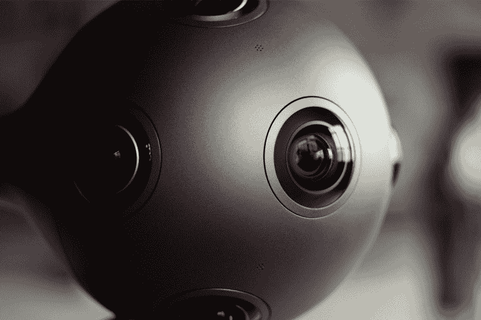

# 多亏了虚拟现实，你可以在哈佛最大的班级里坐在前排

> 原文：<https://www.freecodecamp.org/news/virtual-reality-harvard-cs50-16970919ebb2/>

哈佛大学录取率为 6%，是最难进的大学之一。

但是现在，有了虚拟现实的魔力，你可以假装自己是哈佛最大的校内课堂的学生。你坐在前排中间，能够环视周围礼堂里的学生。

### **这是 CS50**

[https://www.youtube.com/embed/FsYdgKO4AQU?feature=oembed](https://www.youtube.com/embed/FsYdgKO4AQU?feature=oembed)

CS50 是哈佛大学的“计算机科学和编程艺术的智能企业入门”edX (被称为 CS50x)上也提供相同的课程[，这是 edX 最大的课程。自该课程于 2012 年首次推出以来，已有超过 100 万名学生注册。](https://www.class-central.com/mooc/442/edx-cs50x-introduction-to-computer-science)

这也是 Class Central 有史以来排名前 50 的 MOOC 之一。我们的一位用户在这里写了一篇关于 CS50x 的深度[评论。](https://www.class-central.com/report/review-david-malan-cs50-introduction-to-cs/)

该课程每年秋季由大卫·马兰教授。它有时会邀请科技名人做客座演讲，如脸书创始人马克·扎克伯格和微软前首席执行官史蒂夫·鲍尔默。目前这门课也在耶鲁大学平行教授。

每次课程授课，讲课内容都被录音[放到网上](https://cs50.harvard.edu/)。前几年，他们还直接从哈佛的桑德斯剧院直播。

### **这是 CS50 VR**

*Nokia Ozo Virtual Reality camera*

但今年，CS50 团队正在尝试一些不同的东西。他们之前已经宣布将在虚拟现实中拍摄这个班级。

这些讲座正在诺基亚 OZO 的虚拟现实摄像机上以立体 360 度拍摄。每台相机售价 45000 美元。

VR 中的第一批讲座视频终于在几个小时前上线了。现在，世界上任何一个人都可以在世界上最大的教室之一获得前排座位。

你可以在他们的 YouTube 频道和他们的 T2 脸书页面上观看视频。为了获得最佳体验，请通过谷歌 Cardboard、三星 Gear VR、Oculus Rift 或 HTC Vive 使用 YouTube/脸书应用观看。

如果你没有合适的硬件，你仍然可以观看它。只需点击并拖动下面的视频四处看看。这是第一堂课，让你体验一下:

[https://www.youtube.com/embed/0C8a6GBF8Bg?feature=oembed](https://www.youtube.com/embed/0C8a6GBF8Bg?feature=oembed)

我是最受欢迎的在线课程搜索引擎的创始人兼首席执行官。你可以在这里看到他在修哪些课程:[class-central.com/@dhawal](https://www.class-central.com/@dhawal)

*注册 MOOCWatch，了解在线教育的最新动态，MOOCs watch 是 mooc 相关内容的月度文摘:[https://www.class-central.com/moocwatch](https://www.class-central.com/moocwatch)*