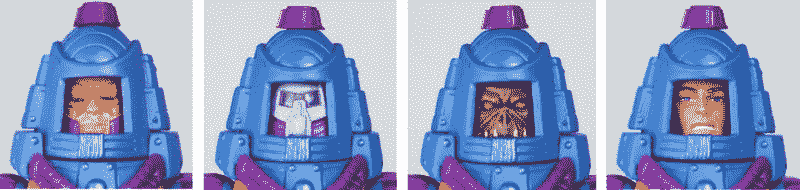
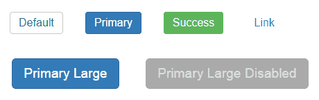
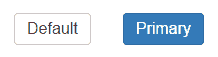
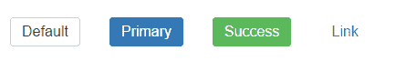

# 如何使用样式化组件创建 React 组件的可视变体

> 原文：<https://www.freecodecamp.org/news/visual-variants-for-react-components-with-styled-components-dfaff6a76273/>

吉拉德·达雅吉

# 如何使用样式化组件创建 React 组件的可视变体



[Styled-components](https://styled-components.com/) 是一个用于对 React 组件进行样式化的库，当它在 2016 年底推出时，在 React 世界掀起了风暴。该库功能强大且灵活。并且解决了经典 CSS 在所谓的组件时代出现的大部分[问题。](https://speakerdeck.com/vjeux/react-css-in-js)

在这篇文章中，我将探讨组件样式的一个方面:

如何实现一个可以有多个可视变量的组件？

我将向您展示使用样式化组件实现这一点的三种不同方式，我称之为:

**1:经典方法**

**2:组件方法**

**3:延伸途径**

我将假设您对 React 和样式化组件有所了解。但是如果你需要参考，两者都有很好的文档。你可以在这里找到 React 的文档[，在这里](https://facebook.github.io/react/docs/hello-world.html)找到 styled-component 的[。](https://www.styled-components.com/docs/)

你可以在这里看到每种方法的现场演示[。](https://www.webpackbin.com/bins/-KkNC0RNPi5Lywsh4Ry6)

### 视觉变体

在 React 中，组件将状态和道具转换成可视化表示。这通常意味着进入一个 DOM 元素。

有时，您需要一个组件在几种可视状态之间切换，这取决于某些条件。这意味着你需要改变组件的颜色来传达不同的信息。例如:

*   按钮可以是正常的、主要的、次要的、禁用的等等。
*   可以选择或不选择列表项。
*   表单元素可能是必需的，有错误或正常。

这种视觉变体模式的一个很好的例子是 [Bootstrap 的按钮样式](http://getbootstrap.com/css/#buttons)。您可以独立于按钮的内容来设计按钮的样式，并在大量的变体中进行选择。按钮的每个变体都有自己的语义目的(如成功或禁用)，而不是外观(如蓝色、圆形等)。).

那么，如何用样式化组件实现可视化变体呢？您可以使用经典方法、组件方法或扩展方法来实现这一点。

#### #1:经典方法



Results using the Classic Approach

Styled-components 完全支持 CSS。其中包括将样式规则应用于元素的“子类”的能力。这意味着您可以使用 CSS 类创建可视化变体，这与使用普通 CSS 没有太大区别。

要选择一个组件的变体，修改`className`属性。你也可以通过这种方式传递一些类，并组合几个变体，比如“primary”和“large”。

**例子**

```
// ButtonClassic.jsximport styled from 'styled-components'
```

```
const ButtonClassic = styled.button`  background: #fff;  color: #333;  font-size: 1em;  margin: 1em;  padding: 6px 12px;  border: 1px solid #ccc;  border-radius: 4px;  cursor: pointer;
```

```
/* Style sub-classes */  &.primary {    color: #fff;    background: #337ab7;    border-color: #2e6da4;  }  &.success {    color: #fff;    background-color: #5cb85c;    border-color: #4cae4c;  }  &.link {    color: #337ab7;    background-color: transparent;    border: none;    border-radius: 0;    font-weight: 400;  }  &.large {    font-size: 1.2em;    padding: 10px 16px;    border-radius: 6px;  }  &.disabled {    color: #ddd;    background-color: #aaa;    border: 1px solid #aaa;  }`;
```

```
export default ButtonClassic
```

**用途**

```
// ... &lt;ButtonClassic>Default</ButtonClassic>&lt;ButtonClassic className="primary">Primary</ButtonClassic><ButtonClassic className="success">Success&lt;/ButtonClassic>&lt;ButtonClassic className="link">Link</ButtonClassic>
```

```
// With Combos&lt;ButtonClassic className="primary large">  Primary Large</ButtonClassic>
```

```
&lt;ButtonClassic className="disabled primary large">  Primary Large Disabled</ButtonClassic>
```

**优点**

*   易于支持多种变体。
*   易于组合变体列表(例如，主要+大型+禁用)
*   代码是可读和紧凑的
*   易于从普通 CSS 移植样式

**缺点**

*   不使用标准组件设施(道具)
*   组合类时，结果取决于样式规则的声明顺序。就像经典的 CSS 一样。这可能会导致意外的行为。

#### #2:组件方法



Results using the Component Approach

风格化组件，顾名思义，就是普通的组件。也就是说他们可以收到道具。可以在样式声明中访问并用于确定样式规则值的属性。

我称之为组件方法，因为它像通常的 React 组件一样工作。其中属性值用于计算组件的视觉表示。在这种情况下，概念仅限于样式，而不是内容。

**例子**

```
// ButtonComponent.jsx import styled from 'styled-components'
```

```
const ButtonComponent = styled.button`  background: ${props => props.primary ? '#337ab7' : '#fff'};  color: ${props => props.primary ? '#fff' : '#333'};  font-size: 1em;  margin: 1em;  padding: 6px 12px;  border: ${props => props.primary ? '1px solid #2e6da4' : '1px solid #ccc'};  border-radius: 4px;  cursor: pointer;`
```

```
export default ButtonComponent
```

**用途**

```
// ...&lt;ButtonComponent>Default</ButtonComponent><ButtonComponent primary={true}>Primary</ButtonComponent>
```

**优点**

*   标准的 React 组件行为，从 props 派生出可视化表示

**缺点**

*   如果需要两种以上的状态，代码可能变得不可读
*   存在一些代码重复，尤其是如果不同变体之间的许多规则不同。

#### #3:扩展方法



Results using the extend way

除了原始元素，样式化组件还允许我们对定制组件进行样式化。因此您可以重新设置基本或默认组件的样式。并覆盖相关的样式规则以创建可视的变体。

**例子**

```
// ButtonExtend.jsximport styled from 'styled-components'
```

```
const ButtonExtend = styled.button`  background: #fff;  color: #333;  font-size: 1em;  margin: 1em;  padding: 6px 12px;  border: 1px solid #ccc;  border-radius: 4px;  cursor: pointer;`
```

```
export default ButtonExtend
```

```
export const ButtonExtendPrimary = styled(ButtonExtend)`  color: #fff;  background: #337ab7;  border-color: #2e6da4;`
```

```
export const ButtonExtendSuccess = styled(ButtonExtend)`  color: #fff;  background-color: #5cb85c;  border-color: #4cae4c;`
```

```
export const ButtonExtendLink = styled(ButtonExtend)`  color: #337ab7;  background-color: transparent;  border: none;  border-radius: 0;  font-weight: 400;`
```

**用途**

```
// ...&lt;ButtonExtend>Default</ButtonExtend><ButtonExtendPrimary>Primary<;/ButtonExtendPrimary&gt;<ButtonExtendSuccess&gt;Success</ButtonExtendSuccess><ButtonExtendLink>Link</ButtonExtendLink>
```

**优点**

*   每个变体都是一个独立的组件
*   容易有很多变种
*   代码可读性很强

**缺点**

*   要获得不同的变体，需要呈现不同的组件，而改变同一组件的属性可能更麻烦。
*   不容易支持多个变体的组合。

### 摘要

我已经列出了所有我有机会尝试的视觉变化的方法，但是可能还有其他的方法。哪种方法最好取决于您的具体需求和偏好。

如果你错过了上面的链接，在这个 [webpack bin](https://www.webpackbin.com/bins/-KkNC0RNPi5Lywsh4Ry6) 中可以找到代码示例的现场演示。

如果你知道其他使用样式组件的方法，请在下面的评论中告诉我。

**更新(2017 年 6 月 9 日)**

几天前发布了样式化组件 V2，它以一种稍微好一点的方式使用了扩展方法。

这种方法现在有一个名为`[extend](https://www.styled-components.com/docs/basics#extending-styles)`的特定函数。该函数类似于最初的方法，但是通过扩展旧的样式表创建了一个新的样式表。因此不会生成两个类。

因此，扩展方法的原始示例应该是这样的:

```
// ButtonExtendV2.jsximport styled from 'styled-components'
```

```
const ButtonExtendV2 = styled.button`  background: #fff;  color: #333;  font-size: 1em;  margin: 1em;  padding: 6px 12px;  border: 1px solid #ccc;  border-radius: 4px;  cursor: pointer;`
```

```
export default ButtonExtendV2
```

```
export const ButtonExtendV2Primary = ButtonExtendV2.extend`  color: #fff;  background: #337ab7;  border-color: #2e6da4;`
```

```
export const ButtonExtendV2Success = ButtonExtendV2.extend`  color: #fff;  background-color: #5cb85c;  border-color: #4cae4c;`// ...
```