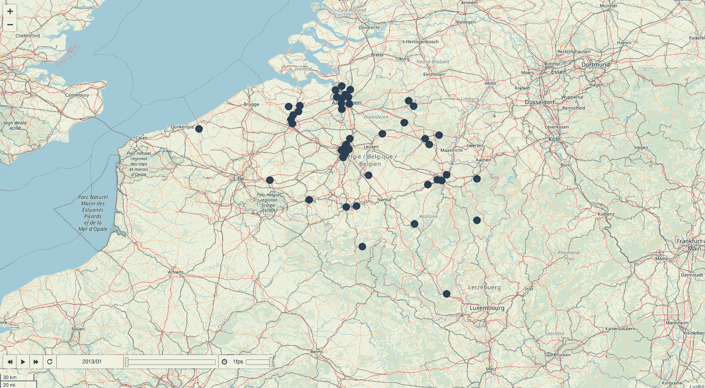

# 如何使用树叶地图可视化空气污染-深入教程

> 原文：<https://www.freecodecamp.org/news/visualizing-air-pollution-folium-maps/>

在我之前关于[预测空气污染](https://www.freecodecamp.org/news/forecasting-air-pollution-recurrent-neural-networks/)的报道中，我研究了使用递归神经网络(RNN 和 LSTM)预测比利时的空气污染。作为一个小项目，我认为 ****在地图**** 上绘制空气污染随时间的变化会很有趣。叶子包是一个很好的工具。

我们将绘制比利时 6 种空气污染物的数量:

*   ****【臭氧】****
*   ****【二氧化氮】****
*   ****【一氧化碳】****
*   ****【二氧化硫】****
*   ****【PM10】****
*   ****苯(c6h 6)****

**这些数据是从欧洲环境署的网站上下载的。如果你想使用其他欧洲国家的数据，我鼓励你访问他们的网站。它有许多欧盟国家的数据集，并且有很好的文档记录。**

**我们将使用的数据集是:**

*   **BE_ **<污染物 _ ID>**_ 2013–2015 _ aggregated _ time series . CSV**
*   **BE _ 2013–2015 _ metadata . CSV**

**污染物 id 在 [EEA 的空气污染物词汇表](http://dd.eionet.europa.eu/vocabulary/aq/pollutant)中描述。**

*   **1 =二氧化硫**
*   **5 =颗粒物质**
*   **7 =臭氧**
*   **8 =二氧化氮**
*   **10 =一氧化碳**
*   **20 =苯**

# **项目设置**

## **导入包**

```
`from pathlib import Path
import pandas as pd
import numpy as np

import seaborn as sns
import folium
from folium.plugins import TimestampedGeoJson

project_dir = Path('/Users/bertcarremans/Data Science/Projecten/air_pollution_forecasting')`
```

## **空气污染物**

**我们将制作一个空气污染物及其数据集编号、科学符号、名称和垃圾箱边缘的字典。bin 边缘基于这个[维基百科页面](https://nl.wikipedia.org/wiki/Luchtvervuiling)上的比例。**

```
`pollutants = {
    1: {
        'notation' : 'SO2',
        'name' :'Sulphur dioxide',
        'bin_edges' : np.array([15,30,45,60,80,100,125,165,250])
    },
    5: {
        'notation' : 'PM10',
        'name' :'Particulate matter < 10 µm',
        'bin_edges' : np.array([10,20,30,40,50,70,100,150,200])
    },
    7: {'notation' : 'O3',
        'name' :'Ozone',
        'bin_edges' : np.array([30,50,70,90,110,145,180,240,360])
    },
    8: {'notation' : 'NO2',
        'name' :'Nitrogen dioxide',
        'bin_edges' : np.array([25,45,60,80,110,150,200,270,400])
    },
    10: {'notation' : 'CO',
        'name' :'Carbon monoxide',
         'bin_edges' : np.array([1.4,2.1,2.8,3.6,4.5,5.2,6.6,8.4,13.7])
    },
    20: {'notation' : 'C6H6',
        'name' :'Benzene',
         'bin_edges' : np.array([0.5,1.0,1.25,1.5,2.75,3.5,5.0,7.5,10.0])
    }
}`
```

## **加载元数据**

**在元数据中，我们有每个采样点的 ****坐标**** 。我们需要这些信息在地图上标出取样点。**

```
`meta = pd.read_csv(project_dir / 'data/raw/BE_2013-2015_metadata.csv', sep='\t')`
```

## **彩色温标**

**有 10 个装订边，我们将使用不同的颜色。这些颜色是用 [ColorBrewer](http://colorbrewer2.org/#type=diverging&scheme=RdBu&n=10) 创造的。**

```
`color_scale = np.array(['#053061','#2166ac','#4393c3','#92c5de','#d1e5f0','#fddbc7','#f4a582','#d6604d','#b2182b','#67001f'])
sns.palplot(sns.color_palette(color_scale))`
```

****

# **数据准备**

## **加载时间序列数据**

**我们将日期变量转换为日期时间。这样我们就可以很容易地用它们来切割熊猫的数据帧。**

```
`def load_data(pollutant_ID):
    print('> Loading data...')
    date_vars = ['DatetimeBegin','DatetimeEnd']
    filename = 'data/raw/BE_' + str(pollutant_ID) + '_2013-2015_aggregated_timeseries.csv'
    agg_ts = pd.read_csv(project_dir / filename, sep='\t', parse_dates=date_vars, date_parser=pd.to_datetime)
    return agg_ts`
```

## **数据清理**

**我们将对数据进行一些基本的清理:**

*   **仅保留 P1D 的数据聚合过程的记录，以拥有每日数据**
*   **移除计数为 UnitOfAirPollutionLevel 的记录**
*   **移除可视化中多余的变量**
*   **移除少于 1000 个测量日的采样点**
*   **插入缺少的日期并用下一个有效日期的值输入 AirpollutionLevel**

```
`def clean_data(df):
    print('> Cleaning data...')
    df = df.loc[df.DataAggregationProcess=='P1D', :] 
    df = df.loc[df.UnitOfAirPollutionLevel!='count', :]
    ser_avail_days = df.groupby('SamplingPoint').nunique()['DatetimeBegin']
    df = df.loc[df.SamplingPoint.isin(ser_avail_days[ser_avail_days.values >= 1000].index), :]
    vars_to_drop = ['AirPollutant','AirPollutantCode','Countrycode','Namespace','TimeCoverage','Validity','Verification','AirQualityStation',
               'AirQualityStationEoICode','DataAggregationProcess','UnitOfAirPollutionLevel', 'DatetimeEnd', 'AirQualityNetwork',
               'DataCapture', 'DataCoverage']
    df.drop(columns=vars_to_drop, axis='columns', inplace=True)

    dates = list(pd.period_range(min(df.DatetimeBegin), max(df.DatetimeBegin), freq='D').values)
    samplingpoints = list(df.SamplingPoint.unique())
    new_idx = []
    for sp in samplingpoints:
        for d in dates:
            new_idx.append((sp, np.datetime64(d)))

    df.set_index(keys=['SamplingPoint', 'DatetimeBegin'], inplace=True)
    df.sort_index(inplace=True)
    df = df.reindex(new_idx)
    df['AirPollutionLevel'] = df.groupby(level=0).AirPollutionLevel.bfill().fillna(0)
    return df`
```

## **绘制空气污染随时间的变化图**

**对于地图来说，加载所有采样点的所有日期会过于繁重。因此，我们将 ****取每月最后一天的**** 数据进行重采样。**

****注意**:我们在本笔记本中使用的箱边缘通常应用于 O3、NO2 和 CO 的(半)小时平均值。在我们在本笔记本中使用的数据集中，我们只有日平均值。由于本笔记本只是为了说明如何在地图上绘制时间序列数据，我们将继续使用日平均值。然而，在欧洲经济区网站上，你也可以下载每小时的平均值。**

```
`def color_coding(poll, bin_edges):    
    idx = np.digitize(poll, bin_edges, right=True)
    return color_scale[idx]

def prepare_data(df, pollutant_ID):
    print('> Preparing data...')
    df = df.reset_index().merge(meta, how='inner', on='SamplingPoint').set_index('DatetimeBegin')
    df = df.loc[:, ['SamplingPoint','Latitude', 'Longitude', 'AirPollutionLevel']]
    df = df.groupby('SamplingPoint', group_keys=False).resample(rule='M').last().reset_index()
    df['color'] = df.AirPollutionLevel.apply(color_coding, bin_edges=pollutants[pollutant_ID]['bin_edges'])
    return df`
```

**为了显示污染随时间的演变，我们将使用 ****时间戳乔森**** [树叶插件](https://python-visualization.github.io/folium/plugins.html)。此插件需要 GeoJSON 输入功能。为了转换 dataframe 的数据，我创建了一个小函数****create _ geo JSON _ features****来完成这项工作。**

```
`def create_geojson_features(df):
    print('> Creating GeoJSON features...')
    features = []
    for _, row in df.iterrows():
        feature = {
            'type': 'Feature',
            'geometry': {
                'type':'Point', 
                'coordinates':[row['Longitude'],row['Latitude']]
            },
            'properties': {
                'time': row['DatetimeBegin'].date().__str__(),
                'style': {'color' : row['color']},
                'icon': 'circle',
                'iconstyle':{
                    'fillColor': row['color'],
                    'fillOpacity': 0.8,
                    'stroke': 'true',
                    'radius': 7
                }
            }
        }
        features.append(feature)
    return features`
```

**之后，输入要素被创建，我们可以创建一个地图来添加它们。TimestampedGeoJson 插件为时间滑块提供了一些简洁的选项，这些选项是不言自明的。**

```
`def make_map(features):
    print('> Making map...')
    coords_belgium=[50.5039, 4.4699]
    pollution_map = folium.Map(location=coords_belgium, control_scale=True, zoom_start=8)

    TimestampedGeoJson(
        {'type': 'FeatureCollection',
        'features': features}
        , period='P1M'
        , add_last_point=True
        , auto_play=False
        , loop=False
        , max_speed=1
        , loop_button=True
        , date_options='YYYY/MM'
        , time_slider_drag_update=True
    ).add_to(pollution_map)
    print('> Done.')
    return pollution_map
def plot_pollutant(pollutant_ID):
    print('Mapping {} pollution in Belgium in 2013-2015'.format(pollutants[pollutant_ID]['name']))
    df = load_data(pollutant_ID)
    df = clean_data(df)
    df = prepare_data(df, pollutant_ID)
    features = create_geojson_features(df)
    return make_map(features), df`
```

**以下是每种空气污染物的地图。你可以点击图片进入带有交互式地图的网页。通过点击 **播放** 按钮，可以看到空气污染物随时间的演变。**

## **二氧化硫**

```
`pollution_map, df = plot_pollutant(1)
pollution_map.save('../output/pollution_so2.html')
pollution_map`
```

**

[https://bertcarremans.github.io/air_pollution_viz/pollution_so2.html](https://bertcarremans.github.io/air_pollution_viz/pollution_c6h6.html)** 

## **颗粒物质**

```
`pollution_map, df = plot_pollutant(5)
pollution_map.save('../output/pollution_pm.html')
pollution_map`
```

**

[https://bertcarremans.github.io/air_pollution_viz/pollution_pm.html](https://bertcarremans.github.io/air_pollution_viz/pollution_c6h6.html)** 

**其他可视化可在以下位置找到:**

*   **[https://bertcarremans . github . io/air _ pollution _ viz/pollution _ c6h 6 . html](https://bertcarremans.github.io/air_pollution_viz/pollution_c6h6.html)**
*   **[https://bertcarremans . github . io/air _ pollution _ viz/pollution _ co . html](https://bertcarremans.github.io/air_pollution_viz/pollution_co.html)**
*   **[https://bertcarremans . github . io/air _ pollution _ viz/pollution _ NO2 . html](https://bertcarremans.github.io/air_pollution_viz/pollution_no2.html)**
*   **[https://bertcarremans . github . io/air _ pollution _ viz/pollution _ O3 . html](https://bertcarremans.github.io/air_pollution_viz/pollution_o3.html)**

# **结论**

**通过这个故事，我想展示使用 leav 在地图上可视化时间序列数据是多么容易。所有污染物的地图和 Jupyter 笔记本可以在 [GitHub](https://github.com/bertcarremans/air_pollution_forecasting/blob/master/notebooks/Visualizing%20Air%20Pollution%20in%20Belgium.ipynb) 上找到。请随意重复使用它来绘制你祖国的空气污染图。**