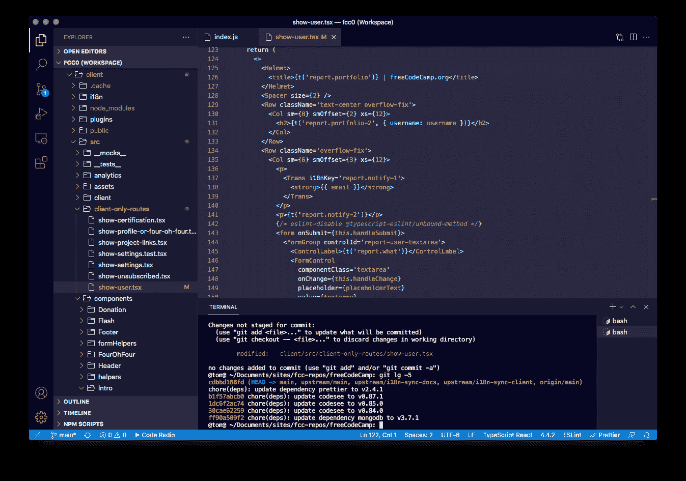

# VS 代码黑暗主题 Visual Studio 代码的 freeCodeCamp 夜间模式风格

> 原文：<https://www.freecodecamp.org/news/vs-code-dark-mode-theme/>

我很兴奋地分享 freeCodeCamp 的第一个官方 VS 代码扩展——一个黑暗模式主题。

这个主题使用 freeCodeCamp.org 独特的配色方案、排版和 UI 设计风格。

这种夜间模式的主题是极简的，看起来很舒服，并且会帮助你达到一种编码流的状态。

下面是这个夜间模式主题的预览:

VS Code Dark Mode Theme – freeCodeCamp Style

你可以从 [Visual Studio Marketplace](https://marketplace.visualstudio.com/items?itemName=freeCodeCamp.freecodecamp-dark-vscode-theme) 下载这个主题。

或者你可以打开你的 VS 代码编辑器的扩展标签，搜索“freeCodeCamp Dark Theme”来安装它。

 <https://user-images.githubusercontent.com/20648924/134989466-a695b16a-6a52-41b8-b104-cb9e9f400994.mov> 

## 关于黑暗模式主题

这个主题基于 freeCodeCamp 的“命令行时尚”视觉美学。如果你想感觉自己在机器人先生里，这种风格很适合你。

我们设计这个夜间模式主题是为了在对比和味道、可读性和光晕之间取得平衡。

如果你是一个设计爱好者，我们已经在非营利组织的[设计风格指南](https://design-style-guide.freecodecamp.org/)中编纂了命令行风格。

我想你会喜欢的。快乐编码。