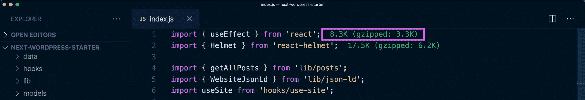
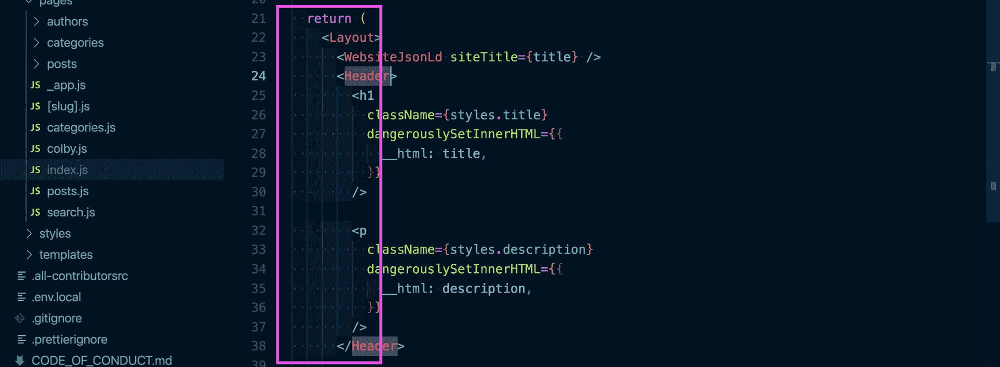
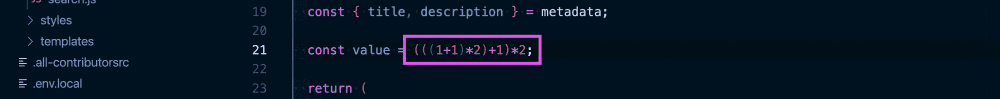
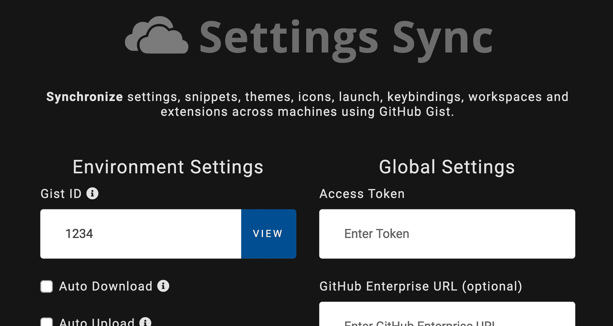
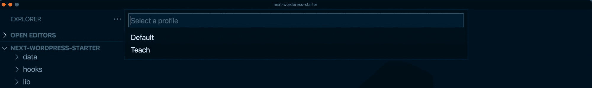
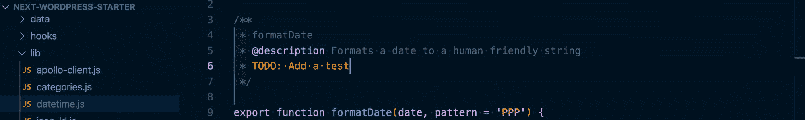
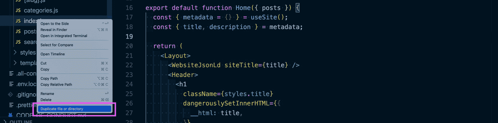

# VS 代码扩展将提高您的开发效率

> 原文：<https://www.freecodecamp.org/news/vs-code-extensions-to-boost-your-development-productivity/>

拥有一个适合您工作流的好的文本或代码编辑器对于开发人员的生产力来说是至关重要的。默认情况下，VS 代码有很多特性，但是这里有 7 个扩展，可以帮助你的工作流程更上一层楼。

*   [什么是 VS 代码？](#what-is-vs-code)
*   [VS 代码扩展](#vs-code-extensions)
*   [升华文本键盘映射和设置导入器](#sublime-text-keymap-and-settings-importer)
*   [进口成本](#import-cost)
*   [缩进-彩虹](#indent-rainbow)
*   [彩虹括号](#rainbow-brackets)
*   [设置同步](#settings-sync)
*   [配置文件切换器](#profile-switcher)
*   [更好的评论](#better-comments)
*   [重复动作](#duplicate-action)

[https://www.youtube.com/embed/OIWVJj9yRbA?feature=oembed](https://www.youtube.com/embed/OIWVJj9yRbA?feature=oembed)

## 什么是 VS 代码？

如果你不熟悉的话，快速说明一下。VS Code ，是 Visual Studio Code 的缩写，是一个流行的文本或代码编辑器，由微软团队维护。

在过去的一两年里，它在开发者市场中占有巨大的份额，成为了 web 开发者的首选编辑器。

再加上微软在这方面投入了大量时间，独立开发人员也在开发大量的扩展，试一试是不会错的。

## VS 代码扩展

VS 代码之所以伟大，部分原因在于它的可扩展性。它允许开发人员通过实现微软可能不想支持的功能，甚至在它的基础上用 [Foam](https://foambubble.github.io/foam/) 构建一个完整的笔记体验，创造性地将编辑器带到另一个层次。

虽然在 [VS Code Marketplace](https://marketplace.visualstudio.com/vscode) 中有数以千计的扩展可用，但这 7 个扩展对我作为一名活跃的开发人员的工作流程至关重要。

## 升华文本键映射和设置导入程序

在转向 VS 代码之前，我是一个 Sublime Text 3 用户。它仍然是一个很棒的文本编辑器，但是当转到 VS 代码时，许多快捷键和键映射都不一样了。

Sublime text 键映射和设置导入程序让我首先从 Sublime Text 导入我的设置，但是它也设置了默认的键映射。这使得 Sublime 中可用的快捷方式在 VS 代码中立即可用。


Sublime Text key mappings in VS Code

这包括我最喜欢的两个选项，比如多选(选择一些东西，然后按下 CMD+D / Ctrl+D)和复制一行(在一行上添加光标，然后按下 CMD+Shift+D / Ctrl+Shift+D)。

[升华文本键盘映射和设置导入器](https://marketplace.visualstudio.com/items?itemName=ms-vscode.sublime-keybindings)(marketplace.visualstudio.com)

## 进口成本

现代开发人员必须不断处理来自各种来源的依赖性。当我们引入一堆不同的代码来构建我们的项目时，额外的代码是有代价的。



Showing import size in VS Code

[Import Cost](https://marketplace.visualstudio.com/items?itemName=wix.vscode-import-cost) 计算一个导入的大小的估计值，让我们可以看到在增加依赖项的情况下，我们的项目大小会增加多少额外的权重。

这有助于我们认识到依赖项的大小，防止大型库的意外过载，以免影响性能和损害客户的用户体验。

[进口成本](https://marketplace.visualstudio.com/items?itemName=wix.vscode-import-cost)(marketplace.visualstudio.com)

## 缩进-彩虹

风格是使我们的代码可读的一个重要因素。这种风格的一部分是我们如何缩进代码，所以我们理解不同代码块的嵌套。

问题是有时嵌套会变得很大，很难找到哪个开始标记属于哪个结束标记。



Rainbow-colored indent spacing in VS Code

indent-rainbow 为缩进空间添加颜色，让我们可以轻松地排列起来，并查看哪些标签属于彼此。

[缩进-彩虹](https://marketplace.visualstudio.com/items?itemName=oderwat.indent-rainbow)(marketplace.visualstudio.com)

## 彩虹括号

与缩进类似，当您在同一语句中多次使用括号时，复杂代码(尤其是在使用 math 时)会产生容易混淆的代码行。

例如，如果我们想应用一些简单的数学:

```
const value = (((1+1)*2)+1)*2; 
```

虽然这是一个简单的例子，但很容易失控，难以追踪。



Rainbow-colored brackets in VS Code

[彩虹括号](https://marketplace.visualstudio.com/items?itemName=2gua.rainbow-brackets)用不同的颜色突出显示括号，让我们更好地了解等式中哪个左括号属于哪个右括号。

[彩虹括号](https://marketplace.visualstudio.com/items?itemName=2gua.rainbow-brackets)(marketplace.visualstudio.com)

## 设置同步

如果您通常在两台笔记本电脑或两个不同的环境中工作，如果您对设置很挑剔(像我一样)，您可能必须手动保持文本编辑器不变。



Configuration for Settings Sync in VS Code

[设置同步](https://marketplace.visualstudio.com/items?itemName=Shan.code-settings-sync)允许你在 GitHub Gist 中保存你的 VS 代码设置。这让您可以跨不同的 VS 代码安装同步这些设置

[设置同步](https://marketplace.visualstudio.com/items?itemName=Shan.code-settings-sync)(marketplace.visualstudio.com)

*注意:如果你想了解更多，[我写了一个教程](https://www.freecodecamp.org/news/how-to-sync-vs-code-settings-between-multiple-devices-and-environments/)，带你一步一步地设置它！*

## 配置文件切换器

作为一名内容创作者，我需要确保当我向他人展示我的屏幕时，我使用了易于理解的颜色和字体大小，让人们能够轻松地看到我正在演示的内容。

问题是这些设置不是我每天埋头编码时喜欢使用的。



Switching profiles in VS Code

[Profile Switcher](https://marketplace.visualstudio.com/items?itemName=aaronpowell.vscode-profile-switcher) 允许您设置多个 VS 代码配置文件，每个配置文件都有自己的配置，允许您在不同的设置之间轻松切换。

[情景模式切换器](https://marketplace.visualstudio.com/items?itemName=aaronpowell.vscode-profile-switcher)(marketplace.visualstudio.com)

## 更好的评论

当你写代码的时候，注释可能看起来并不重要，但是注释对于帮助他人理解代码是至关重要的。当你一年后审视它时，它们通常也会帮助你理解它。

这些评论是有帮助的，但它们可能很难阅读，因为它们通常都是灰色的，不一定突出。



Keyword highlighting of comment blocks in VS Code

这就是 [Better Comments](https://marketplace.visualstudio.com/items?itemName=aaron-bond.better-comments) 的用武之地，它为注释添加了一种语法高亮，为关键字和语句添加了颜色，这有助于代码注释的可读性。

[更好的评论](https://marketplace.visualstudio.com/items?itemName=aaron-bond.better-comments)(marketplace.visualstudio.com)

## 重复动作

最后一个看起来很小，但是由于某种原因，默认情况下，VS 代码没有右键单击文件并复制它的能力。

当我埋头写代码时，我通常会复制一个文件，就像一个现有的模板，这允许我只修改内容。这使得创建新页面更有效率。



Duplicate file or directory option in VS Code

[复制动作](https://marketplace.visualstudio.com/items?itemName=mrmlnc.vscode-duplicate)当你右击一个文件或文件夹时，简单地将复制文件或文件夹选项添加到上下文菜单中。

[重复动作](https://marketplace.visualstudio.com/items?itemName=mrmlnc.vscode-duplicate)(marketplace.visualstudio.com)

## 你最喜欢的扩展名是什么？

有大量的扩展可以做令人惊奇的事情——你最喜欢的是什么？通过在 Twitter 上与我分享[让我知道](https://twitter.com/colbyfayock)！

[](https://twitter.com/colbyfayock)

*   [🐦在 Twitter 上关注我](https://twitter.com/colbyfayock)
*   [📺订阅我的 Youtube](https://youtube.com/colbyfayock)
*   [📫注册我的简讯](https://www.colbyfayock.com/newsletter/)
*   [💝赞助我](https://github.com/sponsors/colbyfayock)