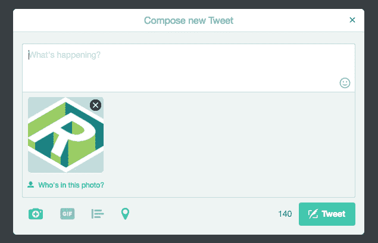
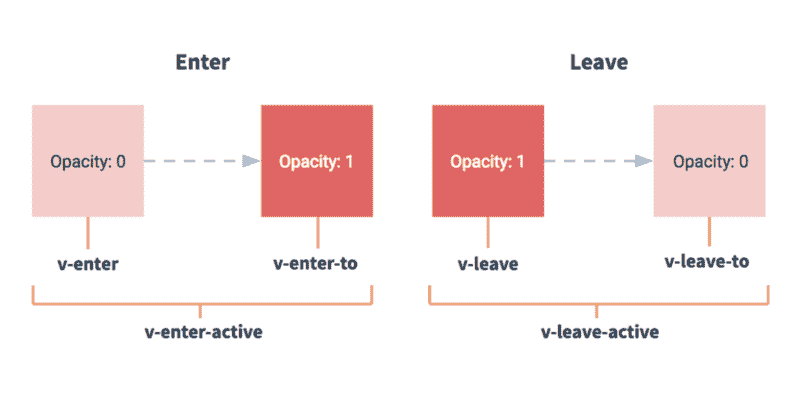

# Vue.js 介绍，适合那些对 jQuery 了解不多的人

> 原文：<https://www.freecodecamp.org/news/vue-js-introduction-for-people-who-know-just-enough-jquery-to-get-by-eab5aa193d77/>

作者马特·罗森伯格

# Vue.js 介绍，适合那些对 jQuery 了解不多的人


The logo for Vue.js

多年来，我一直对 JavaScript 爱恨交加。

我通过设计和开发社区最喜欢的替罪羊 [jQuery](https://jquery.com/) 了解了这门语言。你看，当我开始学习 JavaScript 时，作为一名“编码设计师”，使用 jQuery 是一种神奇的体验。我可以做情态动词`fadeIn`和`fadeOut`。有了第三方库，我只需要一个函数调用就可以将视差滚动添加到我的文件夹中。几乎所有我能想到的东西都被封装在一个大约 100kb 的文件[中…](https://code.jquery.com/jquery-3.2.1.min.js)

然后[棱角](https://angularjs.org/)就出来了。我有*没有* *的选择*但是用框架重做我的整个投资组合。然后[反应过来](https://facebook.github.io/react/)就出来了。我没有选择，只能重做我在图书馆的整个文件夹。然后 [Vue.js](http://vuejs.org) 出来了。我没有选择，只能重做我在图书馆的整个作品集…你看这是怎么回事。

抛开所有玩笑，我非常喜欢通过用这些不同的框架和库到处构建东西来磨练我的 JavaScript 能力。在这个过程中，我阅读了无数的文章和教程，但没有一篇比 Shu Uesugi 的文章更让我难忘，“React.js 简介，给那些对 jQuery 了解不多的人看”

Shu 带领读者——他们被认为对 JavaScript 基础知识和 jQuery 有一定程度的精通——在 React 的世界中进行了一次旅程，他们构建了 Twitter 的“撰写推文”组件的克隆。

这个概念框架对我很有帮助，因为我是一个边做边学的人。事实上，每当一个新的 JavaScript 库出现时，我都会回到本文中的例子进行测试。所以，我想借用这个框架，带你们了解我最近学习 Vue 的经历。

在你开始下面的步骤之前，我强烈建议你阅读舒的文章。他做了一项了不起的工作，指导您编写 jQuery 代码来实现这些特性。因此，为了减少冗余的风险，我将重点向您展示 Vue 的来龙去脉。

### 我们正在建造的东西

我们大多数人都发推特(有些人比其他人更丰富)。所以我们很可能熟悉下面截图中的用户界面组件。



Twitter’s “Compose Tweet” box

信不信由你，这个 UI 组件是一个很好的例子，展示了 Vue(和 React，按照舒的说法)如何改善 JavaScript/jQuery 开发人员的生活。我们今天将重点构建的这个组件的元素是:

*   用户可以在这里输入他们的推文
*   根据推文长度启用/禁用>上的`<butt`
*   指示剩余字符数(140 个字符中)的计数器，并改变颜色以警告用户该限制
*   一个相机图标，点击后，用户可以将照片附加到他们的推文中
*   已附加的照片列表
*   一个按钮(每张照片一个)将照片从推文中删除

#### 如果你卡住了

如果你在任何时候遇到令人困惑或解释不清的事情，不要犹豫，发微博给我，地址是 [@mattrothenberg](https://twitter.com/mattrothenberg) 。当你阅读这篇文章的时候，请记住:不是你，肯定是我。

让我们开始吧。

#### 我们如何建造它

今天，我们将使用 [CodePen](https://codepen.io) 来构建我们的“撰写推文”组件。对于外行人来说，CodePen 是一个在线 HTML/CSS/JavaScript 编辑器，类似于 [JSBin](http://jsbin.com/) 或 [JSFiddle](http://jsfiddle.net) 。对于每一步，我将嵌入一个带有相关代码的 CodePen。

### 步骤 1:搭建项目支架

在编写任何 JavaScript 之前，我们需要做的第一件事是为我们的“撰写 Tweet”组件编写标记。今天我们将使用[超光速粒子](http://tachyons.io/)来满足我们几乎所有的文体需求(这样我们就不必编写无关的 CSS，可以专注于标记和 JavaScript)。

我假设你对 CSS 非常了解，所以我不会花时间带你了解超光速粒子的造型方法(TL；so 博士风格，多类，很实用)。

在这个代码栏中，我还通过 CDN 引入了 Vue。事实上，Vue 的一个主要卖点是简单，可以集成到新的或现有的代码库中。

一切就绪后，让我们开始一些功能工作。

### 第二步:实现第一个特性——Tweet 按钮最初应该被禁用

**功能描述**:禁用蓝色 Tweet 按钮，直到用户在`textarea`中输入至少一个字符。

首先，让我们设置我们的 Vue 实例。如上所述，Vue 以其简单的安装和易用性赢得了开发人员的青睐。我们可以用下面的代码构造一个 Vue 实例。

```
new Vue({  el: '#twitterVue',  data: {    tweet: ''  },  computed: {    tweetIsEmpty: function() {      return this.tweet.length === 0;    }  }})
```

让我解释一下这是怎么回事—

*   `el`指的是我们附加 Vue 实例的 DOM 元素。这应该类似于通过传入给定的选择器来实例化 jQuery 插件，不管是类名还是 ID。
*   是一个描述我们实例的数据模型或状态的对象。我们可以在 HTML 中访问这个模型中指定的属性——通过一个特殊的花括号语法`{{tweet}}`——也可以在实例本身中访问(提示，请看`tweetIsEmpty`函数的主体)
*   `computed`是一个对象，正如您可能猜到的那样，它描述了基于我们的数据模型的计算属性。建议不要在 HTML 中添加逻辑，而是通过在 Vue 实例的`computed`键上定义的函数来封装这种状态(或者任何派生的值)。

现在把我们的注意力转向 HTML，你会发现我们的标记与第一个 CodePen 相比变化非常小。具体来说，我们做了三点改变。

1.  我们将 id `twitterVue`添加到最外面的`div`中，这样我们就可以构建我们的 Vue 实例。

```
<div id="twitterVue">...</div>
```

2.我们将`**v-model**`指令添加到我们的`textarea`中，从而在用户输入和我们实例的数据模型之间创建了一个[双向绑定](https://vuejs.org/v2/guide/forms.html)。现在，每当用户输入`textarea`，我们实例的数据模型上的`**tweet**`属性就会自动更新。

```
<textarea v-model="tweet"></textarea>
```

3.我们将`**:disabled**`属性添加到我们的`button`中。`disabled`前面的冒号表示我们希望*将引号内的内容作为 JavaScript 表达式来评估*。如果我们省略冒号，内容将被视为字符串。您还会注意到，我们添加了几行 CSS 来为禁用的按钮提供独特的视觉样式。

```
<button :disabled="tweetIsEmpty">Tweet</button>
```

```
...
```

```
button[disabled] {  cursor: not-allowed;  opacity: .5;}
```

4.我们还在实例上添加了一个名为`**tweetIsEmpty**`的计算属性。注意，这个属性实际上是一个*函数*，它根据我们的数据模型的`tweet`属性的长度返回一个布尔值。Vue 使得在 HTML(如上所示)和实例本身中访问数据模型变得非常简单。感谢双向数据绑定的魔力，当`tweet`的值被更新时，这个函数被求值。当函数评估为*真*时，我们的按钮被禁用，反之亦然。

```
tweetIsEmpty: function() {  return this.tweet.length === 0;}
```

不可否认，当我第一次开始使用 Vue 时，这感觉就像是镜花水月。对我有帮助的是，当我与组件交互时，可以真正地*看到*我们的数据模型发生了什么。因为我们可以通过前面提到的花括号语法轻松地访问 HTML 中的数据模型，所以我们可以构建一个快速、可视化的反馈循环。得分！

```
<p>The value of <strong>tweet &lt;/strong>is: {{tweet}} </p><p>The value of <;strong>tweetIsEmpty</strong>is: {{ tweetIsEmpty}}</p>
```

如果过程中有任何令人困惑的地方，请随时重复这个步骤(要么是由于我糟糕的写作或编码能力，要么是由于 Vue 本身)。如果您有任何特殊问题，请发送推文或发表评论。

### 步骤 3:实现第二个特性——显示剩余的字符数

**功能描述**:当用户输入时，显示推文中剩余的字符数(140 个字符中的一个)。如果用户输入超过 140 个字符，禁用蓝色 Tweet 按钮。

到目前为止，我们已经了解了双向数据绑定和计算属性，这些概念是 Vue 的核心。这是我们的幸运日，因为我们可以利用这些概念来构建我们的下一个特性:向用户显示还剩多少字符(总共 140 个),如果超过了这个限制，就禁用按钮。

我将再次指导您完成实现该特性所需的 JavaScript 和 HTML 更改。

在我们的 JavaScript 中，我们做了一些事情。

1.  作为内务措施，我们列举了一条 tweet 的最大长度(140 个字符)作为常数，`**MAX_TWEET_LENGTH**`。

```
const MAX_TWEET_LENGTH = 140;
```

2.我们添加了另一个计算属性`**charactersRemaining**`，它动态返回 140 和用户输入的 tweet 长度之间的差值。

```
charactersRemaining: function() {  return MAX_TWEET_LENGTH - this.tweet.length;}
```

3.我们将旧的`**tweetIsEmpty**` 属性重命名为`**tweetIsOutOfRange**` ，并相应地更新了函数的逻辑。注意我们是如何使用计算出的`**charactersRemaining**` 属性来派生*这个*值的。代码重用万岁！

```
tweetIsOutOfRange: function() {  return this.charactersRemaining == MAX_TWEET_LENGTH       || this.charactersRemaining < 0; }
```

在 HTML 方面，由于 Vue 的双向数据绑定的强大功能，我们只需要做一些修改。

```
<div class="flex items-center">  <span class="mr3 black-70">{{ charactersRemaining }}</span>  <button :disabled="tweetIsOutOfRange" class="button-reset bg-blue bn white f6 fw5 pv2 ph3 br2 dim">Tweet</button></div>
```

对于视觉学习者来说，请看魔术:

### 步骤 4:实现第三个特性:“剩余字符”指示器的条件样式

**功能描述:**撰写推文时，当只剩下二十个字符时，“字符剩余”指示器的颜色应变为深红色，当只剩下十个或更少字符时，变为浅红色。

用 jQuery 操作元素的样式或类可能很麻烦，Vue 提供了一种更简洁的方法。Vue 的方法感觉更具宣示性，因为你描述了*如何*你希望某事的风格改变(例如，基于一个给定的状态),并且你让 Vue 做了繁重的工作。

在这个特性的上下文中，我们的“剩余字符”指示器有两个这样的状态，每个状态都有一个对应的 CSS 类。

1.  当剩下 10 到 20 个字符时，指示器应该有`dark-red`类
2.  当剩余的字符少于十个时，指示器应该有`light-red`类

现在你的 Vue 大脑应该在喊“计算属性！”所以，让我们服从这个大脑，把这些属性连接起来。

```
underTwentyMark: function() {  return this.charactersRemaining <= 20     && this.charactersRemaining > 10;  },underTenMark: function() {  return this.charactersRemaining <= 10;}
```

有了我们的逻辑，让我们来看看 Vue 处理条件样式的方式之一:`v-bind:class`指令。此指令需要一个对象，其键是 CSS 类，其值是相应的计算属性。

```
{ 'dark-red': underTwentyMark, 'light-red': underTenMark }
```

通过向包围我们的“剩余字符”指示器的`span`标签添加指令，我们已经完成了我们的特性。

```
<span   v-bind:class="{ 'dark-red': underTwentyMark, 'light-red': underTenMark }">  {{ charactersRemaining }}</span>
```

在幕后，由于双向数据绑定，Vue 将根据指定的计算属性来处理这些类的添加和删除。

### 第五步:实现第四个功能:“附上照片”UX

**功能描述:**允许用户通过文件选择器对话框将单张照片附加到他们的推文中。照片上传后，将其显示在`textarea`下方，并允许用户通过点击图像来删除附件

公平的警告:在这个部分有很多事情在进行。美妙之处在于，尽管这个特性增加了相当多的功能，但我们不必写那么多代码。所以，让我们从把交互设计分解成几个步骤开始。

1.  用户点击“添加照片”按钮
2.  用户看到一个文件选择器对话框，可以选择**一张** **照片**上传
3.  选择照片后，`textarea`下方会出现一个方框，里面是所选的照片
4.  用户点击圆形 **X** 按钮移除照片
5.  用户从步骤 1 中看到初始状态

到目前为止，我们还没有做任何事件处理(监听按钮点击、输入更改等)。如您所料，Vue 通过向我们提供`v-on`指令(简称@指令)使处理此类事件变得容易。通过将一个方法作为该指令的值来传递，我们可以有效地监听 DOM 事件，并在它们被触发时运行 JavaScript。

在开始我们的专题工作之前，先做一些速射练习。

事件处理非常简单，只需向给定按钮添加`@click`指令，并向 Vue 实例上的`methods`键添加相应的方法。

```
<button @click="logNameToConsole">Log User's Name<;/button>...methods: {  logNameToConsole: function() {    if( this.name !== 'Donald Trump' ) {      console.log(this.name);     } else {      console.warn('Sorry, I do not understand');    }  },}
```

回到我们的特色工作…在这一步，我们的标记和 JavaScript 在以下方面发生了变化:

1.  我们添加了一个带有`**@click**`指令的`button`。当用户点击这个按钮时，就会调用`**triggerFileUpload**` 方法。

```
<button @click="triggerFileUpload">...</button>
```

因此，在我们的 JavaScript 中，让我们添加一个`methods`键到我们的 Vue 实例中，该方法在其中，以及我们的照片的数据属性。

```
data: { photo: null},computed: {},methods: {  triggerFileUpload: function() {    this.$refs.photoUpload.click(); // LOLWUT?  },}
```

2.众所周知，[风格的 HTML5 文件输入](http://stackoverflow.com/questions/572768/styling-an-input-type-file-button)非常困难。一种解决方法是在 DOM 中放一个`input`并用 CSS 隐藏它。为了让浏览器打开本地文件选择器，必须点击`input`*。然而，它如何被点击，以及客户端如何处理用户上传的内容，则是另一回事。*

*在我们的标记中，我们添加了一个这样的`input`，并用一个特殊的`hide`类隐藏它。我们还添加了其他一些值得一提的属性:*

```
*`<input ref="photoUpload" @change="handlePhotoUpload" type="file" class="hide">`*
```

*   *属性用来注册一个对给定 DOM 元素的引用。给定这个引用，我们可以用`**this.$refs.photoUpload**`访问 JavaScript 代码中的 DOM 元素。这意味着我们可以通过编程在这个元素上触发一个`click()`事件，从而绕过上面描述的挑战。*
*   *点击输入是一回事；处理用户上传的文件是另一回事。幸运的是，Vue 允许我们通过`@change`指令将一个处理程序附加到输入的 change 事件。我们传递给这个指令的方法将在用户从文件选择器中选择一个文件后被调用。这个方法`**handlePhotoUploa**d`相当简单*

```
*`handlePhotoUpload: function(e) {  var self = this;  var reader = new FileReader();        reader.onload = function(e) {    // Set that base 64 string to our data model's 'photo' key    self.photo = (e.target.result);  }  // Read upload file as base 64  string  reader.readAsDataURL(e.target.files[0]); }`*
```

*深呼吸，因为这个功能我们快完成了！*

*一旦用户上传了一张照片，我们需要在`textarea`下面显示一个盒子，里面有选中的照片。正如元素的条件样式在 Vue 中轻而易举，元素的条件*呈现*或显示也是如此。您会注意到，在我们的 HTML 中，我们在`textarea`下面添加了以下标记。*

```
*`<div v-if="photoHasBeenUploaded">  <figure>    &lt;button @click="removePhoto">      ...    &lt;/button>      </figure></div>`*
```

*Vue 提供了一些模板助手(`v-if`、`v-show,`、`v-else`等)，帮助你有条件地显示和隐藏内容。当传递给该指令的 JavaScript 表达式的计算结果为 true 时，将呈现该元素，反之亦然。*

*在我们的例子中，我们添加了一个评估计算属性`**photoHasBeenUploaded**`的`**v-if**`语句。*

```
*`photoHasBeenUploaded: function() {  return this.photo !== null;}`*
```

*当该函数评估为 true 时——当我们的数据模型的 photo 键不等于 null 时——整个`div`被渲染。瞧啊。*

*在这个`div`中，我们渲染了两个元素:*

1.  *通过将我们的数据模型的`photo`键的内容传递给 Vue 的`v-bind:src`指令而附加的图像*
2.  *一个 delete 按钮，它是另一个`@click`处理程序的例子，这个特殊的例子调用一个函数，通过将我们的数据模型的`photo`键设置为 null 来“删除”照片。*

```
*`removePhoto: function() {  this.photo = null;}`*
```

*我们快到了。*

### *第六步:修正，用户可以附上“ ***照片****

*因此，我们可以有效地处理一个用户将一张*照片附加到 Tweet，但是如果她想要上传许多照片呢？**

*到目前为止，您应该在想一些大意如下的事情:“我想这里唯一显著的变化是能够在文本框下方有条件地显示多个*图像，考虑到我们已经连接了我们的事件处理程序……”，您是正确的！让我们看看我们需要遵循的步骤**

1.  *我们需要通过将`photo`更改为`photos`来更新我们的数据模型，新的键是一个 base64 字符串的*数组*(而不是一个 base64 字符串)*

```
*`data: {  photos: []},`*
```

*2.我们需要更新我们的计算属性`photoHasBeenUploaded`来检查新的`photos`键的长度，现在它是一个数组。*

```
*`photoHasBeenUploaded: function() {  return this.photos.length > 0;}`*
```

*3.我们需要更新我们的输入处理程序`@change`来*循环*上传的文件，并将它们推到我们的`photos`键上。*

```
*`handlePhotoUpload: function(e) {  var self = this;  var files = e.target.files;`*
```

```
 *`for(let i = 0; i < files.length; i++) {    let reader = new FileReader();`*
```

```
 *`reader.onloadend = function(evt) {      self.photos.push(evt.target.result);    }`*
```

```
 *`reader.readAsDataURL(files[i]);  }},`*
```

*然而，在 HTML 方面，我们必须进入新的领域。用 jQuery 迭代数据和呈现内容可能很麻烦。*

```
*`var array = [1, 2, 3, 4, 5];var newHTML = [];for (var i = 0; i < array.length; i++) {    console.log('UGHHHHHH');    newHTML.push('<span>' + array[i] + '</span>');}$(".element").html(newHTML.join(""));`*
```

*幸运的是，Vue 通过`v-for`指令对这个过程进行了抽象。这个指令期望您用 `(thing, index) in collectionOfThings`的形式[提供一个表达式，其中`collectionOfThings`是源数组，`thing`是被迭代的数组元素的别名，`index`是该元素的索引。](https://vuejs.org/v2/guide/list.html)*

*一个典型的例子可能是这样的:*

*之前我们为用户上传的照片准备了一个单独的`figure`元素，现在我们将拥有对应于`photos`源数组长度的 *N 个* `figure`标签。*

*幸运的是，我们的标记不需要太大的改变，因为设计的整体结构还是一样的。*

```
*`<figure v-for="(photo, index) in photos">  &lt;button @click="removePhoto(index)">    ...  </button>  </figure>`*
```

*我们需要做的一个改变是围绕着`removePhoto`方法，在此之前，将我们的数据模型上的单个`photo`键设置为`null`。现在，由于我们有了 *N* 张照片，我们必须将元素的索引传递给`removePhoto`方法，并将该元素从数组中取出。*

```
*`removePhoto: function(index) {  this.photos.splice(index, 1);}`*
```

### *第七步:动画+额外学分*

*在 Twitter 的 UI 中，“撰写 Tweet”组件以模态方式打开。在我们的压轴戏中，我想应用我们到目前为止学到的所有 Vue 技巧，并再介绍一个:[过渡](https://vuejs.org/v2/guide/transitions.html)。*

*

Transition Lifecycle* 

*提醒一句，过渡在 Vue 领域是一个巨大的话题。我们将检查并实现这一功能的一小部分，即将第三方动画库 [Velocity JS](http://velocityjs.org/) 与 Vue 集成。*

*简而言之，Vue 提供了一个`transition`组件，允许您为其中包含的元素添加进入/离开动画，前提是元素被设置为通过`v-if`或`v-show`指令有条件地显示。*

```
*`<transition   name="modal-transition"  v-on:enter="modalEnter"   v-on:leave="modalLeave">    <div v-if="modalShowing">       <!-- Our modal contents goes here ! -->    </div></transition>`*
```

*在我们的例子中，我们附加了两个方法，它们对应于产品化生命周期中的两个事件:`v-on:enter`和`v-on:leave`。因此，我们将这些方法定义添加到我们的 Vue 实例中，遵从 Velocity JS 来`fade`我们的模态输入和输出。*

```
*`methods: {  modalEnter: function(el, done) {    Velocity(el, 'fadeIn', { duration: 300, complete: done, display: 'flex' })  },  modalLeave: function(el, done) {    Velocity(el, 'fadeOut', { duration: 300, complete: done })  }}`*
```

*如上所述，当包含在其中的元素被有条件地设置为 display 时，`transition`将被触发。因此，在我们的`transition`组件的内部`div`上，我们添加了一个`v-if`声明，它的值是一个布尔值`modalShowing`。让我们相应地更新实例的数据模型。*

```
*`data: {  modalShowing: false}`*
```

*现在，当我们想要显示模态时，我们所要做的就是将 boolean 设置为 true！*

```
*`<button @click="showModal">Compose Tweet</button>`*
```

*并写一个方法来匹配。*

```
*`hideModal: function() {  this.modalShowing = false;},showModal: function() {  this.modalShowing = true;},`*
```

*通过一些 CSS 技巧，我们还在背景上附加了一个`click`事件处理程序，这样用户就可以隐藏模态。得分！*

```
*`<div   @click="hideModal"  class="backdrop"></div>`*
```

### *结论*

*好吧，我希望这不会太痛苦(并且你在这个过程中学到了一两件事)。我们只看了 Vue 所能提供的一小部分，但是，如上所述，这些概念对于释放 Vue 的潜力是至关重要的。*

*我承认，把 Vue 比作 jQuery 是不公平的。它们是不同时代的产品，有着完全不同的用例。然而，对于那些努力通过 jQuery 学习 DOM 操作和事件处理的人来说，我希望这些概念能够为您的工作流带来一些新鲜空气。*