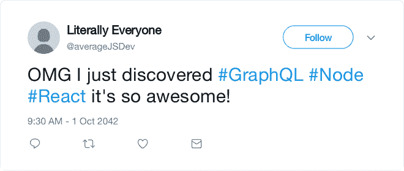
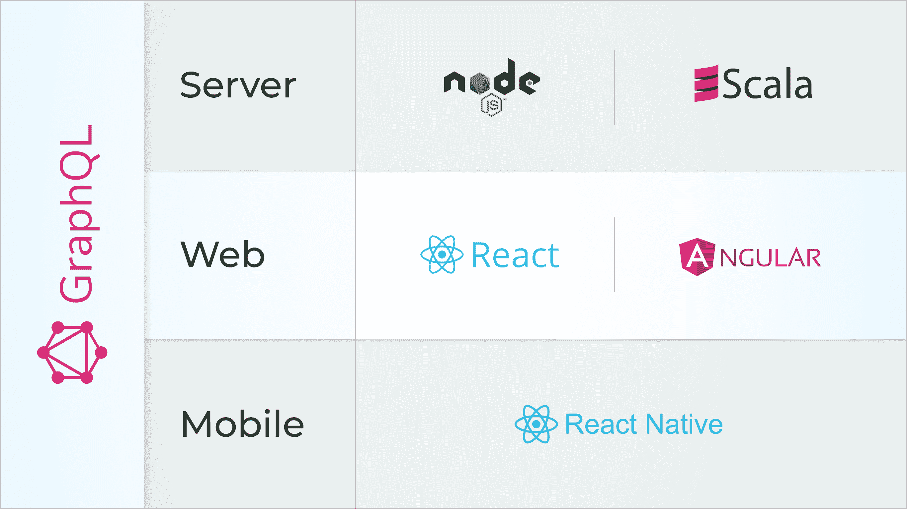
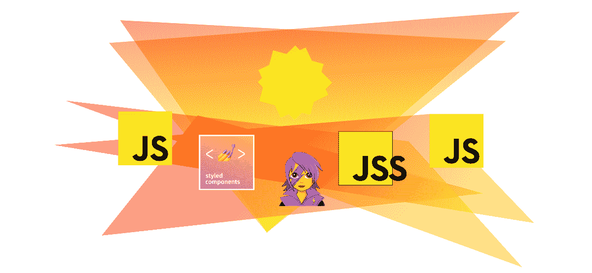

# Vulcan 和 AUSK 的比较:如何充分发挥 Node、React 和 GraphQL 的潜力

> 原文：<https://www.freecodecamp.org/news/vulcan-and-ausk-use-node-react-and-graphql-to-their-full-potential-3/>

## 加速开发的 NRG 堆栈

你可能从未听说过 Vulcan.js 或 Apollo Universal Starter Kit——至少现在还没有。

但我很确定你听说过 React、Node.js 和 GraphQL。好吧，这就是我们所说的轻描淡写:你可能已经看到了数百万条关于这三者及其神奇力量的推文、博客文章、聚会和播客。



Sums up 2017-2020 in one tweet

web 开发人员称赞这些技术有很多很好的理由。然而，如果您曾经试图从头开始编写一个现代的全栈 JavaScript 应用程序，您可能会注意到它会产生大量的样板文件。

这对于一般功能来说尤其令人讨厌:设置认证、设置数据库、设置主应用程序组件、设置设置…

Vulcan.js 和 AUSK 都旨在让你成为快速高效的全栈 JavaScript 开发者。两者都依赖于模块化架构，React 用于 UI，Node 用于后端，Apollo graphQL 用于客户端/服务器通信层。两者都提供了大量的预编码模块，因此您可以专注于有价值的功能。

然而，他们每个人对这个问题采取非常不同的方法，所以我想你可能喜欢比较。

首先让我们介绍一下竞争对手。

*免责声明:我是 Vulcan.js 的贡献者，但是我在我客户的项目中使用了这两种技术，所以我会尽可能保持客观。*

## 阿波罗通用初学者工具包


好吧，当他们说宇宙，他们的意思是宇宙。你见过包含 Scala 服务器的 JavaScript 样板文件吗？和 Expo 的完整 React 本地设置？他们甚至通过支持两者来结束永恒的(令人讨厌的)角度与反应的争论。



Technologies included in AUSK: Node, Scala, React, Angular and React Native, all tied by GraphQL. Kind of the Oscar ceremony of modern web development.

我没什么好说的了。我的意思是，再看看这个堆栈，这是一个 web 开发人员最疯狂的梦想！

我其实还有一点要补充的:它还包括 Bootstrap 和 Ant Design 作为样式框架，Knex 连接 SQL 数据库(不包括 MongoDB 连接但很容易做到)，它是用 TypeScript 编写的。JS/GraphQL 应用程序的所有核心特性都在样板文件(菜单、认证等)中提供。)+作为示例的几个更高级别的模块。

链接:[https://github.com/sysgears/apollo-universal-starter-kit](https://github.com/sysgears/apollo-universal-starter-kit)

## 火神:超越宇宙，同构


还记得流星和望远镜吗？我知道 JS 生态系统发展很快，但这个黄金时代就像是在 2、3 年前。

Meteor 是第一个完全利用服务器端和客户端 JavaScript 组合的框架，允许编写在两种环境下运行的同构代码。Telescope 是一个 Meteor 样板应用程序，旨在充分享受其面向包的架构。

尽管仍在许多专业应用程序中使用，并为许多开发人员所知，但 Meteor 受到一些技术限制的削弱，这些限制阻止了它的更广泛使用:它的 webpack 不兼容的构建系统，它的软件包管理器现在被 NPM 超越，或者它消耗 RAM 的实时数据交换协议。

我还没有发现一个框架能让 devs 的效率达到 Meteor 的一半。但是别担心，现在有一个强有力的竞争者。你明白了:瓦肯人！

Apollo GraphQL 和一个面向包的 rational 架构的使用，让 Vulcan 克服了 Meteor 的局限性，同时享受到了同样的优势:完全模块化的架构、声明式编程、同构等等。

Vulcan 应该是 JavaScript 生态系统的轨道。易于上手，但足够完整，可以编写任何应用程序。

查看我以前的文章，获得针对开发速度的 Vulcan 模式的更完整描述。

链接:[http://vulcanjs.org/](http://vulcanjs.org/)

## #1:框架与样板

这些工具的第一个主要区别是:AUSK 是样板文件，而 Vulcan 是框架。你可能会问，区别在哪里？

### 火神，一个框架

框架旨在通过提供一组特定的函数和助手，使您在日常工作中成为更高效的开发人员。它通常被设计成与你的应用程序分开。每当发布新版本的框架时，您可以随时更新您的应用程序。

我们通常根据专业化水平来区分框架和图书馆。框架通常允许交付业务级的特性，而库是一个更专业的技术工具。但两者的工作原理基本相同。

框架或库的局限性在于，当它们抛弃你时，你可能会感到失落。当 bug 不在你的 app 里，而是在 React 或者 Apollo 里，你会怎么做？

我的经验是，当使用一个框架时，你应该准备好为它的开发做贡献，至少在你遇到 bug 时公开问题。

### 奥斯克，样板文件

样板文件是一段写得很好的代码，具有完整的工作开发环境。仅此而已。有了样板文件，就很难跟上更新的步伐，因为样板文件代码并没有与你的应用程序明确分离。有点像弹出后创建 React 应用程序。

它通常只提供很少的自定义方法。你会在第一个月感觉更快，并且你会从一个经过战斗考验的架构中受益，但是你的巡航速度最终会和没有样板文件的时候差不多。

样板文件比框架更自由，但对效率的影响也更小。

## #2 学习曲线

### Vulcan: GraphQL 制作简单

Vulcan 可能是初步掌握 GraphQL 的一个好方法，因为…您不需要实际编写 GraphQL。该框架基于您的数据模型为您生成 GraphQL 模式和解析器。使用 GraphiQL 或 GraphQL Voyager 等开发工具，您可以可视化和使用模式，以了解您的特性如何转化为 graphi QL。

第二步，了解火神本身的逻辑。“Vulcan Starter”应用程序中包含一个实时教程来帮助您完成这个过程。

### AUSK:对于纯粹主义者

AUSK 架构更接近于 Express 开发者所习惯的。想象一下您的 canonical Express 应用程序，但是安装了 GraphQL 和基于包的架构。没有惊喜。

这也意味着，除了 Node、Express 和 React 以及您使用的任何数据库之外，您还需要掌握使用 AUSK 的 GraphQL 基础知识(但 Vulcan 也是如此)。幸运的是，它提供了一些例子来帮助您完成这个过程，包括创建和列出数据，甚至上传文件。

### 结论:全栈开发人员需要掌握很多东西

JavaScript 生态系统越来越成熟，这也意味着初学者更难学习和理解。

为了充分享受这些技术，您至少需要一些现代 JavaScript 和 React 开发的知识。

不要期望在第一天就充分发挥生产力。也就是说，有很多免费或付费的课程可以学习现代全栈 JavaScript 开发。研究奥斯克和瓦肯可以成为灵感的不可思议的来源。

## #3 开发速度

### 将所有的事情自动化

如果使用得当， [Vulcan 在提供特性方面速度惊人](https://www.freecodecamp.org/news/how-i-built-an-app-with-vulcan-js-in-four-days-6368814077b1/)。这是因为它非常依赖自动生成，所以只要正确定义数据模型，它可以在几个小时内生成应用程序中最相关的部分。

这种模式被称为声明式编程:您“声明”您的应用程序如何工作，并让框架来完成这项工作。这很难实现，但是非常强大。

### 更多的自由

由于 AUSK 侧重于样板文件，添加基本功能有点困难，因为这是一个多步骤的过程:

*   编写您的 GraphQL 模式
*   解析器、突变也是如此
*   对于您的数据库模型也是如此(使用 Knex 或 Mongoose)
*   React 组件也是如此
*   …

然而，如果你需要写一个定制的特性，用 AUSK 会比用 Vulcan 更容易。所以如果你的数据模型很少，但是功能复杂，AUSK 会比 Vulcan 更高效。

希望通过一个创新的领域驱动设计启发的模式系统，[领域模式](https://github.com/sysgears/domain-schema)，使 AUSK 更具声明性。

### 结论:为正确的用例选择正确的工具

全栈 JS 开发没有神奇的通用技术。每个框架的开发速度在很大程度上取决于底层用例。对于面向数据的平台和专业工具，我倾向于选择 Vulcan，对于需要更多定制功能的 B2C SaaS 平台，我倾向于选择 AUSK。

## #4 社区、支持和成熟度

### 火神:流星的继承人

Vulcan 是来自 Sacha Greif 的一个框架，他是一个很长时间的 Meteor 开发人员，并且非常投入于 JavaScript 社区(JS 的状态和 CSS 的状态等等)。

有一个活跃的空闲，初学者和其他爱好者可以快速找到他们的问题的答案。

### AUSK:一个积极维护的项目

AUSK 由 SysGears 公司维护，特别是该公司的创始人 Victor Vlasenko。

该项目与 Gitter 有关联。在我最近一次与 AUSK 的自由职业任务中，Victor 非常迅速地回答了我的问题。在我尝试之后，他甚至合并了故事书支持。

### 结论:小而富的社区

这两种技术都在多个项目的生产中使用，因此它们已经可以安全使用了。这些社区正在积极发展，对初学者也很友好。

如果你需要建立一个团队，不要指望找到精确了解这些技术的自由职业者，他们太具体了。相反，应该专注于寻找能够快速学习的全栈 JavaScript 开发人员。或者，你可以去源头，在[瓦肯](http://slack.vulcanjs.org/)或[奥斯克](https://gitter.im/sysgears/apollo-fullstack-starter-kit)社区中找到真正的专家。

## #5 部署

不用多做比较，这两个框架都允许部署在提供免费服务的平台上，如 Zeit Now 和 Heroku，以及部署在您自己的定制服务器上。

## #6 代码可伸缩性和模块化模式

### 瓦肯人:共同努力

框架的一个优点是工作共享。最终用途更加清晰，因此允许我们在框架本身中集成各种优化。

Vulcan 提供了回调/挂钩、增强和集中注册等模式，以充分受益于其面向包的架构。例如，我们能够将材料 UI 添加到一个应用程序中，包括 SSR，而无需更改 Vulcan 核心模块中的一行代码。

更准确地说，Vulcan 为每个数据结构提供了不同的`register`方法，比如`registerComponent`，还提供了回调，比如允许包装根`App` React 组件的`router.wrapper`。您只需要在包入口级(`main`文件)导入文件一次。

### 奥斯克:从正确的轨道开始，自己完成

模块化架构限制了编写意大利面条式代码的诱惑。它支持跨应用程序的代码重用。每个包都有一个`index.ts`文件，声明相关的中间件、启动函数、与其他模块共享的 graphQL 函数。

名副其实的`module`模块为每个环境提供了注册新模块的类，比如`ServerModule`和`ClientModule`。这是唯一一个在应用程序级别直接使用的模块。

```
 export default new ServerModule({
    onAppCreate: [ callback1, callback2]
}) 

```

在内部，所有模块将合并成一个大模块，最终将用于创建应用程序。例如，所有的`onAppCreate`回调将一个接一个地运行。

这是一种相对干净的模式和非常智能的架构。我的意思是，即使模块管理器也是一个模块，这不是很美吗？

但剩下的就看你自己了。很好，你将能够优化一切！那么，您打算将 GraphQL 解析器和 Mongo 数据库松耦合吗？使用哪些工具？如何将 GraphQL 模式转换成 Mongo 投影？你会使用数据加载器编写连接器吗？

重点是:编写一个可伸缩的应用程序很难。非常辛苦。如果你想学，那对你有好处。因为这个原因，我很高兴使用 AUSK，自己动手做事情是最好的学习方式。

### 结论:你厌恶风险吗？

对于 AUSK 和 Vulcan 来说，代码可伸缩性意味着模块化架构。每当代码变得过于复杂或不可读时，解决方法很简单:将其分割成更小、更简单的部分。

瓦肯人的建筑更大胆，一切都可以模块化。这种野心是有风险的，有时很难知道谁在什么时候注册了什么。

AUSK 模块化模式更容易阅读，但功能也稍逊一筹。例如，在不触及核心包代码的情况下，可能很难添加复杂的全局特性。然而它们对于大多数用例来说已经足够了，你不必成为一个模块化纯粹主义者来编写好的应用程序。

## #6 手机

### 瓦肯人:和科尔多瓦一起

火神基于的流星嵌入了科尔多瓦。因此，您的 web 应用程序可以通过一个命令行捆绑成一个移动应用程序。

然而，Vulcan 不提供用于本地应用的工具。当然，你仍然可以创建一个独立的 React 原生应用程序，并将其插入 Vulcan。auth 系统的改进(目前 Vulcan 的最后一部分真正依赖于 Meteor)计划在未来几个月内进行，以促进这种连接。

### AUSK:使用反应原生

结合“普通”React 和 React Native 的设置是 AUSK 的最佳特性之一。毕竟是万能入门套件！我自己不怎么使用移动设备，但能够快速创建一个与我的 web 界面共享同一个服务器的原生移动应用程序让我感到放心。

### 结论:AUSK 更擅长移动优先

如果你特别需要写一个移动应用，AUSK 会更适合。尽管如此，Vulcan 允许仅在一个命令行中用您的代码构建一个移动应用程序，如果移动版本对您来说更次要，这是没问题的。

## #7 改变用户界面:一个棘手的问题

创建一个允许即时 UI 库改变的全栈框架是 CSS 时代才有的梦想。还记得那些允许通过点击一个按钮来切换主题的网站吗？



“What logo can we pick for our nice CSS-in-JS lib?” “I don’t know, kind of a badass warrior woman?” “Yeah it makes total sense” — creators of [Emotion](https://github.com/emotion-js/emotion), probably

然后 JS 国进攻了。使用 React 组件，很难提供这样的特性(除了微小的颜色变化)，因为样式和设计现在与底层 React/Angular/Vue 组件紧密相关。

每个 React UI lib 都有自己定义按钮的方式，甚至不用讨论主题化。对于像 AUSK 和 Vulcan 这样的全栈技术来说，这是一个问题，因为选择一个样式框架是一个品味问题。他们不能只是提出一个确定的选择，然后强迫你坚持。Bootstrap 不再垄断，每个开发者都有自己喜欢的库。

为了解决这个问题，两者都有相似的方法。他们用 Bootstrap 编写了一组规范的组件，然后试图允许用另一个库(如 Ant Design 或 Material UI)替换这些组件。

这让代码变得很奇怪。例如，AUSK 按钮将使用一个`color`道具，因为这是引导程序工作方式。如果你切换到蚂蚁设计，你也需要使用颜色道具，即使蚂蚁设计使用了一个`type`道具。

由于 UI 框架选择通常只发生一次，在所有开发过程中被迫使用一组非规范的道具对于多 UI 框架支持来说似乎是一个非常高的代价。

在开发过程中，我建议尽可能避免使用定制 UI 的预编码组件。构建样板文件/框架提供的示例和通用特性很酷，但在编写应用程序的自定义部分时就没那么酷了。

相反，根据您的选择，使用 Ant Design 或 Bootstrap 或 Material UI 提供的底层组件，并尝试编写自己的 UI 库。你可以查阅故事书来帮助你，因为它包含在 AUSK 和 Vulcan 两个版本中。

## #8 自由搏击

如果我要保留这些技术特有的与众不同的特性，它们将是这些。

### 伏尔甘

图式系统。据我所知，没有一个框架能够生成数据库结构、服务器入口点、客户机/服务器通信层和生产就绪前端(表单、列表等)。)从单个 JSON 模式。

Vulcan.js 可以在使用最新 js 技术的同时做到这一点。

### 奥斯克

我没有设法只选择一个，所以我喜欢的 AUSK 特性应该是打字稿和本地反应。

围绕静态类型化 JavaScript 的好处已经争论了几年，是更喜欢 Flow 还是 TypeScript……而 TypeScript 无疑赢得了这场战斗。在 Vulcan 中使用 TypeScript 是可能的，但是由于使用了 Meteor，目前感觉不自然并且编译很慢。AUSK 使用 TypeScript 作为默认设置，这太棒了。

还有 React Native……嗯，还有关于用 React 写手机 app 是否相关的争论。您可以选择坚持使用响应式 web 应用程序，但至少您知道一切都为您设置好了，因为为 React Native 配置 dev env 并不总是一件容易的事情。

* * *

## 你做出选择了吗？

需要考虑的因素太多了，比如性能、安全性、开发运维、授权管理……选择合适的工具来构建您的 JavaScript 应用肯定不是一个简单的选择。我希望这篇文章能给你有价值的见解，帮助你做这个决定。

如果你仍然感到犹豫，请联系我，我很乐意回答他们:)

你也可以将任何关于 AUSK 的问题提交给 Victor Vlasenko 和他在 SysGears 的团队，并加入 T2 Vulcan 的专用 Slack 来访问 Vulcan 社区。

我最后的建议很简单:给瓦肯和奥斯克一个机会，他们值得你花时间！

感谢 Sacha Greif 和 Victor Vlasenko 审阅本文。

[](https://twitter.com/lbke_fr)

* * *

我是法国公司 le brun Burel Knowledge Engineering(LBKE)的联合创始人——[https://www . LBKE . fr](https://www.lbke.fr)

*总是乐于谈论代码、机器学习、创新创业！*