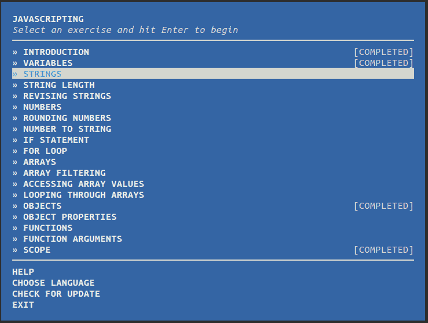
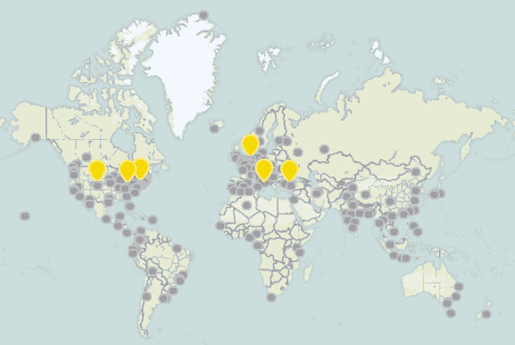
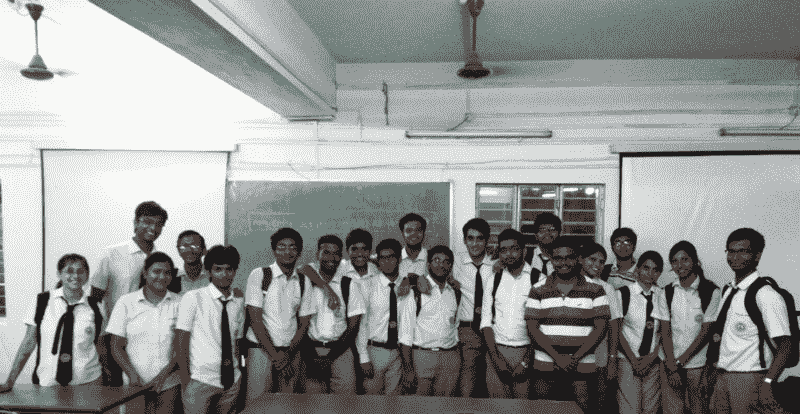
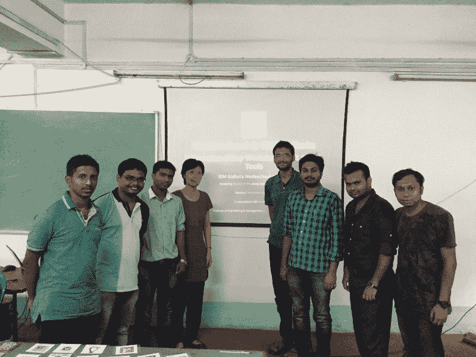
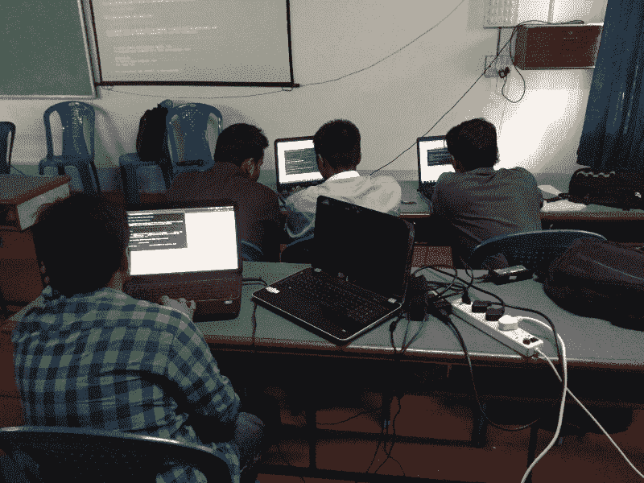
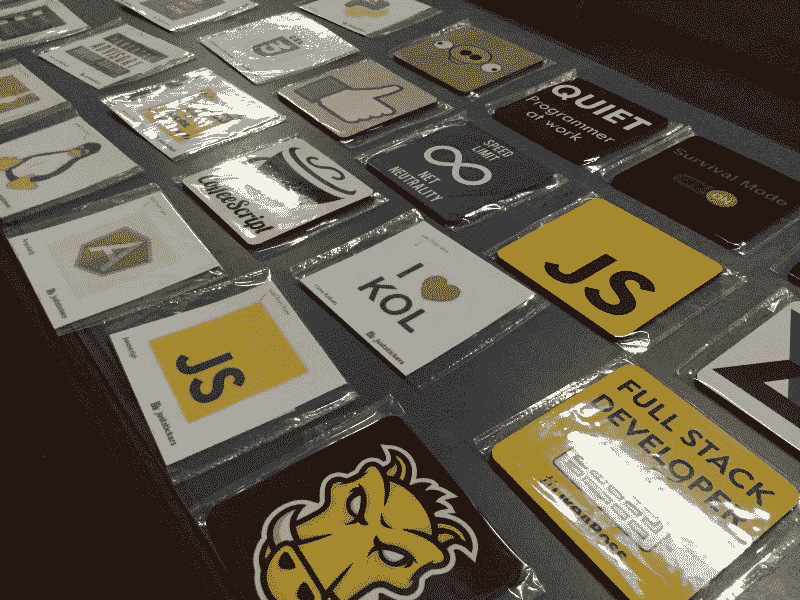

# 用 JavaScript 唤醒沉睡的城市

> 原文：<https://www.freecodecamp.org/news/waking-up-a-sleeping-city-with-javascript-3b9740e094bd/>

作者 koustuv sina

# 用 JavaScript 唤醒沉睡的城市

Image Credits : [Debayan Bhattacharya](https://www.youtube.com/channel/UC-eec5VdR8OiCGqMQzkxucg)

不是一次，而是两次，我们的学院成为了一个由高产和迷人的人们组成的国际社区的一部分。最近一次发生在上周六，2016 年 5 月 21 日。从里斯本到拉合尔，从贝尔格莱德到本加卢鲁，从柏林到班布里奇，我们在同一天聚集在一起庆祝一个全球性的事件，一个教授、学习和破解 JavaScript / NodeJS 概念的有趣事件。被边界分割，被 JavaScript 统一！没错，我说的就是 [NodeSchool 国际日](http://nodeschool.io/international-day)！

#### NodeSchool 简史

在一个晴朗的日子里，来自一个即将成立的大胆的开源黑客社区的几个人决定用一种语言的力量来挑战这个世界，而其他人认为这种语言“太慢”、“是一种玩具语言”和“仅限于网络”。他们一起建造了一个简单的“[工作室](https://github.com/workshopper/workshopper)模块，叫做[溪流探险](https://github.com/substack/stream-adventure)。

什么是工作室？这是一个简单的框架，显示一组需要在您的终端上完成的挑战，并在其中集成了一个测试运行器来测试您的代码解决方案。

javascripting Workshopper

然后，这些人继续创建最初的 workshopper 模块，如[Java 脚本](https://github.com/sethvincent/javascripting)和 [learnyounode](https://github.com/workshopper/learnyounode) ，它们由初级 JS 和 NodeJS 问题组成。他们认为，“嗯，这很有趣。我们应该有一个专注于这些事情的活动！”

很快，想法涌入，成为 NodeJS 生态系统(npm)中的模块。参与者创建了知识库并建立了网站。2013 年末，第一次正式的 NodeSchool 活动在硅谷举行。

社区开始成长，地方分会在世界各地涌现。截至 2016 年 5 月，全球共有超过 165 个城市分会，迄今已举办了 500 多场活动！

NodeSchool Upcoming and Past Events

#### 节点来到加尔各答

去年 7 月，我突发奇想，想在我的城市举办一次 NodeSchool 活动。科技方面，加尔各答是一个悠闲的城市，几乎没有聚会或黑客马拉松可言。大多数很酷的活动不是在班加罗尔就是在海德拉巴。我们有一个 IT 园区——这里被称为 V 区——这是初创公司和大公司的乌托邦。但我们只能说，它没有印度其他大都市那么繁荣。

这里有科技公司，但大多数是服务型的。没有太多的产品或创业足迹。仅仅因为当前的形势，我所在城市的本科生和研究生错过了最重要的网络和技能学习的媒介。因此，他们求助于加入基于服务的 IT 巨头，这些巨头只是将他们视为可任意使用的资源。

Sector V, Kolkata, India

只有很短的时间来设置一切，我联系了 NodeSchool 的核心团队成员，Adam Brady，请他指导我。我对这件事有三个优先考虑:

*   在我的城市和我的大学里创造意识
*   培训大学生，用新技术帮助他们成长
*   让我们的大学走向世界

所有的 NodeSchool 分会都是以城市为基础的。这意味着，从技术上讲，我必须主持加尔各答的 NodeSchool。但是由于时间和空间的限制，我有了一个更好的主意。为什么不设立一个较小的大学级别的分会呢？在和 Adam 商量后，他同意了我的提议，于是, [NodeSchool IEM 加尔各答分部](https://github.com/nodeschool/iem-kolkata)于 2015 年 8 月诞生了。

我们在 2015 年 8 月 31 日举办了首届研讨会，有 25 名参与者。我们一起使用 JavaScript 和 Git 在初学者 NodeSchool 模块上编码。

至少可以说，就新的开始而言，它超出了我的预期！与会者带着一些实践知识、一些免费贴纸和更多的信心回家了！ [IEM 加尔各答](http://iem.edu.in/)加入世界地图，[Max Odgen](https://github.com/maxogden)(node school 的主要创始人)[评论我们的 pics](https://github.com/nodeschool/iem-kolkata/issues/3) ！

NodeSchool Workshop in IEM Kolkata on 31st August, 2015

正如热力学第二定律所预言的，研讨会之后，这种兴趣消失到了最低限度。但这并没有阻止我实现我的目标。我找了几个长期感兴趣的人，在他们中间开了一个小通讯。我们保持联系，分享重要的链接、资源和教程。

快进到 2016 年 5 月。NodeSchool 国际日就要到了，而计划仅仅在一周前就开始了！最后一年的学生 Himanshu Kashyap 这次通过宣传活动、处理后端任务和指导帮助了我。我们发出了邀请，缓存了研讨会软件以便我们可以离线使用，配置了我们的网站，并注册了国际日分会。我们已经准备好参加活动了！我们甚至得到了[印度道德黑客学校](https://www.isoeh.com/)——一家由我们的校友 [Kirit Sankar Gupta](https://www.linkedin.com/in/kiritsankargupta) 创办的创业公司——来赞助这次活动！

这一次大自然与我们作对。整个城市的大雨阻止了一半已经登记参加活动的人出现。尽管如此，我们还是带着 Nodeschool 国际日的真正精神继续前进，开始了与 Bengaluru 和大阪车队的比赛。

上次我们在设置一切时遇到了一些小问题，但这次由于研讨会已经缓存在我的系统中( [local-npm](https://github.com/nolanlawson/local-npm) )，安装非常容易。

到午餐时间，每个人都已经完成了基本的*Java 编写*模块，并且渴望更多！午饭后，我们用 *git-it* 和 *learnyounode* 模块继续 Git、Github 和 NodeJS 的基础知识。我们还与[伊恩·克罗泽](https://github.com/iancrowther)、[伦敦](http://nodeschool.io/london/)章节主持人以及[东京](http://nodeschool.io/tokyo/)和[柏林](http://nodeschool.io/berlin/)章节的现场[出场](https://appear.in/)聊天！在一天结束的时候，我们分发了贴纸和杯垫，然后去了 Bisk Farm 吃了一轮小吃和饮料。

一旦有足够多的人感兴趣，我最终计划将我们的分会与一个更大的加尔各答分会合并。培养对我们城市的兴趣和意识需要时间，但我们都应该为此而努力。

据《卫报》报道，在接下来的两到三年里，印度每月将有超过 100 万人年满 18 岁。这对我们的社会来说是一个巨大的负担。此外，我们的国家正面临着熟练工程师的严重短缺，一些[研究](http://timesofindia.indiatimes.com/tech/tech-news/Over-80-of-engineering-graduates-in-India-unemployable-Study/articleshow/50704157.cms)认为目前 80%的工程师无法就业。为什么？原因包括平庸的工程学院、低质量的课堂教育、更少的机会，最重要的是，更少的人脉。

然而，我的城市并不全是坏事。由于一些很酷的企业家，我们正在经历一个以城市为基础的创业公司的缓慢涌入，如 [Sumeet Chawla](https://www.linkedin.com/in/chawlasumeet) ，他在创立了 [JustStickers .在那里我们为我们的活动购买很酷的贴纸和杯垫。他对这座城市的热爱将他从班加罗尔拉了回来，他带回了自己的经验，并立即付诸实践。我们需要更多像他这样的企业家来制造创新产品，反过来帮助我们的城市逐步成为一个更加科技友好的地方。](http://juststickers.in/)

Stickers and Coasters from JustStickers at our Nodeschool Event, May 2016

NodeSchool 和自由代码营社区的成员拥有比原始专业知识更重要的东西。他们有爱心，渴望建立人际网络，渴望帮助他人。这提高了每个参与者的能力水平。

协作是成功的关键。我们希望通过定期举办 Nodeschool、自由代码营等活动，在我们的城市建立一个更好的技术社区，并不断推动我们的城市成为一个更有见识、更有技能和更积极主动的一代。

加入我的探索。**为[大悦城](https://www.quora.com/Why-was-Kolkata-given-the-nickname-City-of-Joy)T3。**

非常感谢[阿里吉特·莱耶克](https://github.com/alayek)出色的编辑和不断的激励。如果你想取得联系，请用 [Gitter](https://gitter.im/koustuvsinha) 联系我。[帮助我们策划](https://gitter.im/nodeschool/kolkata)一个更大的加尔各答活动。