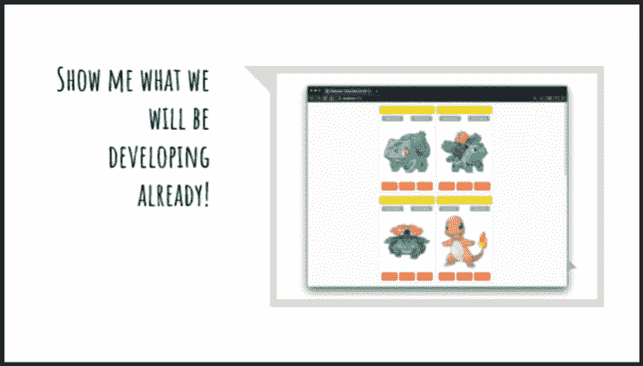
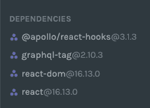
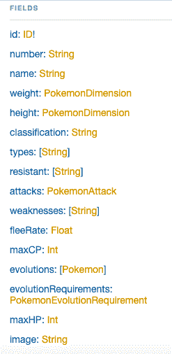
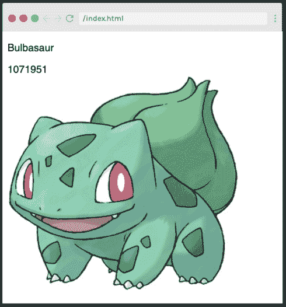
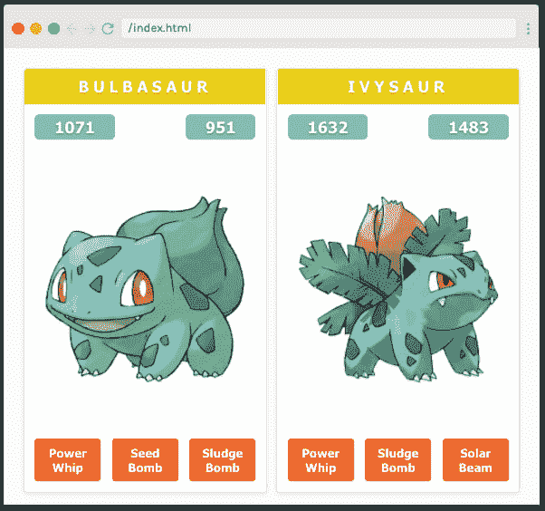
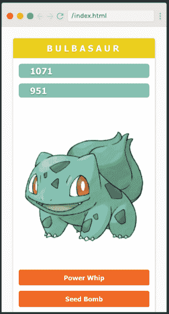

# 想用 React 和 GraphQL 搭建一个 app？这是我们由卡尔·哈德文教授的一小时免费课程

> 原文：<https://www.freecodecamp.org/news/want-to-build-an-app-with-react-and-graphql-heres-our-free-1-hour-course-by-karl-hadwen/>

如果你想知道如何连接 React.js 和 GraphQL，那么 Scrimba 热门的[一小时课程](https://scrimba.com/course/greactgraphql?utm_source=dev.to&utm_medium=referral&utm_campaign=greactgraphql_launch_article)就是为你准备的！本课程直接使用广泛的技术，用简洁的代码构建快速的应用程序——有什么不喜欢的呢？

## 为什么要学习 React 和 GraphQL？

GraphQL 比 REST APIs 具有更快的构建和迭代时间，并减少了从服务器发送的数据量。这意味着更快、响应性更强的应用——这是所有 React 开发者的必备条件。

## 讲师简介

本课程由 Karl Hadwen 为您带来，他是一名拥有十多年经验的 JavaScript 和 React 开发人员。Karl 还运营着一个 [YouTube 频道](https://www.youtube.com/channel/UC1DUQiZduv_yNZy0O7n_iHA)教授 React、JavaScript 和 GraphQL，所以他正是帮助你提高 React 和 GraphQL 技能的人。

## 课程包括什么？

在本课程中，我们将学习如何构建一个有趣的前端应用程序，使用 React、GraphQL 和 Apollo 来显示口袋妖怪的角色、事实和图像！本课程是交互式的，而且切中要点，这意味着您将很快建立起这样的东西:

[](https://scrimba.com/p/pdqXpfD/ckRd6NU9?utm_source=dev.to&utm_medium=referral&utm_campaign=greactgraphql_launch_article) 
*点击图片进入课程。*

在真正的 Scrimba 传统中，Karl 的课程充满了交互式编码挑战，以帮助您应用您的知识并嵌入您的学习，所以现在就前往 Scrimba 并继续阅读以了解更多信息。

## 欢迎参加本课程

在第一节课中，Karl 向我们介绍了我们将在课程中使用的技术，包括:

*   反应
*   GraphQL
*   阿波罗
*   半铸钢ˌ钢性铸铁(Cast Semi-Steel)
*   口袋妖怪开放 API。

## 安装我们的依赖项&创建我们的框架项目

[](https://scrimba.com/p/pdqXpfD/ckRdVWSD?utm_source=dev.to&utm_medium=referral&utm_campaign=greactgraphql_launch_article) 
*点击图片进入课程。*

现在是时候[开始我们的项目](https://scrimba.com/p/pdqXpfD/ckRdVWSD?utm_source=dev.to&utm_medium=referral&utm_campaign=greactgraphql_launch_article)了。首先，我们安装 Apollo、GraphQL 和 React 依赖项。接下来，我们建立项目所需的文件和文件夹:

```
import React from "react";
import { render } from "react-dom";
import { App } from "./App";

render(<App />, document.getElementById("root")); 
```

## 赋予我们的应用生命！

现在是时候通过添加到我们的应用程序文件并访问 GraphQL 服务器来赋予我们的应用程序生命了:

```
export function App() {
	const client = new ApolloClient({
		uri: "https://graphql-pokemon.now.sh",
	});

	return <p>I am a Pokemon</p>;
} 
```

[这个稀松布](https://scrimba.com/p/pdqXpfD/c8qgp9TZ?utm_source=dev.to&utm_medium=referral&utm_campaign=greactgraphql_launch_article)带我们通过以下步骤，让我们的用户与我们的应用程序进行交互:

*   设置 Apollo 客户端
*   构建`ApolloProvider`并将客户端作为道具传入
*   添加我们的`<main>`标签和`PokemonsContainer`

## 我们来谈谈 GraphQL

[](https://scrimba.com/p/pdqXpfD/cmmdmvc6?utm_source=dev.to&utm_medium=referral&utm_campaign=greactgraphql_launch_article) 
*点击图片进入课程。*

[这个稀松布](https://scrimba.com/p/pdqXpfD/cmmdmvc6?utm_source=dev.to&utm_medium=referral&utm_campaign=greactgraphql_launch_article)看一下[我们将在应用中使用的 GraphQL 服务器](https://graphql-pokemon.now.sh/)。GraphQL 的伟大之处在于它允许我们从对象中请求我们需要的字段，而不像 REST 那样发送所有可用的信息。Karl 通过指导我们构建和运行我们的第一个 GraphQL 查询向我们展示了这一点。

## 使用我们的容器组件来映射我们的口袋妖怪！

在[的下一个场景](https://scrimba.com/p/pdqXpfD/c4MGWJf8?utm_source=dev.to&utm_medium=referral&utm_campaign=greactgraphql_launch_article)中，我们构建了我们的主容器，这样我们就可以循环我们的口袋妖怪了。

Karl 向我们展示了如何从 Pokemon API 获取数据，这让我们很不爽:

```
const { data: { pokemons = [] } = {} } = useQuery(GET_POKEMONS, {
	variables: { first: 9 },
}); 
```

接下来是互动挑战的时候了:通过两个道具，钥匙和`pokemon`。前往[球场](https://scrimba.com/p/pdqXpfD/c4MGWJf8?utm_source=dev.to&utm_medium=referral&utm_campaign=greactgraphql_launch_article)，亲自尝试挑战。

## 添加 GraphQL 查询并创建我们的 Pokemon 组件！

[](https://scrimba.com/p/pdqXpfD/cND38EfL?utm_source=dev.to&utm_medium=referral&utm_campaign=greactgraphql_launch_article) 
*点击图片进入课程。*

在[中，我们从构建 graphQL 查询开始:](https://scrimba.com/p/pdqXpfD/cND38EfL?utm_source=dev.to&utm_medium=referral&utm_campaign=greactgraphql_launch_article)

```
import gql from "graphql-tag";

export const GET_POKEMONS = gql`
	query pokemons($first: Int!) {
		pokemons(first: $first) {
			id
			name
			image
			maxHP
			maxCP
			attacks {
				special {
					name
					damage
				}
			}
		}
	}
`; 
```

接下来，卡尔给了我们口袋妖怪组件的基本框架:

```
export function Pokemon({ pokemon }) {
	return <p>{pokemon.name}</p>;
} 
```

我们现在的挑战是构建 Pokemon 组件，以便它显示从 API 检索的所有信息。现在点击[进入课程](https://scrimba.com/p/pdqXpfD/cND38EfL?utm_source=dev.to&utm_medium=referral&utm_campaign=greactgraphql_launch_article)进行尝试。

## 完成我们的口袋妖怪组件

[接下来，](https://scrimba.com/p/pdqXpfD/cVnyLyfW?utm_source=dev.to&utm_medium=referral&utm_campaign=greactgraphql_launch_article)卡尔向我们讲述了如何映射口袋妖怪的三次多重攻击:

```
{
	pokemon.attacks.special.slice(0, 3).map((attack) => <span></span>);
} 
```

我们还有一个在我们的`pokemon__attacks` div 中添加一个键的小挑战。[现在就点击](https://scrimba.com/p/pdqXpfD/cVnyLyfW?utm_source=dev.to&utm_medium=referral&utm_campaign=greactgraphql_launch_article)试试吧。

## 让我们来设计我们的应用程序吧！

[](https://scrimba.com/p/pdqXpfD/c8qgEqUV?utm_source=dev.to&utm_medium=referral&utm_campaign=greactgraphql_launch_article) 
*点击图片进入课程。*

现在我们已经创建了我们的应用程序，是时候设计它了。在这个 bumper scrim 中，Karl 向我们讲述了口袋妖怪应用程序的所有元素，并给了我们一些 CSS 挑战。当然，Karl 建议的风格是他的个人喜好——你可以随心所欲地设计你的应用程序！

```
.container .pokemon {
	width: 49%;
	background-color: #fff;
	background-clip: border-box;
	border: 1px solid rgba(0, 0, 0, 0.125);
	border-radius: 0.25rem;
	box-shadow: 0 0.125rem 0.25rem rgba(0, 0, 0, 0.075);
	overflow: hidden;
	margin-bottom: 20px;
} 
```

## 响应式设计我们的应用程序

[](https://scrimba.com/p/pdqXpfD/c2K7EgUa?utm_source=dev.to&utm_medium=referral&utm_campaign=greactgraphql_launch_article) 
*点击图片进入课程。*

在课程的最后一节中，我们将了解如何通过媒体提问来响应我们的应用程序:

```
@media (max-width: 800px) {
	.container .pokemon {
		width: 100%;
	}
}

@media (max-width: 400px) {
	.container .pokemon__attacks,
	.container .pokemon__meta {
		flex-wrap: wrap;
	}

	.container .pokemon__meta span,
	.container .pokemon__attacks span,
	.container .pokemon {
		width: 100%;
	}

	.container .pokemon__meta span {
		margin-bottom: 10px;
	}
} 
```

现在完成了，我们的应用程序在所有浏览器尺寸下看起来都很棒。

完成本课程做得很好——您已经创建并设计了一个完全可用的 React 应用程序，它可以访问 GraphQL 服务器，这是一个巨大的成就！

希望您在本课程中学到了很多东西，并很快有机会将您的新知识应用到其他应用中。与此同时，为什么不去 Scrimba 看看还有什么其他的课程呢？你甚至可以一网打尽:)

无论你决定下一步学习什么，祝你编程愉快！

[https://www.youtube.com/embed/w04_SuqvpzY?feature=oembed](https://www.youtube.com/embed/w04_SuqvpzY?feature=oembed)