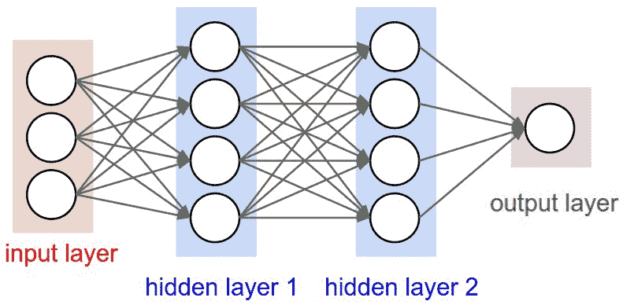
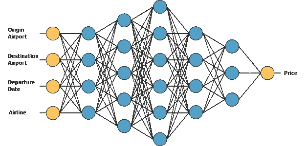
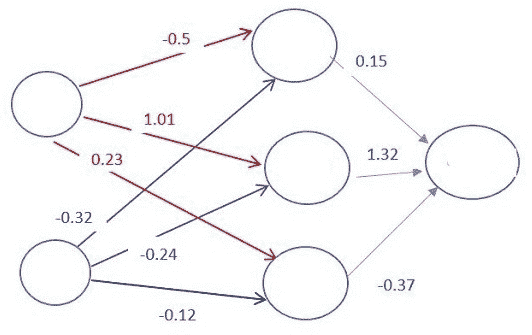
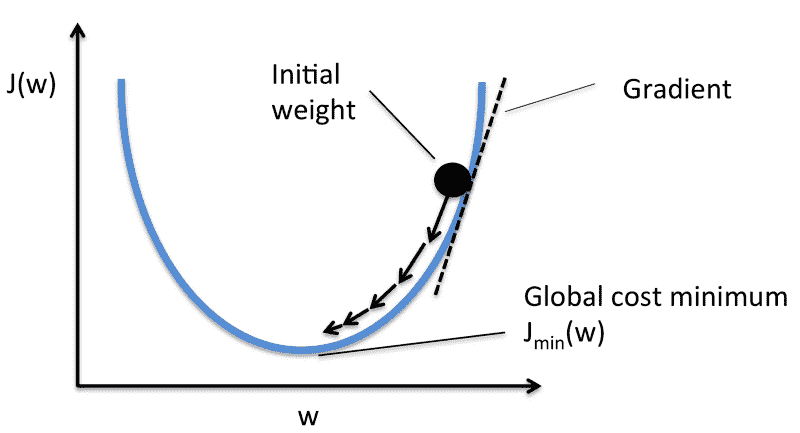

# 想知道深度学习是如何工作的？下面给大家一个快速指南。

> 原文：<https://www.freecodecamp.org/news/want-to-know-how-deep-learning-works-heres-a-quick-guide-for-everyone-1aedeca88076/>

by Radu Raicea

[**人工智能**](https://en.wikipedia.org/wiki/Artificial_intelligence) (AI)和 [**机器学习**](https://en.wikipedia.org/wiki/Machine_learning) (ML)是目前最热门的一些话题。

**“AI”**这个名词每天都是随便乱丢的。你听到有抱负的开发者说他们想学习人工智能。你还会听到高管们说，他们希望在自己的服务中实现人工智能。但是很多时候，这些人很多都不明白什么是 AI。

一旦你读了这篇文章，你就会理解人工智能和人工智能的基础。更重要的是，你会明白[深度学习](https://en.wikipedia.org/wiki/Deep_learning)这种最流行的 ML 类型是如何工作的。

本指南面向所有人，因此不涉及高等数学。

### 背景

理解深度学习如何工作的第一步是掌握重要术语之间的差异。

#### 人工智能 vs 机器学习

> **人工智能**是人类智能在计算机中的复制。

当人工智能研究刚刚开始时，研究人员试图为特定的任务复制人类智能——比如玩游戏。

他们引入了大量计算机需要遵守的规则。计算机有一个可能行动的具体列表，并根据这些规则做出决策[。](https://en.wikipedia.org/wiki/Expert_system)

> **机器学习**是指机器利用大型数据集而不是硬编码规则进行学习的能力。

ML 允许计算机自己学习。这种类型的学习利用了现代计算机的处理能力，可以轻松处理大型数据集。

#### **监督学习 vs 非监督学习**

> [**监督学习**](https://en.wikipedia.org/wiki/Supervised_learning) 涉及使用有输入和预期输出的标记数据集。

当你使用监督学习训练一个 AI 时，你给它一个输入，并告诉它预期的输出。

如果人工智能产生的输出是错误的，它将重新调整它的计算。这个过程在数据集上反复进行，直到人工智能不再出错。

监督学习的一个例子是天气预测人工智能。它学习使用历史数据预测天气。该训练数据具有输入(压力、湿度、风速)和输出(温度)。

> [**无监督学习**](https://en.wikipedia.org/wiki/Unsupervised_learning) 是利用没有指定结构的数据集进行机器学习的任务。

当你使用无监督学习训练人工智能时，你让人工智能对数据进行逻辑分类。

无监督学习的一个例子是一个电子商务网站的行为预测人工智能。它不会通过使用输入和输出的标签数据集来学习。

相反，它将创建自己的输入数据分类。它会告诉你哪类用户最有可能购买不同的产品。

### 现在，深度学习是如何工作的？

你现在已经准备好理解什么是深度学习，以及它是如何工作的。

深度学习是一种**机器学习**方法。它允许我们训练一个人工智能在给定一组输入的情况下预测输出。监督学习和非监督学习都可以用来训练人工智能。

我们将通过构建一个假设的**机票价格估算**服务来了解深度学习是如何工作的。我们将使用监督学习方法来训练它。

我们希望我们的机票价格估算员使用以下输入来预测价格(为简单起见，我们不包括返程票):

*   始发机场
*   目的地机场
*   启程日期
*   航空公司

#### 神经网络

让我们看看我们的人工智能的大脑内部。

像动物一样，我们的评估者 AI 的大脑也有神经元。它们用圆圈表示。这些神经元是相互连接的。

Image credit: [CS231n](http://cs231n.github.io/neural-networks-1/)

神经元被分成三种不同类型的层:

1.  输入层
2.  隐藏层
3.  输出层

**输入层**接收输入数据。在我们的例子中，输入层有四个神经元:出发地机场、目的地机场、出发日期和航空公司。输入层将输入传递给第一个隐藏层。

隐藏层对我们的输入进行数学计算。创建神经网络的挑战之一是决定隐藏层的数量，以及每层的神经元数量。

深度学习中的**深**是指拥有**多个**隐藏层。

**输出层**返回输出数据。在我们的例子中，它给出了价格预测。

那么它是如何计算价格预测的呢？

这就是深度学习的**魔力开始的地方。**

神经元之间的每个连接都与一个**权重**相关联。这个权重决定了输入值的重要性。初始权重随机设置。

在预测机票价格时，出发日期是较重要的因素之一。因此，出发日期神经元连接将具有很大的权重。

Image credit: [CodeProject](https://www.codeproject.com/Articles/1200392/Neural-Network)

每个神经元都有一个[激活函数](https://en.wikipedia.org/wiki/Activation_function)。没有数学推理，这些函数很难理解。

简单地说，它的目的之一是“标准化”神经元的输出。

一旦一组输入数据通过了神经网络的所有层，它就通过输出层返回输出数据。

没什么复杂的，对吧？

#### 训练神经网络

训练 AI 是深度学习中最难的部分。为什么？

1.  你需要一个**大数据集**。
2.  你需要**大**量的**计算能力**。

对于我们的机票价格估算器，我们需要找到机票价格的历史数据。由于大量可能的机场和出发日期组合，我们需要一个非常大的机票价格列表。

为了训练 AI，我们需要给它来自我们数据集的输入，并将它的输出与来自数据集的输出进行比较。由于人工智能仍然未经训练，它的输出将是错误的。

一旦我们遍历了整个数据集，我们就可以创建一个函数，向我们展示人工智能的输出与真实输出有多差。这个函数被称为[成本函数](https://en.wikipedia.org/wiki/Loss_function)。

理想情况下，我们希望成本函数为零。那就是我们的 AI 的输出与数据集输出相同的时候。

#### **怎样才能降低成本函数？**

我们改变神经元之间的权重。我们可以随机改变它们，直到我们的成本函数很低，但这不是很有效。

相反，我们将使用一种叫做[梯度下降](https://en.wikipedia.org/wiki/Gradient_descent)的技术。

梯度下降是一种技术，允许我们找到一个函数的最小值。在我们的例子中，我们寻找成本函数的最小值。

它的工作原理是在每次数据集迭代后**以小增量**改变权重**。通过计算特定权重下成本函数的导数(或梯度),我们能够看到最小值在哪个方向。**

Image credit: [Sebastian Raschka](https://sebastianraschka.com/faq/docs/closed-form-vs-gd.html)

为了最小化代价函数，您需要多次迭代您的数据集。这就是为什么你需要大量的计算能力。

使用梯度下降更新权重是自动完成的**。这就是深度学习的神奇之处！**

**一旦我们训练了我们的机票价格估计器 AI，我们就可以用它来预测未来的价格。**

### **我可以在哪里了解更多信息？**

**还有很多其他类型的神经网络:[卷积神经网络](https://en.wikipedia.org/wiki/Convolutional_neural_network)用于[计算机视觉](https://en.wikipedia.org/wiki/Computer_vision)和[递归神经网络](https://en.wikipedia.org/wiki/Recurrent_neural_network)用于[自然语言处理](https://en.wikipedia.org/wiki/Natural_language_processing)。**

**如果你想学习深度学习的技术方面，我建议你去上在线课程。**

**目前，深度学习最好的课程之一是[吴恩达](https://www.freecodecamp.org/news/want-to-know-how-deep-learning-works-heres-a-quick-guide-for-everyone-1aedeca88076/undefined)的[深度学习专业化](https://www.coursera.org/specializations/deep-learning)。如果你对获得证书不感兴趣，你不需要支付课程费用。你可以免费审计它。**

**如果您有任何问题，或者想要更多概念的技术解释，请在下面提问！**

### **总之…**

*   **深度学习使用神经网络来模仿动物智能。**
*   **神经网络中有三种类型的神经元层:输入层、隐藏层和输出层。**
*   **神经元之间的连接与权重相关联，决定了输入值的重要性。**
*   **神经元对数据应用激活函数来“标准化”来自神经元的输出。**
*   **为了训练一个神经网络，你需要一个大的数据集。**
*   **遍历数据集并比较输出将产生一个成本函数，表明人工智能与真实输出有多少偏差。**
*   **在通过数据集的每次迭代之后，使用梯度下降来调整神经元之间的权重，以降低成本函数。**

**如果你喜欢这篇文章，请给我一些掌声，让更多的人看到它。谢谢！**

**你也可以看看我在 Shopify 实习的经历！**

**更多更新，请在 Twitter 上关注我。**