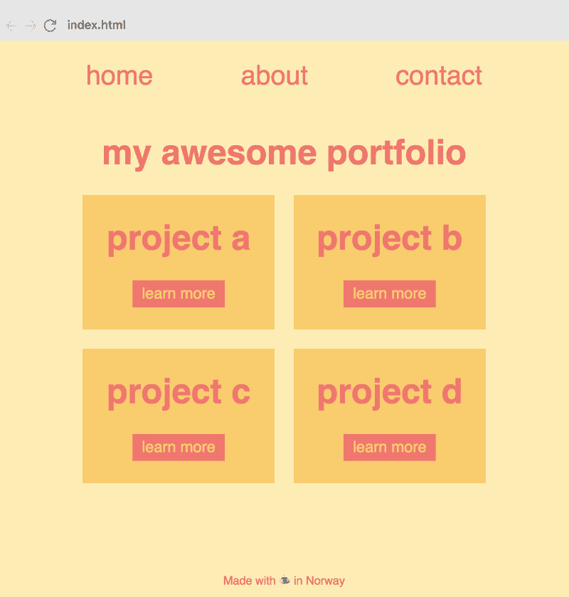
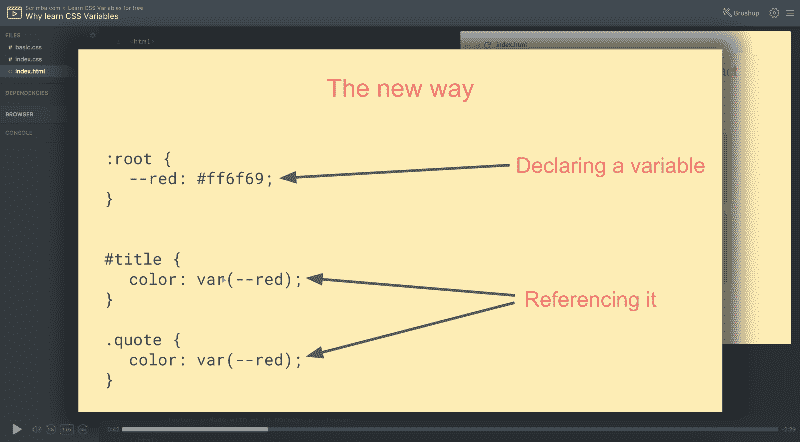
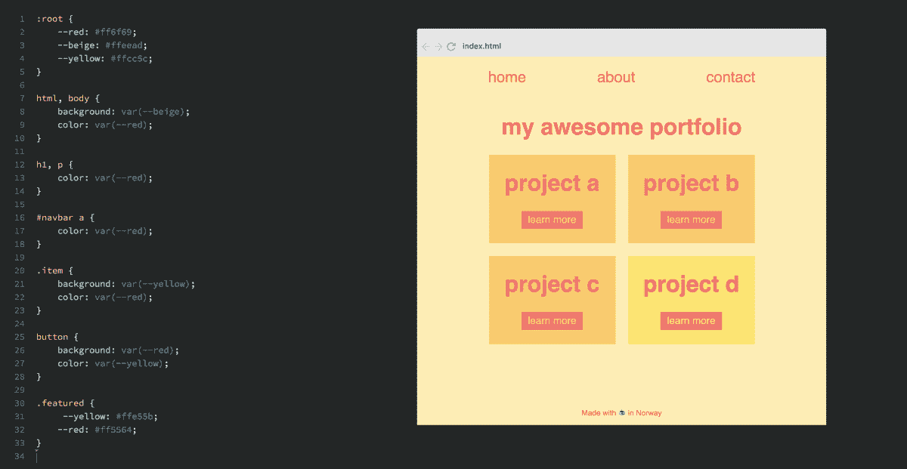

# 在这个自由和互动的过程中学习 CSS 变量

> 原文：<https://www.freecodecamp.org/news/want-to-learn-css-variables-heres-my-free-8-part-course-f2ff452e5140/>

CSS 变量对于现代浏览器来说是一项激动人心的新技术。它为 CSS 带来了变量的力量，从而减少了重复，提高了可读性和灵活性。

为了帮助你开始，我在 Scrimba 创建了一个关于 CSS 变量的免费课程。

这是我们免费 CSS 课程系列的延续。之前，我们已经推出了关于 [CSS Grid](https://scrimba.com/g/gR8PTE?utm_source=freecodecamp.org&utm_medium=referral&utm_campaign=gcssvariables_launch_article) 和 [Flexbox](https://scrimba.com/g/gflexbox?utm_source=freecodecamp.org&utm_medium=referral&utm_campaign=gcssvariables_launch_article) 的课程。加起来，他们的注册人数已经超过了 2 万。

### 课程结构

本课程包含 8 个互动的截屏。它们都在 3-6 分钟之间，因为我的目标是尽快教会你 CSS 变量。在其中一些的结尾，我会给你一个挑战，鼓励你互动地玩代码。这可以在浏览器中直接完成，因为 Scrimba 截屏让这成为可能。

在整个课程中，我们将使用一个非常简单的作品集网站，因为它让我们能够突出 CSS 变量最重要的用例。

现在让我们来看看每一课。

#### 第一课:为什么要学习 CSS 变量

在第一个视频中，我将谈论为什么你应该学习 CSS 变量。我将讨论一般的好处以及它相对于 SASS 和较少变量的优势。

#### 第二课:你的第一个 CSS 变量

然后我们将直接进入代码。我将首先向您展示如何创建 CSS 变量，然后要求您也这样做。重要的是，你要实际编码，而不仅仅是看截屏，因为这能让知识更好地保留。

:root {
-red:# ff6f 69；
}

体{
颜色:var( -红色)；
}

#### 第 3 课:覆盖变量

我们将继续重写，这是一个很酷的概念，因为 CSS 变量可以访问 DOM，并沿着层次结构向下继承。这清楚地将它们与 SASS 和 LESS variables 区分开来，当它们进入浏览器时，它们更像是常量 T1 而不是 T2 变量 T3，并且对 DOM 一无所知。

#### 第 4 课:局部变量

局部变量是仅在特定范围内可用的变量，例如在应用程序的标题或侧栏部分。如果你试图从另一个作用域访问它，它将不会被定义。

#### 第 5 课:用 CSS 变量创建主题

主题是 CSS 变量最大的好处之一。就主题而言，我指的不仅是完整的网站主题，还包括组件特定的主题，这是一个更常见的用例(例如，将一个项目视觉上更改为*特色的*，以便它从人群中脱颖而出)。

在这里，我们使用主题使网格中的一个项目与众不同。

#### 第 6 课:用 JavaScript 改变变量

还可以用 JavaScript 修改 CSS 变量，非常有用。这提供了允许用户改变变量的可能性。这也是 LESS 和 SASS 变量无法实现的。一个非常相关的例子是允许用户调整网站的整体字体大小。这将使视力不好的人更容易使用它。

#### 第 7 课:CSS 变量的响应

假设 CSS 变量可以访问 DOM，它们也可以根据屏幕大小进行更改。这实际上只是重写的一个例子，但我认为它值得一个全新的截屏，因为现在响应是非常核心的。前端开发人员应该使用一切使响应更容易的东西。

#### 第 8 课:CSS 变量和继承

尽管我在整个课程中都在谈论继承，但我们会在课程结束时做一些额外的说明，因为有几个用例，你可能认为是可行的，但实际上并不可行。

仅此而已。通过这些快速截屏，您将对 CSS 变量有一个坚实的理解。观看它们将花费你不到 30 分钟的时间，你还可以调整重播速度，使它更快。

换句话说:这个课程可能是正确学习 CSS 变量最快的方法。

当然，这些挑战可能会花费更多的时间，但它们是自愿的。您可以选择本课程的互动程度。

### 辛巴格式

这个课程是使用 Scrimba 构建的，这是一个交互式编码截屏工具，我是它的联合创始人，还有[马格努斯](https://medium.com/u/1a7998d688dd)和[辛德雷](https://medium.com/u/c825b7f99be3)。

正如我之前提到的，Scrimba 的独特之处在于截屏是完全交互式的，这意味着您可以编辑截屏中的代码。

这里有一张解释这个概念的 gif 图:

暂停截屏→编辑代码→运行！→查看您的变化

当您觉得需要试验代码以便正确理解它时，或者当您只想复制一段代码时，这是非常有用的。

此外，Scrimba 截屏视频的文件大小只占视频的 1%，这意味着即使你的互联网连接很慢，它也更容易观看。

所以，今天来看看[的课程](https://scrimba.com/g/gcssvariables?utm_source=freecodecamp.org&utm_medium=referral&utm_campaign=gcssvariables_launch_article)，快乐编码:)

* * *

感谢阅读！我的名字叫 Per Borgen，我是最简单的学习编码方法——Scrimba 的联合创始人。如果你想学习建立专业水平的现代网站，你应该看看我们的[响应式网页设计训练营](https://scrimba.com/g/gresponsive?utm_source=freecodecamp.org&utm_medium=referral&utm_campaign=gcssvariables_launch_article)。

[Click here to get to the advanced bootcamp.](https://scrimba.com/g/gresponsive?utm_source=freecodecamp.org&utm_medium=referral&utm_campaign=gcssvariables_launch_article)