# 一个免费的 React 课程，通过建立一个聊天应用程序来提高你的 React JS 技能

> 原文：<https://www.freecodecamp.org/news/want-to-learn-react-js-heres-my-free-course-which-teaches-it-through-building-a-chat-app-c86333e5b88c/>


聊天是吃天下，React 是吃前端开发。那么，还有什么比通过构建聊天应用来学习 React 更好的呢？在我最近在斯克林巴的课程中，你会做到这一点。

它由 17 节互动课(加上介绍和结尾)和五个挑战组成，在这些挑战中，你必须自己编辑代码。

最棒的是:这一切都在浏览器中完成。您不必编写任何服务器端代码。 [Chatkit API](https://pusher.com/chatkit?utm_source=scrimba&utm_medium=medium&utm_campaign=announcment-post) 负责后端的繁重工作，因此我们可以专注于构建聊天客户端。

在课程结束时，您将拥有自己的个性化聊天应用，包括多个房间、创建新房间的能力、自动滚动等。此外，由于 CSS 网格和 CSS 变量，它将非常容易定制。

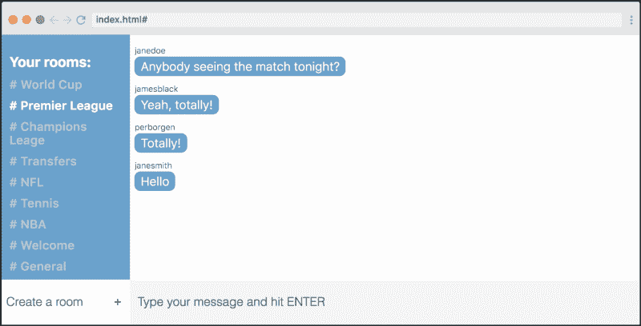

我假设你知道 JavaScript，并且你以前看过一点 React(例如，阅读我的[五分钟介绍文章](https://medium.freecodecamp.org/learn-react-js-in-5-minutes-526472d292f4)，并且可能查阅了一些教程)。但是除此之外，这门课没有任何先决条件。

现在我们来看看它是如何布局的！

### 第 1 课:课程介绍


我先给你简单介绍一下这门课程。我们将讨论你将学到的内容，我也会介绍我自己。在课程结束时，我还将让您先睹为快，了解如何定制自己的聊天应用程序。

### 第二课:组件架构

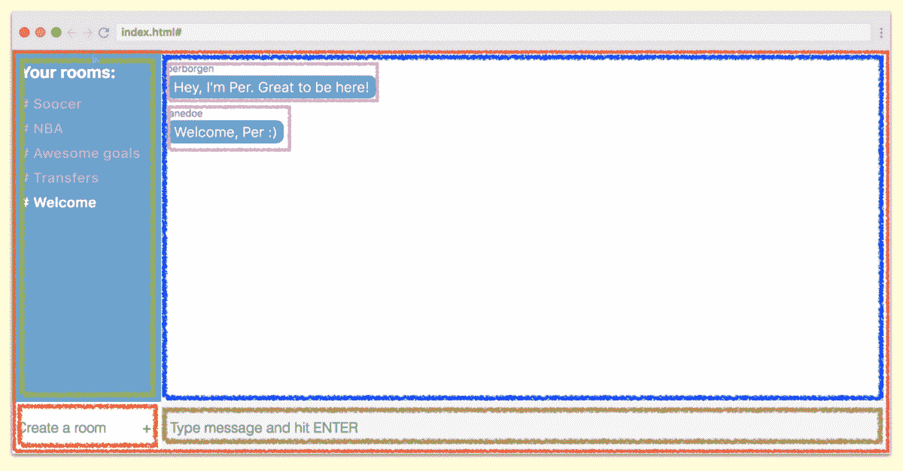

在您开始构建 React 应用程序之前，您应该先了解一下组件架构，然后将 UI 分解成组件。所以在这堂课中，我会告诉你如何做到这一点。

### 第三课:代码基础架构

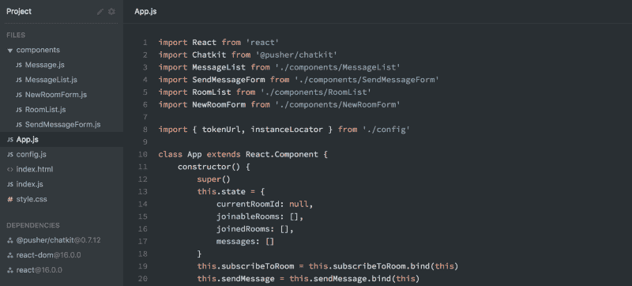

接下来，我们将看到我们的组件架构如何转化为代码。我还会看看回购的其余部分是如何设置的，因为一旦我们开始编码，你就不会对整个回购中的各种文件感到困惑。

我不会从头开始创建存储库，因为有很多教程可以帮助您设置开发环境，而且这并不是 Scrimba 平台最适合的。

### 第 4 课:消息列表组件

现在我们终于准备好开始编码了，所以在这一课中，我们将在我们的`MessageList`组件中呈现虚拟数据。它将向您介绍 JSX，您将学习如何使用例如`map()`数组方法动态创建元素。

```
{DUMMY_DATA.map((message, index) => {  
   return (  
     <div key={index} className="message">  
        <div className="message-username">{message.senderId}</div>  
        <div className="message-text">{message.text}</div>  
     </div>  
   )  
})} 
```

在这一课中，你还将得到你的第一个挑战！

### 第 5 课:聊天工具简介

[!点击图片进入 Chatkit API。]([https://pusher.com/chatkit?utm_source=scrimba&UTM _ medium = medium&UTM _ campaign = announcement-post](https://pusher.com/chatkit?utm_source=scrimba&utm_medium=medium&utm_campaign=announcment-post))
点击图片进入 Chatkit API。

既然我们能够在页面上呈现数据，我们将开始与 [Chatkit API](https://pusher.com/chatkit?utm_source=scrimba&utm_medium=medium&utm_campaign=announcment-post) 集成，它将负责应用程序的后端。在本课中，我将向您简要介绍 API。

### 第 6 课:连接到聊天工具

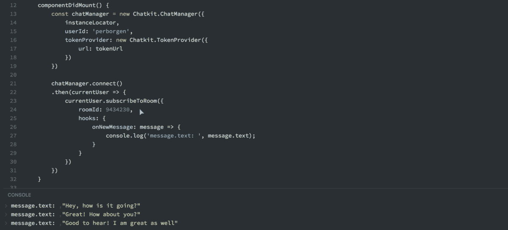

接下来就是简单地编写[聊天工具](https://pusher.com/chatkit?utm_source=scrimba&utm_medium=medium&utm_campaign=announcment-post)的集成代码，这非常简单:上面的代码就是你从聊天室获取信息所需要的全部。您将接触到 React 的`componentDidMount()`生命周期方法，这是您应该将组件与第三方 API 挂钩的地方。

### 第 7 课:状态和道具

状态和道具是我们在 React 中处理数据的两种方式，你需要了解两者的区别。在这个讲座中，我们需要使用这两种类型，因为我们都将聊天消息存储在我们的`App`组件的状态中，并且还将它们作为道具传递给`MessageList`组件。

```
constructor() {  
  super()  
  this.state = {  
    messages: []  
  }  
} 
```

### 第 8 课:消息组件

在本讲座中，我们将构建消息组件。它只有一项工作:呈现从其父代传下来的用户名和文本。我还会给你一个挑战，把它从基于类的组件变成功能组件。

```
function Message(props) {  
  return (  
    <div className="message">  
      <div className="message-username">{props.username}</div>  
      <div className="message-text">{props.text}</div>  
    </div>  
  )  
} 
```

### 第 9 课:SendMessageForm 组件

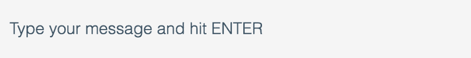

如果没有发送信息的表单，你就不能拥有一个聊天应用。所以在这节课中，我们将会创造出这样的场景。它将向您介绍受控组件，这是 React 中的一个关键概念。这意味着组件本身决定在输入字段中呈现什么，而不是 DOM 节点本身保存内部状态。

### 第十课:广播信息

```
sendMessage(text) {  
  this.currentUser.sendMessage({  
    text,  
    roodId: 9434230  
  })  
} 
```

现在我们已经准备好了`SendMessageForm`,我们需要将消息发送到 Chatkit，以便它能够广播它们。这将迫使你学习 React 的另一个核心概念:反向数据流。

在 React 中，数据向下流动，从父节点到子节点。然而，有时我们需要子组件到达它们的父组件并触发它们的方法，以及来自它们自身的一些数据。

### 第 11 课:房间列表组件

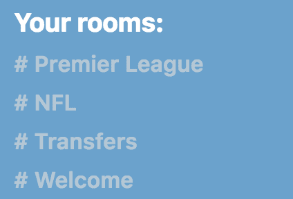

现在我们已经有了核心聊天功能(发送和显示消息)，是时候跳到`RoomList`组件了，它显示了您的 Chatkit 实例上所有可用的房间。

它将向您介绍 Chatkit 中的一些新概念，并巩固您关于如何将数据从父组件向下发送到子组件的知识。我们还将再次讨论 ES6 spread 操作符，在构建 React.js 应用程序时知道它非常方便。

### 第 12 课:预订房间

然后你需要学习如何预订特定的房间。我们将为显示在`RoomList`组件中的每个房间连接一个事件监听器。这将触发`App`组件中的一个方法，该方法告诉 Chatkit 用户想要订阅那个特定的房间。

```
subscribeToRoom(roomId) {  
  this.setState({ messages: [] })  
  this.currentUser.subscribeToRoom({  
    roomId: roomId,  
    hooks: {  
      onNewMessage: message => {  
        this.setState({  
          messages: [...this.state.messages, message]  
        })  
      }  
    }  
  })  
} 
```

### 第 13 课:房间顺序和突出显示当前房间

这堂课将向您介绍 JavaScript 中的`.sort()`数组方法，因为我们需要确保我们的房间以正确的顺序排序，不管数据最初来自哪里。

const orderedRooms = [...这个.道具.房间]。排序((a，b) => a.id - b.id)

我们还将添加一个`active`类到我们正在聊天的房间，以便向用户发出信号。

### 第 14 课:添加自动滚动

需要自动滚动来自动跳转到最新消息，因为它们出现在`MessageList`组件中。这是一个巧妙的小技巧，向您介绍了以下组件生命周期方法:

*   `componentWillUpdate()`
*   `componentDidUpdate()`

我们还需要使用`ReactDOM.findDOMNode()`方法，因此您也将了解这个方法。

### 第 15 课:NewRoomForm 组件

此组件允许您创建新房间。这将是对第九课中受控组件的复习。

这样，我们就完成了应用程序的所有 React 代码。因此，在剩下的课程中，我们将重点关注使用 CSS 的设计。

### 第 16 课:创建自己的聊天应用

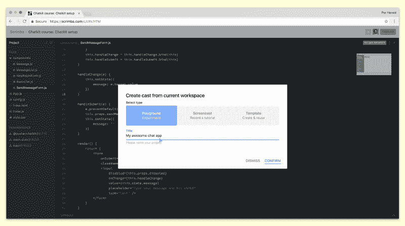

在我们开始修改应用程序设计之前，我想克隆我的代码，以便您可以获得自己的回购副本。这为下一个屏幕截图做好了准备，您将在其中个性化它的设计。我将指导您完成每一步，直到您从 Chatkit 获得自己的副本和免费 API-keys。

### 第 17 课:用 CSS 网格改变布局

我们使用 CSS Grid 来控制应用程序的布局，这让你在改变它时有非常好的灵活性，这要感谢`grid-template-areas`。我将教你如何通过改变几行 CSS 就可以在页面上移动元素。

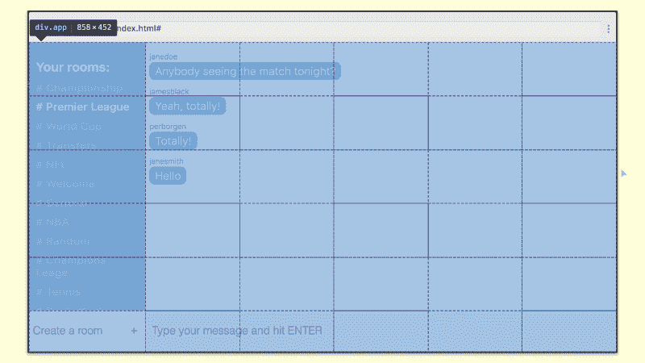

### 第 18 课:用 CSS 变量改变主题

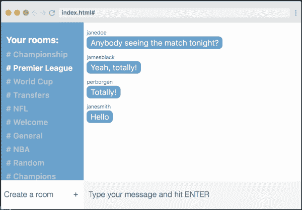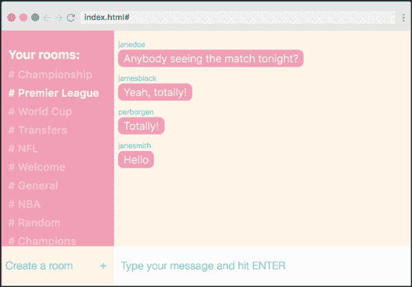

修改变量前后。

因为我们使用 CSS 变量来表示颜色，所以你也可以很容易地改变应用程序的主题。在这里，我会给你一个挑战，在网上找到一个好的调色板，然后在你的应用程序中实现它。

如果您将上一课的布局变化与本课的新调色板结合起来，您将拥有自己的个性化聊天应用程序！这是我为自己做的，只是为了好玩:


### 第 19 课:超越和结束挑战

如果你做到了这一步:恭喜你！你真的在提高技能上投资了，我 100%肯定会有回报的。在这个截屏中，如果你真的准备好了，我会给你一些收尾的挑战。

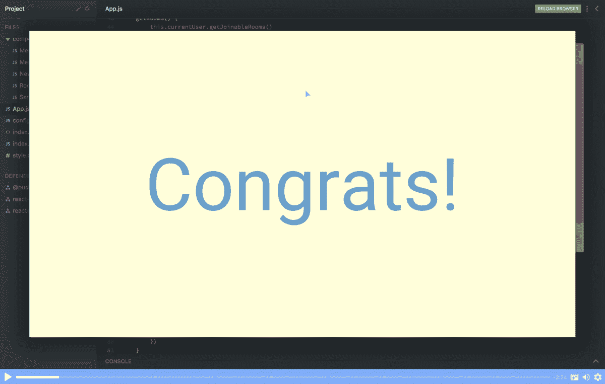

如果您对课程[感到满意，我们将非常感谢您将它推荐给朋友或在社交媒体上分享，因为这是人们发现我们免费 Scrimba 课程的方式。](https://scrimba.com/g/greactchatkit?utm_source=freecodecamp.org&utm_medium=referral&utm_campaign=greactchatkit_free_course)

祝课程顺利，编码愉快:)