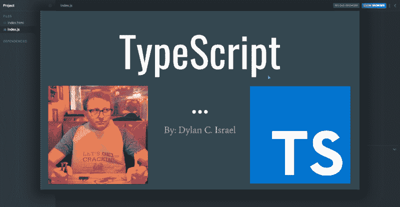
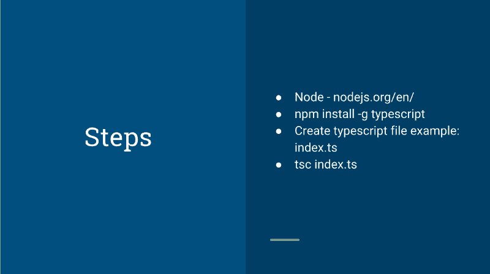

# 通过这个交互式 Scrimba 课程免费学习 TypeScript

> 原文：<https://www.freecodecamp.org/news/want-to-learn-typescript-heres-our-free-22-part-course-21cd9bbb5ef5/>

[ ](https://scrimba.com/g/gintrototypescript?utm_source=freecodecamp.org&utm_medium=referral&utm_campaign=gintrototypescript_launch_article) *点击图片进入斯克林巴课程*

在过去的几年里，TypeScript 在 JavaScript 开发人员中越来越受欢迎。这并不奇怪，因为 TypeScript 代码更不容易出错，可读性更好，也更容易维护。

因此，我们与著名的在线导师迪伦·c·伊斯雷尔合作，在斯克林巴上开设了一门[免费打字课程。](https://scrimba.com/g/gintrototypescript?utm_source=freecodecamp.org&utm_medium=referral&utm_campaign=gintrototypescript_launch_article)该课程包含 22 课，是为那些已经知道 JavaScript 但想要快速了解 TypeScript 的人而设的**。**

在这里免费参加[课程。](https://scrimba.com/g/gintrototypescript?utm_source=freecodecamp.org&utm_medium=referral&utm_campaign=gintrototypescript_launch_article)

现在让我们来看看课程中的每一堂课。

### 第一部分:简介



在介绍性的截屏中，Dylan 概述了为什么应该学习 TypeScript，以及课程是如何安排的。他也告诉你一些关于他自己的事情，这样你在开始写代码之前就已经熟悉他了。

### 第 2 部分:变量类型

编译时类型检查是 TypeScript 最重要的特性之一。它让我们在编译时捕捉与数据类型相关的错误。本课解释 TypeScript 中可用的数据类型。

```
let firstName: string;

let age: number;

let isMarried: boolean; 
```

你可以看到我们是如何将类型附加到所有变量上的。如果我们试图用一个字符串值代替一个数字类型变量，TypeScript 会在编译时捕捉到它。

### 第 3 部分:多种类型

在 TypeScript 中，我们为一个变量保留一种类型，但这不是每次都能做到的。因此，相反，TypeScript 为我们提供了`any`类型。这意味着我们可以将多种类型的值赋给一个变量。

```
let myVariable: any = 'Hello World';  
myVariable = 10;  
myVariable = false; 
```

上面，我们已经用`any`类型声明了`myVariable`。首先我们给它分配一个字符串，然后是一个数字，最后是一个布尔值。这是可能的，因为有了`any`类型。

### 第 4 部分:子类型

当我们不知道变量的值时，使用子类型。TypeScript 为我们提供了两个子类型:`null`和`undefined`。本课解释了我们何时应该使用其中任何一个。

```
let myVariable: number = undefined; 
```

变量`myVariable`已经被赋予了`undefined`的值，因为在这个时间点，我们不知道它将会是什么。我们也可以在这里使用`null`。

### 第 5 部分:隐式和显式类型

第 5 部分讨论隐式和显式类型之间的区别。在上面的例子中，我们看到了设置变量类型的显式类型。另一方面，隐式类型是由编译器执行的，不需要我们声明变量类型。

```
let myVariable = 'Hello World'; 
```

在这个例子中，我们没有给变量分配任何类型。我们可以使用`typeof`函数来检查这个变量的类型。这将表明`myVariable`属于`string`类型，因为编译器负责处理类型。

### 第 6 部分:检查类型

在这一课中，我们将学习如何检查变量的类型，捕捉任何错误或执行任何操作。它使用了一个例子，在这个例子中，我们测试我们的变量是否属于类型`Bear`(其中`Bear`是一个`class`)。如果我们想检查变量的类型，我们可以使用`instanceof`方法。

```
import { Bear } from 'somefile.ts';  
let bear = new Bear(3);  
if (bear instanceof Bear) {  
   //perform some operation  
} 
```

### 第 7 部分:类型断言

类型断言意味着我们可以将一个变量转换成任何特定的类型，并且我们告诉 TypeScript 使用该类型来处理该变量。让我们试着用一个例子来理解它:

```
let variable1: any = 'Hello World';  
if ((variable1 as string).length) {  
   //perform some operation  
} 
```

`variable1`拥有`any`的类型。但是，如果我们想检查它的长度，它会产生一个错误，直到我们告诉 TypeScript 把它作为一个字符串来处理。本课将详细解释这一概念。

### 第 8 部分:数组

课程的这一部分解释了类型脚本数组。在 JavaScript 中，当我们给数组赋值时，我们可以放入不同类型的项。但是，使用 TypeScript，我们也可以用类型声明数组。

```
let array1: number[] = [1, 2, 3, 4, 5]; 
```

在上面的例子中，我们通过给数组赋值`number`类型来声明一个数组。现在，TypeScript 将确保数组只包含数字。

### 第 9 部分:元组

有时我们需要在一个集合中存储多种类型的值。在这种情况下，数组不起作用。TypeScript 为我们提供了元组的数据类型。这些用于存储多种类型的值。

```
let tuple_name = [10, 'Hello World']; 
```

这个例子表明我们可以在一个集合中拥有数字为**和**的字符串类型的数据项。本课更详细地解释了元组的概念。

### Part #10: Enums

在这一课中，我们将学习 TypeScript 中的枚举。枚举用于定义一组命名的常量，这些常量可用于记录意图或创建一组不同的事例。

```
**enum** Direction {   
   Up = "UP",       
   Down = "DOWN",       
   Left = "LEFT",      
   Right = "RIGHT"   
} 
```

下面是一个基本的例子，说明枚举是如何声明的，以及如何在枚举中创建不同的属性。其余细节将在课程的这一部分进行解释。

### 第 11 部分:对象

在 JavaScript 中，对象在语言的定义和发展中起着非常重要的作用。本课讨论 TypeScript 中的对象—如何声明一个对象，以及哪些类型的值可以包含在对象类型中。

### 第 12 部分:参数

使用 TypeScript，我们还可以为函数的参数分配类型。在课程的这一部分，Dylan 解释了我们如何给参数添加类型。这是处理函数中数据类型错误的一个非常有用的方法。

```
const multiply = (num1: number, num2: number) => {   
   return num1 * num2;  
} 
```

我们已经声明了一个函数`multiply`,它接受两个参数并返回它们相乘的结果。我们为这两个参数添加了一种类型的`number`,这样除了一个数字之外，没有其他值可以传递给它们。

### 第 13 部分:返回类型

像参数一样，我们也可以给函数的返回值添加类型检查。这样，我们可以确保函数的返回值具有预期的类型。课程的这一部分详细解释了这个概念。

```
const multiply = (num1: number, num2: number): number => {   
   return num1 * num2;  
} 
```

我们在函数中添加了一个类型为`number`的`return`。现在，如果我们返回除了一个`number`之外的任何东西，它将向我们显示一个错误。

### 第 14 部分:自定义类型

在 TypeScript 中，我们可以使用关键字`type.`创建一个自定义类型，然后我们可以在该类型的基础上对对象进行类型检查。

```
type person = {firstName: string};

const example3: person = {firstName: 'Dollan'}; 
```

这个特性在 TypeScript 中几乎被否决了，所以您应该使用`interface`或`class`来实现这个目的。然而，了解它是很重要的，因为当你开始钻研 TS 代码时，你可能会遇到自定义类型。

### 第 15 部分:接口

在 TypeScript 中，核心焦点是强制使用特定类型的类型检查。接口是命名这些类型的一种方式。它基本上是一组描述对象的相关方法和属性。课程的这一部分解释了如何创建和使用界面。

```
interface Person {  
   firstName: string,   
   lastName: string,  
   age: number  
} 
```

在上面的例子中，我们有一个接口`Person`，它有一些类型化的属性。注意，我们不在接口中初始化数据，而是定义参数将具有的类型。

### 第 16 部分:桶

桶是将多个模块的导出汇总到单个模块中的一种方式。一个桶本身就是一个模块，它从一个文件中导出多个模块。这意味着用户只需导入一个模块，而不是分别导入所有模块。

```
// Without barrel  
import { Foo } from '../demo/foo';  
import { Bar } from '../demo/bar';  
import { Baz } from '../demo/baz';` 
```

我们可以创建一个桶，而不是分别使用这些多行来导入这些模块。木桶会导出所有这些模块，而我们只导入那个木桶。

```
// demo/barrel.ts export * from './foo'; 
// re-export all of its exportsexport * from './bar'; 
// re-export all of its exportsexport * from './baz'; 
// re-export all of its exports 
```

我们可以简单地创建一个 TypeScript 文件，并从它们各自的文件中导出模块。然后，我们可以在任何需要的地方进口这种桶。

```
import { Foo, Bar, Baz } from '../demo'; // demo/barrel.ts 
```

### 第 17 部分:模型

当使用接口时，我们经常会面临一些问题。例如，接口似乎不能强制来自服务器端的任何东西，并且它们不能保持默认值。为了解决这个问题，我们使用了模型类的概念。它们充当一个接口，也可以添加默认值和方法。

### 第 18 部分:交叉口类型

在本节中，我们将讨论交叉点类型。这些是我们可以对单个实体或类使用多种类型的方法。有时我们需要使用多种类型来映射一个实体，这时，这个特性就非常方便了。

```
import { FastFood, ItalianFood, HealthyFood} from ‘./interfaces’;  
let food1: FastFood | HealthyFood;  
let food2: ItalianFood;  
let food3: FastFood;  
let food4: FastFood & ItalianFood; 
```

在上面的例子中，我们有三个接口，我们从它们创建不同的对象。例如，`food1`要么是`FastFood` **要么是** `HealthyFood`。同样，`food4`将会是`FastFood` **以及** `ItalianFood`。

### 第 19 部分:泛型

简而言之，泛型是一种创建可重用组件的方法，这些组件可以处理多种数据类型，而不是单一的数据类型。

泛型的概念实际上到目前为止在 JavaScript 中是没有的，但在 C#或 Java 等流行的面向对象语言中被广泛使用。在这一课中，我们将学习如何在 TypeScript 中使用泛型，并看看它的主要好处。

### 第 20 部分:访问修饰符

访问修饰符的概念在 JavaScript 和 TypeScript 领域相对较新，但是它们在其他面向对象语言中已经存在很长时间了。访问修饰符控制类成员的可访问性。

在 TypeScript 中，有两个访问修饰符:public 和 private。类的每个成员都默认为 public，除非您声明它是 public。

```
class Customer {  
   customerId: number;  
   public companyName: string;  
   private address: string;  
} 
```

`customerId`是默认的公共成员，因此它对外部世界总是可用的。我们特别声明`companyName`为`public`，所以它也可以在课外使用。`address`被标记为`private,`，因此在该类之外无法访问。

### 第 21 部分:本地设置

在这一课中，我们将学习在本地计算机上安装和运行 TypeScript 的步骤。这些步骤通常包括安装 Node 和 TypeScript，然后进行编译”。ts”文件。



**点击图片进入课程。**

### 第 22 部分:TSLint 和—干得好！

耶！您已经完成了课程。在视频的最后一部分，Dylan 将给出一些关于如何进一步学习和改进我们今天编写的代码的提示。

在本课中，他还讲述了如何使用令人惊叹的 TSLint。该工具帮助您使用最佳实践和惯例编写更好的产品级代码。它提供了一些基本设置，您可以根据需要进行修改。

#### 所以，今天就去参加[这门免费课程吧！](https://scrimba.com/g/gintrototypescript?utm_source=freecodecamp.org&utm_medium=referral&utm_campaign=gintrototypescript_launch_article)

* * *

感谢阅读！我的名字叫 Per Borgen，我是最简单的学习编码方法——Scrimba 的联合创始人。如果你想学习建立专业水平的现代网站，你应该看看我们的[响应式网页设计训练营](https://scrimba.com/g/gresponsive?utm_source=freecodecamp.org&utm_medium=referral&utm_campaign=gintrototypescript_launch_article)。


[Click here to get to the advanced bootcamp.](https://scrimba.com/g/gresponsive?utm_source=freecodecamp.org&utm_medium=referral&utm_campaign=gintrototypescript_launch_article)