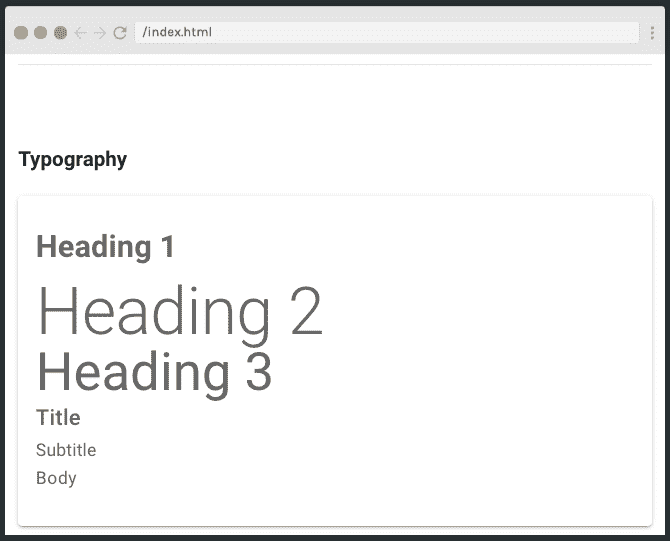
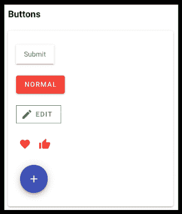
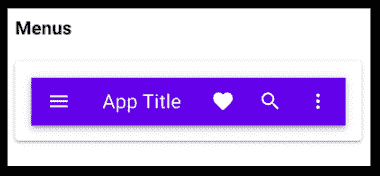
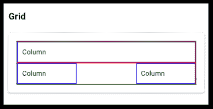
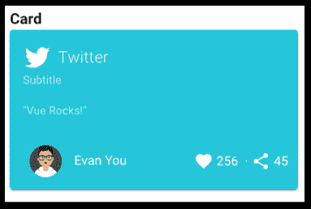
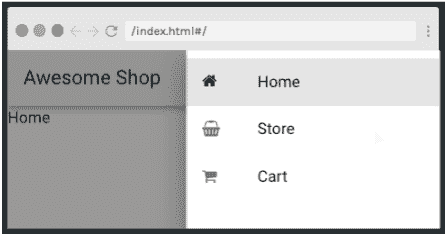
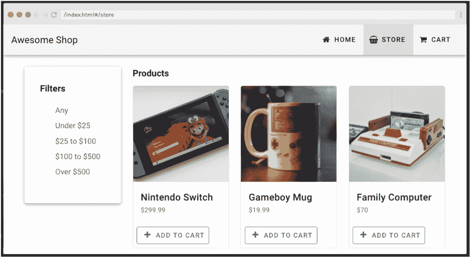
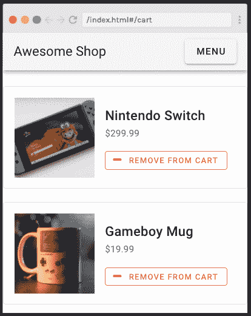

# 想学 Vuetify？这是格温·法拉第的 15 节免费课程

> 原文：<https://www.freecodecamp.org/news/want-to-learn-vuetify-heres-our-free-15-part-course-by-gwen-faraday/>

如果你喜欢在 Vue.js 中构建应用程序，但又不知道从哪里开始 UI 设计，那就看看 Vuetify 吧。这是一个 UI 库，包含手工制作的材料组件，使应用程序具有美丽的外观和专业的感觉。

## 为什么要学 Vuetify？

Vuetify 是 Vue.js 最受欢迎的组件库，即使你不擅长 UI 设计，它也能让你创建好看的、可访问的应用程序。

虽然该库有超过 80 个现成的元素，但它也允许你创建自定义元素，给你的应用程序一个干净而定制的感觉。

本文将带您了解由格温·法拉第教授的 Scrimba 的两小时免费培训课程。该课程向您传授开始使用 Vuetify 所需的所有核心技能，包括:

*   排印
*   间隔
*   小跟班
*   航行
*   格子
*   卡片

在前半部分，Gwen 介绍了构建优秀应用程序所需的所有 Vuetify 元素。与所有 Scrimba 课程一样，您可以暂停 scrims 并探索代码。

后半部分让你通过建立一个网上商店弄脏你的手。这能很好地运用你的新技能，让你应用新学到的知识。

最后，你将完全精通使用 Vuetify 构建专业风格的应用程序。

## 讲师简介

格温·法拉第(Gwen Faraday)是一名软件工程师、作家、演讲者和内容创作者，她还经营着一个 Youtube 频道[法拉第学院](https://www.youtube.com/channel/UCxA99Yr6P_tZF9_BgtMGAWA/featured)，在那里她教授包括 Vue.js 和 Vuetify 在内的各种课程。这使她成为完美的老师，带你经历这个学习之旅，让你的技能更上一层楼。

## 先决条件

要想从本教程中获得最大收益，你需要对 HTML、CSS、Javascript 和 Vue.js 有相当的了解。如果你还没有，请查看 Scrimba 的免费课程，让你快速上手:

*   [HTML 和 CSS](https://scrimba.com/course/ghtmlcss?utm_source=dev.to&utm_medium=referral&utm_campaign=gvuetify_launch_article)
*   [Javascript](https://scrimba.com/course/gintrotojavascript?utm_source=dev.to&utm_medium=referral&utm_campaign=gvuetify_launch_article)
*   vista . js

如果您已经准备好使用 Vuetify，让我们开始吧！

## 虚拟化简介

在第一集中，格温向我们介绍了 Vuetify，并分享了她存储所有代码的两个 Github 库，[基本组件](https://github.com/gwenf/vuetify-basic-components)和 [vuetify-responsive](https://github.com/gwenf/vuetify-responsive) 。这允许我们下载代码并亲自试用。

## 什么是材料设计？

[接下来](https://scrimba.com/p/pP4xZu3/c4PDDZtg?utm_source=dev.to&utm_medium=referral&utm_campaign=gvuetify_launch_article)，我们将学习材料设计，这是谷歌开发的一种标准，用于实现可访问的、用户友好的界面。

材料标准为网页上最常见的元素提供了一套规则，包括按钮、文本、导航和更高级的功能，如移动和提升。

Vuetify 通过提供一堆现成的兼容 UI 元素，我们可以将这些元素直接添加到我们的 Vue.js 应用程序中，从而消除了实现该标准的困难。

## 首先看 Vuetify 代码

[在下一集](https://scrimba.com/p/pP4xZu3/ckPbepSM?utm_source=dev.to&utm_medium=referral&utm_campaign=gvuetify_launch_article)中，Gwen 通过实例化一个 Vue 应用程序、添加一个 Vue tity 属性并创建一个新的 Vue tity 对象，让我们第一次看到了 Vue tity 代码:

```
new Vue({
	el: "#app",
	vuetify: new Vuetify({}),
	data: {
		message: "Using Single File Components",
	},
}); 
```

接下来，Gwen 向我们展示了`<v-app>`元素，它是所有 vue tity 元素的根组件(vue tity 组件必须属于`<v-app>`):

```
<v-app>
     <v-content>
          <playground></playground>
     </v-content>
</v-app> 
```

## 排印

[](https://scrimba.com/p/pP4xZu3/cMqPmeTG?utm_source=dev.to&utm_medium=referral&utm_campaign=gvuetify_launch_article) 
*点击图片进入课程。*

在[下一个 scrim](https://scrimba.com/p/pP4xZu3/cMqPmeTG?utm_source=dev.to&utm_medium=referral&utm_campaign=gvuetify_launch_article) 中，我们看到了 Vuetify 提供的一些处理排版的选项，包括标题、题目、副标题和正文。我们还会看到如何改变文本颜色和背景颜色。

```
<v-card-text>
     <h1 class="display-4 purple yellow--text">Heading 1</h1>
     <h2 class="display-3">Heading 2</h2>
     <h3 class="display-2">Heading 3</h3>
     <h4 class="title">Title</h4>
     <h5 class="subtitle-1">Subtitle</h5>
     <p class="body-1">Body</p>
</v-card-text> 
```

最后，我们看看如何使用 Vuetify 类来调整字体粗细和样式:

```
<h1 class="font-italic font-weight-light">Heading 1</h1> 
```

**注意:** Vuetify 类覆盖浏览器应用于 HTML 标签的任何其他样式。

## 间隔

[接下来](https://scrimba.com/p/pP4xZu3/cD7pnzSw?utm_source=dev.to&utm_medium=referral&utm_campaign=gvuetify_launch_article)，我们将探索 Vuetify 中的一些间距类，它们允许我们添加边距和填充。我们还会看到如何改变间距大小。

```
<h3 class="ml-5">Spacing</h3> 
```

最重要的是，Gwen 还向我们展示了 Vuetify 类如何帮助实现应用程序样式的圣杯——将元素置于中心！点击课程，了解更多信息。

## 小跟班

[](https://scrimba.com/p/pP4xZu3/crmrBwtP?utm_source=dev.to&utm_medium=referral&utm_campaign=gvuetify_launch_article) 
*点击图片进入课程。*

在[的下一篇文章](https://scrimba.com/p/pP4xZu3/crmrBwtP?utm_source=dev.to&utm_medium=referral&utm_campaign=gvuetify_launch_article)中，我们来看看 Vuetify 的按钮组件的一些可用选项，包括带有文本、图标或两者兼有的按钮。

```
<v-btn large block>Submit</v-btn> 
```

最后，我们看看如何使用前面的类来构建自定义按钮。

```
<button v-ripple class="elevation-2 py-2 px-4">
     Submit
</button> 
```

## 航行

[](https://scrimba.com/p/pP4xZu3/czkwwQCw?utm_source=dev.to&utm_medium=referral&utm_campaign=gvuetify_launch_article) 
*点击图片进入课程。*

[接下来的](https://scrimba.com/p/pP4xZu3/czkwwQCw?utm_source=dev.to&utm_medium=referral&utm_campaign=gvuetify_launch_article)，我们来看看 Vuetify 中的两个主要导航选项，`<v-app-bar>`和`<v-toolbar>`。这两个导航元素都提供了自动按钮和图标大小调整、导航图标以及处理列表下拉的能力。

```
<v-toolbar color="deep-purple accent-4" dense dark>
    <v-app-bar-nav-icon></v-app-bar-nav-icon>
<v-toolbar-title>App Title</v-toolbar-title></v-toolbar> 
```

[点击](https://scrimba.com/p/pP4xZu3/czkwwQCw?utm_source=dev.to&utm_medium=referral&utm_campaign=gvuetify_launch_article)查看所有这些活动！

## 格子

[](https://scrimba.com/p/pP4xZu3/cWKBnPSV?utm_source=dev.to&utm_medium=referral&utm_campaign=gvuetify_launch_article) 
*点击图片进入课程。*

在[的下一个稀松布](https://scrimba.com/p/pP4xZu3/cWKBnPSV?utm_source=dev.to&utm_medium=referral&utm_campaign=gvuetify_launch_article)中，Gwen 带我们穿过 Vuetify 的网格系统，该系统分为 12 列，具有五个内置的媒体断点，用于处理不同的屏幕尺寸。

```
<v-row>
    <v-col cols="12" sm="6">
        <v-card
        class="pa-2"
        outlined
        tile
        >
        Column
        </v-card>
    </v-col>
</v-row> 
```

## 卡片

[](https://scrimba.com/p/pP4xZu3/cdNW42t8?utm_source=dev.to&utm_medium=referral&utm_campaign=gvuetify_launch_article) 
*点击图片进入课程。*

在[这个角色](https://scrimba.com/p/pP4xZu3/cdNW42t8?utm_source=dev.to&utm_medium=referral&utm_campaign=gvuetify_launch_article)中，格温解释说 Vuetify 使用一个`<v-card>`组件作为任何 UI 卡的包装器。该组件可以接受道具、类和插槽，并具有自定义事件，允许在任何用例中使用整洁、排列良好的卡片。

```
 <v-card-title>
    <v-icon
        large
        left
    >
        mdi-twitter
    </v-icon>
    </v-card-title>

    <v-card-text class="headline font-weight-bold">
    "Vue Rocks!"
    </v-card-text>

</v-card> 
```

Gwen 还向我们介绍了`<v-spacer>`元素，它让我们可以轻松地在元素之间添加空白。

最后，我们检查一下`Playground.vue`文件——这是一个空间，我们可以探索到目前为止 Gwen 向我们展示的 Vuetify 的特性。前往[球场](https://scrimba.com/p/pP4xZu3/cdNW42t8?utm_source=dev.to&utm_medium=referral&utm_campaign=gvuetify_launch_article)亲自体验一下，看看 Vuetify 能做些什么。

## 商店导航

[](https://scrimba.com/p/pP4xZu3/cMZMQbu9?utm_source=dev.to&utm_medium=referral&utm_campaign=gvuetify_launch_article) 
*点击图片进入课程。*

[接下来](https://scrimba.com/p/pP4xZu3/cMZMQbu9?utm_source=dev.to&utm_medium=referral&utm_campaign=gvuetify_launch_article)，是时候开始构建我们的商店应用程序了。Gwen 为我们添加了一个导航栏，包括响应和抽屉菜单。我们还浏览了一些样式选项，包括图标和密集菜单。

## 主页

[接下来](https://scrimba.com/p/pP4xZu3/c33vv6fz?utm_source=dev.to&utm_medium=referral&utm_campaign=gvuetify_launch_article)，是时候添加一个主页了。Gwen 添加了页眉和页脚，然后给我们设置了使用提供的模型编写中间部分的挑战。前往[的截屏](https://scrimba.com/p/pP4xZu3/c33vv6fz?utm_source=dev.to&utm_medium=referral&utm_campaign=gvuetify_launch_article)测试你的新技能，并将你的工作与格温的解决方案进行比较。

最后，Gwen 向我们展示了`<v-snackbar>`元素，该元素可用于在产品被添加到购物车时通知用户。

```
<v-snackbar
	v-model="$store.state.snackbar.show"
	:multi-line="true"
	:right="true"
	:top="true"
	:timeout="6000"
	:color="$store.state.snackbar.variant"
>
    {{ $store.state.snackbar.message }}
    <v-btn
    dark
    text
    @click="$store.commit('updateSnackbar', { show: false })"
    >
    Close
    </v-btn>
</v-snackbar> 
```

## 商店页面

[](https://scrimba.com/p/pP4xZu3/cvdrn6Ar?utm_source=dev.to&utm_medium=referral&utm_campaign=gvuetify_launch_article) 
*点击图片进入课程。*

[在下一个 Scrim](https://scrimba.com/p/pP4xZu3/cvdrn6Ar?utm_source=dev.to&utm_medium=referral&utm_campaign=gvuetify_launch_article) 中，我们使用 vue 化网格元素来构建我们的商店页面。首先，我们通过重用为主页构建的卡片来添加产品卡片。接下来，Gwen 要求我们用`<v-sheet>`和`<v-expansion-panels>`元素构建一个侧栏。

前往[剧组](https://scrimba.com/p/pP4xZu3/cvdrn6Ar?utm_source=dev.to&utm_medium=referral&utm_campaign=gvuetify_launch_article)尝试挑战。

## 购物车页面

[](https://scrimba.com/p/pP4xZu3/caZyp7um?utm_source=dev.to&utm_medium=referral&utm_campaign=gvuetify_launch_article) 
*点击图片进入课程。*

[接下来](https://scrimba.com/p/pP4xZu3/caZyp7um?utm_source=dev.to&utm_medium=referral&utm_campaign=gvuetify_launch_article)，我们在应用程序中添加一个购物车页面。格温再一次给我们设置了按照她的模型编写页面的挑战，这是对现实世界编码的伟大实践，并锻炼了成为一名 Vuetify 向导所需的肌肉记忆。

在将您的工作与 Gwen 的最终代码进行比较之前，请点击查看，尽您最大的努力迎接挑战。不要忘了，如果你有困难，你可以随时回头看看以前的 scrims 或检查 Vuetify 文档。

## 结账屏幕

在最终的代码中，我们使用`<v-stepper>`元素构建了一个简单的结帐流程。

```
<v-stepper-header>
    <v-stepper-step
        step="1"
        :complete="step > 1"
    />
    <v-divider />
    <v-stepper-step
        step="2"
        :complete="step > 2"
    />
    <v-divider />
    <v-stepper-step
        step="3"
    />
    </v-stepper-header> 
```

在课程结束时，Gwen 指出模型中还有一些我们没有涉及的功能，并鼓励我们使用 Scrimba 的交互界面自己编写代码。

## 结论

完成本课程是一个巨大的成功！我希望你已经发现它很有用，并且现在有信心使用 Vuetify 构建令人惊叹的应用程序。为什么不通过查看 Scrimba 上提供的大量其他主题来继续您的学习之旅呢？

接下来去哪里，编码快乐:)

[https://www.youtube.com/embed/rJIRv-_oYnA?feature=oembed](https://www.youtube.com/embed/rJIRv-_oYnA?feature=oembed)