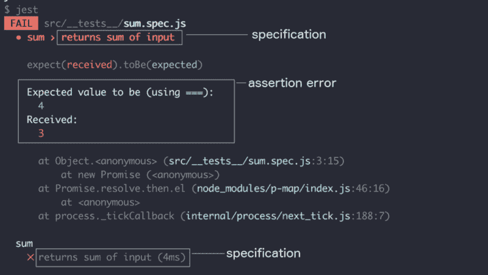
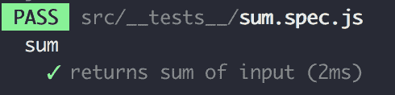

# 想让你的测试更有效吗？像这样写你的规格。

> 原文：<https://www.freecodecamp.org/news/want-your-tests-to-be-more-effective-write-your-specifications-like-this-5d701a961e35/>

作者:艾德·耶伯格

# 想让你的测试更有效吗？像这样写你的规格。


编写测试规范是很棘手的。如果你做对了，你的测试很容易理解和调试。但是如果做错了，你的测试会让人们更加困惑，而不是帮助他们。

在本文中，我将向您展示如何编写表达性测试规范。

### 什么是测试规范？

测试规格(specs)是测试运行人员运行测试时用来标识测试的字符串。

下面你可以看到一个失败测试的输出示例。您可以看到规范和断言错误是如何被用来描述测试失败的。



Console output from a failed test using the specification and assertion error

### 为什么测试规格很重要？

当一个测试失败时，你可以通过测试规范来识别它。

如果规范写得很好，通过使用测试规范和[测试断言](https://medium.freecodecamp.org/how-to-write-powerful-unit-tests-using-value-assertions-3de5146c0088)，您将立即知道测试失败的原因。

```
calls showModal when button is clickedError: Expected spy to have been called but it was not. 
```

我们可以猜测测试失败是因为单击按钮时没有调用 showModal。这种可调试性是你在测试中应该追求的目标。

让我们看一些规则来帮助编写精彩的测试规范。

### 金发女孩规则

你应该遵循测试规范的金发女孩规则——不要太笼统也不要太具体。

比如`does what I expect`太笼统。你不会知道测试失败的原因或者测试在检查什么。

同时，你需要避免太具体。不要使用`adds cache-control none header and vary Lang header`，使用一个不太窄的规范，比如`adds correct headers`。

失败的测试有两个部分。测试规范和错误消息。

```
adds correct headers Error: Expected something to equal none
```

你的测试名应该告诉我们发生了什么。但它不需要给我们每个细节。[断言错误](https://medium.freecodecamp.org/how-to-write-powerful-unit-tests-using-value-assertions-3de5146c0088)应该包括一个补充测试规范的值。

### 保持简短

规格应该简短。

我的经验是它们不应该超过 150 个字符。

如果你的测试超过了 150 个字符，那么你的单元可能太复杂了。要么重写规范使之更短，要么将单元的功能分解成更小的块。

### 用现在时态写作

你的测试规格应该是现在时态。

比如`calls toggleModal when button is clicked`，而不是`will call toggleModal when button is clicked`。

规格说明是对你的单元行为的陈述。

用现在时写会使你的说明书更短，更容易阅读。

### 关注输出和输入

测试应该触发一个输入并期待一个输出。

您的规范应该遵循这种模式——输入时输出**。例如`calls toggleModal when button is clicked`或`returns true when called with string`。**

遵循这个标准可以确保你的测试集中在输出和输入上。

### 简明扼要

你在测试规范中没有太多的空间，所以远离不必要的词。

例如，不要添加像应该或将要这样的填充词。

`should call showmodal when clicked` ❌

`will call show modal when clicked` ❌

`calls show modal when clicked` ✅

### 不要使用嵌套的描述块

很多 Javascript 测试库都包含一个叫做`describe`块的特性。

块定义了测试中的部分。

如下所示的描述块:

```
describe('sum', () => {  test('returns sum of input', () => {    expect(sum(1,2)).toBe(3)  })})
```

它会创建以下控制台输出:



The output using a sum describe block

您应该使用 describe 块在一个文件中定义一个测试套件。

一些开发人员将描述块嵌套在一起来组织他们的测试。千万不要这样。

不要像这样编写测试:

```
describe('API', () => {  describe('/books', () => {    describe('/id', () => {      describe('not found', () => {        test('returns 404', () => {          expect(4).toBe(4)        })      })    })  })})
```

编写这样的测试:

```
describe('API', () => {  test('returns 404 when /books/id is not found', () => {    expect(4).toBe(4)  })})
```

**永不嵌套描述块**。在嵌套了 describe 块的文件中维护二三十个测试确实令人困惑。您浪费时间来决定一个新测试应该放在哪个块中，并且很容易不小心删除一个右花括号。

嵌套的描述块增加了不必要的认知负荷。

### 为不同类型的测试编写不同的规格

您将编写两种类型的测试规范— **高级规范**和**开发人员级别的规范**。

端到端测试需要高水平的规范。端到端测试执行的操作是高级的，规范应该与之匹配。

高层规格是你的经理可能会给你的那种规格。你可以给你的经理看说明书，他会明白测试的目的。

另一方面，单元测试需要开发人员级别的规范。

单元测试检查代码中的函数是如何工作的。它们是低级的，所以规格应该反映这一点。

开发者级别的规范只对其他开发者有意义，比如`button should trigger action with displayModal true when clicked`。他们可以提到对非开发人员没有意义的概念。他们可以使用像`Boolean`和`throws error`这样的术语。

将单元测试视为未来开发人员的文档，将端到端测试视为未来项目经理的文档。并确保您的规格反映这一点。

### 行动呼吁

既然你知道了如何编写高质量的测试规范，那就出去写一些测试吧！如果你不知道如何编写测试，Jest 的[入门指南是一个很好的起点。](https://facebook.github.io/jest/docs/en/getting-started.html)