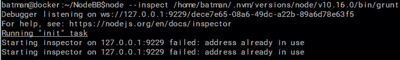
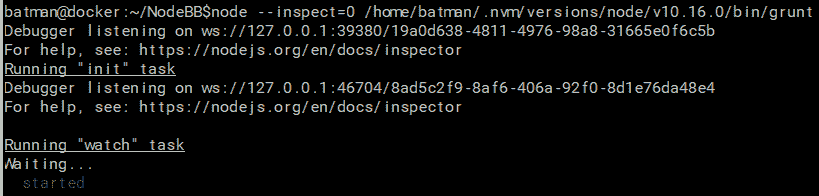
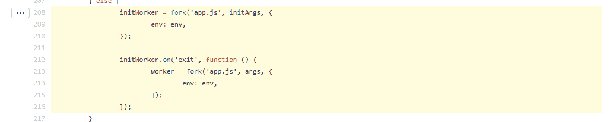
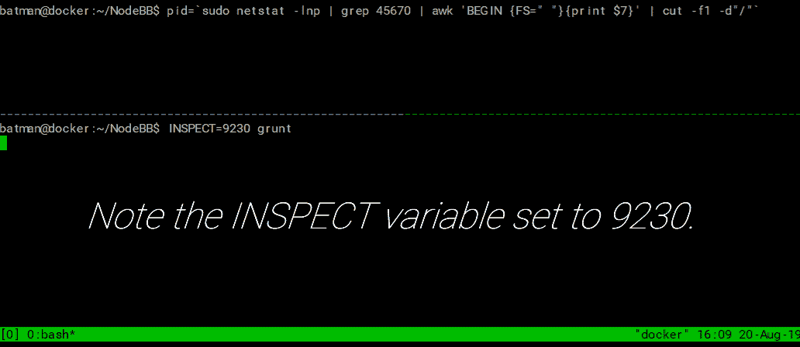
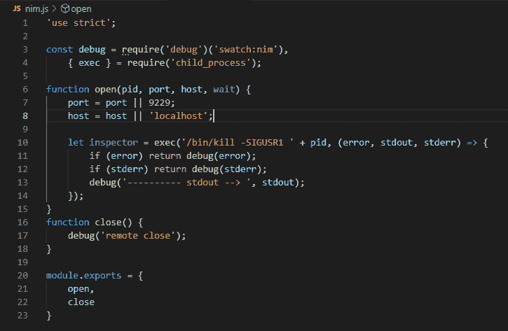
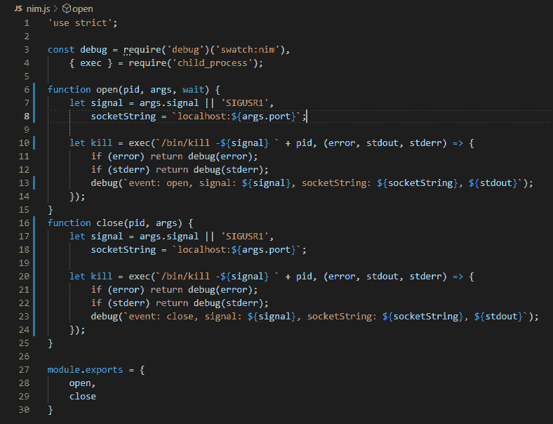
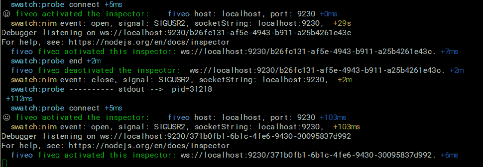
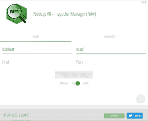

# 如何用 Grunt-SWATCH 检查 Node.js(！手表)和 Fiveo

> 原文：<https://www.freecodecamp.org/news/watch-sockets-with-this-grunt-plugin/>

我知道，我知道...封面图片中的插座并不是我们在这篇文章中谈论的那种插座，但我最近一直专注于构建一个新工作站的想法，而 [ThreadRipper](https://www.amd.com/en/products/ryzen-threadripper) 是一个怪物！我的意思是，这实际上可能是解决方案，无论我使用什么升级，我都不会觉得我的计算机不够快(目前是英特尔 I7 第八代 CPU)。

这些年来，我用过的每一台台式机/工作站(确实有一台)都有很多不足之处。在你的电脑前等待计算真糟糕！屏幕故障、看似永无止境的进度微调器、滞后时间等等确实会破坏生产力和工作流程。

无论如何，进入主题，远离...


## nodeb(node . js 论坛)黑客攻击

正如我最近写的，我最近的黑客时间都花在了论坛软件 NodeBB 上。nodebb 的开发人员实施的构建过程依赖于 Grunt task runner，它本身也是用 Node.js 构建的。当您可以在主要基于您最喜欢的框架(例如 Node.js ❤️).)构建的生态系统中工作时，这非常好

然而，当涉及到调试时，当您的构建工具和软件的其他层都是用 Node.js 构建时，有时事情会变得有点棘手。就像当你想把`--inspect`标志传递给节点可执行文件来开始一个调试会话时，目的是调试你的插件代码，而不是它上面的层(Grunt，nodeb)。

我不知道任何特定于 Grunt cli 的命令行选项可以用来将您启动节点调试会话的意图传递到任务级别。我尝试了几件事情都没有用，但是仍然有几个选项可以完成它:

1.  直接调用 Node 开始咕哝，ala `node --inspect /path/to/grunt`
2.  使用仍处于试验阶段的[检查器 API](https://nodejs.org/api/inspector.html) 以编程方式启动节点检查器
3.  使用 Linux 信号启动节点检查器，确切地说是`SIGUSR1`。

## 权衡

当然，每一种解决方案都有自己的障碍，而且和大多数事情一样，既有积极的一面，也有消极的一面！

在这篇文章中，我将谈论每一种解决方案，详细说明我在使用每一种解决方案时所面临的问题。我们将看到如何利用 Inspector API 使 [NPM 模块 fiveo](https://www.npmjs.com/package/fiveo) 成为可能，以及该工具如何使在 Node.js 中使用 Linux 信号变得更加强大。最后，我将展示在本文提出的场景中，选项#3 如何被证明是最佳解决方案。以及选择选项#3 如何作为编写 grunt-swatch 插件的催化剂，该插件目前做什么，以及它可以做些什么。

# 1.检验标志`--inspect`

因此，这个命令可以很好地启动调试器:

`node --inspect /home/batman/.nvm/versions/node/v10.16.0/bin/grunt`

grunt 将继续做它的事情，即在实际启动 NodeBB 服务器之前执行一系列构建步骤。然而，请注意一个重要的事实，即当 Grunt 启动全新的流程时，通过用`--inspect`调用 Node 来启动初始节点流程将会带来挑战。

奇妙的是，当节点子流程启动并且父流程调用了 inspect 标志集时，子流程将继承该设置。但是出于同样原因，如果您像我们一样用`--inspect`调用 node，您将面临这些好消息？在控制台上盯着你:

`failed: address already in use`



这些`failed: address already in use`消息的出现是因为 inspector 是一个套接字服务器，已经在父进程上启动，在我们的例子中是 Grunt。因此，当子进程使用继承的默认参数设置为`localhost:9229`的`--inspect`标志启动时，Node 会尝试使用默认端口 9229 启动 inspector socket 服务器(从现在开始，我们称之为“ *inspect process* ”。

解决这个问题的方法是将我们的初始命令改为:
`node --inspect=0 /home/batman/.nvm/versions/node/v10.16.0/bin/grunt`

**"=0"** 导致 inspect 进程选择一个随机端口，如您所见，选择了 39380 和 46704。



这很好，因为现在我们有两个 inspector 进程正在运行！不太好的一点是，我们不在乎他们中的任何一个...还没有。

## NodeBB 的构建设置

我无法完全解释组成 NodeBB 的 Gruntfile 的 [Grunt 流](https://github.com/NodeBB/NodeBB/blob/master/Gruntfile.js#L208-L216)的 **WHY** :



但是我可以说**它所做的基本上是派生一个初始化序列，负责构建 css、语言文件、模板、构建/绑定 Javascript 等...然后，第二个过程被分叉，以实际启动 NodeBB 服务器，资产准备就绪，一切就绪。**

更进一步，每次由于监视进程( [grunt-contrib-watch](https://www.npmjs.com/package/grunt-contrib-watch) )而检测到变化时，当前的 NodeBB 进程被终止，新的进程开始。新的流程随之而来...确切地说，每个周期都会产生一个新的随机调试端口。

这再次使我们的调试工作变得复杂，并引发了一些问题。

*   我们如何跟踪所有这些随机检查端口？
*   此外，当我们在远程服务器上工作时，我们如何处理端口转发？
*   我们真的关心中级督察会议吗？

当我们思考的时候？在这些，让我们叉自己...

# 2.使用节点的检查器 API

当我们最初希望调试自己的代码时，这样做需要一种更“侵入性”的方法。这个选项需要包含 inspector 模块，这本身没什么大不了的。我们总是需要代码，inspector 模块是一个核心 Node.js 模块，而不是一些第三方代码。

但是，为了使该模块真正有用，必须编写额外的代码并添加到我们的代码库中。

```
const inspector = require('inspector')
```

很安静...

走开去黑一些其他的代码...

## 昨晚！

所以昨晚当我写这篇文章的时候，我开始写那篇*老实说，我以前没有给过 inspector 模块太多的机会。当我努力以最明智的方式写这篇文章的时候，我被送进了一个兔子洞。*

其中之一是我写了一个小小的库，在核心的 inspector 模块上添加了一些糖，这看起来很酷。现在，在编写完上述微型库之后，我建议不要要求 inspector 模块，最好使用 [fiveo](https://www.npmjs.com/package/fiveo) 来为您完成这项工作，同时添加一些漂亮的功能，例如使用 9229 以外的端口，有点像这个 GitHub 问题所涉及的[。](https://github.com/nodejs/node/issues/16872)



尽管如此，你可能不喜欢我的小图书馆？，你可能对写自己的不感兴趣。使用 inspector api 需要向您自己的代码中添加额外的代码，这一事实仍然存在。这可能是使第二个选项成为您项目的糟糕选择的一个因素。这就引出了第三个也是最后一个选项...

# 3.`SIGUSR1`...等等我是说`SIGUSR2`！

所以最终我找到的最佳解决方案是使用 UNIX/Linux [信号](https://manpages.ubuntu.com/manpages/bionic/en/man7/signal.7.html)。这是一个指向联机帮助页的链接，它向您概述了信号到底是什么。总之，信号可以改变接收它们的进程的行为。*注意，Windows 不支持信号。*来自 Node 的官方文档:

如果 Node.js 收到 SIGUSR1 信号，它也会开始监听调试消息。(SIGUSR1 在 Windows 上不可用。)

## 这个计划

总的想法是，我们可以在需要时将 SIGUSR1 信号传递给特定于我们代码的节点进程，而不是在此之前，从而消除所有我们不关心的噪声。像 NodeBB 在初始化阶段正在做什么(记住它派生了一堆东西)，或者 Grunt 代码正在进入什么，等等。

我们准备好启动调试器的时间点是 Grunt 完成它的 init 任务、启动 NodeBB 服务器，并且可以通过它被配置为在`tcp/45670`上运行的端口访问论坛之后的时间点。此时，我们需要确定 NodeBB 正在侦听的进程 id，因为我们需要一个进程 id 来将信号传递到适当的位置。收到`SIGUSR1`后，Node 将启动 inspector 进程，我们可以开始调试了！

我们在上一段中描述的正是我们的 Grunt 插件 **grunt-swatch** 所做的。它与 *grunt-contrib-watch* 相似，它会持续观察您环境中的变化，不同之处在于 **grunt-swatch** 不观察文件系统，而是观察网络，因此其名称源自 *socket watch* 。

咕噜声-贡献-观察

每当添加、更改或删除监视的文件模式时，运行预定义的任务

人们应该能够为插件编写其他“动作”，但是我只编写了 nim(恰当的命名，但也是对 [NiM](https://june07.com/nim) 的回调)动作 [nim.js](https://github.com/june07/grunt-swatch/blob/master/nim.js) :



你可以看到它做的很简单，但正是我们需要的。它使用 Linux `kill`命令(顺便说一下，也是[一部娱乐科幻片](https://en.wikipedia.org/wiki/Kill_Command))。)向我们的*swapped*进程发送`SIGUSR1`信号。正如你所看到的，`close()`函数目前不做任何事情，这是因为在编写 [fiveo](https://www.npmjs.com/package/fiveo) 之前，没有办法通过信号方法关闭节点检查器。然而，包括 fiveo 在内，我们可以访问`SIGUSR2`，它可以关闭 inspector 进程...让东西更整洁一点？。



这里是您可以从`swatch:nim`日志输出中看到的输出，nim 操作实际上关闭了之前打开的节点检查器套接字。在下面的截图中，你可以看到这个 websocket 的完整的打开/关闭周期:`ws://localhost:9230/b26fc131-af5e-4943-b911-a25b4261e43c`



Grunt 加载并适当配置我的 grunt-swatch 任务将确保在我的开发过程中，检查器将在我需要时智能地停止和启动。

```
grunt.loadNpmTasks('grunt-swatch') 
```

此外, [NiM](https://june07.com/nim) 将确保 DevTools 总是在我需要的地方，对正确的 inspector websocket 打开并准备就绪。



现在我们有了。通过使用 grunt-swatch、fiveo 以及[NiM](https://june07.com/nim)Chromium Extension，我们的 NodeBB 插件开发工作流程得到了极大的改进！我当然不会怀念手动一遍又一遍地运行这个命令的过程。一遍又一遍:

```
pid=`netstat -lnp|grep 45670|awk 'BEGIN {FS=" "}{print $7}'|cut -f1 -d"/"'`
kill -SIGUSR1 $pid 
```

接下来的一些步骤可能是设计一种与被调试进程通信的方法，以便动态地改变调试器端口。能够从 Grunt 配置中设置调试端口，并在本质上强制节点应用程序在预先配置的(开发中，运行后)端口上打开调试器将是理想的！

# 结论

我希望这篇文章对你有所帮助。以下是材料的相关链接:

*   fivo-NPM[https://www . npmj . com/package/fivo](https://www.npmjs.com/package/fiveo)，github[https://github . com/June 07/fivo](https://github.com/june07/fiveo)
*   https://www.npmjs.com/package/grunt-swatch，GitHub[https://github.com/june07/grunt-swatch](https://github.com/june07/grunt-swatch)
*   尼姆-网络商店[https://june07.com/nim](https://june07.com/nim)，GitHub[https://github.com/june07/NiM](https://github.com/june07/NiM)