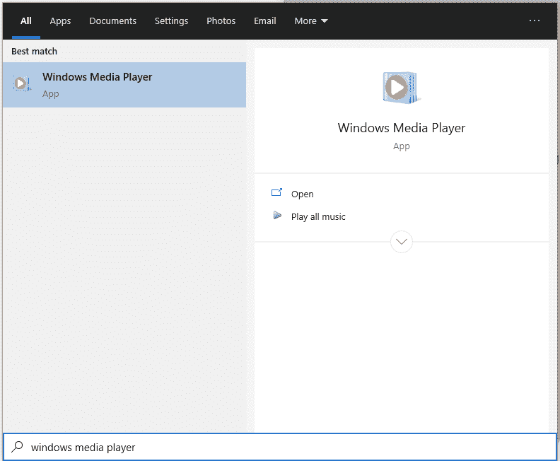
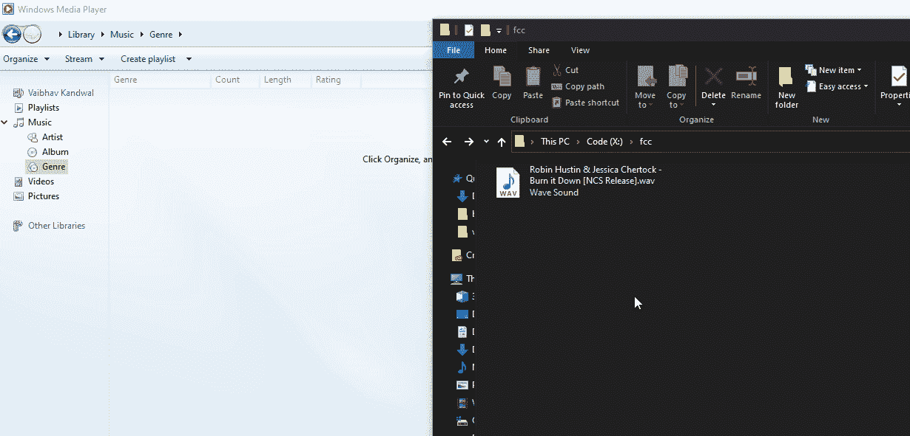
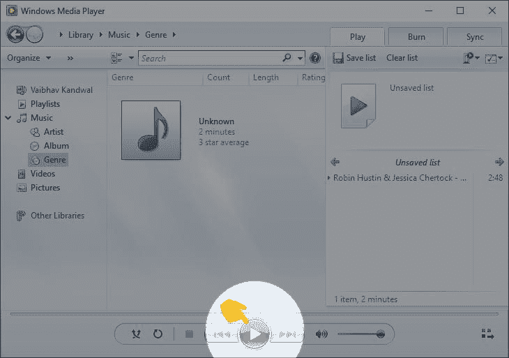
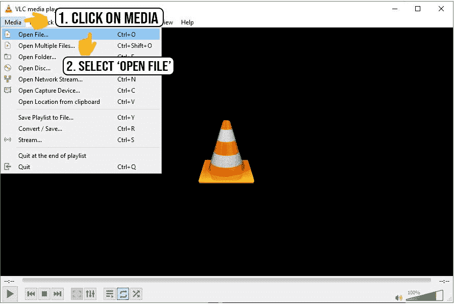
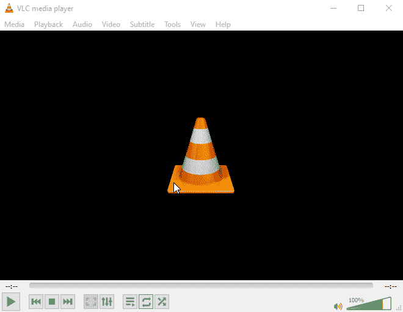

# Wav 文件格式–如何打开 Wav 并将 Wav 转换成 MP3

> 原文：<https://www.freecodecamp.org/news/wav-file-format-how-to-open-a-wav-and-convert-wavs-to-mp3/>

音频是任何数字媒体中非常重要的一部分。因为音频或声音是一种波(字面上的连续波)，所以本质上是模拟的。这意味着它不能被计算机直接存储和处理，因为计算机只能理解数字信号。

所以很自然地，工程师们找到了一种将这些模拟信号转换成数字信号的方法。他们还开发了一种以数字格式保存它们的方法。我说的是音频编解码器。

音频编解码器，简单来说就是编码器和解码器( *co* -编码器， *dec* -解码器，或者 *co* -压缩器， *dec* -解压器)。它们可以实现为硬件编解码器，将模拟音频编码为数字音频，反之亦然。

这种编解码器的一个例子是计算机中的声卡，它具有内置的模数(ADC)和数模(DAC)电路。

软件对应物是一种压缩和解压缩数字音频的算法。此类编解码器的一些示例包括 MP3、FLAC、WAV 和 AAC。

今天，我们将讨论软件编码器，并将注意力集中在 WAV 格式上。

## 压缩在音频编解码器中意味着什么

音频压缩算法分为两类:*无损*和*有损*。那么这两者有什么区别呢？

### 无损算法

这些算法可能会对音频执行某种压缩，但不会删除任何音频数据，因此不会丢失任何数据。代价是文件非常大。

### 有损算法

在这种类型的压缩中，音频保真度的某些部分(被认为是人耳听不到/无法辨别的)被移除或其保真度(或准确度或响度)降低。在这个步骤之后也进行压缩。你可以在这里了解更多信息。

除非你有一个非常好的高保真音响系统，可以再现那些超保真度的声音，否则你应该选择有损的。这将节省空间，并删除额外的数据，你可能永远不会听到。

现在您已经了解了音频压缩，让我们继续讨论本文的主题。

## WAV 是什么？

WAV(或 WAVE)代表波形音频文件格式。它是由 IBM 和微软开发的。文件扩展名为`.wav`或`.wave`。

WAV 格式广泛应用于需要未压缩音频的场合。例如，音响工程师经常使用它——由于它的无损形式，它可以用于早期生产样品。

大文件大小意味着它通常不适合在互联网上传输。MP3 和 AAC 等其他格式提供的文件大小要小得多，因为它们是有损的。

### WAV 格式的限制

WAV 文件的大小限制为 4GB，因为它们有一个 32 位的文件头。W64 是一个后继版本，它有 64 位的头，允许更大的文件大小。

除此之外，由于音频是未压缩的，其文件大小较大。因此，如果音频存储在慢速磁盘驱动器上，可能会导致缓冲问题(因为在音乐播放器可以解码和播放文件之前，音频需要从磁盘加载到 RAM)。

然而，这在现代计算机上可能不是问题，因为它们有更快的磁盘驱动器。

## 如何打开 WAV 文件

由于 WAV 是一种非常流行的格式，所以现在几乎所有的设备都使用内置的媒体播放器来支持它。

*   在 Windows 上，Windows Media Player 能够播放 WAV 文件。
*   在 MacOS 上，iTunes 或 QuickTime 可以播放 WAV 文件。
*   在 Linux 上，您的基本 ALSA 系统可以播放这些文件。

其他解决方案也存在，可以帮助您播放 WAV 文件，如 VLC 媒体播放器或任何其他音乐播放器。

### 如何使用 Windows Media Player 在 Windows 上播放 WAV 文件

1.  使用搜索打开 Windows Media Player

step 1: windows search

2.将 WAV 音频文件从资源管理器拖放到 Windows Media Player

step 2: drag and drop your audio

3.点击播放！

step 3: click play

### 如何使用 VLC 媒体播放器在任何操作系统上播放 WAV 文件

VLC 媒体播放器是一个开源的媒体播放器，可以播放大多数文件格式，而不需要下载外部编解码器。它也是跨平台的，所以你将在所有操作系统上获得相同的功能和界面，无论你使用 Linux、Windows 还是 MacOS(也支持 Android 和 iOS)。

以下是在电脑上用 VLC 播放 WAV 文件的步骤。

1.  从官网下载 VLC[这里](https://www.videolan.org/)
2.  打开 VLC
3.  点击媒体，然后选择打开文件

step 3: click on 'media', then click 'open file'

4.在文件选择器对话框中，选择你的音频，点击`Open`，WAV 文件应该会自动开始播放！

step 4: select your file and click 'open'

或者如果你喜欢 GIF:

Step 1-4 for VLC :D

## 如何将 WAV 文件**转换成 MP3**

根据终端设备的不同，您可能希望将 WAV 转换为其他格式，例如，为了节省磁盘空间，或者如果您在低端设备上听音乐。

MP3 是储存音频的很好的格式。它将文件大小缩小了 50-75%,同时保留了几乎相同的收听体验。让我们看看如何转换这些文件。

### 在线转换器

如果你只是偶尔转换音频，我会建议你使用在线转换器，如 [CloudConvert](https://cloudconvert.com/wav-converter) 。谷歌是你的朋友。

请记住，这些在线转换器可以存储你的文件一段时间(甚至永远)，所以如果你想转换一些关键的东西，请阅读他们的政策。

### 离线转换器

另一种选择是在本地转换这些文件。如果你想频繁转换或者有不想暴露在网上的东西，这个会帮到你。

有两种方法:

**[Audacity](https://www.audacityteam.org/)**:Audacity 是一款免费、开源的跨平台应用，允许你编辑和转换音频。

唯一的缺点是你必须先做一些初始设置(安装 LAME)。你也必须一个接一个地转换文件。

**[FFmpeg](https://ffmpeg.org/)** : FFmpeg 是一个跨平台的命令行工具，用于转换音视频文件。您可以运行以下命令将 wav 文件转换为 mp3:
`ffmpeg -i input.wav output.mp3`

您可以仔细阅读 FFmpeg 的文档，了解如何定制一些参数，并传递文件列表以进行批量转换。

主要的缺点是 FFmpeg 对用户不友好。您需要知道如何使用命令行工具。虽然存在类似 FFmpeg GUI 的东西，但这超出了我们在这里讨论的范围。

### 感谢阅读！

我希望这篇文章能让你对音频压缩有所了解，以及如何处理和转换 WAV 文件。

有任何问题或意见，可以在 Twitter [@vaibhav_kandwal](https://twitter.com/vaibhav_kandwal) 找我。感谢您的阅读。