# 我们问了 15000 人他们是谁，他们是如何学习编码的

> 原文：<https://www.freecodecamp.org/news/we-asked-15-000-people-who-they-are-and-how-theyre-learning-to-code-4104e29b2781/>

超过 15，000 人回应了 2016 年新编码器调查，让研究人员前所未有地了解了成年人是如何学习编码的。

我们已经在公共 GitHub 库上发布了参与者对所有 48 个问题的个人回答的整个数据集——在开放数据公共许可下。

在接下来的几周里，我们将发布一个网站，上面有这些数据的交互式可视化，回答几十个问题，例如:

*   一个城市的人口密度如何影响编码活动的出席率？
*   远程工作的愿望如何影响获得第一份开发人员工作？
*   不同国家的第一份开发工作中，先前的兵役如何影响薪水？

与此同时，这里有一些来自 2016 年新编码器调查结果的高级统计数据，可以帮助你渡过难关。

#### 谁参加了？

CodeNewbie 和自由代码营[设计了调查](https://medium.freecodecamp.com/we-just-launched-the-biggest-ever-survey-of-people-learning-to-code-cac81dadf1ea#.chm9tyigi)，数十个编码相关组织向其成员宣传。

在参与调查的 **15，655** 人中:

*   21%的女性
*   他们的平均年龄是 27 岁
*   他们平均在 11 个月前开始编程
*   28%已经获得了他们的第一份开发人员工作

### 学习者目标和方法

#### 40%的人想做自由职业者或者自己创业。

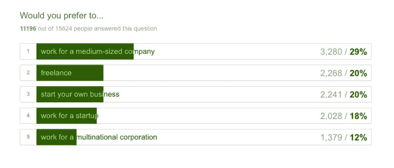

#### 绝大多数人对 web 开发人员感兴趣，而不是其他开发人员。

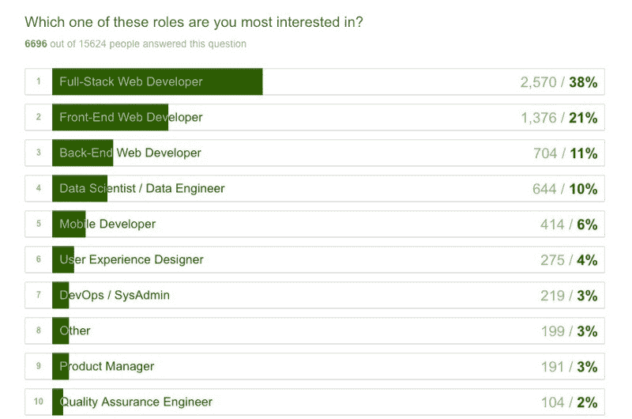

#### 他们中的大多数人已经在申请开发人员的工作，或者将在明年开始申请。

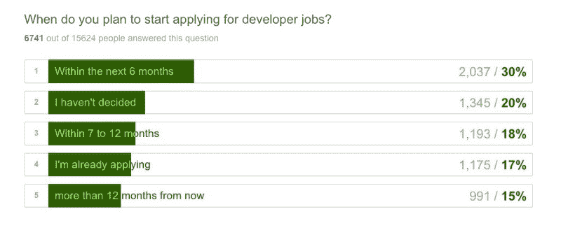

#### 他们中的大多数人希望在办公室工作，而不是远程工作。

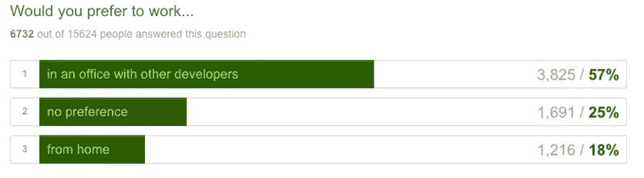

#### 大多数人愿意搬迁。

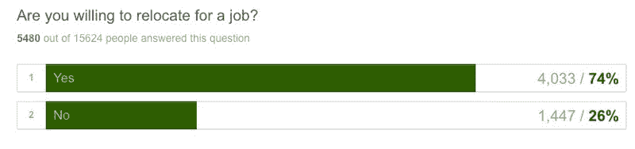

#### 他们中的大多数人还没有参加过任何现场编码活动。

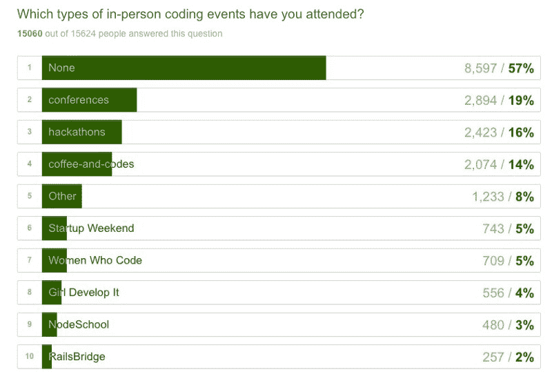

#### 平均来说，他们使用至少三种不同的资源来学习编码。

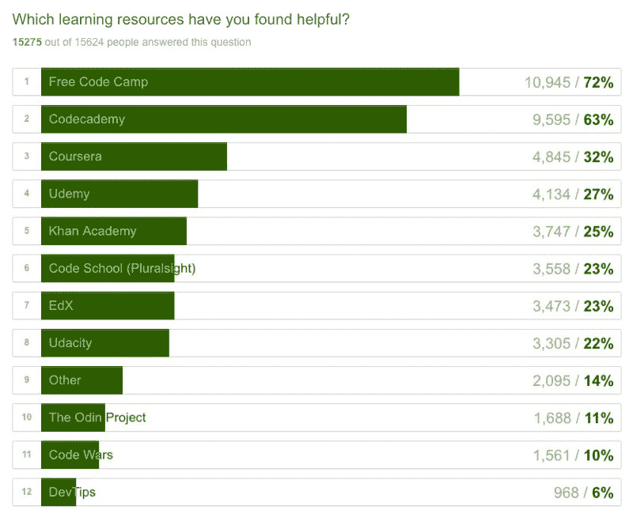

#### 只有四分之一的人听编码相关的播客。

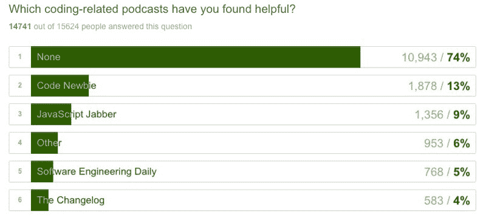

### 编码训练营

#### 954 名受访者参加了超过 125 个编码训练营中的一个。

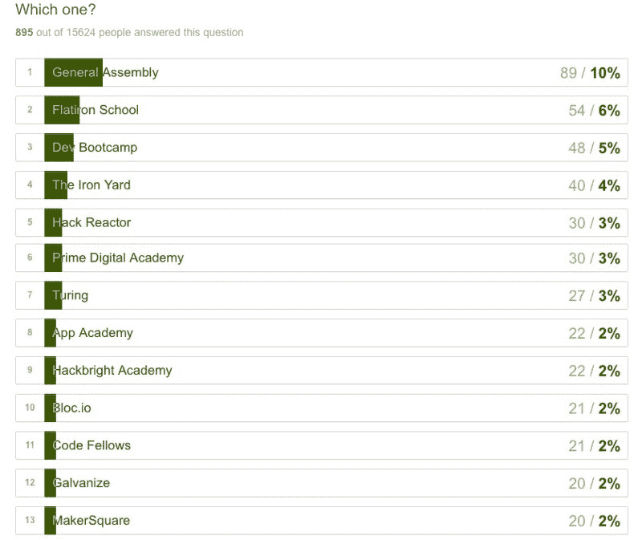

#### 在那些完成训练营的人中，超过一半的人能够找到全职开发人员的工作。

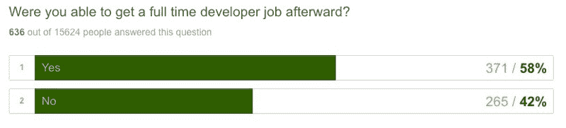

#### 其中三分之一的人借钱参加了训练营。

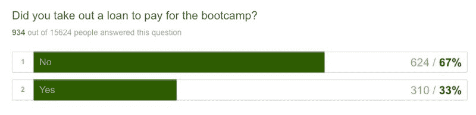

### 人口统计学和社会经济学

#### 我们有来自 169 个国家的受访者。

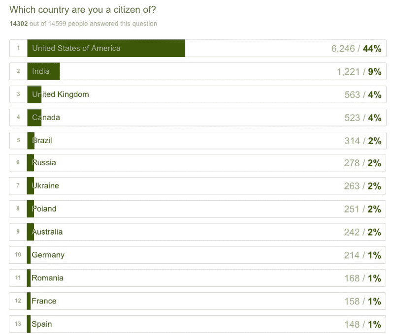

#### 他们的城市跨越了广泛的城市化水平。

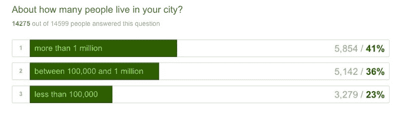

#### 四分之一的受访者是他们国家的少数民族。

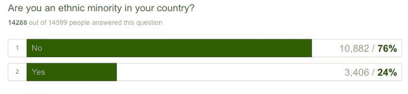

#### 将近一半的人母语不是英语。他们从小说 152 种语言中的一种。

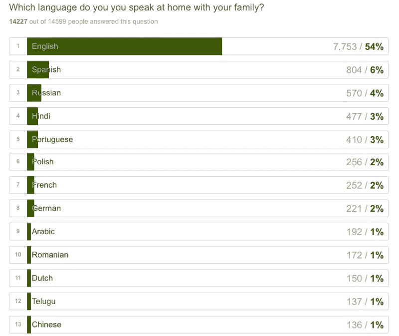

#### 58%的人至少获得了学士学位。

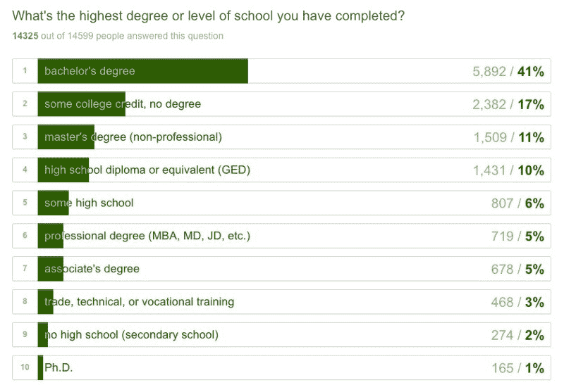

#### 他们研究了 430 个不同的专业。计算机科学是最受欢迎的专业，另有 15%的学生学习某种形式的工程。

#### 三分之二的人目前在工作。

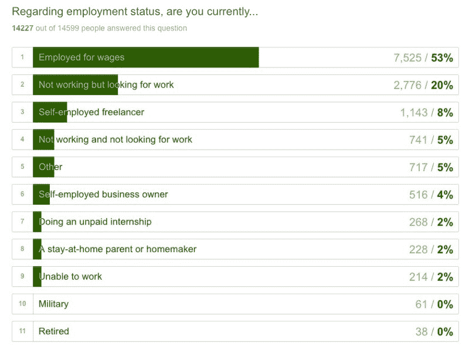

#### 一半已经在技术相关领域。

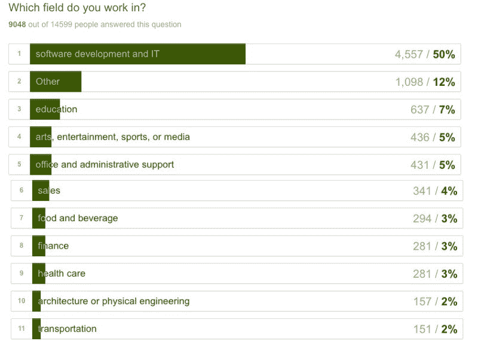

#### 8%的人曾在本国军队服役。

#### 18%的人有孩子，另外 6%的人在经济上支持年老或残疾的亲属。其中四分之一是在没有配偶帮助的情况下完成的。

#### 42%的人认为自己就业不足(从事低于其教育水平的工作)。

#### 如果他们有住房抵押贷款，他们平均欠 18.9 万美元。

#### 如果他们有学生贷款，他们平均欠 34k 美元。

#### 12%的人家里还没有高速互联网。

#### 2%的人目前正从政府领取残疾津贴。

#### 这些人正在学习编码。您可以看到免费的、自定进度的学习资源为何如此重要。

### 下一步是什么？

我们已经对所有 15，655 条记录进行了清理和规范化。我们的社区正在使用这些来构建数据可视化，以回答一系列不同的问题。

如果你有一个关于学习编码的人的问题，[创建一个 GitHub 问题](https://github.com/FreeCodeCamp/2016-new-coder-survey/issues/new),我们将看看是否可以构建一个交互式可视化来回答这个问题。

如果您对分析这些数据和/或构建一些可视化感兴趣，[加入我们的数据科学聊天室](https://gitter.im/FreeCodeCamp/DataScience)并介绍自己。

我只写编程和技术。如果你在推特上关注我，我不会浪费你的时间。？