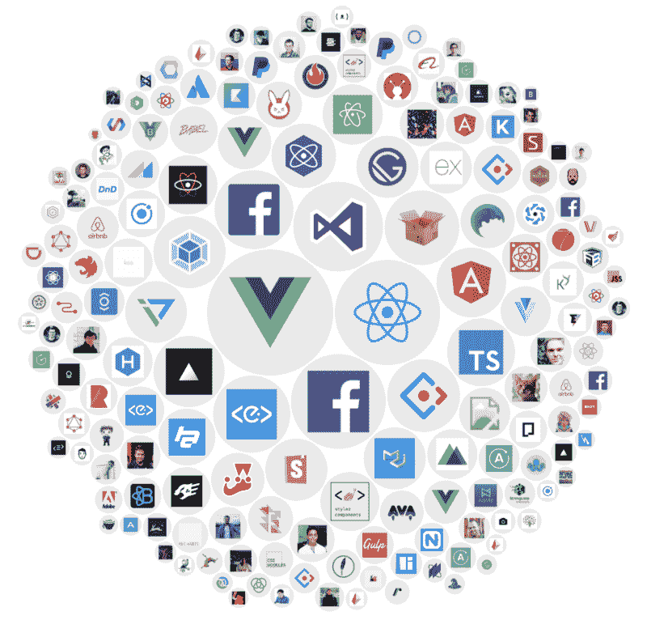
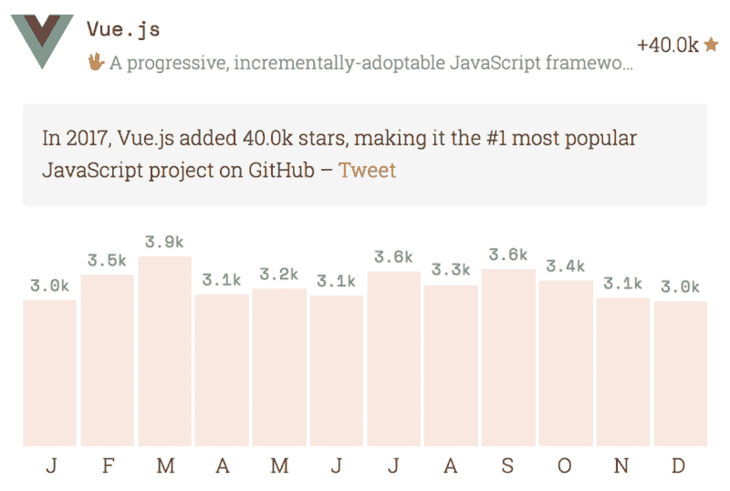
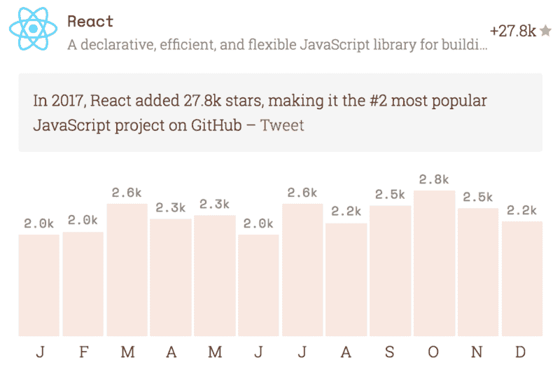
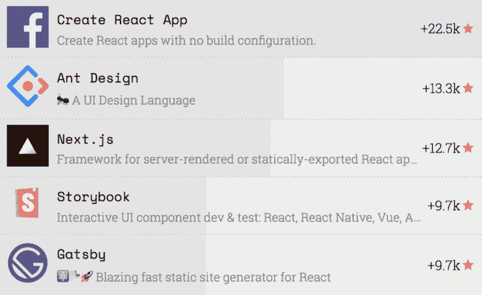
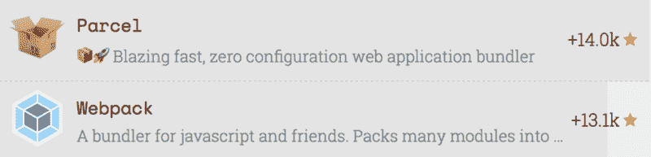
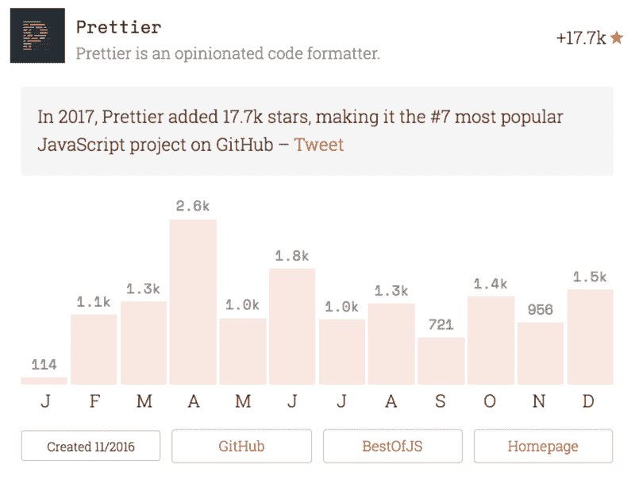
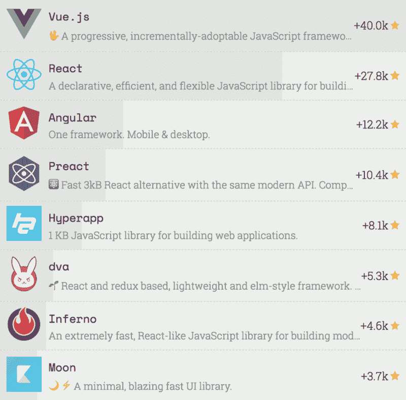

# 我们汇编了 2017 年顶级 JavaScript 项目的统计数据。这是我们学到的。

> 原文：<https://www.freecodecamp.org/news/we-compiled-stats-for-the-top-javascript-projects-of-2017-heres-what-we-learned-441a1b77468c/>

萨沙·格里菲

# 我们汇编了 2017 年顶级 JavaScript 项目的统计数据。这是我们学到的。

#### 宣布 2017 年 JavaScript 新星

日本时间每天早上 6 点，有一小段代码存储在云中的某个地方。它醒来，点击 GitHub API，然后继续休眠，直到第二天。

然后，它获取 GitHub 数据，为预先选择的 JavaScript 项目范围编译星级数，然后将这些星级存储在[BestOfJS.org](https://bestof.js.org)数据库中。

然后，每年一次，我们收集所有这些累积的数据，并用它来计算出今年最受欢迎的 JavaScript 项目，也被称为 [JavaScript 新星](https://risingstars.js.org/2017)。

让我们看看我们学到了什么。

### Vue.js(再次)排名第一

就像去年的一样，Vue.js 是 2017 年积累新星最多的 JavaScript 项目。

现在，这并不意味着它在明星总数方面是最受欢迎的项目(仍将是 [React](https://github.com/facebook/react) ，有 85，589 位明星)，但它确实使它连续两年增长最快。按照这种速度，Vue 应该在六个月内超过 React！

另外，一定要看看我们的特别报道，作者不是别人，正是 Vue 的创造者尤雨溪本人！

### React 的优势在于它的生态系统

尽管 Vue 很成功，React 也做得很好。

虽然 React 本身并没有以同样的速度增加星星(对于一个老项目来说应该是这样)，但真正成功的故事是 React 生态系统:

五大顶级项目累计总星数 67.9k，vs Vue 生态圈 44.4k。

此外，现在所有这些许可问题都已过去，采用 React 的最后一个主要障碍可能已经消除。因此，观察 2018 年的事态发展将会非常有趣。

### Parcel 一个月获得的星星比大多数项目一整年获得的星星还多

你可能会认为，当谈到年度排名时，在 12 月启动你的项目几乎会毁掉任何进入前 20 名的机会。

但是不要告诉[package](http://parceljs.org):它在不到一个月的时间里成功积累了超过 14k 颗星星，直接成为 2017 年最受欢迎的项目中的第 12 名。

更令人惊讶的是:Parcel 在一个月内增加的星星比类别领导者 Webpack 一整年增加的还多！

事实上，Parcel 的成功让我们大吃一惊，我们的数据库中甚至没有它，我们不得不从其他来源收集数据(感谢我们在 [Porter.io](https://porter.io) 的朋友们！).

### 漂亮是每个人最喜欢的项目

当每个人都在忙于创建另一个前端框架时(但这次是功能性的！)，更漂亮的人决定接受我们这个时代真正的挑战:制表符对空格。

他们的回答是:谁在乎呢？有了 pretty，你可以使用空格、制表符或便便表情符号*，pretty 会在保存时正确格式化你的代码。

难怪《漂亮女孩》排在第 7 位。事实上，我们决定让它成为我们自己的年度非官方项目。

(注意:更漂亮的表情符号不一定适用于便便表情符号。我们实际上还没试过这个。)

### 前端战争已经结束

尽管我们对前端框架进行了廉价的尝试，但事实是它们已经不多了。

越过经典的前三名(Vue、React 和 Angular)，你很快就会进入更小、更小众的项目，如 Preact、Hyperapp 和 dva(我必须承认我以前从未听说过这些项目)。

虽然这些都有其技术优势，但就受欢迎程度和生态系统而言，它们显然不属于三大巨头的范畴。

当然，像 [Ember](https://github.com/emberjs/ember.js/) 这样更成熟的框架仍然是可靠的选择，但是它们不再有同样的势头了。

结果是前端等式的参数比以前少了很多，这对各地超负荷工作的 CTO 来说是个好消息。至少，在下一波 JavaScript 热潮到来之前！

### “VS 代码”中的“VS”代表“非常成功”

VS Code 击败了竞争对手，不仅成为年度最佳 JavaScript IDE，而且成为最受欢迎项目的第六名。

这证实了我们之前的 JavaScript 结果的[状态，它表明 vs 代码现在是 JavaScript 开发中的#1 编辑器(这导致我自己从 Sublime 文本迁移到 VS 代码)。](https://stateofjs.com/2017/other-tools/)

VS Code 的成功故事很有趣，因为它远非完美:它的用户界面有微软式的笨拙，似乎感染了他们所有的产品，它是一个很大的资源猪，初始化可能有点慢。

然而使用 VS 代码一会儿，这些缺陷就不再那么显著了。相反，类似 IDE 的特性、可扩展性和频繁更新转化为直接的生产力提升，这使得很难想象使用其他任何东西。

是的，这都是 JavaScript 代码！

### 那么下一步是什么？

总的来说，今年的新星描绘了一幅相当令人放心的画面。没有大的变动，大多数类别都有明显的主导者……这会是 JavaScript 疲劳的终结吗？

即使是这样，也不意味着 JavaScript 会停滞不前。

### 以下是 2018 年的三大趋势

#### 趋势 1: GraphQL 所有的东西！

GraphQL 可能还不是主流，但它现在已经建立了一个坚实的库、服务和框架基础，很可能使一个基于 GraphQL 的突破性项目在明年爆发。

在 2017 年， [Gatsby](http://gatsbyjs.org) (它使用 GraphQL 作为其数据层的一部分)已经做得很好，在总排名中名列第 25 位。

#### 趋势 2:理性季节

你为什么要关心一个在 2017 年只积累了微不足道的 2.1k 颗星星的项目？因为[原因](https://reasonml.github.io/)是让我成为买了你 React 和 GraphQL，换句话说脸书开源部门的同一批超级聪明的人。

Reason 是一种编译成 JavaScript 的语言，它本身正在形成未来几年的一个大趋势。

#### 趋势 3:更好的工具，更多的工具

正如 Prettier、Parcel 和 VS Code 的成功所显示的，开发人员不仅仅关心代码:他们还关心*帮助你*编写代码的东西。

这似乎是不言而喻的，但是只要浏览几个寻找“框架 XYZ 开发人员”的招聘信息，你就会发现我们行业的重点仍然是“做什么”而不是“如何做”

也许 2017 年的教训是，想要重新发明轮子没问题，但首先重新发明锤子、锯子和凿子可能也是值得的。

### 敬请关注

如果你还没有修复你的 JavaScript，看看[BestOfJS.org](http://bestof.js.org)的每日更新数据。您还可以查看 JS 调查的[状态，了解更多 JavaScript 数据。](http://stateofjs.com)

最后，我们还计划推出[每周一期的《最佳司法摘要》简讯](https://bestof.us17.list-manage.com/subscribe/post?u=3dac4d68c87b7450b93cadab8&id=193206ef13)，它将自动发送最新的统计排名，所以如果这听起来很有趣，一定要注册。

与此同时，我们错过了什么吗？你对 2018 有自己的预测吗？请在评论中告诉我们！