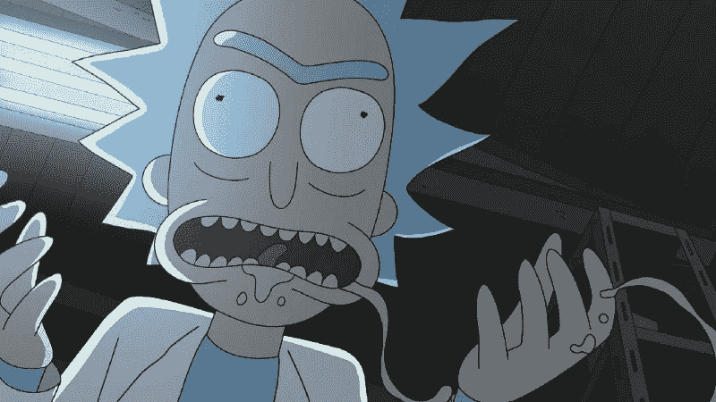
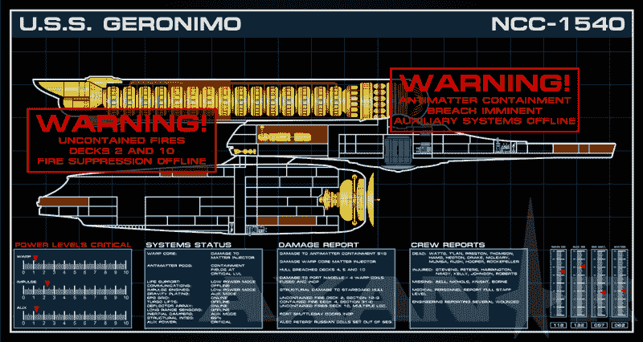

# 我们解雇了我们的顶尖人才。我们做过的最好的决定。

> 原文：<https://www.freecodecamp.org/news/we-fired-our-top-talent-best-decision-we-ever-made-4c0a99728fde/>

乔纳森·索罗扎诺-汉密尔顿

# 我们解雇了我们的顶尖人才。我们做过的最好的决定。

“你永远无法理解我所创造的任何。我是阿尔伯特他妈的爱因斯坦，你们都是在泥土里乱扒的猴子。”

所以我们的常驻天才，我们的杰基尔博士，爆炸性地完成了他向海德先生的转变。

他在产品设计团队、开发人员、管理层和预发布客户面前宣布了这一点。我们的一个项目发起人冒昧地问，影响我们产品的问题什么时候能解决。

天才是变化无常的野兽。有时候你很幸运能和一个疯狂的天才一起工作。其他时候，你注定要疯狂地工作。也有很难区分的时候。

这个故事是关于一个对我们的产品架构有深刻理解的极具天赋的团队成员的失宠。他有一种预测未来需求的不可思议的能力，以及大量特定领域的知识。

他是我们最大的贡献者。他扼杀了我们的旗舰项目。

我们称这个人为“里克”

You don’t want this guy on your team. (image © Warner Bros.)

里克是队里公认的顶尖人才。他是我们软件项目的首席开发人员和架构师。

任何时候，任何人有关于代码的问题或者需要帮助，他们都会去找 Rick。Rick 在他的办公室里安装了一个巨大的白板，专门用于这个目的。它总是充斥着过去讨论的幽灵，不会完全抹去。

任何时候有特别具有挑战性的问题，瑞克都会处理。Rick 的办公桌上安装了一台与我们的生产服务器规格相同的服务器。他用它来独立运行整个应用程序堆栈，并同时对每一层进行故障排除。

瑞克不需要任何人。瑞克更喜欢在他的私人工作空间里独自工作。

里克不需要任何别人造的东西。他从零开始建造他需要的一切，因为它比凡人微不足道的产品好得多。

很快，瑞克不再参加会议。瑞克没有时间开会了，因为有太多的东西需要编码。

瑞克关上了门。他的白板闲置着。瑞克不再有时间训练任何人，因为他有太多的事情要自己解决。

瑞克身后的积压越来越多。他制造的旧工具中突然出现了漏洞。他们分散了他履行新产品开发承诺的注意力。

当然，这些错误的发生是因为用户错误地陈述了他们的假设。他的工作当然没有任何问题。当然了。

在我们的项目仪表板上，绿色标志变成了黄色。黄色变成了红色。红灯开始闪烁。任务状态一个接一个地变为“受阻”每个人都在等着瑞克。

Don’t worry, Rick will handle it. All of it. ([source](https://lcarsgfx.wordpress.com/tag/lcars/))

项目经理从发起人那里得到了六个月的延期。在六个月结束时，生产准备就绪估计还有七个月。在一年结束时，生产就绪状态已经过去两年了。

里克比以往任何时候都更快地生产代码。他一周工作 7 天，每天工作 12 小时。

每个人都知道只有里克能带领团队走出困境。每个人都屏住呼吸，等待里克发明奇迹般的疗法来修复这个瘫痪的项目。

每天，瑞克都变得越来越好战和孤立。面具正在脱落。哲基尔变成了海德。

在最初约定的发布日期两年后的[，我参加了与项目团队的第一次会议。我知道这个项目已经有一段时间了，因为它在我的组织中已经变得臭名昭著，但我并没有被分配到这个项目中。](https://en.wikipedia.org/wiki/Development_hell)

我被派去看看我们是否能挽救它。

我关于这个项目的第一次会议是前面提到的“阿尔伯特·爱因斯坦”会议。

嗯。

我钻研了源代码。里克是对的:没有人可能理解里克创造了什么。除了瑞克。这反映了他自己的思维方式。其中一些非常聪明，很多都是复制意大利面，非常独特，根本没有《T2》的记载。

我带着结论去见了我们的首席信息官。只有瑞克能够维护这个产品。此外，Rick 在项目中每工作一天，交付日期就提前一周。瑞克破坏我们产品的速度比他创造产品的速度还快。

我们和 Rick 坐下来谈了谈他在项目中的角色。我们回顾了我们的关切。我们避开了他与阿尔伯特·爱因斯坦的自我比较。

我们解释了我们的新策略。该团队将合作从头开始开发新产品。

这项工作的范围非常有限，并且只能提供最基本的生产要素。整个团队都会做出贡献，并能够支持它。不再有瓶颈。

瑞克对此有何反应？

瑞克唯一能做的。瑞克爆炸了。

瑞克不想参与这场闹剧。如果我们不能欣赏他的天才，那是我们的错，不是他的。里克预言，几个月后，我们会爬回他身边，乞求他来拯救我们。

瑞克尖叫道，当天才就在我们面前时，我们缺乏欣赏它的基本心智能力。

可悲的是，在此之后，里克拒绝了数月来领导层的提议。他拒绝休假，也不允许委派任何工作。他拒绝了引入免费开源框架来取代难以维护的定制工具的多次尝试。

他还原了其他开发人员的代码变更——包括经过测试的错误修复。他声称他不会因为支持别人的工作而被追究责任。他继续公开贬低他的同事。

我们解雇了瑞克。

大约过了一个星期，尘埃才落定。失去四面楚歌的导师后，震惊的团队花了一段时间才恢复过来。

然后我看到他们围着一块白板。

Collaboration. Rick had never seen this before. ([source](https://pixabay.com/en/meeting-construction-business-2284501/))

他们合作了。他们设计了一种替代产品。那就简单多了。

它不会有所有的铃铛和哨子。它也不会预测未来五年产品路线图的需求。

Rick 的产品支持超过 15000 种排列的动态工作流程。事实上，我们 99%的用例遵循三条路径之一。团队对工作流程进行了硬编码。这减少了 Rick 超过 30%的工作量。

它不会为每个任务都定制手工编码的组件。他们剥离了所有可以购买的定制依赖，而不是构建依赖。

这消除了里克贡献的数百个小时。但它也消除了数千小时的技术债务。

我们从项目发起人那里获得了一份关闭一些边缘功能的协议。

这仅服务于我们预发布用户群的 5%,并承担了大约四分之一的产品复杂性。

我们向这个小组重新发布了产品。它包含了 Rick 原始代码的 10%,相当稳定。它也有几千行新代码来代替大约 150，000 行难以理解的混乱代码。

该团队在大约六个月的时间里完成了五年的工作。在接下来的几个月里，我们从试点扩展到全面的客户发布。

我们不仅替换了 Rick 构建的产品，还超越了他，全面推出了产品——这一切都发生在不到一年的时间里。其结果是不到五分之一的规模和复杂性的瑞克已经建成。

它的速度也快了几百倍，而且几乎没有错误，尽管它的组装时间很短，服务的客户数量是它的十倍。

团队又回到了 Rick 的其他产品。他们也扔掉了他的旧代码。

经过三年的开发和三个月的团队协作，他们重新发布了他的另一款产品。

队里已经没有里克斯了。我们没有任何疯狂的天才从零开始建造一切。但是我们的生产力从未如此之高。

Rick 是一个非常有天赋的开发人员。Rick 可以解决复杂的业务逻辑问题，并创建复杂的架构来支持他崇高的设计。瑞克无法解决如何在团队中有效工作的问题。

Master builders are cool, but skyscrapers are built by teams. (image © W[arner Bros. Animation and The Lego Group](https://en.wikipedia.org/wiki/The_Lego_Movie))

瑞克的出现在几个方面具有破坏性。

首先，他创造了一种依赖崇拜。任何问题最终都变成了瑞克问题，一个他鼓励的神话。开发人员学会了停止尝试，只是等待里克。

第二，他没有写可维护的代码。他从来没有记录或测试过任何东西，所以尽管他很聪明，他还是失败了。他对自己一贯正确的信念战胜了常识。

第三，他个人具有破坏性。团队成员不想大声说出自己的想法，因为他总是为此斥责他们。里克只尊重里克，并竭尽全力让其他人感到渺小。

第四，他缺乏个人责任感。失败不是他的错。他真诚地相信这一点，这阻止了他从自己的错误中吸取教训。

我不相信瑞克一开始是这样的。我看到了他最糟糕的时候。这是在多年加班加点，并面临来自客户和同事越来越多的批评之后。

瑞克沦落至此真是悲哀。他的经理也有责任。事实上，最初的管理团队被追究了责任:他们先被解雇了。

不幸的是，里克已经走得太远了，他不能，或者说不愿意被带回来。再多的指导、反馈、休假或分配到其他项目都无法改变他的有害行为。

此时，整个团队都知道他是破坏性的。但是对依赖的崇拜是如此强烈，以至于每个人都相信他是唯一的选择。

总有另一种选择。

你的团队的力量不是单个成员天赋的函数。这是他们合作、坚韧和相互尊重的结果。

专注于建立相互重视的团队，并努力发挥彼此的优势。

他们将一起应对瑞克无法理解的更大挑战。

这篇文章中描述的事件发生在许多年前，并不反映我当前雇主的观点或经历。

如果你有兴趣阅读更多内容，我已经发表了一篇关于我们的教训的后续文章。你可能也有兴趣阅读我在[的第一份创业工作，这份工作恰好发生在我身边](https://medium.com/@peachpie/the-4-red-flags-i-missed-as-the-startup-imploded-around-me-be120dc390cb)。

您可以在这里或 Twitter @jhsolor 上关注我，了解更多更新。

**注:**部分细节(如姓名)有改动。我从未和一个叫里克的人共事过。

Jonathan 领导企业软件开发和架构团队。

他获得了斯坦福大学的物理学学位，此后在信息系统架构、数据驱动的业务流程改进和组织领导力方面工作了 10 多年。