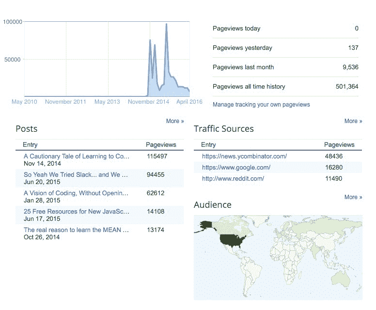
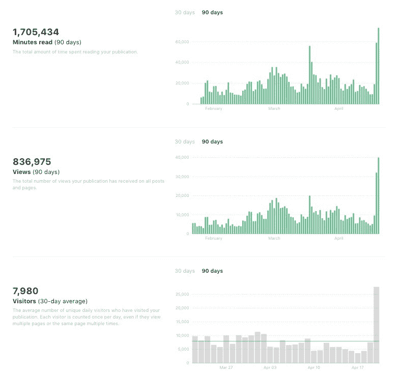

# 我们刚刚放弃了我们的博客。你也许也应该。

> 原文：<https://www.freecodecamp.org/news/we-just-abandoned-our-blog-for-medium-you-probably-should-too-33e742a1d49/>

我们的博客帮助我们的开源社区达到了早期的临界质量。

在我们发布博客的 18 个月里，它已经被浏览了 50 万次。

然而，昨天关闭它是一个简单的决定。

以下是最终统计数据:

我们的博客文章遵循幂定律，一半的读者只关注我们最终发表的 30 篇文章中的 3 篇。

这些文章“被重新编辑”，也登上了黑客新闻的头条:

*   我对新开发人员的建议:[学习编写自己的代码的警示故事。](https://medium.freecodecamp.com/a-cautionary-tale-of-learning-to-code-my-own-eddb24d9d5a7)
*   一个露营者对他如何盲编码的解释:[一个看不见的编码视觉](https://medium.freecodecamp.com/looking-back-to-what-started-it-all-731ef5424aec)
*   当然，那一次我们达到了 Slack 的未记录的组织规模限制，一切都失控了:[所以我们尝试了 Slack…我们对此深感遗憾](https://medium.freecodecamp.com/so-yeah-we-tried-slack-and-we-deeply-regretted-it-391bcc714c81#.jjygvufdl)

如果你点击了这些文章中的任何一篇，你可能会注意到它们现在是中型文章。我们在 Medium 上重新发布了我们的每一篇博文，然后我们进入 NGINX 并创建了 301 重定向，这样剩余的 Google 流量将被重定向到 Medium 而不是我们的博客。

这花了几个小时的工作，我们可能在这个过程中牺牲了一些搜索引擎优化果汁，但我相信这是值得的。

这些统计数据应该会告诉你为什么:

在过去的 90 天里，我们在 Medium 上的浏览量远远超过了 18 个月来我们在博客上的浏览量。这还没有引起黑客新闻或 Reddit 的极大兴趣。

这是为什么呢？

#### 1.除非人们真的在乎，否则你的博客文章将一事无成。

让人们真正去你的博客并阅读你的文章是一项艰巨的工作。你必须在 Twitter、脸书和 LinkedIn 上分享你的帖子，希望有人会注意到你的帖子，足够在意去阅读它，然后足够在意去分享它。

十大小猫 gif 列表实际上分享了它们自己。但是关于编程的文章？没有那么多。

如果你幸运的话，会有人愿意在 Reddit 或 Hacker News 上分享你的文章。也许其他一些人会在你的文章滑下“新”页面并被遗忘之前，给它投票。

客观地说，黑客新闻每小时都会收到数百份新的投稿。其中只有 9 个会登上头版。

#### 2.人家没时间看你的博文。他们忙于阅读媒体。

像 Medium、[Quora](https://www.quora.com/profile/Quincy-Larson)——在某种程度上还有[LinkedIn Pulse](https://www.linkedin.com/pulse/we-just-launched-survey-people-learning-program-its-already-larson?trk=prof-post)——这样的平台为成功写作提供了一个最重要的因素:读者。

数百万人已经积极地去这些地方，想着“我想读点什么。”

虽然确实有数十亿人在谷歌上搜索他们想要阅读的特定内容，但你的博客不太可能出现在那里，因为最近只是谷歌搜索结果中的一个小因素。

有了内容平台，新文章比旧文章更有可能出现在给定的读者群中。所以在你发表文章后，你几乎可以保证在最初的几个小时里会有一些读者。大多数博客都不能这么说。

这种早期读者群是一个机会，人们不仅可以在社交媒体和 Reddit 等地方分享你的文章，吸引其他读者，还可以在平台内“推荐”你的文章，进一步增加平台算法向其展示你的文章的人数。

这是一个良性循环。它会以仅仅“被降级”所不能的方式爆发。见证我的朋友 [Kristyna 的中帖](https://medium.com/maqtoob-blog/the-37-best-websites-to-learn-something-new-895e2cb0cad4#.q10um7tj4)，有超过 32000 人推荐。

#### Medium 使社区更容易创作和分发文章

有几十种合理的博客工具可供选择:Wordpress、Ghost、Octopress——甚至 Blogger。但是没有一个像 Medium 一样，可以很容易地将你朋友的文章和你自己的文章一起发表。

在我们的旧博客上，我最终自己写了绝大部分的文章。这并不是因为缺乏尝试——很难让我们社区中最敬业的成员研究有趣的文章，然后登录我们的系统并撰写它们。

有了媒体，任何人都可以主动写一篇文章，然后提交给我们的媒体出版物。经过一些简单的编辑，我可以将他们的文章联合发布给成千上万关注自由代码营出版物的人。毫无疑问，*他们*写了这篇文章，在文章的底部，有一个按钮，读者可以点击关注*他们*。

我们也能够扩大其他开源项目的读者群，比如 [OhMyZSH](https://medium.freecodecamp.com/d-oh-my-zsh-af99ca54212c) 。

媒体出版物可以很容易地“激励”来自其他项目和社区的人，帮助他们更快地获得他们需要的早期追随者，成为他们所在领域的广泛阅读的思想领袖。

2016 年到目前为止，我们的开源社区已经能够每天发布大约一篇文章。这些文章中只有一小部分是我写的。这在很大程度上要归功于媒体出版物的简单和透明。

#### 表达的媒介

移动到中等是相当安全的。您可以将中型出版物子域化到您自己的域中。如果你改变主意，你也可以很容易地将你的文章导出到媒体之外。

Medium 还是比较新的，流量在稳步增长。该平台本身正在大力开发，并不断改进。

Medium 正在迅速巩固自己的地位，成为“人们每天都会访问的网站之一”——以至于各大报纸和杂志现在都在专门为 Medium 撰写文章，奥巴马总统甚至在这里发表他的演讲。

我们的开源社区也在成长。我们的出版物每天有大约 200 名新的关注者，而且——由于有这么多的读者——几乎我们发布的所有内容都有至少 1000 次浏览。

我们计划让我们的出版物专注于设计、开发、数据和开源。如果你正在写关于这些主题的文章，并且对接触更广泛的读者感兴趣，给我发一个你的文章的链接，我们可以考虑联合它。

我只写编程和技术。如果你在推特上关注我，我不会浪费你的时间。？