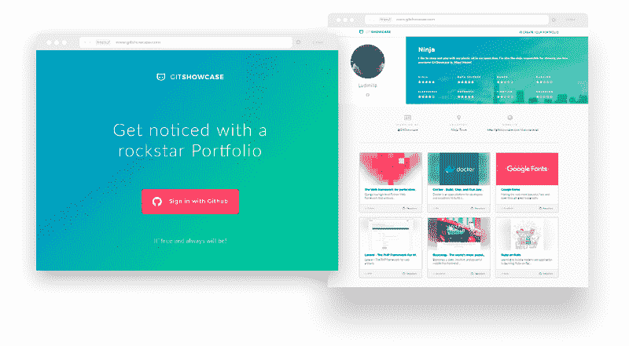
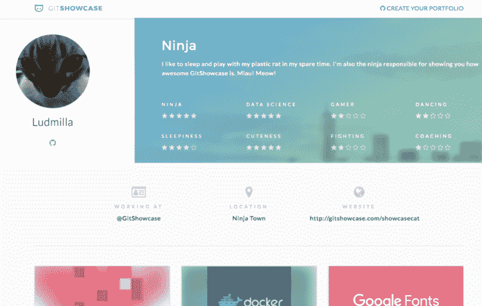
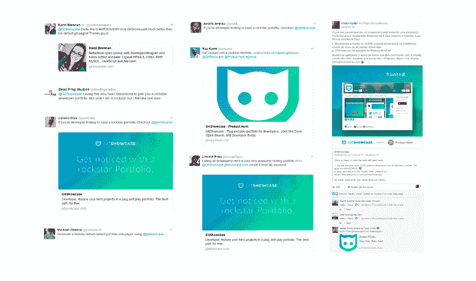
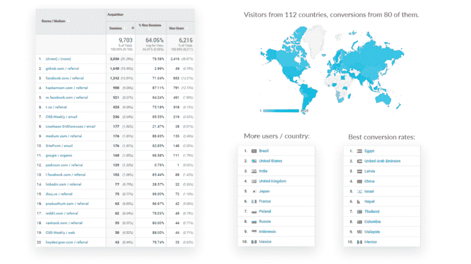
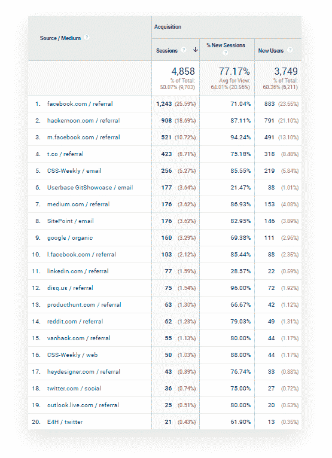
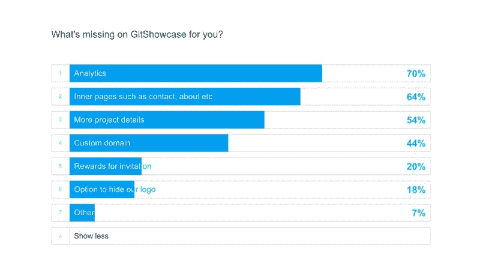

# 我们刚刚推出了一款开源产品。那么接下来会发生什么？

> 原文：<https://www.freecodecamp.org/news/we-launched-an-open-source-product-what-happens-now-e586b6d8b99c/>

作者维克多·f·桑托斯

# 我们刚刚推出了一款开源产品。那么接下来会发生什么？

上个月，我和忍者之神佩德罗推出了 T2 git showcase T3，这是一款面向开发者的即插即用产品。开源且免费。

产品做什么很简单。它获取 GitHub 用户信息和项目来制作一个单页布局，[就像这个](https://www.gitshowcase.com/showcasecat)。

Meet Ludmilla, the awesome showcase cat.

在这篇文章中，我将谈论我们如何在一个月内展示了来自 80 个不同国家的 25，000 多个项目，以及我们如何从中赚钱。我们希望它能对产品人员和爱好者有所帮助。我们去开源吧！:)

### 我们为什么制作 GitShowcase

开发人员是了不起的工匠。没有人会不同意。但在申请新工作时，他们中的大多数人都很难找到一种好的方式来展示自己的工作。通常他们会寻找预制模板或定制 CMS(内容管理系统)工具来开发他们的个人网站。

我们让开发者在匆忙中变得简单。没有硬注册，没有表格填写，没有代码。只需一个用 GitHub 账户登录的按钮。一键登录后，所有相关信息和项目都显示在一个简单的、可定制的单页布局中。

我负责设计，佩德罗负责工程。具有讽刺意味的是，GitShowcase 本来只是放在我们投资组合中的一个附带项目，仅此而已，但是社区把我们推向了另一条路…

### 社区拥抱

我们在脸书的一些巴西开发团队中发布了 GitShowcase 来收集反馈。我们被许多优秀的人所淹没，他们参与到帖子中，并向朋友们推荐。

在短短几个小时内，我们已经有超过 4000 个项目在平台上展示。最令人惊讶的是，他们中的许多人不是来自巴西。

### 我们的增长战略

我们被这些数字吓到了。我们怎样才能保持这样的增长率呢？我们没有制作广告的预算，也没有除了有机推广以外的任何方式来推广网站。

我们将工作重点放在三大支柱上，以观察其表现如何:

1.  社交媒体──让世界看到我们的来源。我们继续通过脸书、LinkedIn 在其他小组上发布 GitShowcase，并在 Twitter 上联系技术影响者来测试 GitShowcase。我们也把分享按钮放在页面上更容易看到和操作。
2.  内容营销【T1──佩德罗喜欢写科技生活。所以他开始写关于 GitShowcase 的文章，比如我们的技术栈、流程、运输等等。，并发布在 [Hackernoon](http://hackernoon.com/) 和其他博客上。如果你对航运应用感兴趣，可以看看他的[媒体](http://medium.com/@pedsmoreira/)。
3.  **SEO**──这是一个更长尾的策略。我们考虑了我们希望排名靠前的关键词:“开发者组合”、“github 组合”、“开发者网站”，这样用户就可以通过谷歌搜索有机地找到我们。对于个人资料，我们准备了动态关键字:“gitshowcase +用户名”、“开发者组合+用户名”，以获得链接到我们网站的特定用户搜索。我们还在著名博客帖子的评论下传播 GitShowcase 链接，以致力于我们的链接建设(并让一些好奇的滚动读者也来见我们)。

### 那么，这个策略表现如何呢？

上述数据代表:

*   左侧:**每个源的会话数**。我们将确定哪些举措为网站带来了更多的访问者。
*   右边:**各国交通信息图**。我们将看到来自不同国家的人们如何访问该网站，有多少人注册，注册人数最多的前 10 个国家是什么，转化率最高的前 10 个国家是什么。

在深入研究之前，重要的是要说明“*(直接)/无*”和“【Github.com】/转介”这两个词都很容易误导数据。我们不会将它们包括在分析中，因为它甚至对我们来说也是令人困惑的，原因如下:

*   **(direct)/none**──这个来源应该代表在浏览器上直接输入 gitshowcase.com 并点击 go 的人，但谷歌分析一直有一个错误，因为跟踪失败而从其他来源获得流量。你可以在这里了解更多关于[的信息。](http://blog.analytics-toolkit.com/2015/google-analytics-direct-none-source/)
*   **Github.com/referral**─我们使用 GitHub API 对用户进行认证，所以它在发送回 GitShowcase 时会将信用作为流量来源。

我们现在将剔除误导性数据，以便您可以查看更精确的数据点。

### 这个看起来更好。

以下是三大支柱对流量产生的影响:

**社交媒体:** 2，429 次会话(50%流量)；

**内容营销:**1084 场(22.3%流量)；

**SEO:** 235 次会话(4.8%流量)。

### 哦，等等。那另外的 22.9%呢？

分别是我们的**邮件营销流量(3.6%)和** **下线(19.3%)** 。转介是其他网站与我们的链接。这是我们最初制定策略时没有考虑到的，其他人将 GitShowcase 链接到他们的页面和简讯中。

这确实让我们感到惊讶，因为我们出现在非常酷的网站上，比如[产品搜索](http://www.producthunt.com/posts/gitshowcase)。我们被一个叫拉兹的以色列好人追杀。谢了伙计。[在产品搜索上查看 GitShowcase。](http://www.producthunt.com/posts/gitshowcase)

我们现在关注的是推荐，它正在成为我们的第四大支柱——让其他网站谈论我们并支持我们。

正如我们所料，社交媒体将其视为推动流量的最佳来源。在这里，用户可以分享他们的个人资料，讨论这个工具，发微博，发表评论，其他人也可以和我们见面。

内容营销也很有表现力。人们关注高质量的内容，并用他们的时间来回报它。

SEO 仍然是一个婴儿，因为我们正在用搜索引擎建立我们的品牌意识和声誉。我们认为在接下来的 3 个月左右，它会变得更加有效。

### 好的，我们得到了一些来自世界各地的优秀人士的注册，一些网站也在谈论我们。现在，如何从中赚钱呢？

这就是我们此刻的处境。随着基数的增长，用户开始提出许多建议，并要求更多的功能。当我们结束全职工作回到家时，我们每天都在迭代产品。这有点让我们失眠。所以我们想:“这是不是，比方说，也许…让 GitShowcase 赚钱的正确选择？”

关于如何让 GitShowcase 成为免费增值产品，我们有一些想法。换句话说，人们可以免费使用基本计划，并通过付费计划获得一些独家功能。我们的基本计划将与今天一样——一个完整的自动化投资组合。付费计划也是一样的，还有一些额外的东西:

*   **一个自定义域**─【www.username.com】的而不是【https://www.gitshowcase.com/username】的[的](https://www.gitshowcase.com/username)
*   **访问高级模板**──针对不同焦点的手工模板。今天，我们只有一个模板，主要集中在项目上。
*   招聘区的好处──开发人员需要作品集主要是为了求职或被猎头，因此建立一个招聘区似乎是显而易见的。招聘人员将能够搜索我们的数据库，找到具有特定知识的开发人员，那些在付费计划中的人将比那些在基本计划中的人在结果中出现得更高。

### 调查时间

在花时间开发这些功能之前，我们对用户进行了一项调查，以了解这些想法是否会引起他们的兴趣。我们用 [Mailchimp](http://mailchimp.com/) 发送电子邮件，用 [Typeform](http://www.typeform.com/) 激活它。

### “今天少了什么？”

哇，分析和一般的内在内容？我们只是把这些选项放在那里以填补空间，但显然它们是大多数人想要的。

这就是为什么倾听用户很重要。我们非常偏向于我们认为的优先事项。

### “你会付钱吗？”

我必须承认，我们期待这里会有更多的热情，即使我们知道很难要求人们抽象并想象他们为他们还看不见或无法互动的东西付费。

嗯，也许没那么糟…对吧？*含着眼泪*

我曾经听说过，公司应该更多地倾听两端的极端用户——憎恨者和爱好者。这是你可以看到严重错误的地方，你可以看到你如何为人们的生活增加真正的价值。中立者不会费心告诉你太多，因为他们不恨也不爱你，所以它大多让你在同一个地方。有道理，我猜…

### “什么样的服务值得付费？”

这是调查的最后一个问题。它是开放的，比其他的更抽象，也不是必需的，所以许多人只是空白地通过它。29%的人说出了他们的想法。我将尝试把答案浓缩在三个角色上:

我可能已经注册了，但不要试图收费，如果我想，我可以开发我自己的投资组合，你们这些讨厌的资本家！！！！

中立:收取一些费用是可以的，但是象征性地每年支付 1 美元来使用 GitShowcase 怎么样？帮你买单是公平的。

情人方面:我喜欢定制域名的东西，愿意为此付钱。作品集真的很酷。但是伙计们，你们想过让我们更接近招聘人员吗？伙计，那会让我把 GitShowcase 的标志纹在腿上。

这比其他封闭式问题更能说明问题。我们不会在开发人员可以自己编码的微小细节上取得太大进展。自定义域名仍然是一件事，因为有些人希望他们的 GitShowcase 个人资料是他们的官方网站。

让我们真正想知道的是，我们计划在未来建立一个招聘区，但我们没有把它放在调查中，因为我们认为这是一个非常遥远的步骤。但是一些用户已经在期待这一天的到来。今天。他们着火了。

### 招聘人员对 GitShowcase 有兴趣吗？

我正在调查这件事。我向我网络中的一些高级技术招聘人员发送了几个问题，看看他们目前使用哪些工具，他们在接近候选人之前如何研究他们，以及他们是否有兴趣在一个地方根据特定的知识、地点和项目来寻找开发人员。

三个回答了。他们都对使用我们平台的前景给予了积极的反馈。

你认识技术招聘人员吗？请在评论中标记他/她。我们非常乐意依靠他们来帮助我们塑造 GitShowcase。

### 我们下一步要做什么？

好吧，看来我们现在有计划了。还有大量的作业。我们决定通过平衡相关性和实现的容易程度来区分任务的优先级。这就是我们在接下来的三个月里要研究的内容:

*   自定义域功能
*   丰富个人资料内容的模块化模板
*   人才招聘区

### 为什么我要告诉你我所有的计划？

我们拥抱开源文化。即使常识可能与此相反，我们相信透明能建立信任，而保密会排斥信任。人们不应该害怕分享知识和公开谈论他们的计划。

### 到目前为止，我们学到的经验是:

1.  开源就是爱。开源就是生命。
2.  人们不会窃取代码，因为它是公开的。事实上，人们帮助构建产品。[将我们的项目放在 GitHub 上，并帮助我们](https://github.com/gitshowcase/gitshowcase)。
3.  如果内容是相关的，并且发布在正确的地方，那么内容营销就表现得很好。
4.  如果你不确定什么，就问。不要试图伪造你的用户所依赖的任何东西。
5.  如果你的产品不能解决一个真正的问题，就没有什么策略可以拯救它。打造一个好的产品，并做一些营销来占领你的产品市场。

### 喜欢这篇文章吗？请在评论中标记开发人员或技术招聘人员来帮助我们:)

我们是一个两人乐队，零预算，努力让事情发生，所以所有的支持都是非常受欢迎的。您可以:

1.  **在评论里标记一个开发者**去见 [GitShowcase](http://www.gitshowcase.com/)
2.  **标记一个技术招聘人员**来看看我们在这里做什么。我们将很快在测试版上开放人才招募仪表板。
3.  **喜欢、评论并分享**这篇文章，帮助它接触更多像你一样有趣的人。

如果你还在读这篇文章，你是最棒的。谢谢你的时间。

在[脸书](http://www.facebook.com/gitshowcase/)、[推特](http://twitter.com/Gitshowcase)和 [GitHub](http://github.com/gitshowcase/gitshowcase) 上关注 GitShowcase。