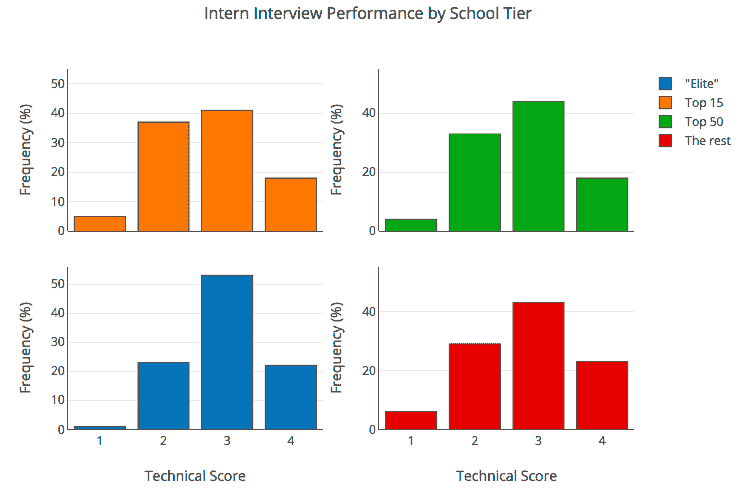
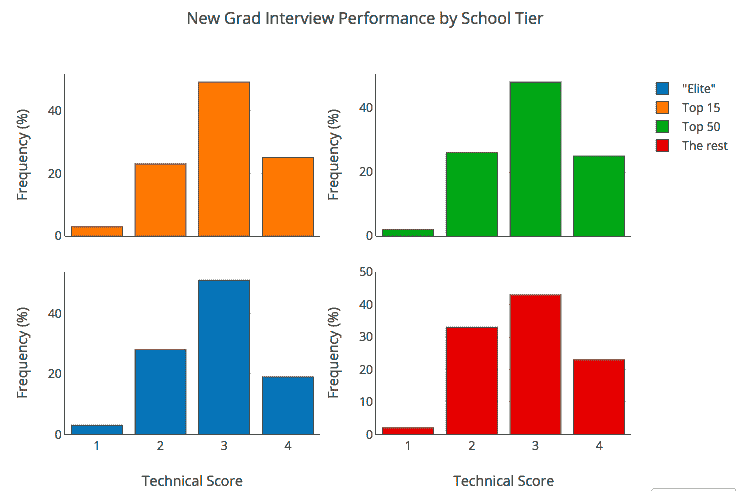
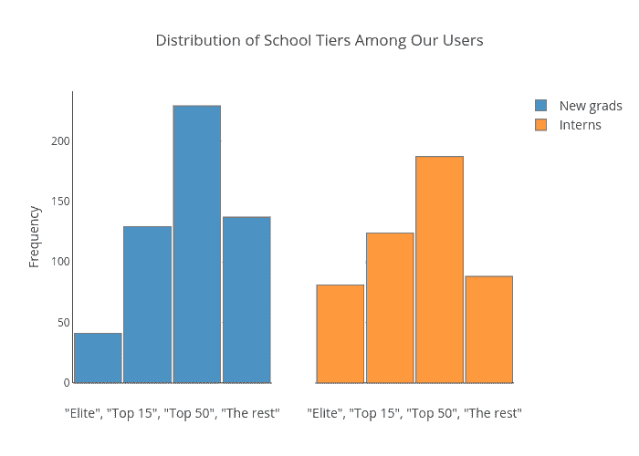

# 我们研究了学生在技术面试中的表现。他们在哪里上学并不重要。

> 原文：<https://www.freecodecamp.org/news/we-studied-1-000-students-performance-on-technical-interviews-f5d5209de785/>

山姆·乔丹

# 我们研究了学生在技术面试中的表现。他们在哪里上学并不重要。

Photo by [Faustin Tuyambaze](https://unsplash.com/photos/32jpXPNlmqY?utm_source=unsplash&utm_medium=referral&utm_content=creditCopyText) on [Unsplash](https://unsplash.com/search/photos/college?utm_source=unsplash&utm_medium=referral&utm_content=creditCopyText)

interviewing.io 是工程师匿名练习技术面试的平台。如果事情进展顺利，他们可以参与 Twitch、Lyft 等顶级公司的真实但匿名的面试。

今年早些时候，我们推出了一项专门针对大学生的服务。它旨在帮助人们在职业生涯的开始就有一个公平的竞争环境。

### 问题是

可悲的事实是:鉴于当今大学招聘的现状，如果你没有上过为数不多的顶尖学校，你在校园里与公司互动的机会就很渺茫。不公平，也很烂，但是大学招聘还是以招聘会为主。公司务实地选择每年参观同样的几所学校。尽管招聘会是最陈旧、最有偏见的招聘形式之一，但这种形式依然存在。这可能是因为似乎没有更好的方法来快速与学生建立大规模联系。

因此，尽管关于多样性的讨论越来越多，校园招聘仍在继续，公司也在做同样的事情，期望得到不同的结果。

在之前的一篇博文中，我们解释了[为什么公司应该停止追求来自相同五所学校的学生](http://blog.interviewing.io/if-you-care-about-diversity-you-should-stop-hiring-from-the-same-five-schools/)。

不管你认为这个想法有多重要(也许是出于利他主义的原因)，你可能仍然会怀疑扩大大学招生工作的价值和实用性。你可能承认，鉴于资源有限，参观顶级学校是合理的。社会通常愿意承认有非常合格的学生从非顶尖大学毕业，但他们坚持认为这种学生相对较少。

我们在这里用来自我们大学平台的一些漂亮的数据向你展示，这根本不是真的。

公平地说，这不是我们第一次研究你在哪里上学是否重要。在之前的一篇文章中，我们发现[参加 Udacity 和 Coursera 编程课程比你在哪里上学更重要](http://blog.interviewing.io/lessons-from-3000-technical-interviews/)。很久以前，我们的一位创始人发现你在哪里上学根本不重要——但是[你简历上的错别字和语法错误的数量很重要。](http://blog.alinelerner.com/lessons-from-a-years-worth-of-hiring-data/)

那么，这次有什么不同呢？最大的令人兴奋的不同是，这些先前的分析主要集中在已经工作了至少几年的工程师身上。这使得人们有可能辩称，几年的工作经验会消除因上过(或没上过)顶尖学校而产生的任何表现差异。

事实上，谷歌的优秀员工发现，虽然工作几年后 GPA 并不重要，但对大学生来说却很重要。所以，我们想正面面对这个问题，特别是在大学三年级和四年级学生还在上学的时候。更实际的是，我们想看看那些只在顶尖学校招聘人才的公司是否能招到更优秀的候选人。

在深入研究这些数字之前，先简要介绍一下我们的大学平台是如何运作的，以及我们收集了哪些类型的数据。

### 设置

对于想在 interviewing.io 上练习的学生来说，第一步是对[合格的](https://www.qualified.io/)进行简短的(~15 分钟)编码评估，以测试基本的编程能力。通过这项评估的学生(也就是那些准备好编码，而另一个人在他们的脖子上呼吸的学生)可以开始预约练习面试。

当采访者和受访者在我们的平台上匹配时，他们在一个协作编码环境中见面，有语音、文本聊天和白板，并直接进入技术问题。该平台上的面试问题往往属于你在电话面试后端软件工程职位时会遇到的那类问题。面试官通常来自谷歌、脸书、Dropbox、Airbnb 等顶级公司。

在每次面试后，面试官会从几个不同的方面给应聘者打分，包括技术能力。技术能力分为 1 到 4 级，其中 1 级是“差”，4 级是“惊人！”在我们的平台上，3 分或以上的分数通常意味着这个人有足够的技能前进。您可以在下面看到我们的反馈表:

在我们的平台上，我们有幸拥有来自全美 200 多所大学的数千名学生。我们认为这为大三学生(实习生)和大四学生(应届毕业生)提供了一个独特的机会来考察学校等级和面试表现之间的关系。

为了研究这种关系，我们首先根据《美国新闻与世界报道》的排名将学校分为以下四个等级:

*   “精英”学校(如麻省理工学院、斯坦福大学、卡内基梅隆大学、加州大学伯克利分校)
*   排名前 15 的学校(不包括顶级学校，如威斯康星大学、康奈尔大学、哥伦比亚大学)
*   前 50 名学校(不包括前 15 名，如俄亥俄州立大学、NYU 大学、亚利桑那州立大学)
*   其余的(如密歇根州立大学、范德比尔特大学、东北大学、加州大学圣巴巴拉分校)

然后，我们对面试分数和学校等级进行了一些统计显著性测试，看看学校等级对实习生(大学三年级学生)和新毕业生(大学四年级学生)是否都很重要。我们的样本包括大约 1000 名学生。

### 学校和面试表现有关系吗？

在下图中，您可以看到四个学校层级中每个层级的学生面试的技术分数分布(见图例)。正如你从上面回忆的那样，每个面试都是按照 1 到 4 的等级评分的，其中 1 是最差的，4 是最好的。

首先，大三学生:

然后，学长们:

非常令人吃惊的是，这些分布的形状，对于大三和大四学生来说，是非常相似的。事实上，统计显著性测试显示，任何层次的学生在面试中的表现都没有差异。

注意:当然，这取决于每个人首先完成 15 分钟的快速编码挑战，以确保他们为同步技术面试做好准备。我们对此感到兴奋，因为公司也可以在其流程中复制这一步骤！

这意味着顶尖学生和那些“无名学校”的学生取得了同样的成绩。因此，问题变成了:如果学生们在技能上不相上下，为什么公司花费惊人的金钱只吸引了他们中的一部分人？

### 好吧，那么公司缺少什么？

除了错过了优秀的、更便宜的未来雇员，公司还错过了一个节省时间和金钱的机会。现在，在大学招生上花费了大量的金钱。我们之前提到过麻省理工学院招聘会的门票价格为 [$18k。在劳伦·里韦拉通过《哈佛商业评论》在 T2 做的一项研究中，她透露一家公司仅在一个校园里的社会招聘活动就预算了近 100 万美元。](http://blog.interviewing.io/if-you-care-about-diversity-you-should-stop-hiring-from-the-same-five-schools/)

这些活动的更高价格也意味着较小的公司或初创公司试图与高调、高利润的科技巨头竞争更没有意义。大多数备受追捧的顶级学校已经有足够多的招聘人员争夺他们的学生。不知不觉中，这种追求似乎与大多数公司对高度多元化和长期可持续增长的渴望背道而驰。

即使公司确实认为人才在各个学校中分布均匀，公司仍有理由在顶级学校招聘。还有其他因素有助于提升某些学校在招聘人员心目中的地位。存在长期的公司-学校关系(例如，目前在该公司工作的校友人数)。还有信号效应——公司声称他们的工程团队由一群前斯坦福大学、前麻省理工学院等等的学生组成，从而获得硅谷加分。

### 简单说说选择偏差

自从这篇文章出现在《黑客新闻》上，就有一些关于 interviewing.io 上的学生群体如何不能代表大多数人的大声而合理的讨论。事实上，我们确实有一批决定练习面试的学生。

当然，我们发表的所有博客文章都会受到这种(非常有效的)批评，尤其是这篇文章。

因此，我们的用户群中的选择偏差可能意味着 1)我们只从顶级学校获得最差的学生(因为，大概，最好的不需要这种做法)，或者 2)我们只从非顶级学校获得最好/最有动力的学生——或者两者都有。

这些结果的任何子集都是完全可能的，但我们没有什么理由相信我们在这里发表的内容可能是真实的。

首先，根据我们的经验，无论他们的背景或血统如何，每个人都害怕技术面试。例证:在我们开始开发 interviewing.io 之前，我们还没有真正的产品。因此，在投入大量时间和精力进行这项有问题的工作之前，我们想测试一下面试练习是否是工程师们真正想要的——更重要的是，这些想要练习的工程师是谁。

所以，我们在黑客新闻上放了一个非常普通的登陆页面……第一天就有大约 7000 人注册。在这 7000 名注册者中，大约 25%是来自谷歌和脸书等公司的高级工程师(4 年以上的工作经验)。现在，这并不是说他们一定是最好的工程师，但它确实表明市场似乎最需要我们服务的工程师。

另一个数据点来自我们的创始人之一。每年，Aline 都会为麻省理工学院的技术交流课程做一个关于求职准备的客座演讲。这门课程是满足计算机科学专业通信要求的一种方式，因此注册人数往往涵盖所有计算机科学专业的学生。每次讲座前，她都会发出一份调查，询问学生在准备求职时最大的痛点是什么。每年，对技术面试的恐惧都排在第二位。

虽然这并没有直接解决我们是否只得到“最坏中的最好还是最好中的最坏”的问题(我希望上面的内容已经让你相信还有更多)，这里是我们的用户中学校等级的分布。我希望这也反映了公司在学生申请人中看到的分布类型:

### 那么企业能做些什么呢？

公司可能永远不会完全停止在顶级学校招聘。但在寻找未来员工时，他们至少应该把这个小圈子之外的学校包括进来。

数据的最终结果是一样的:对于优秀的工程师来说，他们上过的学校的意义比我们想象的要小很多。公司花在同一所精选的几所学校内争夺候选人的时间和金钱，不如花在创造包容所有人的机会上。他们也可以开发工具来更公平有效地审查学生。

正如你在上面看到的，我们使用了 15 分钟的编码评估来筛选我们的入境学生流，仅仅一个简短的挑战就让来自各行各业的学生之间的竞争变得公平。至少，我们建议雇主在他们的流程中做同样的事情。但是，当然，如果我们不提出另一件事，那就是失职了。

在 interviewing.io，我们自豪地建立了一个平台，让表现最好的学生有机会接触顶级雇主，无论他们在哪里上学，来自哪里。尤其是我们的大学项目，让我们能够授予公司特权，以同样的成本，在顶级目标学校参加一两次招聘会，就能接触到数量成倍增长的学生。

想要多样化的，没有追逐的顶尖人才？在我们的大学平台上注册成为雇主吧！