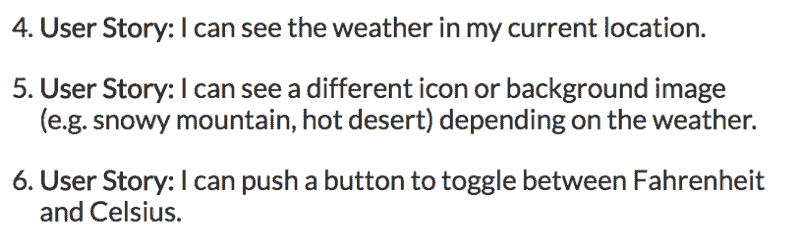
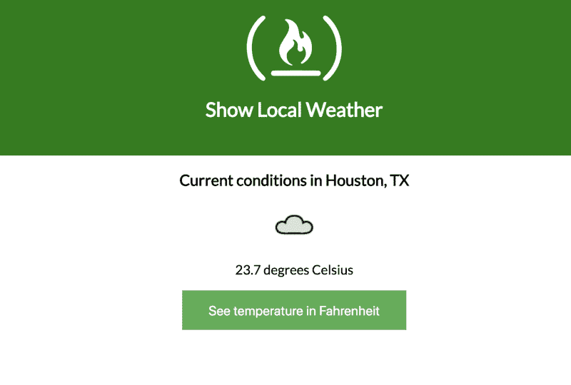

# 我如何使用 React 和 Typescript 在 freeCodeCamp 中构建天气应用程序

> 原文：<https://www.freecodecamp.org/news/weather-in-react-and-typescript-4f774fc07be7/>

开尔文·麦

# 我如何使用 React 和 Typescript 在 freeCodeCamp 中构建天气应用程序


React and Typescript

所以我最终决定回到 [freeCodeCamp](https://www.freecodecamp.org) 并尝试完成我的前端开发证书。我在去年早些时候已经完成了所有的算法和教程，唯一缺少的是项目。

但是现在我作为一个全栈开发人员有了更多的经验，大多数项目对我目前的水平来说都有点容易。所以我有两个选择。我可以回到基础，在一天之内完成，或者我可以一石二鸟:在做这些项目的时候，找点乐子，尝试一下技术。我选择了后者。


So Close…

但是让我们把它变成三只鸟吧——因为我一直想写一个教程/指南。今天，我们要解决的是[展示当地天气](https://www.freecodecamp.org/challenges/show-the-local-weather)项目。但这一次，它将结合 React 和 Typescript！你可以看看这个 [GitHub repo](https://github.com/kelvin-mai/tsx-weather) 里的成品代码，还有这里的现场演示[。](https://kelvin-mai.github.io/tsx-weather/)

### **背景**

首先，我为什么要这么做？事情是这样的:我一直在用 Angular 5 来回跳跃，现在已经有一段时间了。我更喜欢将 React 作为一个框架。它小巧而简洁，但是拥有创建一个全功能单页面应用程序所需的所有特性。至于 Angular，它对我来说太大了，我无法用这么小的应用程序来欣赏…但它使用了 Typescript！

TypeScript 是一个超级 JavaScript 集，它增加了许多 JavaScript 所没有的特性，甚至包括 ES6/7 的增强功能。它最出名的是它的静态类型。所以我想知道我是否能两全其美。答案是一个响亮的是！不包括 Redux。(我的意思是你*可以*包含 Redux，但是到目前为止设置起来很痛苦，所以我不会在本指南中这样做。)



The User Stories

对于这个项目，我们将关注最少的用户故事，因为我关注的是技术而不是任何额外的功能。因此，我们将为这个应用程序使用的 API 将是 [Wunderround](https://www.wunderground.com/weather/api/) 。它非常适合我们正在建造的东西，因为它们提供了华氏和摄氏温度，还提供了不同天气条件的图标。这意味着我们这边的程序性工作减少了。

### 步骤 0:设置

我将在这个项目中使用`create-react-app`，为 Typescript 定制 React 脚本，这样我们可以保持零配置和易用性。一篇关于用 TypeScript 设置 React 应用程序的好文章是由[特雷·赫芬尼](https://levelup.gitconnected.com/@treyhuffine)写的，可以在[这里](https://levelup.gitconnected.com/typescript-and-react-using-create-react-app-a-step-by-step-guide-to-setting-up-your-first-app-6deda70843a4)找到。

我绝对建议看看那个帖子，做一些更深入的设置。但是事不宜迟，我们将在终端中运行下面一行。

```
create-react-app weather --scripts-version=react-scripts-tsnpm install --save core-decorators
```

我一会儿去找装修工人。只要知道这是一个整洁的小功能，我真的很兴奋尝试。但是为了能够使用它，我们必须编辑我们的`tsconfig.json`文件来包含实验性的装饰器。为此，只需添加粗体代码行。

```
{   "compilerOptions": {// ...code hidden...    "noUnusedLocals": true,    "experimentalDecorators": true   } // ...more code hidden...}
```

由于我的开发环境中安装了[更漂亮的](https://github.com/prettier/prettier-vscode)，我不得不更改我的`tslint.json`文件，因为 lint 与格式化程序冲突。如果您有一个类似的开发设置，我建议删除所有的 tslint 规则，这样您就不必在配置上陷入困境。完成后，文件应该是这样的。

我将使用的文件夹结构如下所示。您可以相应地创建、删除和移动文件。

```
weather-app/├─ .gitignore├─ node_modules/├─ public/├─ src/   └─ assets/     | - - loader.svg     | - - logo.svg   └─ components/     | - - Weather.tsx     | - - WeatherDisplay.tsx  └─ styles/     | - - App.css     | - - WeatherDisplay.css  | — — index.tsx   | — — registerServiceWorker.ts  | — — App.tsx  | — — index.css   | - - config.ts   | - - types.ts├─ package.json├─ tsconfig.json├─ tsconfig.test.json└─ tslint.json
```

好了，最糟糕的已经过去了！我们终于设置好了我们的应用程序。让我们深入研究代码。

### 第一步:造型

我想先解决造型问题。我不是一个很好的设计师，所以我所做的只是重新设计默认风格来拥有 freeCodeCamp 绿色主题。此外，我使按钮更像按钮，当然，更绿色。如果你碰巧是一个 CSS 大师，你可以尽情发挥。你也可以在这里下载图像文件[，并将它们放在你的`assets/`文件夹中。](https://github.com/kelvin-mai/tsx-weather/tree/master/src/assets)

### 第二步:好吧，我撒谎了…更多的设置

但是别担心，这次是真正的代码。首先让我们从简单的部分开始:添加 API 和 API 键。这里没有什么新东西——到目前为止，它看起来和普通的 JavaScript 完全一样。

现在对于 TypeScript 特定的东西，我们必须指定类型。嗯，我们不需要，但我们绝对应该。静态类型背后的原因是它给了我们安全性。不像普通的 JavaScript，如果类型不对，我们的代码就不会运行。本质上，这意味着编译器不会让我们写出糟糕的代码。

如你所见，这并不可怕。只需在冒号后添加类型。基本类型(字符串、数字、布尔)在一开始就受到支持。对于对象，创建一个特定于该特定对象的新类型是个好主意，如`WeatherData`和`DisplayLocation`所示。

现在，我有点懒，因为来自我们 API 的数据的形状要大得多，我可以创建整个对象。但是我选择只取我需要的，而丢弃其余的，这就是这个`types.ts`文件如此之小的原因。

### 第三步:反应——有趣的部分

我将跳过`[index.tsx](https://github.com/kelvin-mai/tsx-weather/blob/master/src/index.tsx)`和`[App.tsx](https://github.com/kelvin-mai/tsx-weather/blob/master/src/components/App.tsx)`文件，因为那里真的没有什么新东西。只需知道导入是不同的，因为 TypeScript 对模块有多严格。相反，我们将首先讨论表象部分。

我仍然喜欢从 React 中析构`Component`和`Fragment`，而不是调用`React.Component`，因为这样可以减少冗余。对于片段，如果你以前从未玩过，它基本上是一个不会在 HTML 标记中显示的 div。

您还会注意到，我在顶部添加了接口。接口指定了我们的道具和状态应该是什么样子。如果你还没有注意到，TypeScript 的花招是给所有东西添加类型，这就是上面在尖括号`<Props, Sta` te >内发生的事情。如果你熟悉道具类型，它做同样的事情，但我觉得这个更干净。

接下来是奇怪的`@`符号。嗯，那是个装修工！我原本想连接 Redux 和 connect，这样我就可以展示一个更复杂的版本，但是现在用`autobind`就可以了。

装饰器基本上是一个包装类并应用必要属性的函数。它还允许我们在顶部使用`export default`，这只是我的个人偏好。

```
@decorateexport default Class {}
```

```
// is the same as
```

```
export default decorate(Class)
```

在这种情况下，autobind 将自动将`this`绑定到所有东西，因此我们不必担心绑定问题。这些类方法来自更加面向对象的语言，看起来比 JavaScript 的箭头函数更简洁。

```
classMethod = () => {   console.log('when you use arrows, you don't have to worry about   the keyword "this"');}
```

```
classMethod () {   console.log('because of javascript, you have to   worry about the keyword "this" here');}
```

现在，我们终于进入了逻辑的主体，它将存在于`Weather.tsx`组件中。

您首先会注意到的是界面中的`?`。我提到过我们肯定应该为我们的道具定义类型，但是当你确定它直到 API 调用之后才会被定义时会发生什么呢？我们可以用问号定义可选类型。

后台发生的事情是，变量`weatherData`只允许是`WeatherData`类型或者未定义。此外，请记住，我们的`WeatherData`类型只是神童提供的一小部分。前面我提到过，我们将只从 API 中获取我们需要的数据——嗯，这就是第 55 行上的巨大析构正在做的事情。

我提到过你可以指定函数的期望收益类型吗？这就是这里发生在`getCurrentPosition`上的事情，因为我想确保它返回一个承诺。

这里的理由是，我不想调用`getCurrentWeather`，直到我们有了正确的地理位置，这意味着我们正在处理异步事件。异步总是意味着承诺，所以这就是将要发生的事情。

一个警告:本机地理定位 API 在没有传递任何选项的情况下确实需要很长时间才能得到结果。我选择不添加选项，因为它当时给我错误。

我相信这是因为 TypeScript 而在这个应用程序中发生的所有新事物。其他的都应该是熟悉的，如果你知道 React。但是希望您能看到这个超集的好处，因为它不仅为我们的代码增加了安全性，还提供了一些很好的超级功能。

### 第四步:完成！



The Finished Product

你做到了！你完成了一个显示你当前位置天气的应用程序。在这样做的过程中，您已经覆盖了大量的 TypeScript，并将其合并到 React 中。

当然，在这方面肯定可以有所改进，比如搜索和显示其他位置的选项。而且用户界面肯定是可以改进的。但是，如果你还没有完成 freeCodeCamp 上的天气应用程序，你已经完成了这项任务。