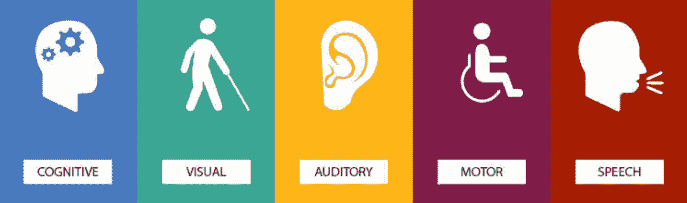
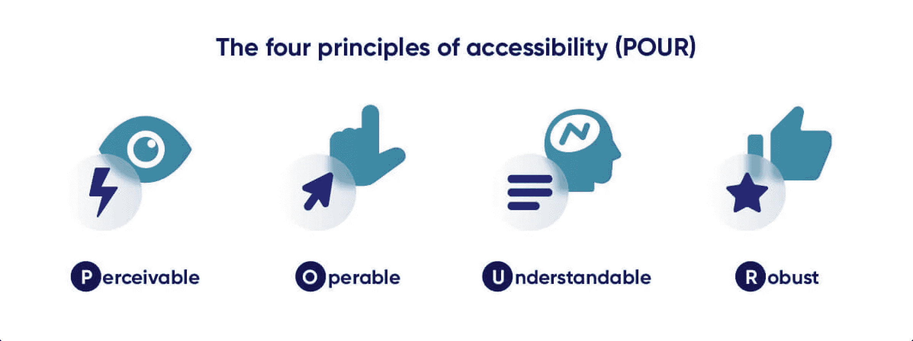
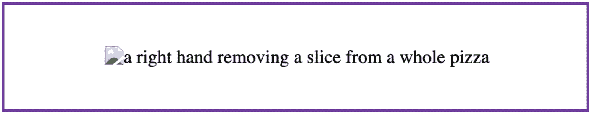
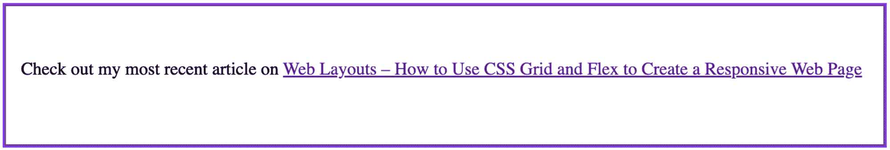
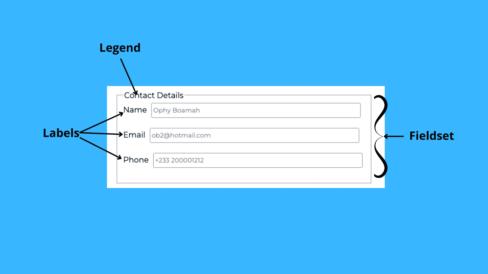
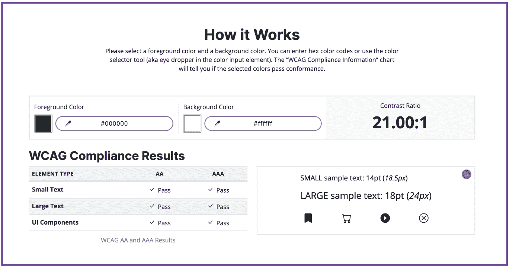

# 网页可访问性——开发者的最佳实践和清单

> 原文：<https://www.freecodecamp.org/news/web-accessibility-best-practices-and-checklist/>

世界卫生组织[报告](https://www.who.int/teams/noncommunicable-diseases/sensory-functions-disability-and-rehabilitation/world-report-on-disability)称，大约**15 %( 12 亿)**的世界人口患有某种形式的残疾。

这意味着，作为开发者，我们对网站和应用程序无障碍化的关注有助于更多的人使用这些资源。

在本文中，我将指出 web 可访问性的障碍，讨论 Web 内容可访问性指南(WCAG)，并分享一个所有开发人员在构建他们的网站和应用程序时都可以使用的基本清单。

> 网络的力量在于它的普遍性。无论是否残疾，每个人都可以访问是一个重要方面。–蒂姆·伯纳斯·李，W3C 主管和万维网的发明者。



Image credit: [Interactive Schools](https://blog.interactiveschools.com/)

## 什么是网页可访问性？

当一个人面临某种状况——永久的或暂时的——使他们难以或不可能完成预期的任务时，他们就被称为残疾。

实际上，网页可访问性包括消除所有阻碍任何用户平等访问网页的障碍。

## 无障碍的障碍是什么？

无障碍的障碍包括**视觉、听觉、认知**和**运动**。

视觉障碍使人们难以观看图像、视频和 gif。这些情况可能包括视力低下、色盲，甚至完全失明。

听觉障碍使得人们很难或不可能消费音频内容。

那些难以集中注意力、学习或记忆新事物的人面临着认知障碍。

身体某个部位部分或全部丧失功能的人，很难使用鼠标之类的设备浏览网站，他们会出现运动障碍。

为了解决网络或数字可访问性的这些障碍，万维网联盟(W3C)的网络可访问性倡议(WAI)创建了**网络内容可访问性指南** (WCAG)。

## 什么是网页内容可访问性指南？

它们是全球公认的标准，指导开发者和组织建立一个可访问的网络。



Image credit: [Site Improve](https://www.siteimprove.com/)

残疾人在网络无障碍方面面临的大部分障碍可以分为四类。WCAG 处理每一类问题，以确保实现无障碍。

**可感知:**要求用户能够用感官识别内容和界面元素。大多数用户主要依靠视觉感官，而其他人则依靠声音。

**可操作:**要求用户能够自己使用控件、按钮、导航等交互元素。它考虑到残疾用户将使用语音识别、键盘、屏幕阅读器等辅助技术。

**可理解:**它要求用户能够理解内容，学习并记住如何使用你的网站。该网站应该有一个一致的格式，可预测的设计和使用模式，以及适当的基调。

**健壮:**它要求不同能力和条件的用户能够使用他们选择的技术或设备可靠地解释内容并与之交互。

## 网页可访问性清单

作为开发人员，在构建网站或应用程序时，为了确保不同能力的人能够平等地访问它们，这些是需要注意的一些事情。

### 如何使图像具有可访问性

所有的图片应该有描述性的句子一样的替代文本，而不仅仅是一个单词或从句。例如，下图应该有一个 alt 文本，如下面的代码所示。


Photo by [Hybrid Storytellers](https://unsplash.com/@hybridstorytellers?utm_source=unsplash&utm_medium=referral&utm_content=creditCopyText) on [Unsplash](https://unsplash.com/t/food-drink?utm_source=unsplash&utm_medium=referral&utm_content=creditCopyText)

```

```

Image Alt text Code sample

上面的代码显示了图片的类似句子的描述性可选文本。alt 文本的目标应该是以这样一种方式来描述图像，即使用屏幕阅读器的人感觉他们可以形象化或想象出所描述的图像。



Image Alt text output

如上图所示，下一级的可访问性是编写 alt 文本，以便可能遇到连接问题的用户在看到图像之前对其有所了解。

### 如何使链接可访问

链接应该是描述性的和提示性的，你应该给所有的链接都贴上标签，标明它们到底是做什么的。

避免在含糊的文本中嵌入链接，比如“这里”。例如，为了依赖屏幕阅读器的用户，如果我们想参考我最近的一篇文章，应该这样做。

```
<p>
Check out my most recent article on <a href="https://www.freecodecamp.org/news/web-layouts-use-css-grid-and-flex-to-create-responsive-webpages/">Web Layouts – How to Use CSS Grid and Flex to Create a Responsive Web Page</a>
</p>
```

Accessible HTML Link code sample

在上面的代码中，链接标签被包裹在文章的整个标题周围，而不是简单地让链接文本变成一个模糊的“这里”。这样，每个看到、读到或听到它的人都确切地知道当链接被点击时会找到什么资源。



Link output image

当屏幕阅读器看到一个像上图这样描述性的链接时，视觉障碍用户很容易知道这个链接是做什么的，并决定是否访问它。

### **如何使表单可访问**

创建 web 表单时，您应该考虑视觉或运动受限的用户。让不能使用鼠标的用户可以通过键盘轻松浏览表单，让依赖屏幕阅读器的用户知道每次输入所需的确切信息。

通过使用`<label>`或`aria-label`向屏幕阅读器传达输入的目的或它需要什么信息，确保你的表单是可访问的。

`<fieldset>`标签告诉表单输入组属于一起，而`<legend>`标签作为输入组的标签。当处理涉及复选框或单选按钮的问题时，这些变得尤其必要。

```
<fieldset class="first-section">
      <legend>Contact Details</legend>
      <label for="name">Name</label>
      <input type="text" id="name" name="name" autofocus placeholder="Ophy Boamah" autocomplete="on" required> <br><br>
      <label for="email">Email</label>
      <input type="email" id="email" placeholder="ob2@hotmail.com"> <br><br>
      <label for="tel">Phone</label>
      <input type="tel" id="tel" placeholder="+233 200001212"> <br><br>
</fieldset>
```

Accessible form code sample

在上面的代码中，我实现了我提到的所有表单最佳实践。fieldset 标记创建一个初始的“第一部分”组。legend 标记包含为元素组提供描述的文本。最后，label 标签标识每个输入及其用途。



Accessible form output

上面的图像是代码的输出。要了解更多关于创建现代的和可访问的表单，请查看我以前的文章[如何用 HTML5](https://www.freecodecamp.org/news/create-and-validate-modern-web-forms-html5/) 创建和验证现代 Web 表单。

### 视频和音频可访问性

所有视频都应该有字幕和说明。同样，所有的音频都应该有文字记录，这样有听力障碍的人仍然可以跟随和理解。

```
 <video id="video" controls preload="metadata">
     <source src="assets/samplevideo.mp4" type="video/mp4" />
     <track
     label="English"
     kind="subtitles"
     srclang="en"
     src="assets/samplevideo-en.srt"
     default />
 </video>
```

HTML Video with subtitle

上面的代码显示了一个视频元素，该元素引入了用于添加字幕的 track 标签，以便听不到伴随音频的用户可以跟着读。

[https://player.vimeo.com/video/776769878?h=67a568dc31&app_id=122963](https://player.vimeo.com/video/776769878?h=67a568dc31&app_id=122963)

Video with subtitles

### 如何为无障碍环境选择颜色

为你的网站选择颜色时，考虑色盲和视力有问题的人。

当我们使用对比度差的颜色时，用户很难阅读或浏览网页上的内容。这意味着我们必须始终确保，即使在恶劣的照明条件下，我们的前景和背景颜色之间有足够的对比度，用于按钮、链接、图像、图标、文本等等。

如果你不确定两种颜色是否容易互补，使用这个[在线颜色检查工具](https://accessibleweb.com/color-contrast-checker/)进行检查。



Use a color checker tool to check color contrast

您还可以将这个[Web Accessibility Checker Chrome 扩展](https://chrome.google.com/webstore/detail/accessible-web-helper/gdnpkbipbholkoaggmlblpbmgemddbgb)添加到您的浏览器中，以进行现场可访问性检查。

### 如何使过渡和动画具有可访问性

节省使用过渡和动画，只有在非常必要的时候才使用，以免触发某些用户。

有些人在遇到快速移动的元素时会头晕或癫痫发作。通过使这些控件可用，为这些用户提供暂停、隐藏或停止动画的方法。

### 如何创建可访问的页面结构和导航

使用适当的 HTML 标签从语义上构建网站。你的网站应该易于导航，尤其是使用辅助技术。

页面标题应该是描述性的，这样用户可以很容易地区分标签。

```
<!DOCTYPE html>
<html lang="en">
<head>
  <meta charset="UTF-8" />
  <meta http-equiv="X-UA-Compatible" content="IE=edge" />
  <meta name="viewport" content="width=device-width, initial-scale=1.0" />
  <title>Web Accessibility Site | Checklist for Developers</title>
</head>
<body>
  <header>
  <nav>
    <ul>
      <li>Home</li>
      <li>About</li>
      <li>Contact</li>
    </ul>
  </nav>
  </header>
  <main>
    <section>
      <div>
        <h1>
          Welcome to Web Accessibility
        </h1>
        <p>
          This is semantic structuring with HTML tag
        </p>
      </div>
    </section>
  </main>
  <footer>
    <a href="https://codehemaa.com">My website</a>
  </footer>
</body>
</html>
```

HTML Semantic page structuring code

上面的代码显示了一个带有描述性标题的网页。我使用了正确的语义标签，通过区分页眉、正文和页脚来恰当地构建页面。

我还正确地标记了章节、div 和标题。这有助于屏幕记录器正确地拼写出页面上的元素和内容。

## 结论

如果 web 的发明者强调“*无论残疾与否，每个人的访问都是 web 的一个重要方面*，那么作为开发者，我们必须努力实现这一点。另外，这样做是对的。

你应该在开始建立你的网站之前就考虑可访问性，而不是作为损害控制在之后。展望未来，我们应该努力建设一个更有 a11y 意识、更友好的网络，从而实现包容性。

感谢阅读👋🏾。希望对你有帮助。