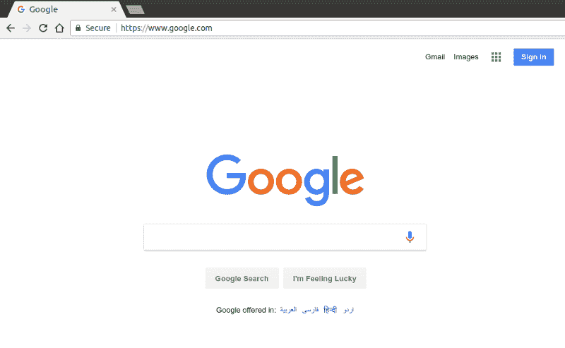
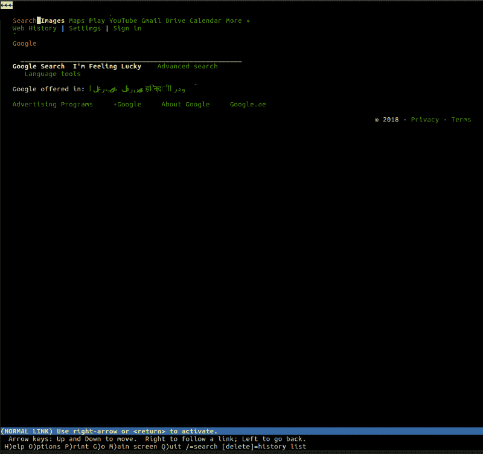
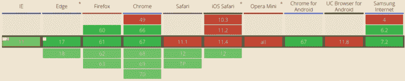

# 浏览器如何工作

> 原文：<https://www.freecodecamp.org/news/web-application-security-understanding-the-browser-5305ed2f1dac/>

亚历克斯·纳达林

# 浏览器如何工作

#### Web 应用程序安全性介绍


Photo by [Liam Tucker](https://unsplash.com/photos/cVMaxt672ss?utm_source=unsplash&utm_medium=referral&utm_content=creditCopyText) on [Unsplash](https://unsplash.com/search/photos/security?utm_source=unsplash&utm_medium=referral&utm_content=creditCopyText)

让我们以解释浏览器做什么和如何做来开始这个关于 Web 应用程序安全性的系列。因为你的大多数客户将通过浏览器与你的 web 应用程序进行交互，所以理解这些精彩程序的基础是非常必要的。

**浏览器是一个渲染引擎**。它的工作是下载网页，并以人类可以理解的方式呈现出来。

尽管这是一种近乎犯罪的过度简化，但这是我们目前需要知道的全部。

*   用户在浏览器栏中输入地址。
*   浏览器在该 URL 下载“文档”并呈现它。



你可能习惯于使用 Chrome、Firefox、Edge 或 Safari 等最流行的浏览器，但这并不意味着没有不同的浏览器。

例如，lynx 是一个轻量级的、基于文本的浏览器，可以从命令行运行。lynx 的核心是与你在任何其他“主流”浏览器中发现的完全相同的原则。用户输入一个网址(URL)，浏览器获取文档并呈现它——唯一的区别是 lynx 不使用视觉呈现引擎，而是使用基于文本的界面，这使得像 Google 这样的网站看起来像这样:



我们大致了解浏览器的功能，但让我们更仔细地看看这些巧妙的应用程序为我们做了些什么。

### 浏览器是做什么的？

长话短说，浏览器的工作主要包括:

*   DNS 解析
*   HTTP 交换
*   翻译
*   冲洗并重复

#### **DNS 解析**

这个过程确保一旦用户输入 URL，浏览器就知道它必须连接到哪个服务器。浏览器联系 DNS 服务器，发现`google.com`转换为`216.58.207.110`，这是浏览器可以连接的 IP 地址。

#### HTTP 交换

一旦浏览器识别出哪个服务器将为我们的请求提供服务，它将启动与该服务器的 TCP 连接，并开始 **HTTP 交换**。这只不过是浏览器与服务器进行所需通信的一种方式，也是服务器进行回复的一种方式。

HTTP 仅仅是网络上最流行的通信协议的名称，浏览器在与服务器通信时大多通过 HTTP 交谈。HTTP 交换包括客户端(我们的浏览器)发送一个**请求**，服务器回复一个**响应**。

例如，在浏览器成功连接到`google.com`后面的服务器后，它将发送一个类似如下的请求:

```
GET / HTTP/1.1Host: google.comAccept: */*
```

让我们一行一行地分解请求:

*   `GET / HTTP/1.1`:在第一行中，浏览器要求服务器在位置`/`检索文档，并补充说请求的其余部分将遵循 HTTP/1.1 协议(也可以使用`1.0`或`2`)
*   `Host: google.com`:这是**HTTP/1.1**中唯一强制的 HTTP 头。因为服务器可能服务于多个域(`google.com`、`google.co.uk`等)，所以客户端在这里提到请求是针对特定主机的
*   可选的头，浏览器告诉服务器它将接受任何类型的响应。服务器可能有 JSON、XML 或 HTML 格式的可用资源，所以它可以选择自己喜欢的格式

充当**客户端**的浏览器完成请求后，轮到服务器回复。这是一个响应的样子:

```
HTTP/1.1 200 OKCache-Control: private, max-age=0Content-Type: text/html; charset=ISO-8859-1Server: gwsX-XSS-Protection: 1; mode=blockX-Frame-Options: SAMEORIGINSet-Cookie: NID=1234; expires=Fri, 18-Jan-2019 18:25:04 GMT; path=/; domain=.google.com; HttpOnly
```

```
<!doctype html><html">......</html>
```

哇，要消化的信息可真多。服务器让我们知道请求是成功的(`200 OK`)，并在**响应**中添加一些头，例如，它通告哪个服务器处理了我们的请求(`Server: gws`)、这个响应的`X-XSS-Protection`策略是什么等等。

现在，您不需要理解响应中的每一行。在本系列的后面，我们将讨论 HTTP 协议、它的报头等等。

现在，您需要理解的是客户端和服务器正在交换信息，并且它们是通过 HTTP 来交换信息的。

#### 翻译

最后，同样重要的是，**渲染**过程。如果浏览器只向用户显示一系列有趣的字符，它会有多好？

```
<!doctype html><html">......</html>
```

在响应的**主体**中，服务器根据`Content-Type`头包含响应的表示。在我们的例子中，内容类型被设置为`text/html`，所以我们期望响应中有 HTML 标记——这正是我们在正文中发现的。

这是浏览器真正闪光的地方。它解析 HTML，加载标记中包含的附加资源(例如，可能有 JavaScript 文件或 CSS 文档要获取)，并尽快将它们呈现给用户。

同样，最终结果是普通人能够理解的。


关于当我们在浏览器的地址栏中点击 enter 时会发生什么的更详细的版本，我建议阅读“[当…](https://github.com/alex/what-happens-when) 时会发生什么”，这是一个非常详细的解释过程背后的机制的尝试。

由于这是一个侧重于安全性的系列，我将对我们刚刚了解的内容进行提示:**攻击者很容易利用 HTTP 交换和呈现部分**中的漏洞。漏洞和恶意用户也潜伏在其他地方，但是在这些级别上的更好的安全方法已经允许您在改善您的安全状况方面取得进展。

#### 供应商

4 款最流行的浏览器分属不同的供应商:

*   谷歌 Chrome 浏览器
*   Mozilla 的 Firefox
*   苹果的 Safari
*   微软 Edge

除了为了增加市场渗透率而互相争斗，厂商们也为了改进网络标准而互相合作，这是对浏览器的一种“最低要求”。

W3C 是标准开发的主体，但是浏览器开发自己的特性并最终使其成为 web 标准并不罕见，安全性也不例外。

例如，chrome 51[引入了 SameSite cookies](https://www.chromestatus.com/feature/4672634709082112) ，这是一种允许 web 应用程序摆脱一种被称为 CSRF 的特定类型漏洞的功能(稍后将详细介绍)。其他供应商认为这是一个好主意，并紧随其后，导致 SameSite 成为 web 标准:截至目前， [Safari 是唯一不支持 SameSite cookie 的主流浏览器](https://caniuse.com/#search=samesite)。



这告诉我们两件事:

*   Safari 似乎不太关心用户的安全(开玩笑:SameSite cookies 将在 Safari 12 中提供，在您阅读本文时可能已经发布了)
*   **修补一个浏览器的漏洞并不意味着所有用户都是安全的**

第一点是在 Safari 的一个镜头(正如我提到的，只是开玩笑！)，而第二点真的很重要。在开发 web 应用程序时，我们不仅需要确保它们在不同的浏览器上看起来一样，还需要确保我们的用户在不同的平台上受到同样的保护。

**您的网络安全策略应该根据浏览器供应商允许我们做的事情而变化**。如今，大多数浏览器都支持相同的功能集，很少偏离它们共同的路线图，但像上面这样的情况仍然会发生，这是我们在定义安全策略时需要考虑的事情。

在我们的案例中，如果我们决定只通过 SameSite cookies 来减少 CSRF 攻击，我们应该意识到我们将 Safari 用户置于危险之中。我们的用户也应该知道这一点。

最后但同样重要的是，你应该记住你可以决定是否支持一个浏览器版本:支持每一个浏览器版本是不切实际的(想想 Internet Explorer 6)。不过，确保主流浏览器的最新版本得到支持通常是一个好的决定。但是，如果您不打算在特定平台上提供保护，通常建议让您的用户知道。

> ***Pro 提示*** *:你永远不要鼓励你的用户使用过时的浏览器，或者积极支持他们。即使您可能已经采取了所有必要的预防措施，其他 web 开发人员可能还没有。鼓励用户使用主流浏览器的最新支持版本。*

#### 供应商还是标准 bug？

事实上，普通用户通过第三方客户端(浏览器)访问我们的应用程序增加了另一层间接性，以获得清晰、安全的浏览体验:浏览器本身可能存在安全漏洞。

厂商通常会向能够发现浏览器自身漏洞的安全研究人员提供奖励(又名 *bug 奖金*)。这些错误与您的实现无关，而是与浏览器自身处理安全性的方式有关。

例如， [Chrome 奖励计划](https://www.google.com/about/appsecurity/chrome-rewards/)，让安全工程师向 Chrome 安全团队报告他们发现的漏洞。如果这些漏洞得到确认，就会发布一个补丁，一般会向公众发布一个安全咨询通知，研究人员会从该计划中获得一笔(通常是经济上的)奖励。

像谷歌这样的公司向他们的 Bug Bounty 项目投入了相对较大的资金，因为这使他们能够通过承诺经济利益来吸引研究人员，如果他们发现应用程序有任何问题。

在 Bug 赏金项目中，每个人都是赢家:供应商设法提高了软件的安全性，研究人员因他们的发现而获得报酬。我们将在后面讨论这些程序，因为我相信 Bug 赏金计划应该在安全领域有自己的一席之地。

> Jake Archibald 是谷歌的一名开发者支持者，他最近发现了一个影响多个浏览器的漏洞。他在一篇有趣的[博客文章](https://jakearchibald.com/2018/i-discovered-a-browser-bug/)中记录了他的努力，他如何接触不同的供应商，以及他们的反应，我推荐你阅读这篇文章。

### 面向开发者的浏览器

到目前为止，我们应该已经理解了一个非常简单但却非常重要的概念:**浏览器只是为普通互联网浏览者构建的 HTTP 客户端**。

它们肯定比平台的裸 HTTP 客户端更强大(例如，想想 NodeJS 的`require('http')`)，但归根结底，它们“只是”更简单的 HTTP 客户端的自然进化。

作为开发人员，我们选择的 HTTP 客户端可能是 Daniel Stenberg 的 cURL，这是 web 开发人员日常使用的最流行的软件程序之一。它允许我们通过从命令行发送 HTTP 请求，即时进行 HTTP 交换:

```
$ curl -I localhost:8080
```

```
HTTP/1.1 200 OKserver: ecstatic-2.2.1Content-Type: text/htmletag: "23724049-4096-"2018-07-20T11:20:35.526Z""last-modified: Fri, 20 Jul 2018 11:20:35 GMTcache-control: max-age=3600Date: Fri, 20 Jul 2018 11:21:02 GMTConnection: keep-alive
```

在上面的例子中，我们在`localhost:8080/`请求了文档，本地服务器成功回复。

这里我们没有将响应体转储到命令行，而是使用了`-I`标志，它告诉 cURL 我们只对响应头感兴趣。更进一步，我们可以指示 cURL 转储更多的信息，包括它执行的实际请求，这样我们就可以更好地了解整个 HTTP 交换。我们需要使用的选项是`-v`(详细):

```
$ curl -I -v localhost:8080* Rebuilt URL to: localhost:8080/*   Trying 127.0.0.1...* Connected to localhost (127.0.0.1) port 8080 (#0)> HEAD / HTTP/1.1> Host: localhost:8080> User-Agent: curl/7.47.0> Accept: */*>< HTTP/1.1 200 OKHTTP/1.1 200 OK< server: ecstatic-2.2.1server: ecstatic-2.2.1< Content-Type: text/htmlContent-Type: text/html< etag: "23724049-4096-"2018-07-20T11:20:35.526Z""etag: "23724049-4096-"2018-07-20T11:20:35.526Z""< last-modified: Fri, 20 Jul 2018 11:20:35 GMTlast-modified: Fri, 20 Jul 2018 11:20:35 GMT< cache-control: max-age=3600cache-control: max-age=3600< Date: Fri, 20 Jul 2018 11:25:55 GMTDate: Fri, 20 Jul 2018 11:25:55 GMT< Connection: keep-aliveConnection: keep-alive
```

```
<* Connection #0 to host localhost left intact
```

通过主流浏览器的 DevTools 可以获得几乎相同的信息。

正如我们所见，浏览器只不过是精心制作的 HTTP 客户端。当然，它们增加了大量的功能(想想凭证管理、书签、历史等)，但事实是它们生来就是人类的 HTTP 客户端。这一点很重要，因为在大多数情况下，您不需要浏览器来测试您的 web 应用程序的安全性，因为您可以简单地“卷曲它”并查看响应。

我想指出的最后一点是**任何东西都可以成为浏览器**。如果您有一个通过 HTTP 协议使用 API 的移动应用程序，那么该应用程序就是您的浏览器——它只是一个您自己构建的高度定制的应用程序，一个只理解特定类型的 HTTP 响应(来自您自己的 API)的应用程序。

### 到 HTTP 协议中

正如我们提到的， **HTTP 交换**和**渲染**阶段是我们主要要覆盖的阶段，因为它们为恶意用户提供了最大数量的**攻击载体**。

在[的下一篇文章](https://medium.freecodecamp.org/web-security-https-perspective-5fa07140f9b3)中，我们将更深入地研究 HTTP 协议，并尝试理解我们应该采取什么措施来保护 HTTP 交换。

*最初发表于[odino.org](https://odino.org/wasec-understanding-the-browser/)(2018 年 7 月 29 日)。*
*你可以在[推特](https://twitter.com/_odino_)上关注我——欢迎吐槽！*？