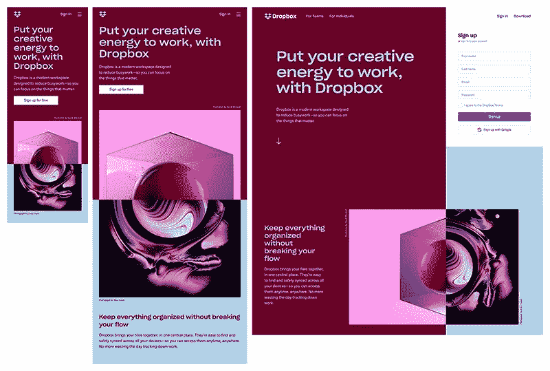
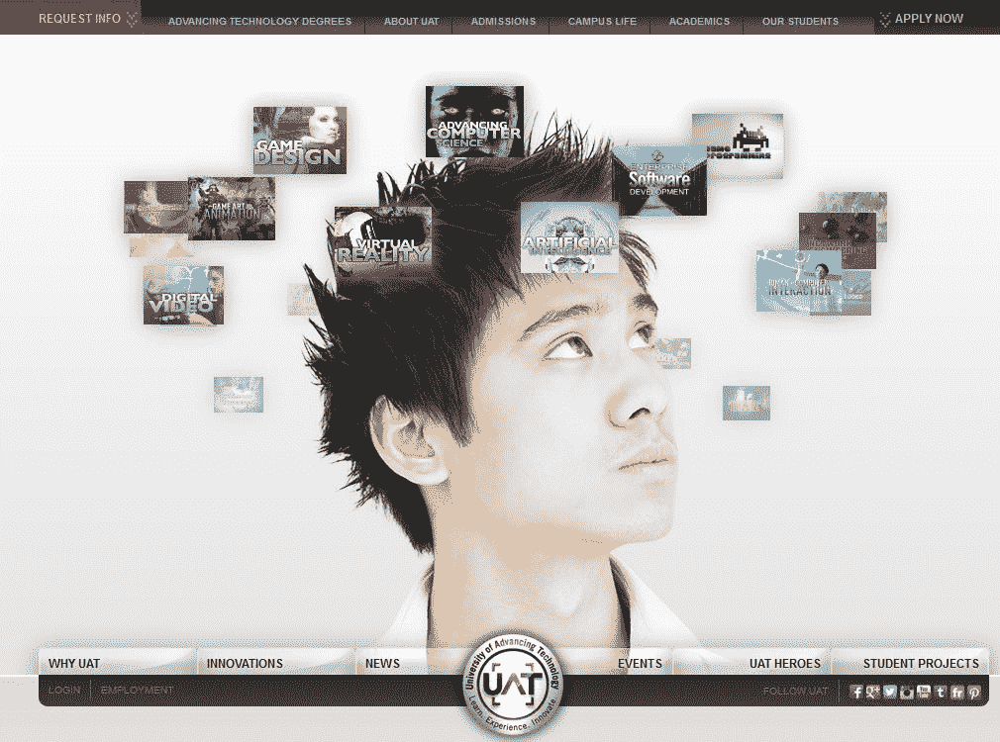
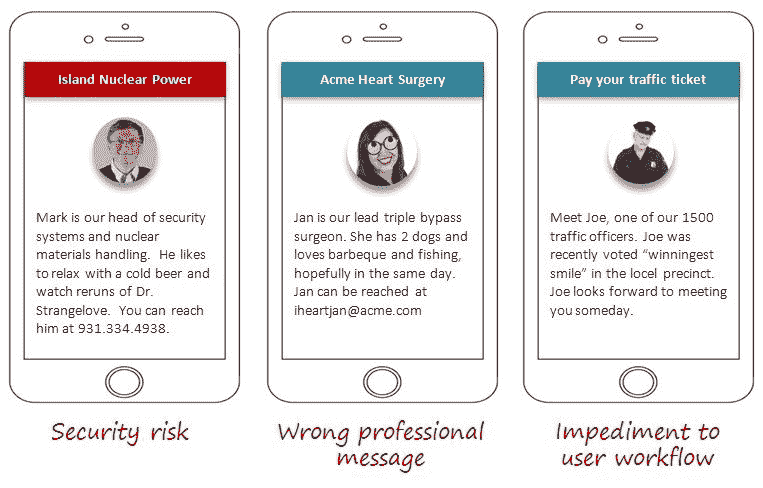

# 如何创作有价值的作品——新开发人员的网页设计最佳实践

> 原文：<https://www.freecodecamp.org/news/web-design-best-practices-for-new-developers/>

如果你是一个初学者，很难找到用你有限的知识来支持自己的方法。与此同时，如果你不全职使用它们，你将无法磨练你的技能。

这是一个不稳定的地方，我记得我刚开始的时候(比我愿意承认的时间要长得多)。

如果你和我一样，你可能会以从事自由职业网站开发工作来维持生计。如果您专注于扩展 Python 和 Java 等语言的知识，这一点尤其有用。

但是如果你没有经验，很有可能你需要从为个人或小公司做网页设计开始——至少在你有一个可以吸引大客户的像样的投资组合之前。

问题是，小客户通常会希望你做一些事情——因为缺乏更好的条件——往好里说是不寻常的，往坏里说是完全错误的。虽然这样做你会赚到一些钱，但你最终不会得到任何你真正想展示给其他潜在客户的东西。

因此，即使这需要你在早期做一些工作，你也应该花时间为自己设定一些标准。

最好的起点是了解 2021 年网页设计的最佳实践。如果你承诺只承担符合这些标准的工作，你最终总会得到一些值得炫耀的东西，从而为你赢得更大的客户。

以下是其中一些最重要的最佳实践。

## 创建响应式设计

如果在开始你的编码之旅时，只有一个你坚持的最佳实践，那就让它成为一个:去做需要响应性设计的工作。造成这种情况的原因有很多，但我会尽力挑出其中最相关的。

首先，每一个你想在以后的职业生涯中留下深刻印象的主要网站设计客户都想要一个有响应的网站。在今天的多屏幕、多设备的世界里，响应式网站在大多数情况下比静态网站工作得更好。

如果客户要求你建立一个静态网页，他们实际上是在寻找一个电子广告牌。就你的作品集而言，在 Photoshop 中模拟一个页面设计和构建一个静态页面会给你带来同样的好处。

如今，企业可以通过使用简单的所见即所得编辑器[设计一个响应式网站](https://www.editorx.com/)，它会告诉你他们已经成为了多大的标准。这是有充分理由的。

今天网页设计的游戏名称是用户体验。一个高质量的网站在所有平台上都提供相似的用户体验。有利于品牌塑造，有利于可用性，有利于留存。

此外，这也是展示你对如何创造一个有凝聚力的结构和外观的理解的好方法。想想几年前 Dropbox 的主页设计:

它充分利用了每种屏幕类型上的空间。如果你的投资组合中有这样的设计，它将向潜在客户传达你知道你在做什么，并且可以信任你会照顾他们的品牌。

## 使用直观导航

没有经验的网页设计师经常想重新发明轮子。冲动通常首先表现在页面导航中。

这是因为这是网站设计的一个领域，它似乎为创造力提供了一些空间。事实上，那不是不真实的。

真的吗——看看这些拥有不同寻常的导航结构的获奖网站吧。我将是第一个承认那里的一些网站很漂亮的人。甚至迷人。我过去也做过类似的网站。

但你知道我还能向潜在客户炫耀多少吗？一个都没有。

这是因为这样的网站会在发布日引起轰动，一旦人们开始使用它们，就不得不被取代。

像亚马逊这样的知名大网站使用如此简单——我敢说很无聊——的导航元素是有充分理由的。他们完成了工作，而且一看就很容易理解。

例如，看看这张 2014 年前后的先进技术大学网站截图:

乍看之下，这似乎是一种巧妙的运用形象来描绘学校可能发展学生心智的方式。

但是那些在学生头上浮动的图像是链接——这是一个主要问题。它们很难阅读，一般的访问者甚至不会想到去点击它们。

然后，您还会注意到两个相互竞争的顶部和底部菜单，它们似乎没有遵循任何清晰的信息结构。

幸运的是，学校吸取了教训，更新了设计。如果你今天访问学校的网站，你会注意到他们做了重大的导航改变。

首先，他们把菜单浓缩成一个单一的，容易发现的汉堡，放在左下角。当你到达页面时，它立即可见，点击它会打开一个遵循完美逻辑结构的层次菜单。

这是一个很好的导航结构的例子，任何访问者都会感到熟悉。

如果你想在你自己的工作中复制它，考虑使用像 [Optimal Sort](https://www.optimalworkshop.com/optimalsort/) 这样的工具，让你在做任何事情之前测试你的导航逻辑。他们甚至提供了一个免费层，可以让你创建多达 20 个导航卡，这对于小型 web 项目来说是完美的。

## 在高科技和人类之间找到平衡点

下一个最佳实践听起来肯定会有点混乱。那就是你应该只建立在技术和人性之间取得适当平衡的网站。

要理解我在说什么，去看看一般的 SEO 或营销公司的网站。你会注意到你正被弹出窗口、行动号召和打断攻击。

虽然现代分析认为这些都是让访问者转化的好方法，但它们也是千篇一律的机器人页面(开发方面)的配方，不会在你的投资组合中脱颖而出。此外，他们很讨厌游客。

所以，即使你成功地创建了这样一个世界上最令人印象深刻的页面，你也不会想让一个潜在的客户通过这样的挑战来检查你的工作。

你要关注的是学习如何[自然地将人工智能聊天机器人](https://brainboxlabs.com/blog/how-to-humanize-your-website-in-the-age-of-artificial-intelligence)等东西整合到你的设计中，因为这是大客户在评估你的作品时会寻找的东西。

但是为了平衡这种技术，你也应该致力于在你创建的页面中加入人性化的元素。

一个很好的方法是尽可能多地包含真实的照片和视频元素——如果可能的话，避免普通照片。

您还需要使页面的文本元素尽可能具有对话性。这个想法是为了让访问者明白，这个网站代表了希望在个人层面上与他们建立联系的真实的人。

但是在实现它们之前，请确保您考虑过如何努力使您的页面人性化。做任何事情都有一个时间和地点，如果你做得太过了，就会弊大于利。

仔细注意你发送的信息在访问者听起来是什么样的。这样你可以避免传达任何适得其反的信息。

如果你能证明你知道如何将自动化和辅助技术无缝融合到你的设计中，同时仍然将人性化元素放在第一位，你很快就会有新的客户找到你的数字大门。

## 将辅助功能集成到您的设计中

尽管它们被视为事后的想法，但可访问性功能已经成为现代互联网上的一个主要问题。我的意思是说[他们几乎不存在](https://www.isemag.com/2020/11/telecom-98-percent-of-websites-fail-to-comply-with-accessibility-requirements-for-people-with-disabilities/)。

但这种情况不会持续太久。几十年的法律挑战最终导致司法部裁定大多数商业网站必须遵守美国残疾人法案。所以网上将会有一个可及性评估。

你应该为此做好准备，坚持在你所有的作品中加入可访问性特征。

首先，这将使你在竞争中脱颖而出，因为没有太多的开发人员专门从事易访问设计。此外，你将尽自己的一份力量，让互联网成为一个更加包容的地方。

当无数需要实现合规性的企业寻求帮助时，您甚至会得到帮助。

开始学习这个的一个很好的地方是浏览 W3C 关于这个主题的教程。它们包括针对各种辅助功能的集成解决方案、关于构建兼容页面的建议以及包含相关全球标准的参考资料(当您获得第一批国际客户时使用)。

一旦您知道了如何包含可访问性特性，就要为您部署的特性包含一个测试过程。很多网站都没有做到这一点。

例如，尝试在 [Brit+Co 网站](https://www.brit.co/)上使用标签导航。你会发现它似乎在起作用——直到焦点突然消失在你导航旅程中的随机点上。似乎无法访问搜索功能或更多菜单项。这使得用键盘访问整个网站变得不可能。

## 坚持你的原则

这里的底线很简单。当你刚开始做程序员时，你的首要任务是尽快建立一份令人印象深刻的简历。如果你坚持接受符合上述最佳实践的工作，你不会花那么长时间去做。

尽管会有诱惑。我不是让你为了自己的原则而牺牲食物。如果一个客户提出给你比他们的项目价值更高的报酬——尽管你不会得到一个有投资价值的网站，也要接受这笔钱。

但如果你养成了寻找高质量工作的习惯，你很快就会发现，更赚钱的客户会开始找你。

最终，这将让你更快地建立自己的编码技能，并给你接受更大挑战的自由，因为你不会担心如何支付下一笔租金。这对任何初学者来说都不是一个坏地方。