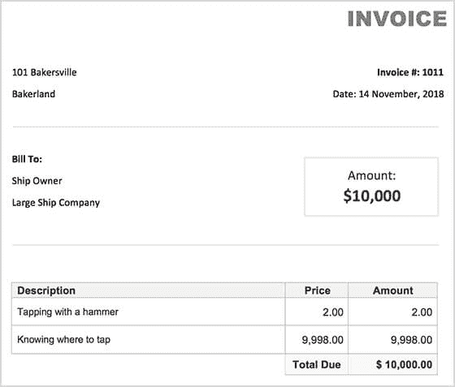
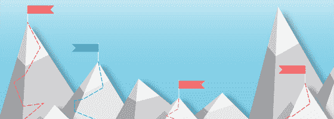
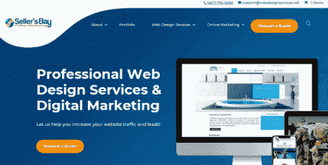
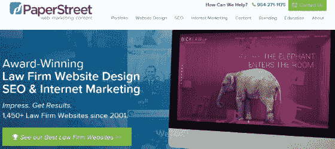
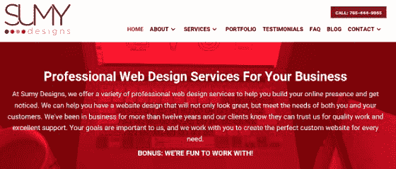
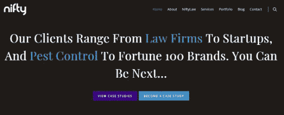
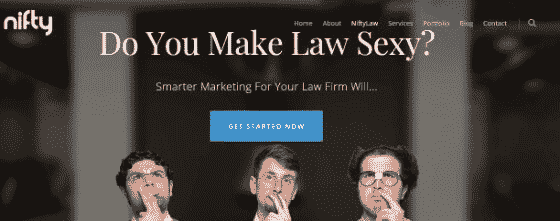
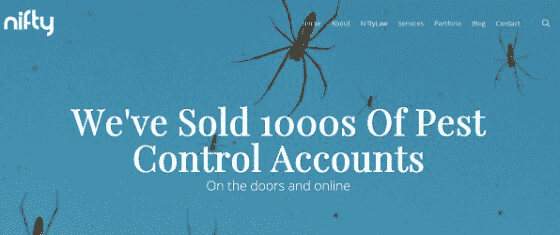

# 如何定位你的网页设计服务——以及你应该什么时候做

> 原文：<https://www.freecodecamp.org/news/web-design-niche/>

要小众还是不要小众？

让我开门见山地说，你不必为了在自由职业中取得成功而[缩小](https://www.quora.com/How-do-I-find-a-niche-as-a-freelance-web-developer)你的网页设计和开发服务。

但是，我确实相信在利基市场工作更有益，这篇文章将解释为什么。

**拿着锤子的老人:**

一个晴朗的日子，一艘价值百万美元的大船的船主发现引擎不工作了。

他打电话给船上和周围城镇的每个工程师，但是没有人能修好它。

然后他们请来了一位专门修理船舶发动机的老人。他立即开始工作，从上到下检查发动机。

店主看着老人把手伸进包里，拿出一把小锤子，用锤子敲了敲什么东西，发动机立刻就启动了。

一个星期后，店主收到了老人一张 1 万美元的发票。

船主不愿意付钱，说:“他几乎什么也没做！”所以他要求一份详细的账单。

这是老人发来的:

一生的经验使他成为修理船舶发动机的专家，他完全有权利像一个专家那样工作。

小生境主题与专业知识主题有很大关系，也是为什么专家能够比一般开发人员收取更多费用的原因。

很简单:

细分市场将你定位为某个特定行业的专家，让你可以要价更高，变得更受欢迎。

我将讨论为什么利基下来是你作为一个网页设计师和开发人员可以做的最好的事情，以赚取更多，成为尊重你的专业知识和更好的客户。

以下是我们可以期待的:

*   小生境-是什么？
*   利基增加你的专业知识
*   细分市场让你可以个性化你的信息
*   如何找到网页设计的利基
*   在你的领域开始
*   全方位利基方法

## 小生境——是什么？

一个“利基”被定义为 ****“一个专门的市场”。****

这是一个特定的领域或行业，如法律、医疗保健、摄影、摄像、时尚、金融服务等。

当一个网页设计师把他们的服务细分时，他们只需选择一个行业来为这个细分市场中的企业创建网站。

所以如果我选择专注于摄影，我只会为摄影师做网站。不是面包师，不是发型师，只是摄影师。

现在你可能会问，“我为什么要这么做？”

你对 99%的其他企业说不...

你是对的...

为什么我要告诉你，拒绝客户 并让你的服务成为某个行业的独家服务是明智之举？

让我们回到老修船人的故事。

你认为，如果他把自己的一生都花在修理机械上，他会获得“知道从哪里下手”所需的专业知识吗？

如果他是一个修理各种发动机的多面手，他就不会是这个城市里唯一知道如何解决那艘船的问题的人。

这就是小生境的原则:

专攻某个领域会让你有更高的机会成为公认的专家，并让你处于更有利的位置，为你的服务收取更多的费用。

专门化让你:

*   少花时间找客户。相反，他们来找你。
*   要求比多面手更高的价格。
*   腾出你的时间，真正开始享受你的生活。

这些好处实际上是利基市场的这些主要优势的直接结果:

1.  缩小差距会增加你的专业知识。
2.  细分市场让你可以个性化你的信息。

## 利基增加你的专业知识

无论你在哪里，你都会看到这个原则在起作用的场景。

专业化需要高价。

这就是为什么人们愿意花更多的钱买一双耐克鞋，而不是一双没有品牌的。

或者为什么需要做脑部手术的人会找神经外科医生而不是全科医生。

当你专注于一个特定的利基市场时，它描绘了可信度 ，并向潜在客户展示你知道自己在做什么，你是帮助他们实现业务目标的最佳人选。

实践测试:

假设你是一名律师，你正在四处寻找某人或某个机构为你的律师事务所创建一个网站。

在您的搜索中，您会遇到这些网站:

选项 1:

选项二:

作为一名律师，你认为这两个网站中的哪一个是帮助你获得更多客户的最佳选择？

...

..

。

如果你不说选项 2，我会很惊讶。

现在让我们更进一步:

这是他们对一家律师事务所网站的(假设)定价:

方案一:5000 美元

选项 2:12 000 美元

现在哪个选项最好？

...

..

。

还是那句话，如果你不说选项 2，我会很惊讶。

为什么？

你在为他们在你领域的专业知识买单。你不是为了创建一个“网站”而付钱。

显然，网站的定价心理在这里有很大的影响，但简而言之，选择 2 可以收取更多的费用，因为他们以前与数百名外行合作过，他们有着良好的记录。

最重要的是，在律师事务所网站的生命周期中，仅仅一个新客户的价值就可以支付选项 2 收取的额外费用。

小生作品和[的德里克·哈特得到演出](https://www.getthegigs.com/)就是一个证明。

当他开始他的 web 开发生涯时，他是一个多面手，并与成千上万的其他多面手竞争。

他选择专注于教练和演讲者这一利基市场，花更少的时间寻找客户，向客户证明自己，谈判价格和范围，并专注于重要的事情: ****制作网站并获得丰厚的收入。****

在一个小圈子里，消息传得很快。你完成的项目越成功，你为你的企业创造的声势就越大。

关于推荐的事情是这样的:

声誉先于你，所以甚至在你和客户交谈之前，他们就已经对你有了看法，而且这个看法是好的。

这就是为什么获得推荐通常是获得新客户的最好方式**。**

## **细分市场让你可以个性化你的信息**

****

**向潜在客户传达你的提议是如此强大，以至于它可以成就或毁灭一家企业。**

**你的品牌信息是 ****你如何传达你能为客户做什么**** ，你如何改善他们的生活，以及为什么他们应该与你合作。**

**不要像我在那里看到的许多人一样，认为仅仅因为他们是 XYZ 编程语言的专家，就意味着他们将获得好客户并获得好收入。**

**事情不是这样的...**

**事实上，就编程而言，我的知识相当简单，但那只是因为我知道它不会产生$$$。**

**实践测试:**

**假设你是一名脊椎指压治疗师，你想要一个网站来获得新的病人，所以你开始在网上寻找网页设计服务，你遇到了这家公司:**

****

**为“您的业务”获得“各种专业的网页设计服务”。**

**听起来不错，因为这正是你所需要的，对吗？**

**但是当你看到这个网站时:**

****

**你会立即被跳出来和你说话的定制信息击中，因为它把你当作一名脊椎指压治疗师，而不仅仅是任何企业。**

**这些信息是直接而具体的，他们得到了你真正想要实现的东西——通过你的网站得到更多的病人。**

**此时，你会开始想，“这些家伙抓到我了！我应该联系一下。”**

**这是这个脊椎按摩网页设计服务的又一个线索。**

**你向目标受众传达的信息越具体、越个性化，你的营销就越有吸引力。**

**专攻某个特定的领域可以让你精心制作更强有力的信息，与受众的特定需求和愿望产生共鸣。**

**概括一下:利基市场让你成为专家，你可以打造更个性化的品牌信息，这两者都会带来更高的收入、更多的自由和更多的假期。**

## **如何找到网页设计的利基**

****

**在这一点上，我希望你看到了 ****细分你的网页设计服务**** 的巨大好处，并且你开始想象它如何能极大地改善你的 [自由职业生涯](https://studywebdevelopment.com/freelancing.html) 。**

**一旦你准备好专业化，你需要做的第一件事就是寻找你的利基。**

**我认为，在利基市场中，你只需要寻找两样东西:**

1.  **这是你喜欢的东西。**
2.  **它有很高的收入潜力。**

**如果你以前做过几个项目:列出你所有的项目。**

**打开 Excel，列出你过去参与的所有项目。**

**请注意以下几点:**

*   **工业**
*   **你赚了多少**
*   **你对项目/客户的感受**

******如果你还没有做过任何项目:******

**反思你过去在学校或工作中的经历，想想你喜欢从事什么行业，或者更想探索什么行业。**

**一旦你有了一份你喜欢的或者你认为你想从事的行业的初步清单，你需要知道在每一个行业你能挣多少钱。**

**你所要做的就是去谷歌，找出一个特定行业的个人年收入，然后除以 10。**

**这是他们年度营销预算的粗略估计。**

**可操作的示例:**

**营养学家**

**据 PayScale.com 统计，他们的年薪约为 43，000 美元。这意味着他们每年只能支付大约 4300 美元(或 350 美元)的营销费用。**

**神经外科医生**

**据 PayScale.com 统计，他们的年薪约为 40 万美元。这意味着他们每年可以支付大约 40，000 美元(或 3，300 美元)的营销费用。**

**如果你专门帮助神经外科医生，你可以收取更高的价格，因为他们的营销预算高于营养学家。**

**例如，如果你每月向神经外科医生收取 1000 美元的数字营销服务费用，他们可能会同意，因为他们负担得起。但是如果你向营养学家收取费用，那就太贵了。**

**所以你的定位与你的收入潜力直接相关。**

**还是那句话，应该是 ****享受和**** 赚钱潜力的平衡。**

**如果你在寻找利基时需要更多的灵感，看看这个[广泛的列表](http://www.flauntmydesign.com/finding-your-web-design-niche-examples)中潜在的网页设计利基的例子。**

**一旦你有了一个利基市场，并且 100%投入其中，是时候把它转换成美元了。**

## **在你的领域开始**

**此时你的最终目标是 ****让自己成为专家**** ，这样客户才会真正找到你，并信任你。**

**你需要做三件主要的事情:**

**1 -尽可能多地研究你的新领域的信息。**

**在你考虑获得客户之前，你需要 ****了解他们的利基**** 以及其中的一切——文化、行话、人们的在线行为、共同的讨论点、拥有网站或获得新客户时的痛点等等。**

**关键是 ****保持专注**** 不要害怕花你需要的时间。**

**阅读你能找到的所有书籍和资源，了解最新的行业新闻。**

******2 -展示你的投资组合。******

**你的投资组合应该清楚地显示你在你的利基过去的经验，客户的问题是什么，你做了什么来解决它和最终结果。**

**如果你以前没有和你所在领域的客户合作过，你可以提供免费服务，并将其用于你的投资组合。**

**准备好你的行业知识和投资组合，开始营销你的利基网站设计机构。**

**在我讨论营销策略之前，让我们先明确一下你的营销目标:**

**这不是争取客户的问题。这甚至不是让你的投资组合网站的流量。**

**这都是关于 ****把自己打造成[专家](https://doubleyourfreelancing.com/freelancers-guide-niching-business/)。******

**这个目标应该贯穿于你使用的每一个营销策略，应该让你再三考虑每一条内容和广告是如何树立你的专家地位的。**

**这样，营销就被分解成了这些时间框架策略:**

**长期战略 : SEO 和社交媒体。**

**短期策略:谷歌广告和在线广告。**

**如果你想看到更好的结果，你需要同时实施这些策略。**

**搜索引擎优化和社交媒体在 ****建立品牌知名度**** 和 ****获得持续的领先**** 方面都很有效，但往往需要时间来获得结果——大约 3-6 个月。**

**因为你需要一边吃饭一边等待你的长期营销策略的结果，你可以使用谷歌广告和其他在线广告平台如脸书来运行付费广告。**

**以下是将自己推销为专家的其他有效方法:**

*   **自愿成为你的目标受众正在收听的播客的嘉宾，分享你在你的领域设计网站的知识。**
*   **创建一个脸书小组，增加潜在客户(例如:如果你在脊椎指压治疗领域，增加脊椎指压治疗师)，通过分享有用的内容为他们增加价值，并决定如何向他们销售你的服务。**
*   **写一本书。这是目前为止最简单的增加你可信度的方法。在亚马逊上销售或者在你的代理网站上免费提供。重要的是让客户看到你有一本适合他们的书，因为人们倾向于认为如果你写了一本书，那么你一定是专家。**

**如果你想要更多关于如何营销和发展你的利基网站设计代理的建议，我会在这里插入我的自由职业捆绑包，因为我会做很多细节的探讨。**

## ****一体化利基方法****

****

**如果你担心把你所有的美好时光都花在一个利基市场上，担心你会厌倦，要知道你没必要把你的一生都花在一个利基市场上。**

**我个人拥有两家专注于利基市场的代理公司，我还发现其他网站设计代理公司拥有几个专注于利基市场的子代理公司，并在不同的网站或网页上分别提供这些服务。**

**俏皮营销在这方面做得特别好。**

**在他们的主页上，他们首先声明他们服务于不同类型的企业:**

****

**然后他们会给出一个特定行业的网页链接，比如法律领域:**

****

**害虫控制:**

****

**他们有 20 多名员工，所以我敢肯定他们在这个策略上做得还不错...:)**

**-**

**就是这样！**

**我希望你能看到利基如何能有力地影响你的网页设计业务。**

**如果你认为你已经准备好专业化，但需要更多的帮助，或者你有其他问题，请在 [Twitter](https://twitter.com/study_web_dev) 上与我联系，我很乐意帮助你:)**

**直到下一次，**

**狭海峡**