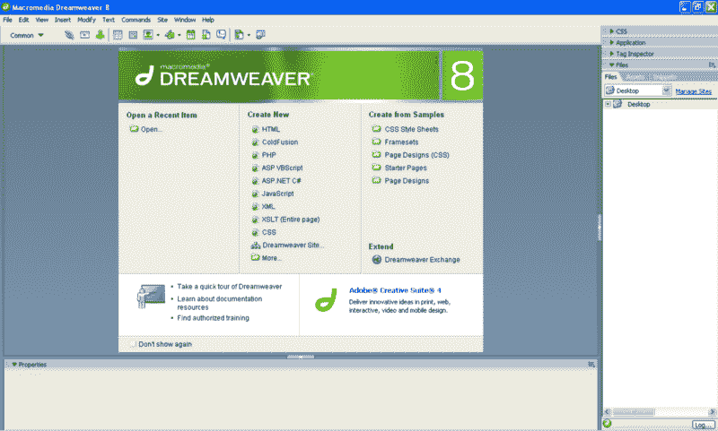
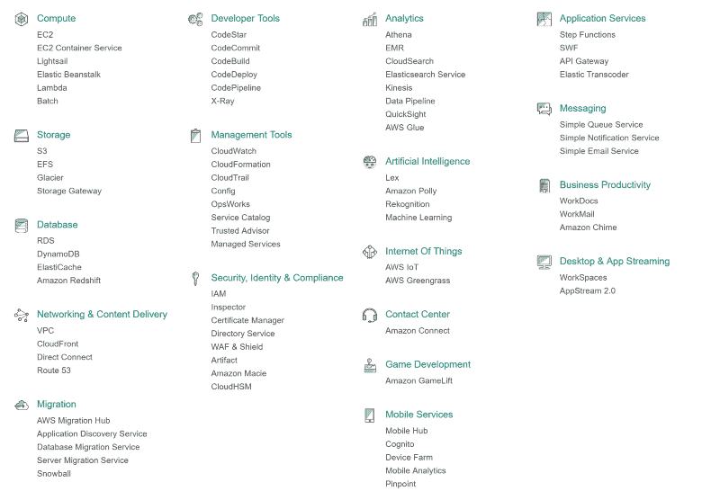
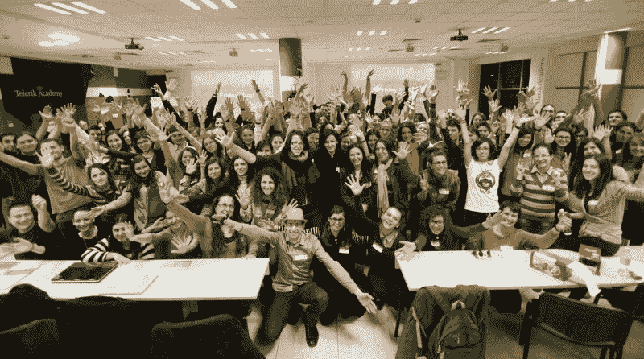

# 网络开发向一个十年前的时间旅行者解释

> 原文：<https://www.freecodecamp.org/news/web-development-explained-to-a-time-traveler-from-ten-years-ago-600fad81170d/>

作者:伊万·扎雷亚

# 我将如何向 2007 年的时间旅行者解释十年来的网络发展

你好朋友！我希望你喜欢我们这个新世界。这与 2007 年的世界大不相同。快速提示:如果你刚拿到抵押贷款，回去取消它。相信我。

我很高兴你仍然对电脑感兴趣！与 10 年前相比，今天我们有更多这样的人，这带来了新的挑战。我们把电脑戴在手腕和脸上，放在口袋里，放在冰箱和水壶里。汽车很好地自动驾驶，我们已经教会程序在几乎所有游戏中都比人类做得更好——除了喝酒。

### (网络)应用程序

你可能在走进时间展台之前就已经看到了 iPhone 的发布。苹果是最大和最富有的科技公司，这主要归功于 iPhone 及其操作系统 iOS。谷歌拥有名为 Android 的竞争对手，微软试图通过 Windows Phone 从不断增长的蛋糕中分得一杯羹。没有成功。

Left: a hand holding an iPhone 3GS from 2008\. Right: a similarly-sized hand holding a larger iPhone X from 2017\. We also got to practice doing over-the-shoulder shots. Left: [iMore](https://www.imore.com/iphone-3gs), right: [BusinessInsider](https://www.businessinsider.nl/is-the-iphone-x-worth-1000-2017-9/?international=true&r=US)

我们开始称程序为**应用程序、**，一些网站自称为**网络应用程序**。2008 年，谷歌发布了名为“Chrome”的新浏览器。九年后，这是最流行的上网方式。

Chrome 团队在 JavaScript 上投入了很多，代码每个月都在变得更好。Web 应用程序是使用大量 JavaScript 编写的，它们类似于你那个时代的桌面界面。

公司也投资 JavaScript 使其更好——它现在支持类和模块。我们使用语言**将** 编译成 JavaScript，像 [TypeScript](http://www.typescriptlang.org/) (来自微软，他们现在很酷)或者 [Flow](https://flow.org/) 。

现在我们写了很多 JavaScript，因为没人再支持 Flash 了。我们甚至在服务器上运行 JavaScript，而不是 Perl，使用一个叫做 Node 的东西。听起来容易做起来难。

A responsive design: the same website shows differently on multiple devices. We’re still bad at it, but we have found pretty ways to show it off. Source: [10twelve](https://www.10twelve.com/squarespace-template-jasper/).

还记得 Swing、SWT 和 wxWidgets 之类的吗？我们必须为浏览器世界重新发明它们。出现了几个新的 UI 编程模型，它们主要集中在组件上。

我们必须找到一种方法来设计、构建和测试应用程序，同时保持它们的响应能力(我们用这个术语来描述一个在手机上看起来不像垃圾的网站)。我们还需要保持它的轻薄——不是每个人都有快速连接，但每个人的口袋里都有一个浏览器。

为了帮助所有这些，现在有了**组件框架**。这个术语很模糊，因为它包括谷歌的 [Angular](https://angular.io/) ，脸书的 [React](https://reactjs.org/) ，以及社区的 [Vue](https://vuejs.org/) 等。但这是我们最好的条件了。

顺便说一下，我不确定你是否记得 2007 年的脸书。那时它在美国变得越来越大，现在它比巨大还要大。它拥有超过 10 亿的用户，也是世界上最大的代码库之一。

脸书开发团队写了很多很棒的代码，并在网上发布。他们有自己的会议，F8。大多数大公司都有自己的会议。

CSS 也必须发展，因为新的应用程序需要更复杂的布局。我们不再使用带有图像的表格。相框也不见了。相反，我们创造了新的标准，比如 CSS Floats、Flexbox 和 CSS Grid。

人们不得不重复这些标准，他们已经建立了库来使事情看起来一致，像 [Bootstrap](http://getbootstrap.com/) 、 [Foundation](https://foundation.zurb.com/) 等等。类似于 JavaScript，我们已经创造了语言，**编译成** CSS。它们弥补了 CSS 遗漏的一些东西，比如变量或模块。还是很难。

### 迷失是正常的

如果你很困惑，不要难过。事实是我们都有点困惑——这没什么大不了的。现在地球上有更多的开发者，科技公司也变得越来越成功。有一段时间，我们用“创业”这个词来描述那些快速成长却不知道该做什么的公司。但即使是这个术语也变得陈旧了。

### 数据

程序员多了，程序多了，设备多了。我们现在有更多的数据。计算机必须强大到足以处理所有这些数据，我们已经开发了几种技术来将这些数据转化为洞察力。

首先，我们创建了一个名为数据科学的领域，旨在了解数据并从中提取信息。

例如，一家名为 Waze 的初创公司让人们在手机上安装一个应用程序，当他们在车里时，这个应用程序可以跟踪他们的运动。因为很多人安装了这个应用程序，Waze 获得了很多关于汽车如何移动的数据。他们用它来开发了解交通堵塞位置的程序。

现在在手机上打开 Waze，实时看到地图上的交通堵塞**，选择另一条路线。**

**Waze 后来被谷歌收购。创业公司经常会出现这种情况。**

**

Somebody using Waze to get to somewhere. The other Waze users are shown as funny icons. Source: [The waze blog.](https://blog.waze.com/2014/07/waze-releases-new-version-381.html)** 

**数据科学面临三大挑战，即存储数据、理解数据和处理数据。我们在所有这些方面都有所改进。让我们来看看每一个。**

### **储存；储备**

**我们现在需要存储更多的信息，然后找出哪个部分是重要的。我们需要发明新的数据库。MySQL 和 PostgreSQL 之类的不适合存储万亿字节的数据(我们称之为**大数据**)。**

**以互联网为先的大公司通常会面临这些挑战，因此他们站在了技术开发的最前沿。大多数时候，技术首先在内部使用，然后开源。**

**有一场运动我们称之为 NoSQL。这种新型数据库继承了传统关系数据库的一些惯例，并对它们进行了改造。**

**有 [Hadoop](https://hadoop.apache.org/) ，它处理数据如何存储在许多硬盘计算机上。它定义了一种被称为 MapReduce 的数据处理方法(受谷歌一篇论文的启发——如今大公司写出了优秀的科学论文)。**

**然后是 [Cassandra](https://cassandra.apache.org/) ，它不是将数据视为表格，而是可以存储在不同计算机上的一组键和列。它还确保这些计算机中的任何一台都可以脱机，而不会导致数据丢失。**

**我们还有 [MongoDB](https://www.mongodb.com/) ，一个易于安装和用于原型应用的数据库。2017 年，我们对待技术的方式与十年前对待流行明星的方式一样——我们热情地捍卫其中一些技术，强烈地憎恨另一些技术。MongoDB——就像乐队 Nickelback——属于后者。**

### **学问**

**

A dog photographed through Prisma, an app that uses machine learning to make ordinary pictures look like famous works of art. No more Photoshop Plastic Wrap. Source: [cultofmac](https://www.cultofmac.com/435997/popular-prisma-app-turns-iphone-photos-into-painterly-masterpieces/).** 

**在“理解数据”的阵营中，大部分注意力都集中在一个叫做机器学习的领域。从简单的分类到深度学习，现在每个数据科学家的工具箱中都有许多新技术。他们主要编写 Python，并与开发人员一起将机器学习应用到几乎所有地方。**

**例如，在数据科学家的帮助下，很多 web 应用程序使用 A/B 测试。这种技术为不同但相似的用户群提供两个略有不同的应用程序版本。它用于查看哪个版本更快地达到我们期望的目标，无论是注册还是购买。**

**像 Airbnb(发音为 *air-bee-en-bee* )、优步和网飞这样的大公司正在同时进行成千上万的 A/B 测试，以确保他们的用户获得最佳体验。网飞是一个应用程序，人们可以在他们所有的设备上尽情观看电视节目。`¯\_(ツ)_/¯`**

### **微服务和云**

**像网飞这样的公司是巨大的。因为他们为许多人服务，所以他们必须确保他们在任何时候都正常运行。这意味着他们必须很好地管理他们的电脑。他们可以在需要时添加数百台新服务器。**

**这在传统的数据中心很难实现，因此网飞的优秀工程师使用了虚拟机。还记得 2006 年推出的亚马逊网络服务吗？当时，他们开始提供被称为 EC2 的弹性云计算，帮助人们在亚马逊的数据中心获得虚拟计算机。**

**今天，他们有将近 80 个类似的服务，都是为了帮助公司快速成长而建立的。我们曾经给它取了一个时髦的名字——“云”——但是这个术语和 NoSQL 一样难以定义。**

**

This is the list of services you can find on Amazon’s cloud. It’s still growing.** 

**谷歌和微软提供他们自己的云，为云服务创造了一个市场。当聪明人相互竞争时，各种疯狂的创新开始发生。**

**首先，我们开始更多地将基础设施视为代码。以前，您必须购买新的服务器，插入键盘，并安装依赖项。**

**现在我们使用配置管理工具，如[木偶](https://puppet.com/)、[主厨](https://www.chef.io/chef/)和 [Ansible](https://www.ansible.com/) 来自动化我们的服务器。你用像 Ruby 这样的语言编写实际的代码，然后**根据配置提供**服务器。如果需要更改，您可以编辑配置，然后更新服务器。别再嘘了。**

**然后我们开始更多地关注集装箱。因为可以在 EC2 上配置机器，所以当我们的产品运行时，我们需要在类似的环境上进行开发。**

**我们从虚拟机开始，使用像[vagger](https://www.vagrantup.com/)这样的工具来自动化它们。但是后来我们有了 Linux 容器，最终有了 Docker。我们找到了一种方法，可以在 MacBooks 上运行 Linux，而无需运行完整的虚拟机，共享一些与操作系统相关的操作。**

**使用 Docker，我们可以创建与我们在生产中运行的系统完全匹配的系统描述。开发者将这些描述称为**图像、**，并开始在被称为**容器**的虚拟实例中运行他们的应用。**

**

By the way, we like MacBooks a lot. And this is the audience of a Windows 10 launch conference. Source: [reddit](https://www.reddit.com/r/funny/comments/2t6sut/a_sea_of_macbooks_at_the_windows_10_unveiling/)** 

**然后云提供商抓住了这一点，让我们直接在他们的云上运行我们的容器。他们给了我们像马拉松和 T2 这样的工具，叫做 T4 编排框架。这些框架让开发人员可以在容器中运行应用，而不用担心扩展性、容错、监控和发现。服务器变成了一次性的，我们不再给它们起聪明的名字。**

**这也允许开发者构建小的应用程序，称为服务或微服务，然后独立运行它们。因为这些微服务几乎没有外部依赖性，所以我们开始考虑使用新的编程语言，比如 [Go](https://golang.org/) (这是为了让并发变得可以忍受而创建的)和 Java。是的，Java 仍然存在，而且变得更好了。**

**还有像 [Scala](http://www.scala-lang.org/) 和 [Clojure](https://clojure.org/) 这样的语言，让我们可以使用 Java 虚拟机和所有相关的库。像 AirBnB 这样的网站使用几种编程语言和数据库运行数百项微服务。**

**因为这些微服务，我们不得不重新审视我们的一些编程模型。我们现在有更多、更小的应用程序需要协调。**

**因此，出现了像阿帕奇·卡夫卡、T2、谷歌、T4 和 RabbitMQ 这样的工具，这些工具旨在帮助聊天的计算机彼此交流。Kafka 是由 LinkedIn 创建的，LinkedIn 是一个社交网络，人们在那里宣传他们的职业生活。后来它被开源了。**

### **我们构建软件的方式**

**编排框架引入的额外复杂性主要与大型团队相关。记住——我们现在比以往任何时候都有更多的人在构建软件，每个程序员都想马上发布他们的代码。如果你的公司有数百名开发人员在一个网站上一起工作，你需要确保他们不必协调他们的发布。**

**所以我们在小团队中开发软件。团队通常有一些开发技能，成员对操作有足够的了解，能够部署他们的软件。他们使用某种形式的敏捷过程，在短迭代中连续发布软件。像 Spotify(一种新的音乐流媒体服务)一样，组织也尝试其他形式的等级制度，如[团队、分会、部落和行会](https://labs.spotify.com/2014/03/27/spotify-engineering-culture-part-1/)。**

**所有这些项目(以及前面提到的许多其他项目)都是由一群人公开开发的。有时他们由一家公司赞助。大多数时候，开发是在一个名为 [GitHub](https://github.com/) 的网站上进行的。在那里，人们可以谈论软件，公开构建它，并通过回复一个？表情符号。表情符号是一种特殊的字符，我们现在用它来表达一种情感，比如赞同。:-)**

**现在有更多的社区，他们都在尝试公开构建软件的方法。例如，一个名为 EmberJS 的 web 框架使用了[社区驱动的、](https://github.com/emberjs/rfcs) 6 周的发布周期。其他语言和流行的开源软件(如 [GitLab](https://gitlab.com/gitlab-org/gitlab-ce) 和 [Visual Studio Code](https://github.com/Microsoft/vscode) ，微软的一个代码编辑器)使用每月发布周期来确保它们不会发布完全突破性的变化。每个版本的包都有一点破损。**

**哦，编辑战还在。我们在运行显示文本字段的浏览器的桌面应用程序中编写代码。而且很棒。它的性能非常好(每一个版本都变得更好),并且高度可定制。它甚至对 VIM 模式有一些支持！**

**

RailsGirls is an initiative that opens the world of web development to many women. Here the workshop participants in Sofia, Bulgaria give the internet a Friday Hug — a popular gesture in the Ruby community. Source: [Railsgirls](http://railsgirls.com/sofia.html).** 

**每个主题都有会议。它们很有趣，而且无处不在。去一个——你会看到各种各样的人！交一些朋友，四处闲逛，获得灵感，畅所欲言。也许去看一场阿尔格雷夫秀——他们对音乐、图像和代码的处理令人惊叹。**

### **还有呢！**

**那里有更多的人、软件和创新。我希望你仍然对计算机感兴趣——你有充分的理由这样做。**

**我们去找个俱乐部伙伴，我会告诉你比特币的事。此外，美国现在有了新总统…**

**如果你喜欢这篇文章，请给我一些掌声，让更多的人看到它。谢谢！**