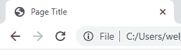
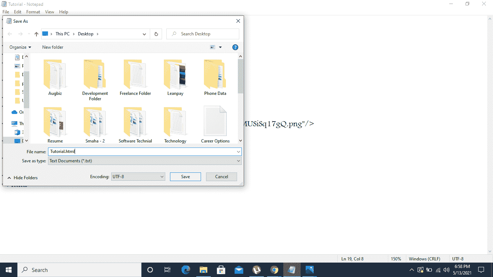
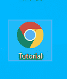
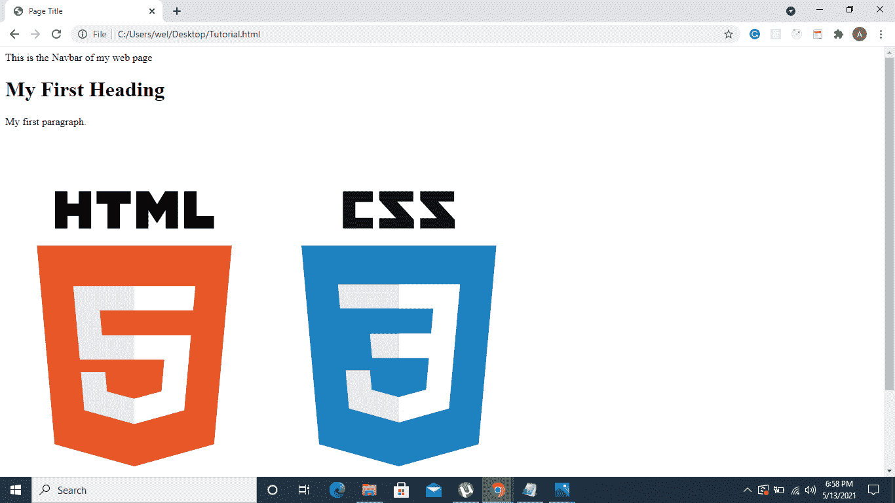
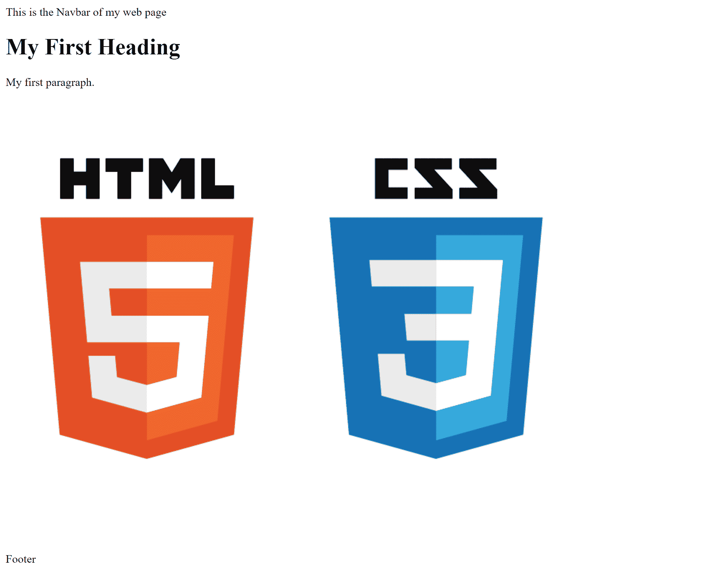
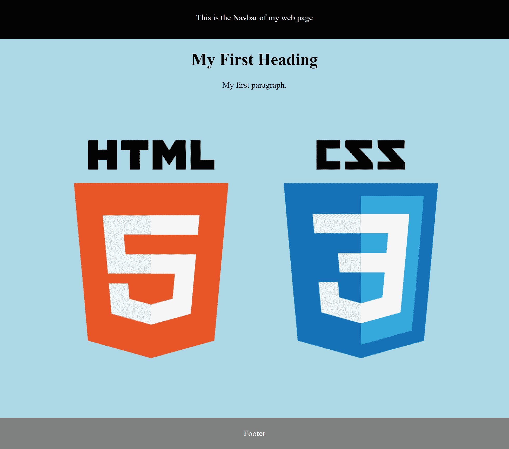

# 面向初学者的网页开发——学习基本的 HTML 和 CSS 来创建你的第一个网页

> 原文：<https://www.freecodecamp.org/news/web-development-for-beginners-basic-html-and-css/>

你有没有想过网站是如何建设和设计的？你想学习 web 开发的艺术，但是你还不了解技术吗？

好吧，那么这个教程是给你的。这是给初学者的网页开发入门，所以即使你对这个主题完全陌生，你也可以学习基础知识。

# **HTML 基础——网页的结构**

HTML 代表超文本标记语言。现在，在我们深入了解 HTML 是如何工作的之前，让我们对`Hyper-Text Markup Language`的实际含义有一个基本的了解。

`Hyper-Text`指您在文本、图像或书签上看到的超链接，这些超链接会重定向到另一个页面、文件、文档或网页的另一部分。

标记语言只是一种计算机语言，它包含定义文档中元素的标签。标签的一个例子是博客的标题，它通常被写成一个`h`标签。

还有更多的标签，其中一些我们稍后会发现。

你可以简单地把 HTML 想象成一个网页的结构。比如，假设你要建一栋房子。建筑的第一步应该是构建它的框架和整体结构吧？

您将对地下室、墙壁、草坪、车库等进行布局。你可以这样想象 HTML——它是网页的组成部分。

在一个网站上，这可能是导航栏，主体/内容，页脚，侧边栏，以及页面的所有结构部分。那些都是基于 HTML 的。

## 如何开始使用 HTML

有很多代码编辑器，比如 VS Code、Sublime Text 3、Atom 和 Brackets。这些对你来说可能听起来很奇怪。所以，我们先从使用`Notepad`开始，你可能会用它来写笔记之类的东西。

让我们看看如何用一些基本代码用 HTML 创建一个简单的网页结构。

我们将设计一个包含几个不同部分的网页:一个导航栏，一个包含标题、段落、图片和页脚的主体。

```
<!DOCTYPE html>

<html>
    <head>
        <title>Page Title</title>
    </head>
    <body>

        <nav>This is the Navbar of my web page</nav>

        <h1>My First Heading</h1>
        <p>My first paragraph.</p>

        

        <footer>
          <p>Footer</p>
        </footer>

    </body>
</html>
```

在上面的代码中，`<!DOCTYPE html>`声明意味着这个文档是一个 HTML5 文件。

这里的`5`只是指版本，因为 HTML 已经走过了很长的路，并从它以前的版本得到了改进。版本`5`只是指其最新的、稳定的版本。这里不需要担心之前的版本。

作为 HTML 网页中所有元素(标题、小标题、段落等等)的根元素。

`<head>`包含页面上的元信息(关于信息的信息，如作者、截止日期、关键字列表、文档作者)。

`<title>`指的是当你打开一个网页时，你在浏览器中看到的网页标题。这里举个例子供你参考。在这幅图中，`Page Title`是指标题标签的东西。



所有网页内容都在这里，比如标题、段落、图片、整个用户界面。

`<nav>`代表导航栏，应该在最上面，然后是主体内容，最后是`<footer>`。

主体由一个标题组成，标题由一个`<h1>`标签表示(带有`h`的`1`表示标题的大小)。标题大小从 1 到 6，1 是最大的，6 是最小的)。接下来是段落标签`<p>`，然后是图片标签``，最后是页脚，网页的最后一部分。

注意，图像标签中有关键字`src`。`src`指的是图像的来源，在本例中是取自网络的图像。因此，我们附上了图片的 URL 链接。

所有这些标签都以`<>`左尖括号开始，以`</>`尖括号结束，正如您在代码片段中看到的。

你可以在这里获得关于 HTML 文档的[结构的更多细节。](https://learn.coderslang.com/0041-html-document-structure/)

## 如何保存 HTML 文件并显示结果

你只需要按照这两个基本步骤来查看你的 HTML 网页。



1.  将您的 HTML 文件另存为`.html`文件。在我们使用的例子中，我们将文件保存为`Tutorial.html`。



2.在任何浏览器(Chrome、Firefox、IE)中打开文件，然后就可以查看你的 HTML 网页了。

## **我们基本 HTML 布局的结果**



你可以清楚地看到结果，虽然还没有任何颜色或样式。但是你仍然可以看到它的结构——导航栏后面是包含内容的主体，再后面是底部的页脚。

# 如何用 CSS 给 HTML 添加颜色、样式和力量

CSS 代表级联样式表，级联样式表是为 HTML 结构元素添加颜色、样式和功能的设计表文件。

你可以把 CSS 看作是你为了让你的房子看起来漂亮而添加的油漆、装饰和设计元素。

有多种方法可以将 CSS 添加到 HTML 结构中。让我们探索一下最基本的技术，即通过`<style>`标签添加 CSS。

```
<head>
	<title>Page Title</title>

    <style>

    body {
      background-color: lightblue;
      margin: 0;
      text-align: center;
    }

    nav {
     background-color: black;
     width: 100%;
     color: white;
     height: 50px;
     padding-top: 25px;
    }

    h1 {
     color: black;
    }

    footer {
     background-color: gray;
     color: white;
     padding: 5px;
    }

    </style>
</head>
```

## **CSS 说明**

您可以看到，在上面的代码中，我们通过文档的 head 标记内的 style 标记添加了 CSS。这是添加 CSS 的一种基本方式。

让我们把它分解开来，研究一下我们在上面四个单独的元素中使用的 CSS 属性。

### 主体元素

```
body {
  background-color: lightblue;
  margin: 0;
  text-align: center;
}
```

主体 CSS 选择器指的是我们看到的整个用户界面结构。我们添加了一些 CSS 样式属性:

*   这增加了背景色——这里是浅蓝色
*   管理网页结构两边的空间
*   `text-aligned center`这意味着在这种情况下，所有内容都将居中对齐。

由于所有这些 CSS 都应用于整个网页，所有内部元素将自动观察这些 CSS 属性，直到它们自己的属性被指定为不同于这个全局属性。

### 导航元素

```
nav {
 background-color: black;
 width: 100%;
 color: white;
 height: 50px;
 padding-top: 25px;
}
```

导航选择器引用网页的导航条，并对其应用设计属性。

我们将它的背景颜色设置为黑色，宽度设置为`100%`，这样它就占据了整个宽度，它的颜色代表了导航条中文本或链接的颜色，它的`height`设置为`50px`，我们给了它一个`25px`的`padding-top`。

`Padding`指内容和边框之间的空间。现在，因为我们希望文本是`center-aligned`，我们必须添加`half`的填充，即导航条实际高度的像素，所以这就是`50px (height of the navbar) / 2 = 25px`。这将确保导航条内的文本居中对齐。

### h1 元素

```
h1 {
 color: black;
}
```

`h1`选择器将 CSS 应用于`h1`标签。在这里，我们将`color`属性应用为`black`。

### 页脚元素

```
footer {
 background-color: gray;
 color: white;
 padding: 5px;
}
```

这是最后一个引用我们网页页脚的选择器。这里，我们已经为`navbar`设置了一组类似的属性，所以这里没有什么新的东西。

就是这样！

# **在** A **添加 CSS**后的**网页是什么样子**



你现在可以看到 CSS 给我们的基本 HTML 结构增加了多少活力和力量。是不是很神奇？

这些只是网页设计的基础，但是一旦你学会了它们，它实际上是非常有趣的。

# ****结论****

现在，你已经学会了网站设计的基础，你可以看到它是多么的平易近人，多么的实用，以及它是如何与许多现实生活中的概念联系起来的，比如建造一所房子。

所以，如果你觉得这很有趣，那么你一定要探索更多关于网页设计的世界。你可能想从学习 HTML 颜色和如何使用它们开始。

如果你对现代网络开发有兴趣，看看我的[全栈 JavaScript 课程](https://js.coderslang.com)。