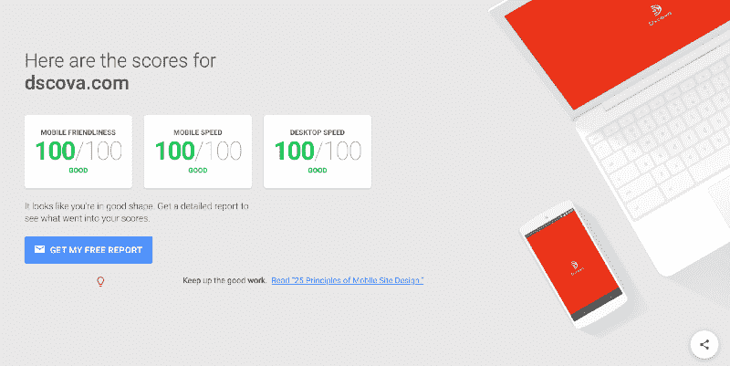

# 网络为你准备好了，榆树

> 原文：<https://www.freecodecamp.org/news/web-is-ready-for-you-on-line-elm-d3aa14dbf95/>

作者:博罗夫斯基

# 网络为你准备好了，榆树

#### 一名开发人员喜极而泣，他建造了一个 PWA

从小到大，当电影导演是我狼人牙齿的使命。谁知道这个前端的东西会这样消耗我。但这一切都很好，因为创造真正帮助人们的艺术可能是统治所有人的唯一工作。

从 Flash 是在屏幕上制作圆角的两种方式之一的时候起，我就一直很喜欢它。当我能够证明网络可以成为快乐的源泉时，我是最开心的。

从那以后，情况越来越好。

然而现在，我观察到公司仍然优先考虑本地应用程序开发。我需要展示网络是如何为令人惊叹的移动体验做好准备的。

在我自己的圈子里，我被认为是在动画和表演上投入非理性努力的家伙。对我来说，世界上最漂亮的东西是没有精心制作的过渡叙事，有助于引导视觉体验。

最近，我得到了一个我非常珍惜的机会。它会让我的用户在使用它时有感觉，就像我在创建它时的感觉一样。

认识一下[Dscova.com](https://dscova.com/)——这个平台让我们公开分享和吹嘘我们值得享受的经历。

它生长，它收缩，它跳舞，它滑动，当你触摸它时，它变得兴奋。如果你选择将它添加到主屏幕，它将永远跟随你。是你过分依恋的网络应用，你并不羞于向朋友介绍。

有一点是清楚的，那就是它没有盲目地遵循任何设计准则。它有自己独特的音调。为此我们要感谢我的兄弟迭戈。我喜欢和有自己观点的设计师一起工作。

Dscova 应该是我确信在移动网络上一切皆有可能的定义。这是我迄今为止最喜欢的宝贝。但愿我能叫它乔治。

你注意到了吗？我也没有遵循**几乎**严格的发布应用外壳的指导方针。相反，我在服务器的初始响应中嵌入了一个 splash。这就是我如何能够让用户知道他们在正确的位置，以一种快速而流畅的方式。

当然，我知道很多大公司都采用 app shell 方法。

But if you are like me, you are **almost** pissed off too when you’re faced with a useless/broken UI for seconds at a time.

我相信，慢慢消退的飞溅为用户准备了一个更好的方式，为众所周知的应用程序行为，总是在飞溅之后。

在演示 Dscova 的时候，我发现一些临时用户忘记了他们是在网上。这并不奇怪，因为他们关心的是体验，而不是平台。

所以我希望你放下一切，加入这一浪潮。尤其是如果你是曾经让我在手机上开心过的艺术家之一。

我知道你可能不愿意今天就做这个转变。正如你所认为的目前的应用程序商店是巨大的和无可争议的，想象一下网络迟早会变成一个没有商店的应用程序商店。没有登录页面。仅仅是与操作系统集成以及相互集成的应用。

如果你认为今天的用户懒惰，意识到他们的时间，屏住呼吸等待意想不到的抱怨:

> “我已经打开了他们的应用程序，但他们希望我去某个应用程序商店安装其他东西。他们说这是他们的应用。我很困惑。”

今天的用户一般一看到 web 就知道了。我和他们一起笑得最开心。为了理解我的意思，并欣赏 PWA(渐进式网络应用程序)的安装过程，向非技术用户展示它，并等待最可爱的“嗯..(明显地看着你)是这样吗？?"反应。

我们要感谢谷歌在这方面为我们和我们的用户所做的努力。不过，更重要的是里面的东西。

愉快是可能的。60 fps 是可能的。这些视图所做的所有奥林匹克体操，除了有趣之外，还旨在帮助用户理解正在发生的事情。一切都去了哪里，一切都从哪里来。但是，尽管他们很可爱，他们对复杂的国家管理的需求却给我们带来了压力。看看这个美人:

这是我最喜欢的互动。对用户来说，这简直是天衣无缝。然而在幕后，看似不相关的上下文正在进行一些优雅的交流来实现这一目标。虽然对于 OO(面向对象)系统来说不是这样，但是这里任何视图元素都可以访问任何应用程序状态，而不会产生任何后果。我会在这里等到它被理解为止。

我们不需要呼唤外在的状态，也不需要等待。是因为体制的性质。这是因为整个应用程序状态是一个到处可用的单一数据包。因为状态是不可变的，只有明确要求更新其上下文子数据包的上下文才能这样做。多好的句子。

在此示例中，开发人员设计了地图状态，并基于位置状态更新实现了 pan。当在体验创建向导的上下文中，所有下一个开发者需要做的是:

我是说，我可以用语言来解释，但是看看这个。那是英语。

注意`currMapCenter`是如何存在的。当有新的地图中心坐标时，不需要特殊的反应策略。他们只是..那里。

这不仅使得解决这个用例成为一个笑话，而且预先打包了不变性的数据保证使我们不必担心在上下文之外操纵地图状态。而我们所说的无忧无虑的发展是什么？

这就是快乐，我的隐形昆虫挤压朋友。

欢乐！

我还没有提到我们使用 [Elm](http://elm-lang.org/) 吧？很抱歉。嗯，我管理的这个小团队，在 Elm 之后，变得更大了，尽管人数还在。我们不能通过哨兵的自由计划。我们也没有任何测试工作留给我们的家庭成员。我们提供алва[1]这样的功能。所以原谅我，当我假设每个人都在榆树列车上或到达那里。

听着，我不知道这对你有多重要，因为没有数字可以衡量用户的满意度，但是让我们看看:

Just a little something that comes as a bonus with Elm builds.

考虑一下这个应用程序，它有 37K 行 Elm，280KB gzipped 大小，其中 40%是库，通常在 4 秒内第一次加载。我不知道我到底什么时候需要考虑懒惰地拆分和加载模块。这是其他平台所必须的。

黑暗故事时间:去年我们在做 Angular 2 项目。从早期的测试版开始。当我们完成它时，NG 是稳定的，但应用程序需要 20 秒才能启动。这是因为它需要在每次启动时编译设备上的视图。首先，我们花了很长时间才意识到这一点。然后，我们不得不在发布应用程序之前等待提前发布的编译器。我说过，一个[黑暗的故事](http://www.games-wiki.org/wiki/Black_Stories/)。去和朋友玩吧。以“产品发布延迟”开始。[2]

我相信当我们在第一轮测试中得到
**100，98，98** 时，你能感觉到我的欣慰。然后我们启用了长期缓存和..你可以看到成百上千的。

在本文中，我始终与实现细节保持距离，因为最终，这才是最重要的。我的这种感觉..它是..让我这么说吧:你有没有注意到前端人员感到压力很大有多普遍？需要投入多少努力才能在游戏中独占鳌头？与现在前端发生的事情相比，有过更大的工具和技术爆炸吗？听起来像是自虐，如果我不喜欢这种狂热，我就不会发现函数式反应式编程。我就不会发现榆树。[3]

我终于生活在一个与技术无关的世界里。对于任何挑战，都有一个显而易见的解决方法。我只是专注于我最喜欢的东西:褪色、模糊和移动东西。

我不仅不再遭受“冒名顶替综合症”的折磨，我还感觉到了一种舒适的东西，它位于光谱的另一端。自从我开始关注 Elm 以来，每当我看到任何流行的框架或工具中推出大量新功能时，我通常会想:“哦，看，又一个来自 Elm 的想法。”Redux、不变性或无状态视图组件。或者更好的是，我意识到这是一个在榆树镇不存在的问题的解决方案。

我想让你意识到榆树给你的优势。他们可以疯狂地试图提高 JS。但是除非他们改变它，否则他们永远无法修复它。你知道我知道你知道他们不能这么做。因此，你将开始不断地构建东西，而不是不断地学习如何构建东西。[普利策](https://en.wikipedia.org/wiki/Pulitzer_Prize)拜托！

榆树完全是新的和不同的。没有比这更好的了。你要做的最困难的事情是忘记你用来处理问题的所有面向对象模式。)在榆树不存在。说真的。

你开始用下划线转换数据了吗？你是否已经不再使用类，而是使用模块作为封装环境？这些都是很好的第一步，可以让你在 Elm 的纯功能世界中轻松提高生产力。

但是，如果你已经在以功能反应的方式使用 React 或 Angular，你会发现 Elm 是每个人的想法的来源，也是它们最纯粹的形式。你一个人就能代替 20 个变成榆树之前的你。

这是个难题:一旦你陷入困境，谁来帮你？我知道这是你害怕的。这是一个小社区，所以支持是值得怀疑的。我该怎么说呢..在[一个房间](http://elmlang.herokuapp.com/)里，你再也找不到比他更敬业、更有能力的一群人了。我不知道他们在里面是怎么呼吸的！每个人都想打败其他人，看谁先帮助新来的人！

他和每个人都为任何事情争吵。但是当你在 Slack 上问一些事情的时候，很有可能他会在那里帮助你。

然后得到这个，Reddit 上有个每周一次的东西叫[“没有哑问题”](https://www.reddit.com/r/elm/)。什么？他们没用那个名字？？好吧..

我刚才说什么了..哦，是的，用 PWA 取悦用户，用 Elm 享受这样做。如果你绝对需要出现在应用程序商店，付出额外的 5%努力， [Cordova](https://cordova.apache.org) 会带你去那里。我们花了额外的时间，因为 Dscova 的核心功能之一是在用户走动时通知他们有什么了不起的东西在附近。由于后台地理定位还没有在网络上概念化，我们在混合版本中做了它。这一点，以及苹果不像谷歌喜欢 Chrome 那样喜欢 Safari 的事实。

让我们开始总结。不写榆树对我来说太过分了。

资源:当我们学习初学者资料时，这些是最好的:

*   书:[榆树在行动](https://www.manning.com/books/elm-in-action)由[理查德费尔德曼](https://twitter.com/rtfeldman)(一个伟大的家伙。只是。太好了。)
*   视频课程:[榆树初学](http://courses.knowthen.com/p/Elm-for-beginners)作者:[詹姆斯·马龙](https://twitter.com/uknowthen?lang=en)
*   视频课程:[用 Elm 构建 Web 应用](https://pragmaticstudio.com/courses/elm)作者:[实用工作室](https://pragmaticstudio.com)
*   去制造一些关于[松弛](http://elmlang.herokuapp.com)的噪音
*   听听我们的精神领袖在[榆树镇](https://elmtown.github.io)
*   我想在这里给那些喜欢我的人一个特别的提示，当我开始的时候，他们想马上开始制作一个应用程序。去学 Webpack 吧。我们过去习惯于囫囵吞枣，但是现在我们的构建过程非常好，非常紧凑，这要感谢为 Webpack 提供的[伟大的](https://github.com/elm-community/elm-webpack-loader) [工具](https://github.com/NoRedInk/elm-assets-loader)。

伙计们，请鼓掌，特殊道具来了:

The [Somebody](https://github.com/pdamoc) from the Elm community that I really hope you find for yourself.

那种牵着你的手帮你过马路的人。

The [associate](https://twitter.com/trajches) you can dream of.

唯一能胜过我的人。

[Some dude](https://github.com/evancz) that is too smart for his own good.

正因为如此，他现在不得不与每一个知道榆树应该朝哪个方向发展的聪明人竞争。

我们国家过去经常装运一些东西。
[2]棱角分明是今天的固体。AOT 编译器可以很容易地插入你的 Webpack 配置，或者更简单，你可能只是想使用他们的 [CLI](https://github.com/angular/angular-cli) 。
【3】Elm 其实已经不是一个反应式的平台了。它变得比那更直观。