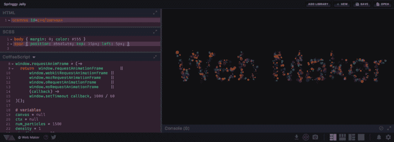
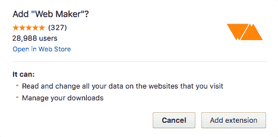

# web Maker——我如何构建一个快速的离线前端游乐场

> 原文：<https://www.freecodecamp.org/news/web-maker-how-i-built-a-fast-offline-front-end-playground-9fe3629bc86f/>

kushagra gour

# web Maker——我如何构建一个快速的离线前端游乐场



Web Maker 是一个 Chrome 扩展，它给了你一个超快的离线前端平台——就在你的浏览器里。

全世界成千上万的开发者每天都在使用它，并且有 700 多名用户对它进行了 [5 星评级。这也是 Chrome 网上商店的主页特色扩展，两次！](https://chrome.google.com/webstore/detail/web-maker/lkfkkhfhhdkiemehlpkgjeojomhpccnh/reviews)

您可以使用 Web Maker 在浏览器中处理 HTML、CSS 和 JavaScript，无需任何外部编辑器或特定设置。你可以使用 Angular，React，Sass，Babel，或者 Atomic CSS 这样的东西。

### 我为什么做 web maker

如果你是一名前端开发人员，你可能已经尝试过一个或多个代码平台——如 CodePen、JSBin、js fiddle——来解决代码问题或与同事讨论代码片段和逻辑部分。

他们都很棒，工作做得很完美。

但我在互联网上使用它们时总会感到一点摩擦——在启动它们和能够使用它们之间有一个固有的延迟。

我也想在旅行或在机场等的时候有一个快速的方法来破解东西，在那里你通常是离线的。我可以使用传统的编辑器和浏览器，但这需要一些设置。

当我想得更多的时候，我意识到世界上有许多地方互联网连接有限或者根本没有。那些想在那里学习和做网页开发的人不能使用这些在线游乐场。那不应该阻止他们学习和创造东西！

我试着寻找能给我想要的东西，但是什么也找不到。于是 Web Maker 诞生了。

### 我如何制作 Web Maker

Web Maker 的最初版本非常简单。它有三个可编辑的部分(CodeMirror 实例),分别用于 HTML、CSS 和 JavaScript。每当代码更新时，它都被组合成一个 HTML 字符串，所有内容都放在内联。这个 HTML 字符串然后被转储到一个 iframe 文档中并被呈现。

随着时间的推移，这一过程已经发生了变化，从那时起已经发布了多种功能。我将在本文中分享许多有趣的决策、特性、逻辑和挑战。

### Chrome 扩展——终极发布平台

我想为 Web Maker 提供一个非常简单的分发平台，因为它还处于早期阶段。我还想要一个覆盖面广的东西，所以我选择让它成为 Chrome 的扩展。

Chrome 网上商店很容易使用。推送更新非常简单快捷。Chrome 扩展平台还提供了一些功能，可以用来开发有趣的功能。Web Maker 中的一个例子是预览的屏幕截图。它使用`[captureVisibleTab](https://developer.chrome.com/extensions/tabs#method-captureVisibleTab)` API 抓取预览 iframe 的屏幕截图，然后使用`[downloads](https://developer.chrome.com/extensions/downloads)` API 通过点击按钮为您下载。

### 用普通的 JavaScript 和 CSS 编写

我曾在小型和大型应用程序中使用过像 [Angular](https://angularjs.org/) 和 [Vue](https://vuejs.org/) 这样的 JavaScript 框架。我也可以在这里使用任何可用的框架。但是对于 Web Maker，我决定用香草来挑战自己，看看没有框架我能走多远，直到代码库变成意大利面条。我想利用我从与这些框架和库的合作中获得的所有知识来保持代码的理智、组织和干燥。

和大多数项目一样，我从一个单独的`script.js` JavaScript 文件开始。为了保持代码库的模块化和组织化，我根据需要将大的独立块移出到单独的文件中(例如， [utils.js](https://github.com/chinchang/web-maker/blob/master/src/utils.js) 和 [dropdown.js](https://github.com/chinchang/web-maker/blob/master/src/dropdown.js) )。

除此之外，我还写了一个小的指令系统(就像 angular/Vue 中的一样),让我做一些事情，比如:

```
<a class=”btn” d-click=”someFunction”>Button</a>
```

和

```
<input d-change=”someOtherFunction” >
```

*注意:我不能使用像`onclick`或`onchange`这样的内嵌脚本。由于安全限制，它们不允许出现在 Chrome 扩展中。*

对于 CSS 也是如此，Web Maker 只依赖于浏览器提供的功能，如 CSS 变量。因为我只为 Chrome 开发 Web Maker，所以我可以安全地使用即将到来的新功能，而不用担心跨浏览器支持——这是构建 Chrome 扩展的另一个好处。

我计划研究 web 组件，将 UI 分解成独立的组件。

### 预览生成

正如我前面提到的，在应用程序的第一个版本中，最终的预览只是一个 HTML 字符串，将用户的 CSS 作为内嵌的样式标签，将用户的 JavaScript 作为内嵌的脚本标签。这个 HTML 字符串被写在一个临时的 HTML 文件中，该文件被加载到一个 iframe 中。HTML 文件看起来像这样:

```
<html> <head>  <style>   user CSS here...  </style> </head> <body>  user html here...  <script>user JS here...</script>  </body></html>
```

但在使用 Web Maker 2.0 版本时，我发现在 Chrome Canary(当时是 v57)上，预览版不再运行用户的 JavaScript。经过检查，我在开发者控制台中发现了一个 chrome 策略错误，上面写着:

> 拒绝执行内联脚本，因为它违反了以下内容安全策略指令…

现在，我已经知道内容安全策略(CSP)不允许我将内联脚本放入 Chrome 扩展的标记中，我将所有的 JavaScript 放在单独的文件中。这是不同的。从 Chrome 57 开始，CSP 也开始申请预览 iframes。解决方案是将用户的 JavaScript 从内联移动到一个单独的 JavaScript 文件。

所以我重构了逻辑，现在每次刷新时，用户的 JavaScript 都被写入一个临时 JavaScript 文件。然后将它加载到预览 iframe 中。

请注意，预览 iframe 不会在编辑器中每次击键时都刷新。刷新是在用户输入时[去抖](https://davidwalsh.name/javascript-debounce-function)——所以只有当用户停止输入一小段时间时，预览才会被刷新。否则，在用户输入时会导致大量不必要的刷新。

但是 CSS 更新有点不同。与刷新整个 iframe 的 HTML 和 JavaScript 不同，每当在 iframe 的 style 标签中编辑 CSS 时，它都会更新。不涉及文件写入或 iframe 刷新。因此，对于 CSS，预览刷新要快得多。

### JavaScript 中的无限循环预防

正如我上面提到的，一旦用户停止输入，预览就会刷新。此时，用户在 JavaScript 中编写循环时可能暂停了，导致了部分表单。类似于:

```
for (var i = 0; i<10; [user_cursor_here]) {}
```

这个 JavaScript 中缺少递增/递减条件——所以如果把它放在 iframe 中，浏览器选项卡会阻塞！像 Web Maker 这样的游乐场需要防止这种情况。

Web Maker 通过解析用户的 JavaScript 并修改所有循环来做到这一点，以便每个循环不断检查它是否运行了太长时间。

基本上，这:

```
for (var i = 0; i<10; [user_cursor_here]) {}
```

被转换为:

```
var _wmloopvar1 = Date.now();for (var i = 0; i<10; [user_cursor_here]) { if (Date.now() - _wmloopvar1 > 1000) { break; }\}
```

如果我们在一个循环中花了超过一秒钟，我们就会中断并出来。

我使用 [Esprima](http://esprima.org/) 来实现所有这些工具。这里有一篇[关于如何做到这一点的详细博文](https://kushagragour.in/blog/2017/02/web-maker-infinite-loop-prevention/)。注意，正如埃斯普里马的作者阿里亚·希达亚特[所建议的](https://twitter.com/AriyaHidayat/status/832302074704523267)，博文中提到的逻辑最近被重构为更有效。

### 预处理器

像大多数前端游乐场一样，Web Maker 为每个 HTML、CSS 和 JavaScript 提供了许多预处理程序。

在应用程序中添加任何预处理器都需要掌握它的 transpiler(源到源编译器),并了解它如何传输输入代码。您还需要知道它在每一行旁边显示 transpilation 错误。

现在几乎所有的在线游乐场都在他们的服务器上传输你的代码。但是 Web Maker 没有服务器，它位于您的浏览器中并在您的浏览器中运行。

许多 transpilers 只能在 NodeJS 环境中运行，所以我努力将它们捆绑到浏览器兼容代码中。Web Maker 使用像 [CoffeeScript](http://coffeescript.org/v1/browser-compiler/coffee-script.js) 、 [SASS](https://github.com/medialize/sass.js/) 和 [Babel](https://github.com/babel/babel-standalone) 这样的 transpilers。

在编辑器中的每次改变时，用户的代码被发送到适当的 transpiler，然后 transpiled 代码被发送到预览生成。我使用基于 Promise 的 API 来传输代码有两个原因:

1.  SASS transpiler 不是同步的。它使用一个工作线程将 SASS 代码转换为单独线程上的 CSS 代码。
2.  我可能会将其他 transpilers 也转移到一个单独的工人。源代码编译有时会花很长时间。这也可能导致无限循环，在这种情况下阻塞主 UI 线程。因此，最好将它们转移到单独的工人那里。

例如，从广义上讲，转换 JavaScript 的函数如下所示:

```
function computeJs() { var d = deferred(); if (jsMode === JsModes.COFFEESCRIPT) {    try {   code = CoffeeScript.compile(code, { bare: true });  } catch (e) {   showErrors(    'js',    [{ lineNumber: e.location.first_line, message: e.message }]   );     } finally {   d.resolve(code);  }}
```

### 储存；储备

Web Maker 的 2.0 版本附带了一个非常重要的功能来存储用户的创作。

我决定用`localStorage`。因此，即使你在不同的机器上工作，你也可以保存所有的 Web Maker 设置，如缩进大小、主题等。

如果连创作都像扩展的设置一样存储在同步存储中，那就太好了。这样，它们就可以跨设备访问。然而，同步存储的空间配额相对较低，我不想拿保存的工作冒险。

在未来的版本中，您可能可以将所有工作保存在云上！

Web Maker 还可以选择导出和导入所有保存的作品。

### 构建于开放网络技术和开源库之上

Web Maker 建立在多个优秀的开源库之上，它本身也是开源的。

您实际输入代码的三个编辑器窗格是用 [CodeMirror](https://codemirror.net/) 构建的。CodeMirror 附带了许多插件和模式，这使得 Web Maker 可以支持代码自动完成、代码折叠、语法突出显示和主题。

多亏了 [Esprima](http://esprima.org/) ，当您在编辑器中键入时，您可以看到代码中的一般 JavaScript 错误。正如我之前提到的，Esprima 还有助于防止无限循环。

除了 Web Maker 用 [Split.js](https://nathancahill.github.io/Split.js/) 、 [Hint.css](https://kushagragour.in/lab/hint/) 、 [Emmet](https://emmet.io/) 、 [Inlet.js](https://github.com/enjalot/Inlet) ，甚至 Web Maker！是的，Web Maker 是在 Web Maker 内部制作的。

### 挑战

在发展过程中有许多减速，但我想谈谈两个主要问题。

正如我提到的，当我在 2.0 版本工作时，我发现 Chrome 57 中有一个重大变化，它打破了将内联脚本放入扩展标记的能力。

2.0 还提供了一个特性，允许用户添加任意数量的外部 JavaScript 或 CSS 库。当用户输入一个 JavaScript 库 URL 时，它被添加为一个脚本标记，并将`src`属性设置为 URL。Chrome extension CSP 除了阻止内嵌 JavaScript 之外，还限制 JavaScript 加载 CSP 中提到的域之外的域，这意味着用户将无法从任何随机域加载外部 JavaScript。

目前，通过将所有主要的 cdn 列入`manifest.json`文件中的白名单，可以部分解决这个问题。它仍然不完美，因为用户不能从除这些域之外的任何域加载 JavaScript。

另一个让我印象深刻的是*的预览截图*功能。该功能允许用户抓取当前预览的截图，并通过点击按钮将其下载为图像。这个特性要求我再引入两个权限:`downloads`和`<all_ur` ls >。

ls >实际上是一个奇怪的许可，但如果你想使用 bleTab API，这是必须的。下面是安装扩展时的样子:



Permissions dialog while installing Web Maker

第一行对任何安装扩展的人来说都很可怕。

此外，如果您为新版本的扩展添加新权限，Chrome 会禁用已安装的扩展，并显示一个弹出窗口，提示该扩展需要新权限。

这给一些已经安装了 Web Maker 的用户敲响了警钟。很多人看到这个新权限被要求，不允许，马上卸载了。

在这个特别的版本之后，我看到卸载的数量有一个很大的峰值。

这个故事的寓意是:小心你添加到应用程序中的权限。除非核心功能需要，否则总是选择可选的应用内权限。

### 总结一下

Web Maker 在可用性、功能和采用方面已经取得了长足的进步。快速和离线使得它可以在大量的场景中使用，从在火车上/飞机上做网络实验到给一个教室的学生上课。

Web Maker 也可以由专业人员和初学者在互联网速度慢或根本不存在的地区使用。

我相信 [Web Maker](https://webmakerapp.com/) 可以极大地帮助[自由代码营](https://www.freecodecamp.com/)的营员们学习和实践。

此外，Web Maker 是开源的，所以欢迎每个人建议和实现他们认为会使它更有用的功能。这可能是你通过投稿学习[一些实用 JavaScript](https://hackernoon.com/unconventional-way-of-learning-a-new-programming-language-e4d1f600342c) 的第一步。

如果您有任何建议、意见或问题，请发推特 [@webmakerApp](https://twitter.com/webmakerApp) 。我很高兴听到您的反馈和体验。

[安装 Web Maker](https://webmakerapp.com/) 并试一试，在 Medium 上跟随 [Web Maker](https://medium.com/web-maker) 获取提示、技巧和操作文章。