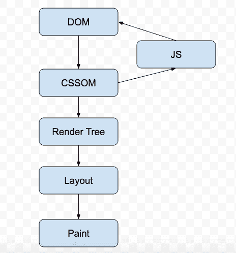
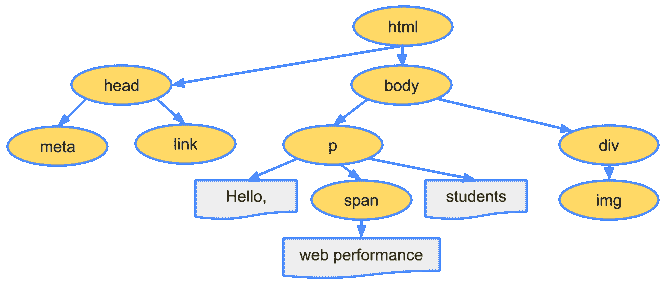
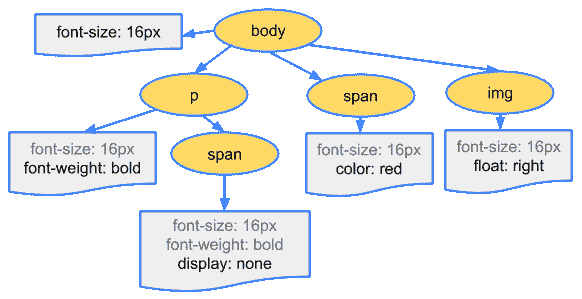
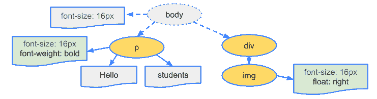
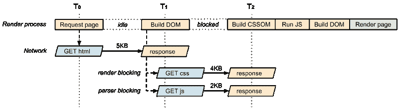
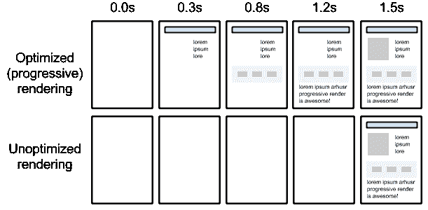
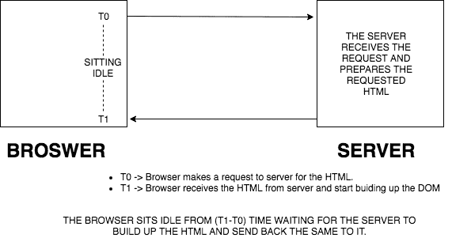
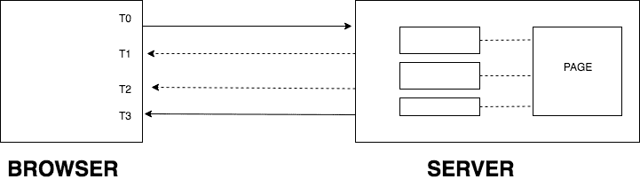
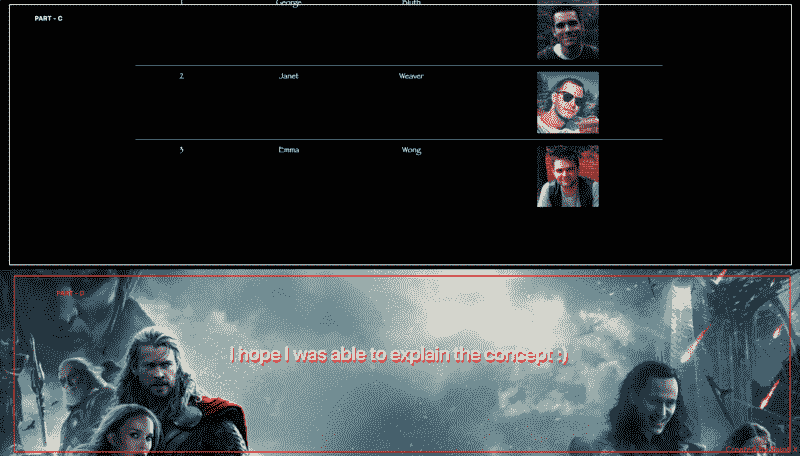
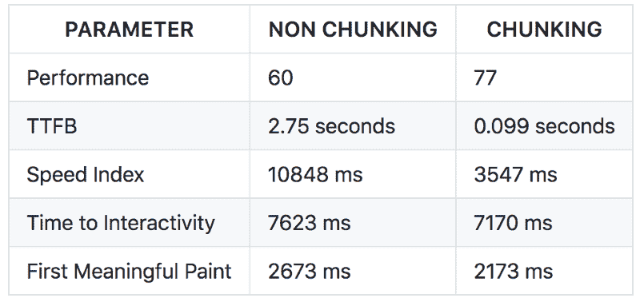

# 你可能错过的网页优化技巧

> 原文：<https://www.freecodecamp.org/news/web-optimization-a-secret-world-to-unleash-5fbdf1065945/>

作者:哈诺尔·班迪什

# 你可能错过的网页优化技巧


你有没有想过为什么谷歌搜索页面或亚马逊网站加载速度非常快？在我向您介绍这个概念的时候，请不要离开我，这个概念极大地提高了页面性能。但是首先，让我们回顾一下导致这个想法的一些概念。

### 分析关键渲染路径(CRP)

首先，让我们定义将要使用的词汇:

1.  **关键资源**:可能阻塞页面初始呈现的资源
2.  **到达第一个字节的时间(TTFB)** :测量从浏览器发出 HTTP 请求到浏览器收到页面的第一个字节的持续时间

优化 web 性能就是要理解接收 HTML、CSS 和 JavaScript 文件与将它们转换为渲染像素所需的处理之间的中间步骤发生了什么，这就是关键渲染路径(CRP)。

在呈现页面之前，浏览器必须经历以下所有步骤:



当浏览器第一次点击页面时，它下载 HTML 文件。然后开始构建 DOM(文档对象模型)树。HTML 中的每个标签代表 DOM 树中的一个节点，这个节点包含了所有关于它的信息。让我们举个例子来理解这一点。

假设浏览器从服务器接收到以下 HTML:

```
<html>
 <head>
   <meta name="viewport" content="width=device-width,initial-      scale=1">
   <link href="style.css" rel="stylesheet">
   <title>Critical Path</title>
 </head>
 <body>
    <p>Hello <span>web performance</span> students!</p>
     <div></div>
 </body>
```

浏览器将其转换为一个名为 DOM 的树对象，如下所示:



Source: [https://developers.google.com/web/fundamentals/performance/critical-rendering-path/constructing-the-object-model](https://developers.google.com/web/fundamentals/performance/critical-rendering-path/constructing-the-object-model)

**注意**:DOM 构建过程是增量的。这是我写这篇文章的想法的基础。

当浏览器构建 DOM 时，它在引用外部 CSS 样式表的`head`部分遇到了一个`link`标记。

预计到它需要该资源来呈现页面，它调度对该资源的请求，该请求返回以下内容:

```
body { font-size: 16px }
p { font-weight: bold } 
span { color: red } 
p span { display: none } 
img { float: right }
```

然后，浏览器创建 CSSOM (CSS 对象模型):



Source: [https://developers.google.com/web/fundamentals/performance/critical-rendering-path/constructing-the-object-model](https://developers.google.com/web/fundamentals/performance/critical-rendering-path/constructing-the-object-model)

CSSOM 和 DOM 树组合在一起形成一个渲染树。然后，渲染树用于计算每个可见元素的布局。

这是渲染树的样子:



Source: [https://developers.google.com/web/fundamentals/performance/critical-rendering-path/render-tree-construction](https://developers.google.com/web/fundamentals/performance/critical-rendering-path/render-tree-construction)

一些节点是不可见的——例如脚本标签和元标签——并且被省略，因为它们没有反映在渲染输出中。一些节点通过 CSS 隐藏，也从渲染树中省略。

现在渲染树就位了，我们可以开始布局步骤了。布局过程的输出是一个“盒子模型”，其中每个元素的确切位置和大小被捕获。所有相对测量值都被转换成屏幕上的绝对像素。

最后，现在我们知道了哪些节点是可见的，以及它们的计算样式和几何形状，我们可以将这些信息传递到最后阶段。该阶段将渲染树中的每个节点转换为屏幕上的实际像素。这一步通常被称为“绘画”。

**注意**:CSS 渲染阻塞。在构建 CSSOM 之前，浏览器无法继续执行渲染树步骤。因此，我们需要尽快将 CSS 文件提供给浏览器，这就是为什么我们在`head`部分保留所有的`link`标签。

现在让我们将 JavaScript 添加到我们的示例中:

```
<html>
 <head>
   <meta name="viewport" content="width=device-width,initial-scale=1">
   <link href="style.css" rel="stylesheet">
   <title>Critical Path</title>
 </head>
 <body>
    <p>Hello <span>web performance</span> students!</p>
    <div></div>
    <script src="app.js"></script>
 </body>
```

默认情况下，JavaScript 执行是“解析器阻塞”。当浏览器在文档中遇到一个`script`标签时，它执行以下步骤:

1.暂停 DOM 构造

2.下载文件

3.将控制权移交给 JavaScript 运行时

4.让脚本在继续 DOM 构造之前执行

浏览器不知道脚本打算在页面上做什么，所以它假设最坏的情况并阻塞解析器。

坚持住！！！这还不是 DOM 解析时可能发生的最糟糕的情况。在最后一个例子中，我们可以看到浏览器需要下载 CSS 和 JavaScript 外部文件。

现在，假设 CSS 文件需要一些时间来下载，与此同时 JavaScript 文件也被下载。现在，浏览器将假设最坏的情况，JavaScript 可能会查询 CCSOM，这就是为什么它不会开始解析 JavaScript 文件，直到 CSS 文件下载完毕并且 CSSOM 准备就绪！

让我们看一张图，它可能有助于我们更好地理解我想说的话:



Source: [https://developers.google.com/web/fundamentals/performance/critical-rendering-path/analyzing-crp](https://developers.google.com/web/fundamentals/performance/critical-rendering-path/analyzing-crp)

CSS 对于任何网页来说都是**恶魔**！它也是呈现阻塞和解析阻塞。我们需要非常小心地处理它。

让我们研究一些优化 CRP 的方法。

### 优化 CRP

在这一点上，我们知道 CSS 可能是一个恶魔。尽快将它发送给客户端，以优化第一次渲染的时间。如果我们有一些只在特定条件下使用的 CSS 样式怎么办？例如，当页面正在打印或被投影到大屏幕上时？

如果我们不必在这些资源上阻止渲染就好了。CSS“媒体类型”和“媒体查询”允许我们处理这些用例:

```
<link href="style.css" rel="stylesheet">
<link href="print.css" rel="stylesheet" media="print">
<link href="other.css" rel="stylesheet" media="(min-width: 40em)">
```

[媒体查询](https://developers.google.com/web/fundamentals/design-and-ux/responsive/#use-css-media-queries-for-responsiveness)由检查特定媒体特征条件的媒体类型组成。例如，我们的第一个样式表声明不提供媒体类型或查询，所以它适用于所有情况。也就是说，它总是呈现阻塞状态。

另一方面，第二个样式表声明仅在打印内容时适用。因此，这个样式表声明不需要在页面第一次加载时阻止页面的呈现。

最后，如果条件匹配，浏览器将执行最后一个样式表。如果条件不匹配，浏览器不会阻止渲染。

在声明样式表资产时，请密切注意媒体类型和查询。它们会极大地影响关键的渲染路径性能。

默认情况下，所有的 JavaScript 都是解析器阻塞的。给浏览器一个不需要在引用脚本的地方执行脚本的信号，允许浏览器继续构造 DOM，并让脚本在准备好的时候执行。例如，从高速缓存或远程服务器获取文件后。

为此，我们将我们的`script`标记为`async` :
`<script src=”app.js” async></script>`

将`async`关键字添加到`script`标签中，告诉浏览器在等待脚本可用时不要阻塞 DOM 构造，这可以显著提高性能。

`async`属性的另一个优点是`script`在等待 CSSOM 准备就绪时不会被阻塞。

分析脚本是`async`属性的一个很好的例子，因为`script`不会以任何方式改变 DOM。`script`标签还有一个属性，就是`defer`。你可以通过访问[这里](https://hacks.mozilla.org/2009/06/defer/)来了解`defer`。

最后——文章的顶点到了，我将告诉你主要的秘密——除了上面提到的优化——大公司应用并创造奇迹…

### 从服务器成批发送 HTML

看看下面的图片，然后决定:你希望你的网站以何种方式呈现？



Source: [https://developers.google.com/web/fundamentals/performance/critical-rendering-path/](https://developers.google.com/web/fundamentals/performance/critical-rendering-path/)

有答案了吗？当然是第一个啦！没有人真的喜欢看到空白的一页这么久。更好的做法是在网页上以块的形式呈现 HTML，这是谷歌搜索页面、亚马逊和其他巨头所做的。

现在，当你第一次点击任何一个网站的 URL 时，整个网页的 HTML 就会在服务器上建立起来。在此之前，浏览器是闲置无所事事。

在服务器上构建 HTML 之后，它被传递到浏览器。然后，浏览器开始构建 DOM，并遍历前面提到的所有 CRP 步骤。

下图将帮助我们更清楚地了解这一点:



那么，我们为什么不优化浏览器的空闲时间，让它通过向服务器发送准备好的 HTML 块来开始构建 DOM 呢？换句话说，我们可以在 HTML 准备好的时候就把它们清除掉，而不是等待整个 HTML 准备好。这将使浏览器开始构建 DOM/CSSOM 树，而不是等待空闲。这难道不是一个好主意吗？

我希望下面的图表能更清楚地说明这一点:



页面在服务器上被分成 HTML 块。现在，服务器不是等待整个 HTML 准备好，然后提供给浏览器，而是在服务器上准备好的时候发送 HTML 块。这意味着第一个块不会等待其他两个块准备好，它们在服务器上准备好的时候就会被提供给浏览器。

让我们举个例子来更好地理解这个想法。以下是谷歌搜索页面:


现在假设我们点击这个 URL，浏览器向服务器发送一个请求来服务这个页面。服务器开始构建这个页面，并且已经完成了 A 部分的 HTML，但是对于 B 部分，它需要从一些源获取数据，这将花费更多的时间。

现在，服务器不再等待 B 部分完成，而是将 A 部分完成的 HTML 刷新到浏览器，以便开始构建 DOM。

同时，服务器用所需的数据准备 B 部分的 HTML。这样，用户将能够看到网页在浏览器上逐渐加载。分块发送 HTML 也减少了到达第一个字节的时间，提高了页面的性能和页面速度指数。

这就是谷歌在他们的搜索页面中实际做的事情！即使是 Amazon 也是先抛出头部，而页面的其余部分在服务器上准备好。

分块发送 HTML 还有一个优化的目的。当您的`head`标签首先到达客户端时，浏览器启动 CSS 和标签中的其他请求。这有助于浏览器下载其他关键资源，而 HTML 的其余部分由服务器准备。

从服务器获取页面的典型时间约为 500 毫秒。但从服务器获取第一个块的典型时间约为 20-30 毫秒。原本在 500 毫秒后启动的 CSS 调用现在将在 20-30 毫秒后启动，使网页提升约 470-480 毫秒。您甚至可以`preload`标记中的重图像，这些图像将由尚未来自服务器的 HTML 使用，从而缩短页面加载时间！

现在的问题是:如何从服务器端发送 HTML。

不同的语言有不同的表达方式。我们在 Java 里有一个叫`flush`的方法，。NET 和 PHP。在 Node.js 中，只要我们的 HTML 块准备好了，我们就需要`res.write()`。

注意:浏览器不会重复调用服务器来获取所有的块。所有的 HTML 块都是通过对服务器的一次调用来提供的。

#### 我的匹克

我用 Node.js、Express 和 React 做了一个 POC，其中 React 组件呈现在 Node.js 上，每个组件的 HTML 一准备好就刷新到浏览器。你可以在这里找到源代码[。](https://github.com/HBandesh/TTFB-Optimization-React)

你可以在这里看到现场演示[。](http://www.harnoorbandesh.co.in/)

在演示中你可以看到链接。**移动到没有分块的页面**链接将带您到没有应用分块概念的页面。**移至分块页面**链接将带您进入应用了分块概念的页面。下面是页面截图。



该页面分为 4 个部分。在服务器上准备好 A 部分后，它会被刷新到浏览器，这样浏览器就可以开始构建 DOM 了。

B 部分是使用来自 API 的数据构建的，这需要一些时间。在此之前，浏览器在增量过程中将部分 A 的 HTML 创建为 DOM 构造。

当 B 部分的 HTML 在服务器上准备好的时候，它就被提供给浏览器。故事在 C 部分和 d 部分继续。

但是这里有一个问题:甚至在发送 A 部分之前，我还向浏览器发送了一个块，它是 HTML 的`head`标签。在`head`标签中，我已经预加载了页眉和页脚中的所有大标题图像，并对所有剩余图像进行了预连接和 dns 预取。点击了解更多关于预加载、预取和预连接[的信息。](https://developer.mozilla.org/en-US/docs/Web/HTML/Preloading_content)

`head`标签也包含 CSS 文件链接。现在，随着 A 部分在服务器上准备就绪，浏览器会调度对`head`部分中所有资源的请求，以便在 HTML 到达时页面能够更快地填充。

两个页面的性能测试都是在 Chrome 中 Lighthouse 扩展的帮助下进行的。结果非常令人鼓舞。

该测试在两个页面上运行 10 次，所有值的平均值显示如下:



了解更多关于[互动时间](https://developers.google.com/web/tools/lighthouse/audits/time-to-interactive)、[速度指数](https://developers.google.com/web/tools/lighthouse/audits/speed-index)、[第一次有意义的绘画](https://developers.google.com/web/tools/lighthouse/audits/first-meaningful-paint)。

这个基本的 idea 实现可以极大地提高网页的性能。我希望我能够解释这个概念。

如果你想在这个想法中做出贡献，或者如果你觉得可以做得更好，那么请继续，叉回购，创建一个新的分支机构，并向我提出拉请求。请在下面找到在本地打开应用程序的步骤:

1.  从[克隆到这里](https://github.com/HBandesh/TTFB-Optimization)
2.  在您的系统上安装节点
3.  在克隆代码的文件夹中运行`npm install`
4.  运行`npm run dev`生成`bundle.js`文件
5.  终止过程并运行`npm start`
6.  应用程序将开始在`8080`端口上运行

如果你觉得这篇文章有趣，请随时与你的朋友分享。:)