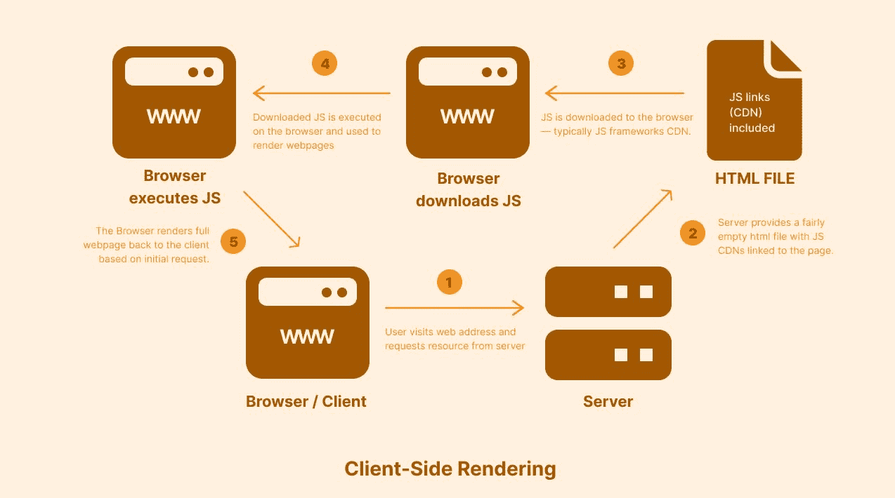
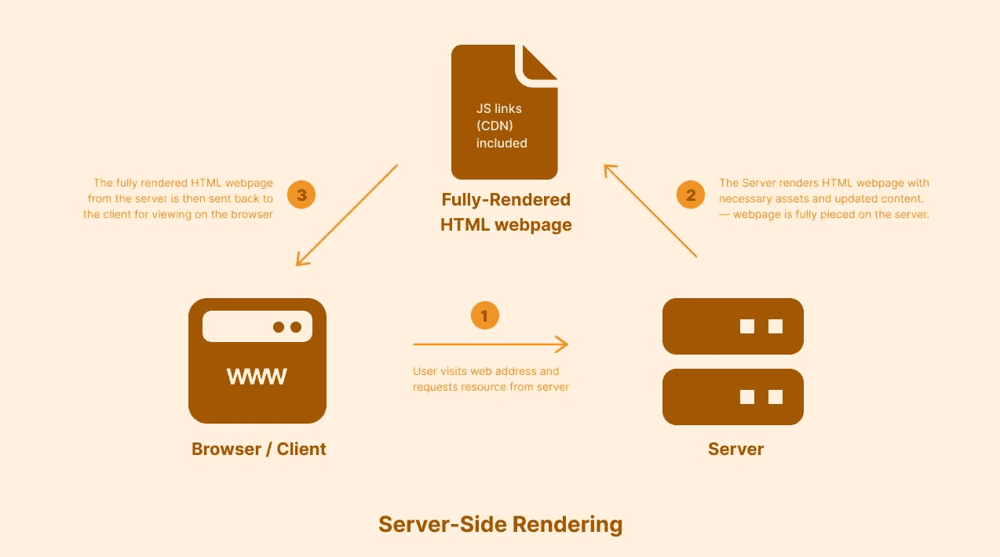
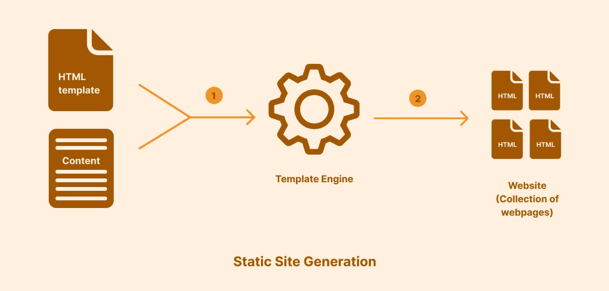

# 网页如何在浏览器上呈现——解释了不同的方法

> 原文：<https://www.freecodecamp.org/news/web-page-rendering-on-the-browser-different-methods/>

今天，全世界的计算机和网络都变得越来越快。总的来说，这对 web 开发和用户体验都有好处。人们能够实现的可能性已经向前迈出了一大步。

尽管许多地方增长明显，但其他地方在这场冲刺中落在了后面。最大的问题是，在这种数字鸿沟的情况下，我们如何平衡网络体验，让电脑和网络效率较低的人更容易上网？

在许多情况下，这个问题的答案在于理解我们如何在浏览器上呈现网页。

## 本文中使用的术语

在您继续之前，我想确保您熟悉本文中使用的术语。对于新开发人员来说，其中一些可能特别难以掌握。如果您已经熟悉这些，请随意跳到下一部分。

*   **服务器**:服务器是一台驻留在远程位置(主要是互联网)的计算机。它的工作是处理来自客户端的请求并处理响应。
*   **客户端**:客户端是与服务器通信以访问资源的任何设备。在许多情况下，客户端是可以访问互联网的任何设备。在本文中，您的 web 浏览器扮演客户端的角色。
*   **CDN** :内容交付网络的缩写。CDN 是“一个互连的服务器网络，为数据密集型应用加速网页加载”(来自 [AWS](https://aws.amazon.com/what-is/cdn/) )。
*   **构建时**:在构建时，您的应用程序代码是为另一个环境准备的。大多数时候—互联网上的托管环境。

现在让我们来了解一下网站呈现的不同方式。

## 什么是客户端渲染(CSR)？

客户端渲染在浏览器中生成网页，完全依赖于您的 JavaScript 代码。在用户看到网页内容之前，浏览器会完全处理您的 JS 代码。

你的 JavaScript 代码有助于动态定义网站下载后的**架构**。在这个上下文中，架构意味着从 [API](https://aws.amazon.com/what-is/restful-api/) 获取数据、网站导航以及网站上的简单业务逻辑。

### 客户端渲染和 JavaScript 框架

随着 React、Vue 和 Angular 等 JavaScript 框架和库的发布，客户端渲染越来越受欢迎。这些框架只有在 HTML 页面的头部包含 CDN 时才起作用——这些 CDN 通常包含很大的 JS 代码。

众所周知，大文件会导致下载时间增加，但这里有一个问题:在应用程序初始加载时下载大文件意味着访问该网站上其他页面的加载时间明显减少。

网站主要从 API 获取数据。然后，该数据用于填充客户端上呈现的页面。

您可以在我们今天使用的许多渐进式网络应用程序(PWA)中找到使用 CSR 的真实应用程序的常见示例，如 Spotify、Figma 和 Google Drive。

## 什么是服务器端渲染(SSR)？

在许多情况下，客户端渲染曾经改变了游戏规则，现在仍然如此。不过，仔细观察 CSR 的表现可以发现，一个网站的功能越多，它的 JS 代码也就越多。回想一下，更多的 JS 代码意味着更多的下载时间。

一些人不愿意在初始加载时大量下载以确保更快地访问所有网页。这导致了服务器端的渲染。

SSR 并没有解决网页渲染的所有问题。但是它解决了 CSR 面临的许多问题，比如首次访问时更快的加载时间，以及本文的优点和缺点部分强调的其他一些问题。

服务器端渲染有助于在收到浏览器的请求后立即在服务器上生成网页。使用 SSR，服务器呈现请求的资源所需的完整 HTML、CSS 和 JavaScript，并将其发送回浏览器。

这意味着您可以始终确保网站内容包含来自服务器的最新信息。你可以把它想象成一个 REST API 的集成——来自后端的内容总是更新的。

像所有其他在网络上呈现的方法一样，SSR 也有它的缺点。首先，必须向服务器发出加载网页的网络请求可能会影响互联网带宽较少的用户。SSR 还需要相对较高的计算能力来激活。

## 什么是静态站点生成(SSG)？

静态站点生成是在 web 上呈现的一种非常常见的方法。这是因为在 JavaScript 框架出现之前，大多数网站都是静态生成的。

静态站点仍然非常流行，但是有更好的方法来生成它们。这显示了他们在网络性能方面的重要性。

### 但是，什么是静态站点呢？

静态站点在浏览器上的呈现方式与它的生成方式完全相同。静态网站的内容通常不受用户查看的影响，不像 CSR 或 SSR 中呈现的 web 应用程序，每个用户都可以根据身份验证或授权来查看内容。

静态网站非常适合显示从不改变或偶尔更新的内容。

### 静态站点生成已解释

静态站点生成很大程度上涉及到网页构建过程的自动化。如今的 JavaScript 框架(如 Nuxt.js、Next.js 等)提供了模板引擎，可以用一个模板构建多个静态网页。可以想象，这样节省时间。

静态站点生成不同于 SSR 和 CSR，因为您的 HTML 网页是在构建期间(在用户尝试访问您的网页之前)呈现和生成的。这就是为什么 SSG 通常被称为预渲染。它预先做了艰苦的工作。

虽然 SSG 看起来很幸福，但也有权衡。使用 SSG 渲染的一个主要缺点是，必须为网站上每个可访问的 URL 生成一个页面。当你有动态页面时，这可能会变得更加乏味。

回想一下，静态站点非常适合显示很少更新的内容，所以这种呈现方法并不适用于所有用例。

## 不同渲染方法的优缺点

现在，您已经了解了所有这些呈现方法是如何为浏览器生成页面的，我们应该整合所有这些信息并进行一些比较。

我们将考察三个主要指标——性能、SEO 和成本。

### 表演

为了建立一个无论用户的互联网或计算机速度如何都可以访问的网站，我们需要考虑性能。在这种情况下，性能可以是网站从 API 加载或获取数据的速度。

随后的段落显示了 CSR、SSR 和 SSG 在绩效方面的转换。

#### 客户端渲染性能

客户端渲染的网站加载速度相对较慢。这是因为 JS 代码首先被下载并用于生成用户看到的实际内容。

通常，JS 下载量很大，尤其是 JS 框架。客户端呈现的网页可能还需要进行 API 调用来从后端获取数据。这增加了用户的加载时间。

#### 服务器端渲染性能

SSR 渲染网页可以非常快。这主要取决于服务器的速度和用户的速度。如果这两个条件都满足，SSR 在性能方面可以轻松获胜。

#### 静态站点渲染性能

使用 SSG 生成的网页相对较快，因为实际渲染不会在浏览器上进行。

SSG 为浏览器提供所需的内容，而无需额外的工作。SSG 渲染的网页，比如 CSR，可能也需要进行 API 调用来从后端获取数据。这也增加了用户的加载时间。

最终，网页中 JavaScript 的使用量决定了网页的性能。

### 搜索引擎优化

每一个需要知名度的网站都应该重视搜索引擎优化。SEO 决定了你的内容在谷歌这样的搜索引擎上的可访问性。它也决定了你在搜索引擎结果页面中的排名。

让我们看看这三种渲染方法在被搜索引擎索引时的表现。

#### CSR 搜索引擎优化

使用 CSR 呈现的网页通常没有有意义的内容，并且依赖于 JS 来生成内容。缺点是不是所有的网络爬虫都支持 JS，所以你的网站可能不会在搜索引擎上被正确索引。

#### SSR 搜索引擎优化

SSR 使用来自服务器的更新内容呈现完整的网页。使用 SSR 呈现的网页可以被搜索引擎抓取和索引。

#### SSG 搜索引擎优化

网络爬虫很容易抓取 SSG 生成的网页。它们不依赖于 JS 来完全渲染。

### 费用

当用户访问一个网站时，拥有最好的体验是很重要的，但是账单不会自己支付，所以这种体验的累积成本必须尽可能的少。

这三种渲染方法不具有相同的财务影响。下面的段落对每种方法的使用成本进行了更深入的研究。

#### 企业社会责任成本

客户端渲染 100%在浏览器上运行。这意味着不会产生额外的成本。

#### SSR 成本

服务器端渲染在服务器上远程生成全功能网页。这意味着额外的计算资源和额外的成本。

#### SSG 成本

没有成本。静态网站是在构建期间生成的。因此，生成的网页被托管，并且不需要在服务器上进行额外的渲染。

## 结论

在选择渲染方法时，根据您从本文中学到的知识，考虑您的用例以及最适合它的方法。不同的渲染方法适用于不同类型的网站。

一个电子商务网站开发者可能会选择 SSR 路线，或者觉得使用静态网站更安全。另一方面，web 应用程序开发人员可能不介意漫长的初始加载，只要这意味着从长远来看用户会有更好的体验。

无论您选择哪种渲染方法，都要确保您的网站尽可能具有可访问性——超出您不一定会遇到的情况。最后，永远不要忘记保持健康的 JS 饮食。