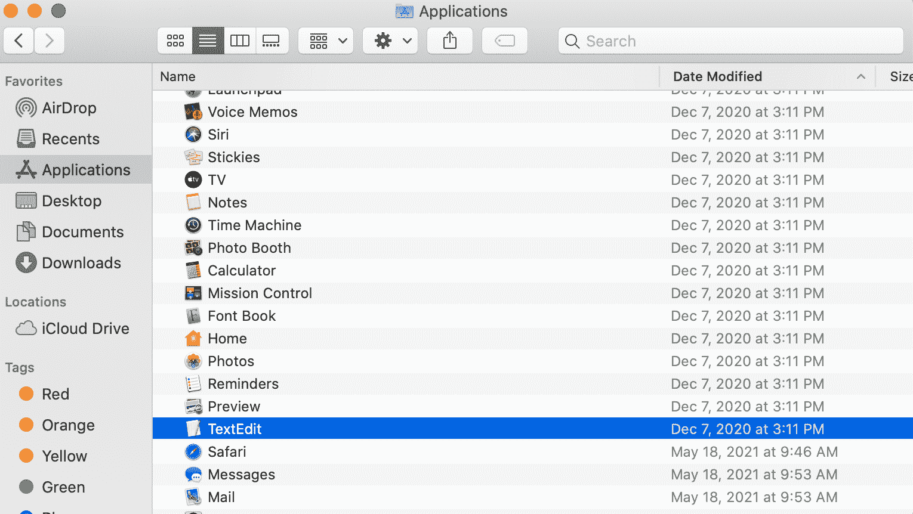
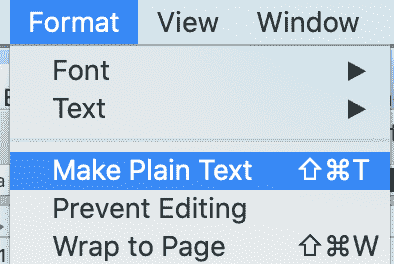
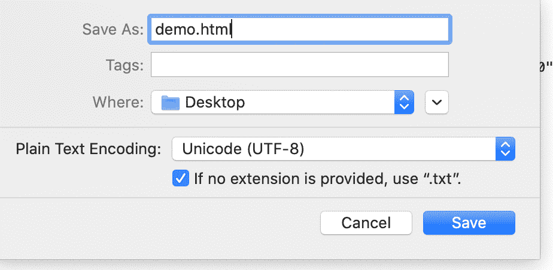
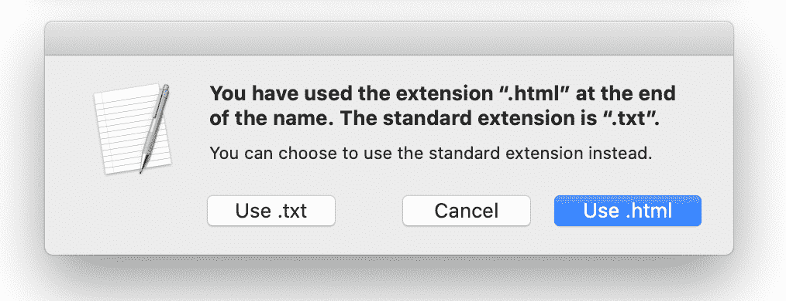
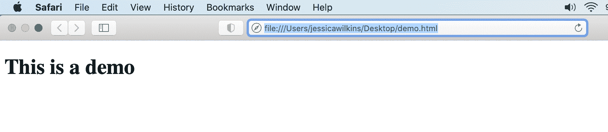
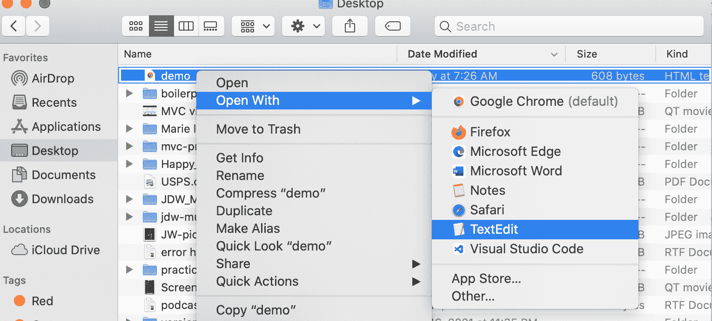
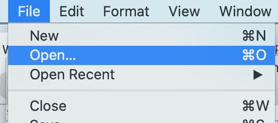
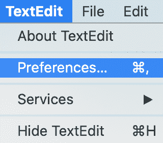
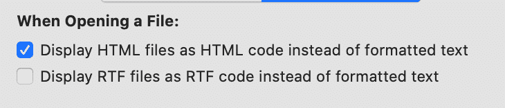
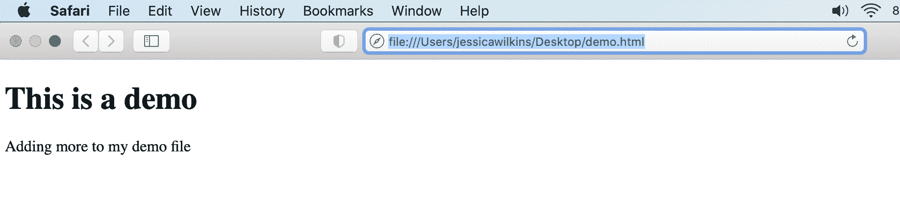

# 网页文本编辑器–如何在 Mac 文本编辑中打开 HTML 代码

> 原文：<https://www.freecodecamp.org/news/web-page-text-editor-how-to-open-html-code-in-mac-textedit/>

在本文中，我将展示如何在文本编辑中创建和编辑 HTML 文件。

## 什么是文本编辑？

“文本编辑”是 Mac 电脑预装的免费文字处理软件。它已经存在了 25 年，是一种打开和阅读 word 文件、文本文件甚至 HTML 文件的简单方法。

## 如何在“文本编辑”中创建 HTML 文件

1.  前往 Finder >应用程序>文本编辑。双击文本编辑打开。



2.点击格式，然后点击制作纯文本。



3.向您的文件添加一个基本的 [HTML 样板文件](https://www.freecodecamp.org/news/basic-html5-template-boilerplate-code-example/)。

```
<!DOCTYPE html>
<html lang="en">
  <head>
    <meta charset="UTF-8">
    <meta name="viewport" content="width=device-width, initial-scale=1.0">
    <meta http-equiv="X-UA-Compatible" content="ie=edge">
    <title>TextEdit Demo</title>
  </head>
  <body>
    <h1>This is a demo</h1>
  </body>
</html>
```

4.转到文件>保存...

5.用扩展名`.html`命名文件。这将告诉计算机它正在处理一个 HTML 文件。单击保存。



6.点击使用。超文本标记语言



转到计算机上新创建的文件，双击以在浏览器中打开。您应该会看到这样的结果:



## 如何在“文本编辑”中打开 HTML 文稿

在“文本编辑”中打开 HTML 文件有两种方法。

### 选项 1

转到您想要打开的 HTML 文件，右键单击该文件，然后选择“文本编辑”来打开。



### 选项 2

打开“文本编辑”,然后点按“文件”>“打开”...如果您最近打开过该文件，也可以将鼠标悬停在“最近打开”选项上。



## “文本编辑”的代码编辑模式

“文本编辑”中有一个选项，总是将 HTML 文件显示为 HTML 代码。

1.  点击文本编辑>偏好设置...



2.点击打开并保存:


3.点按“将 HTML 文件显示为 HTML 代码而不是格式化文本”复选框:



现在，您可以对 HTML 文件进行更改，并在浏览器中查看结果。

```
<!DOCTYPE html>
<html lang="en">
  <head>
    <meta charset="UTF-8">
    <meta name="viewport" content="width=device-width, initial-scale=1.0">
    <meta http-equiv="X-UA-Compatible" content="ie=edge">
    <title>TextEdit Demo</title>
  </head>
  <body>
    <h1>This is a demo</h1>
    <p>Adding more to my demo file</p>
  </body>
</html>
```



这就是在“文本编辑”中创建、存储、打开和编辑 HTML 文件的方式。