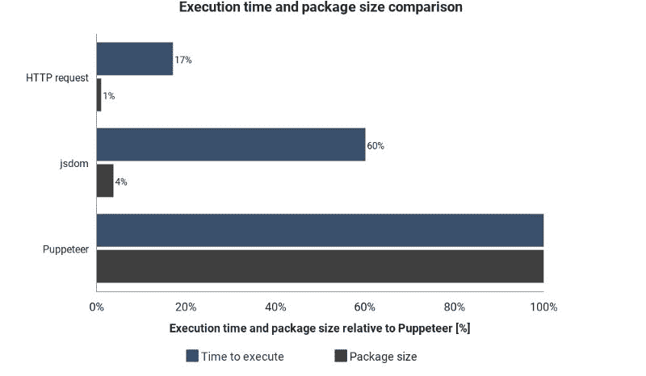

# Web 开发人员的 web 抓取:简明摘要

> 原文：<https://www.freecodecamp.org/news/web-scraping-for-web-developers-a-concise-summary-3af3d0ca4069/>

知道一种网络抓取的方法可能会在短期内解决你的问题，但是所有的方法都有自己的优点和缺点。意识到这一点可以节省你的时间，帮助你更有效地解决任务。

有许多资源可以向您展示从 web 页面中提取数据的一种技术。现实情况是，可以为此使用多种解决方案和工具。

从网页中以编程方式提取数据有哪些选择？

每种方法的优缺点是什么？

如何利用云服务增加自动化程度？

本指南旨在回答这些问题。

我假设你已经对浏览器有了基本的了解， **HTTP** 请求， **DOM** (文档对象模型)， **HTML** ， **CSS 选择器**，以及**异步 JavaScript** 。

如果这些短语听起来不熟悉，我建议在继续阅读之前先检查一下这些话题。Node.js 中实现了一些例子，但是如果需要的话，希望您可以将这个理论移植到其他语言中。

### 静态内容

#### HTML 源

让我们从最简单的方法开始。

如果你打算抓取一个网页，这是第一个尝试的方法。它只需要微不足道的计算能力和最少的时间来实现。

然而，只有当 HTML 源代码包含你的目标数据时,**才有效。要在 Chrome 中检查这一点，右键单击页面并选择*查看页面源代码*。现在你应该可以看到 HTML 源代码了。**

这里需要注意的是，使用 Chrome 的 inspect 工具不会看到相同的代码，因为它显示的是与页面当前状态相关的 HTML 结构，不一定与您可以从服务器获得的源 HTML 文档相同。

一旦在这里找到数据，编写一个属于包装元素的 [CSS 选择器](https://www.w3schools.com/cssref/css_selectors.asp),以便以后引用。

要实现，您可以向页面的 URL 发送一个 HTTP GET 请求，并将获取 HTML 源代码。

在**节点**中，您可以使用一个名为 [CheerioJS](https://github.com/cheeriojs/cheerio) 的工具来解析这个原始 HTML，并使用选择器提取数据。代码看起来像这样:

```
const fetch = require('node-fetch');
const cheerio = require('cheerio');

const url = 'https://example.com/';
const selector = '.example';

fetch(url)
  .then(res => res.text())
  .then(html => {
    const $ = cheerio.load(html);
    const data = $(selector);
    console.log(data.text());
  });
```

### 动态内容

在许多情况下，您无法从原始 HTML 代码中访问信息，因为 DOM 是由一些在后台执行的 JavaScript 操纵的。一个典型的例子是 SPA(单页应用程序)，其中 HTML 文档包含最少量的信息，JavaScript 在运行时填充这些信息。

在这种情况下，解决方案是构建 DOM 并执行 HTML 源代码中的脚本，就像浏览器一样。之后，可以用选择器从这个对象中提取数据。

#### 无头浏览器

这可以通过使用无头浏览器来实现。无头浏览器几乎和你每天都在使用的普通浏览器一样，只是没有用户界面。它在后台运行，你可以通过编程来控制它，而不是用鼠标点击和键盘输入。

无头浏览器的一个流行选择是[木偶师](https://github.com/GoogleChrome/puppeteer)。这是一个易于使用的节点库，它提供了一个高级 API 来控制无头模式下的 Chrome。它可以配置为非无头运行，这在开发过程中很方便。下面的代码与前面的代码做了同样的事情，但是它也适用于动态页面:

```
const puppeteer = require('puppeteer');

async function getData(url, selector){
  const browser = await puppeteer.launch();
  const page = await browser.newPage();
  await page.goto(url);
  const data = await page.evaluate(selector => {
    return document.querySelector(selector).innerText;
  }, selector);
  await browser.close();
  return data;
}

const url = 'https://example.com';
const selector = '.example';
getData(url,selector)
  .then(result => console.log(result));
```

当然，你可以用木偶师做更多有趣的事情，所以值得查看一下[文档](https://pptr.dev/)。下面是一个代码片段，它导航到一个 URL，截取一个屏幕截图并保存它:

```
const puppeteer = require('puppeteer');

async function takeScreenshot(url,path){
  const browser = await puppeteer.launch();
  const page = await browser.newPage();
  await page.goto(url);
  await page.screenshot({path: path});
  await browser.close();
}

const url = 'https://example.com';
const path = 'example.png';
takeScreenshot(url, path);
```

可以想象，运行浏览器比发送一个简单的 GET 请求并解析响应需要更多的计算能力。因此，执行相对昂贵且缓慢。不仅如此，包含一个浏览器作为依赖项会使部署包变得庞大。

从好的方面来看，这种方法非常灵活。您可以使用它在页面中导航、模拟点击、鼠标移动和键盘事件、填写表单、截屏或生成页面的 pdf、在控制台中执行命令、选择元素以提取其文本内容。基本上，所有可以在浏览器中手动完成的事情都可以完成。

#### 只建 DOM

您可能认为仅仅为了构建 DOM 而模拟整个浏览器有点大材小用。其实是，至少在某些情况下是。

有一个节点库，叫做 [Jsdom](https://github.com/jsdom/jsdom) ，它会解析你传递给它的 HTML，就像浏览器一样。然而，它不是一个浏览器，而是**，一个从给定的 HTML 源代码**构建 DOM 的工具，同时还执行 HTML 中的 JavaScript 代码。

由于这种抽象，Jsdom 能够比无头浏览器运行得更快。如果更快，为什么不一直用它来代替无头浏览器呢？

引用文件:

> 人们在使用 jsdom 时经常会遇到异步脚本加载的问题。许多页面异步加载脚本，但是没有办法知道它们什么时候完成了加载，因此什么时候是运行代码和检查结果 DOM 结构的好时机。这是一个基本的限制。

> …这可以通过轮询特定元素的存在来解决。

示例中显示了此解决方案。它每隔 100 毫秒检查一次该元素是否出现或超时(2 秒后)。

当 Jsdom 没有实现页面中的某些浏览器功能时，它还经常会抛出令人讨厌的错误消息，例如:“*错误:未实现:window.alert…”或“错误:未实现:window.scrollTo…”。*这个问题也可以通过一些变通方法解决([虚拟控制台](https://github.com/jsdom/jsdom#virtual-consoles))。

一般来说，它是一个比木偶师更低级的 API，所以你需要自己实现某些东西。

正如您将在示例中看到的，这些东西使得使用起来有点混乱。木偶师在幕后为你解决了所有这些事情，并且使它变得极其容易使用。针对这项额外工作的 Jsdom 将提供一个快速而精简的解决方案。

让我们看看与前面相同的例子，但是使用了 Jsdom:

```
const jsdom = require("jsdom");
const { JSDOM } = jsdom;

async function getData(url,selector,timeout) {
  const virtualConsole = new jsdom.VirtualConsole();
  virtualConsole.sendTo(console, { omitJSDOMErrors: true });
  const dom = await JSDOM.fromURL(url, {
    runScripts: "dangerously",
    resources: "usable",
    virtualConsole
  });
  const data = await new Promise((res,rej)=>{
    const started = Date.now();
    const timer = setInterval(() => {
      const element = dom.window.document.querySelector(selector)
      if (element) {
        res(element.textContent);
        clearInterval(timer);
      }
      else if(Date.now()-started > timeout){
        rej("Timed out");
        clearInterval(timer);
      }
    }, 100);
  });
  dom.window.close();
  return data;
}

const url = "https://example.com/";
const selector = ".example";
getData(url,selector,2000).then(result => console.log(result));
```

#### 逆向工程

Jsdom 是一个快速、轻量级的解决方案，但是还可以进一步简化。

我们甚至需要模拟 DOM 吗？

一般来说，你想要抓取的网页由相同的 HTML，相同的 JavaScript，相同的你已经知道的技术组成。所以，**如果你** **找到了目标数据来源的那段代码，你可以重复同样的操作以得到同样的结果。**

如果我们**过分简化**事情，你要找的数据可能是:

*   HTML 源代码的一部分(就像我们在第一段看到的)，
*   静态文件的一部分，在 HTML 文档中引用(例如 javascript 文件中的字符串)，
*   对网络请求的响应(例如，一些 JavaScript 代码向服务器发送 AJAX 请求，服务器用 JSON 字符串进行响应)。

所有这些数据源都可以通过网络请求来访问。从我们的角度来看，网页是否使用 HTTP、WebSockets 或任何其他通信协议都无关紧要，因为理论上它们都是可复制的。

一旦找到存放数据的资源，就可以像原始页面一样向同一服务器发送类似的网络请求。结果，您得到包含目标数据的响应，可以使用正则表达式、字符串方法、JSON.parse 等轻松提取这些数据

简单地说，您可以只获取数据所在的资源，而不是处理和加载全部内容。这样，前面例子中的问题可以用一个 HTTP 请求来解决，而不用控制浏览器或复杂的 JavaScript 对象。

这个解决方案在理论上看起来很简单，但是大多数时候执行起来非常耗时，并且需要一些使用网页和服务器的经验。

可以从观察网络流量开始研究。Chrome DevTools 中的[网络标签是一个很好的工具。您将看到所有带有响应的传出请求(包括静态文件、AJAX 请求等)，因此您可以遍历它们并寻找数据。](https://developers.google.com/web/tools/chrome-devtools/network-performance/)

如果响应在呈现到屏幕上之前被一些代码修改了，那么这个过程会更加缓慢。在这种情况下，你必须找到那段代码并理解发生了什么。

正如您所看到的，这个解决方案可能需要比目前为止的方法更多的工作。另一方面，一旦实现了，它就提供了最佳的性能。

这个图表显示了所需的执行时间，以及与 Jsdom 和 Puppeteer 相比的包大小:



这些结果并不是基于精确的测量，并且在每种情况下都会有所不同，但是很好地显示了这些技术之间的近似差异。

### 云服务集成

假设您实现了目前列出的解决方案之一。执行脚本的一种方法是打开电脑，打开终端，手动执行。

这可能很快变得令人讨厌和低效，所以如果我们可以将脚本上传到服务器，它将根据它的配置定期执行代码，这将会更好。

这可以通过运行实际的服务器并配置一些何时执行脚本的规则来实现。当你持续观察页面中的一个元素时，服务器会发光。在其他情况下，云函数可能是一种更简单的方法。

云函数基本上是容器，用于在触发事件发生时执行上传的代码。这意味着您不必管理服务器，这是由您选择的云提供商自动完成的。

一个可能的触发器可以是一个时间表、一个网络请求和许多其他事件。你可以将收集到的数据保存在数据库中，写在谷歌表单中或者通过 T2 的电子邮件发送出去。这完全取决于你的创造力。

热门的云提供商有[亚马逊网络服务](https://aws.amazon.com)(AWS)[谷歌云平台](https://cloud.google.com/)(GCP)[微软 Azure](https://azure.microsoft.com) ，它们都有一个功能服务:

*   [AWSλ](https://aws.amazon.com/lambda/)
*   [GCP 云功能](https://cloud.google.com/functions/)
*   [Azure 功能](https://azure.microsoft.com/services/functions/)

他们每月提供一定数量的免费使用，你的单个脚本可能不会超过，除非在极端情况下，但**请在使用**前检查定价。

如果你用的是木偶戏，谷歌的 C *loud Functions* 是最简单的解决方案。Headless Chrome 的压缩包大小(~130MB)超过了 AWS Lambda 的最大压缩大小限制(50MB)。有一些技术可以让它与 Lambda 一起工作，但 GCP 函数[默认支持无头 Chrome](https://cloud.google.com/blog/products/gcp/introducing-headless-chrome-support-in-cloud-functions-and-app-engine)，你只需要在 *package.json* 中将木偶师作为一个依赖项包含进来。

如果你想从总体上了解更多关于云功能的知识，可以做一些关于无服务器架构的研究。许多优秀的指南已经在这个主题上被写了，并且大多数提供者有一个容易跟随的文档。

### 摘要

我知道每个话题都被压缩了。仅凭这些知识，您可能无法实现每个解决方案，但是通过文档和一些定制研究，这应该不是问题。

希望现在您已经对从 web 上收集数据的技术有了一个高层次的概述，因此您可以相应地更深入地研究每个主题。