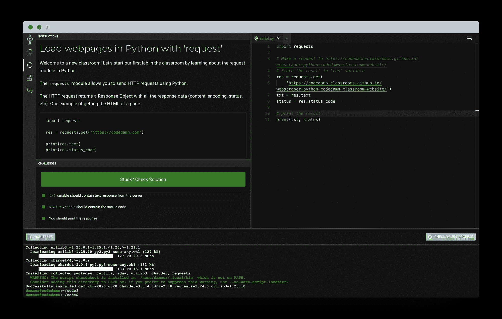

# 网络抓取 Python 教程——如何从网站抓取数据

> 原文：<https://www.freecodecamp.org/news/web-scraping-python-tutorial-how-to-scrape-data-from-a-website/>

Python 是一种很好的编码语言。它有一个很棒的软件包生态系统，比你在其他语言中发现的噪音要少得多，而且超级容易使用。

Python 被用于很多事情，从数据分析到服务器编程。Python 的一个令人兴奋的用例是 Web 抓取。

在本文中，我们将介绍如何使用 Python 进行 web 抓取。我们还将继续学习完整的动手课堂指南。

*注意:我们将抓取我主持的网页，因此我们可以安全地在上面学习抓取。许多公司不允许在他们的网站上抓取，所以这是一个很好的学习方法。只是在刮之前一定要检查一下。*

## 网页抓取课堂介绍



Preview of codedamn classroom

如果你想跟着编码，你可以使用这个免费的 codedamn 教室 来帮助你学习网页抓取。这将是 codedamn 上的一个实际动手学习练习，类似于你在 freeCodeCamp 上的学习方式。

在本课堂中，您将使用此页面测试网页抓取:[https://code damn-classrooms . github . io/web scraper-python-code damn-classroom-website/](https://codedamn-classrooms.github.io/webscraper-python-codedamn-classroom-website/)

这个教室由 7 个实验组成，你将在这篇博文的每个部分解决一个实验。我们将使用 Python 3.8 + BeautifulSoup 4 进行网页抓取。

## 第 1 部分:用“请求”加载网页

这是该实验室的[链接。](https://codedamn.com/practice/web-scraping-python-beautifulsoup/a674e637-d958-4527-8930-cc53d1fb68e9)

`requests`模块允许您使用 Python 发送 HTTP 请求。

HTTP 请求返回一个包含所有响应数据(内容、编码、状态等)的响应对象。获取页面 HTML 的一个例子:

```
import requests

res = requests.get('https://codedamn.com')

print(res.text)
print(res.status_code)
```

### 合格要求:

*   使用`requests`模块获取以下 URL 的内容:**https://code damn-classrooms . github . io/web scraper-python-code damn-classroom-website/**
*   将文本响应(如上所示)存储在一个名为`txt`的变量中
*   将状态代码(如上所示)存储在一个名为`status`的变量中
*   使用`print`功能打印`txt`和`status`

一旦您理解了上面代码中发生的事情，通过这个实验就相当简单了。以下是本实验的解决方案:

```
import requests

# Make a request to https://codedamn-classrooms.github.io/webscraper-python-codedamn-classroom-website/
# Store the result in 'res' variable
res = requests.get(
    'https://codedamn-classrooms.github.io/webscraper-python-codedamn-classroom-website/')
txt = res.text
status = res.status_code

print(txt, status)
# print the result
```

现在让我们转到第 2 部分，您将在现有代码的基础上构建更多代码。

## 第 2 部分:用 BeautifulSoup 提取标题

这是该实验室的[链接。](https://codedamn.com/practice/web-scraping-python-beautifulsoup/e55282e8-8481-4fb9-9a95-5df4d4a526ce)

在整个课堂中，你将使用 Python 中的一个名为`BeautifulSoup`的库来进行 web 抓取。使 BeautifulSoup 成为强大解决方案的一些功能包括:

1.  它为导航、搜索和修改 DOM 树提供了许多简单的方法和 Pythonic 习惯用法。编写应用程序不需要太多代码
2.  Beautiful Soup 位于 lxml 和 html5lib 等流行的 Python 解析器之上，允许您尝试不同的解析策略或以速度换取灵活性。

基本上，BeautifulSoup 可以解析你在网上给它的任何东西。

这是一个美丽声音的简单例子:

```
from bs4 import BeautifulSoup

page = requests.get("https://codedamn.com")
soup = BeautifulSoup(page.content, 'html.parser')
title = soup.title.text # gets you the text of the <title>(...)</title>
```

### 合格要求:

*   使用`requests`包获取 URL 的标题:https://code damn-classrooms . github . io/web scraper-python-code damn-classroom-website/
*   使用 BeautifulSoup 将这个页面的标题存储到一个名为`page_title`的变量中

看上面的例子，你可以看到一旦我们在 BeautifulSoup 中输入了`page.content`,你就可以开始以一种非常 pythonic 化的方式处理解析后的 DOM 树了。实验室的解决方案是:

```
import requests
from bs4 import BeautifulSoup

# Make a request to https://codedamn-classrooms.github.io/webscraper-python-codedamn-classroom-website/
page = requests.get(
    "https://codedamn-classrooms.github.io/webscraper-python-codedamn-classroom-website/")
soup = BeautifulSoup(page.content, 'html.parser')

# Extract title of page
page_title = soup.title.text

# print the result
print(page_title)
```

这也是一个简单的实验，我们必须更改 URL 并打印页面标题。这个代码会通过实验室。

## 第三部分:汤化的身体和头部

这是该实验室的[链接。](https://codedamn.com/practice/web-scraping-python-beautifulsoup/a91108fd-2f13-4640-ac62-d7877235376a)

在上一个实验中，您看到了如何从页面中提取`title`。提取某些部分也同样容易。

您还看到，您必须在这些上调用`.text`来获得字符串，但是您也可以在不调用`.text`的情况下打印它们，它会给您完整的标记。尝试运行下面的示例:

```
import requests
from bs4 import BeautifulSoup

# Make a request
page = requests.get(
    "https://codedamn.com")
soup = BeautifulSoup(page.content, 'html.parser')

# Extract title of page
page_title = soup.title.text

# Extract body of page
page_body = soup.body

# Extract head of page
page_head = soup.head

# print the result
print(page_body, page_head)
```

让我们看看如何从页面中提取出`body`和`head`部分。

### 合格要求:

*   使用 URL 重复实验:`https://codedamn-classrooms.github.io/webscraper-python-codedamn-classroom-website/`
*   存储页面标题(无需调用。文本)的网址在`page_title`
*   存储正文内容(不调用。文本)的网址在`page_body`
*   存储头部内容(无需调用。文本)的网址在`page_head`

当您尝试打印`page_body`或`page_head`时，您会看到它们被打印为`strings`。但实际上，当你`print(type page_body)`你会发现它不是一个字符串，但它工作正常。

基于上面的代码，本示例的解决方案很简单:

```
import requests
from bs4 import BeautifulSoup

# Make a request
page = requests.get(
    "https://codedamn-classrooms.github.io/webscraper-python-codedamn-classroom-website/")
soup = BeautifulSoup(page.content, 'html.parser')

# Extract title of page
page_title = soup.title

# Extract body of page
page_body = soup.body

# Extract head of page
page_head = soup.head

# print the result
print(page_title, page_head)
```

## 第 4 部分:用 BeautifulSoup 选择

这是该实验室的[链接。](https://codedamn.com/practice/web-scraping-python-beautifulsoup/0ee9fa0e-e7ac-4afa-ad8a-b4b3d16900ef)

现在您已经探索了 BeautifulSoup 的一些部分，让我们看看如何用 BeautifulSoup 方法选择 DOM 元素。

一旦你有了`soup`变量(像之前的实验一样)，你就可以使用`.select`了，它是 BeautifulSoup 中的一个 CSS 选择器。也就是说，您可以像使用 CSS 选择元素一样深入 DOM 树。让我们看一个例子:

```
import requests
from bs4 import BeautifulSoup

# Make a request
page = requests.get(
    "https://codedamn-classrooms.github.io/webscraper-python-codedamn-classroom-website/")
soup = BeautifulSoup(page.content, 'html.parser')

# Extract first <h1>(...)</h1> text
first_h1 = soup.select('h1')[0].text
```

`.select`返回所有元素的 Python 列表。这就是为什么您只选择了索引为`[0]`的第一个元素。

### 合格要求:

*   创建一个变量`all_h1_tags`。将其设置为空列表。
*   使用`.select`选择所有的`<h1>`标签，并将这些 h1 的文本存储在`all_h1_tags`列表中。
*   创建一个变量`seventh_p_text`，并在其中存储第 7 个`p`元素(索引 6)的文本。

本实验的解决方案是:

```
import requests
from bs4 import BeautifulSoup
# Make a request
page = requests.get(
    "https://codedamn-classrooms.github.io/webscraper-python-codedamn-classroom-website/")
soup = BeautifulSoup(page.content, 'html.parser')

# Create all_h1_tags as empty list
all_h1_tags = []

# Set all_h1_tags to all h1 tags of the soup
for element in soup.select('h1'):
    all_h1_tags.append(element.text)

# Create seventh_p_text and set it to 7th p element text of the page
seventh_p_text = soup.select('p')[6].text

print(all_h1_tags, seventh_p_text) 
```

我们继续吧。

## 第 5 部分:当前最重要的项目

这是该实验室的[链接。](https://codedamn.com/practice/web-scraping-python-beautifulsoup/0f404796-1b8f-491b-9b50-9e47893d2e47)

让我们继续并提取从 URL:https://code damn-classrooms . github . io/web scraper-python-code damn-classroom-website/

如果您在新标签页中打开此页面，您将看到一些热门项目。在这个实验中，你的任务是找出他们的名字，并存储在一个名为`top_items`的列表中。您还将提取这些项目的评论。

要通过这项挑战，请注意以下事项:

*   使用`.select`提取标题。(提示:产品标题的一个选择器可以是`a.title`)
*   使用`.select`提取这些产品标题的评论计数标签。(提示:评论的一个选择器可以是`div.ratings`)注意:这是一个完整的标签(即 **2 个评论**)，而不仅仅是一个数字。
*   按以下格式创建新词典:

```
info = {
   "title": 'Asus AsusPro Adv...   '.strip(),
   "review": '2 reviews\n\n\n'.strip()
}
```

*   请注意，您使用了`strip`方法来删除输出中任何多余的换行符/空格。这是**重要的**通过这个实验室。
*   将该词典追加到名为`top_items`的列表中
*   在末尾打印这个列表

在这次挑战中有相当多的任务要完成。让我们先来看看解决方案，并了解发生了什么:

```
import requests
from bs4 import BeautifulSoup
# Make a request
page = requests.get(
    "https://codedamn-classrooms.github.io/webscraper-python-codedamn-classroom-website/")
soup = BeautifulSoup(page.content, 'html.parser')

# Create top_items as empty list
top_items = []

# Extract and store in top_items according to instructions on the left
products = soup.select('div.thumbnail')
for elem in products:
    title = elem.select('h4 > a.title')[0].text
    review_label = elem.select('div.ratings')[0].text
    info = {
        "title": title.strip(),
        "review": review_label.strip()
    }
    top_items.append(info)

print(top_items)
```

注意，这只是解决方案之一。你也可以用不同的方式来尝试。在此解决方案中:

1.  首先，选择所有的`div.thumbnail`元素，这将给出一个单个产品的列表
2.  然后你迭代它们
3.  因为`select`允许你链接它自己，你可以再次使用 select 来获得标题。
4.  注意，因为你已经在一个循环中运行了`div.thumbnail`，所以`h4 > a.title`选择器只会给你一个结果，在一个列表中。您选择列表第 0 个元素并提取文本。
5.  最后，去掉任何多余的空格，并将其添加到列表中。

直截了当对吗？

## 第 6 部分:提取链接

这是该实验室的[链接。](https://codedamn.com/practice/web-scraping-python-beautifulsoup/be9b007a-ff03-45d5-ad44-1adecdb21e2a)

到目前为止，您已经看到了如何提取文本，或者说是元素的内部文本。现在让我们看看如何通过从页面中提取链接来提取属性。

下面是一个如何从页面中提取所有图像信息的示例:

```
import requests
from bs4 import BeautifulSoup
# Make a request
page = requests.get(
    "https://codedamn-classrooms.github.io/webscraper-python-codedamn-classroom-website/")
soup = BeautifulSoup(page.content, 'html.parser')

# Create top_items as empty list
image_data = []

# Extract and store in top_items according to instructions on the left
images = soup.select('img')
for image in images:
    src = image.get('src')
    alt = image.get('alt')
    image_data.append({"src": src, "alt": alt})

print(image_data)
```

在本实验中，您的任务是提取带有`text`的链接的`href`属性。确保以下事项:

*   你必须创建一个名为`all_links`的列表
*   在这个列表中，存储所有的链接字典信息。它应该采用以下格式:

```
info = {
   "href": "<link here>",
   "text": "<link text here>"
}
```

*   确保你的`text`没有任何空白
*   确保在调用`.strip()`之前检查`.text`是否为空。
*   将所有这些字典存储在`all_links`中
*   在末尾打印这个列表

使用`get`函数提取属性值，就像从字典中提取值一样。让我们来看看本实验的解决方案:

```
import requests
from bs4 import BeautifulSoup
# Make a request
page = requests.get(
    "https://codedamn-classrooms.github.io/webscraper-python-codedamn-classroom-website/")
soup = BeautifulSoup(page.content, 'html.parser')

# Create top_items as empty list
all_links = []

# Extract and store in top_items according to instructions on the left
links = soup.select('a')
for ahref in links:
    text = ahref.text
    text = text.strip() if text is not None else ''

    href = ahref.get('href')
    href = href.strip() if href is not None else ''
    all_links.append({"href": href, "text": text})

print(all_links) 
```

这里，您提取了`href`属性，就像您在图像案例中所做的那样。你唯一要做的就是检查它是否不存在。我们希望将它设置为空字符串，否则我们希望去掉空白。

## 第 7 部分:从数据生成 CSV

这是该实验室的[链接。](https://codedamn.com/practice/web-scraping-python-beautifulsoup/a10e33c1-7780-40bc-a541-adc632fab185)

最后，让我们了解如何从一组数据中生成 CSV。您将创建一个具有以下标题的 CSV:

1.  产品名称
2.  价格
3.  描述
4.  复习
5.  产品仿制

这些产品位于`div.thumbnail`。CSV 样本如下所示:

```
import requests
from bs4 import BeautifulSoup
import csv
# Make a request
page = requests.get(
    "https://codedamn-classrooms.github.io/webscraper-python-codedamn-classroom-website/")
soup = BeautifulSoup(page.content, 'html.parser')

all_products = []

products = soup.select('div.thumbnail')
for product in products:
    # TODO: Work
    print("Work on product here")

keys = all_products[0].keys()

with open('products.csv', 'w', newline='') as output_file:
    dict_writer = csv.DictWriter(output_file, keys)
    dict_writer.writeheader()
    dict_writer.writerows(all_products) 
```

您必须从网站中提取数据，并为这三种产品生成 CSV。

### 合格要求:

*   产品名称是项目名称的空白修剪版本(例如- Asus AsusPro Adv..)
*   价格是产品的全价标签(例如 1101.83 美元)
*   该描述是产品描述的空白修剪版本(例如，华硕 AsusPro Advanced BU401LA-FA271G 深灰色，14 英寸，酷睿 i5-4210U，4GB，128GB 固态硬盘，Win7 Pro)
*   评论是产品的空白版本(例 7 评论)
*   产品图像是产品图像的 URL (src 属性)(例如-/web scraper-python-code damn-classroom-website/cart 2 . png)
*   CSV 文件的名称应该是 **products.csv** ，并且应该存储在与您的 **script.py** 文件相同的目录中

让我们看看本实验的解决方案:

```
import requests
from bs4 import BeautifulSoup
import csv
# Make a request
page = requests.get(
    "https://codedamn-classrooms.github.io/webscraper-python-codedamn-classroom-website/")
soup = BeautifulSoup(page.content, 'html.parser')

# Create top_items as empty list
all_products = []

# Extract and store in top_items according to instructions on the left
products = soup.select('div.thumbnail')
for product in products:
    name = product.select('h4 > a')[0].text.strip()
    description = product.select('p.description')[0].text.strip()
    price = product.select('h4.price')[0].text.strip()
    reviews = product.select('div.ratings')[0].text.strip()
    image = product.select('img')[0].get('src')

    all_products.append({
        "name": name,
        "description": description,
        "price": price,
        "reviews": reviews,
        "image": image
    })

keys = all_products[0].keys()

with open('products.csv', 'w', newline='') as output_file:
    dict_writer = csv.DictWriter(output_file, keys)
    dict_writer.writeheader()
    dict_writer.writerows(all_products) 
```

这里最有趣的是`for`街区。您从所有实验中学到的知识中提取了所有元素和属性。

当您运行这段代码时，您最终会得到一个不错的 CSV 文件。这就是用 BeautifulSoup 抓取网页的所有基础知识！

## 结论

我希望这个来自 [codedamn](https://codedamn.com) 的互动课堂能够帮助你理解 Python 网页抓取的基础知识。

如果你喜欢这个教室和这个博客，请在我的 [twitter](https://twitter.com/mehulmpt) 和 [Instagram](https://instagram.com/mehulmpt) 上告诉我。希望听到反馈！