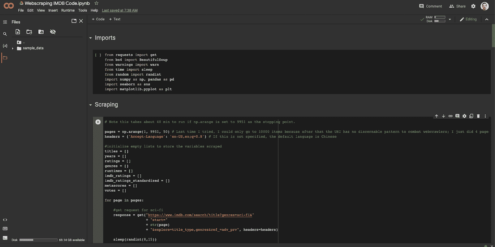
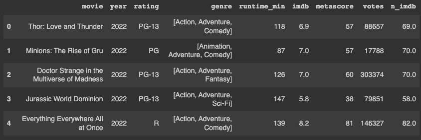
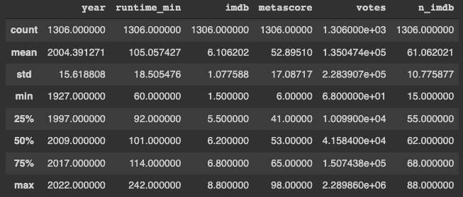
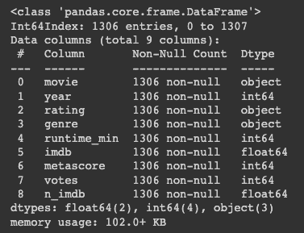
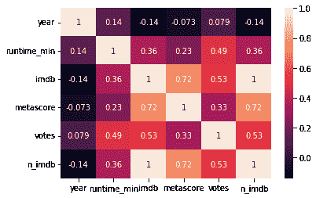
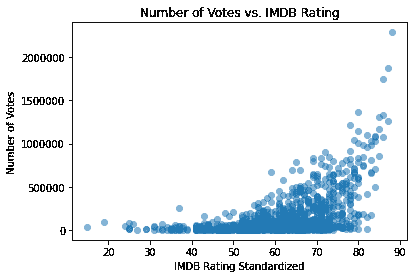
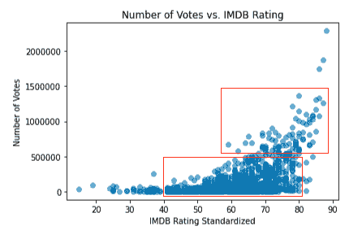
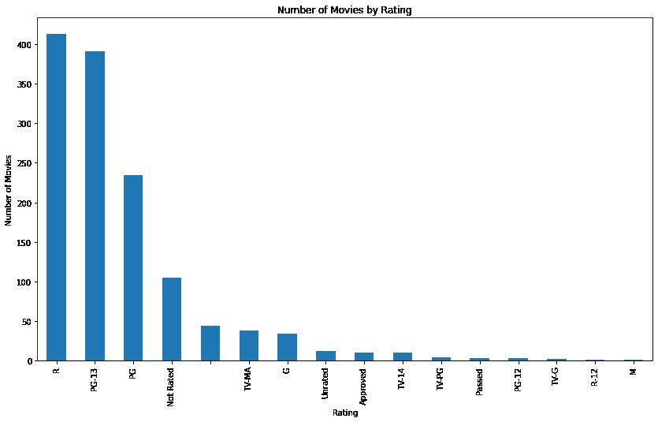
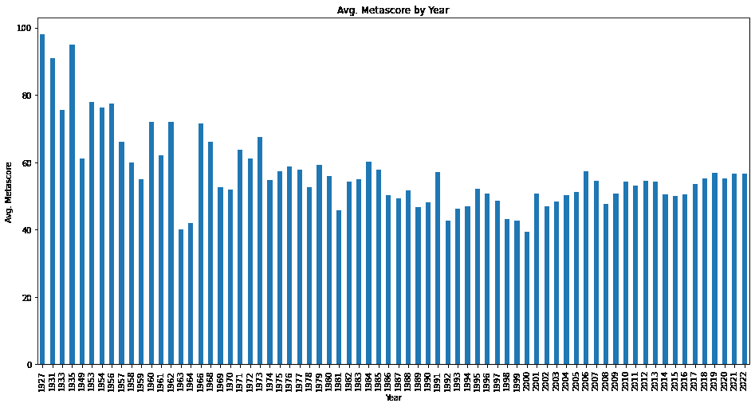
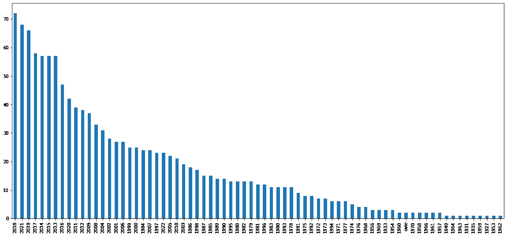

# Python 中的网络抓取——如何从 IMDB 中抓取科幻电影

> 原文：<https://www.freecodecamp.org/news/web-scraping-sci-fi-movies-from-imdb-with-python/>

您是否曾为自己的数据科学项目苦苦寻找数据集？如果你和我一样，答案是肯定的。

幸运的是，有许多免费的数据集可用——但有时你想要更具体或定制的东西。为此，网络抓取是一项很好的技能，你可以把它放在工具箱里，从你最喜欢的网站上抓取数据。

## 这篇文章涵盖了什么？

本文提供了一个 Python 脚本，您可以使用它来收集科幻电影(或者您选择的任何类型的电影)的数据。)来自 [IMDB](https://www.imdb.com/) 网站。然后，它可以将这些数据写入数据帧，以供进一步研究。

我将用一些探索性的数据分析(EDA)来结束这篇文章。通过这个，你会看到有哪些进一步的数据科学项目有可能让你去尝试。

免责声明:虽然网络抓取是一种很好的从网站上抓取数据的方式，但是请负责任地去做。例如，我的脚本使用了 sleep 函数来故意降低 pull 请求的速度，以免 IMDB 的服务器过载。一些网站不赞成使用网页抓取工具，所以要明智地使用它。

## 网页抓取和数据清理脚本

让我们来看看这个抓取脚本，并让它运行起来。该脚本获取每部电影的电影名称、年份、评级(PG-13、R 等)、类型、运行时间、评论和投票。您可以根据自己的数据需求选择要抓取的页面数量。

注意:选择的页面越多，花费的时间就越长。使用 [Google Colab 笔记本](https://colab.research.google.com/drive/11avx1TqYw_2sb5tUNi0ZO4ABRc50LNxK?usp=sharing)抓取 200 个网页需要 40 分钟。

对于那些以前没有尝试过的人来说，Google Colab 是一个基于云的 [Jupyter Notebook](https://realpython.com/jupyter-notebook-introduction/#:~:text=The%20Jupyter%20Notebook%20is%20an,the%20people%20at%20Project%20Jupyter.) 风格的 Python 开发工具，它位于 Google app suite 中。您可以将它与数据科学中常见的许多已安装的包一起开箱即用。

下面是 Colab 工作区及其布局的图像:



Introducing the Google Colab user interface

就这样，让我们开始吧！首先，你应该总是将你的包作为它们自己的单元导入。如果您忘记了一个包，您可以只重新运行该单元。这减少了开发时间。

注意:有些包需要先运行`pip install package_name`来安装。如果您选择使用类似 Jupyter 笔记本的东西在本地运行代码，您将需要这样做。如果你想快速上手，可以使用 Google Colab 笔记本。默认情况下会安装所有这些组件。

```
from requests import get
from bs4 import BeautifulSoup
from warnings import warn
from time import sleep
from random import randint
import numpy as np, pandas as pd
import seaborn as sns
```

## 如何进行网页抓取

您可以运行下面的代码进行实际的 web 抓取。它将把上面提到的所有列放入数组中，一次填充一部电影，一次填充一页。

我还添加了一些数据清理步骤，并记录在这段代码中。例如，我从提到电影年份的字符串数据中删除了括号。然后我把它们转换成整数。诸如此类的事情使得探索性的数据分析和建模更加容易。

请注意，我使用 sleep 功能是为了避免在快速浏览他们的网页时受到 IMDB 的限制。

```
# Note this takes about 40 min to run if np.arange is set to 9951 as the stopping point.

pages = np.arange(1, 9951, 50) # Last time I tried, I could only go to 10000 items because after that the URI has no discernable pattern to combat webcrawlers; I just did 4 pages for demonstration purposes. You can increase this for your own projects.
headers = {'Accept-Language': 'en-US,en;q=0.8'} # If this is not specified, the default language is Mandarin

#initialize empty lists to store the variables scraped
titles = []
years = []
ratings = []
genres = []
runtimes = []
imdb_ratings = []
imdb_ratings_standardized = []
metascores = []
votes = []

for page in pages:

   #get request for sci-fi
   response = get("https://www.imdb.com/search/title?genres=sci-fi&"
                  + "start="
                  + str(page)
                  + "&explore=title_type,genres&ref_=adv_prv", headers=headers)

   sleep(randint(8,15))

   #throw warning for status codes that are not 200
   if response.status_code != 200:
       warn('Request: {}; Status code: {}'.format(requests, response.status_code))

   #parse the content of current iteration of request
   page_html = BeautifulSoup(response.text, 'html.parser')

   movie_containers = page_html.find_all('div', class_ = 'lister-item mode-advanced')

   #extract the 50 movies for that page
   for container in movie_containers:

       #conditional for all with metascore
       if container.find('div', class_ = 'ratings-metascore') is not None:

           #title
           title = container.h3.a.text
           titles.append(title)

           if container.h3.find('span', class_= 'lister-item-year text-muted unbold') is not None:

             #year released
             year = container.h3.find('span', class_= 'lister-item-year text-muted unbold').text # remove the parentheses around the year and make it an integer
             years.append(year)

           else:
             years.append(None) # each of the additional if clauses are to handle type None data, replacing it with an empty string so the arrays are of the same length at the end of the scraping

           if container.p.find('span', class_ = 'certificate') is not None:

             #rating
             rating = container.p.find('span', class_= 'certificate').text
             ratings.append(rating)

           else:
             ratings.append("")

           if container.p.find('span', class_ = 'genre') is not None:

             #genre
             genre = container.p.find('span', class_ = 'genre').text.replace("\n", "").rstrip().split(',') # remove the whitespace character, strip, and split to create an array of genres
             genres.append(genre)

           else:
             genres.append("")

           if container.p.find('span', class_ = 'runtime') is not None:

             #runtime
             time = int(container.p.find('span', class_ = 'runtime').text.replace(" min", "")) # remove the minute word from the runtime and make it an integer
             runtimes.append(time)

           else:
             runtimes.append(None)

           if float(container.strong.text) is not None:

             #IMDB ratings
             imdb = float(container.strong.text) # non-standardized variable
             imdb_ratings.append(imdb)

           else:
             imdb_ratings.append(None)

           if container.find('span', class_ = 'metascore').text is not None:

             #Metascore
             m_score = int(container.find('span', class_ = 'metascore').text) # make it an integer
             metascores.append(m_score)

           else:
             metascores.append(None)

           if container.find('span', attrs = {'name':'nv'})['data-value'] is not None:

             #Number of votes
             vote = int(container.find('span', attrs = {'name':'nv'})['data-value'])
             votes.append(vote)

           else:
               votes.append(None)

           else:
               votes.append(None)
```

Pandas 数据帧将键:值对中的每一列的数据作为输入数组。我在这里做了一些额外的数据清理步骤来完成数据清理。

在运行下面的单元格之后，您应该有一个包含您抓取的数据的 dataframe。

```
sci_fi_df = pd.DataFrame({'movie': titles,
                      'year': years,
                      'rating': ratings,
                      'genre': genres,
                      'runtime_min': runtimes,
                      'imdb': imdb_ratings,
                      'metascore': metascores,
                      'votes': votes}
                      )

sci_fi_df.loc[:, 'year'] = sci_fi_df['year'].str[-5:-1] # two more data transformations after scraping
# Drop 'ovie' bug
# Make year an int
sci_fi_df['n_imdb'] = sci_fi_df['imdb'] * 10
final_df = sci_fi_df.loc[sci_fi_df['year'] != 'ovie'] # One small issue with the scrape on these two movies so just dropping those ones.
final_df.loc[:, 'year'] = pd.to_numeric(final_df['year'])
```

## 探索性数据分析

现在您已经有了数据，您可能想做的第一件事就是从更高的层面了解它。以下命令是有用的，首先查看任何数据，我们接下来将使用它们:

```
final_df.head()
```

这个命令显示了数据帧的前 5 行。这有助于您看到没有什么看起来奇怪，一切都准备好进行分析。您可以在这里看到输出:



The first five rows of data outputted using the `final_df.head()` command

```
final_df.describe()
```

该命令将为您提供平均值、标准偏差和其他汇总信息。Count 可以显示一些列中是否有空值，这是需要了解的有用信息。例如，年份栏显示了从 1927 年到 2022 年的电影范围。

您可以看到下面的输出，并检查其他输出:



Running `final_df.describe()` produces summary statistics showing the number of data points, averages, standard deviations, and more.

```
final_df.info()
```

这个命令让您知道您在每一列中使用的数据类型。

作为一名数据科学家，这些信息可能对您有所帮助。某些函数和方法需要某些数据类型。您还可以确保您的基础数据类型的格式对于它们是有意义的。

例如:5 星评级应该是 float 或 int(如果不允许小数)。它不应该是字符串，因为它是一个数字。这里总结了抓取后每个变量的数据格式:



Running `final_df.info()` results in showing you how many values you have in each column and what their data types are.

了解更多变量的下一个命令会生成一个热图。热图显示了所有定量变量之间的相关性。这是评估变量之间可能存在的关系的快速方法。我喜欢看到系数，而不是试图破译颜色代码，所以我使用`annot=True`参数。

```
sns.heatmap(final_df.corr(), annot=True);
```

上面的命令使用 Seaborn 数据可视化包生成了以下可视化效果:



A heatmap of correlations after running `sns.heatmap(final_df.corr(), annot=True);`

您可以看到，IMDB 得分和 metascore 之间的相关性最强。这并不奇怪，因为很可能两个电影分级系统的评分相似。

您可以看到的下一个最强的相关性是 IMDB 评级和投票数之间的相关性。这很有趣，因为随着投票数的增加，你有了一个更具代表性的人口评级样本。不过，奇怪的是，这两者之间的联系很弱。

随着运行时间的增加，投票的数量也大致增加。

您还可以看到 IMDB 或 metascore 与电影上映年份之间存在轻微的负关联。我们很快就会看到这一点。

您可以使用以下代码通过散点图直观地检查其中的一些关系:

```
x = final_df['n_imdb']
y = final_df['votes']
plt.scatter(x, y, alpha=0.5) # s= is size var, c= is color var
plt.xlabel("IMDB Rating Standardized")
plt.ylabel("Number of Votes")
plt.title("Number of Votes vs. IMDB Rating")
plt.ticklabel_format(style='plain')
plt.show()
```

这导致了这种可视化:



IMDB Ratings vs. the Number of Votes

上面的关联显示了一些异常值。一般来说，我们看到 IMDB 评分为 85 或更高的电影获得了更多的投票。75 分以下的电影评论比较少。

在数据周围画出这些方框可以让你明白我的意思。大致有两类不同的震级:



Two Core Groups in the Data

另一件有趣的事情是，每种级别的电影有多少部。这可以告诉你科幻小说在收视率数据中的位置。使用此代码获取评级条形图:

```
ax = final_df['rating'].value_counts().plot(kind='bar',
                                   figsize=(14,8),
                                   title="Number of Movies by Rating")
ax.set_xlabel("Rating")
ax.set_ylabel("Number of Movies")
ax.plot();
```

这些代码导致了这张图表，它向我们展示了 R 和 PG-13 构成了 IMDB 上这些科幻电影的大部分。



Number of Movies by Rating

我确实看到有几部电影被评为“合格”，我很好奇那是什么。您可以使用以下代码过滤数据帧，以深入了解:

```
final_df[final_df['rating'] == 'Approved']
```

这表明这些电影大部分是在 80 年代以前制作的:


All Rating "Approved" Movies

我去了美国电影协会的网站，在他们的评级信息页面上没有提到他们。它肯定在某个时候被淘汰了。

你也可以看看是否有哪几年或几十年在评论中胜过其他人。我按年取平均 metascore，并用下面的代码绘制，以便进一步研究:

```
# What are the average metascores by year?
final_df.groupby('year')['metascore'].mean().plot(kind='bar', figsize=(16,8), title="Avg. Metascore by Year", xlabel="Year", ylabel="Avg. Metascore")
plt.xticks(rotation=90)
plt.plot();
```

这导致了下面的图表:



Avg. Metascore by Movie Year

我并不是说我知道为什么，但是随着历史的发展，平均元得分变量会有一个逐渐的，温和的下降。在过去的几十年里，收视率似乎稳定在 55-60 左右。这可能是因为我们有更多关于新电影的数据，或者新电影更容易被评论。

```
final_df['year'].value_counts().plot(kind='bar', figsize=[20,9])
```

运行上面的代码，你会看到 1927 年的电影只有一个 1 评论的样本。这个分数是有偏见的，被过分夸大了。你还会看到，正如我所猜想的那样，最近的电影在评论中表现得更好:



Number of Movies by Year

## 数据科学项目的想法进一步推进了这一点

这里有文本变量、分类变量和数字变量。有几个选项您可以尝试探索更多。

你可以做的一件事是使用自然语言处理(NLP)来查看电影评级是否有任何命名约定，或者在科幻世界中(或者如果你选择了不同的类型，无论你选择了什么类型！).

你也可以改变网页抓取代码来抓取更多的类型。有了它，你就可以创建一个新的跨流派数据库，看看是否有按流派命名的惯例。

然后你可以试着根据电影的名字来预测电影的类型。你也可以试着根据电影的类型或上映年份来预测 IMDB 评分。后一种想法在过去的几十年里会更有效，因为大部分观测数据都在那里。

我希望这篇教程激发了你对数据科学世界和可能性的好奇心！

你会发现在探索性数据分析中，总会有更多的问题要问。处理这种约束就是根据业务目标进行优先级排序。重要的是一开始就有这些目标，否则你可能会永远在数据的杂草中探索。

如果你对数据科学领域感兴趣，并且想拓展自己的技能，进入专业领域，可以考虑看看 Springboard 的[数据科学职业轨迹](https://www.springboard.com/courses/data-science-career-track/)。在本课程中，Springboard 将指导您深入了解所有关键概念，一对一的专家导师将为您提供全程支持。

我还写过其他文章，阐述了与业务问题相关的数据科学项目，并在我的[媒介](https://medium.com/@rileypredum)上介绍了解决这些问题的技术方法。如果你感兴趣，可以看看这些！

编码快乐！

奢侈的生活