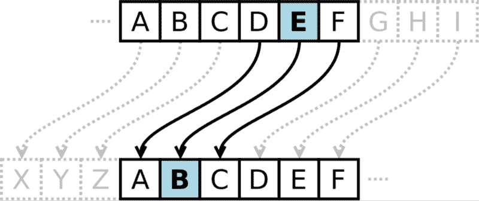
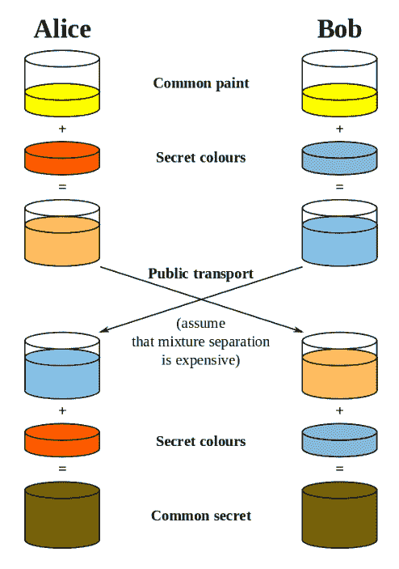
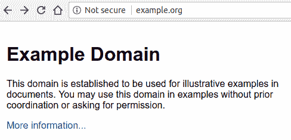
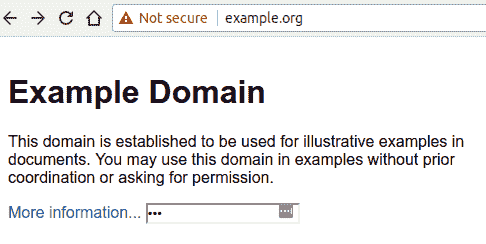
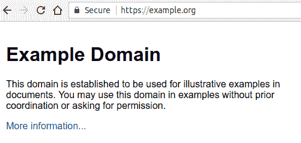

# 网络安全:HTTP 简介

> 原文：<https://www.freecodecamp.org/news/web-security-an-introduction-to-http-5fa07140f9b3/>

亚历克斯·纳达林

# 网络安全:HTTP 简介


Photo by [James Pond](https://unsplash.com/photos/XO9uCZZaipE?utm_source=unsplash&utm_medium=referral&utm_content=creditCopyText) on [Unsplash](https://unsplash.com/search/photos/security?utm_source=unsplash&utm_medium=referral&utm_content=creditCopyText)

*这是网络安全系列的第 2 部分:第 1 部分是“[了解浏览器](https://medium.freecodecamp.org/web-application-security-understanding-the-browser-5305ed2f1dac)”*

HTTP 是一个美丽的东西:一个已经存在了 20 多年而没有太大变化的协议。

正如我们在[上一篇文章](https://medium.freecodecamp.org/web-application-security-understanding-the-browser-5305ed2f1dac)中看到的，浏览器通过 HTTP 协议与 web 应用程序交互，这是我们深入研究这个主题的主要原因。如果用户在网站上输入他们的信用卡详细信息，而攻击者能够在数据到达服务器之前拦截数据，我们肯定会有麻烦。

理解 HTTP 如何工作，我们如何保护客户端和服务器之间的通信，以及该协议提供了哪些与安全相关的功能，这是改进我们的安全状况的第一步。

然而，当讨论 HTTP 时，我们应该始终区分语义和技术实现，因为它们是 HTTP 工作方式的两个非常不同的方面。

两者之间的主要区别可以用一个非常简单的类比来解释:20 年前，人们像现在一样关心他们的亲戚，尽管他们互动的方式已经发生了实质性的变化。我们的父母可能会开着他们的车去他们姐姐家，以便叙叙旧，共度家庭时光。

取而代之的是，如今在 WhatsApp 上发信息、打电话或使用脸书群组变得更加普遍，这些事情在早期是不可能的。这并不是说人们或多或少地交流或关心，而只是说他们互动的方式发生了变化。

HTTP 也不例外:协议背后的语义没有太大变化，而客户机和服务器如何相互通信的技术实现多年来一直在优化。如果您查看 1996 年的 HTTP 请求，它将与我们在[上一篇文章](https://medium.freecodecamp.org/web-application-security-understanding-the-browser-5305ed2f1dac)中看到的非常相似，尽管这些数据包在网络中传输的方式非常不同。

#### 概观

正如我们之前看到的，HTTP 遵循请求/响应模型，其中连接到服务器的客户端发出请求，服务器回复请求。

HTTP 消息(请求或响应)包含多个部分:

*   “一线”
*   头球
*   身体

在请求中，第一行指示客户端使用的动词、它想要的资源的路径以及它将要使用的协议版本:

```
GET /players/lebron-james HTTP/1.1
```

在这种情况下，客户端试图通过协议的版本`1.1`在`/players/lebron-james`处`GET`资源——这不难理解。

在第一行之后，HTTP 允许我们通过标头向消息添加元数据，标头采用键-值对的形式，由冒号分隔:

```
GET /players/lebron-james HTTP/1.1Host: nba.comAccept: */*Coolness: 9000
```

例如，在这个请求中，客户端为请求附加了 3 个额外的头:`Host`、`Accept`和`Coolness`。

等等，`Coolness`？！？！

标头不必使用特定的保留名称，但通常建议使用由 HTTP 规范标准化的名称:您越偏离标准，交换中的另一方就越不理解您。

例如,`Cache-Control`是一个头，用于定义响应是否(以及如何)可缓存:大多数代理和反向代理都理解它，因为它们严格遵循 HTTP 规范。如果您将您的`Cache-Control`头重命名为`Awesome-Cache-Control`，代理将不再知道如何缓存响应，因为它们不是按照您刚刚提出的规范构建的。

但是，有时在消息中包含一个“自定义”头可能是有意义的，因为您可能希望添加并非 HTTP 规范的一部分的元数据:服务器可以决定在其响应中包含技术信息，以便客户端可以同时执行请求并获得有关正在回复的服务器状态的重要信息:

```
...X-Cpu-Usage: 40%X-Memory-Available: 1%...
```

当使用自定义标题时，最好在它们前面加上一个关键字，这样它们就不会与将来可能成为标准的其他标题冲突:从历史上看，这种做法一直很有效，直到每个人都开始使用“非标准的”`X`前缀，这反过来成为了标准。`X-Forwarded-For`和`X-Forwarded-Proto`头是定制头的例子，它们被[广泛使用，并被负载平衡器和代理](https://developer.mozilla.org/en-US/docs/Web/HTTP/Headers#Proxies)所理解，尽管[它们不是 HTTP 标准](https://www.w3.org/Protocols/rfc2616/rfc2616-sec14.html)的一部分。

如果你需要添加自己的自定义头，现在通常最好使用一个供应商提供的前缀，比如`Acme-Custom-Header`或`A-Custom-Header`。

在标头之后，请求可能包含正文，正文与标头之间用一个空行隔开:

```
POST /players/lebron-james/comments HTTP/1.1Host: nba.comAccept: */*Coolness: 9000
```

```
Best Player Ever
```

我们的请求是完整的:第一行(位置和协议信息)、标题和正文。注意，主体是完全可选的，在大多数情况下，它只在我们想要向服务器发送数据时使用——这就是为什么上面的例子使用动词`POST`的原因。

一个回答没有很大的不同:

```
HTTP/1.1 200 OKContent-Type: application/jsonCache-Control: private, max-age=3600
```

```
{"name": "Lebron James", "birthplace": "Akron, Ohio", ...}
```

响应通告的第一个信息是它使用的协议版本，以及该响应的状态。标题紧随其后，如果需要的话，在正文之后有一个换行符。

如前所述，随着时间的推移，该协议经历了多次修订，并增加了一些功能(新的报头、状态代码等)，但底层结构没有太大变化(第一行、报头和主体)。真正改变的是客户机和服务器交换这些消息的方式——让我们更深入地了解一下。

### HTTP vs HTTPS vs H2

HTTP 经历了两次相当大的语义变化:`HTTP/1.0`和`HTTP/1.1`。

“HTTPS 和 [HTTP2](https://httpwg.org/specs/rfc7540.html) 在哪里？”，你问。

HTTPS 和 HTTP2(缩写为 H2)更多的是技术上的变化，因为它们引入了通过互联网传递消息的新方法，而没有严重影响协议的语义。

HTTPS 是对 HTTP 的“安全”扩展，涉及在客户端和服务器之间建立一个共同的秘密，确保我们与正确的一方进行通信，并对使用该共同秘密交换的消息进行加密(稍后将详细介绍)。HTTPS 的目标是提高 HTTP 协议的安全性，而 H2 则致力于实现光速。

H2 使用二进制而不是明文消息，支持多路复用，使用 HPACK 算法压缩报头……长话短说，H2 是 HTTP/1.1 的性能提升。

网站所有者不愿意转向 HTTPS，因为它涉及客户端和服务器之间的额外往返(如上所述，需要在双方之间建立一个共同的秘密)，从而降低了用户体验:使用 H2，默认情况下是加密的，没有更多的借口，因为复用和服务器推送等功能使其[比普通的 HTTP/1.1](https://www.troyhunt.com/i-wanna-go-fast-https-massive-speed-advantage/) 性能更好。

#### HTTPS

HTTPS ( *HTTP Secure* )旨在让客户端和服务器通过 TLS(传输层安全)进行安全对话，TLS 是 SSL(安全套接字层)的继任者。

TLS 针对的问题相当简单，可以用一个简单的比喻来说明:你的另一半在你开会的时候打电话给你，要求你告诉他们你的网上银行账户的密码，因为他们需要执行银行转账，以确保你儿子的学费按时支付。重要的是，你现在就要传达这件事*，否则第二天早上你将面临孩子被学校拒之门外的前景。*

*您现在面临两个挑战:*

*   *认证:确保你真的在和你的另一半说话，因为可能只是某个人假装成他们*
*   *加密:在你的同事无法理解并记下密码的情况下交流密码*

*你是做什么的？这正是 HTTPS 试图解决的问题。*

*为了验证你在和谁通话，HTTPS 使用公共密钥证书，它只不过是表明特定服务器身份的证书:当你通过 HTTPS 连接到一个 IP 地址时，该地址后面的服务器会向你出示它的证书，让你验证它们的身份。回到我们的类比，这可能只是你要求你的另一半拼写他们的社会安全号码。一旦您验证了该号码是正确的，您就获得了额外的信任。*

*然而，这并不能阻止“攻击者”获知受害者的社会安全号码，窃取你灵魂伴侣的智能手机并给你打电话。我们如何验证呼叫者的身份？*

*你没有直接要求你的另一半拼写他们的社会安全号码，而是打电话给你的妈妈(她正好住在你的隔壁)，请她去你的公寓，确保你的另一半拼写他们的社会安全号码。这增加了额外的信任，因为你不认为你的妈妈是一个威胁，并依靠她来验证呼叫者的身份。*

*在 HTTPS 术语中，你妈妈被称为 CA，是 Certificate Authority 的缩写:CA 的工作是验证特定服务器背后的身份，并发布带有其自身数字签名的证书:这意味着，当我连接到特定域时，我将不会看到由该域的所有者生成的证书(称为[自签名证书](https://en.wikipedia.org/wiki/Self-signed_certificate)，而是由 CA 生成的证书。*

*权威机构的工作是确保他们验证域背后的身份，并相应地颁发证书:当你“订购”一个证书时(通常称为 *SSL 证书*，尽管现在使用 TLS 名称确实存在！)，管理机构可能会给您打电话或要求您更改 DNS 设置，以验证您是否控制了有问题的域。验证过程完成后，它将颁发证书，然后您可以将该证书安装到您的 web 服务器上。*

*然后，浏览器之类的客户端将连接到您的服务器，并显示此证书，以便它们可以验证它看起来是真实的:浏览器与 ca 有某种“关系”,从某种意义上说，它们跟踪可信 ca 的列表，以便验证证书是否真的值得信任。如果证书不是由可信机构签署的，浏览器将向用户显示一个大的信息性警告:*

**

*我们已经在保护你和你的另一半之间的通信的道路上走了一半:现在我们已经解决了认证(验证呼叫者的身份)，我们需要确保我们可以安全地通信，在这个过程中没有其他人偷听。正如我提到的，您正在开会，需要拼写您的网上银行密码。你需要找到一种方法来加密你们的交流，这样只有你和你的灵魂伴侣才能理解你们的对话。*

*你可以通过在你们两人之间建立一个共享的秘密来做到这一点，并通过这个秘密来加密信息:例如，你可以根据你的婚礼日期决定使用一个[凯撒密码](https://en.wikipedia.org/wiki/Caesar_cipher)的变体。*

**

*如果双方都建立了关系，比如你和你的灵魂伴侣，这将会很好，因为他们可以基于别人不知道的共同记忆创造一个秘密。然而，浏览器和服务器不能使用相同的机制，因为它们没有彼此的先验知识。*

*取而代之的是 Diffie-Hellman 密钥交换协议的变体，它确保事先不知情的各方建立一个共享秘密，而其他任何人都无法“嗅到”它。这涉及到[运用一点数学](https://en.wikipedia.org/wiki/Diffie%E2%80%93Hellman_key_exchange#Cryptographic_explanation)，这是留给读者的练习。*

**

*一旦建立了秘密，客户机和服务器就可以通信，而不必担心有人会截取它们的消息。即使攻击者这样做了，他们也没有解密消息所需的公共秘密。*

*关于 HTTPS 和迪菲-海尔曼的更多信息，我推荐阅读哈特利·布罗迪的《[HTTPS 如何保护关系](https://blog.hartleybrody.com/https-certificates/)》和《[HTTPS 实际上是如何工作的？罗伯特·希顿。此外，“](https://robertheaton.com/2014/03/27/how-does-https-actually-work/)[改变未来的九种算法](https://en.wikipedia.org/wiki/9_Algorithms_That_Changed_the_Future)”有一章解释了公钥加密，我强烈推荐给对巧妙算法感兴趣的计算机科学极客。*

#### *HTTPS 无处不在*

*还在争论你是否应该在你的网站上支持 HTTPS 吗？我没有好消息告诉你:浏览器已经开始将用户从不支持 HTTPS 的网站推开，以“迫使”网络开发者提供完全加密的浏览体验。*

*在座右铭“[*【HTTPS 无处不在】*](https://www.eff.org/https-everywhere) ”的背后，浏览器开始反对未加密的连接——谷歌是第一个给网络开发者最后期限的浏览器供应商，宣布从 Chrome 68(2018 年 7 月)开始，它将把 HTTP 网站标记为“不安全”:*

**

*对于没有利用 HTTPS 的网站来说，更令人担忧的是，一旦用户在网页上输入任何内容，“不安全”的标签就会变成红色——这一举动应该会鼓励用户在与不支持 HTTPS 的网站交换数据之前三思而行。*

**

*相比之下，在 HTTPS 上运行并配备有效证书的网站看起来像这样:*

**

*理论上，一个网站不一定要安全，但实际上，这会吓跑用户——这是理所当然的。过去，当 H2 还不存在时，坚持使用未加密的普通 HTTP 流量可能是有意义的。如今几乎没有理由这样做。加入无处不在的 HTTPS 运动，帮助 T2 让网上冲浪变得更安全。*

### *获取与发布*

*正如我们前面看到的，HTTP 请求以一个特殊的第一行开始:*

*首先，客户机告诉服务器它使用什么动词来执行请求:常见的 HTTP 动词包括`GET`、`POST`、`PUT`和`DELETE`，但是列表中还可以有不太常见(但仍然标准)的动词，如`TRACE`、`OPTIONS`或`HEAD`。*

*理论上，没有一种方法比其他方法更安全；实际操作起来，没那么简单。*

*请求通常不携带主体，所以参数包含在 URL 中(即。`www.example.com/articles?article_id=1`)而`POST`请求通常用于发送(“post”)包含在主体中的数据。另一个不同之处在于这些动词带来的副作用:`GET`是一个幂等动词，意味着无论您发送多少请求，都不会改变 web 服务器的状态。相反，`POST`并不是等幂的:对于你发送的每一个请求，你可能都在改变服务器的状态(例如，想象一下，发布一笔新的付款——现在你可能明白为什么网站在执行交易时要求你不要刷新页面了)。*

*为了说明这些方法之间的重要区别，我们需要看一下 web 服务器的日志，您可能已经熟悉了:*

```
*`192.168.99.1 - [192.168.99.1] - - [29/Jul/2018:00:39:47 +0000] "GET /?token=1234 HTTP/1.1" 200 525 "-" "Mozilla/5.0 (X11; Linux x86_64) AppleWebKit/537.36 (KHTML, like Gecko) Chrome/65.0.3325.181 Safari/537.36" 404 0.002 [example-local] 172.17.0.8:9090 525 0.002 200192.168.99.1 - [192.168.99.1] - - [29/Jul/2018:00:40:47 +0000] "GET / HTTP/1.1" 200 525 "-" "Mozilla/5.0 (X11; Linux x86_64) AppleWebKit/537.36 (KHTML, like Gecko) Chrome/65.0.3325.181 Safari/537.36" 393 0.004 [example-local] 172.17.0.8:9090 525 0.004 200192.168.99.1 - [192.168.99.1] - - [29/Jul/2018:00:41:34 +0000] "PUT /users HTTP/1.1" 201 23 "http://example.local/" "Mozilla/5.0 (X11; Linux x86_64) AppleWebKit/537.36 (KHTML, like Gecko) Chrome/65.0.3325.181 Safari/537.36" 4878 0.016 [example-local] 172.17.0.8:9090 23 0.016 201`*
```

*正如你所看到的，web 服务器记录请求路径:这意味着，如果你在 URL 中包含敏感数据，它将被 web 服务器泄露并保存在你的日志中的某个地方——你的秘密将以明文的形式保存在某个地方，这是我们需要绝对避免的。想象一下，攻击者能够访问您的旧日志文件，其中可能包含信用卡信息、您私人服务的访问令牌等等:这将是一场灾难。*

*web 服务器不记录 HTTP 头或主体，因为要保存的数据会太大——这就是为什么通过请求主体而不是 URL 发送信息通常更安全。从这里我们可以得出结论，`POST`(以及类似的非幂等方法)比`GET`更安全，尽管这更多的是在使用特定动词时如何发送数据的问题，而不是特定动词本质上比其他动词更安全:如果您要在`GET`请求的正文中包含敏感信息，那么您不会比使用`POST`时面临更多的问题，即使这种方法会被认为是不寻常的。*

### *在我们信任的 HTTP 头中*

*在本文中，我们研究了 HTTP、它的发展以及它的安全扩展如何集成身份验证和加密，从而让客户机和服务器通过安全(r)通道进行通信:这并不是 HTTP 在安全性方面所能提供的全部。*

*正如我们将在下一篇文章中看到的，HTTP 安全头提供了一种提高应用程序安全性的方法，下一篇文章将致力于理解如何利用它们。*

**最初发表于[odino.org](https://odino.org/security-https-perspective/)(2018 年 8 月 22 日)。*
*你可以在[推特](https://twitter.com/_odino_)上关注我——欢迎吐槽！*？*