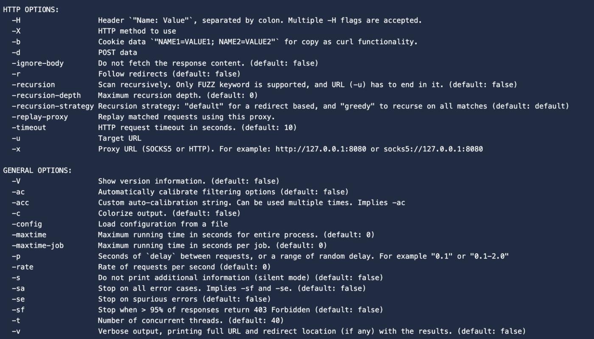
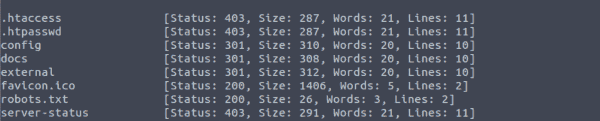
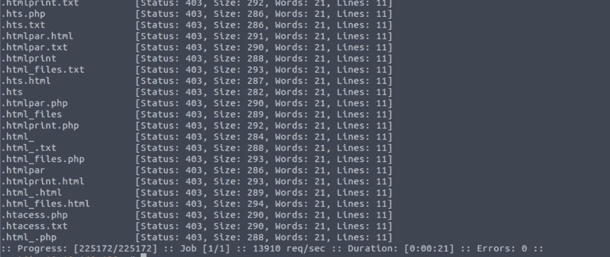
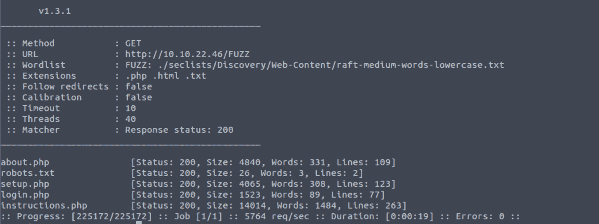
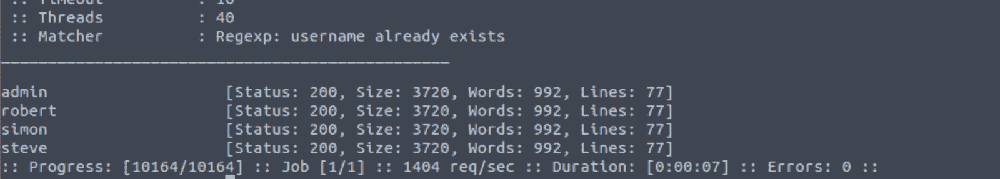
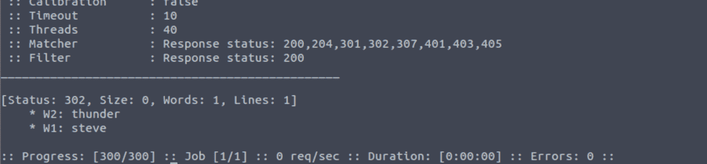

# 如何使用 FFuf 模糊网络应用——网络安全教程

> 原文：<https://www.freecodecamp.org/news/web-security-fuzz-web-applications-using-ffuf/>

构建强认证系统对于 web 应用程序至关重要。现在，许多企业的网上业务越来越多，一个恶意行为者控制你的网站可能是毁灭性的。

在这篇文章中，我们将学习如何使用 Ffuf，一个用 Go 编写的快速 web fuzzer。您将学习如何模糊查找目录和文件的方式，并绕过使用 ffuf 的网站认证。然后，您将学习如何防御这些类型的攻击。

请记住，为了保护您自己和您的网站，了解攻击者试图如何进入会有所帮助。这样，你可以更有效地把他们挡在外面。

注意:在我们开始使用 ffuf 之前，我想强调一下，本教程只是为了帮助你抵御模糊攻击。如果您将本材料用于恶意目的，我不负任何责任。

## FFuf 是什么？

Ffuf 是用 [Go 编程语言](https://go.dev/)编写的 fuzzer。

Ffuf 属于[测试生命周期](https://exploitable.manishmshiva.com/ethical-hacking-lifecycle-five-stages-of-a-penetration-test-c201e8e5bbf7)中的开发阶段。它也是市场上最快的开源 fuzzing 工具。

但是在我们开始使用 Ffuf 之前，我们先了解一下 fuzzing 是什么。

## 什么是起毛？

Fuzzing 是一种向系统发送畸形或异常数据的方法，目的是让系统以某种方式不正常运行，这可能会导致漏洞的发现。

查找隐藏文件、向表单发送随机数据，甚至尝试登录 web 应用程序都可以被认为是模糊的。

那么你可能想知道“它与暴力强制有什么不同？”。

强力可以被认为是起毛的一部分。例如，在暴力攻击中，攻击者使用有效数据来检查登录尝试是否有效。但是通过 Fuzzing，他们可以发送随机数据来破坏系统的预期行为。

举例来说，如果你使用一个像 Ffuf 这样的工具，并加载了数百个用户名和密码组合来尝试访问一个网站，这是模糊的。这正是我们使用 Ffuf 要做的。

如果您打算在第三方网站上试用该工具，请确保您拥有书面许可。

## 如何安装 Ffuf 和单词表

Ffuf 预打包在 Kali Linux 发行版中。如果你想在你的个人电脑上安装 Ffuf，[这里有说明](http://ffuf.me/install)。

因为 Ffuf 是用 Go 编程语言编写的，所以在尝试安装 Ffuf 之前，请确保您的系统中已经安装了 Go 编译器。

如果你不熟悉单词表，单词表是常用术语的列表。这可以是一个[密码词表](https://github.com/danielmiessler/SecLists/blob/master/Passwords/Common-Credentials/10-million-password-list-top-100.txt)、[用户名词表](https://github.com/danielmiessler/SecLists/blob/master/Usernames/Names/names.txt)、子域词表等等。你可以在这里找到很多[有用的单词表。](https://github.com/danielmiessler/SecLists)

我会推荐下载 [Seclists](https://github.com/danielmiessler/SecLists) 。Seclists 是安全评估期间使用的多种类型列表的集合。这包括用户名、密码、网址等。如果您使用的是 Kali Linux，可以在/usr/share/wordlists 下找到 seclists。

要实时尝试这个工具，你可以使用自己的网站，或者使用类似于[Damn Vulnerable web app](https://github.com/digininja/DVWA)(DVWA)的实践 Web app。DVWA 是一种故意错误配置的易受攻击的 web 应用程序，被 pen 测试人员用来练习 web 应用程序攻击。

## 用 Ffuf 起毛

既然你理解了 Fuzzing 和单词表是什么，让我们开始使用 Ffuf。

我们将使用 ffuf 来模糊 web 应用程序，以发现目录、查找用户名、枚举虚拟主机，甚至暴力的电子邮件/密码组合。

如果想快速查看 Ffuf 提供的选项，可以使用 help 命令(-h)。这很有用，因为你不必记住 Ffuf 提供的所有选项。

```
ffuf -h
```



请记住，URL (-u)和 wordlist (-w)参数总是必需的。

注意，对于我的例子，我将使用 [http://localhost:3000](http://localhost:3000) 。如果你设置了自己的网络应用或者使用了一个现有的网站，你必须用网站的 ip 地址或者域名替换“localhost:3000”。

### 如何用 Ffuf 枚举 URL

让我们看看如何找到一些网址路径。

查找 URL 是很有用的，尤其是当它们被隐藏起来而不被公开索引的时候。我们将使用 seclists 中的 [web 内容单词表](https://github.com/danielmiessler/SecLists/blob/master/Discovery/Web-Content/big.txt)来模糊 web 应用程序中隐藏的 URL。

您可以使用以下命令来查找 URL:

```
ffuf -u http://localhost:3000/FUZZ -w /usr/share/wordlists/SecLists/Discovery/Web-Content/big.txt
```

这里，“FUZZ”关键字被用作占位符。Ffuf 将尝试通过用单词列表中的每个单词替换单词“FUZZ”来命中 URL。

以下是我从 DVWA 中发现的:



Result of looking for URLs

有意思。您可以看到，我们已经找到了一些(可能很重要的)位置，如/config、/docs 和/server-status。

如果一个真实世界的网络应用程序的页面没有链接到任何地方，而是使用标准名称，Ffuf 会很容易地发现它们。

### 如何用 Ffuf 枚举文件

如果你想寻找特定的文件呢？幸运的是，Ffuf 为我们提供了可以使用的扩展选项(-e)。我们可以告诉 Ffuf 只查找具有特定扩展名的文件——在我们的例子中。html，。php，和. txt。

为此，我们将使用 [raft-medium-words](https://github.com/danielmiessler/SecLists/blob/master/Discovery/Web-Content/raft-medium-words-lowercase.txt) 单词表。以下是查找特定文件的命令:

```
ffuf -u http://localhost:3000/FUZZ -w /usr/share/wordlists/SecLists/Discovery/Web-Content/raft-medium-words-lowercase.txt -e .php,.html,.txt
```

此命令在域的根目录下查找所有扩展名为的文件。html，。php 和. txt。下面是 DVWA 的结果:



Result of looking for specific files

我们发现了一长串文件。即使有些文件没有在 web 应用程序上提供(403 状态)，我们也可以了解到有文件，只是我们还不能访问它们。

让我们运行相同的命令，但是现在，我们将只查找公众可以访问的文件。我们将使用匹配代码(-mc)标志来只查找状态为 200 的文件。

以下是命令:

```
ffuf -u http://localhost:3000/FUZZ -w /usr/share/wordlists/SecLists/Discovery/Web-Content/raft-medium-words-lowercase.txt -e .php,.html,.txt -mc 200
```

这是结果。



Files accessible to the public

您可以看到，我们已经找到了一些可以访问的文件。login.php 看起来很有趣，我们将在下面的小节中使用它来绕过身份验证。

### 如何使用 Ffuf 枚举子域

您还可以使用 Ffuf 在 web 应用程序中查找子域。

你可能已经猜到了我们将要使用的方法。我们将用单词“FUZZ”替换该 URL 的子域，并尝试查找已打开的 URL。

因为我的 web 应用程序托管在我的本地系统上，所以它不包含任何子域。但是在现实世界中，如果你想枚举子域，这里是命令。您可以使用 seclists 中的[子域名词表](https://github.com/danielmiessler/SecLists/blob/master/Discovery/DNS/subdomains-top1million-5000.txt)。

```
ffuf -u http://FUZZ.mydomain.com -w /usr/share/seclists/Discovery/DNS/subdomains-top1million-5000.txt
```

### 如何使用 Ffuf 查找用户名

当 web 应用程序不告诉你是否输入了错误的用户名或密码时，你是否感到烦恼？他们只是告诉你“这个组合不行”。

这是为了保护 web 应用程序免受用户名/电子邮件模糊攻击。如果身份验证系统向您提供有关登录尝试的特定信息，攻击者就更容易暴力破解并发现用户名或电子邮件列表。

假设我们的 web 应用程序用消息“用户名不存在”告诉您用户名错误。我们可以使用此错误消息，通过以下命令来查找有效的用户名:

```
ffuf -w /usr/share/SecLists/Usernames/top-usernames-shortlist.txt -X POST -d "username=FUZZ&&password=x" -H "Content-Type: application/x-www-form-urlencoded" -u http://mydomain.com/login -mr "username already exists"
```

这里，我们向登录页面发送 POST 请求，使用模糊的用户名和假密码来检查是否返回了预期的错误消息。您可以使用 seclists 中的[用户名单词列表](https://github.com/danielmiessler/SecLists/blob/master/Usernames/top-usernames-shortlist.txt)进行模糊处理。

-mr 标志用于匹配正则表达式。您可以使用复杂的正则表达式或简单的字符串消息来验证请求。

下面是一个示例响应。



### 使用 Ffuf 的暴力强制

现在，让我们用 Ffuf 做一些强力运算。我们将尝试一些常见的用户名/密码组合，看看是否有什么有用的。

如果您测试的 web 应用程序使用电子邮件和密码的组合，您可以用电子邮件单词列表替换用户名单词列表。

所以对于这次攻击，我们需要两个参数:用户名和密码。此外，我们将使用两个单词列表:如你所料，用户名单词列表和密码单词列表。

另外默认占位符 **FUZZ，** Ffuf 支持使用变量。因此，我们将使用 W1 作为用户名单词表，W2 作为密码单词表。

以下是命令:

```
ffuf -w usernames.txt:W1,/usr/share/wordlists/SecLists/Passwords/Common-Credentials/10-million-password-list-top-100.txt:W2 -X POST -d "username=W1&password=W2" -H "Content-Type: application/x-www-form-urlencoded" -u http://localhost:3000/login -fc 200
```

如果 Ffuf 找到任何有效的组合，您将在结果中看到该组合。您还可以使用-fc 或-mc 标志按状态代码过滤(例如过滤 400 或查找 200 ),以减少干扰。

下面是一个示例响应。



那很有趣，不是吗？我们不需要使用 [Burpsuite](https://www.kali.org/tools/burpsuite/) 这样复杂的工具，就可以找到很多关于一个 web app 的有趣信息。

## 如何保护你的网站不模糊

但既然我们不是恶意攻击者，那就来看看如何防御 fuzzing 吧。

保护您的网站免受模糊攻击的最简单的方法是小心 web 服务器上的文件类型。如果你不想让某些东西被发现，就不要把它放在网络服务器上。

为了防止绕过身份验证，不允许多次尝试登录是很重要的。大多数现代网站不允许连续登录超过 5 次。通过电子邮件要求用户重置密码比让他们尝试多种组合更安全。

您还应该小心尝试失败时返回的错误消息。显示“电子邮件不存在”或“密码不正确”会让黑客知道电子邮件或用户名存在。这只是让他们的工作更容易。

最后，您可以使用 [Web 应用防火墙](https://www.cloudflare.com/en-gb/learning/ddos/glossary/web-application-firewall-waf/) (WAF)来监控流量和阻止可疑的 IP 地址。如果 WAFs 遇到对您的身份验证方法的暴力尝试，它也可以设置警报。

## 摘要

Ffuf 是你测试工具包中的一个很好的工具。这是一个简单而快速的 fuzzer，它使枚举目录、发现虚拟主机和暴力 web 应用程序变得容易。

Ffuf 也有更多的选项来帮助你寻找特定的信息。它支持正则表达式、请求速率限制以及将结果保存到文件中。

希望你喜欢这篇文章。你可以[在 Linkedin](https://www.linkedin.com/in/manishmshiva/) 上与我联系，或者[在我的博客](https://blog.manishmshiva.com/)上阅读更多文章。我很快会带着另一篇文章来见你。