# 网络安全:如何强化你的 HTTP cookies

> 原文：<https://www.freecodecamp.org/news/web-security-hardening-http-cookies-be8d8d8016e1/>

亚历克斯·纳达林

注意:这是关于网络安全系列的第 4 部分。第 3 部分是用这些 HTTP 头保护您的 web 应用程序。

想象一下，作为一名后端开发人员，他需要在应用程序中实现*会话*:您想到的第一件事是向客户端发出*令牌*,并要求他们在后续请求中发送这个令牌。从那时起，您将能够根据请求中包含的令牌来识别客户端。

HTTP cookies 的诞生是为了跨浏览器标准化这种机制。它们只不过是一种存储服务器发送的数据并随将来的请求一起发送的方法。服务器发送一个包含少量数据的 cookie。浏览器存储它并将它与将来的请求一起发送到同一个服务器。

从安全角度来看，我们为什么要担心 cookies 呢？因为它们包含的数据通常是极其敏感的。Cookies 通常用于存储会话 id 或访问令牌，这是攻击者的圣杯。一旦暴露或受到威胁，攻击者就可以冒充用户，或者提升他们在您的应用程序上的权限。

在 web 上实现会话时，保护 cookies 是最重要的方面之一。因此，本章将让您更好地理解 cookies，如何保护它们，以及可以使用哪些替代方法。

### 饼干后面是什么？

服务器可以使用`Set-Cookie`头设置 cookie:

```
HTTP/1.1 200 OkSet-Cookie: access_token=1234...
```

然后，客户端将存储这些数据，并通过`Cookie`报头在后续请求中发送这些数据:

```
GET / HTTP/1.1Host: example.comCookie: access_token=1234...
```

请注意，服务器可以一次设置多个 cookies:

```
HTTP/1.1 200 OkSet-Cookie: access_token=1234Set-Cookie: user_id=10...
```

客户端可以存储多个 cookies，并在请求中发送它们:

```
GET / HTTP/1.1Host: example.comCookie: access_token=1234; user_id=10...
```

除了普通的*键*和*值*之外，cookies 还可以携带限制其生存时间和范围的附加指令。

### 期满

指定 cookie 应该何时过期，这样浏览器就不会无限期地存储和传输它。一个明显的例子是会话 ID，它通常在一段时间后过期。该指令以`Date: <day-name>, <day> <month> <year> <`小时> `;:<minute>:<second> GMT`的形式表示为日期，如日期:Fri，2018 年 8 月 24 日 04:33:00 GMT。这里有一个完整的 2018 年 1 月 1 日到期的 cookie 示例:

```
access_token=1234;Expires=Mon, 1st Jan 2018 00:00:00 GMT
```

### 最大年龄

类似于`Expires`指令，`Max-Age`指定了 cookie 过期前的秒数。应该持续 1 小时的 cookie 如下所示:

```
access_token=1234;Max-Age=3600
```

### 领域

该指令定义了 cookie 应该发送到哪些主机。请记住，cookies 通常包含敏感数据，因此浏览器不要将它们泄露给不受信任的主机是非常重要的。带有指令`Domain=trusted.example.com`的 cookie 不会和请求一起发送到除了`trusted.example.com`之外的任何域，甚至是根域`example.com`。以下是一个仅限于特定子域的 cookie 的有效示例:

```
access_token=1234;Domain=trusted.example.com
```

### 小路

类似于`Domain`指令，但是适用于 URL 路径(`/some/path`)。该指令防止 cookie 与不受信任的路径共享，如下例所示:

```
access_token=1234;Path=/trusted/path
```

### 会话和持久 cookies

当服务器发送一个没有设置其`Expires`或`Max-Age`的 cookie 时，浏览器将其视为一个*会话 cookie* :浏览器不会猜测它的生存时间或应用有趣的试探法，而是在它关闭时删除它。

相反，*持久 cookie* 存储在客户端，直到其`Expires`或`Max-Age`指令设置的截止日期。

值得注意的是，浏览器可能会采用一种被称为*会话恢复*的机制，其中会话 cookies 可以在客户端关闭后恢复。浏览器已经实现了这种机制，方便用户在崩溃后恢复会话。如果我们期望会话 cookies 在某个时间范围内过期(例如，我们绝对肯定会话不会持续超过 X 时间量)，会话恢复可能会导致[意外问题](https://stackoverflow.com/questions/777767/firefox-session-cookies)。

从浏览器的角度来看，会话恢复是一个完全有效的特性，因为这些 cookies 留在客户机手中，没有截止日期。客户机对这些 cookies 做什么不会影响服务器，服务器无法检测客户机是否在任何时间点关闭。如果客户端希望保持会话 cookies 永远存在，这与服务器无关。这肯定是一个有问题的实现，但是服务器对此无能为力。

我不认为会话和持久 cookies 之间有明显的赢家，因为两者都很好地服务于不同的目的。然而，我观察到的是，脸书、谷歌和类似的服务将使用持久 cookies。从个人经验来看，我通常总是使用持久性 cookies，但从来没有将关键信息，如社会保险号或银行账户余额与会话联系起来。

在某些情况下，出于合规性要求，您可能需要使用会话 cookies。我见过审计员要求将所有持久 cookiess 转换成会话 cookie。当人们问我应该用 X 还是 Y？“我的回答是“看上下文”。为你的博客建立一个留言簿与建立一个银行系统有着不同的安全后果。正如我们将在本系列后面看到的，我建议理解您的环境并尝试构建一个足够安全的*系统:绝对安全是乌托邦，就像 100% SLA 一样。*

### *仅限主机*

*当服务器不包含`Domain`指令时，cookie 将被视为`host-only`指令，这意味着它的有效性仅限于当前域。*

*当浏览器收到没有设置`Domain`的 cookie 时，这是一种“默认”行为。你可以找到我在 github.com/odino/wasec/tree/master/cookies 写的一个小例子。这是一个简单的 web 应用程序，它基于 URL 参数设置 cookie，并通过一些 JavaScript 代码在页面上打印 cookie:*

```
*`<html>  <div id="output"/ >  <script>    let content = "none";`*
```

```
*`if (document.cookie) {      let cookies = document.cookie.split(';')      content = ''`*
```

```
*`cookies.forEach(c => {        content += "<p><code>" + c + "</code></p>"      })    }`*
```

```
*`document.getElementById('output').innerHTML = "Cookies on this document: <div>" + content + "</div>"  </script><html>`*
```

*如果您遵循`README`中的说明，您将能够访问位于 [wasec.local:7888](http://wasec.local:7888/) 的网络服务器，这说明了`host-only`cookie 是如何工作的:*

*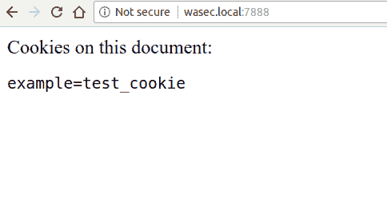*

*如果我们随后尝试访问一个子域，我们在主域上设置的 cookies 将不可见—尝试导航到[sub wasec . local:7888](http://sub.wasec.local:7888/):*

*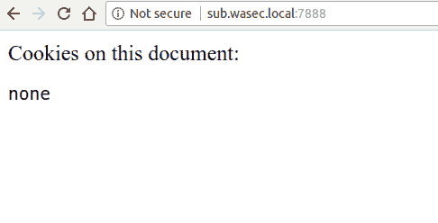*

*正如我们前面看到的，绕过这个限制的一个方法是指定 cookie 的`Domain`指令，这可以通过访问[wasec.local:7888/?domain=on](http://wasec.local:7888/?domain=on)来实现:*

*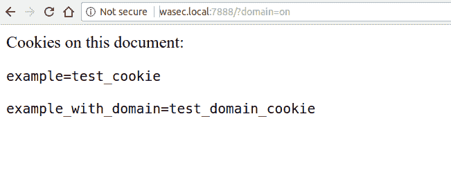*

*如果我们看一下在子域上运行的应用程序，我们现在将能够看到在父域上设置的 cookie，因为它们使用`Domain=wasec.local`，这允许任何在`wasec.local`下的域访问 cookie:*

*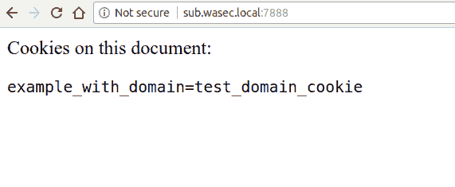*

*在 HTTP 术语中，从服务器发送的响应看起来是这样的:*

```
*`~ ᐅ curl -I http://wasec.local:7888HTTP/1.1 200 OKSet-Cookie: example=test_cookieDate: Fri, 24 Aug 2018 09:34:08 GMTConnection: keep-alive`*
```

```
*`~ ᐅ curl -I "http://wasec.local:7888/?domain=on"HTTP/1.1 200 OKSet-Cookie: example=test_cookieSet-Cookie: example_with_domain=test_domain_cookie;Domain=wasec.localDate: Fri, 24 Aug 2018 09:34:11 GMTConnection: keep-alive`*
```

### *超级图书*

*如果我们能够在顶级域名(TLD)如`.com`或`.org`上设置 cookie 会怎么样？这无疑是一个巨大的安全隐患，主要有两个原因:*

*   ***用户隐私:**在特定 TLD 上运行的每个网站都能够在共享存储中跟踪用户的信息*
*   ***信息泄露:**服务器可能会错误地将敏感数据存储在其他站点可用的 cookie 中*

*幸运的是，由于我上面提到的原因，网络浏览器禁用了 TLD cookie，也称为[超级 cookie](https://en.wikipedia.org/wiki/HTTP_cookie#Supercookie)。如果你试图设置一个超级书签，浏览器会拒绝这样做。如果我们在示例中添加参数`super=on`,我们将看到服务器试图设置一个 supercookie，而浏览器忽略它:*

*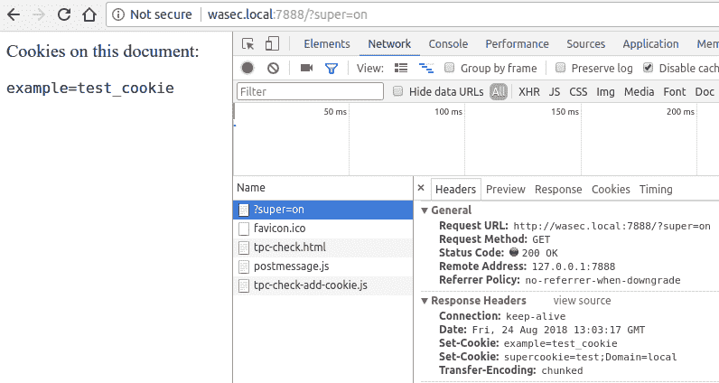*

*然而，在今天的网络中，还有其他方法来跟踪用户， [ETag tracking](https://en.wikipedia.org/wiki/HTTP_ETag#Tracking_using_ETags) 就是一个例子。由于 cookie 通常与跟踪联系在一起，[这些技术通常也被称为超级 cookie](https://qz.com/634294/a-short-guide-to-supercookies-whether-youre-being-tracked-and-how-to-opt-out/)，尽管它们不依赖于 HTTP cookies。其他可能指同一组技术和实践的术语有 permacookies(永久 cookie)或 zombiecookies(永不消亡的 cookie)。*

> ***不受欢迎的威瑞森广告***

> *公司喜欢从广告中赚钱，这不是什么新闻。但是，当互联网服务提供商开始积极跟踪他们的客户，以提供不想要的广告，那么，这是一个不同的故事。*

> **2016 年，[威瑞森被发现未经用户同意跟踪用户](https://www.theverge.com/2016/3/7/11173010/verizon-supercookie-fine-1-3-million-fcc)，并与广告商分享他们的信息。这导致了 135 万美元的罚款，并使该公司无法继续其有问题的跟踪政策。**

> *另一个有趣的例子是康卡斯特，他曾经在通过其网络提供的网页中包含定制的 JavaScript 代码。*

> *不用说，如果所有的网络流量都通过 HTTPS 提供，我们就不会有这个问题，因为互联网服务提供商无法即时解密和操纵流量。*

### *重要的 Cookie 标志*

*到目前为止，我们仅仅触及了 HTTP cookies 的皮毛。现在是我们品尝真正果汁的时候了。*

*在使用 cookie 之前，应该理解 3 个非常重要的指令(`Secure`、`HttpOnly`和`SameSite`，因为它们对 cookie 的存储和安全有很大影响。*

### *加密它或者忘记它*

*Cookies 包含非常敏感的信息。如果攻击者获得了会话 ID，他们可以通过劫持用户的会话来冒充用户。*

*大多数*会话劫持*攻击通常通过*中间人*发生，中间人可以监听客户端和服务器之间未加密的流量，窃取任何交换的信息。如果 cookie 是通过 HTTP 交换的，那么它很容易受到 MITM 攻击和会话劫持。*

*为了解决这个问题，我们可以在发布 cookie 时使用 HTTPS，并给它添加`Secure`标志。这指示浏览器永远不要在普通的 HTTP 请求中发送 cookie。*

*回到我们的实际例子，我们可以通过导航到[https://wasec.local:7889/?secure=on](https://wasec.local:7889/?secure=on)进行测试。服务器设置 2 个额外的 cookies，一个带有`Secure`标志，另一个没有:*

*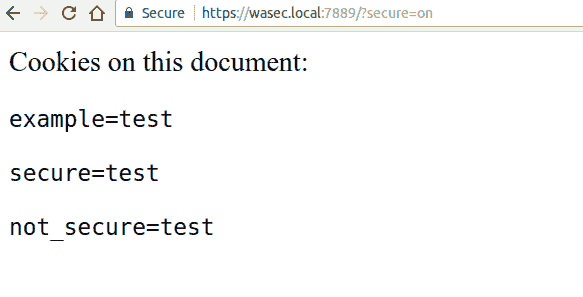*

*当我们返回并导航到网站的 HTTP 版本时，我们可以清楚地看到页面中没有`Secure` cookie。尝试导航到 [wasec.local:7888](http://wasec.local:7888/) 。*

**

*我们可以清楚地看到，我们的应用程序的 HTTPS 版本设置了一个 cookie，可用于 HTTP 应用程序(即`not_secure`应用程序)，但另一个 cookie，标记为`Secure`，却不见踪影。*

*将敏感 cookie 标记为`Secure`是 cookie 安全性的一个极其重要的方面。即使你通过 HTTPS 提供所有的流量，攻击者也可以找到一种方法在你的域名下建立一个普通的 HTTP 页面，并将用户重定向到那里。除非你的饼干是`Secure`，否则他们将有机会享用一顿非常美味的大餐。*

### *JavaScript 碰不到这个*

*正如我们在本系列前面看到的，XSS 攻击允许恶意用户在页面上执行任意 JavaScript。考虑到您可以通过一个简单的`document.cookie`来读取 cookie jar 的内容，从安全的角度来看，保护我们的 cookie 免受不可信的 JavaScript 访问是强化 cookie 的一个非常重要的方面。*

*幸运的是，HTTP 规范用`HttpOnly`标志解决了这个问题。通过使用这个指令，我们可以指示浏览器不要与 JavaScript 共享 cookie。然后浏览器从`window.cookie`变量中移除 cookie，使得无法通过 JavaScript 访问 cookie。*

*如果我们看看在 wasec.local:7888/?httponly=on 的例子，我们可以清楚地看到这是如何工作的。浏览器已经存储了 cookie(如下面的 DevTools 截图所示),但不会与 JavaScript 共享:*

*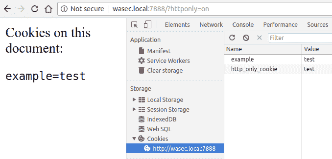*

*浏览器将在后续请求中继续向服务器发送 cookie，因此服务器仍然可以通过 cookie 跟踪客户端。在这种情况下，诀窍在于 cookie 永远不会暴露给最终用户，并且在浏览器和服务器之间保持“私有”。*

*`HttpOnly`标志通过拒绝访问存储在 cookie 中的关键信息来帮助减轻 XSS 攻击。使用它使攻击者更难劫持会话。*

> **2003 年，研究人员发现了一个围绕`HttpOnly`旗帜、[跨站追踪](https://www.owasp.org/index.php/Cross_Site_Tracing) (XST)的有趣漏洞。**

> **简而言之，当使用`TRACE`请求方法时，浏览器不会阻止对`HttpOnly`cookie 的访问。虽然大多数浏览器现在已经禁用了这种方法，但我的建议是在您的 web 服务器级别禁用`TRACE`，返回`405 Not allowed`状态代码。**

### *同一个网站:CSRF 杀手*

*最后但同样重要的是，`SameSite`标志，cookie 世界中的最新条目之一。*

*由谷歌 Chrome v51 推出的这个标志有效地从网络上消除了*跨站请求伪造* (CSRF)。`SameSite`是一项简单但具有突破性的创新，因为以前针对 CSRF 攻击的解决方案要么不完整，要么对网站所有者来说负担太重。*

*为了理解`SameSite`，我们首先需要看一看它消除的漏洞。CSRF 是当用户在站点 B 上经过身份验证时，站点 A 向站点 B 发出的不需要的请求*

*听起来很复杂？让我重新措辞。*

*假设您登录了您的银行网站，该网站有一个基于 HTML `<fo` rm >和一些附加参数(目的账户和金额)的转账机制。当网站收到带有这些参数和您的会话 cookie 的 POST 请求时，它将处理传输。现在，假设一个恶意的第三方网站设置了这样一个 HTML 表单:*

```
*`<form action="https://bank.com/transfer" method="POST"><input type="hidden" name="destination" value="attacker@email.com" /><input type="hidden" name="amount" value="1000" /><input type="submit" value="CLICK HERE TO WIN A HUMMER" /></form>`*
```

*明白这是什么意思了吗？*

*如果你点击提交按钮，巧妙地伪装成一个有吸引力的奖品，1000 美元将从你的帐户转移。这是一个跨站请求伪造-不多不少。*

*传统上，有两种方法可以除掉 CSRF:*

*   *`Origin`和`Referer`报头:服务器可以验证这些报头来自可信的来源(例如`https://bank.com`)。这种方法的缺点是，正如我们在本系列前面看到的，无论是`Origin`还是`Referer`都不太可靠，为了保护用户的隐私，客户端可能会将其“关闭”。*
*   *CSRF 令牌:服务器可以在表单中包含一个签名令牌，并在表单提交后验证其有效性。这通常是一种可靠的方法，也是多年来推荐的最佳实践。CSRF 令牌的缺点是它们是后端的技术负担，因为您必须在 web 应用程序中集成令牌生成和验证。这似乎不是一个复杂的任务，但是一个更简单的解决方案会更受欢迎。*

*cookies 旨在一劳永逸地取代上述解决方案。当您用这个标志标记一个 cookie 时，您告诉浏览器不要在由不同来源生成的请求中包含这个 cookie。当浏览器向您的服务器发起请求，并且 cookie 被标记为`SameSite`时，浏览器将首先检查请求的来源是否与发布 cookie 的来源相同。如果不是，浏览器将不会在请求中包含 cookie。*

*我们可以以 github.com/odino/wasec/tree/master/cookies[的](https://github.com/odino/wasec/tree/master/cookies)为例实际看看`SameSite`。当你浏览到 wasec.local:7888/?samesite=on 的[时，服务器会设置一个`SameSite` cookie 和一个“普通”cookie。](http://wasec.local:7888/?samesite=on)*

*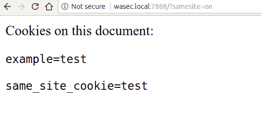*

*如果我们随后访问[wasec2.local:7888/same-site-form](http://wasec2.local:7888/same-site-form)，我们将看到一个触发跨站点请求的 HTML 表单示例:*

*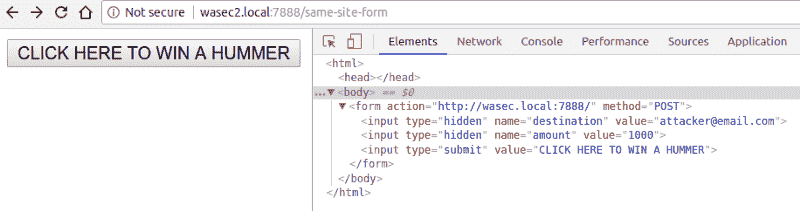*

*如果我们点击表单的提交按钮，我们将能够理解这个标志的真正力量。该表单会将我们重定向到 [wasec.local:7888](http://wasec.local:7888/) ，但是在浏览器发出的请求中没有`SameSite` cookie 的踪迹:*

*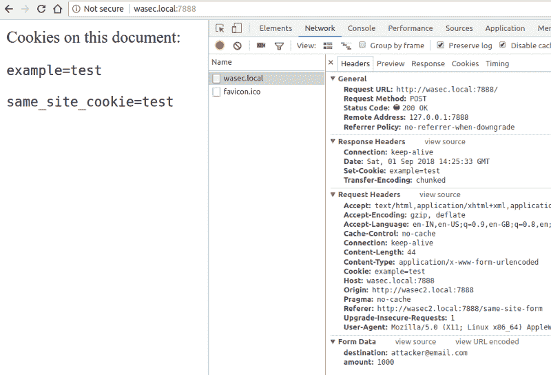*

*不要因为在屏幕上看到`same_site_cookie=test`而感到困惑:浏览器提供了 cookie，但它不是在请求本身中发送的。我们可以通过在地址栏中输入`http://wasec.local:7888/`来验证这一点:*

*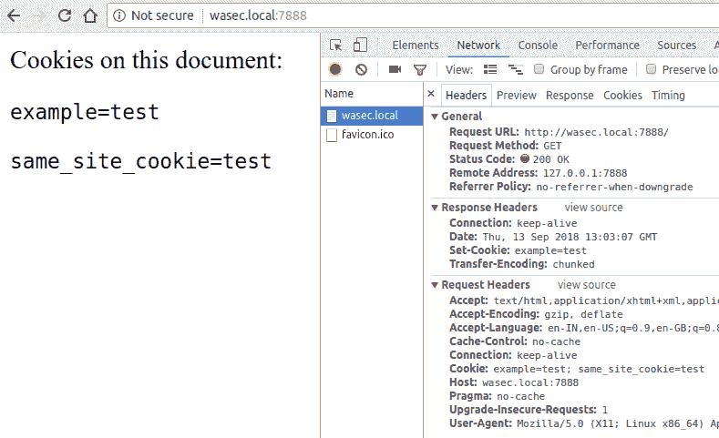*

*因为请求的发起者是“安全的”(没有来源，`GET`方法)，所以浏览器发送带有请求的`SameSite` cookie。*

*这款别出心裁的旗帜有两种变体，`Lax`和`Strict`。我们的示例使用前者，因为它允许顶级网站导航包含 cookie。当您将 cookie 标记为`SameSite=Strict`时，浏览器将不会跨任何跨源请求发送 cookie，包括顶级导航。这意味着如果你点击一个使用`strict` cookies 的网站链接，你将无法登录。另一方面，极高的保护级别可能会让用户感到惊讶。`Lax`模式允许使用安全的方法(比如`GET`)跨请求发送这些 cookies，在安全性和用户体验之间创建了一个非常有用的组合。*

> **让我们回顾一下我们所学到的关于 cookies 标志的知识，因为当你通过它们存储或允许访问敏感数据时，它们是至关重要的，这是一种非常标准的做法:**

> *-将 cookies 标记为`Secure`将确保它们不会跨未加密的请求发送，从而使中间人攻击变得毫无用处*

> *-使用`HttpOnly`标志，我们告诉浏览器不要与客户端共享 cookie(例如，允许 JavaScript 访问 cookie)，从而限制 XSS 攻击的爆炸半径*

> *-将 cookie 标记为`SameSite=Lax|Strict`将防止浏览器在跨来源请求中发送它，从而使任何类型的 CSRF 攻击无效*

### *可供选择的事物*

*阅读所有这些关于 cookie 和安全性的材料，您可能会忍不住说“我真的想远离 cookie！”。事实是，到目前为止，如果您想通过 HTTP 实现某种会话机制，cookies 是您的最佳选择。我不时会被要求评估 cookies 的替代品，因此我将尝试总结一些经常被提及的东西:*

*   *[localStorage](https://developer.mozilla.org/en-US/docs/Web/API/Window/localStorage) :特别是在单页面应用程序(SPA)的上下文中，当讨论在哪里存储敏感令牌时，localStorage 有时会被提及。然而，这种方法的问题在于，本地存储不能提供任何针对 XSS 攻击的保护。如果攻击者能够在受害者的浏览器上执行一个简单的`localStorage.getItem('token')`，那么游戏就结束了。`HttpOnly`cookie 轻松克服了这个问题。*
*   *JWT:JSON Web 令牌定义了一种为客户端安全创建访问令牌的方法。JWT 是一种规范，它定义了访问令牌的外观，但没有定义令牌的存储位置。换句话说，您可以将 JWT 存储在 cookie、本地存储甚至内存中，因此认为 JWTs 是 cookie 的“替代品”没有意义。*

### *勒布朗会怎么做？*

**

*是时候离开 HTTP 协议和它的特性了，比如 cookies。在这个系列中，我们已经走过了一段漫长的旅程，剖析了 cookie 诞生的原因，它们是如何构造的，如何通过对它们的`Domain`、`Expires`、`Max-Age`和`Path`属性应用一些限制来保护它们，以及其他标志如`Secure`、`HttpOnly`和`SameSite`如何在强化 cookie 中至关重要。*

*让我们向前看，从安全角度来看，当我们遇到特定情况时，我们应该做些什么。下一篇文章将尝试根据最佳实践和过去的经验提供建议。*

*本系列的下一篇文章将介绍我所谓的“*情景*”。*

**最初发表于[odino.org](https://odino.org/security-hardening-http-cookies/)(2018 年 9 月 14 日)。*
*你可以在[推特](https://twitter.com/_odino_)上关注我——欢迎吐槽！*？*