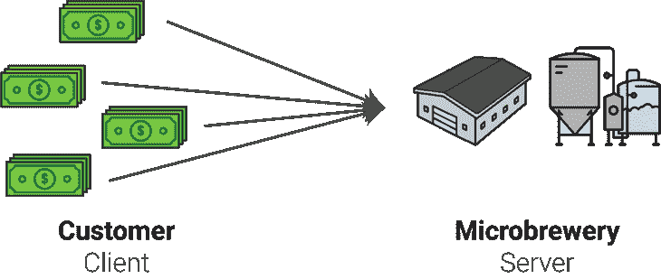
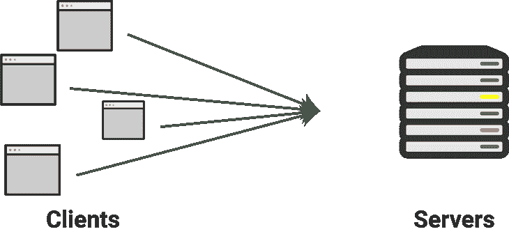
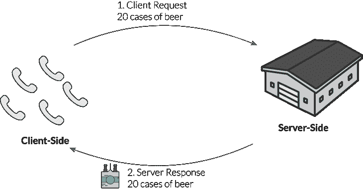
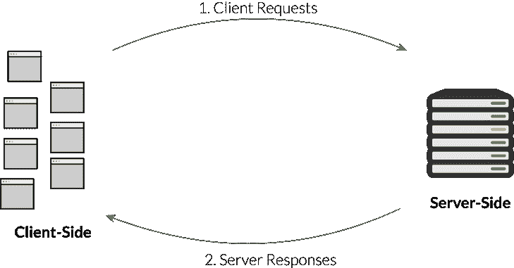
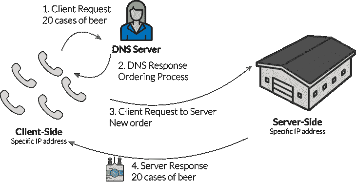
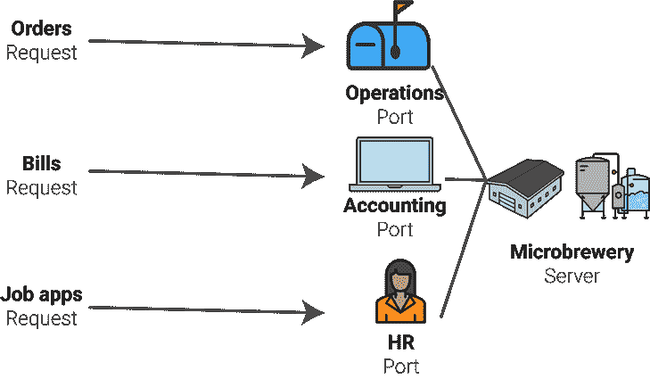
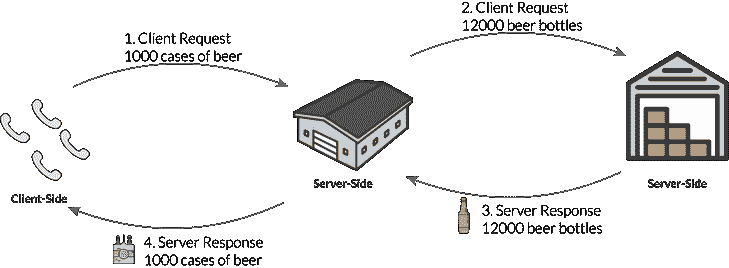
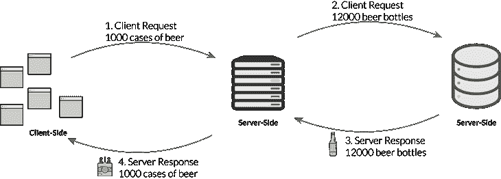
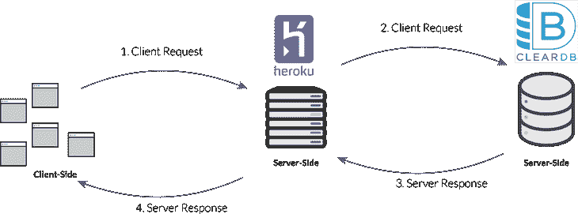

# 通过运行微型酿酒厂来解释 Web 服务器

> 原文：<https://www.freecodecamp.org/news/web-servers-explained-by-running-a-microbrewery-d40b9824f882/>

凯文·科诺年科

# 通过运行微型酿酒厂来解释 Web 服务器

If you can understand the different inputs and outputs of a microbrewery, then you can understand how a web server works.

当你刚刚开始 web 开发时，你可能会想，*“当有人在浏览器中键入[https://mysite.com](https://mysite.com)时，所有这些新概念是如何相互联系起来的？”*

当然，你可能知道前端和后端的区别，但这只是给你一个高层次的观点。

为了提供帮助，我想创建一个完整的指南来解释客户端(浏览器)和服务器端(多个服务器)之间的联系。

比如，你知道服务器和数据库的区别吗？

事情是这样的:客户机-服务器模型的运作有点像一个微型酿酒厂。如果你能理解微酿酒厂的不同部分，那么你就能理解网络服务器的基础。

### 客户机-服务器模式

在这个小型啤酒厂，你的目标是向酒吧、酒类商店和超市销售大量的啤酒。您有各种各样的客户，他们每周或每月都会下大量订单。

这意味着客户会不时给你的销售团队打电话或发电子邮件，提出**请求**。在互联网上，这被称为“T2”客户端“T3”。客户端不与它正在请求的网络的其他成员共享它的任何计算能力。它只是要求特定的内容或功能。

在等式的另一边，您的啤酒厂运营团队的存在是为了酿造满足客户需求的啤酒。在这种情况下，他们就是**服务器**。这意味着它们等待来自客户端的请求，并基于**请求使用它们的计算能力来共享适当的资源。**

客户端的一个常见例子是像 Chrome 这样的网络浏览器。服务器位于远程位置，由亚马逊([亚马逊网络服务](https://en.wikipedia.org/wiki/Amazon_Web_Services))这样的公司管理。

你可能认为这是一维的，就像“是的，这些是任何购买过程的基础！”但是，正如您稍后将看到的那样，随着更多的当事方参与进来，事情会变得更加复杂。

### 请求-响应模型

正如您所看到的，在客户机-服务器模型中，每一方都有不同的角色。客户端是请求者，服务器是回应者。

在一个非常基本的例子中，一家超市可能会发送一个类似“我们需要 20 箱啤酒”的请求在未来的某个时刻，你的微酿酒厂会发送响应:被请求的啤酒。

类似地，Chrome 等浏览器向集中式服务器发送请求，后者返回请求的数据。例如，当你加载一个像*reddit.com*这样的页面时，服务器必须根据最新的 upvote 和评论数据发送一个新版本的主页。

所以你的下一个问题可能是，*“互联网如何大规模处理这些请求和响应？”*

首先，每一个连接到网络(比如互联网)的设备都被称为**主机**。每台主机都有一个唯一的 **IP 地址**用于识别。一个 **DNS 服务器**(新型服务器)将一个类似 reddit.com 的 URL 连接到一个特定服务器的 IP 地址。

当你输入一个类似 reddit.com 的网址时，你并没有直接连接到 reddit 的网络服务器。相反，你首先连接到这个 DNS 服务器，由托管公司提供。然后这个服务器用一个 reddit 服务器的具体地址来响应你的请求。您的浏览器现在可以向 reddit 的服务器发出请求。

假设你是一家超市，从一家小型啤酒厂订购了第一批啤酒。你不能打电话给酿酒车间，命令员工给你送啤酒！相反，你可以打电话给销售人员或支持代理，他们会确保你了解物流是如何运作的:他们使用哪个分销商，他们能多快交货，等等。销售代理就像 DNS 服务器，因为他们将共享实际完成订单的流程。

在你接受这一切之后，你可以向专门酿造啤酒的生产团队提出要求。

所以，按顺序:

1.  像 Chrome 这样的浏览器进入网址 reddit.com
2.  请求发送到 DNS 服务器，DNS 服务器以 reddit 服务器的 IP 地址作为响应
3.  浏览器现在向 reddit 服务器发出请求
4.  Reddit 服务器以主页响应

这有时被称为"[关注点分离](https://en.wikipedia.org/wiki/Separation_of_concerns)"它允许每个服务器执行特定的功能，以便每个部分都能最有效地工作。

### 对端口的解释

微酿酒厂不仅仅处理一种类型的请求！在任何一周，它都可能处理:

*   供应商的账单(如装瓶公司、啤酒花供应商)
*   来自客户的订单(如上所述)
*   新候选人的工作申请

每一种类型的请求都必须交给酿酒厂的专业人员。

*   账单送到会计部门
*   订单会发送给运营团队
*   求职申请送到人力资源部

就像一个微型酿酒厂一样，服务器为不同类型的请求提供路径。这些被称为 [**港口**](https://en.wikipedia.org/wiki/Port_(computer_networking)) 。一些常见的端口示例包括:

端口 25: SMTP(电子邮件路由)

端口 80: HTTP(如上所述的 web 请求)

端口 143: IMAP(电子邮件管理)

这些端口允许互联网上的**主机**以标准化的方式进行交互。如果没有通用的服务器配置，互联网就不可能像今天这样运行。相反，它将迫使定制配置与不同公司的服务器进行交互，这将使最终用户更难像今天这样无缝、流畅地进行交互

### 数据库放在哪里？

到目前为止，我们已经介绍了对 web 服务器的单个请求的路径。在前端，您可以用 JavaScript 编写代码，服务器将使用 Python 或 PHP 之类的语言或 Node.js 之类的框架来处理请求。

但是我们还没有谈到数据库发挥作用的部分！数据库是用 SQL 或 MongoDB，或者一系列用于构建关系数据库的其他语言编写的。但是，它并不存储在我们目前使用的同一台服务器上。

让我们回到我们的小酿酒厂。用于制造啤酒的原料包括:

*   瓶子
*   瓶盖
*   啤酒花
*   麦芽
*   水

你的酿酒厂可能会在现场储存少量的这些原料，但也可能使用外部仓库。例如，你不会想让成千上万的瓶子放在酿酒厂周围。那是过分的。这些成分有点像存储在数据库中的信息。

那个外部仓库有点像专门运行数据库的服务器，或者是一个数据库服务器。我们也将这一功能分离出来，使其尽可能高效。

数据库只是一个存储数据的数字结构。但是服务器提供了允许数据库加入网络的所有操作协议。

那么，假设一个客户下了 1000 箱啤酒的大订单。微酿酒厂将需要与仓库沟通，以交付更多的瓶子。这是另一个请求-响应循环！

在这种情况下，服务器既充当客户端又充当服务器。它接受来自最终用户的请求，但随后也向另一台服务器发送请求。它的响应取决于数据库服务器的响应。

当然，最终用户看不到这些。从他们的角度来看，他们发出请求并收到响应。他们看不到幕后的服务器通信。

### 数据库+服务器的真实例子

Heroku 是一种云服务，它允许 web 开发人员使用尽可能少的代码和持续管理来轻松部署他们的应用程序。它使用[虚拟容器](https://en.wikipedia.org/wiki/Operating-system-level_virtualization)，允许你租用整个服务器的一小部分来运行你的应用。但是这是另一个教程的主题。

不管怎样，Heroku 允许你用一个简单的命令将最新的提交实时推送到你的虚拟容器: **git push heroku master** *。*然后，当你从像 [Namecheap](http://namecheap.com/) 这样的服务购买域名，并将其连接到你的 Heroku 应用程序后，这些变化就会生效。

但是，如果你想在你的 live 应用中使用一个数据库(你可能会)，你仍然需要一个单独的数据库托管解决方案。我推荐 [ClearDB](https://devcenter.heroku.com/articles/cleardb) ，它在 Heroku 的 marketplace 里有一个 app。ClearDB 有一个慷慨的免费版本，可以随着数据库的增长而扩展。

因此，如果您使用这个堆栈，当最终用户发出请求要求您访问数据库时，这个过程看起来会是这样的。

### 获取最新教程

你喜欢这个解释吗？为它“鼓掌”，或在此注册获取最新教程: