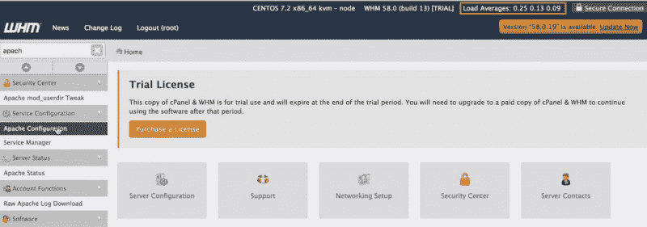

# 你肯定想优化你的网站的加载速度。以下是方法。

> 原文：<https://www.freecodecamp.org/news/website-loading-speed-optimization-in-2018-bananas-e66cc85df8dd/>

你还记得一个非常著名的星球大战模仿作品中的这个标志性场景吗？

当时，我们只是嘲笑这句话听起来有多荒谬——光速太慢了。但是技术进步如此之快，以至于媒体消费必须是即时的，否则人们不会喜欢它。耐心是亿万年前的美德。一切都要发生 ***现在*** 。

所以让我们来谈谈为什么你的网站必须以可笑的速度前进，否则你会失去业务。无论是在你的电子商务网站上，还是在你希望人们联系你的 B2B 网站上，甚至是你只是想让人们喜欢你的评论、生活小贴士或视频，速度都很重要。

1.  47%的消费者希望网页能在两秒或更短时间内加载。
2.  40%的互联网用户会放弃一个加载时间超过三秒的网站。
3.  73%的手机用户说他们遇到过网站加载太慢的情况。

所有用户的 40%。用数字来表示。如果你的网站只有 100 次浏览，但速度不够快，你就失去了 40 个潜在的顾客、读者或客户。

这里变得更加棘手。作为一个网站所有者，这甚至都不在你的掌握之中。例如，在手机上，许多人使用星巴克的免费 wifi、公共热点，甚至他们过时的 3G 互联网连接。

听起来有很多问题。但是作为网站所有者，你也可以做很多事情:

#### **检查您的主机提供商**

您在使用谁，您的服务器环境是什么样的？停止使用那些预算共享的环境。弄个专用 VPS！是的，这需要一点额外的费用，但是如果它能帮助你每天多留住 40%的用户，那么它会在一周内收回成本。

*如何更改主机:*

[https://www . webhostingsecretrevealed . net/blog/we B- hosting-guides/switching-we B- host/](https://www.webhostingsecretrevealed.net/blog/web-hosting-guides/switching-web-host/)

#### 你的网站建立在什么基础上？

代码非常混乱还是使用了过时的协议？考虑以一种更现代的方式重新设计来做像 React 这样的事情。JS 或者 WordPress。

*如何通过优雅的主题最小化 HTML、CSS 或 JavaScript:*

[https://www . elegantthemes . com/blog/tips-tricks/how-to-minify-your-websites-CSS-html-JavaScript](https://www.elegantthemes.com/blog/tips-tricks/how-to-minify-your-websites-css-html-javascript)

#### **任何图像都不应大于 100kb**

除非它有一个很好的理由，如要求一个透明的背景。如果你不需要透明的背景，改变所有的大。png，。bmp 和其他图像转换成。jpg 文件。

此外，不要直接从配有全高清摄像头的智能手机上传图片。首先将它们裁剪成较小的尺寸，比如 800x800。90%的图片不需要比那个大，除非你有全幅图片或者类似的设计元素。

*如何为互联网优化图片——通过优雅的主题:*

[https://www . elegantthemes . com/blog/tips-tricks/optimize-images-for-your-WordPress-website](https://www.elegantthemes.com/blog/tips-tricks/optimize-images-for-your-wordpress-website)

#### **缓存你(非常)大的网站**

如果你有一个很大的网站，里面有成百上千的产品、页面和帖子，你必须有一个缓存。缓存预先加载所有内容，以便更快地提供服务。想象一下，下载一张图片，然后查看它，相比之下，你的手机上已经有了。后者加载速度会快得多。

*完整的缓存教程——马克·诺丁汉:*

[https://www.mnot.net/cache_docs/](https://www.mnot.net/cache_docs/)

*如何安装&为 WordPress 设置 WP 超级缓存——WP 初学者:*

[**新手如何安装设置 WP 超级缓存**](http://www.wpbeginner.com/beginners-guide/how-to-install-and-setup-wp-super-cache-for-beginners/)
[*搜索引擎认为站点速度是搜索排名的重要因素。这就是为什么在 WP 初学者项目中我们会尽最大努力…*www.wpbeginner.com](http://www.wpbeginner.com/beginners-guide/how-to-install-and-setup-wp-super-cache-for-beginners/)

#### 如何测量速度

在这一点上，你肯定想知道你怎么知道你的网站有多快，对吗？因为用户的互联网可能不好。也许你的很棒。或者你可能会认为，因为你在美国的一个海岸上，基于你的服务器更近，它可能会更慢/更快。是的，你是对的——你永远无法 100%准确地衡量你的页面加载速度。但是有工具:

*   谷歌开发者页面速度洞察
*   GTMetrix.com
*   Webpagetest.org
*   如果你的主机有 WHM，你可以在右上角看到平均加载量。平均值以 1 分钟、5 分钟、15 分钟的平均值列出(下面的数字来自一个网站，该网站除了“hello world”之外没有什么内容)。

所以请记住:如果你的网站速度不够快，你就会失去访客。尽快提高装载速度。

**来源&阅读更多:**

[**6 个关键差异——“共享托管 vs. VPS 托管”(2018 指南)**](http://www.hostingadvice.com/how-to/shared-hosting-vs-vps-hosting/)
[*当智能手机在 21 世纪初接管时，数据使用量对许多家庭来说都是一飞冲天，包括我的……*www.hostingadvice.com](http://www.hostingadvice.com/how-to/shared-hosting-vs-vps-hosting/)[**加载时间影响你的底线**](https://blog.kissmetrics.com/loading-time/)
[*页面加载时间显然是任何网站用户体验的重要组成部分。很多时候，我们会让它滑向…*blog.kissmetrics.com](https://blog.kissmetrics.com/loading-time/)[**100+互联网统计&2018 年你应该知道的事实**](https://www.websitehostingrating.com/internet-statistics-facts-2018/)
[*现在是 2018 年，各类网站所有者——博主、公司和电子商务所有者——为未来 12 年做好准备…*www.websitehostingrating.com](https://www.websitehostingrating.com/internet-statistics-facts-2018/)[**页面加载速度如何影响跳出率？**](https://blog.littledata.io/2017/04/07/how-does-page-load-speed-affect-bounce-rate/)
[*我读过很多文章，阐述了更快的页面加载速度和更好的用户参与度之间的联系，但这些联系是有限的……*blog . little data . io](https://blog.littledata.io/2017/04/07/how-does-page-load-speed-affect-bounce-rate/)